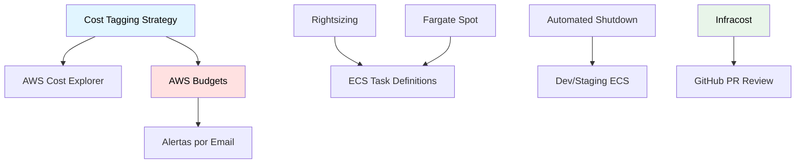

# Optimización de Costos Cloud

## Contexto

Este estándar define las prácticas para monitoreo, análisis y optimización continua de costos en AWS, incluyendo estrategia de tagging, presupuestos con alertas, rightsizing de recursos, uso de Fargate Spot y shutdown automatizado de ambientes no productivos. Complementa el lineamiento [Infraestructura como Código](../../lineamientos/operabilidad/infraestructura-como-codigo.md) y asegura visibilidad y control de costos sin comprometer disponibilidad ni rendimiento.

**Conceptos incluidos:**

- **Cost Tagging Strategy** → Etiquetado obligatorio para atribución de costos por servicio y equipo
- **Cost Monitoring** → AWS Budgets con alertas por umbral y proyección
- **Rightsizing** → Dimensionamiento correcto de CPU y memoria en ECS tasks
- **Fargate Spot** → Reducción de costos usando capacidad spot para workloads tolerantes a fallos
- **Automated Shutdown** → Apagado programado de ambientes no productivos

:::note Responsabilidad compartida con Plataforma y FinOps
Este estándar define los **requisitos de eficiencia de costos que los servicios deben cumplir** (tagging obligatorio, rightsizing, uso de Spot). El monitoreo centralizado de costos, los presupuestos AWS y las herramientas de análisis son gestionados por **Plataforma** en coordinación con **FinOps**. Consultar en **#platform-support**.
:::

---

## Stack Tecnológico

| Componente        | Tecnología        | Versión | Uso                                |
| ----------------- | ----------------- | ------- | ---------------------------------- |
| **IaC**           | Terraform         | 1.7+    | Provisioning y tagging de recursos |
| **Cost Estimate** | Infracost         | 0.10+   | Estimación de costos en PRs        |
| **Budgets**       | AWS Budgets       | -       | Alertas de gasto mensual           |
| **Cost Analysis** | AWS Cost Explorer | -       | Análisis y visualización de costos |
| **Capacity**      | AWS Fargate Spot  | -       | Capacidad spot para ECS tasks      |

---

## Relación entre Conceptos



---

## Cost Tagging Strategy

### ¿Qué es Cost Tagging?

Etiquetado obligatorio de todos los recursos AWS con metadatos de contexto para permitir atribución y análisis de costos por ambiente, servicio, equipo y proyecto.

**Propósito:** Sin tags consistentes, AWS Cost Explorer no puede desglosar costos por servicio o equipo.

```hcl
# Mandatory tags for all resources
locals {
  common_tags = {
    Environment = var.environment      # dev/staging/production
    ManagedBy   = "Terraform"          # Always Terraform
    Service     = var.service_name     # customer-service, order-service
    CostCenter  = var.cost_center      # Engineering, Marketing, Operations
    Owner       = var.owner_email      # team-email@talma.com
    Project     = var.project_name     # CustomerPlatform
  }
}

# Apply to all resources
resource "aws_ecs_cluster" "main" {
  # ...
  tags = local.common_tags
}
```

---

## Cost Monitoring

### AWS Budgets con Alertas

```hcl
# AWS Budgets
resource "aws_budgets_budget" "monthly" {
  name              = "${var.environment}-monthly-budget"
  budget_type       = "COST"
  limit_amount      = var.monthly_budget_limit
  limit_unit        = "USD"
  time_unit         = "MONTHLY"

  cost_filters = {
    TagKeyValue = "Environment$${var.environment}"
  }

  notification {
    comparison_operator        = "GREATER_THAN"
    threshold                  = 80
    threshold_type             = "PERCENTAGE"
    notification_type          = "ACTUAL"
    subscriber_email_addresses = [var.alert_email]
  }

  notification {
    comparison_operator        = "GREATER_THAN"
    threshold                  = 100
    threshold_type             = "PERCENTAGE"
    notification_type          = "FORECASTED"
    subscriber_email_addresses = [var.alert_email]
  }
}
```

**Umbrales recomendados:**

- **80% gasto real** → Alerta temprana para revisar consumo
- **100% proyectado** → Alerta preventiva antes de superar presupuesto

---

## Cost Optimization Techniques

### Rightsizing

```hcl
# ❌ Over-provisioned
resource "aws_ecs_task_definition" "service" {
  cpu    = 2048  # 2 vCPU (excesivo para low traffic service)
  memory = 4096  # 4 GB
}

# ✅ Right-sized (basado en métricas reales de CloudWatch)
resource "aws_ecs_task_definition" "service" {
  cpu    = 512   # 0.5 vCPU
  memory = 1024  # 1 GB
  # Costo: ~$15/mes vs $60/mes → ahorro: 75%
}
```

**Proceso de rightsizing:**

1. Revisar métricas de CPU y memoria en CloudWatch durante 2 semanas
2. Ajustar a P95 de uso + 20% de headroom
3. Aplicar cambio en staging primero
4. Verificar que no genere throttling ni OOM en producción

### Fargate Spot

```hcl
# ECS Capacity Provider con Fargate Spot
resource "aws_ecs_cluster_capacity_providers" "main" {
  cluster_name = aws_ecs_cluster.main.name

  capacity_providers = ["FARGATE_SPOT", "FARGATE"]

  default_capacity_provider_strategy {
    capacity_provider = "FARGATE_SPOT"
    weight            = 70  # 70% en spot (más barato, ~70% de descuento)
    base              = 0
  }

  default_capacity_provider_strategy {
    capacity_provider = "FARGATE"
    weight            = 30  # 30% en on-demand (más confiable)
    base              = 1   # Al menos 1 task on-demand siempre activa
  }
}
```

**Cuándo usar Fargate Spot:**

- ✅ Workloads tolerantes a interrupciones (batch jobs, workers)
- ✅ Ambientes dev y staging
- ⚠️ Servicios de producción: mezcla 70/30 con `base: 1` on-demand
- ❌ No usar 100% Spot en servicios críticos de producción

### Automated Shutdown (Dev/Staging)

```hcl
# Lambda para parar ECS tasks en horario nocturno (dev/staging)
# Savings: ~50% en ambientes no productivos
```

**Horario recomendado para dev/staging:**

- Apagar: lunes a viernes a las 22:00 (hora local)
- Encender: lunes a viernes a las 07:00 (hora local)
- Fin de semana: apagado completo

---

## Requisitos Técnicos

### MUST (Obligatorio)

**Tagging:**

- **MUST** aplicar tags obligatorios a todos los recursos: `Environment`, `ManagedBy`, `Service`, `CostCenter`, `Owner`, `Project`
- **MUST** usar `locals.common_tags` en módulos Terraform (no hardcodear tags por recurso)
- **MUST** configurar AWS Budgets con alerta al 80% (actual) y 100% (forecasted) para cada ambiente

**Visibilidad:**

- **MUST** activar AWS Cost Explorer en todas las cuentas
- **MUST** Infracost integrado en PRs que modifican infraestructura (bloqueante si incremento > 20%)

### SHOULD (Fuertemente recomendado)

- **SHOULD** revisar rightsizing de ECS tasks mensualmente con datos de CloudWatch P95
- **SHOULD** usar Fargate Spot con estrategia 70/30 en servicios que soporten interrupciones
- **SHOULD** implementar automated shutdown para todos los ambientes dev y staging
- **SHOULD** usar Reserved Instances / Savings Plans para workloads base predecibles (RDS, NAT Gateways)
- **SHOULD** revisar recursos no utilizados semanalmente (EIPs sin asociar, volúmenes huérfanos, snapshots antiguos)

### MAY (Opcional)

- **MAY** usar AWS Compute Optimizer para recomendaciones automáticas de rightsizing
- **MAY** configurar Lambda de apagado/encendido programado para ambientes dev/staging
- **MAY** usar Spot Instances para clusters de build y CI/CD runners

### MUST NOT (Prohibido)

- **MUST NOT** desplegar recursos en producción sin estimación de costo previa (Infracost)
- **MUST NOT** omitir tags en recursos AWS (Checkov falla el pipeline)
- **MUST NOT** usar CPU/memoria excesivos sin justificación en métricas reales
- **MUST NOT** dejar ambientes de testing activos permanentemente sin revisión de costos

---

## Referencias

- [AWS Cost Explorer](https://aws.amazon.com/aws-cost-management/aws-cost-explorer/) — gestión y visualización de costos AWS
- [AWS Budgets](https://aws.amazon.com/aws-cost-management/aws-budgets/) — alertas de presupuesto mensual por ambiente
- [AWS Compute Optimizer](https://aws.amazon.com/compute-optimizer/) — recomendaciones automáticas de rightsizing
- [Infracost — Cost estimation for Terraform](https://www.infracost.io/docs/) — estimación de costos en PRs de infraestructura
- [AWS Fargate Spot](https://aws.amazon.com/blogs/aws/aws-fargate-spot-now-generally-available/) — capacidad spot para reducción de costos en ECS
- [Cloud FinOps Foundation](https://www.finops.org/introduction/what-is-finops/) — principios y metodología FinOps
- [AWS Well-Architected — Cost Optimization](https://docs.aws.amazon.com/wellarchitected/latest/cost-optimization-pillar/welcome.html) — pilar de optimización de costos
- [Infraestructura como Código — Implementación](./iac-standards.md) — provisioning y tagging de recursos con Terraform
- [Redes Virtuales](./virtual-networks.md) — networking y recursos de red asociados a costos
- [Contenerización](./containerization.md) — contenedores ECS y estrategias Fargate Spot
