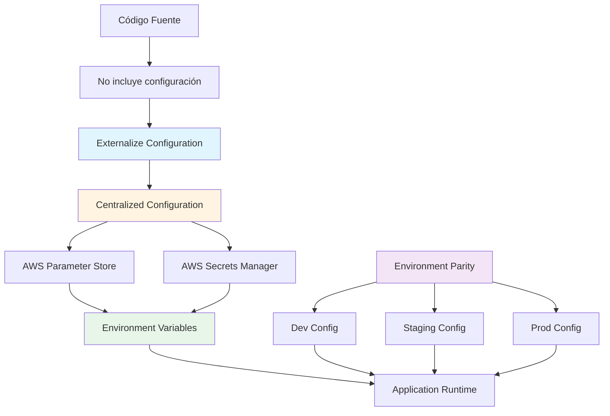

# Configuration Management

## Contexto

Este estándar define prácticas para gestión de configuración de aplicaciones, incluyendo externalización de configuración, uso de servicios centralizados, variables de entorno, y paridad entre ambientes (dev/staging/prod). Complementa el lineamiento [Infraestructura como Código](../../lineamientos/operabilidad/02-infraestructura-como-codigo.md) y el principio [XII-Factor App Config](https://12factor.net/config) asegurando configuración segura, flexible y mantenible.

**Conceptos incluidos:**

- **Externalize Configuration** → Separar config del código
- **Centralized Configuration** → Usar AWS Parameter Store / Secrets Manager
- **Environment Variables** → Inyección de config vía environment variables
- **Environment Parity** → Consistencia entre dev/staging/prod

---

## Stack Tecnológico

| Componente                | Tecnología                         | Versión | Uso                                  |
| ------------------------- | ---------------------------------- | ------- | ------------------------------------ |
| **Configuration Format**  | JSON, YAML                         | -       | Formato de archivos de configuración |
| **Centralized Config**    | AWS Parameter Store                | -       | Configuración no sensible            |
| **Secrets Management**    | AWS Secrets Manager                | -       | Configuración sensible (credentials) |
| **Runtime Injection**     | Environment Variables              | -       | Inyección en tiempo de ejecución     |
| **Config Library (.NET)** | Microsoft.Extensions.Configuration | .NET 8  | Configuración en ASP.NET Core        |
| **ECS Task Definition**   | AWS ECS Fargate                    | -       | Inyección de secrets en containers   |
| **IaC**                   | Terraform                          | 1.7+    | Provisioning de Parameter Store      |

---

## Conceptos Fundamentales

Este estándar cubre 4 prácticas relacionadas con gestión de configuración:

### Índice de Conceptos

1. **Externalize Configuration**: Separar configuración del código fuente
2. **Centralized Configuration**: Single source of truth para configuración
3. **Environment Variables**: Inyección de config a runtime
4. **Environment Parity**: Dev, staging y prod lo más similares posible

### Relación entre Conceptos



**Principios clave:**

1. **Separation of Concerns**: Config ≠ Code
2. **Security**: Secrets nunca en código o repositorio
3. **Flexibility**: Cambiar config sin recompilar
4. **Consistency**: Mismo mecanismo dev → staging → prod

---

## 1. Externalize Configuration

### ¿Qué es Externalize Configuration?

Práctica de separar toda la configuración (connection strings, API keys, feature flags, etc.) del código fuente, permitiendo cambios sin recompilar o redesplegar.

**Propósito:** Independencia entre código y configuración, facilitando despliegues en múltiples ambientes y cambios dinámicos.

**¿Qué debe externalizarse?**

- ✅ **Connection strings** (bases de datos, Redis, Kafka)
- ✅ **API keys y tokens**
- ✅ **URLs de servicios externos**
- ✅ **Feature flags**
- ✅ **Límites y umbrales** (timeouts, retry attempts, rate limits)
- ✅ **Secrets** (passwords, private keys, certificates)
- ✅ **Environment-specific values** (log level, batch size)

**¿Qué NO debe externalizarse?**

- ❌ **Valores constantes** que nunca cambian (ej. `MaxNameLength = 100`)
- ❌ **Lógica de negocio**
- ❌ **Defaults razonables** que aplican a todos los ambientes

**Beneficios:**
✅ Deploy same binary a dev/staging/prod
✅ Cambiar config sin recompilar
✅ Secrets no en código
✅ Facilita testing (config controlable)

### Ejemplo Comparativo

```csharp
// ❌ MALO: Hardcoded Configuration
public class CustomerService
{
    private readonly string _connectionString =
        "Host=prod-db.talma.com;Database=customers;User=admin;Password=P@ssw0rd123";

    private readonly int _retryAttempts = 3;
    private readonly int _timeoutSeconds = 30;

    public async Task<Customer> GetCustomerAsync(Guid id)
    {
        // Usa valores hardcoded
        using var connection = new NpgsqlConnection(_connectionString);
        // ...
    }
}

// Problemas:
// 1. Password expuesto en código
// 2. Imposible cambiar timeout sin recompilar
// 3. No se puede usar diferentes configs para dev/prod
// 4. Password en repositorio Git (security risk)
```

```csharp
// ✅ BUENO: Externalized Configuration
public class CustomerService
{
    private readonly IConfiguration _configuration;
    private readonly ILogger<CustomerService> _logger;

    public CustomerService(IConfiguration configuration, ILogger<CustomerService> logger)
    {
        _configuration = configuration;
        _logger = logger;
    }

    public async Task<Customer> GetCustomerAsync(Guid id)
    {
        // Config desde ambiente
        var connectionString = _configuration.GetConnectionString("CustomerDb");
        var retryAttempts = _configuration.GetValue<int>("Resilience:RetryAttempts");
        var timeoutSeconds = _configuration.GetValue<int>("Resilience:TimeoutSeconds");

        _logger.LogDebug("Using timeout: {Timeout}s, retries: {Retries}",
            timeoutSeconds, retryAttempts);

        using var connection = new NpgsqlConnection(connectionString);
        // ...
    }
}

// Beneficios:
// 1. Password en AWS Secrets Manager (no en código)
// 2. Cambiar timeout sin recompilar (Parameter Store)
// 3. Diferentes configs por ambiente
// 4. Código seguro para Git
```

### Jerarquía de Fuentes de Configuración (.NET)

ASP.NET Core carga configuración en este orden (último gana):

```csharp
// Program.cs
var builder = WebApplication.CreateBuilder(args);

// 1. appsettings.json (DEFAULT)
// 2. appsettings.{Environment}.json (ENVIRONMENT OVERRIDE)
// 3. User Secrets (solo Development)
// 4. Environment Variables (RUNTIME)
// 5. Command-line arguments (RUNTIME)

// Ejemplo de jerarquía:
// appsettings.json:          ConnectionStrings:CustomerDb = "Server=localhost;..."
// appsettings.Production.json: (no incluye connection string)
// Environment Variable:      ConnectionStrings__CustomerDb = "Host=prod-db;..."
// → Resultado en prod: usa Environment Variable
```

**Best practice: Jerarquía recomendada**

| Fuente                   | Uso                        | Contenido                                 |
| ------------------------ | -------------------------- | ----------------------------------------- |
| `appsettings.json`       | Defaults razonables        | Timeouts, retry attempts, log level DEBUG |
| `appsettings.{Env}.json` | Overrides por ambiente     | URLs, feature flags                       |
| AWS Parameter Store      | Config no sensible runtime | URLs de APIs, limites                     |
| AWS Secrets Manager      | Secrets                    | Connection strings, API keys              |
| Environment Variables    | Inyección final            | Todo lo anterior inyectado por ECS        |

### Setup en .NET 8

```csharp
// Program.cs
using Microsoft.Extensions.Configuration;

var builder = WebApplication.CreateBuilder(args);

// 1. Configuración base
builder.Configuration
    .AddJsonFile("appsettings.json", optional: false, reloadOnChange: true)
    .AddJsonFile($"appsettings.{builder.Environment.EnvironmentName}.json", optional: true)
    .AddEnvironmentVariables();

// 2. En Development: User Secrets
if (builder.Environment.IsDevelopment())
{
    builder.Configuration.AddUserSecrets<Program>();
}

// 3. AWS Parameter Store (opcional, para non-secrets config)
// Requiere: AWSSDK.Extensions.NETCore.Setup
builder.Configuration.AddSystemsManager("/customer-service");

var app = builder.Build();
app.Run();
```

### Ejemplo: appsettings.json vs Production

```json
// appsettings.json (defaults)
{
  "Logging": {
    "LogLevel": {
      "Default": "Information",
      "Microsoft.AspNetCore": "Warning"
    }
  },
  "ConnectionStrings": {
    "CustomerDb": "Host=localhost;Database=customers_dev;Username=dev;Password=dev"
  },
  "Resilience": {
    "RetryAttempts": 3,
    "TimeoutSeconds": 30,
    "CircuitBreakerThreshold": 5
  },
  "Features": {
    "EnableAdvancedSearch": false
  }
}
```

```json
// appsettings.Production.json (overrides mínimos)
{
  "Logging": {
    "LogLevel": {
      "Default": "Warning"
    }
  },
  "Features": {
    "EnableAdvancedSearch": true
  }
  // NOTE: NO incluye ConnectionStrings (viene de Secrets Manager)
}
```

---

## 2. Centralized Configuration

### ¿Qué es Centralized Configuration?

Uso de un servicio centralizado (AWS Parameter Store o Secrets Manager) como single source of truth para configuración, en lugar de archivos dispersos o hardcoded values.

**Propósito:** Gestión centralizada, auditable y segura de configuración cross-service.

**AWS Parameter Store vs Secrets Manager:**

| Característica    | Parameter Store        | Secrets Manager                    |
| ----------------- | ---------------------- | ---------------------------------- |
| **Uso**           | Config no sensible     | Secrets (passwords, keys)          |
| **Costo**         | Gratis (Standard tier) | $0.40/secret/mes + $0.05/10K calls |
| **Encryption**    | Opcional (KMS)         | Obligatorio (KMS)                  |
| **Auto-rotation** | No                     | Sí (para RDS, etc.)                |
| **Versioning**    | Sí                     | Sí                                 |
| **IAM Control**   | Sí                     | Sí                                 |

**Regla simple:**

- **Secrets Manager**: Passwords, API keys, tokens, certificates
- **Parameter Store**: Todo lo demás (URLs, timeouts, feature flags)

**Beneficios:**
✅ Single source of truth
✅ No secrets en código
✅ Auditoría completa (CloudTrail)
✅ Rotación automática de secrets
✅ Control granular de acceso (IAM)
✅ Cambios sin redeploy

### Naming Convention para Parameter Store

```
/{service-name}/{environment}/{category}/{parameter-name}

Ejemplos:
/customer-service/production/database/host
/customer-service/production/database/port
/customer-service/production/resilience/retry-attempts
/customer-service/production/features/enable-advanced-search
/customer-service/staging/database/host
```

**Ventajas:**

- Organización clara
- Fácil filtrado (GetParametersByPath)
- IAM policies específicas por ambiente

### Provisioning con Terraform

```hcl
# terraform/modules/parameter-store/main.tf

# Non-sensitive configuration
resource "aws_ssm_parameter" "database_host" {
  name  = "/${var.service_name}/${var.environment}/database/host"
  type  = "String"
  value = var.database_host

  tags = {
    Service     = var.service_name
    Environment = var.environment
    ManagedBy   = "Terraform"
  }
}

resource "aws_ssm_parameter" "retry_attempts" {
  name  = "/${var.service_name}/${var.environment}/resilience/retry-attempts"
  type  = "String"
  value = "3"

  tags = {
    Service     = var.service_name
    Environment = var.environment
    ManagedBy   = "Terraform"
  }
}

# Sensitive configuration (with encryption)
resource "aws_ssm_parameter" "database_password" {
  name   = "/${var.service_name}/${var.environment}/database/password"
  type   = "SecureString"  # Encrypted with KMS
  value  = random_password.db_password.result
  key_id = aws_kms_key.parameter_store.id

  tags = {
    Service     = var.service_name
    Environment = var.environment
    ManagedBy   = "Terraform"
  }
}
```

### Provisioning Secrets Manager

```hcl
# terraform/modules/secrets-manager/main.tf

# Database credentials
resource "aws_secretsmanager_secret" "customer_db" {
  name = "${var.service_name}/${var.environment}/database/credentials"

  tags = {
    Service     = var.service_name
    Environment = var.environment
    ManagedBy   = "Terraform"
  }
}

resource "aws_secretsmanager_secret_version" "customer_db" {
  secret_id = aws_secretsmanager_secret.customer_db.id

  # JSON format para múltiples valores
  secret_string = jsonencode({
    username = "customer_svc"
    password = random_password.db_password.result
    host     = aws_db_instance.customer_db.address
    port     = aws_db_instance.customer_db.port
    dbname   = aws_db_instance.customer_db.db_name
  })
}

# External API key
resource "aws_secretsmanager_secret" "external_api_key" {
  name = "${var.service_name}/${var.environment}/apis/external-service-key"

  tags = {
    Service     = var.service_name
    Environment = var.environment
    ManagedBy   = "Terraform"
  }
}

resource "aws_secretsmanager_secret_version" "external_api_key" {
  secret_id     = aws_secretsmanager_secret.external_api_key.id
  secret_string = var.external_api_key  # Provisto vía variable (no en Git)
}
```

### IAM Policy para ECS Task

```hcl
# terraform/modules/ecs/iam.tf

# IAM role para ECS Task
resource "aws_iam_role" "ecs_task_role" {
  name = "${var.service_name}-${var.environment}-task-role"

  assume_role_policy = jsonencode({
    Version = "2012-10-17"
    Statement = [{
      Effect = "Allow"
      Principal = {
        Service = "ecs-tasks.amazonaws.com"
      }
      Action = "sts:AssumeRole"
    }]
  })
}

# Policy para leer Parameter Store
resource "aws_iam_role_policy" "parameter_store_read" {
  role = aws_iam_role.ecs_task_role.id

  policy = jsonencode({
    Version = "2012-10-17"
    Statement = [{
      Effect = "Allow"
      Action = [
        "ssm:GetParameter",
        "ssm:GetParameters",
        "ssm:GetParametersByPath"
      ]
      Resource = "arn:aws:ssm:${var.aws_region}:${var.aws_account_id}:parameter/${var.service_name}/${var.environment}/*"
    }]
  })
}

# Policy para leer Secrets Manager
resource "aws_iam_role_policy" "secrets_manager_read" {
  role = aws_iam_role.ecs_task_role.id

  policy = jsonencode({
    Version = "2012-10-17"
    Statement = [{
      Effect = "Allow"
      Action = [
        "secretsmanager:GetSecretValue"
      ]
      Resource = "arn:aws:secretsmanager:${var.aws_region}:${var.aws_account_id}:secret:${var.service_name}/${var.environment}/*"
    }]
  })
}

# Policy para KMS (decrypt)
resource "aws_iam_role_policy" "kms_decrypt" {
  role = aws_iam_role.ecs_task_role.id

  policy = jsonencode({
    Version = "2012-10-17"
    Statement = [{
      Effect = "Allow"
      Action = [
        "kms:Decrypt"
      ]
      Resource = aws_kms_key.secrets.arn
    }]
  })
}
```

### Leer Configuration desde .NET

```csharp
// 1. Usando AWS SDK Extensions (recomendado)
// NuGet: AWSSDK.Extensions.NETCore.Setup

// Program.cs
using Amazon.Extensions.NETCore.Setup;

var builder = WebApplication.CreateBuilder(args);

builder.Configuration.AddSystemsManager(configureSource =>
{
    configureSource.Path = $"/customer-service/{builder.Environment.EnvironmentName}";
    configureSource.ReloadAfter = TimeSpan.FromMinutes(5);  // Reload periódico
});

// 2. Leer desde código
var retryAttempts = builder.Configuration.GetValue<int>("resilience:retry-attempts");
var dbHost = builder.Configuration["database:host"];

// 3. Binding a clase fuertemente tipada
builder.Services.Configure<ResilienceSettings>(
    builder.Configuration.GetSection("resilience"));

public class ResilienceSettings
{
    public int RetryAttempts { get; set; }
    public int TimeoutSeconds { get; set; }
    public int CircuitBreakerThreshold { get; set; }
}

// Inyectar en servicio
public class CustomerService
{
    private readonly ResilienceSettings _settings;

    public CustomerService(IOptions<ResilienceSettings> settings)
    {
        _settings = settings.Value;
    }
}
```

### Leer Secrets Manager desde .NET

```csharp
// NuGet: AWSSDK.SecretsManager

using Amazon.SecretsManager;
using Amazon.SecretsManager.Model;
using System.Text.Json;

public class SecretsService
{
    private readonly IAmazonSecretsManager _secretsManager;

    public SecretsService(IAmazonSecretsManager secretsManager)
    {
        _secretsManager = secretsManager;
    }

    public async Task<DatabaseCredentials> GetDatabaseCredentialsAsync()
    {
        var request = new GetSecretValueRequest
        {
            SecretId = "customer-service/production/database/credentials"
        };

        var response = await _secretsManager.GetSecretValueAsync(request);

        return JsonSerializer.Deserialize<DatabaseCredentials>(response.SecretString);
    }
}

public record DatabaseCredentials(
    string Username,
    string Password,
    string Host,
    int Port,
    string Dbname
);

// Uso en Startup
var secretsService = app.Services.GetRequiredService<SecretsService>();
var dbCreds = await secretsService.GetDatabaseCredentialsAsync();

var connectionString = $"Host={dbCreds.Host};Port={dbCreds.Port};Database={dbCreds.Dbname};Username={dbCreds.Username};Password={dbCreds.Password}";
```

---

## 3. Environment Variables

### ¿Qué son Environment Variables?

Variables del sistema operativo que se inyectan al proceso de la aplicación en tiempo de ejecución, permitiendo configuración dinámica sin modificar archivos.

**Propósito:** Mecanismo de inyección de configuración compatible con 12-Factor App y contenedores.

**Formato en .NET:**

```bash
# Flat structure (estándar Unix)
DATABASE_HOST=prod-db.talma.com
DATABASE_PORT=5432

# Hierarchical structure (separador: __)
ConnectionStrings__CustomerDb="Host=prod-db;..."
Resilience__RetryAttempts=3
Features__EnableAdvancedSearch=true
```

**ASP.NET Core automáticamente mapea:**

- `ConnectionStrings__CustomerDb` → `Configuration["ConnectionStrings:CustomerDb"]`
- `Resilience__RetryAttempts` → `Configuration["Resilience:RetryAttempts"]`

**Beneficios:**
✅ Standard mechanism (12-Factor)
✅ Compatible con Docker/ECS
✅ Override fácil de cualquier config
✅ No requiere archivos adicionales

### Ejemplo: Docker Compose (Development)

```yaml
# docker-compose.yml
version: "3.8"

services:
  customer-api:
    image: customer-service:latest
    ports:
      - "8080:80"
    environment:
      # ASP.NET Core
      - ASPNETCORE_ENVIRONMENT=Development
      - ASPNETCORE_URLS=http://+:80

      # Database
      - ConnectionStrings__CustomerDb=Host=postgres;Database=customers_dev;Username=dev;Password=dev

      # Resilience
      - Resilience__RetryAttempts=3
      - Resilience__TimeoutSeconds=30

      # Features
      - Features__EnableAdvancedSearch=false

      # Logging
      - Logging__LogLevel__Default=Debug

    depends_on:
      - postgres
      - redis

  postgres:
    image: postgres:15
    environment:
      - POSTGRES_DB=customers_dev
      - POSTGRES_USER=dev
      - POSTGRES_PASSWORD=dev
    ports:
      - "5432:5432"

  redis:
    image: redis:7
    ports:
      - "6379:6379"
```

### Ejemplo: ECS Task Definition (Production)

```hcl
# terraform/modules/ecs/task-definition.tf

resource "aws_ecs_task_definition" "customer_service" {
  family                   = "${var.service_name}-${var.environment}"
  requires_compatibilities = ["FARGATE"]
  network_mode             = "awsvpc"
  cpu                      = "512"
  memory                   = "1024"
  task_role_arn            = aws_iam_role.ecs_task_role.arn
  execution_role_arn       = aws_iam_role.ecs_execution_role.arn

  container_definitions = jsonencode([{
    name  = "customer-api"
    image = "${var.ecr_repository_url}:${var.image_tag}"

    portMappings = [{
      containerPort = 80
      protocol      = "tcp"
    }]

    # Environment variables (non-sensitive)
    environment = [
      {
        name  = "ASPNETCORE_ENVIRONMENT"
        value = title(var.environment)  # Production, Staging, etc.
      },
      {
        name  = "ASPNETCORE_URLS"
        value = "http://+:80"
      },
      {
        name  = "Resilience__RetryAttempts"
        value = "3"
      },
      {
        name  = "Resilience__TimeoutSeconds"
        value = "30"
      },
      {
        name  = "Features__EnableAdvancedSearch"
        value = "true"
      }
    ]

    # Secrets from Secrets Manager (sensitive)
    secrets = [
      {
        name      = "ConnectionStrings__CustomerDb"
        valueFrom = "${aws_secretsmanager_secret.customer_db.arn}:connectionString::"
      },
      {
        name      = "ExternalApi__ApiKey"
        valueFrom = aws_secretsmanager_secret.external_api_key.arn
      }
    ]

    # Logging
    logConfiguration = {
      logDriver = "awslogs"
      options = {
        "awslogs-group"         = "/ecs/${var.service_name}"
        "awslogs-region"        = var.aws_region
        "awslogs-stream-prefix" = "ecs"
      }
    }
  }])
}
```

**Nota importante:** `secrets` en ECS Task Definition inyecta valores de Secrets Manager como environment variables de forma segura (no aparecen en logs ni en task definition visible).

### Ejemplo: Secrets estructurados en JSON

Si el secret es JSON (como database credentials):

```json
// Secrets Manager value
{
  "username": "customer_svc",
  "password": "SecureP@ss123",
  "host": "prod-db.talma.com",
  "port": 5432,
  "dbname": "customers"
}
```

Construir connection string desde múltiples secrets:

```hcl
# Opción 1: Secret con connection string pre-construido
resource "aws_secretsmanager_secret_version" "customer_db" {
  secret_id = aws_secretsmanager_secret.customer_db.id

  secret_string = jsonencode({
    connectionString = "Host=${aws_db_instance.customer_db.address};Port=${aws_db_instance.customer_db.port};Database=${aws_db_instance.customer_db.db_name};Username=customer_svc;Password=${random_password.db_password.result}"
  })
}

# ECS Task Definition
secrets = [
  {
    name      = "ConnectionStrings__CustomerDb"
    valueFrom = "${aws_secretsmanager_secret.customer_db.arn}:connectionString::"
  }
]
```

---

## 4. Environment Parity

### ¿Qué es Environment Parity?

Principio de mantener ambientes de desarrollo, staging y producción lo más similares posible para minimizar sorpresas en deployment.

**Propósito:** "Works on my machine" → "Works everywhere" (reducir discrepancias dev vs prod).

**XII-Factor: Dev/Prod Parity**

Minimizar gaps en:

1. **Time gap**: Deploy frecuente (horas, no meses)
2. **Personnel gap**: Developers involucrados en deployment
3. **Tools gap**: Mismas tecnologías dev/staging/prod

**Beneficios:**
✅ Menos bugs "solo en prod"
✅ Confidence en deployments
✅ Faster debugging
✅ Continuous deployment viable

### Dimensiones de Paridad

| Dimensión         | Dev                    | Staging                 | Production              | Paridad                |
| ----------------- | ---------------------- | ----------------------- | ----------------------- | ---------------------- |
| **Base de Datos** | PostgreSQL 15 (Docker) | PostgreSQL 15 (RDS)     | PostgreSQL 15 (RDS)     | ✅ Misma versión       |
| **Cache**         | Redis 7 (Docker)       | Redis 7 (ElastiCache)   | Redis 7 (ElastiCache)   | ✅ Misma versión       |
| **Messaging**     | Kafka 3.6 (Docker)     | Kafka 3.6 (EC2 cluster) | Kafka 3.6 (EC2 cluster) | ✅ Misma versión       |
| **Runtime**       | .NET 8 (local)         | .NET 8 (ECS Fargate)    | .NET 8 (ECS Fargate)    | ✅ Misma versión       |
| **Container**     | Docker 24              | Docker 24 (ECS)         | Docker 24 (ECS)         | ✅ Misma imagen        |
| **Secrets**       | docker-compose env     | AWS Secrets Manager     | AWS Secrets Manager     | ⚠️ Diferente mecanismo |
| **Networking**    | localhost              | VPC privada             | VPC privada             | ⚠️ Diferente topología |
| **Observability** | Console logs           | Grafana Stack           | Grafana Stack           | ⚠️ Dev simplified      |

**Objetivo: 80-90% paridad** (100% imposible y no necesario)

### Antipatrón: SQLite en Dev, PostgreSQL en Prod

```csharp
// ❌ ANTIPATRÓN: Diferentes bases de datos
// appsettings.Development.json
{
  "ConnectionStrings": {
    "CustomerDb": "Data Source=customers.db"  // SQLite
  }
}

// appsettings.Production.json
{
  "ConnectionStrings": {
    "CustomerDb": "Host=prod-db;..."  // PostgreSQL
  }
}

// Problemas:
// 1. Queries funcionan en SQLite pero fallan en PostgreSQL (sintaxis diferente)
// 2. Constraints diferentes (foreign keys, etc.)
// 3. Performance characteristics completamente distintas
// 4. Bug encontrado en prod, no reproducible en dev
```

### Best Practice: Same DB Engine con Docker

```yaml
# docker-compose.yml (Development)
version: "3.8"

services:
  postgres:
    image: postgres:15 # Misma versión que RDS en prod
    environment:
      POSTGRES_DB: customers_dev
      POSTGRES_USER: dev
      POSTGRES_PASSWORD: dev
    ports:
      - "5432:5432"
    volumes:
      - postgres_data:/var/lib/postgresql/data

volumes:
  postgres_data:
```

```csharp
// appsettings.Development.json (apunta a Docker)
{
  "ConnectionStrings": {
    "CustomerDb": "Host=localhost;Database=customers_dev;Username=dev;Password=dev"
  }
}
```

**Resultado:** Misma versión PostgreSQL 15 en dev/staging/prod ✅

### Environment-Specific Differences (Acceptable)

Algunas diferencias son aceptables/necesarias:

| Aspecto             | Dev                   | Prod                  | Justificación                         |
| ------------------- | --------------------- | --------------------- | ------------------------------------- |
| **Log Level**       | Debug                 | Warning               | Dev necesita más detalle              |
| **Data Volume**     | Subset pequeño        | Full dataset          | Dev no necesita millones de registros |
| **Resource Limits** | CPU: 2 core, RAM: 4GB | CPU: 4 core, RAM: 8GB | Prod necesita más capacidad           |
| **Replication**     | Single instance       | Multi-AZ replica      | Prod necesita HA                      |
| **Backups**         | No automated          | Daily snapshots       | Prod necesita disaster recovery       |

**Regla:** Diferencias deben ser **quantitative** (scale), no **qualitative** (technology).

### Configuration Consistent Structure

```bash
# Estructura de configuración idéntica dev/staging/prod

# Development (docker-compose)
ConnectionStrings__CustomerDb=Host=localhost;Database=customers_dev;...
Resilience__RetryAttempts=3
Features__EnableAdvancedSearch=false

# Staging (ECS Task Definition)
ConnectionStrings__CustomerDb=Host=staging-db;Database=customers_staging;...
Resilience__RetryAttempts=3
Features__EnableAdvancedSearch=true

# Production (ECS Task Definition)
ConnectionStrings__CustomerDb=Host=prod-db;Database=customers;...
Resilience__RetryAttempts=3
Features__EnableAdvancedSearch=true
```

**Keys idénticos, valores diferentes** → Fácil validación

### Parity Checklist

```markdown
# Environment Parity Checklist

## Infrastructure

- [ ] **Database**: Misma versión PostgreSQL (15) en dev/staging/prod
- [ ] **Cache**: Misma versión Redis (7) en dev/staging/prod
- [ ] **Messaging**: Misma versión Kafka (3.6) en dev/staging/prod
- [ ] **Container Runtime**: Docker 24+ en todos lados

## Runtime

- [ ] **.NET Version**: .NET 8 en todos los ambientes
- [ ] **Base Images**: Misma imagen base (mcr.microsoft.com/dotnet/aspnet:8.0)
- [ ] **Environment Variables**: Mismos keys (valores diferentes OK)

## Configuration

- [ ] **Config Structure**: Misma jerarquía de settings
- [ ] **Secrets Mechanism**: AWS Secrets Manager en staging/prod (env vars en dev OK)
- [ ] **Feature Flags**: Consistentemente definidos (valores diferentes OK)

## Testing

- [ ] **Integration Tests**: Usan Testcontainers con mismas versiones
- [ ] **E2E Tests**: Corren contra staging antes de prod deployment
- [ ] **Smoke Tests**: Mismos tests en staging y prod post-deployment

## Observability

- [ ] **Logging Format**: Structured JSON logs (Serilog) en todos lados
- [ ] **Metrics**: OpenTelemetry instrumentado igual
- [ ] **Tracing**: Distributed tracing habilitado

## Deployment

- [ ] **CI/CD Pipeline**: GitHub Actions mismo workflow para staging/prod
- [ ] **Container Images**: Misma imagen promovida dev → staging → prod (tag diferente)
- [ ] **Rollout Strategy**: Blue-green deployment en staging y prod
```

---

## Implementación Integrada

### Ejemplo Completo: Customer Service Configuration

#### 1. Terraform: Provisioning de Config

```hcl
# terraform/environments/production/main.tf

module "configuration" {
  source = "../../modules/configuration"

  service_name = "customer-service"
  environment  = "production"
  aws_region   = "us-east-1"

  # Non-sensitive config (Parameter Store)
  parameters = {
    "database/host" = aws_db_instance.customer_db.address
    "database/port" = aws_db_instance.customer_db.port
    "database/name" = "customers"

    "resilience/retry-attempts"        = "3"
    "resilience/timeout-seconds"       = "30"
    "resilience/circuit-breaker-threshold" = "5"

    "features/enable-advanced-search"  = "true"
    "features/enable-cache"            = "true"

    "cache/host" = aws_elasticache_cluster.redis.cache_nodes[0].address
    "cache/port" = "6379"
  }

  # Sensitive config (Secrets Manager)
  secrets = {
    "database/credentials" = jsonencode({
      username = "customer_svc"
      password = random_password.db_password.result
      host     = aws_db_instance.customer_db.address
      port     = aws_db_instance.customer_db.port
      dbname   = "customers"
    })

    "external-api/api-key" = var.external_api_key
  }
}

# terraform/modules/configuration/main.tf
resource "aws_ssm_parameter" "parameters" {
  for_each = var.parameters

  name  = "/${var.service_name}/${var.environment}/${each.key}"
  type  = "String"
  value = each.value

  tags = {
    Service     = var.service_name
    Environment = var.environment
    ManagedBy   = "Terraform"
  }
}

resource "aws_secretsmanager_secret" "secrets" {
  for_each = var.secrets

  name = "${var.service_name}/${var.environment}/${each.key}"

  tags = {
    Service     = var.service_name
    Environment = var.environment
    ManagedBy   = "Terraform"
  }
}

resource "aws_secretsmanager_secret_version" "secrets" {
  for_each = var.secrets

  secret_id     = aws_secretsmanager_secret.secrets[each.key].id
  secret_string = each.value
}
```

#### 2. ECS Task Definition: Inject Config

```hcl
# terraform/modules/ecs/task-definition.tf

resource "aws_ecs_task_definition" "customer_service" {
  family = "${var.service_name}-${var.environment}"
  # ... (config anterior)

  container_definitions = jsonencode([{
    name  = "customer-api"
    image = "${var.ecr_repository_url}:${var.image_tag}"

    # Environment variables desde Parameter Store
    environment = [
      { name = "ASPNETCORE_ENVIRONMENT", value = title(var.environment) },
      { name = "Resilience__RetryAttempts", value = "3" },
      { name = "Resilience__TimeoutSeconds", value = "30" },
      { name = "Resilience__CircuitBreakerThreshold", value = "5" },
      { name = "Features__EnableAdvancedSearch", value = "true" },
      { name = "Features__EnableCache", value = "true" },
      { name = "Cache__Host", value = data.aws_ssm_parameter.cache_host.value },
      { name = "Cache__Port", value = "6379" }
    ]

    # Secrets desde Secrets Manager
    secrets = [
      {
        name      = "ConnectionStrings__CustomerDb"
        valueFrom = "${data.aws_secretsmanager_secret.db_credentials.arn}:connectionString::"
      },
      {
        name      = "ExternalApi__ApiKey"
        valueFrom = data.aws_secretsmanager_secret.external_api_key.arn
      }
    ]
  }])
}

# Fetch parameters para environment variables
data "aws_ssm_parameter" "cache_host" {
  name = "/${var.service_name}/${var.environment}/cache/host"
}

data "aws_secretsmanager_secret" "db_credentials" {
  name = "${var.service_name}/${var.environment}/database/credentials"
}

data "aws_secretsmanager_secret" "external_api_key" {
  name = "${var.service_name}/${var.environment}/external-api/api-key"
}
```

#### 3. .NET Application: Consume Config

```csharp
// Program.cs
using Microsoft.Extensions.Configuration;

var builder = WebApplication.CreateBuilder(args);

// 1. Configuration sources
builder.Configuration
    .AddJsonFile("appsettings.json", optional: false, reloadOnChange: true)
    .AddJsonFile($"appsettings.{builder.Environment.EnvironmentName}.json", optional: true)
    .AddEnvironmentVariables();

// 2. Strongly-typed settings
builder.Services.Configure<ResilienceSettings>(
    builder.Configuration.GetSection("Resilience"));
builder.Services.Configure<FeatureSettings>(
    builder.Configuration.GetSection("Features"));

// 3. Database connection
var connectionString = builder.Configuration.GetConnectionString("CustomerDb");
builder.Services.AddDbContext<CustomerDbContext>(options =>
    options.UseNpgsql(connectionString));

// 4. Redis cache
var cacheHost = builder.Configuration["Cache:Host"];
var cachePort = builder.Configuration.GetValue<int>("Cache:Port");
builder.Services.AddStackExchangeRedisCache(options =>
{
    options.Configuration = $"{cacheHost}:{cachePort}";
});

var app = builder.Build();
app.Run();
```

```csharp
// Settings/ResilienceSettings.cs
public class ResilienceSettings
{
    public int RetryAttempts { get; set; } = 3;
    public int TimeoutSeconds { get; set; } = 30;
    public int CircuitBreakerThreshold { get; set; } = 5;
}

// Settings/FeatureSettings.cs
public class FeatureSettings
{
    public bool EnableAdvancedSearch { get; set; }
    public bool EnableCache { get; set; } = true;
}
```

```csharp
// Services/CustomerService.cs
using Microsoft.Extensions.Options;

public class CustomerService
{
    private readonly CustomerDbContext _context;
    private readonly IDistributedCache _cache;
    private readonly ResilienceSettings _resilience;
    private readonly FeatureSettings _features;
    private readonly ILogger<CustomerService> _logger;

    public CustomerService(
        CustomerDbContext context,
        IDistributedCache cache,
        IOptions<ResilienceSettings> resilience,
        IOptions<FeatureSettings> features,
        ILogger<CustomerService> logger)
    {
        _context = context;
        _cache = cache;
        _resilience = resilience.Value;
        _features = features.Value;
        _logger = logger;
    }

    public async Task<Customer?> GetCustomerAsync(Guid id)
    {
        // Feature flag: cache
        if (_features.EnableCache)
        {
            var cacheKey = $"customer:{id}";
            var cached = await _cache.GetStringAsync(cacheKey);
            if (cached != null)
            {
                _logger.LogDebug("Cache hit for customer {CustomerId}", id);
                return JsonSerializer.Deserialize<Customer>(cached);
            }
        }

        // Resilience: retry + timeout
        var policy = Policy
            .Handle<NpgsqlException>()
            .WaitAndRetryAsync(_resilience.RetryAttempts, retryAttempt =>
                TimeSpan.FromSeconds(Math.Pow(2, retryAttempt)))
            .WrapAsync(Policy.TimeoutAsync(TimeSpan.FromSeconds(_resilience.TimeoutSeconds)));

        var customer = await policy.ExecuteAsync(async () =>
            await _context.Customers.FindAsync(id));

        // Cache result
        if (customer != null && _features.EnableCache)
        {
            await _cache.SetStringAsync(
                $"customer:{id}",
                JsonSerializer.Serialize(customer),
                new DistributedCacheEntryOptions { AbsoluteExpirationRelativeToNow = TimeSpan.FromMinutes(5) });
        }

        return customer;
    }
}
```

#### 4. Local Development: docker-compose

```yaml
# docker-compose.yml
version: "3.8"

services:
  customer-api:
    build: .
    ports:
      - "8080:80"
    environment:
      - ASPNETCORE_ENVIRONMENT=Development
      - ConnectionStrings__CustomerDb=Host=postgres;Database=customers_dev;Username=dev;Password=dev
      - Cache__Host=redis
      - Cache__Port=6379
      - Resilience__RetryAttempts=3
      - Resilience__TimeoutSeconds=30
      - Features__EnableAdvancedSearch=false
      - Features__EnableCache=true
    depends_on:
      - postgres
      - redis

  postgres:
    image: postgres:15
    environment:
      POSTGRES_DB: customers_dev
      POSTGRES_USER: dev
      POSTGRES_PASSWORD: dev
    ports:
      - "5432:5432"

  redis:
    image: redis:7
    ports:
      - "6379:6379"
```

---

## Requisitos Técnicos

### MUST (Obligatorio)

**Externalize Configuration:**

- **MUST** externalizar toda configuración environment-specific (URLs, connection strings, feature flags)
- **MUST** nunca incluir secrets en código fuente o repositorio Git
- **MUST** usar `appsettings.json` solo para defaults razonables
- **MUST** soportar override vía environment variables

**Centralized Configuration:**

- **MUST** usar AWS Parameter Store para configuración non-sensitive
- **MUST** usar AWS Secrets Manager para secrets (passwords, API keys, tokens)
- **MUST** provisionar configuración vía Terraform (IaC)
- **MUST** usar IAM policies para control de acceso a configuración

**Environment Variables:**

- **MUST** inyectar configuración vía environment variables en runtime
- **MUST** usar naming convention hierarchical (`Section__SubSection__Key`)
- **MUST** documentar todas las environment variables requeridas en README

**Environment Parity:**

- **MUST** usar misma versión de base de datos en dev/staging/prod (PostgreSQL 15)
- **MUST** usar misma versión de .NET en todos los ambientes (.NET 8)
- **MUST** usar Docker containers para dependencies en desarrollo
- **MUST** promover misma imagen Docker desde staging a producción (tag diferente)

### SHOULD (Fuertemente recomendado)

- **SHOULD** usar strongly-typed configuration classes en .NET
- **SHOULD** validar configuración al startup (fail fast si config inválida)
- **SHOULD** usar mismo mecanismo de secrets dev/staging/prod (Secrets Manager)
- **SHOULD** implementar reload configuration sin restart (où posible)
- **SHOULD** documentar diferencias aceptables entre ambientes
- **SHOULD** usar feature flags para habilitar/deshabilitar funcionalidad en runtime

### MAY (Opcional)

- **MAY** usar AWS AppConfig para configuración dinámica avanzada
- **MAY** implementar configuration versioning (rollback a versión anterior)
- **MAY** usar AWS Systems Manager Session Manager para acceso seguro a instancias
- **MAY** encriptar Parameter Store values con KMS custom keys

### MUST NOT (Prohibido)

- **MUST NOT** incluir secrets en appsettings.json o archivos de configuración
- **MUST NOT** usar diferentes tecnologías de base de datos entre ambientes (SQLite dev, PostgreSQL prod)
- **MUST NOT** hardcodear URLs, passwords, API keys en código
- **MUST NOT** usar archivos de configuración environment-specific versionados en Git con secrets

---

## Referencias

**XII-Factor App:**

- [III. Config](https://12factor.net/config)
- [X. Dev/prod parity](https://12factor.net/dev-prod-parity)

**AWS Documentation:**

- [AWS Parameter Store](https://docs.aws.amazon.com/systems-manager/latest/userguide/systems-manager-parameter-store.html)
- [AWS Secrets Manager](https://docs.aws.amazon.com/secretsmanager/latest/userguide/)
- [ECS Task Definition Secrets](https://docs.aws.amazon.com/AmazonECS/latest/developerguide/specifying-sensitive-data-secrets.html)

**.NET Configuration:**

- [Configuration in ASP.NET Core](https://docs.microsoft.com/en-us/aspnet/core/fundamentals/configuration/)
- [Options pattern](https://docs.microsoft.com/en-us/aspnet/core/fundamentals/configuration/options)

**Relacionados:**

- [Infrastructure as Code](./infrastructure-as-code.md)
- [Secrets Management](../seguridad/secrets-key-management.md)
- [Containerization](./containerization.md)

---

**Última actualización**: 19 de febrero de 2026
**Responsable**: Equipo de Arquitectura
