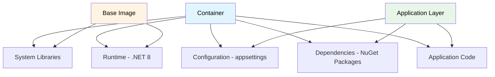

# Contenerización

## Contexto

Este estándar define las prácticas para contenerización de aplicaciones usando Docker: construcción de imágenes, optimización, seguridad, registro y despliegue en AWS ECS Fargate. Complementa el lineamiento [Infraestructura como Código](../../lineamientos/operabilidad/infraestructura-como-codigo.md).

**Conceptos incluidos:**

- **Dockerfile Best Practices** → Construcción optimizada de imágenes
- **Multi-stage Builds** → Reducción de tamaño de imágenes
- **Image Security** → Escaneo de vulnerabilidades y hardening
- **Container Registry** → Gestión en GitHub Container Registry
- **ECS Fargate Deployment** → Despliegue en AWS ECS

---

## Stack Tecnológico

| Componente            | Tecnología                        | Versión    | Uso                                                                  |
| --------------------- | --------------------------------- | ---------- | -------------------------------------------------------------------- |
| **Container Runtime** | Docker                            | 24.0+      | Construcción y ejecución                                             |
| **Base Images**       | mcr.microsoft.com/dotnet (alpine) | 8.0-alpine | Imágenes oficiales de .NET (Alpine preferido; slim como alternativa) |
| **Registry**          | GitHub Container Registry         | -          | Almacenamiento de imágenes                                           |
| **Orchestration**     | AWS ECS Fargate                   | -          | Despliegue serverless                                                |
| **Security Scanning** | Trivy                             | 0.50+      | Escaneo de vulnerabilidades                                          |
| **CI/CD**             | GitHub Actions                    | -          | Automated build y push                                               |

---

## ¿Qué es la Contenerización?

Empaquetado de aplicaciones con sus dependencias en unidades aisladas y portables (contenedores) que pueden ejecutarse consistentemente en cualquier entorno.

**Propósito:** Consistencia entre desarrollo, staging y producción; despliegues reproducibles; aislamiento de dependencias.

**Beneficios:**
✅ **Portabilidad**: "Funciona en mi máquina" → "Funciona en todos lados"
✅ **Consistencia**: Mismo comportamiento dev/staging/prod
✅ **Aislamiento**: Dependencias no interfieren entre servicios
✅ **Eficiencia**: Menor overhead que VMs
✅ **Escalabilidad**: Spin up/down rápido de instancias

## Anatomía de un Contenedor



---

## Dockerfile Best Practices

### Estructura Recomendada

```dockerfile
# ============================================
# Stage 1: Build
# ============================================
FROM mcr.microsoft.com/dotnet/sdk:8.0-alpine AS build
WORKDIR /src

# Copy solution and project files
COPY ["src/CustomerService.Api/CustomerService.Api.csproj", "src/CustomerService.Api/"]
COPY ["src/CustomerService.Application/CustomerService.Application.csproj", "src/CustomerService.Application/"]
COPY ["src/CustomerService.Domain/CustomerService.Domain.csproj", "src/CustomerService.Domain/"]
COPY ["src/CustomerService.Infrastructure/CustomerService.Infrastructure.csproj", "src/CustomerService.Infrastructure/"]

# Restore dependencies (cacheable layer)
RUN dotnet restore "src/CustomerService.Api/CustomerService.Api.csproj"

# Copy all source code
COPY . .

# Build application
WORKDIR "/src/src/CustomerService.Api"
RUN dotnet build "CustomerService.Api.csproj" -c Release -o /app/build

# ============================================
# Stage 2: Publish
# ============================================
FROM build AS publish
RUN dotnet publish "CustomerService.Api.csproj" \
    -c Release \
    -o /app/publish \
    /p:UseAppHost=false

# ============================================
# Stage 3: Runtime
# ============================================
FROM mcr.microsoft.com/dotnet/aspnet:8.0-alpine AS runtime

# Create non-root user
RUN addgroup -g 1000 appuser && \
    adduser -u 1000 -G appuser -D appuser

WORKDIR /app

# Copy published app
COPY --from=publish /app/publish .

# Switch to non-root user
USER appuser

# Health check
HEALTHCHECK --interval=30s --timeout=3s --start-period=5s --retries=3 \
    CMD curl -f http://localhost:8080/health || exit 1

# Expose port
EXPOSE 8080

# Set environment
ENV ASPNETCORE_URLS=http://+:8080
ENV ASPNETCORE_ENVIRONMENT=Production

# Entry point
ENTRYPOINT ["dotnet", "CustomerService.Api.dll"]
```

### Principios Clave

#### Multi-stage Builds

**Propósito**: Reducir tamaño final eliminando herramientas de build.

```dockerfile
# ❌ MALO: Single stage (imagen ~500MB)
FROM mcr.microsoft.com/dotnet/sdk:8.0
WORKDIR /app
COPY . .
RUN dotnet publish -c Release -o out
ENTRYPOINT ["dotnet", "out/App.dll"]

# ✅ BUENO: Multi-stage (imagen ~85MB con Alpine)
FROM mcr.microsoft.com/dotnet/sdk:8.0-alpine AS build
WORKDIR /src
COPY . .
RUN dotnet publish -c Release -o /app/publish

FROM mcr.microsoft.com/dotnet/aspnet:8.0-alpine
WORKDIR /app
COPY --from=build /app/publish .
ENTRYPOINT ["dotnet", "App.dll"]
```

**Resultado**:

- SDK image (build): ~500 MB
- Runtime Alpine image: ~85 MB
- **Reducción**: ~83%

#### Layer Caching

**Propósito**: Aprovechar cache de Docker para builds más rápidos.

```dockerfile
# ❌ MALO: Invalidar cache frecuentemente
COPY . .
RUN dotnet restore
RUN dotnet build

# ✅ BUENO: Restore dependencies primero (cacheable)
# Copy solo archivos de proyecto
COPY ["*.csproj", "./"]
RUN dotnet restore

# Luego copy código fuente (invalida cache solo si código cambia)
COPY . .
RUN dotnet build
```

**Resultado**:

- Cambios en código: Solo rebuild (restore usa cache)
- Cambios en dependencies: Rebuild completo

#### Non-root User

**Propósito**: Seguridad - no ejecutar como root.

```dockerfile
# ❌ MALO: Ejecutar como root (default)
FROM mcr.microsoft.com/dotnet/aspnet:8.0
WORKDIR /app
COPY . .
ENTRYPOINT ["dotnet", "App.dll"]

# ✅ BUENO: Usuario no privilegiado
FROM mcr.microsoft.com/dotnet/aspnet:8.0-alpine

# Crear usuario
RUN addgroup -g 1000 appuser && \
    adduser -u 1000 -G appuser -D appuser

WORKDIR /app
COPY --chown=appuser:appuser . .

USER appuser
ENTRYPOINT ["dotnet", "App.dll"]
```

#### Minimal Base Images

**Propósito**: Reducir superficie de ataque.

```dockerfile
# ✅ PREFERIDO: Alpine (menor tamaño, menor superficie de ataque)
FROM mcr.microsoft.com/dotnet/aspnet:8.0-alpine

# ✅ ALTERNATIVA: Slim, solo si Alpine no es compatible (ej. dependencias nativas)
FROM mcr.microsoft.com/dotnet/aspnet:8.0-slim

# ❌ EVITAR: Imágenes completas innecesarias
FROM ubuntu:22.04
RUN apt-get update && apt-get install -y dotnet-runtime-8.0
```

#### Health Checks

**Propósito**: ECS Fargate pueda determinar si contenedor está healthy.

```dockerfile
# Health check integrado en Dockerfile
HEALTHCHECK --interval=30s --timeout=3s --start-period=5s --retries=3 \
    CMD curl -f http://localhost:8080/health || exit 1
```

La implementación .NET de liveness, readiness y startup probes está en [Health Checks](../arquitectura/health-checks.md).

---

## Optimización de Imágenes

### Remove Unnecessary Files

```dockerfile
# ❌ MALO: Copiar todo
COPY . .

# ✅ BUENO: Usar .dockerignore
# .dockerignore:
**/bin/
**/obj/
**/*.user
**/.vs/
**/node_modules/
**/.git/
**/README.md
**/tests/
**/*.log
```

### Combine RUN Commands

```dockerfile
# ❌ MALO: Múltiples layers
RUN apk update
RUN apk add --no-cache curl
RUN rm -rf /var/cache/apk/*

# ✅ BUENO: Single layer (Alpine usa apk)
RUN apk add --no-cache curl
```

### Self-contained vs Framework-dependent

```dockerfile
# Opción 1: Framework-dependent (más pequeño, requiere runtime)
RUN dotnet publish -c Release -o /app/publish /p:UseAppHost=false

# Opción 2: Self-contained (más grande, no requiere runtime)
RUN dotnet publish -c Release -o /app/publish \
    --self-contained true \
    -r linux-x64 \
    /p:PublishTrimmed=true \
    /p:PublishSingleFile=true
```

**Recomendación**: Framework-dependent en nuestro caso (ASP.NET images ya incluyen runtime).

### Comparación de Tamaños

| Approach                          | Image Size | Build Time | Security Surface    |
| --------------------------------- | ---------- | ---------- | ------------------- |
| Single-stage (SDK)                | ~500 MB    | Fast       | Large (build tools) |
| Multi-stage (Debian/slim runtime) | ~110 MB    | Medium     | Small               |
| **Multi-stage (Alpine runtime)**  | **~85 MB** | Medium     | **Smallest**        |
| Self-contained Trimmed            | ~45 MB     | Slow       | Small               |

**Recomendación corporativa**: Multi-stage con Alpine (`aspnet:8.0-alpine`). Usar `-slim` solo si Alpine no es compatible con alguna dependencia nativa.

---

## Seguridad de Contenedores

### Image Scanning con Trivy

```yaml
# .github/workflows/build.yml
- name: Build Docker image
  run: docker build -t customer-service:${{ github.sha }} .

- name: Run Trivy vulnerability scanner
  uses: aquasecurity/trivy-action@master
  with:
    image-ref: customer-service:${{ github.sha }}
    format: "sarif"
    output: "trivy-results.sarif"
    severity: "CRITICAL,HIGH"
    exit-code: "1" # Fail build si hay Critical/High

- name: Upload Trivy results to GitHub Security
  uses: github/codeql-action/upload-sarif@v3
  if: always()
  with:
    sarif_file: "trivy-results.sarif"
```

### Security Best Practices

```dockerfile
# ✅ 1. Use official base images (Alpine preferido; slim como alternativa)
FROM mcr.microsoft.com/dotnet/aspnet:8.0-alpine

# ✅ 2. Run as non-root (sintaxis Alpine)
RUN addgroup -g 1000 appuser && adduser -u 1000 -G appuser -D appuser
USER appuser

# ✅ 3. Read-only filesystem (donde sea posible)
# En ECS task definition:
# "readonlyRootFilesystem": true

# ✅ 4. Drop unnecessary capabilities
# En ECS task definition:
# "linuxParameters": {
#   "capabilities": {
#     "drop": ["ALL"]
#   }
# }

# ✅ 5. No secrets en imagen
# ❌ MALO:
ENV DB_PASSWORD=supersecret

# ✅ BUENO:
# Usar AWS Secrets Manager (inyectado en runtime)

# ✅ 6. Scan regularmente
# Configurar scan automático en registry
```

### Runtime Security

```json
// ECS Task Definition - Security Configuration
{
  "containerDefinitions": [
    {
      "name": "customer-service",
      "image": "ghcr.io/talma/customer-service:1.0.0",
      "user": "1000",
      "readonlyRootFilesystem": true,
      "linuxParameters": {
        "capabilities": {
          "drop": ["ALL"]
        }
      },
      "logConfiguration": {
        "logDriver": "awslogs",
        "options": {
          "awslogs-group": "/ecs/customer-service",
          "awslogs-region": "us-east-1",
          "awslogs-stream-prefix": "ecs"
        }
      }
    }
  ]
}
```

---

## Container Registry

### GitHub Container Registry (ghcr.io)

```yaml
# .github/workflows/build-push.yml
name: Build and Push Container

on:
  push:
    branches: [main]
    tags: ["v*"]

env:
  REGISTRY: ghcr.io
  IMAGE_NAME: ${{ github.repository }}

jobs:
  build-and-push:
    runs-on: ubuntu-latest
    permissions:
      contents: read
      packages: write

    steps:
      - name: Checkout
        uses: actions/checkout@v4

      - name: Set up Docker Buildx
        uses: docker/setup-buildx-action@v3

      - name: Log in to GitHub Container Registry
        uses: docker/login-action@v3
        with:
          registry: ${{ env.REGISTRY }}
          username: ${{ github.actor }}
          password: ${{ secrets.GITHUB_TOKEN }}

      - name: Extract metadata
        id: meta
        uses: docker/metadata-action@v5
        with:
          images: ${{ env.REGISTRY }}/${{ env.IMAGE_NAME }}
          tags: |
            type=ref,event=branch
            type=ref,event=pr
            type=semver,pattern={{version}}
            type=semver,pattern={{major}}.{{minor}}
            type=sha,prefix={{branch}}-

      - name: Build and push
        uses: docker/build-push-action@v5
        with:
          context: .
          push: true
          tags: ${{ steps.meta.outputs.tags }}
          labels: ${{ steps.meta.outputs.labels }}
          cache-from: type=gha
          cache-to: type=gha,mode=max

      - name: Scan image
        uses: aquasecurity/trivy-action@master
        with:
          image-ref: ${{ env.REGISTRY }}/${{ env.IMAGE_NAME }}:${{ steps.meta.outputs.version }}
          format: "table"
          exit-code: "0"
```

### Tagging Strategy

```bash
# Tagging conventions
ghcr.io/talma/customer-service:main              # Latest from main branch
ghcr.io/talma/customer-service:1.2.3             # Semantic version
ghcr.io/talma/customer-service:1.2               # Major.Minor
ghcr.io/talma/customer-service:1                 # Major
ghcr.io/talma/customer-service:main-abc1234      # Branch + short SHA
ghcr.io/talma/customer-service:pr-42             # Pull request

# Production deployment
ghcr.io/talma/customer-service:1.2.3

# Development/Staging
ghcr.io/talma/customer-service:main
```

### Image Retention Policy

```yaml
# .github/workflows/cleanup-registry.yml
name: Cleanup Old Images

on:
  schedule:
    - cron: "0 2 * * 0" # Weekly, Sundays at 2 AM

jobs:
  cleanup:
    runs-on: ubuntu-latest
    steps:
      - name: Delete old container images
        uses: actions/delete-package-versions@v5
        with:
          package-name: "customer-service"
          package-type: "container"
          min-versions-to-keep: 10
          delete-only-untagged-versions: true
```

**Retention policy**:

- **Production tags** (semantic versions): Keep indefinitely
- **Branch tags** (main, develop): Keep last 10
- **PR tags**: Keep last 5
- **Untagged**: Delete after 7 days

---

## AWS ECS Fargate Deployment

### Task Definition

```json
{
  "family": "customer-service",
  "networkMode": "awsvpc",
  "requiresCompatibilities": ["FARGATE"],
  "cpu": "512",
  "memory": "1024",
  "executionRoleArn": "arn:aws:iam::123456789012:role/ecsTaskExecutionRole",
  "taskRoleArn": "arn:aws:iam::123456789012:role/customerServiceTaskRole",
  "containerDefinitions": [
    {
      "name": "customer-service",
      "image": "ghcr.io/talma/customer-service:1.2.3",
      "cpu": 512,
      "memory": 1024,
      "essential": true,
      "portMappings": [
        {
          "containerPort": 8080,
          "protocol": "tcp"
        }
      ],
      "environment": [
        {
          "name": "ASPNETCORE_ENVIRONMENT",
          "value": "Production"
        }
      ],
      "secrets": [
        {
          "name": "ConnectionStrings__PostgreSQL",
          "valueFrom": "arn:aws:secretsmanager:us-east-1:123456789012:secret:customer-db-prod"
        },
        {
          "name": "Redis__ConnectionString",
          "valueFrom": "arn:aws:secretsmanager:us-east-1:123456789012:secret:redis-prod"
        }
      ],
      "logConfiguration": {
        "logDriver": "awslogs",
        "options": {
          "awslogs-group": "/ecs/customer-service",
          "awslogs-region": "us-east-1",
          "awslogs-stream-prefix": "ecs",
          "awslogs-create-group": "true"
        }
      },
      "healthCheck": {
        "command": [
          "CMD-SHELL",
          "curl -f http://localhost:8080/health || exit 1"
        ],
        "interval": 30,
        "timeout": 5,
        "retries": 3,
        "startPeriod": 60
      },
      "user": "1000",
      "readonlyRootFilesystem": false,
      "linuxParameters": {
        "capabilities": {
          "drop": ["ALL"]
        }
      }
    }
  ]
}
```

:::note Configuración del servicio ECS
La Service Configuration (desiredCount, networkConfiguration, ALB) y el módulo Terraform de ECS se documentan en [IaC — Implementación con Terraform](./iac-standards.md#módulo-ecs-service).
:::

:::note Entorno de desarrollo local
La configuración de docker-compose para desarrollo local se documenta en [Paridad de Ambientes](./environment-parity.md), junto a las reglas de paridad de versiones entre dev y producción.
:::

---

## Requisitos Técnicos

### MUST (Obligatorio)

**Dockerfile:**

- **MUST** usar multi-stage builds (sdk para build, aspnet para runtime)
- **MUST** usar imágenes oficiales de Microsoft (.NET)
- **MUST** ejecutar contenedor como non-root user (uid 1000)
- **MUST** implementar health check en Dockerfile
- **MUST** usar .dockerignore para excluir archivos innecesarios

**Security:**

- **MUST** escanear imágenes con Trivy antes de push a registry
- **MUST** no incluir secrets en imagen (usar AWS Secrets Manager)
- **MUST** fallar build si hay vulnerabilidades Critical/High sin plan de remediación
- **MUST** ejecutar contenedores en ECS con capabilities drop ALL

**Registry:**

- **MUST** usar GitHub Container Registry (ghcr.io)
- **MUST** aplicar semantic versioning para tags (v1.2.3)
- **MUST** firmar imágenes de producción (opcional en fase 1)

**ECS Fargate:**

- **MUST** definir tareas con networkMode awsvpc
- **MUST** usar subnets privadas (no assignPublicIp)
- **MUST** configurar health checks con startPeriod apropiado
- **MUST** configurar CloudWatch logs

### SHOULD (Fuertemente recomendado)

- **SHOULD** optimizar layers para aprovechar cache de Docker
- **SHOULD** usar imagen Alpine como base de runtime (`aspnet:8.0-alpine`); recurrir a `-slim` solo si Alpine no es compatible
- **SHOULD** implementar deployment circuit breaker en ECS
- **SHOULD** configurar auto-scaling basado en CPU/Memory
- **SHOULD** usar readonlyRootFilesystem donde sea posible
- **SHOULD** implementar graceful shutdown en aplicación

### MAY (Opcional)

- **MAY** usar BuildKit para builds más rápidos
- **MAY** implementar image signing con Cosign
- **MAY** usar ECS Exec para debugging (deshabilitado en prod)

### MUST NOT (Prohibido)

- **MUST NOT** usar tag `latest` en producción
- **MUST NOT** ejecutar contenedores como root
- **MUST NOT** incluir herramientas de build en imagen runtime
- **MUST NOT** hardcodear secrets en Dockerfile o imagen
- **MUST NOT** exponer contenedores directamente (usar ALB)

---

## Referencias

- [Docker Dockerfile Best Practices](https://docs.docker.com/develop/develop-images/dockerfile_best-practices/) — guía oficial de optimización de Dockerfiles
- [.NET Docker Images](https://hub.docker.com/_/microsoft-dotnet) — imágenes oficiales de Microsoft para .NET
- [CIS Docker Benchmark](https://www.cisecurity.org/benchmark/docker) — estándares de seguridad para contenedores
- [OWASP Docker Security Cheat Sheet](https://cheatsheetseries.owasp.org/cheatsheets/Docker_Security_Cheat_Sheet.html) — prácticas de seguridad en Docker
- [ECS Best Practices](https://docs.aws.amazon.com/AmazonECS/latest/bestpracticesguide/intro.html) — mejores prácticas de Amazon ECS
- [Fargate Security](https://docs.aws.amazon.com/AmazonECS/latest/bestpracticesguide/security-fargate.html) — seguridad en AWS Fargate
- [Infrastructure as Code — Implementación](./iac-standards.md) — provisioning de ECS clusters y task definitions
- [Configuración Centralizada](./configuration-management.md) — inyección de configuración y secrets en contenedores
- [CI/CD Pipelines y Build](../operabilidad/ci-pipeline.md) — pipeline de build y push de imágenes
