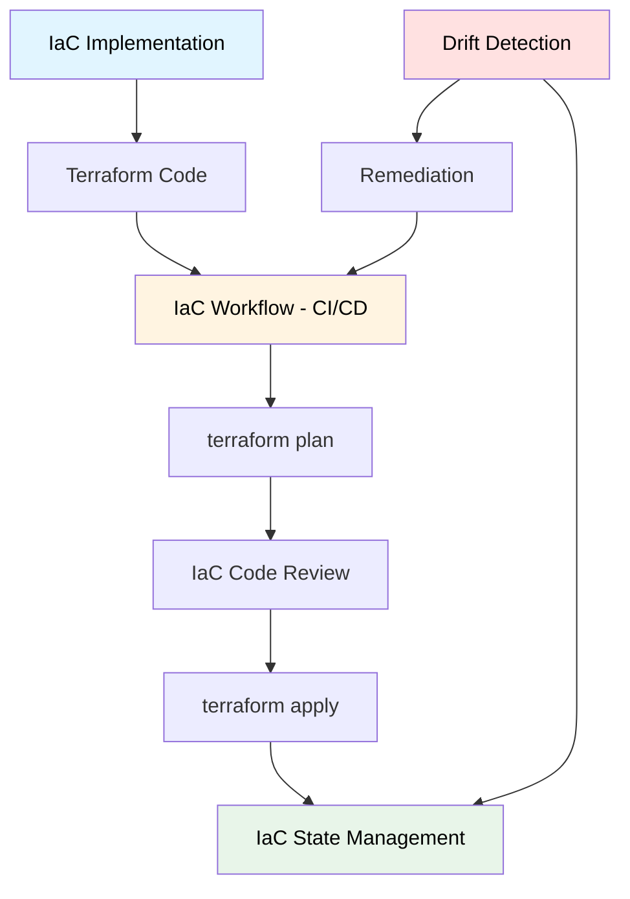

# Infraestructura como Código (IaC)

## Contexto

Este estándar define prácticas para gestión de infraestructura como código usando Terraform, incluyendo implementación, workflow, gestión de estado, versionamiento, code review, detección de drift, configuración de redes virtuales y optimización de costos en AWS. Complementa el lineamiento [Infraestructura como Código](../../lineamientos/operabilidad/02-infraestructura-como-codigo.md) y asegura infraestructura reproducible, auditable y eficiente.

**Conceptos incluidos:**

- **IaC Implementation** → Implementación base con Terraform
- **IaC Workflow** → Workflow CI/CD para IaC
- **IaC State Management** → Gestión de Terraform state en S3
- **IaC Versioning** → Versionamiento y tagging
- **IaC Code Review** → Revisión de cambios de infraestructura
- **Drift Detection** → Detección de cambios manuales

---

## Stack Tecnológico

| Componente          | Tecnología      | Versión | Uso                                    |
| ------------------- | --------------- | ------- | -------------------------------------- |
| **IaC**             | Terraform       | 1.7+    | Provisioning de infraestructura        |
| **Cloud Provider**  | AWS             | -       | Proveedor de nube                      |
| **State Backend**   | AWS S3          | -       | Almacenamiento de state                |
| **State Lock**      | AWS DynamoDB    | -       | Locking para prevenir conflictos       |
| **CI/CD**           | GitHub Actions  | -       | Automated apply                        |
| **IaC Scanning**    | Checkov         | 3.0+    | Security y compliance scanning         |
| **Cost Estimation** | Infracost       | 0.10+   | Estimación de costos                   |
| **Drift Detection** | Terraform Cloud | -       | Detección continua de drift (opcional) |

---

## Relación entre Conceptos



---

## IaC Implementation

### ¿Qué es IaC Implementation?

Implementación base de Infrastructure as Code usando Terraform para provisionar recursos AWS de forma declarativa, versionada y reproducible.

**Propósito:** Infraestructura como código versionado en Git, reproducible en múltiples entornos, con historial de cambios auditable.

**Beneficios:**
✅ **Reproducibilidad**: Misma infraestructura en dev/staging/prod
✅ **Versionamiento**: Historial completo en Git
✅ **Colaboración**: Code review antes de aplicar cambios
✅ **Disaster Recovery**: Recrear infraestructura desde código
✅ **Documentación**: Código es documentación viva

### Estructura de Proyecto

```
terraform/
├── modules/
│   ├── ecs-service/
│   │   ├── main.tf
│   │   ├── variables.tf
│   │   ├── outputs.tf
│   │   └── README.md
│   ├── vpc/
│   │   ├── main.tf
│   │   ├── variables.tf
│   │   └── outputs.tf
│   └── rds-postgres/
│       ├── main.tf
│       ├── variables.tf
│       └── outputs.tf
├── environments/
│   ├── dev/
│   │   ├── main.tf
│   │   ├── variables.tf
│   │   ├── terraform.tfvars
│   │   └── backend.tf
│   ├── staging/
│   │   ├── main.tf
│   │   ├── variables.tf
│   │   ├── terraform.tfvars
│   │   └── backend.tf
│   └── production/
│       ├── main.tf
│       ├── variables.tf
│       ├── terraform.tfvars
│       └── backend.tf
├── .terraform-version
├── .tflint.hcl
└── README.md
```

### Ejemplo: ECS Service Module

```hcl
# modules/ecs-service/main.tf

terraform {
  required_version = ">= 1.7.0"

  required_providers {
    aws = {
      source  = "hashicorp/aws"
      version = "~> 5.0"
    }
  }
}

# ECS Task Definition
resource "aws_ecs_task_definition" "service" {
  family                   = var.service_name
  network_mode             = "awsvpc"
  requires_compatibilities = ["FARGATE"]
  cpu                      = var.cpu
  memory                   = var.memory
  execution_role_arn       = aws_iam_role.ecs_execution.arn
  task_role_arn            = aws_iam_role.ecs_task.arn

  container_definitions = jsonencode([
    {
      name      = var.service_name
      image     = var.container_image
      cpu       = var.cpu
      memory    = var.memory
      essential = true

      portMappings = [
        {
          containerPort = var.container_port
          protocol      = "tcp"
        }
      ]

      environment = [
        for key, value in var.environment_variables : {
          name  = key
          value = value
        }
      ]

      secrets = [
        for secret in var.secrets : {
          name      = secret.name
          valueFrom = secret.arn
        }
      ]

      logConfiguration = {
        logDriver = "awslogs"
        options = {
          "awslogs-group"         = "/ecs/${var.service_name}"
          "awslogs-region"        = var.aws_region
          "awslogs-stream-prefix" = "ecs"
        }
      }

      healthCheck = {
        command     = ["CMD-SHELL", "curl -f http://localhost:${var.container_port}/health || exit 1"]
        interval    = 30
        timeout     = 5
        retries     = 3
        startPeriod = 60
      }
    }
  ])

  tags = merge(
    var.common_tags,
    {
      Name = var.service_name
    }
  )
}

# ECS Service
resource "aws_ecs_service" "service" {
  name            = var.service_name
  cluster         = var.cluster_id
  task_definition = aws_ecs_task_definition.service.arn
  desired_count   = var.desired_count
  launch_type     = "FARGATE"

  network_configuration {
    subnets          = var.private_subnet_ids
    security_groups  = [aws_security_group.service.id]
    assign_public_ip = false
  }

  load_balancer {
    target_group_arn = aws_lb_target_group.service.arn
    container_name   = var.service_name
    container_port   = var.container_port
  }

  deployment_configuration {
    maximum_percent         = 200
    minimum_healthy_percent = 100

    deployment_circuit_breaker {
      enable   = true
      rollback = true
    }
  }

  depends_on = [aws_lb_target_group.service]

  tags = var.common_tags
}

# Security Group
resource "aws_security_group" "service" {
  name_prefix = "${var.service_name}-"
  description = "Security group for ${var.service_name}"
  vpc_id      = var.vpc_id

  ingress {
    description     = "Allow traffic from ALB"
    from_port       = var.container_port
    to_port         = var.container_port
    protocol        = "tcp"
    security_groups = [var.alb_security_group_id]
  }

  egress {
    description = "Allow all outbound"
    from_port   = 0
    to_port     = 0
    protocol    = "-1"
    cidr_blocks = ["0.0.0.0/0"]
  }

  tags = merge(
    var.common_tags,
    {
      Name = "${var.service_name}-sg"
    }
  )
}

# CloudWatch Log Group
resource "aws_cloudwatch_log_group" "service" {
  name              = "/ecs/${var.service_name}"
  retention_in_days = var.log_retention_days

  tags = var.common_tags
}

# IAM Roles
resource "aws_iam_role" "ecs_execution" {
  name = "${var.service_name}-ecs-execution"

  assume_role_policy = jsonencode({
    Version = "2012-10-17"
    Statement = [
      {
        Action = "sts:AssumeRole"
        Effect = "Allow"
        Principal = {
          Service = "ecs-tasks.amazonaws.com"
        }
      }
    ]
  })

  tags = var.common_tags
}

resource "aws_iam_role_policy_attachment" "ecs_execution" {
  role       = aws_iam_role.ecs_execution.name
  policy_arn = "arn:aws:iam::aws:policy/service-role/AmazonECSTaskExecutionRolePolicy"
}

# Allow read secrets
resource "aws_iam_role_policy" "secrets_access" {
  name = "${var.service_name}-secrets"
  role = aws_iam_role.ecs_execution.id

  policy = jsonencode({
    Version = "2012-10-17"
    Statement = [
      {
        Effect = "Allow"
        Action = [
          "secretsmanager:GetSecretValue"
        ]
        Resource = [
          for secret in var.secrets : secret.arn
        ]
      }
    ]
  })
}
```

```hcl
# modules/ecs-service/variables.tf

variable "service_name" {
  description = "Name of the service"
  type        = string
}

variable "container_image" {
  description = "Docker image to deploy"
  type        = string
}

variable "container_port" {
  description = "Port the container listens on"
  type        = number
  default     = 8080
}

variable "cpu" {
  description = "Fargate CPU units"
  type        = number
  default     = 512
}

variable "memory" {
  description = "Fargate memory in MB"
  type        = number
  default     = 1024
}

variable "desired_count" {
  description = "Desired number of tasks"
  type        = number
  default     = 2
}

variable "cluster_id" {
  description = "ECS cluster ID"
  type        = string
}

variable "vpc_id" {
  description = "VPC ID"
  type        = string
}

variable "private_subnet_ids" {
  description = "Private subnet IDs for ECS tasks"
  type        = list(string)
}

variable "alb_security_group_id" {
  description = "ALB security group ID"
  type        = string
}

variable "environment_variables" {
  description = "Environment variables for container"
  type        = map(string)
  default     = {}
}

variable "secrets" {
  description = "Secrets from AWS Secrets Manager"
  type = list(object({
    name = string
    arn  = string
  }))
  default = []
}

variable "log_retention_days" {
  description = "CloudWatch log retention in days"
  type        = number
  default     = 30
}

variable "aws_region" {
  description = "AWS region"
  type        = string
}

variable "common_tags" {
  description = "Common tags for all resources"
  type        = map(string)
}
```

### Ejemplo: Environment Configuration

```hcl
# environments/production/main.tf

terraform {
  required_version = ">= 1.7.0"

  backend "s3" {
    bucket         = "talma-terraform-state"
    key            = "production/terraform.tfstate"
    region         = "us-east-1"
    encrypt        = true
    dynamodb_table = "terraform-state-lock"
  }

  required_providers {
    aws = {
      source  = "hashicorp/aws"
      version = "~> 5.0"
    }
  }
}

provider "aws" {
  region = var.aws_region

  default_tags {
    tags = {
      Environment = "production"
      ManagedBy   = "Terraform"
      Project     = "Customer Service"
    }
  }
}

# VPC
module "vpc" {
  source = "../../modules/vpc"

  vpc_cidr             = var.vpc_cidr
  availability_zones   = var.availability_zones
  public_subnet_cidrs  = var.public_subnet_cidrs
  private_subnet_cidrs = var.private_subnet_cidrs
  environment          = "production"
  common_tags          = local.common_tags
}

# ECS Cluster
resource "aws_ecs_cluster" "main" {
  name = "production-cluster"

  setting {
    name  = "containerInsights"
    value = "enabled"
  }

  tags = local.common_tags
}

# Customer Service
module "customer_service" {
  source = "../../modules/ecs-service"

  service_name           = "customer-service"
  container_image        = var.customer_service_image
  container_port         = 8080
  cpu                    = 512
  memory                 = 1024
  desired_count          = 3
  cluster_id             = aws_ecs_cluster.main.id
  vpc_id                 = module.vpc.vpc_id
  private_subnet_ids     = module.vpc.private_subnet_ids
  alb_security_group_id  = module.alb.security_group_id
  aws_region             = var.aws_region
  log_retention_days     = 90
  common_tags            = local.common_tags

  environment_variables = {
    ASPNETCORE_ENVIRONMENT = "Production"
  }

  secrets = [
    {
      name = "ConnectionStrings__PostgreSQL"
      arn  = aws_secretsmanager_secret.customer_db.arn
    },
    {
      name = "Redis__ConnectionString"
      arn  = aws_secretsmanager_secret.redis.arn
    }
  ]
}

locals {
  common_tags = {
    Environment = "production"
    ManagedBy   = "Terraform"
    Project     = "Customer Service"
    CostCenter  = "Engineering"
  }
}
```

```hcl
# environments/production/terraform.tfvars

aws_region         = "us-east-1"
vpc_cidr           = "10.0.0.0/16"
availability_zones = ["us-east-1a", "us-east-1b", "us-east-1c"]

public_subnet_cidrs = [
  "10.0.1.0/24",
  "10.0.2.0/24",
  "10.0.3.0/24"
]

private_subnet_cidrs = [
  "10.0.11.0/24",
  "10.0.12.0/24",
  "10.0.13.0/24"
]

customer_service_image = "ghcr.io/talma/customer-service:1.2.3"
```

---

## IaC Workflow

### ¿Qué es IaC Workflow?

Workflow automatizado de CI/CD para Terraform que ejecuta plan en PRs, requiere approval, y aplica cambios automáticamente después de merge.

**Propósito:** Prevenir cambios manuales, requerir review, y automatizar aplicación de infraestructura.

**Beneficios:**
✅ No acceso directo a AWS Console (IaC only)
✅ Review antes de aplicar cambios
✅ Plan visible en PR
✅ Rollback mediante Git revert

### GitHub Actions Workflow

```yaml
# .github/workflows/terraform.yml
name: Terraform CI/CD

on:
  pull_request:
    paths:
      - "terraform/**"
      - ".github/workflows/terraform.yml"
  push:
    branches:
      - main
    paths:
      - "terraform/**"

env:
  TF_VERSION: "1.7.0"
  AWS_REGION: "us-east-1"

jobs:
  # Job 1: Validate and Plan (on PR)
  terraform-plan:
    name: Terraform Plan
    runs-on: ubuntu-latest
    if: github.event_name == 'pull_request'

    strategy:
      matrix:
        environment: [dev, staging, production]

    steps:
      - name: Checkout
        uses: actions/checkout@v4

      - name: Setup Terraform
        uses: hashicorp/setup-terraform@v3
        with:
          terraform_version: ${{ env.TF_VERSION }}

      - name: Configure AWS Credentials
        uses: aws-actions/configure-aws-credentials@v4
        with:
          role-to-assume: arn:aws:iam::123456789012:role/github-actions-terraform
          aws-region: ${{ env.AWS_REGION }}

      - name: Terraform Format Check
        working-directory: terraform/environments/${{ matrix.environment }}
        run: terraform fmt -check -recursive

      - name: Terraform Init
        working-directory: terraform/environments/${{ matrix.environment }}
        run: terraform init -input=false

      - name: Terraform Validate
        working-directory: terraform/environments/${{ matrix.environment }}
        run: terraform validate

      - name: Run Checkov
        uses: bridgecrewio/checkov-action@master
        with:
          directory: terraform/environments/${{ matrix.environment }}
          framework: terraform
          output_format: sarif
          output_file_path: checkov-${{ matrix.environment }}.sarif
          soft_fail: false

      - name: Upload Checkov results
        uses: github/codeql-action/upload-sarif@v3
        if: always()
        with:
          sarif_file: checkov-${{ matrix.environment }}.sarif

      - name: Terraform Plan
        id: plan
        working-directory: terraform/environments/${{ matrix.environment }}
        run: |
          terraform plan -input=false -no-color -out=tfplan
          terraform show -no-color tfplan > plan-output.txt
        continue-on-error: true

      - name: Cost Estimation with Infracost
        uses: infracost/actions/setup@v3
        with:
          api-key: ${{ secrets.INFRACOST_API_KEY }}

      - name: Generate Infracost diff
        working-directory: terraform/environments/${{ matrix.environment }}
        run: |
          infracost breakdown --path . --format json --out-file infracost-${{ matrix.environment }}.json

      - name: Comment PR
        uses: actions/github-script@v7
        if: github.event_name == 'pull_request'
        with:
          github-token: ${{ secrets.GITHUB_TOKEN }}
          script: |
            const fs = require('fs');
            const planOutput = fs.readFileSync('terraform/environments/${{ matrix.environment }}/plan-output.txt', 'utf8');

            const output = `
            ## Terraform Plan - ${{ matrix.environment }} 🏗️

            <details>
            <summary>Show Plan</summary>

            \`\`\`terraform
            ${planOutput.slice(0, 65000)}
            \`\`\`

            </details>

            **Plan Status**: ${{ steps.plan.outcome }}
            `;

            github.rest.issues.createComment({
              issue_number: context.issue.number,
              owner: context.repo.owner,
              repo: context.repo.repo,
              body: output
            });

      - name: Fail if plan failed
        if: steps.plan.outcome == 'failure'
        run: exit 1

  # Job 2: Apply (on merge to main)
  terraform-apply:
    name: Terraform Apply
    runs-on: ubuntu-latest
    if: github.event_name == 'push' && github.ref == 'refs/heads/main'

    strategy:
      matrix:
        environment: [dev]
      max-parallel: 1 # Apply sequentially

    environment:
      name: ${{ matrix.environment }}
      url: https://console.aws.amazon.com/ecs/

    steps:
      - name: Checkout
        uses: actions/checkout@v4

      - name: Setup Terraform
        uses: hashicorp/setup-terraform@v3
        with:
          terraform_version: ${{ env.TF_VERSION }}

      - name: Configure AWS Credentials
        uses: aws-actions/configure-aws-credentials@v4
        with:
          role-to-assume: arn:aws:iam::123456789012:role/github-actions-terraform
          aws-region: ${{ env.AWS_REGION }}

      - name: Terraform Init
        working-directory: terraform/environments/${{ matrix.environment }}
        run: terraform init -input=false

      - name: Terraform Apply
        working-directory: terraform/environments/${{ matrix.environment }}
        run: terraform apply -input=false -auto-approve

      - name: Notify Slack
        if: always()
        uses: slackapi/slack-github-action@v1
        with:
          webhook-url: ${{ secrets.SLACK_WEBHOOK_URL }}
          payload: |
            {
              "text": "Terraform Apply ${{ job.status }} for ${{ matrix.environment }}",
              "blocks": [
                {
                  "type": "section",
                  "text": {
                    "type": "mrkdwn",
                    "text": "Terraform Apply *${{ job.status }}* for `${{ matrix.environment }}`\n*Commit*: ${{ github.sha }}\n*Author*: ${{ github.actor }}"
                  }
                }
              ]
            }

  # Job 3: Apply Staging/Production (manual approval required)
  terraform-apply-prod:
    name: Terraform Apply (Manual Approval)
    runs-on: ubuntu-latest
    if: github.event_name == 'push' && github.ref == 'refs/heads/main'
    needs: terraform-apply

    strategy:
      matrix:
        environment: [staging, production]
      max-parallel: 1

    environment:
      name: ${{ matrix.environment }}
      url: https://console.aws.amazon.com/ecs/

    steps:
      # ... same steps as terraform-apply job
```

---

## IaC State Management

### ¿Qué es IaC State Management?

Gestión segura y centralizada del Terraform state file en S3 con locking en DynamoDB para prevenir conflictos concurrentes.

**Propósito:** State compartido entre equipo, prevención de corrupción de state, backup automático.

**Beneficios:**
✅ State compartido (no local)
✅ Locking previene conflictos
✅ Versionamiento con S3 versioning
✅ Encryption at rest

### Setup de Backend S3

```hcl
# terraform/backend-setup/main.tf
# Este archivo configura el backend S3 (ejecutar una sola vez)

terraform {
  required_version = ">= 1.7.0"
}

provider "aws" {
  region = "us-east-1"
}

# S3 Bucket para state
resource "aws_s3_bucket" "terraform_state" {
  bucket = "talma-terraform-state"

  tags = {
    Name      = "Terraform State"
    ManagedBy = "Terraform"
  }
}

# Enable versioning
resource "aws_s3_bucket_versioning" "terraform_state" {
  bucket = aws_s3_bucket.terraform_state.id

  versioning_configuration {
    status = "Enabled"
  }
}

# Enable encryption
resource "aws_s3_bucket_server_side_encryption_configuration" "terraform_state" {
  bucket = aws_s3_bucket.terraform_state.id

  rule {
    apply_server_side_encryption_by_default {
      sse_algorithm = "AES256"
    }
  }
}

# Block public access
resource "aws_s3_bucket_public_access_block" "terraform_state" {
  bucket = aws_s3_bucket.terraform_state.id

  block_public_acls       = true
  block_public_policy     = true
  ignore_public_acls      = true
  restrict_public_buckets = true
}

# DynamoDB Table para state locking
resource "aws_dynamodb_table" "terraform_locks" {
  name         = "terraform-state-lock"
  billing_mode = "PAY_PER_REQUEST"
  hash_key     = "LockID"

  attribute {
    name = "LockID"
    type = "S"
  }

  tags = {
    Name      = "Terraform State Lock"
    ManagedBy = "Terraform"
  }
}

# Output values
output "s3_bucket_name" {
  value = aws_s3_bucket.terraform_state.id
}

output "dynamodb_table_name" {
  value = aws_dynamodb_table.terraform_locks.id
}
```

### Backend Configuration

```hcl
# environments/production/backend.tf

terraform {
  backend "s3" {
    bucket         = "talma-terraform-state"
    key            = "production/terraform.tfstate"
    region         = "us-east-1"
    encrypt        = true
    dynamodb_table = "terraform-state-lock"

    # Optional: State locking timeout
    dynamodb_lock_timeout = "5m"
  }
}
```

### State Management Commands

```bash
# Initialize backend (first time)
terraform init

# List resources in state
terraform state list

# Show specific resource
terraform state show aws_ecs_service.customer_service

# Pull state to local file (for inspection)
terraform state pull > terraform.tfstate.json

# Move resource in state (refactoring)
terraform state mv aws_security_group.old aws_security_group.new

# Remove resource from state (without destroying)
terraform state rm aws_instance.example

# Import existing resource to state
terraform import aws_ecs_cluster.main production-cluster

# Replace provider (e.g., after provider upgrade issue)
terraform state replace-provider hashicorp/aws registry.terraform.io/hashicorp/aws
```

### State Locking

```bash
# Locking happens automatically con cada terraform apply/plan

# Si lock queda stuck (proceso crashed):
# 1. Verificar que no hay otro proceso corriendo
# 2. Forzar unlock con Lock ID
terraform force-unlock <LOCK_ID>

# Ver lock actual en DynamoDB
aws dynamodb get-item \
  --table-name terraform-state-lock \
  --key '{"LockID": {"S": "talma-terraform-state/production/terraform.tfstate-md5"}}'
```

---

## IaC Versioning

### ¿Qué es IaC Versioning?

Versionamiento de módulos Terraform, pinning de provider versions, y tagging de releases de infraestructura.

**Propósito:** Reproducibilidad, rollback, y actualizaciones controladas.

**Beneficios:**
✅ Módulos versionados (semantic versioning)
✅ Provider versions pinned
✅ Rollback mediante tags
✅ Dependencias explícitas

### Module Versioning

```hcl
# Usar módulo desde Git con version tag
module "ecs_service" {
  source = "git::https://github.com/talma/terraform-modules.git//ecs-service?ref=v1.2.3"

  # ... variables
}

# Alternativa: Terraform Registry (si publicamos módulos)
module "ecs_service" {
  source  = "talma/ecs-service/aws"
  version = "~> 1.2"  # Compatible con 1.2.x

  # ... variables
}
```

### Provider Version Constraints

```hcl
# terraform.tf

terraform {
  required_version = ">= 1.7.0, < 2.0.0"

  required_providers {
    aws = {
      source  = "hashicorp/aws"
      version = "~> 5.0"  # Compatible con 5.x (no 6.x)
    }
  }
}
```

### Version Constraint Syntax

```hcl
# Exact version
version = "1.2.3"

# Pessimistic constraint (recommended)
version = "~> 1.2"    # >= 1.2.0, < 1.3.0
version = "~> 1.2.3"  # >= 1.2.3, < 1.3.0

version = ">= 1.2.0"        # Mayor o igual
version = ">= 1.0, < 2.0"   # Range
```

### Terraform Version File

```
# .terraform-version (para tfenv)
1.7.0
```

### Release Tagging

```bash
# Tag infrastructure release
git tag -a infra-v1.2.3 -m "Release: Customer Service production deployment"
git push origin infra-v1.2.3

# Rollback to previous version
git checkout infra-v1.2.2
cd terraform/environments/production
terraform plan  # Review changes
terraform apply # Apply rollback
```

---

## IaC Code Review

### ¿Qué es IaC Code Review?

Proceso de revisión de cambios de infraestructura antes de aplicarlos, similar a code reviews de aplicación.

**Propósito:** Prevenir errores costosos, validar seguridad, compartir conocimiento.

**Beneficios:**
✅ Detección temprana de issues
✅ Validación de seguridad
✅ Transferencia de conocimiento
✅ Menos downtime

### Code Review Checklist

```markdown
## Terraform Code Review Checklist

### General

- [ ] Terraform fmt ejecutado (código formateado)
- [ ] No hay hardcoded values (usar variables)
- [ ] Variables tienen descriptions
- [ ] Outputs tienen descriptions
- [ ] README actualizado si es módulo

### Security

- [ ] No secrets hardcoded
- [ ] Security groups con least privilege
- [ ] Encryption at rest habilitado
- [ ] Encryption in transit (TLS) configurado
- [ ] IAM roles con least privilege
- [ ] S3 buckets con public access blocked

### Networking

- [ ] Recursos en subnets apropiadas (public/private)
- [ ] Security groups bien configurados
- [ ] NACLs si son necesarios
- [ ] Multi-AZ para alta disponibilidad

### Cost

- [ ] Instance sizes apropiados
- [ ] Auto-scaling configurado
- [ ] No recursos innecesarios
- [ ] Tags para cost allocation

### Tagging

- [ ] Tags obligatorios presentes:
  - Environment
  - ManagedBy
  - Service/Project
  - CostCenter
  - Owner

### State Management

- [ ] Backend configurado correctamente
- [ ] No state files en Git (.gitignore)
- [ ] State locking habilitado

### Data Safety

- [ ] Backup configurado si aplica
- [ ] Retention policies definidas
- [ ] Deletion protection en recursos críticos
- [ ] Create before destroy para zero-downtime

### Testing

- [ ] Plan reviewed (no unexpected changes)
- [ ] Checkov scan passed
- [ ] Infracost review (cost impact)
```

### Pull Request Template

````markdown
## Terraform Change Request

### Description

Brief description of infrastructure changes.

### Resources Changed

- [ ] New resources created
- [ ] Existing resources modified
- [ ] Resources deleted

### Checklist

- [ ] `terraform fmt` executed
- [ ] `terraform validate` passed
- [ ] Checkov scan passed
- [ ] Plan output reviewed
- [ ] Cost impact reviewed (Infracost)
- [ ] Backup/rollback plan documented

### Terraform Plan Output

<details>
<summary>Show Plan</summary>

```terraform
# Plan output will be posted automatically by GitHub Actions
```

</details>

### Cost Impact

- **Estimated monthly cost change**: +$XX USD

### Rollback Plan

Steps to rollback if issues occur:

1. ...

### Testing

- [ ] Tested in dev environment
- [ ] Validated in staging

### Related Issues

Fixes #XXX
````

---

## Drift Detection

### ¿Qué es Drift Detection?

Detección de cambios manuales en infraestructura que no están reflejados en Terraform state, y proceso de remediación.

**Propósito:** Mantener infraestructura consistente con IaC, detectar cambios no autorizados.

**Beneficios:**
✅ Detectar cambios manuales
✅ Compliance enforcement
✅ Auditoría de cambios
✅ Remediation automática

### Detección Manual

```bash
# Detectar drift
terraform plan -refresh-only

# Output mostrará recursos drift
# Ejemplo:
#   # aws_security_group.service will be updated in-place
#   ~ resource "aws_security_group" "service" {
#       ~ ingress = [
#           - {
#               # (removed manually in console)
#             }
#         ]
#     }

# Refresh state para match realidad (cuidado!)
terraform apply -refresh-only

# Alternativa: Import cambios manuals
terraform import aws_security_group_rule.manual sg-xxxxx
```

### Detección Automatizada

```yaml
# .github/workflows/drift-detection.yml
name: Drift Detection

on:
  schedule:
    - cron: "0 8 * * *" # Daily at 8 AM UTC
  workflow_dispatch: # Manual trigger

jobs:
  detect-drift:
    name: Detect Drift
    runs-on: ubuntu-latest

    strategy:
      matrix:
        environment: [dev, staging, production]

    steps:
      - name: Checkout
        uses: actions/checkout@v4

      - name: Setup Terraform
        uses: hashicorp/setup-terraform@v3

      - name: Configure AWS Credentials
        uses: aws-actions/configure-aws-credentials@v4
        with:
          role-to-assume: arn:aws:iam::123456789012:role/github-actions-terraform
          aws-region: us-east-1

      - name: Terraform Init
        working-directory: terraform/environments/${{ matrix.environment }}
        run: terraform init

      - name: Detect Drift
        id: drift
        working-directory: terraform/environments/${{ matrix.environment }}
        run: |
          terraform plan -detailed-exitcode -no-color > plan-output.txt
          EXIT_CODE=$?
          cat plan-output.txt
          echo "exit_code=$EXIT_CODE" >> $GITHUB_OUTPUT
        continue-on-error: true
        # Exit codes:
        # 0 = No changes
        # 1 = Error
        # 2 = Changes detected (drift!)

      - name: Notify if drift detected
        if: steps.drift.outputs.exit_code == '2'
        uses: slackapi/slack-github-action@v1
        with:
          webhook-url: ${{ secrets.SLACK_WEBHOOK_URL }}
          payload: |
            {
              "text": "🚨 Drift Detected in ${{ matrix.environment }}!",
              "blocks": [
                {
                  "type": "section",
                  "text": {
                    "type": "mrkdwn",
                    "text": "*Drift Detected* in `${{ matrix.environment }}`\nInfrastructure has manual changes not in Terraform.\n\n*Action Required*: Review and remediate."
                  }
                }
              ]
            }

      - name: Create Issue if drift
        if: steps.drift.outputs.exit_code == '2'
        uses: actions/github-script@v7
        with:
          github-token: ${{ secrets.GITHUB_TOKEN }}
          script: |
            const fs = require('fs');
            const planOutput = fs.readFileSync('terraform/environments/${{ matrix.environment }}/plan-output.txt', 'utf8');

            github.rest.issues.create({
              owner: context.repo.owner,
              repo: context.repo.repo,
              title: '🚨 Drift Detected: ${{ matrix.environment }}',
              body: `## Drift Detection Alert\n\n**Environment**: ${{ matrix.environment }}\n**Date**: ${new Date().toISOString()}\n\n### Changes Detected\n\n\`\`\`terraform\n${planOutput}\n\`\`\`\n\n### Action Required\n\n1. Review changes\n2. Determine if intentional or unauthorized\n3. Update Terraform code OR revert manual changes\n4. Close this issue after remediation`,
              labels: ['drift-detection', 'infrastructure', '${{ matrix.environment }}']
            });
```

### Remediación de Drift

**Opción 1: Actualizar Terraform** (si cambio es deseado)

```bash
# Actualizar código Terraform para match realidad
# Ejemplo: Security group rule fue agregado manualmente y queremos mantenerlo

# 1. Agregar resource en Terraform
resource "aws_security_group_rule" "new_rule" {
  type              = "ingress"
  from_port         = 443
  to_port           = 443
  protocol          = "tcp"
  security_group_id = aws_security_group.service.id
  cidr_blocks       = ["10.0.0.0/16"]
}

# 2. Import existing resource
terraform import aws_security_group_rule.new_rule sg-xxxxx_ingress_tcp_443_443_10.0.0.0/16

# 3. Verify
terraform plan  # Debe mostrar "No changes"
```

**Opción 2: Revertir cambios manuales** (si cambio no autorizado)

```bash
# Terraform apply revierte cambios manuales
terraform apply

# O force replacement de resource específico
terraform apply -replace=aws_security_group.service
```

---

## Requisitos Técnicos

### MUST (Obligatorio)

**IaC Implementation:**

- **MUST** usar Terraform como única herramienta de IaC
- **MUST** 100% de infraestructura en Terraform (no manual changes)
- **MUST** estructura modular (separar modules/ y environments/)
- **MUST** usar módulos reutilizables

**State Management:**

- **MUST** backend remoto en S3 con encryption
- **MUST** state locking con DynamoDB
- **MUST** S3 versioning habilitado
- **MUST** S3 public access blocked

**Versioning:**

- **MUST** pin provider versions (`~> 5.0` syntax)
- **MUST** terraform version constraint definido
- **MUST** versionar módulos (Git tags)

**Code Review:**

- **MUST** PR requerido para cambios de infraestructura
- **MUST** terraform plan visible en PR
- **MUST** aprobación antes de apply
- **MUST** Checkov scan passing

**Tagging:**

- **MUST** tags obligatorios en todos los recursos:
  - Environment
  - ManagedBy
  - Service
  - CostCenter
  - Owner

### SHOULD (Fuertemente recomendado)

- **SHOULD** automated drift detection diario
- **SHOULD** Infracost integration para cost estimation
- **SHOULD** multi-AZ para alta disponibilidad
- **SHOULD** VPC Flow Logs habilitados
- **SHOULD** AWS Budgets configurados con alertas

### MAY (Opcional)

- **MAY** usar Terraform Cloud para remote runs
- **MAY** Sentinel policies para governance
- **MAY** Terragrunt para DRY configuration

### MUST NOT (Prohibido)

- **MUST NOT** hacer cambios manuales en AWS Console
- **MUST NOT** hardcodear secrets en código
- **MUST NOT** guardar state files en Git
- **MUST NOT** usar `terraform apply` sin review en producción
- **MUST NOT** omitir tags obligatorios

---

## Referencias

**Terraform:**

- [Terraform Documentation](https://www.terraform.io/docs)
- [AWS Provider Documentation](https://registry.terraform.io/providers/hashicorp/aws/latest/docs)

**Best Practices:**

- [Terraform Best Practices](https://www.terraform-best-practices.com/)
- [AWS Well-Architected Framework](https://aws.amazon.com/architecture/well-architected/)

**Security:**

- [Checkov Documentation](https://www.checkov.io/)
- [CIS AWS Foundations Benchmark](https://www.cisecurity.org/benchmark/amazon_web_services)

**Relacionados:**

- [Contenerización](./containerization.md)
- [Gestión de Configuración](./configuration-management.md)
- [Redes Virtuales](./virtual-networks.md)
- [Optimización de Costos Cloud](./cloud-cost-optimization.md)
- [CI/CD Deployment](../operabilidad/cicd-deployment.md)

---

**Última actualización**: 19 de febrero de 2026
**Responsable**: Platform Team / DevOps
