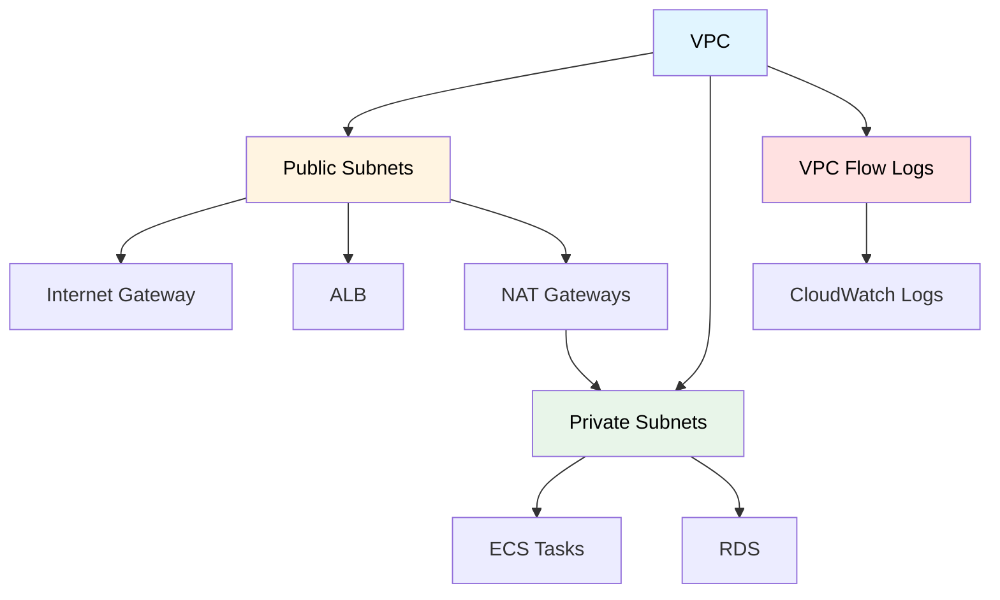

# Redes Virtuales

## Contexto

Este estándar define las prácticas para diseño y configuración de redes virtuales en AWS, incluyendo VPCs, subnets públicas y privadas, NAT gateways, route tables y VPC Flow Logs. Complementa el lineamiento [Infraestructura como Código](../../lineamientos/operabilidad/02-infraestructura-como-codigo.md) y asegura networking seguro, aislado y de alta disponibilidad para microservicios.

**Conceptos incluidos:**

- **VPC Design** → Diseño de VPCs con DNS y subnets públicas/privadas
- **NAT Gateways** → Salida a internet desde subnets privadas (una por AZ)
- **Route Tables** → Routing entre subnets y hacia internet/NAT
- **VPC Flow Logs** → Registro de tráfico de red para auditoría y troubleshooting

:::note Implementación gestionada por Plataforma
Este estándar define los **requisitos de red que los servicios deben cumplir** (aislamiento, segmentación, visibilidad). El diseño y configuración de VPCs, subnets y gateways en AWS son responsabilidad del equipo de **Plataforma**. Consultar en **#platform-support**.
:::

---

## Stack Tecnológico

| Componente        | Tecnología      | Versión | Uso                              |
| ----------------- | --------------- | ------- | -------------------------------- |
| **Networking**    | AWS VPC         | -       | Red virtual privada              |
| **IaC**           | Terraform       | 1.7+    | Provisioning de red              |
| **Flow Logs**     | AWS CloudWatch  | -       | Registro de tráfico de red       |
| **NAT**           | AWS NAT Gateway | -       | Salida a internet (subnets priv) |
| **Load Balancer** | AWS ALB         | -       | Ingreso de tráfico externo       |

---

## Relación entre Conceptos



---

## VPC Design

### ¿Qué es VPC Design?

Diseño de VPCs, subnets, routing, NAT gateways y Network ACLs para aislar y securizar servicios.

**Propósito:** Networking seguro y escalable para microservicios.

```hcl
# modules/vpc/main.tf

resource "aws_vpc" "main" {
  cidr_block           = var.vpc_cidr
  enable_dns_hostnames = true
  enable_dns_support   = true

  tags = merge(
    var.common_tags,
    {
      Name = "${var.environment}-vpc"
    }
  )
}

# Internet Gateway
resource "aws_internet_gateway" "main" {
  vpc_id = aws_vpc.main.id

  tags = merge(
    var.common_tags,
    {
      Name = "${var.environment}-igw"
    }
  )
}

# Public Subnets (for ALB)
resource "aws_subnet" "public" {
  count             = length(var.availability_zones)
  vpc_id            = aws_vpc.main.id
  cidr_block        = var.public_subnet_cidrs[count.index]
  availability_zone = var.availability_zones[count.index]

  map_public_ip_on_launch = true

  tags = merge(
    var.common_tags,
    {
      Name = "${var.environment}-public-${var.availability_zones[count.index]}"
      Tier = "Public"
    }
  )
}

# Private Subnets (for ECS tasks, RDS)
resource "aws_subnet" "private" {
  count             = length(var.availability_zones)
  vpc_id            = aws_vpc.main.id
  cidr_block        = var.private_subnet_cidrs[count.index]
  availability_zone = var.availability_zones[count.index]

  tags = merge(
    var.common_tags,
    {
      Name = "${var.environment}-private-${var.availability_zones[count.index]}"
      Tier = "Private"
    }
  )
}

# NAT Gateways (one per AZ for HA)
resource "aws_eip" "nat" {
  count  = length(var.availability_zones)
  domain = "vpc"

  tags = merge(
    var.common_tags,
    {
      Name = "${var.environment}-nat-eip-${var.availability_zones[count.index]}"
    }
  )
}

resource "aws_nat_gateway" "main" {
  count         = length(var.availability_zones)
  allocation_id = aws_eip.nat[count.index].id
  subnet_id     = aws_subnet.public[count.index].id

  tags = merge(
    var.common_tags,
    {
      Name = "${var.environment}-nat-${var.availability_zones[count.index]}"
    }
  )

  depends_on = [aws_internet_gateway.main]
}

# Route Tables
resource "aws_route_table" "public" {
  vpc_id = aws_vpc.main.id

  route {
    cidr_block = "0.0.0.0/0"
    gateway_id = aws_internet_gateway.main.id
  }

  tags = merge(
    var.common_tags,
    {
      Name = "${var.environment}-public-rt"
    }
  )
}

resource "aws_route_table_association" "public" {
  count          = length(var.availability_zones)
  subnet_id      = aws_subnet.public[count.index].id
  route_table_id = aws_route_table.public.id
}

resource "aws_route_table" "private" {
  count  = length(var.availability_zones)
  vpc_id = aws_vpc.main.id

  route {
    cidr_block     = "0.0.0.0/0"
    nat_gateway_id = aws_nat_gateway.main[count.index].id
  }

  tags = merge(
    var.common_tags,
    {
      Name = "${var.environment}-private-rt-${var.availability_zones[count.index]}"
    }
  )
}

resource "aws_route_table_association" "private" {
  count          = length(var.availability_zones)
  subnet_id      = aws_subnet.private[count.index].id
  route_table_id = aws_route_table.private[count.index].id
}

# VPC Flow Logs
resource "aws_flow_log" "main" {
  iam_role_arn    = aws_iam_role.flow_log.arn
  log_destination = aws_cloudwatch_log_group.flow_log.arn
  traffic_type    = "ALL"
  vpc_id          = aws_vpc.main.id

  tags = var.common_tags
}

resource "aws_cloudwatch_log_group" "flow_log" {
  name              = "/aws/vpc/${var.environment}"
  retention_in_days = 30

  tags = var.common_tags
}
```

---

## Network Architecture

```
┌─────────────────────────────────────────────────────────────┐
│                        Internet                               │
└────────────────────────┬──────────────────────────────────────┘
                         │
                         │
                ┌────────▼────────┐
                │ Internet Gateway │
                └────────┬──────────┘
                         │
        ┌────────────────┼────────────────┐
        │                │                │
   ┌────▼────┐      ┌────▼────┐     ┌────▼────┐
   │ Public  │      │ Public  │     │ Public  │
   │ Subnet  │      │ Subnet  │     │ Subnet  │
   │  AZ-a   │      │  AZ-b   │     │  AZ-c   │
   └────┬────┘      └────┬────┘     └────┬────┘
        │                │                │
   ┌────▼────┐      ┌────▼────┐     ┌────▼──── ┐
   │   ALB   │◄─────┤   ALB   │◄────┤   ALB   │
   └────┬────┘      └────┬────┘     └────┬────┘
        │                │                │
   ┌────▼────┐      ┌────▼────┐     ┌────▼────┐
   │   NAT   │      │   NAT   │     │   NAT   │
   │ Gateway │      │ Gateway │     │ Gateway │
   └────┬────┘      └────┬────┘     └────┬────┘
        │                │                │
   ┌────▼────┐      ┌────▼────┐     ┌────▼────┐
   │ Private │      │ Private │     │ Private │
   │ Subnet  │      │ Subnet  │     │ Subnet  │
   │  AZ-a   │      │  AZ-b   │     │  AZ-c   │
   └────┬────┘      └────┬────┘     └────┬────┘
        │                │                │
        ├────────────────┼────────────────┤
        │                │                │
   ┌────▼────┐      ┌────▼────┐     ┌────▼────┐
   │   ECS   │      │   ECS   │     │   ECS   │
   │  Tasks  │      │  Tasks  │     │  Tasks  │
   └─────────┘      └─────────┘     └─────────┘
        │                │                │
   ┌────▼────┐      ┌────▼────┐     ┌────▼────┐
   │   RDS   │◄─────┤   RDS   │     │   RDS   │
   │ Primary │      │ Replica │     │ Replica │
   └─────────┘      └─────────┘     └─────────┘
```

---

## Requisitos Técnicos

### MUST (Obligatorio)

**VPC:**

- **MUST** toda infraestructura dentro de una VPC (sin recursos en default VPC)
- **MUST** habilitar `enable_dns_hostnames` y `enable_dns_support` en la VPC
- **MUST** separar subnets públicas (ALB) de subnets privadas (ECS, RDS)
- **MUST** servicios ECS y RDS en subnets privadas únicamente

**NAT y Routing:**

- **MUST** NAT Gateway por availability zone (no single NAT para producción)
- **MUST** route tables separadas para subnets públicas y privadas
- **MUST** subnets privadas enrutar salida a internet a través de NAT Gateway (no IGW directo)

**Seguridad:**

- **MUST** VPC Flow Logs habilitados con retención mínima de 30 días
- **MUST** `assignPublicIp: DISABLED` en ECS tasks (siempre en subnet privada)
- **MUST** security groups granulares por servicio (no usar default security group)

**Tagging:**

- **MUST** tags `Environment`, `ManagedBy`, `Name`, `Tier` en todos los recursos de red

### SHOULD (Fuertemente recomendado)

- **SHOULD** usar al menos 3 availability zones en producción para alta disponibilidad
- **SHOULD** reservar rangos CIDR que no se solapen entre VPCs (para VPC peering futuro)
- **SHOULD** definir Network ACLs como capa adicional de seguridad
- **SHOULD** usar AWS PrivateLink para acceso a servicios AWS sin salir a internet
- **SHOULD** VPC Flow Logs publicados a CloudWatch con alertas de tráfico anómalo

### MAY (Opcional)

- **MAY** crear VPC peering entre VPCs de distintos servicios si hay comunicación frecuente
- **MAY** usar AWS Transit Gateway para conectar múltiples VPCs
- **MAY** habilitar flow logs a nivel de subnet además de la VPC

### MUST NOT (Prohibido)

- **MUST NOT** exponer servicios ECS directamente a internet sin ALB
- **MUST NOT** asignar IP pública a ECS tasks o instancias RDS
- **MUST NOT** usar la default VPC de AWS en ningún ambiente
- **MUST NOT** compartir subnets entre servicios de distintos equipos sin coordinación previa
- **MUST NOT** usar rango CIDR `10.0.0.0/8` completo (reservar para crecimiento)

---

## Referencias

- [AWS VPC Documentation](https://docs.aws.amazon.com/vpc/latest/userguide/what-is-amazon-vpc.html) — documentación oficial de Amazon VPC
- [AWS VPC Best Practices](https://docs.aws.amazon.com/vpc/latest/userguide/vpc-security-best-practices.html) — mejores prácticas de seguridad de red
- [VPC Flow Logs](https://docs.aws.amazon.com/vpc/latest/userguide/flow-logs.html) — registro de tráfico de red para auditoría
- [AWS VPC Terraform Provider](https://registry.terraform.io/providers/hashicorp/aws/latest/docs/resources/vpc) — recurso VPC en Terraform
- [AWS NAT Gateway Resource](https://registry.terraform.io/providers/hashicorp/aws/latest/docs/resources/nat_gateway) — recurso NAT Gateway en Terraform
- [AWS Multi-AZ Architecture](https://aws.amazon.com/architecture/high-availability/) — patrones de alta disponibilidad en múltiples AZ
- [AWS Well-Architected — Reliability](https://docs.aws.amazon.com/wellarchitected/latest/reliability-pillar/welcome.html) — pilar de confiabilidad
- [Infraestructura como Código — Implementación](./iac-standards.md) — provisioning de redes con Terraform
- [Contenerización](./containerization.md) — despliegue ECS en subnets privadas
- [Optimización de Costos Cloud](./cloud-cost-optimization.md) — tagging y control de costos de red
