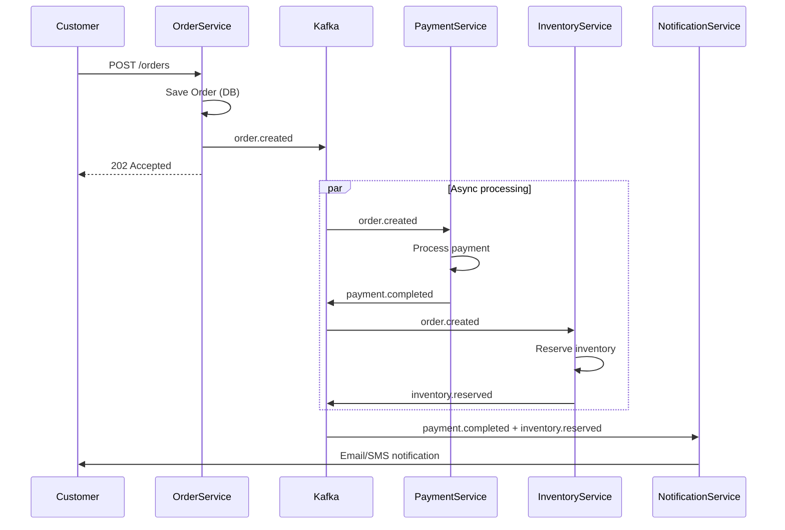

# Mensajería Asíncrona

## Contexto

Este estándar define prácticas para implementar comunicación asíncrona entre servicios usando Apache Kafka como message broker. Cubre configuración de producers y consumers en .NET, estrategias de partition keys e implementación de flujos integrados. Complementa el lineamiento [Comunicación Asíncrona y Eventos](../../lineamientos/arquitectura/comunicacion-asincrona-y-eventos.md).

---

## Stack Tecnológico

| Componente            | Tecnología           | Versión | Uso                             |
| --------------------- | -------------------- | ------- | ------------------------------- |
| **Message Broker**    | Apache Kafka (Kraft) | 3.6+    | Event streaming platform        |
| **Producer/Consumer** | Confluent.Kafka      | 2.3+    | Cliente Kafka para .NET         |
| **Serialization**     | System.Text.Json     | .NET 8  | Serialización JSON              |
| **Observability**     | OpenTelemetry        | 1.7+    | Tracing y métricas distribuidas |
| **Monitoring**        | Grafana Stack        | -       | Métricas de Kafka y consumers   |

---

## Async Messaging

### ¿Qué es Async Messaging?

Patrón de comunicación donde un servicio **producer** publica eventos a Kafka sin esperar respuesta, y uno o más servicios **consumers** procesan esos eventos de forma independiente.

**Propósito:** Desacoplar servicios, permitir procesamiento asíncrono, mejorar escalabilidad y resiliencia.

**Características clave:**

- **Fire-and-forget**: Producer no bloquea esperando confirmación de procesamiento
- **Multiple subscribers**: Muchos consumers pueden procesar el mismo evento
- **Durable queuing**: Kafka persiste eventos (retention configurable)
- **Ordered delivery**: Orden garantizado dentro de una partition

**Beneficios:**
✅ Desacoplamiento (producer/consumer evolucionan independientemente)
✅ Escalabilidad (consumers escalan horizontalmente con partitions)
✅ Resiliencia (Kafka buffer entre servicios)
✅ Auditoría (eventos persistidos para replay)

### Comparación: Sync vs Async

```csharp
// ❌ SINCRÓNICO: Coupling alto, latencia alta
public class OrderService
{
    private readonly HttpClient _httpClient;

    public async Task CreateOrderAsync(Order order)
    {
        // 1. Crear orden
        await _repository.AddAsync(order);

        // 2. Llamar a Payment Service (BLOQUEANTE)
        var paymentResponse = await _httpClient.PostAsJsonAsync(
            "https://payment-service/api/payments",
            new { order.Id, order.Total });
        if (!paymentResponse.IsSuccessStatusCode)
            throw new Exception("Payment failed");

        // 3. Llamar a Inventory Service (BLOQUEANTE)
        var inventoryResponse = await _httpClient.PostAsJsonAsync(
            "https://inventory-service/api/reserve",
            new { order.Items });
        if (!inventoryResponse.IsSuccessStatusCode)
            throw new Exception("Inventory reservation failed");

        // 4. Llamar a Notification Service (BLOQUEANTE)
        await _httpClient.PostAsJsonAsync(
            "https://notification-service/api/notify",
            new { order.CustomerEmail, order.Id });

        // Total latency = DB + Payment + Inventory + Notification
        // Si cualquier servicio falla → rollback complejo
    }
}

// Problemas:
// 1. Alto acoplamiento (OrderService conoce 3 servicios)
// 2. Latencia acumulativa (suma de todas las llamadas)
// 3. Failure cascade (un servicio down → todo falla)
// 4. Difícil escalar (bottleneck en servicios llamados)
```

```csharp
// ✅ ASÍNCRONO: Desacoplado, latencia baja
public class OrderService
{
    private readonly IProducer<string, string> _producer;
    private readonly ILogger<OrderService> _logger;

    public async Task CreateOrderAsync(Order order)
    {
        // 1. Crear orden (solo persistencia local)
        await _repository.AddAsync(order);

        // 2. Publicar evento OrderCreated (NO BLOQUEANTE)
        var @event = new OrderCreatedEvent
        {
            EventId = Guid.NewGuid(),
            Timestamp = DateTimeOffset.UtcNow,
            OrderId = order.Id,
            CustomerId = order.CustomerId,
            Items = order.Items,
            Total = order.Total
        };

        await _producer.ProduceAsync("order.created", new Message<string, string>
        {
            Key = order.Id.ToString(),  // Partition key
            Value = JsonSerializer.Serialize(@event)
        });

        _logger.LogInformation("OrderCreated event published: {OrderId}", order.Id);

        // Total latency = DB + Kafka produce (~10ms)
        // Otros servicios procesan asíncronamente
    }
}

// Beneficios:
// 1. OrderService no conoce Payment/Inventory/Notification
// 2. Latencia mínima (~10ms para publicar a Kafka)
// 3. Resiliencia (si Payment está down, evento persiste en Kafka)
// 4. Escalabilidad (cada consumer escala independientemente)

// Payment Service (consumer independiente)
public class PaymentConsumer : BackgroundService
{
    protected override async Task ExecuteAsync(CancellationToken stoppingToken)
    {
        using var consumer = new ConsumerBuilder<string, string>(_config).Build();
        consumer.Subscribe("order.created");

        while (!stoppingToken.IsCancellationRequested)
        {
            var result = consumer.Consume(stoppingToken);
            var @event = JsonSerializer.Deserialize<OrderCreatedEvent>(result.Message.Value);

            // Procesar pago asíncronamente
            await ProcessPaymentAsync(@event);

            consumer.Commit(result);
        }
    }
}
```

### Producer Configuration (.NET)

```csharp
// Program.cs
using Confluent.Kafka;

var builder = WebApplication.CreateBuilder(args);

// Configuración de Producer
var producerConfig = new ProducerConfig
{
    BootstrapServers = builder.Configuration["Kafka:BootstrapServers"], // "broker1:9092,broker2:9092,broker3:9092"

    // Durabilidad
    Acks = Acks.All,  // Esperar confirmación de todos los in-sync replicas
    EnableIdempotence = true,  // Prevenir duplicados en caso de retry

    // Performance
    CompressionType = CompressionType.Snappy,  // Comprimir mensajes
    LingerMs = 10,  // Batch messages por 10ms
    BatchSize = 32768,  // 32KB batch size

    // Retry
    MessageSendMaxRetries = 3,
    RetryBackoffMs = 100,

    // Timeout
    RequestTimeoutMs = 30000  // 30s timeout
};

builder.Services.AddSingleton<IProducer<string, string>>(sp =>
    new ProducerBuilder<string, string>(producerConfig)
        .SetErrorHandler((producer, error) =>
        {
            var logger = sp.GetRequiredService<ILogger<Program>>();
            logger.LogError("Kafka producer error: {Error}", error.Reason);
        })
        .Build());

var app = builder.Build();
```

### Consumer Configuration (.NET)

```csharp
// Consumers/OrderCreatedConsumer.cs
using Confluent.Kafka;

public class OrderCreatedConsumer : BackgroundService
{
    private readonly IConsumer<string, string> _consumer;
    private readonly IServiceProvider _serviceProvider;
    private readonly ILogger<OrderCreatedConsumer> _logger;

    public OrderCreatedConsumer(IConfiguration configuration, IServiceProvider serviceProvider, ILogger<OrderCreatedConsumer> logger)
    {
        var consumerConfig = new ConsumerConfig
        {
            BootstrapServers = configuration["Kafka:BootstrapServers"],
            GroupId = "payment-service-group",  // Consumer group

            // Offset management
            AutoOffsetReset = AutoOffsetReset.Earliest,  // Leer desde el inicio si no hay offset
            EnableAutoCommit = false,  // Commit manual (más control)

            // Performance
            FetchMinBytes = 1024,  // Min 1KB para fetch
            FetchWaitMaxMs = 500,  // Esperar 500ms para acumular mensajes

            // Session
            SessionTimeoutMs = 30000,  // 30s timeout para heartbeat
            HeartbeatIntervalMs = 3000  // Heartbeat cada 3s
        };

        _consumer = new ConsumerBuilder<string, string>(consumerConfig)
            .SetErrorHandler((consumer, error) =>
            {
                logger.LogError("Kafka consumer error: {Error}", error.Reason);
            })
            .Build();

        _serviceProvider = serviceProvider;
        _logger = logger;
    }

    protected override async Task ExecuteAsync(CancellationToken stoppingToken)
    {
        _consumer.Subscribe("order.created");
        _logger.LogInformation("Subscribed to topic: order.created");

        while (!stoppingToken.IsCancellationRequested)
        {
            try
            {
                var result = _consumer.Consume(stoppingToken);

                _logger.LogInformation(
                    "Consumed event from partition {Partition}, offset {Offset}",
                    result.Partition.Value,
                    result.Offset.Value);

                // Procesar evento con scope (DI correcto)
                using var scope = _serviceProvider.CreateScope();
                var handler = scope.ServiceProvider.GetRequiredService<IOrderCreatedHandler>();

                await handler.HandleAsync(result.Message.Value, stoppingToken);

                // Commit manual (solo si procesamiento exitoso)
                _consumer.Commit(result);

                _logger.LogInformation("Event processed successfully: {Offset}", result.Offset.Value);
            }
            catch (ConsumeException ex)
            {
                _logger.LogError(ex, "Error consuming message");
            }
            catch (Exception ex)
            {
                _logger.LogError(ex, "Error processing event");
                // No hacer commit → mensaje se reprocesará
            }
        }

        _consumer.Close();
    }

    public override void Dispose()
    {
        _consumer?.Dispose();
        base.Dispose();
    }
}
```

### Partition Key Strategy

```csharp
// Partition key determina a qué partition va el evento
// → Todos los eventos con mismo key van a misma partition (orden garantizado)

public class OrderEventProducer
{
    private readonly IProducer<string, string> _producer;

    public async Task PublishOrderCreatedAsync(Order order)
    {
        // Key = CustomerId → Todos los eventos de un cliente en misma partition
        // Garantiza: eventos de un cliente se procesan en orden
        await _producer.ProduceAsync("order.created", new Message<string, string>
        {
            Key = order.CustomerId.ToString(),  // IMPORTANTE: partition key
            Value = JsonSerializer.Serialize(new OrderCreatedEvent
            {
                EventId = Guid.NewGuid(),
                OrderId = order.Id,
                CustomerId = order.CustomerId,
                Total = order.Total
            }),
            Headers = new Headers
            {
                { "event-type", Encoding.UTF8.GetBytes("OrderCreated") },
                { "event-version", Encoding.UTF8.GetBytes("1.0") }
            }
        });
    }
}

// Alternativa: Key = OrderId (eventos de una orden en orden)
// Alternativa: Key = null (round-robin entre partitions, NO garantiza orden)
```

---

## Implementación Integrada

### Order Processing Flow

```csharp
// OrderService: Publicar evento al crear orden
public class OrderService
{
    private readonly IOrderRepository _repository;
    private readonly IProducer<string, string> _producer;

    public async Task<Order> CreateOrderAsync(CreateOrderCommand command)
    {
        var order = new Order(command.CustomerId, command.Items);
        await _repository.AddAsync(order);

        await _producer.ProduceAsync("order.created", new Message<string, string>
        {
            Key = order.CustomerId.ToString(),
            Value = JsonSerializer.Serialize(new OrderCreatedEvent
            {
                EventId = Guid.NewGuid(),
                EventType = "order.created",
                OrderId = order.Id,
                CustomerId = order.CustomerId,
                Items = order.Items,
                Total = order.Total,
                Timestamp = DateTimeOffset.UtcNow
            })
        });

        return order;
    }
}

// PaymentService: Consumer de order.created
public class PaymentService : BackgroundService
{
    public async Task ProcessPaymentAsync(OrderCreatedEvent @event)
    {
        // Check idempotencia
        if (await _processedEvents.ExistsAsync(@event.EventId))
            return;

        // Procesar pago
        var payment = await _paymentGateway.ChargeAsync(@event.CustomerId, @event.Total);

        // Publicar resultado
        var resultEvent = payment.Success
            ? new PaymentCompletedEvent { OrderId = @event.OrderId, PaymentId = payment.Id }
            : new PaymentFailedEvent { OrderId = @event.OrderId, Reason = payment.Error };

        var topic = payment.Success ? "payment.completed" : "payment.failed";
        await _producer.ProduceAsync(topic, new Message<string, string>
        {
            Key = @event.OrderId.ToString(),
            Value = JsonSerializer.Serialize(resultEvent)
        });
    }
}

// OrderSagaHandler: Consumer de payment.completed / payment.failed
public class OrderSagaHandler : BackgroundService
{
    protected override async Task ExecuteAsync(CancellationToken stoppingToken)
    {
        _consumer.Subscribe(new[] { "payment.completed", "payment.failed" });

        while (!stoppingToken.IsCancellationRequested)
        {
            var result = _consumer.Consume(stoppingToken);

            if (result.Topic == "payment.completed")
            {
                var @event = JsonSerializer.Deserialize<PaymentCompletedEvent>(result.Message.Value);
                await _orderRepository.UpdateStatusAsync(@event.OrderId, OrderStatus.Confirmed);
                await _producer.ProduceAsync("order.confirmed", new Message<string, string>
                {
                    Key = @event.OrderId.ToString(),
                    Value = JsonSerializer.Serialize(new OrderConfirmedEvent { OrderId = @event.OrderId })
                });
            }
            else if (result.Topic == "payment.failed")
            {
                var @event = JsonSerializer.Deserialize<PaymentFailedEvent>(result.Message.Value);
                await _orderRepository.UpdateStatusAsync(@event.OrderId, OrderStatus.Cancelled);
                await _producer.ProduceAsync("order.cancelled", new Message<string, string>
                {
                    Key = @event.OrderId.ToString(),
                    Value = JsonSerializer.Serialize(new OrderCancelledEvent { OrderId = @event.OrderId, Reason = @event.Reason })
                });
            }

            _consumer.Commit(result);
        }
    }
}
```

### Event Flow



---

## Monitoreo y Observabilidad

### Métricas Clave

```csharp
// Program.cs: Configurar métricas
using System.Diagnostics.Metrics;

var meter = new Meter("OrderService", "1.0.0");

// Producer metrics
var eventsPublished = meter.CreateCounter<long>(
    "kafka.events.published",
    description: "Total events published to Kafka");

var publishDuration = meter.CreateHistogram<double>(
    "kafka.publish.duration_ms",
    unit: "ms",
    description: "Duration of Kafka publish operations");

var publishErrors = meter.CreateCounter<long>(
    "kafka.publish.errors",
    description: "Total Kafka publish errors");

// Consumer metrics
var eventsConsumed = meter.CreateCounter<long>(
    "kafka.events.consumed",
    description: "Total events consumed from Kafka");

var processingDuration = meter.CreateHistogram<double>(
    "kafka.processing.duration_ms",
    unit: "ms",
    description: "Duration of event processing");

var processingErrors = meter.CreateCounter<long>(
    "kafka.processing.errors",
    description: "Total event processing errors");

var duplicateEvents = meter.CreateCounter<long>(
    "kafka.events.duplicates",
    description: "Total duplicate events detected (idempotency)");

// Uso en código
var stopwatch = Stopwatch.StartNew();
try
{
    await _producer.ProduceAsync("order.created", message);
    eventsPublished.Add(1, new KeyValuePair<string, object>("event_type", "order.created"));
    publishDuration.Record(stopwatch.ElapsedMilliseconds);
}
catch (Exception ex)
{
    publishErrors.Add(1, new KeyValuePair<string, object>("event_type", "order.created"));
    throw;
}
```

### Logs Estructurados

```csharp
// Producer logging
_logger.LogInformation(
    "Event published: {EventType} {EventId} to topic {Topic}, partition {Partition}, offset {Offset}",
    @event.EventType,
    @event.EventId,
    "order.created",
    result.Partition.Value,
    result.Offset.Value);

// Consumer logging
_logger.LogInformation(
    "Event consumed: {EventType} {EventId} from partition {Partition}, offset {Offset}, lag {Lag}ms",
    @event.EventType,
    @event.EventId,
    result.Partition.Value,
    result.Offset.Value,
    (DateTimeOffset.UtcNow - @event.Timestamp).TotalMilliseconds);
```

### Alertas Recomendadas

- ⚠️ **Consumer lag > 1000 mensajes** → Consumer no está procesando rápido
- 🚨 **Consumer lag > 10000 mensajes** → Consumer posiblemente down
- ⚠️ **Publish error rate > 1%** → Problemas con Kafka cluster
- 🚨 **Processing error rate > 5%** → Revisar event handlers

---

## Requisitos Técnicos

### MUST (Obligatorio)

- **MUST** usar Apache Kafka para comunicación asíncrona entre servicios
- **MUST** configurar `Acks = Acks.All` en producers para durabilidad
- **MUST** habilitar `EnableIdempotence = true` en producers
- **MUST** usar commit manual en consumers (`EnableAutoCommit = false`)
- **MUST** usar partition keys apropiados para garantizar orden cuando sea necesario

### SHOULD (Fuertemente recomendado)

- **SHOULD** agregar headers Kafka con metadata (`event-type`, `event-version`, `correlation-id`)
- **SHOULD** usar Grafana Stack para monitorear lag de consumers
- **SHOULD** instrumentar producers/consumers con OpenTelemetry para tracing distribuido

### MAY (Opcional)

- **MAY** usar PostgreSQL como event store para persistencia de eventos (Event Sourcing)
- **MAY** implementar event replay capability para debugging
- **MAY** implementar event archiving a S3 para long-term storage

### MUST NOT (Prohibido)

- **MUST NOT** usar comunicación síncrona (HTTP) entre servicios para operaciones que pueden ser asíncronas
- **MUST NOT** usar auto-commit en consumers (previene control de idempotencia)
- **MUST NOT** bloquear producer esperando confirmación de todos los consumers

---

## Referencias

- [Kafka Documentation](https://kafka.apache.org/documentation/)
- [Confluent.Kafka .NET Client](https://docs.confluent.io/kafka-clients/dotnet/current/overview.html)
- [Martin Fowler - Event-Driven Architecture](https://martinfowler.com/articles/201701-event-driven.html)
- [AWS - What is Event-Driven Architecture](https://aws.amazon.com/event-driven-architecture/)
- [Comunicación Asíncrona y Eventos](../../lineamientos/arquitectura/comunicacion-asincrona-y-eventos.md) — Lineamiento relacionado
- [Event Design](./event-design.md)
- [Idempotency](./idempotency.md)
- [Message Delivery Guarantees](./message-delivery-guarantees.md)
