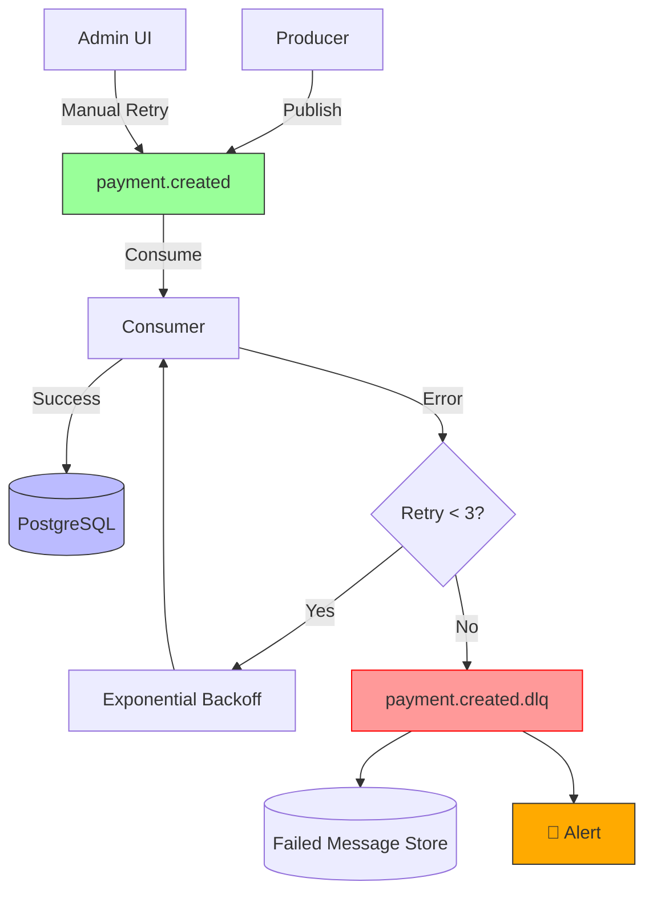

# Estándar Técnico — Dead Letter Queue

---

## 1. Propósito

Manejar mensajes que fallan repetidamente en procesamiento enviando a Dead Letter Queue (DLQ) después de N reintentos, evitando bloqueo de consumers, permitiendo análisis de errores y reintento manual.

---

## 2. Alcance

**Aplica a:**

- Todos los consumers de Kafka
- Mensajes con errores no recuperables
- Integraciones con sistemas externos que pueden fallar
- Validaciones de negocio que fallan

**No aplica a:**

- Errores transitorios (network timeout) → reintentar automáticamente
- Mensajes mal formados (JSON inválido) → descartar + log

---

## 3. Tecnologías Aprobadas

| Componente         | Tecnología        | Versión mínima | Observaciones           |
| ------------------ | ----------------- | -------------- | ----------------------- |
| **Message Broker** | Apache Kafka      | 3.6+           | Topic naming: `*.dlq`   |
| **Consumer**       | Confluent.Kafka   | 2.0+           | .NET client             |
| **Storage**        | PostgreSQL        | 14+            | Failed message metadata |
| **Monitoring**     | Grafana Loki      | -              | Alertas en DLQ          |
| **Retry**          | Manual / Admin UI | -              | Reprocesamient o        |

> El uso de tecnologías no listadas requiere aprobación de Arquitectura.

---

## 4. Requisitos Obligatorios 🔴

### Estrategia de Reintentos

- [ ] **Máximo 3 reintentos** por mensaje
- [ ] **Backoff exponencial**: 5s, 25s, 125s (5 \* 5^retry)
- [ ] **Clasificar errores**:
  - Recuperables (network timeout) → reintentar
  - No recuperables (validation failed) → DLQ inmediato
  - Poison pill (corrupt message) → descartar + log

### Dead Letter Queue

- [ ] **Naming**: `{topic}.dlq` (e.g., `payment.created.dlq`)
- [ ] **Metadata**: Original topic, partition, offset, error reason, timestamp, retry count
- [ ] **Retención**: 30 días (o indefinida si regulatorio)
- [ ] **Alertas**: Notificar si DLQ > 10 mensajes en 1 hora

### Monitoring

- [ ] **Métricas**: Mensajes en DLQ por topic
- [ ] **Dashboards**: Grafana con tendencias DLQ
- [ ] **On-call**: Alertar si tasa de error > 5%

---

## 5. Arquitectura DLQ



---

## 6. Implementación .NET

### Consumer con DLQ

```csharp
// Consumers/PaymentConsumerWithDLQ.cs
public class PaymentConsumerWithDLQ : BackgroundService
{
    private readonly IConsumer<string, string> _consumer;
    private readonly IProducer<string, string> _dlqProducer;
    private readonly ILogger<PaymentConsumerWithDLQ> _logger;
    private readonly ApplicationDbContext _dbContext;

    private const int MAX_RETRIES = 3;
    private const string TOPIC = "payment.created";
    private const string DLQ_TOPIC = "payment.created.dlq";

    protected override async Task ExecuteAsync(CancellationToken stoppingToken)
    {
        _consumer.Subscribe(TOPIC);

        while (!stoppingToken.IsCancellationRequested)
        {
            try
            {
                var consumeResult = _consumer.Consume(stoppingToken);
                var message = consumeResult.Message;

                // Retry counter en headers
                var retryCount = GetRetryCount(message.Headers);

                try
                {
                    // Procesar mensaje
                    var cloudEvent = JsonSerializer.Deserialize<CloudEvent>(message.Value)!;
                    await ProcessPaymentEventAsync(cloudEvent, stoppingToken);

                    // Éxito: hacer commit
                    _consumer.Commit(consumeResult);

                    _logger.LogInformation(
                        "Processed message from {Topic} partition {Partition} offset {Offset}",
                        consumeResult.Topic,
                        consumeResult.Partition,
                        consumeResult.Offset);
                }
                catch (Exception ex) when (IsRecoverableError(ex))
                {
                    // Error recuperable: reintentar con backoff
                    if (retryCount < MAX_RETRIES)
                    {
                        _logger.LogWarning(ex,
                            "Recoverable error processing message. Retry {RetryCount}/{MaxRetries}",
                            retryCount + 1,
                            MAX_RETRIES);

                        // Backoff exponencial: 5s, 25s, 125s
                        var delayMs = (int)(5000 * Math.Pow(5, retryCount));
                        await Task.Delay(delayMs, stoppingToken);

                        // NO hacer commit, Kafka reintenta automáticamente
                        // Incrementar retry count
                        message.Headers ??= new Headers();
                        message.Headers.Remove("retry-count");
                        message.Headers.Add("retry-count", Encoding.UTF8.GetBytes((retryCount + 1).ToString()));
                    }
                    else
                    {
                        // Máximo de reintentos alcanzado → DLQ
                        await SendToDLQAsync(consumeResult, ex, retryCount);
                        _consumer.Commit(consumeResult); // Confirmar para no reprocesar
                    }
                }
                catch (Exception ex) when (!IsRecoverableError(ex))
                {
                    // Error no recuperable: DLQ inmediato
                    _logger.LogError(ex,
                        "Non-recoverable error processing message. Sending to DLQ.");

                    await SendToDLQAsync(consumeResult, ex, retryCount);
                    _consumer.Commit(consumeResult);
                }
            }
            catch (ConsumeException ex)
            {
                _logger.LogError(ex, "Error consuming from Kafka");
            }
        }
    }

    private async Task SendToDLQAsync(
        ConsumeResult<string, string> original,
        Exception error,
        int retryCount)
    {
        var dlqMessage = new Message<string, string>
        {
            Key = original.Message.Key,
            Value = original.Message.Value,
            Headers = new Headers(original.Message.Headers ?? new Headers())
        };

        // Metadata de error
        dlqMessage.Headers.Add("original-topic", Encoding.UTF8.GetBytes(original.Topic));
        dlqMessage.Headers.Add("original-partition", BitConverter.GetBytes(original.Partition.Value));
        dlqMessage.Headers.Add("original-offset", BitConverter.GetBytes(original.Offset.Value));
        dlqMessage.Headers.Add("error-reason", Encoding.UTF8.GetBytes(error.Message));
        dlqMessage.Headers.Add("error-type", Encoding.UTF8.GetBytes(error.GetType().Name));
        dlqMessage.Headers.Add("retry-count", Encoding.UTF8.GetBytes(retryCount.ToString()));
        dlqMessage.Headers.Add("failed-at", Encoding.UTF8.GetBytes(DateTime.UtcNow.ToString("O")));

        // Enviar a DLQ
        await _dlqProducer.ProduceAsync(DLQ_TOPIC, dlqMessage);

        // Persistir metadata en BD para auditoría
        var failedMessage = new FailedMessage
        {
            Id = Guid.NewGuid(),
            OriginalTopic = original.Topic,
            Partition = original.Partition.Value,
            Offset = original.Offset.Value,
            MessageKey = original.Message.Key,
            MessageValue = original.Message.Value,
            ErrorReason = error.Message,
            ErrorStackTrace = error.StackTrace,
            RetryCount = retryCount,
            FailedAt = DateTime.UtcNow
        };

        _dbContext.FailedMessages.Add(failedMessage);
        await _dbContext.SaveChangesAsync();

        _logger.LogError(
            "Message sent to DLQ: {DLQTopic}. Original: {Topic}/{Partition}/{Offset}",
            DLQ_TOPIC,
            original.Topic,
            original.Partition,
            original.Offset);
    }

    private static int GetRetryCount(Headers? headers)
    {
        if (headers == null) return 0;

        var header = headers.FirstOrDefault(h => h.Key == "retry-count");
        if (header == null) return 0;

        var value = Encoding.UTF8.GetString(header.GetValueBytes());
        return int.TryParse(value, out var count) ? count : 0;
    }

    private static bool IsRecoverableError(Exception ex)
    {
        return ex is HttpRequestException    // Network timeout
            || ex is TimeoutException         // DB timeout
            || ex is TaskCanceledException;   // Cancellation
    }

    private async Task ProcessPaymentEventAsync(CloudEvent cloudEvent, CancellationToken ct)
    {
        var payload = JsonSerializer.Deserialize<PaymentCreatedEvent>(cloudEvent.Data!.ToString()!);

        // Simular validación de negocio
        if (payload!.Amount <= 0)
        {
            throw new ValidationException("Amount must be positive"); // No recuperable → DLQ
        }

        // Procesar...
    }
}
```

---

## 7. Base de Datos - Failed Messages

```sql
-- Tabla para auditoría de mensajes fallidos
CREATE TABLE failed_messages (
    id UUID PRIMARY KEY DEFAULT gen_random_uuid(),
    original_topic VARCHAR(255) NOT NULL,
    partition INT NOT NULL,
    offset BIGINT NOT NULL,
    message_key VARCHAR(500),
    message_value TEXT NOT NULL,
    error_reason TEXT,
    error_stack_trace TEXT,
    retry_count INT DEFAULT 0,
    failed_at TIMESTAMP NOT NULL DEFAULT NOW(),
    reprocessed_at TIMESTAMP,
    reprocess_status VARCHAR(50),  -- pending, success, failed

    CONSTRAINT unique_message UNIQUE (original_topic, partition, offset)
);

CREATE INDEX idx_failed_messages_topic
  ON failed_messages(original_topic, failed_at DESC);

CREATE INDEX idx_failed_messages_status
  ON failed_messages(reprocess_status, failed_at DESC);
```

---

## 8. Manual Retry - Admin Tool

```csharp
// Controllers/DLQController.cs
[ApiController]
[Route("api/admin/dlq")]
[Authorize(Roles = "admin")]
public class DLQController : ControllerBase
{
    private readonly ApplicationDbContext _dbContext;
    private readonly IProducer<string, string> _producer;

    [HttpGet("failed-messages")]
    public async Task<IActionResult> GetFailedMessages(
        [FromQuery] string? topic = null,
        [FromQuery] int page = 1,
        [FromQuery] int pageSize = 50)
    {
        var query = _dbContext.FailedMessages.AsQueryable();

        if (!string.IsNullOrEmpty(topic))
        {
            query = query.Where(m => m.OriginalTopic == topic);
        }

        var total = await query.CountAsync();
        var messages = await query
            .OrderByDescending(m => m.FailedAt)
            .Skip((page - 1) * pageSize)
            .Take(pageSize)
            .ToListAsync();

        return Ok(new
        {
            total,
            page,
            pageSize,
            data = messages
        });
    }

    [HttpPost("retry/{id}")]
    public async Task<IActionResult> RetryMessage(Guid id)
    {
        var failedMessage = await _dbContext.FailedMessages
            .FirstOrDefaultAsync(m => m.Id == id);

        if (failedMessage == null)
        {
            return NotFound();
        }

        // Republicar mensaje al topic original
        var message = new Message<string, string>
        {
            Key = failedMessage.MessageKey,
            Value = failedMessage.MessageValue
        };

        await _producer.ProduceAsync(failedMessage.OriginalTopic, message);

        // Marcar como reprocesado
        failedMessage.ReprocessedAt = DateTime.UtcNow;
        failedMessage.ReprocessStatus = "pending";
        await _dbContext.SaveChangesAsync();

        return Ok(new { message = "Message republished to original topic" });
    }
}
```

---

## 9. Kafka Topic Configuration

```bash
# Crear DLQ topics (una vez por topic)
kafka-topics.sh --create \
  --bootstrap-server localhost:9092 \
  --topic payment.created.dlq \
  --partitions 3 \
  --replication-factor 3 \
  --config retention.ms=2592000000  # 30 días

kafka-topics.sh --create \
  --bootstrap-server localhost:9092 \
  --topic order.created.dlq \
  --partitions 3 \
  --replication-factor 3 \
  --config retention.ms=2592000000
```

---

## 10. Monitoring - Grafana Dashboard

```promql
# Métrica de mensajes en DLQ (simular con logs)
count_over_time({topic=~".*\.dlq"} [1h])

# Tasa de error por topic
sum by (topic) (
  rate({topic!~".*\.dlq"} |= "error" [5m])
)

# Alerta si DLQ > 10 mensajes en 1h
count_over_time({topic="payment.created.dlq"} [1h]) > 10
```

---

## 11. Validación de Cumplimiento

```bash
# Listar todos los DLQ topics
kafka-topics.sh --list --bootstrap-server localhost:9092 | grep ".dlq$"

# Ver mensajes en DLQ
kafka-console-consumer.sh \
  --bootstrap-server localhost:9092 \
  --topic payment.created.dlq \
  --from-beginning \
  --max-messages 10

# Consultar mensajes fallidos en BD
psql -h localhost -U app_user -d app_db <<EOF
SELECT
  original_topic,
  COUNT(*) as failed_count,
  MAX(failed_at) as last_failure
FROM failed_messages
WHERE failed_at > NOW() - INTERVAL '24 hours'
GROUP BY original_topic
ORDER BY failed_count DESC;
EOF
```

---

## 12. Referencias

**Patterns:**

- [Dead Letter Channel (Enterprise Integration Patterns)](https://www.enterpriseintegrationpatterns.com/patterns/messaging/DeadLetterChannel.html)

**Kafka:**

- [Kafka Error Handling](https://kafka.apache.org/documentation/#consumerconfigs)

**AWS:**

- [SQS Dead Letter Queues](https://docs.aws.amazon.com/AWSSimpleQueueService/latest/SQSDeveloperGuide/sqs-dead-letter-queues.html)
