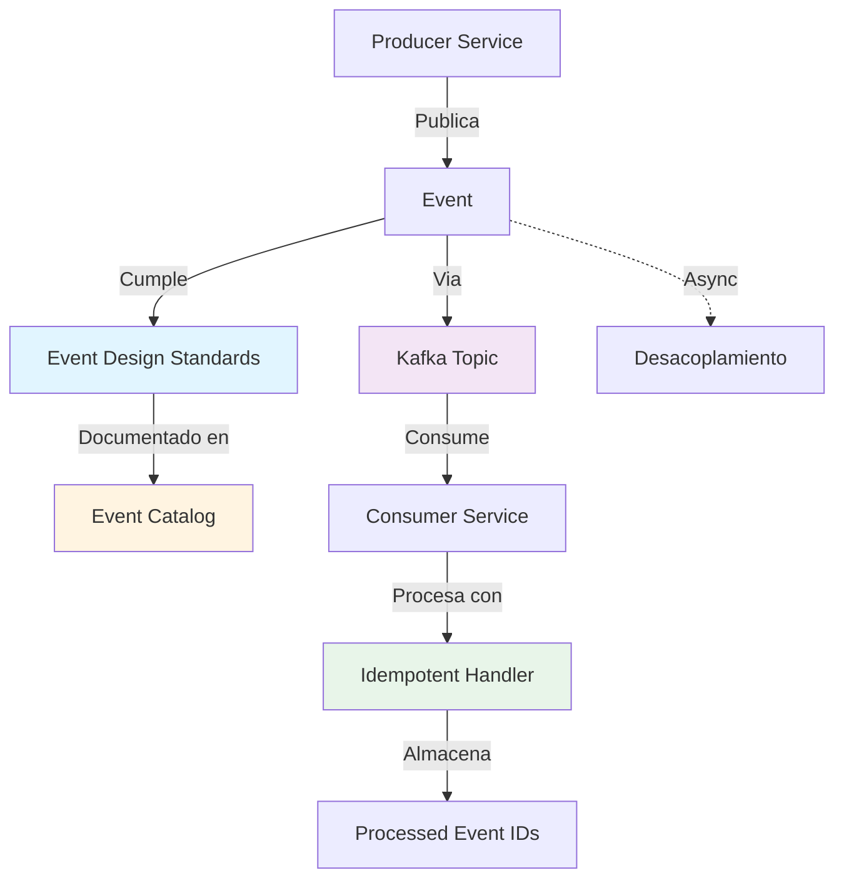
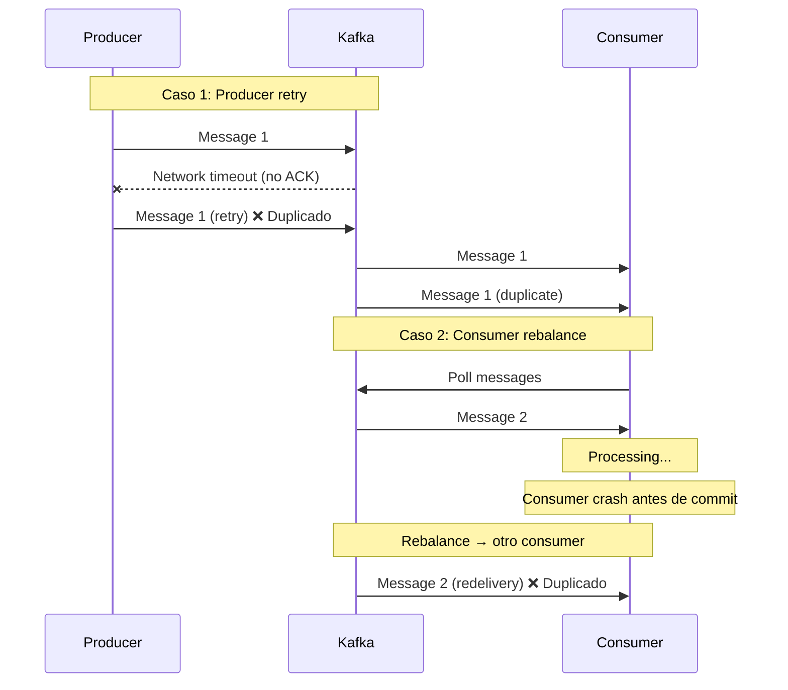
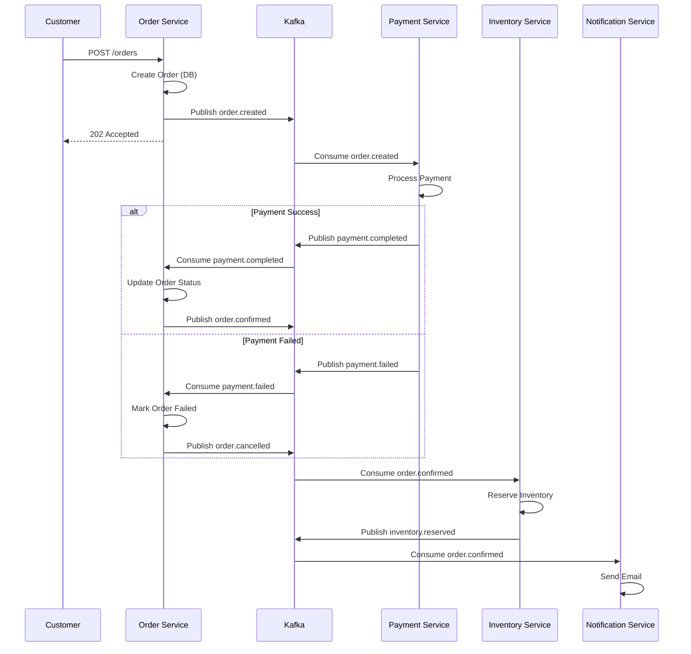

# Event-Driven Architecture

## Contexto

Este estándar define prácticas para implementar arquitectura basada en eventos (EDA) usando Apache Kafka, incluyendo diseño de eventos, catálogo centralizado, mensajería asíncrona e idempotencia. Complementa el lineamiento [Comunicación Asíncrona y Eventos](../../lineamientos/arquitectura/08-comunicacion-asincrona-y-eventos.md) asegurando comunicación desacoplada, escalable y confiable entre servicios.

**Conceptos incluidos:**

- **Async Messaging** → Comunicación asíncrona producer-consumer vía Kafka
- **Event Design** → Estructura, naming conventions, versionado de eventos
- **Event Catalog** → Registro centralizado de eventos disponibles
- **Idempotency** → Procesamiento seguro de duplicados

---

## Stack Tecnológico

| Componente            | Tecnología           | Versión | Uso                                  |
| --------------------- | -------------------- | ------- | ------------------------------------ |
| **Message Broker**    | Apache Kafka (Kraft) | 3.6+    | Event streaming platform             |
| **Producer/Consumer** | Confluent.Kafka      | 2.3+    | Cliente Kafka para .NET              |
| **Event Store**       | PostgreSQL           | 15+     | Almacenamiento de eventos (opcional) |
| **Schema Management** | JSON Schema          | -       | Validación de estructura de eventos  |
| **Serialization**     | System.Text.Json     | .NET 8  | Serialización JSON                   |
| **Observability**     | OpenTelemetry        | 1.7+    | Tracing distribuido                  |
| **Monitoring**        | Grafana Stack        | -       | Métricas de Kafka y consumers        |

---

## Conceptos Fundamentales

Este estándar cubre 4 prácticas relacionadas con arquitectura basada en eventos:

### Índice de Conceptos

1. **Async Messaging**: Comunicación asíncrona desacoplada via Kafka
2. **Event Design**: Estructura, naming, versionado de eventos
3. **Event Catalog**: Registro centralizado documentando todos los eventos
4. **Idempotency**: Procesamiento determinístico evitando side-effects duplicados

### Relación entre Conceptos



**Principios clave:**

1. **Desacoplamiento temporal**: Producer no espera respuesta de consumers
2. **Desacoplamiento espacial**: Producer no conoce identidad de consumers
3. **Event immutability**: Eventos nunca se modifican, solo se agregan nuevos
4. **Schema evolution**: Retrocompatibilidad en cambios de eventos

---

## 1. Async Messaging

### ¿Qué es Async Messaging?

Patrón de comunicación donde un servicio **producer** publica eventos a Kafka sin esperar respuesta, y uno o más servicios **consumers** procesan esos eventos de forma independiente.

**Propósito:** Desacoplar servicios, permitir procesamiento asíncrono, mejorar escalabilidad y resiliencia.

**Características clave:**

- **Fire-and-forget**: Producer no bloquea esperando confirmación de procesamiento
- **Multiple subscribers**: Muchos consumers pueden procesar el mismo evento
- **Durable queuing**: Kafka persiste eventos (retention configurable)
- **Ordered delivery**: Orden garantizado dentro de una partition

**Beneficios:**
✅ Desacoplamiento (producer/consumer evolucionan independientemente)
✅ Escalabilidad (consumers escalan horizontalmente con partitions)
✅ Resiliencia (Kafka buffer entre servicios)
✅ Auditoría (eventos persistidos para replay)

### Comparación: Sync vs Async

```csharp
// ❌ SINCRÓNICO: Coupling alto, latencia alta
public class OrderService
{
    private readonly HttpClient _httpClient;

    public async Task CreateOrderAsync(Order order)
    {
        // 1. Crear orden
        await _repository.AddAsync(order);

        // 2. Llamar a Payment Service (BLOQUEANTE)
        var paymentResponse = await _httpClient.PostAsJsonAsync(
            "https://payment-service/api/payments",
            new { order.Id, order.Total });
        if (!paymentResponse.IsSuccessStatusCode)
            throw new Exception("Payment failed");

        // 3. Llamar a Inventory Service (BLOQUEANTE)
        var inventoryResponse = await _httpClient.PostAsJsonAsync(
            "https://inventory-service/api/reserve",
            new { order.Items });
        if (!inventoryResponse.IsSuccessStatusCode)
            throw new Exception("Inventory reservation failed");

        // 4. Llamar a Notification Service (BLOQUEANTE)
        await _httpClient.PostAsJsonAsync(
            "https://notification-service/api/notify",
            new { order.CustomerEmail, order.Id });

        // Total latency = DB + Payment + Inventory + Notification
        // Si cualquier servicio falla → rollback complejo
    }
}

// Problemas:
// 1. Alto acoplamiento (OrderService conoce 3 servicios)
// 2. Latencia acumulativa (suma de todas las llamadas)
// 3. Failure cascade (un servicio down → todo falla)
// 4. Difícil escalar (bottleneck en servicios llamados)
```

```csharp
// ✅ ASÍNCRONO: Desacoplado, latencia baja
public class OrderService
{
    private readonly IProducer<string, string> _producer;
    private readonly ILogger<OrderService> _logger;

    public async Task CreateOrderAsync(Order order)
    {
        // 1. Crear orden (solo persistencia local)
        await _repository.AddAsync(order);

        // 2. Publicar evento OrderCreated (NO BLOQUEANTE)
        var @event = new OrderCreatedEvent
        {
            EventId = Guid.NewGuid(),
            Timestamp = DateTimeOffset.UtcNow,
            OrderId = order.Id,
            CustomerId = order.CustomerId,
            Items = order.Items,
            Total = order.Total
        };

        await _producer.ProduceAsync("order.created", new Message<string, string>
        {
            Key = order.Id.ToString(),  // Partition key
            Value = JsonSerializer.Serialize(@event)
        });

        _logger.LogInformation("OrderCreated event published: {OrderId}", order.Id);

        // Total latency = DB + Kafka produce (~10ms)
        // Otros servicios procesan asíncronamente
    }
}

// Beneficios:
// 1. OrderService no conoce Payment/Inventory/Notification
// 2. Latencia mínima (~10ms para publicar a Kafka)
// 3. Resiliencia (si Payment está down, evento persiste en Kafka)
// 4. Escalabilidad (cada consumer escala independientemente)

// Payment Service (consumer independiente)
public class PaymentConsumer : BackgroundService
{
    protected override async Task ExecuteAsync(CancellationToken stoppingToken)
    {
        using var consumer = new ConsumerBuilder<string, string>(_config).Build();
        consumer.Subscribe("order.created");

        while (!stoppingToken.IsCancellationRequested)
        {
            var result = consumer.Consume(stoppingToken);
            var @event = JsonSerializer.Deserialize<OrderCreatedEvent>(result.Message.Value);

            // Procesar pago asíncronamente
            await ProcessPaymentAsync(@event);

            consumer.Commit(result);
        }
    }
}
```

### Producer Configuration (.NET)

```csharp
// Program.cs
using Confluent.Kafka;

var builder = WebApplication.CreateBuilder(args);

// Configuración de Producer
var producerConfig = new ProducerConfig
{
    BootstrapServers = builder.Configuration["Kafka:BootstrapServers"], // "broker1:9092,broker2:9092,broker3:9092"

    // Durabilidad
    Acks = Acks.All,  // Esperar confirmación de todos los in-sync replicas
    EnableIdempotence = true,  // Prevenir duplicados en caso de retry

    // Performance
    CompressionType = CompressionType.Snappy,  // Comprimir mensajes
    LingerMs = 10,  // Batch messages por 10ms
    BatchSize = 32768,  // 32KB batch size

    // Retry
    MessageSendMaxRetries = 3,
    RetryBackoffMs = 100,

    // Timeout
    RequestTimeoutMs = 30000  // 30s timeout
};

builder.Services.AddSingleton<IProducer<string, string>>(sp =>
    new ProducerBuilder<string, string>(producerConfig)
        .SetErrorHandler((producer, error) =>
        {
            var logger = sp.GetRequiredService<ILogger<Program>>();
            logger.LogError("Kafka producer error: {Error}", error.Reason);
        })
        .Build());

var app = builder.Build();
```

### Consumer Configuration (.NET)

```csharp
// Consumers/OrderCreatedConsumer.cs
using Confluent.Kafka;

public class OrderCreatedConsumer : BackgroundService
{
    private readonly IConsumer<string, string> _consumer;
    private readonly IServiceProvider _serviceProvider;
    private readonly ILogger<OrderCreatedConsumer> _logger;

    public OrderCreatedConsumer(IConfiguration configuration, IServiceProvider serviceProvider, ILogger<OrderCreatedConsumer> logger)
    {
        var consumerConfig = new ConsumerConfig
        {
            BootstrapServers = configuration["Kafka:BootstrapServers"],
            GroupId = "payment-service-group",  // Consumer group

            // Offset management
            AutoOffsetReset = AutoOffsetReset.Earliest,  // Leer desde el inicio si no hay offset
            EnableAutoCommit = false,  // Commit manual (más control)

            // Performance
            FetchMinBytes = 1024,  // Min 1KB para fetch
            FetchWaitMaxMs = 500,  // Esperar 500ms para acumular mensajes

            // Session
            SessionTimeoutMs = 30000,  // 30s timeout para heartbeat
            HeartbeatIntervalMs = 3000  // Heartbeat cada 3s
        };

        _consumer = new ConsumerBuilder<string, string>(consumerConfig)
            .SetErrorHandler((consumer, error) =>
            {
                logger.LogError("Kafka consumer error: {Error}", error.Reason);
            })
            .Build();

        _serviceProvider = serviceProvider;
        _logger = logger;
    }

    protected override async Task ExecuteAsync(CancellationToken stoppingToken)
    {
        _consumer.Subscribe("order.created");
        _logger.LogInformation("Subscribed to topic: order.created");

        while (!stoppingToken.IsCancellationRequested)
        {
            try
            {
                var result = _consumer.Consume(stoppingToken);

                _logger.LogInformation(
                    "Consumed event from partition {Partition}, offset {Offset}",
                    result.Partition.Value,
                    result.Offset.Value);

                // Procesar evento con scope (DI correcto)
                using var scope = _serviceProvider.CreateScope();
                var handler = scope.ServiceProvider.GetRequiredService<IOrderCreatedHandler>();

                await handler.HandleAsync(result.Message.Value, stoppingToken);

                // Commit manual (solo si procesamiento exitoso)
                _consumer.Commit(result);

                _logger.LogInformation("Event processed successfully: {Offset}", result.Offset.Value);
            }
            catch (ConsumeException ex)
            {
                _logger.LogError(ex, "Error consuming message");
            }
            catch (Exception ex)
            {
                _logger.LogError(ex, "Error processing event");
                // No hacer commit → mensaje se reprocesará
            }
        }

        _consumer.Close();
    }

    public override void Dispose()
    {
        _consumer?.Dispose();
        base.Dispose();
    }
}
```

### Partition Key Strategy

```csharp
// Partition key determina a qué partition va el evento
// → Todos los eventos con mismo key van a misma partition (orden garantizado)

public class OrderEventProducer
{
    private readonly IProducer<string, string> _producer;

    public async Task PublishOrderCreatedAsync(Order order)
    {
        // Key = CustomerId → Todos los eventos de un cliente en misma partition
        // Garantiza: eventos de un cliente se procesan en orden
        await _producer.ProduceAsync("order.created", new Message<string, string>
        {
            Key = order.CustomerId.ToString(),  // IMPORTANTE: partition key
            Value = JsonSerializer.Serialize(new OrderCreatedEvent
            {
                EventId = Guid.NewGuid(),
                OrderId = order.Id,
                CustomerId = order.CustomerId,
                Total = order.Total
            }),
            Headers = new Headers
            {
                { "event-type", Encoding.UTF8.GetBytes("OrderCreated") },
                { "event-version", Encoding.UTF8.GetBytes("1.0") }
            }
        });
    }
}

// Alternativa: Key = OrderId (eventos de una orden en orden)
// Alternativa: Key = null (round-robin entre partitions, NO garantiza orden)
```

---

## 2. Event Design

### ¿Qué es Event Design?

Definición de estructura, naming conventions, versionado y contratos de eventos para asegurar consistencia, evolucionabilidad y comprensión cross-service.

**Propósito:** Estandarizar eventos para facilitar integración, debugging y evolución.

**Componentes clave:**

- **Event structure**: Metadata + payload
- **Naming conventions**: `{domain}.{entity}.{action}` (past tense)
- **Versioning**: Semantic versioning para evolución
- **Backward compatibility**: Cambios no rompen consumers existentes

**Beneficios:**
✅ Comprensión rápida de eventos
✅ Debugging simplificado (metadata rica)
✅ Evolución sin breaking changes
✅ Integración cross-team facilitada

### Event Structure Standard

```csharp
// Estructura base de evento (envelope pattern)
public abstract class DomainEvent
{
    // METADATA (común a todos los eventos)

    [JsonPropertyName("event_id")]
    public Guid EventId { get; set; } = Guid.NewGuid();

    [JsonPropertyName("event_type")]
    public string EventType { get; set; }  // "order.created"

    [JsonPropertyName("event_version")]
    public string EventVersion { get; set; }  // "1.0"

    [JsonPropertyName("timestamp")]
    public DateTimeOffset Timestamp { get; set; } = DateTimeOffset.UtcNow;

    [JsonPropertyName("correlation_id")]
    public string? CorrelationId { get; set; }  // Para tracing distribuido

    [JsonPropertyName("causation_id")]
    public string? CausationId { get; set; }  // ID del evento que causó este

    [JsonPropertyName("source_service")]
    public string SourceService { get; set; }  // "order-service"

    [JsonPropertyName("aggregate_id")]
    public string AggregateId { get; set; }  // ID del aggregate (OrderId, CustomerId, etc.)

    [JsonPropertyName("aggregate_type")]
    public string AggregateType { get; set; }  // "Order", "Customer", etc.
}

// Evento específico
public class OrderCreatedEvent : DomainEvent
{
    public OrderCreatedEvent()
    {
        EventType = "order.created";
        EventVersion = "1.0";
        SourceService = "order-service";
        AggregateType = "Order";
    }

    // PAYLOAD (específico del evento)

    [JsonPropertyName("order_id")]
    public Guid OrderId { get; set; }

    [JsonPropertyName("customer_id")]
    public Guid CustomerId { get; set; }

    [JsonPropertyName("items")]
    public List<OrderItemDto> Items { get; set; }

    [JsonPropertyName("total_amount")]
    public decimal TotalAmount { get; set; }

    [JsonPropertyName("currency")]
    public string Currency { get; set; } = "USD";

    [JsonPropertyName("status")]
    public string Status { get; set; } = "Pending";
}

public class OrderItemDto
{
    [JsonPropertyName("product_id")]
    public Guid ProductId { get; set; }

    [JsonPropertyName("quantity")]
    public int Quantity { get; set; }

    [JsonPropertyName("unit_price")]
    public decimal UnitPrice { get; set; }
}
```

**Ejemplo JSON serializado:**

```json
{
  "event_id": "f47ac10b-58cc-4372-a567-0e02b2c3d479",
  "event_type": "order.created",
  "event_version": "1.0",
  "timestamp": "2026-02-19T15:30:00Z",
  "correlation_id": "req-123456",
  "causation_id": null,
  "source_service": "order-service",
  "aggregate_id": "550e8400-e29b-41d4-a716-446655440000",
  "aggregate_type": "Order",
  "order_id": "550e8400-e29b-41d4-a716-446655440000",
  "customer_id": "7c9e6679-7425-40de-944b-e07fc1f90ae7",
  "items": [
    {
      "product_id": "a0eebc99-9c0b-4ef8-bb6d-6bb9bd380a11",
      "quantity": 2,
      "unit_price": 29.99
    }
  ],
  "total_amount": 59.98,
  "currency": "USD",
  "status": "Pending"
}
```

### Naming Conventions

| Componente     | Formato                                   | Ejemplo                              |
| -------------- | ----------------------------------------- | ------------------------------------ |
| **Event Type** | `{domain}.{entity}.{action}` (past tense) | `order.created`, `payment.completed` |
| **Topic Name** | `{domain}.{entity}.{action}` (snake_case) | `order.created`, `customer.updated`  |
| **Class Name** | `{Entity}{Action}Event` (PascalCase)      | `OrderCreatedEvent`                  |
| **Properties** | `snake_case` en JSON, `PascalCase` en C#  | `customer_id` / `CustomerId`         |

**Verbos recomendados (past tense):**

- `created`, `updated`, `deleted`
- `submitted`, `approved`, `rejected`
- `completed`, `failed`, `cancelled`
- `started`, `finished`, `expired`

**Antipatrones:**

- ❌ `CreateOrder` (imperativo, usa `order.created`)
- ❌ `OrderCreate` (no past tense, usa `order.created`)
- ❌ `order-created` (guión no estandarizado, usa punto)
- ❌ `ORDER_CREATED` (mayúsculas, usa minúsculas)

### Event Versioning

```csharp
// VERSION 1.0 (inicial)
public class OrderCreatedEventV1 : DomainEvent
{
    public OrderCreatedEventV1()
    {
        EventType = "order.created";
        EventVersion = "1.0";
    }

    public Guid OrderId { get; set; }
    public Guid CustomerId { get; set; }
    public decimal TotalAmount { get; set; }
}

// VERSION 2.0 (agregar campo opcional - BACKWARD COMPATIBLE)
public class OrderCreatedEventV2 : DomainEvent
{
    public OrderCreatedEventV2()
    {
        EventType = "order.created";
        EventVersion = "2.0";
    }

    public Guid OrderId { get; set; }
    public Guid CustomerId { get; set; }
    public decimal TotalAmount { get; set; }

    // Nuevo campo OPCIONAL (nullable)
    public string? PaymentMethod { get; set; }  // ✅ Backward compatible
}

// Consumer que soporta ambas versiones
public class OrderCreatedHandler
{
    public async Task HandleAsync(string eventJson)
    {
        // Deserializar a un objeto base para leer metadata
        using var doc = JsonDocument.Parse(eventJson);
        var version = doc.RootElement.GetProperty("event_version").GetString();

        switch (version)
        {
            case "1.0":
                var eventV1 = JsonSerializer.Deserialize<OrderCreatedEventV1>(eventJson);
                await ProcessV1(eventV1);
                break;

            case "2.0":
                var eventV2 = JsonSerializer.Deserialize<OrderCreatedEventV2>(eventJson);
                await ProcessV2(eventV2);
                break;

            default:
                throw new NotSupportedException($"Event version {version} not supported");
        }
    }
}
```

**Reglas de versionado:**

| Cambio                          | Versión | Compatibilidad         |
| ------------------------------- | ------- | ---------------------- |
| Agregar campo opcional          | Minor   | ✅ Backward compatible |
| Cambiar nombre de campo         | Major   | ❌ Breaking change     |
| Eliminar campo                  | Major   | ❌ Breaking change     |
| Cambiar tipo de campo           | Major   | ❌ Breaking change     |
| Cambiar semántica (sin cambios) | N/A     | Evitar (documentar)    |

**Estrategia de deprecación:**

1. Publicar versión 2.0 nueva
2. Producer publica **ambas versiones** (1.0 y 2.0) por período de transición
3. Consumers migran gradualmente a 2.0
4. Después de N meses, deprecar 1.0 (solo publicar 2.0)

---

## 3. Event Catalog

### ¿Qué es Event Catalog?

Registro centralizado documentando todos los eventos del sistema: esquema, producers, consumers, ejemplos, evolución.

**Propósito:** Single source of truth para descubrir, entender e integrar eventos.

**Componentes clave:**

- **Event schema**: Estructura JSON Schema
- **Producer/Consumer registry**: Quién publica/consume cada evento
- **Examples**: Payloads reales de ejemplo
- **Changelog**: Historial de versiones

**Beneficios:**
✅ Descubrimiento de eventos (qué eventos existen)
✅ Self-service para nuevos consumers
✅ Documentación viva (actualizada con código)
✅ Impact analysis (quién se afecta por cambios)

### Estructura del Event Catalog

````markdown
# Event Catalog

## order.created

**Version**: 2.0
**Status**: Active
**Topic**: `order.created`

### Description

Evento publicado cuando una nueva orden es creada en el sistema.

### Schema

```json
{
  "$schema": "http://json-schema.org/draft-07/schema#",
  "type": "object",
  "required": [
    "event_id",
    "event_type",
    "order_id",
    "customer_id",
    "total_amount"
  ],
  "properties": {
    "event_id": { "type": "string", "format": "uuid" },
    "event_type": { "type": "string", "const": "order.created" },
    "event_version": { "type": "string", "const": "2.0" },
    "timestamp": { "type": "string", "format": "date-time" },
    "order_id": { "type": "string", "format": "uuid" },
    "customer_id": { "type": "string", "format": "uuid" },
    "total_amount": { "type": "number", "minimum": 0 },
    "currency": { "type": "string", "enum": ["USD", "EUR"] },
    "payment_method": {
      "type": "string",
      "enum": ["credit_card", "paypal", "bank_transfer"]
    }
  }
}
```
````

### Example Payload

```json
{
  "event_id": "f47ac10b-58cc-4372-a567-0e02b2c3d479",
  "event_type": "order.created",
  "event_version": "2.0",
  "timestamp": "2026-02-19T15:30:00Z",
  "order_id": "550e8400-e29b-41d4-a716-446655440000",
  "customer_id": "7c9e6679-7425-40de-944b-e07fc1f90ae7",
  "total_amount": 59.98,
  "currency": "USD",
  "payment_method": "credit_card"
}
```

### Producers

| Service       | Since  | Notes            |
| ------------- | ------ | ---------------- |
| order-service | v1.0.0 | Primary producer |

### Consumers

| Service              | Since  | Purpose                       |
| -------------------- | ------ | ----------------------------- |
| payment-service      | v1.0.0 | Process payment               |
| inventory-service    | v1.2.0 | Reserve inventory             |
| notification-service | v1.1.0 | Send order confirmation email |
| analytics-service    | v2.0.0 | Update sales metrics          |

### Changelog

| Version | Date       | Changes                      |
| ------- | ---------- | ---------------------------- |
| 2.0     | 2026-02-15 | Added `payment_method` field |
| 1.0     | 2025-06-01 | Initial version              |

### Related Events

- `order.updated`
- `order.cancelled`
- `payment.completed`

---

````

### Automated Catalog Generation

```csharp
// Generación automática del catálogo desde código
// Usando reflexión para escanear eventos

public class EventCatalogGenerator
{
    public async Task GenerateCatalogAsync(string outputPath)
    {
        var eventTypes = Assembly.GetExecutingAssembly()
            .GetTypes()
            .Where(t => t.IsSubclassOf(typeof(DomainEvent)) && !t.IsAbstract);

        var catalog = new StringBuilder();
        catalog.AppendLine("# Event Catalog");
        catalog.AppendLine();

        foreach (var eventType in eventTypes)
        {
            var eventInstance = (DomainEvent)Activator.CreateInstance(eventType);

            catalog.AppendLine($"## {eventInstance.EventType}");
            catalog.AppendLine();
            catalog.AppendLine($"**Version**: {eventInstance.EventVersion}");
            catalog.AppendLine($"**Class**: `{eventType.Name}`");
            catalog.AppendLine();

            // Schema from JsonSerializer
            var options = new JsonSerializerOptions { WriteIndented = true };
            var exampleJson = JsonSerializer.Serialize(eventInstance, options);

            catalog.AppendLine("### Example");
            catalog.AppendLine("```json");
            catalog.AppendLine(exampleJson);
            catalog.AppendLine("```");
            catalog.AppendLine();
            catalog.AppendLine("---");
            catalog.AppendLine();
        }

        await File.WriteAllTextAsync(outputPath, catalog.ToString());
    }
}
````

### Event Discovery API

```csharp
// API para consultar catálogo de eventos en runtime
[ApiController]
[Route("api/events")]
public class EventCatalogController : ControllerBase
{
    [HttpGet]
    public IActionResult ListEvents()
    {
        var eventTypes = Assembly.GetExecutingAssembly()
            .GetTypes()
            .Where(t => t.IsSubclassOf(typeof(DomainEvent)) && !t.IsAbstract)
            .Select(t =>
            {
                var instance = (DomainEvent)Activator.CreateInstance(t);
                return new
                {
                    EventType = instance.EventType,
                    Version = instance.EventVersion,
                    ClassName = t.Name,
                    Properties = t.GetProperties().Select(p => new
                    {
                        Name = p.Name,
                        Type = p.PropertyType.Name
                    })
                };
            });

        return Ok(eventTypes);
    }

    [HttpGet("{eventType}")]
    public IActionResult GetEventSchema(string eventType)
    {
        var type = Assembly.GetExecutingAssembly()
            .GetTypes()
            .FirstOrDefault(t =>
            {
                if (!t.IsSubclassOf(typeof(DomainEvent)) || t.IsAbstract)
                    return false;

                var instance = (DomainEvent)Activator.CreateInstance(t);
                return instance.EventType == eventType;
            });

        if (type == null)
            return NotFound($"Event type '{eventType}' not found");

        var instance = (DomainEvent)Activator.CreateInstance(type);
        var schema = JsonSerializer.Serialize(instance, new JsonSerializerOptions { WriteIndented = true });

        return Ok(new { EventType = eventType, Schema = schema });
    }
}
```

---

## 4. Idempotency

### ¿Qué es Idempotency?

Propiedad de una operación que produce el mismo resultado sin importar cuántas veces se ejecute con los mismos parámetros.

**Propósito:** Permitir procesamiento seguro de eventos duplicados (común en sistemas distribuidos por retries, redelivery, etc.).

**Estrategias:**

1. **Idempotent operations**: Operación naturalmente idempotente (ej. `SET value = X`)
2. **Idempotency key**: Almacenar IDs de eventos procesados y verificar antes de procesar
3. **Deterministic side-effects**: Garantizar que side-effects son repetibles

**Beneficios:**
✅ Safe retries (puede reintentar sin duplicar efectos)
✅ Exactly-once semantics (a nivel de negocio)
✅ Simplifica error handling (retry sin miedo)

### Causas de Duplicados en Kafka



### Implementación: Idempotency Key

```csharp
// 1. Tabla de eventos procesados
public class ProcessedEvent
{
    public Guid EventId { get; set; }  // PK
    public string EventType { get; set; }
    public DateTimeOffset ProcessedAt { get; set; }
    public string ConsumerGroupId { get; set; }
}

// 2. DbContext
public class EventStoreDbContext : DbContext
{
    public DbSet<ProcessedEvent> ProcessedEvents { get; set; }

    protected override void OnModelCreating(ModelBuilder modelBuilder)
    {
        modelBuilder.Entity<ProcessedEvent>(entity =>
        {
            entity.HasKey(e => e.EventId);
            entity.HasIndex(e => e.ProcessedAt);  // Para cleanup de eventos antiguos
        });
    }
}

// 3. Handler idempotente
public class IdempotentOrderCreatedHandler : IOrderCreatedHandler
{
    private readonly EventStoreDbContext _eventStore;
    private readonly IPaymentService _paymentService;
    private readonly ILogger<IdempotentOrderCreatedHandler> _logger;

    public async Task HandleAsync(string eventJson, CancellationToken cancellationToken)
    {
        var @event = JsonSerializer.Deserialize<OrderCreatedEvent>(eventJson);

        // 1. Verificar si ya procesamos este evento
        var alreadyProcessed = await _eventStore.ProcessedEvents
            .AnyAsync(e => e.EventId == @event.EventId, cancellationToken);

        if (alreadyProcessed)
        {
            _logger.LogInformation(
                "Event {EventId} already processed, skipping",
                @event.EventId);
            return;  // ✅ Idempotencia: no procesar duplicado
        }

        // 2. Procesar evento + registrar como procesado (transacción)
        using var transaction = await _eventStore.Database.BeginTransactionAsync(cancellationToken);

        try
        {
            // Procesar side-effects
            await _paymentService.ProcessPaymentAsync(@event.OrderId, @event.TotalAmount);

            // Registrar como procesado
            _eventStore.ProcessedEvents.Add(new ProcessedEvent
            {
                EventId = @event.EventId,
                EventType = @event.EventType,
                ProcessedAt = DateTimeOffset.UtcNow,
                ConsumerGroupId = "payment-service-group"
            });

            await _eventStore.SaveChangesAsync(cancellationToken);
            await transaction.CommitAsync(cancellationToken);

            _logger.LogInformation("Event {EventId} processed successfully", @event.EventId);
        }
        catch (Exception ex)
        {
            await transaction.RollbackAsync(cancellationToken);
            _logger.LogError(ex, "Error processing event {EventId}", @event.EventId);
            throw;  // Consumer no hará commit → Kafka redelivery
        }
    }
}
```

**Ventajas:**

- ✅ Garantiza exactly-once processing a nivel de negocio
- ✅ Simple de implementar (tabla + check)
- ✅ Funciona con cualquier side-effect

**Desventajas:**

- ⚠️ Requiere persistencia (DB query adicional)
- ⚠️ Necesita cleanup periódico de eventos antiguos

### Cleanup de eventos procesados

```csharp
// Background service para limpiar eventos antiguos
public class ProcessedEventsCleanupService : BackgroundService
{
    private readonly IServiceProvider _serviceProvider;
    private readonly ILogger<ProcessedEventsCleanupService> _logger;

    protected override async Task ExecuteAsync(CancellationToken stoppingToken)
    {
        while (!stoppingToken.IsCancellationRequested)
        {
            try
            {
                using var scope = _serviceProvider.CreateScope();
                var dbContext = scope.ServiceProvider.GetRequiredService<EventStoreDbContext>();

                // Eliminar eventos procesados hace más de 30 días
                var cutoffDate = DateTimeOffset.UtcNow.AddDays(-30);

                var deletedCount = await dbContext.ProcessedEvents
                    .Where(e => e.ProcessedAt < cutoffDate)
                    .ExecuteDeleteAsync(stoppingToken);

                if (deletedCount > 0)
                {
                    _logger.LogInformation(
                        "Cleaned up {Count} processed events older than {CutoffDate}",
                        deletedCount,
                        cutoffDate);
                }
            }
            catch (Exception ex)
            {
                _logger.LogError(ex, "Error cleaning up processed events");
            }

            // Ejecutar diariamente
            await Task.Delay(TimeSpan.FromDays(1), stoppingToken);
        }
    }
}
```

### Alternativa: Idempotencia Natural

```csharp
// Operaciones naturalmente idempotentes no necesitan idempotency key

// ❌ NO IDEMPOTENTE: Incrementar balance
public async Task HandlePaymentCompleted(PaymentCompletedEvent @event)
{
    var account = await _repository.GetAccountAsync(@event.AccountId);
    account.Balance += @event.Amount;  // ❌ Si se procesa 2 veces → balance incorrecto
    await _repository.UpdateAsync(account);
}

// ✅ IDEMPOTENTE: Set balance (usando event sourcing)
public async Task HandlePaymentCompleted(PaymentCompletedEvent @event)
{
    // Calcular balance desde todos los eventos
    var events = await _eventStore.GetEventsAsync(@event.AccountId);
    var balance = events.Sum(e => e.Amount);

    var account = await _repository.GetAccountAsync(@event.AccountId);
    account.Balance = balance;  // ✅ Idempotente (SET, no INCREMENT)
    await _repository.UpdateAsync(account);
}

// ✅ IDEMPOTENTE: Upsert con unique constraint
public async Task HandleCustomerUpdated(CustomerUpdatedEvent @event)
{
    // Unique constraint en CustomerId garantiza no duplicados
    await _repository.UpsertAsync(new Customer
    {
        CustomerId = @event.CustomerId,  // PK
        Name = @event.Name,
        Email = @event.Email
    });  // ✅ Si se ejecuta 2 veces → mismo resultado
}
```

---

## Implementación Integrada

### Ejemplo: Order Processing Flow Completo

```csharp
// 1. Order Service: Publicar OrderCreated
public class OrderService
{
    private readonly IProducer<string, string> _producer;
    private readonly OrderDbContext _dbContext;

    public async Task<Order> CreateOrderAsync(CreateOrderCommand command)
    {
        // Crear orden en DB local
        var order = new Order
        {
            OrderId = Guid.NewGuid(),
            CustomerId = command.CustomerId,
            Items = command.Items,
            TotalAmount = command.Items.Sum(i => i.Quantity * i.UnitPrice),
            Status = OrderStatus.Pending
        };

        _dbContext.Orders.Add(order);
        await _dbContext.SaveChangesAsync();

        // Publicar evento
        var @event = new OrderCreatedEvent
        {
            EventId = Guid.NewGuid(),
            OrderId = order.OrderId,
            CustomerId = order.CustomerId,
            Items = order.Items.Select(i => new OrderItemDto
            {
                ProductId = i.ProductId,
                Quantity = i.Quantity,
                UnitPrice = i.UnitPrice
            }).ToList(),
            TotalAmount = order.TotalAmount,
            Currency = "USD",
            CorrelationId = Activity.Current?.Id  // Distributed tracing
        };

        await _producer.ProduceAsync("order.created", new Message<string, string>
        {
            Key = order.CustomerId.ToString(),  // Partition por cliente
            Value = JsonSerializer.Serialize(@event),
            Headers = new Headers
            {
                { "event-type", Encoding.UTF8.GetBytes("order.created") },
                { "event-version", Encoding.UTF8.GetBytes("2.0") },
                { "correlation-id", Encoding.UTF8.GetBytes(@event.CorrelationId ?? "") }
            }
        });

        return order;
    }
}

// 2. Payment Service: Consumir OrderCreated
public class PaymentService
{
    public async Task ProcessPaymentAsync(OrderCreatedEvent @event)
    {
        // Idempotency check
        if (await _eventStore.IsProcessedAsync(@event.EventId))
            return;

        // Procesar pago
        var payment = await _paymentGateway.ChargeAsync(
            @event.CustomerId,
            @event.TotalAmount,
            @event.Currency);

        // Registrar evento procesado
        await _eventStore.MarkAsProcessedAsync(@event.EventId);

        // Publicar evento de resultado
        if (payment.Success)
        {
            await _producer.ProduceAsync("payment.completed", new Message<string, string>
            {
                Key = @event.OrderId.ToString(),
                Value = JsonSerializer.Serialize(new PaymentCompletedEvent
                {
                    EventId = Guid.NewGuid(),
                    OrderId = @event.OrderId,
                    PaymentId = payment.PaymentId,
                    Amount = @event.TotalAmount,
                    CausationId = @event.EventId.ToString(),  // Link a evento causante
                    CorrelationId = @event.CorrelationId
                })
            });
        }
        else
        {
            await _producer.ProduceAsync("payment.failed", new Message<string, string>
            {
                Key = @event.OrderId.ToString(),
                Value = JsonSerializer.Serialize(new PaymentFailedEvent
                {
                    EventId = Guid.NewGuid(),
                    OrderId = @event.OrderId,
                    Reason = payment.ErrorMessage,
                    CausationId = @event.EventId.ToString(),
                    CorrelationId = @event.CorrelationId
                })
            });
        }
    }
}

// 3. Order Service: Consumir PaymentCompleted/Failed (Saga)
public class OrderSagaHandler
{
    public async Task HandlePaymentCompleted(PaymentCompletedEvent @event)
    {
        var order = await _repository.GetOrderAsync(@event.OrderId);
        order.Status = OrderStatus.PaymentConfirmed;
        await _repository.UpdateAsync(order);

        // Publicar siguiente evento en saga
        await _producer.ProduceAsync("order.confirmed", ...);
    }

    public async Task HandlePaymentFailed(PaymentFailedEvent @event)
    {
        var order = await _repository.GetOrderAsync(@event.OrderId);
        order.Status = OrderStatus.PaymentFailed;
        order.FailureReason = @event.Reason;
        await _repository.UpdateAsync(order);

        // Compensar: publicar evento de cancelación
        await _producer.ProduceAsync("order.cancelled", ...);
    }
}
```

### Event Flow Diagram



---

## Requisitos Técnicos

### MUST (Obligatorio)

**Async Messaging:**

- **MUST** usar Apache Kafka para comunicación asíncrona entre servicios
- **MUST** configurar `Acks = Acks.All` en producers para durabilidad
- **MUST** habilitar `EnableIdempotence = true` en producers
- **MUST** usar commit manual en consumers (`EnableAutoCommit = false`)
- **MUST** usar partition keys apropiados para garantizar orden cuando sea necesario

**Event Design:**

- **MUST** incluir metadata estándar en todos los eventos: `event_id`, `event_type`, `event_version`, `timestamp`, `correlation_id`, `source_service`, `aggregate_id`
- **MUST** usar naming convention `{domain}.{entity}.{action}` (past tense) para event types
- **MUST** usar semantic versioning para eventos (major.minor)
- **MUST** mantener backward compatibility en cambios minor (solo agregar campos opcionales)
- **MUST** serializar eventos en JSON con `snake_case` para property names

**Event Catalog:**

- **MUST** documentar todos los eventos en catálogo centralizado
- **MUST** incluir schema, ejemplos, producers y consumers para cada evento
- **MUST** mantener changelog de versiones de eventos

**Idempotency:**

- **MUST** implementar idempotency en todos los event handlers
- **MUST** usar `event_id` como idempotency key
- **MUST** verificar si evento ya fue procesado antes de ejecutar side-effects
- **MUST** registrar evento como procesado en misma transacción que side-effects

### SHOULD (Fuertemente recomendado)

- **SHOULD** usar envelope pattern (base class `DomainEvent` con metadata común)
- **SHOULD** incluir `causation_id` para rastrear causalidad entre eventos
- **SHOULD** agregar headers Kafka con metadata (`event-type`, `event-version`, `correlation-id`)
- **SHOULD** implementar cleanup periódico de eventos procesados (retention 30 días)
- **SHOULD** usar Grafana Stack para monitorear lag de consumers
- **SHOULD** instrumentar producers/consumers con OpenTelemetry para tracing distribuido
- **SHOULD** validar schemas de eventos con JSON Schema
- **SHOULD** publicar múltiples versiones de eventos durante período de transición

### MAY (Opcional)

- **MAY** usar PostgreSQL como event store para persistencia de eventos (Event Sourcing)
- **MAY** implementar event replay capability para debugging
- **MAY** usar schema registry externo (si complejidad justifica)
- **MAY** implementar event archiving a S3 para long-term storage

### MUST NOT (Prohibido)

- **MUST NOT** usar comunicación síncrona (HTTP) entre servicios para operaciones que pueden ser asíncronas
- **MUST NOT** publicar eventos con información sensible sin encriptar
- **MUST NOT** cambiar semántica de evento existente sin cambiar version major
- **MUST NOT** usar auto-commit en consumers (previene control de idempotencia)
- **MUST NOT** bloquear producer esperando confirmación de todos los consumers

---

## Monitoreo y Observabilidad

### Métricas Clave

```csharp
// Program.cs: Configurar métricas
using System.Diagnostics.Metrics;

var meter = new Meter("OrderService", "1.0.0");

// Producer metrics
var eventsPublished = meter.CreateCounter<long>(
    "kafka.events.published",
    description: "Total events published to Kafka");

var publishDuration = meter.CreateHistogram<double>(
    "kafka.publish.duration_ms",
    unit: "ms",
    description: "Duration of Kafka publish operations");

var publishErrors = meter.CreateCounter<long>(
    "kafka.publish.errors",
    description: "Total Kafka publish errors");

// Consumer metrics
var eventsConsumed = meter.CreateCounter<long>(
    "kafka.events.consumed",
    description: "Total events consumed from Kafka");

var processingDuration = meter.CreateHistogram<double>(
    "kafka.processing.duration_ms",
    unit: "ms",
    description: "Duration of event processing");

var processingErrors = meter.CreateCounter<long>(
    "kafka.processing.errors",
    description: "Total event processing errors");

var duplicateEvents = meter.CreateCounter<long>(
    "kafka.events.duplicates",
    description: "Total duplicate events detected (idempotency)");

// Uso en código
var stopwatch = Stopwatch.StartNew();
try
{
    await _producer.ProduceAsync("order.created", message);
    eventsPublished.Add(1, new KeyValuePair<string, object>("event_type", "order.created"));
    publishDuration.Record(stopwatch.ElapsedMilliseconds);
}
catch (Exception ex)
{
    publishErrors.Add(1, new KeyValuePair<string, object>("event_type", "order.created"));
    throw;
}
```

### Logs Estructurados

```csharp
// Producer logging
_logger.LogInformation(
    "Event published: {EventType} {EventId} to topic {Topic}, partition {Partition}, offset {Offset}",
    @event.EventType,
    @event.EventId,
    "order.created",
    result.Partition.Value,
    result.Offset.Value);

// Consumer logging
_logger.LogInformation(
    "Event consumed: {EventType} {EventId} from partition {Partition}, offset {Offset}, lag {Lag}ms",
    @event.EventType,
    @event.EventId,
    result.Partition.Value,
    result.Offset.Value,
    (DateTimeOffset.UtcNow - @event.Timestamp).TotalMilliseconds);

// Idempotency logging
_logger.LogWarning(
    "Duplicate event detected: {EventId} {EventType}, skipping processing",
    @event.EventId,
    @event.EventType);
```

### Alertas Recomendadas

- ⚠️ **Consumer lag > 1000 mensajes** → Consumer no está procesando rápido
- 🚨 **Consumer lag > 10000 mensajes** → Consumer posiblemente down
- ⚠️ **Publish error rate > 1%** → Problemas con Kafka cluster
- 🚨 **Processing error rate > 5%** → Revisar event handlers
- ⚠️ **Duplicate events > 10% del total** → Posible problema de configuración

---

## Referencias

**Apache Kafka:**

- [Kafka Documentation](https://kafka.apache.org/documentation/)
- [Confluent.Kafka .NET Client](https://docs.confluent.io/kafka-clients/dotnet/current/overview.html)

**Event-Driven Architecture:**

- [Martin Fowler - Event-Driven Architecture](https://martinfowler.com/articles/201701-event-driven.html)
- [AWS - What is Event-Driven Architecture](https://aws.amazon.com/event-driven-architecture/)

**Idempotency:**

- [Stripe - Idempotent Requests](https://stripe.com/docs/api/idempotent_requests)
- [Microsoft - Idempotent message processing](https://docs.microsoft.com/en-us/azure/architecture/reference-architectures/saga/saga)

**Relacionados:**

- [Message Reliability](./message-reliability.md)
- [Distributed Tracing](../observabilidad/distributed-tracing.md)
- [CQRS](../arquitectura/cqrs.md)
- [Patrones de Mensajería](../arquitectura/messaging-patterns.md)

---

**Última actualización**: 19 de febrero de 2026
**Responsable**: Equipo de Arquitectura
