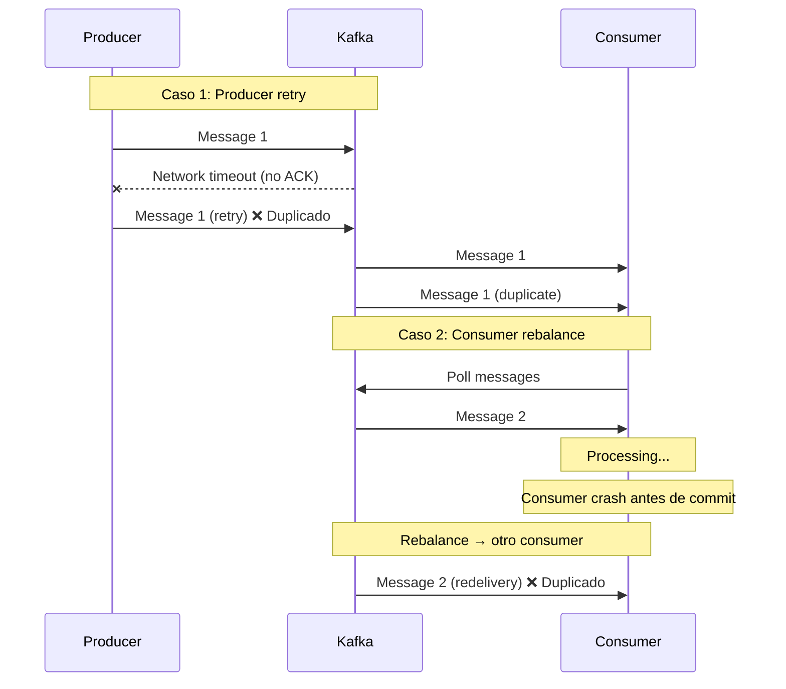

# Idempotencia en Eventos

## Contexto

Este estándar define cómo implementar idempotencia en event handlers Kafka para garantizar que mensajes duplicados (por retries o redelivery) no generen efectos secundarios duplicados. Complementa el lineamiento [Comunicación Asíncrona y Eventos](../../lineamientos/arquitectura/comunicacion-asincrona-y-eventos.md).

---

## Stack Tecnológico

| Componente         | Tecnología           | Versión | Uso                                   |
| ------------------ | -------------------- | ------- | ------------------------------------- |
| **Message Broker** | Apache Kafka (Kraft) | 3.6+    | Event streaming                       |
| **Producer**       | Confluent.Kafka      | 2.3+    | Cliente Kafka con idempotent producer |
| **Database**       | PostgreSQL           | 15+     | Almacenamiento de eventos procesados  |
| **ORM**            | Entity Framework     | .NET 8  | Acceso transaccional a DB             |

---

## Idempotency

### ¿Qué es Idempotency?

Propiedad de una operación que produce el mismo resultado sin importar cuántas veces se ejecute con los mismos parámetros.

**Propósito:** Permitir procesamiento seguro de eventos duplicados (común en sistemas distribuidos por retries, redelivery, etc.).

**Estrategias:**

1. **Idempotent operations**: Operación naturalmente idempotente (ej. `SET value = X`)
2. **Idempotency key**: Almacenar IDs de eventos procesados y verificar antes de procesar
3. **Deterministic side-effects**: Garantizar que side-effects son repetibles

**Beneficios:**
✅ Safe retries (puede reintentar sin duplicar efectos)
✅ Exactly-once semantics (a nivel de negocio)
✅ Simplifica error handling (retry sin miedo)

### Causas de Duplicados en Kafka



### Implementación: Idempotency Key

```csharp
// 1. Tabla de eventos procesados
public class ProcessedEvent
{
    public Guid EventId { get; set; }  // PK
    public string EventType { get; set; }
    public DateTimeOffset ProcessedAt { get; set; }
    public string ConsumerGroupId { get; set; }
}

// 2. DbContext
public class EventStoreDbContext : DbContext
{
    public DbSet<ProcessedEvent> ProcessedEvents { get; set; }

    protected override void OnModelCreating(ModelBuilder modelBuilder)
    {
        modelBuilder.Entity<ProcessedEvent>(entity =>
        {
            entity.HasKey(e => e.EventId);
            entity.HasIndex(e => e.ProcessedAt);  // Para cleanup de eventos antiguos
        });
    }
}

// 3. Handler idempotente
public class IdempotentOrderCreatedHandler : IOrderCreatedHandler
{
    private readonly EventStoreDbContext _eventStore;
    private readonly IPaymentService _paymentService;
    private readonly ILogger<IdempotentOrderCreatedHandler> _logger;

    public async Task HandleAsync(string eventJson, CancellationToken cancellationToken)
    {
        var @event = JsonSerializer.Deserialize<OrderCreatedEvent>(eventJson);

        // 1. Verificar si ya procesamos este evento
        var alreadyProcessed = await _eventStore.ProcessedEvents
            .AnyAsync(e => e.EventId == @event.EventId, cancellationToken);

        if (alreadyProcessed)
        {
            _logger.LogInformation(
                "Event {EventId} already processed, skipping",
                @event.EventId);
            return;  // ✅ Idempotencia: no procesar duplicado
        }

        // 2. Procesar evento + registrar como procesado (transacción)
        using var transaction = await _eventStore.Database.BeginTransactionAsync(cancellationToken);

        try
        {
            // Procesar side-effects
            await _paymentService.ProcessPaymentAsync(@event.OrderId, @event.TotalAmount);

            // Registrar como procesado
            _eventStore.ProcessedEvents.Add(new ProcessedEvent
            {
                EventId = @event.EventId,
                EventType = @event.EventType,
                ProcessedAt = DateTimeOffset.UtcNow,
                ConsumerGroupId = "payment-service-group"
            });

            await _eventStore.SaveChangesAsync(cancellationToken);
            await transaction.CommitAsync(cancellationToken);

            _logger.LogInformation("Event {EventId} processed successfully", @event.EventId);
        }
        catch (Exception ex)
        {
            await transaction.RollbackAsync(cancellationToken);
            _logger.LogError(ex, "Error processing event {EventId}", @event.EventId);
            throw;  // Consumer no hará commit → Kafka redelivery
        }
    }
}
```

**Ventajas:**

- ✅ Garantiza exactly-once processing a nivel de negocio
- ✅ Simple de implementar (tabla + check)
- ✅ Funciona con cualquier side-effect

**Desventajas:**

- ⚠️ Requiere persistencia (DB query adicional)
- ⚠️ Necesita cleanup periódico de eventos antiguos

### Cleanup de eventos procesados

```csharp
// Background service para limpiar eventos antiguos
public class ProcessedEventsCleanupService : BackgroundService
{
    private readonly IServiceProvider _serviceProvider;
    private readonly ILogger<ProcessedEventsCleanupService> _logger;

    protected override async Task ExecuteAsync(CancellationToken stoppingToken)
    {
        while (!stoppingToken.IsCancellationRequested)
        {
            try
            {
                using var scope = _serviceProvider.CreateScope();
                var dbContext = scope.ServiceProvider.GetRequiredService<EventStoreDbContext>();

                // Eliminar eventos procesados hace más de 30 días
                var cutoffDate = DateTimeOffset.UtcNow.AddDays(-30);

                var deletedCount = await dbContext.ProcessedEvents
                    .Where(e => e.ProcessedAt < cutoffDate)
                    .ExecuteDeleteAsync(stoppingToken);

                if (deletedCount > 0)
                {
                    _logger.LogInformation(
                        "Cleaned up {Count} processed events older than {CutoffDate}",
                        deletedCount,
                        cutoffDate);
                }
            }
            catch (Exception ex)
            {
                _logger.LogError(ex, "Error cleaning up processed events");
            }

            // Ejecutar diariamente
            await Task.Delay(TimeSpan.FromDays(1), stoppingToken);
        }
    }
}
```

### Alternativa: Idempotencia Natural

```csharp
// Operaciones naturalmente idempotentes no necesitan idempotency key

// ❌ NO IDEMPOTENTE: Incrementar balance
public async Task HandlePaymentCompleted(PaymentCompletedEvent @event)
{
    var account = await _repository.GetAccountAsync(@event.AccountId);
    account.Balance += @event.Amount;  // ❌ Si se procesa 2 veces → balance incorrecto
    await _repository.UpdateAsync(account);
}

// ✅ IDEMPOTENTE: Set balance (usando event sourcing)
public async Task HandlePaymentCompleted(PaymentCompletedEvent @event)
{
    // Calcular balance desde todos los eventos
    var events = await _eventStore.GetEventsAsync(@event.AccountId);
    var balance = events.Sum(e => e.Amount);

    var account = await _repository.GetAccountAsync(@event.AccountId);
    account.Balance = balance;  // ✅ Idempotente (SET, no INCREMENT)
    await _repository.UpdateAsync(account);
}

// ✅ IDEMPOTENTE: Upsert con unique constraint
public async Task HandleCustomerUpdated(CustomerUpdatedEvent @event)
{
    // Unique constraint en CustomerId garantiza no duplicados
    await _repository.UpsertAsync(new Customer
    {
        CustomerId = @event.CustomerId,  // PK
        Name = @event.Name,
        Email = @event.Email
    });  // ✅ Si se ejecuta 2 veces → mismo resultado
}
```

---

## Monitoreo

### Métrica de Duplicados

```csharp
var duplicateEvents = meter.CreateCounter<long>(
    "kafka.events.duplicates",
    description: "Total duplicate events detected (idempotency)");

// Logging de idempotencia
_logger.LogWarning(
    "Duplicate event detected: {EventId} {EventType}, skipping processing",
    @event.EventId,
    @event.EventType);
```

### Alerta

- ⚠️ **Duplicate events > 10% del total** → Posible problema de configuración (crashes frecuentes)

---

## Requisitos Técnicos

### MUST (Obligatorio)

- **MUST** implementar idempotency en todos los event handlers
- **MUST** usar `event_id` como idempotency key
- **MUST** verificar si evento ya fue procesado antes de ejecutar side-effects
- **MUST** registrar evento como procesado en misma transacción que side-effects

### SHOULD (Fuertemente recomendado)

- **SHOULD** implementar cleanup periódico de eventos procesados (retention 30 días)
- **SHOULD** usar idempotencia natural (SET/Upsert) cuando sea posible, antes de recurrir a idempotency key

### MAY (Opcional)

- **MAY** usar PostgreSQL como event store para persistencia de eventos (Event Sourcing)
- **MAY** implementar event replay capability para debugging

---

## Referencias

- [Stripe - Idempotent Requests](https://stripe.com/docs/api/idempotent_requests)
- [Microsoft - Idempotent message processing](https://docs.microsoft.com/en-us/azure/architecture/reference-architectures/saga/saga)
- [Kafka Documentation - Delivery Semantics](https://kafka.apache.org/documentation/#semantics)
- [Comunicación Asíncrona y Eventos](../../lineamientos/arquitectura/comunicacion-asincrona-y-eventos.md) — Lineamiento relacionado
- [Async Messaging](./async-messaging.md)
- [Message Delivery Guarantees](./message-delivery-guarantees.md)
