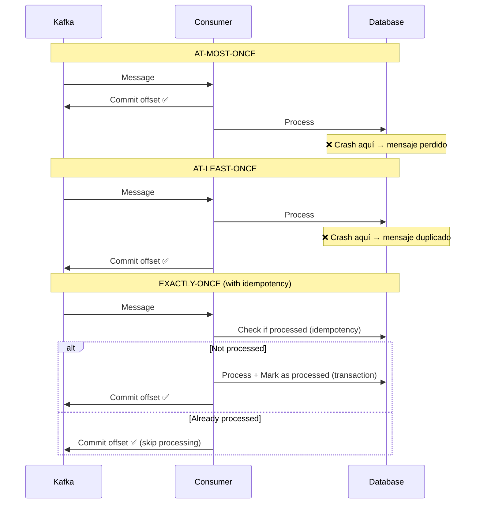

# Garantías de Entrega de Mensajes

## Contexto

Este estándar define los niveles de garantía de entrega para mensajes Kafka y cuándo aplicar cada uno. Cubre at-most-once, at-least-once y exactly-once semantics, con configuración recomendada para .NET. Complementa el lineamiento [Comunicación Asíncrona y Eventos](../../lineamientos/arquitectura/comunicacion-asincrona-y-eventos.md).

---

## Stack Tecnológico

| Componente            | Tecnología           | Versión | Uso                                     |
| --------------------- | -------------------- | ------- | --------------------------------------- |
| **Message Broker**    | Apache Kafka (Kraft) | 3.6+    | Event streaming con delivery guarantees |
| **Producer/Consumer** | Confluent.Kafka      | 2.3+    | Cliente Kafka para .NET                 |
| **Database**          | PostgreSQL           | 15+     | Persistencia transaccional              |
| **Observability**     | OpenTelemetry        | 1.7+    | Tracing de mensajes                     |

---

## Message Delivery Guarantees

### ¿Qué son Message Delivery Guarantees?

Diferentes niveles de garantía sobre cuántas veces un mensaje será entregado y procesado por un consumer:

1. **At-most-once**: Mensaje puede perderse, nunca duplicarse
2. **At-least-once**: Mensaje nunca se pierde, puede duplicarse
3. **Exactly-once**: Mensaje se procesa exactamente una vez (ideal pero complejo)

**Propósito:** Elegir el nivel apropiado de garantía según criticidad del mensaje y tolerancia a duplicados.

**Trade-offs:**

| Garantía      | Pérdida de mensajes | Duplicados | Complejidad | Performance |
| ------------- | ------------------- | ---------- | ----------- | ----------- |
| At-most-once  | ⚠️ Posible          | ✅ No      | 🟢 Baja     | 🟢 Alta     |
| At-least-once | ✅ No               | ⚠️ Posible | 🟡 Media    | 🟡 Media    |
| Exactly-once  | ✅ No               | ✅ No      | 🔴 Alta     | 🔴 Baja     |

**Recomendación general:** **At-least-once + Idempotency** (mejor balance entre confiabilidad, simplicidad y performance).

### At-Most-Once Delivery

**Funcionamiento:** Consumer commitea offset **antes** de procesar mensaje.

```csharp
// ❌ AT-MOST-ONCE: Commit antes de procesar
public class AtMostOnceConsumer : BackgroundService
{
    protected override async Task ExecuteAsync(CancellationToken stoppingToken)
    {
        using var consumer = new ConsumerBuilder<string, string>(_config).Build();
        consumer.Subscribe("notifications");

        while (!stoppingToken.IsCancellationRequested)
        {
            var result = consumer.Consume(stoppingToken);

            // 1. COMMIT OFFSET PRIMERO
            consumer.Commit(result);

            // 2. Procesar mensaje
            try
            {
                await ProcessMessageAsync(result.Message.Value);
            }
            catch (Exception ex)
            {
                // Si falla → mensaje ya commiteado → SE PIERDE ❌
                _logger.LogError(ex, "Message processing failed, message lost");
            }
        }
    }
}
```

**Cuándo usar:**

- ✅ Mensajes no críticos (telemetría, métricas)
- ✅ Máxima throughput requerida
- ❌ NO usar para transacciones financieras, órdenes, etc.

### At-Least-Once Delivery

**Funcionamiento:** Consumer commitea offset **después** de procesar mensaje exitosamente.

```csharp
// ✅ AT-LEAST-ONCE: Commit después de procesar
public class AtLeastOnceConsumer : BackgroundService
{
    protected override async Task ExecuteAsync(CancellationToken stoppingToken)
    {
        var consumerConfig = new ConsumerConfig
        {
            BootstrapServers = _configuration["Kafka:BootstrapServers"],
            GroupId = "order-processor-group",
            EnableAutoCommit = false,  // IMPORTANTE: commit manual
            AutoOffsetReset = AutoOffsetReset.Earliest
        };

        using var consumer = new ConsumerBuilder<string, string>(consumerConfig).Build();
        consumer.Subscribe("order.created");

        while (!stoppingToken.IsCancellationRequested)
        {
            var result = consumer.Consume(stoppingToken);

            try
            {
                // 1. Procesar mensaje PRIMERO
                await ProcessMessageAsync(result.Message.Value);

                // 2. COMMIT OFFSET solo si éxito
                consumer.Commit(result);

                _logger.LogInformation("Message processed and committed: {Offset}", result.Offset.Value);
            }
            catch (Exception ex)
            {
                // Si falla → NO commit → Kafka redelivery → DUPLICADO posible
                _logger.LogError(ex, "Message processing failed, will retry");
            }
        }
    }
}
```

**Solución para duplicados:** Implementar **idempotencia** en handler (ver [Idempotencia en Eventos](./idempotency.md)).

**Cuándo usar:**

- ✅ Mayoría de casos (default recomendado)
- ✅ Combinado con idempotent handlers
- ✅ Mensajes críticos que no pueden perderse

### Exactly-Once Semantics (EOS)

**Funcionamiento:** Combinación de idempotent producer + transactional producer/consumer + idempotent handler.

```csharp
// ✅ EXACTLY-ONCE: Transactional processing
public class ExactlyOnceConsumer : BackgroundService
{
    protected override async Task ExecuteAsync(CancellationToken stoppingToken)
    {
        var consumerConfig = new ConsumerConfig
        {
            BootstrapServers = _configuration["Kafka:BootstrapServers"],
            GroupId = "payment-processor-group",
            EnableAutoCommit = false,
            IsolationLevel = IsolationLevel.ReadCommitted  // Solo leer transacciones commiteadas
        };

        var producerConfig = new ProducerConfig
        {
            BootstrapServers = _configuration["Kafka:BootstrapServers"],
            TransactionalId = "payment-processor-tx",
            EnableIdempotence = true
        };

        using var consumer = new ConsumerBuilder<string, string>(consumerConfig).Build();
        using var producer = new ProducerBuilder<string, string>(producerConfig).Build();

        producer.InitTransactions(TimeSpan.FromSeconds(30));
        consumer.Subscribe("order.created");

        while (!stoppingToken.IsCancellationRequested)
        {
            var result = consumer.Consume(stoppingToken);

            try
            {
                producer.BeginTransaction();

                var @event = JsonSerializer.Deserialize<OrderCreatedEvent>(result.Message.Value);
                var payment = await ProcessPaymentAsync(@event);

                // Publicar resultado (dentro de transacción)
                await producer.ProduceAsync("payment.completed", new Message<string, string>
                {
                    Key = @event.OrderId.ToString(),
                    Value = JsonSerializer.Serialize(new PaymentCompletedEvent
                    {
                        OrderId = @event.OrderId,
                        PaymentId = payment.PaymentId,
                        Amount = payment.Amount
                    })
                });

                // Commit offset del consumer (dentro de transacción)
                producer.SendOffsetsToTransaction(
                    new[] { new TopicPartitionOffset(result.TopicPartition, result.Offset + 1) },
                    consumer.ConsumerGroupMetadata,
                    TimeSpan.FromSeconds(30));

                // Commit atómico: proceso + produce + commit offset
                producer.CommitTransaction();
            }
            catch (Exception ex)
            {
                producer.AbortTransaction();
                _logger.LogError(ex, "Transaction aborted, message will be reprocessed");
            }
        }
    }
}
```

**Cuándo usar:**

- ✅ Casos críticos donde duplicados son inaceptables (transferencias bancarias)
- ✅ Flujos Kafka-to-Kafka sin side-effects externos
- ❌ NO necesario si ya tienes idempotencia a nivel de aplicación

### Comparación Visual



### Configuración Recomendada

```csharp
// Producer: At-least-once con idempotence
var producerConfig = new ProducerConfig
{
    BootstrapServers = "broker:9092",
    Acks = Acks.All,              // Esperar ACK de todos los in-sync replicas
    EnableIdempotence = true,     // Prevenir duplicados server-side
    MaxInFlight = 5,
    MessageSendMaxRetries = int.MaxValue,
    RequestTimeoutMs = 30000
};

// Consumer: At-least-once con commit manual
var consumerConfig = new ConsumerConfig
{
    BootstrapServers = "broker:9092",
    GroupId = "my-consumer-group",
    EnableAutoCommit = false,     // IMPORTANTE: commit manual
    AutoOffsetReset = AutoOffsetReset.Earliest,
    EnableAutoOffsetStore = false,
    SessionTimeoutMs = 30000,
    HeartbeatIntervalMs = 3000
};
```

---

## Monitoreo

### Métricas de Entrega

```csharp
var messagesProcessed = meter.CreateCounter<long>(
    "messages.processed",
    description: "Total messages processed successfully");

var messagesDuplicate = meter.CreateCounter<long>(
    "messages.duplicate",
    description: "Total duplicate messages detected (idempotency)");
```

### Alertas de Entrega

- 🚨 **Consumer lag > 10000 msgs** → Consumer no está procesando
- ⚠️ **Duplicate rate > 20%** → Posible problema de configuración (crashes frecuentes)

---

## Requisitos Técnicos

### MUST (Obligatorio)

- **MUST** usar **at-least-once delivery** como default (commit después de procesar)
- **MUST** configurar `EnableAutoCommit = false` en consumers
- **MUST** configurar `Acks = Acks.All` en producers para durabilidad
- **MUST** configurar `EnableIdempotence = true` en producers
- **MUST** implementar idempotencia en handlers para soportar duplicados (ver [Idempotencia en Eventos](./idempotency.md))

### SHOULD (Fuertemente recomendado)

- **SHOULD** incluir correlation_id en eventos para rastrear mensajes
- **SHOULD** instrumentar consumers con métricas de lag y duplicate rate
- **SHOULD** usar Grafana Stack para monitorear consumer lag

### MAY (Opcional)

- **MAY** usar exactly-once semantics (transacciones Kafka) para casos críticos donde duplicados son inaceptables

### MUST NOT (Prohibido)

- **MUST NOT** usar at-most-once delivery para mensajes críticos (órdenes, pagos, etc.)
- **MUST NOT** usar auto-commit en consumers

---

## Referencias

- [Kafka Documentation - Delivery Semantics](https://kafka.apache.org/documentation/#semantics)
- [Confluent - Exactly-Once Semantics](https://www.confluent.io/blog/exactly-once-semantics-are-possible-heres-how-apache-kafka-does-it/)
- [Martin Kleppmann - Designing Data-Intensive Applications (Chapter 11)](https://dataintensive.net/)
- [Comunicación Asíncrona y Eventos](../../lineamientos/arquitectura/comunicacion-asincrona-y-eventos.md) — Lineamiento relacionado
- [Idempotencia en Eventos](./idempotency.md)
- [Dead Letter Queue](./dead-letter-queue.md)
