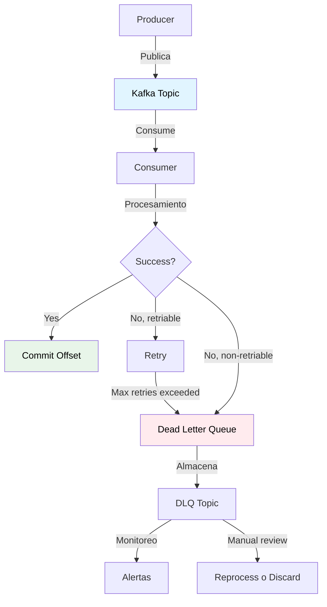
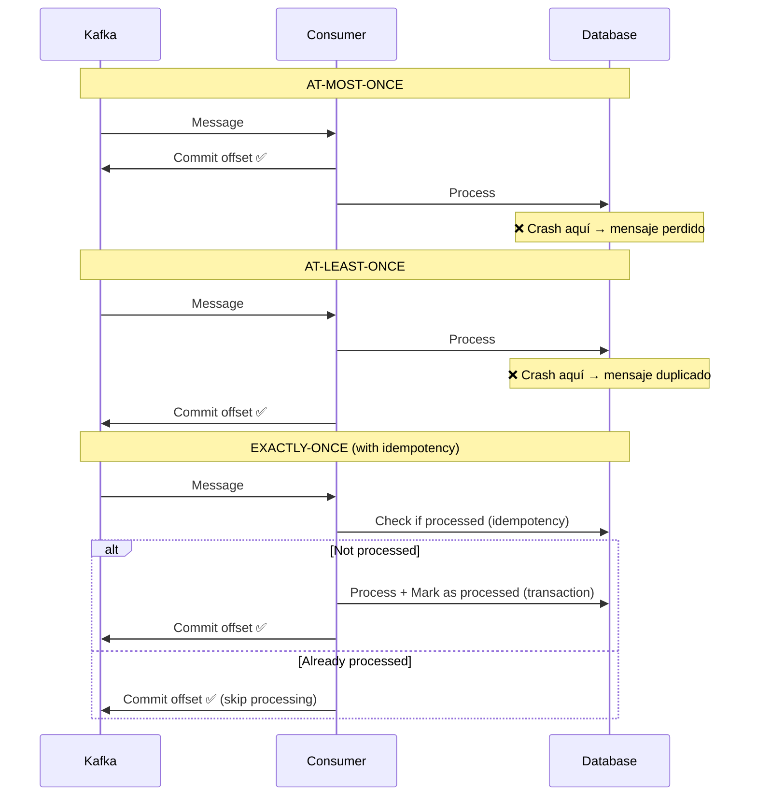

# Message Reliability

## Contexto

Este estándar define estrategias para garantizar confiabilidad en procesamiento de mensajes Kafka, incluyendo diferentes niveles de garantías de entrega (at-most-once, at-least-once, exactly-once) y manejo de mensajes fallidos mediante Dead Letter Queue (DLQ). Complementa el lineamiento [Comunicación Asíncrona y Eventos](../../lineamientos/arquitectura/08-comunicacion-asincrona-y-eventos.md) asegurando que mensajes críticos no se pierdan y mensajes problemáticos se gestionen apropiadamente.

**Conceptos incluidos:**

- **Message Delivery Guarantees** → At-most-once, at-least-once, exactly-once semantics
- **Dead Letter Queue** → Manejo de mensajes que fallan consistentemente

---

## Stack Tecnológico

| Componente            | Tecnología           | Versión | Uso                                     |
| --------------------- | -------------------- | ------- | --------------------------------------- |
| **Message Broker**    | Apache Kafka (Kraft) | 3.6+    | Event streaming con delivery guarantees |
| **Producer/Consumer** | Confluent.Kafka      | 2.3+    | Cliente Kafka para .NET                 |
| **Database**          | PostgreSQL           | 15+     | Persistencia transaccional              |
| **DLQ Storage**       | Kafka Topic          | -       | Dead letter queue como topic            |
| **Monitoring**        | Grafana Stack        | -       | Alertas en DLQ                          |
| **Observability**     | OpenTelemetry        | 1.7+    | Tracing de mensajes fallidos            |

---

## Conceptos Fundamentales

Este estándar cubre 2 aspectos críticos de confiabilidad en mensajería:

### Índice de Conceptos

1. **Message Delivery Guarantees**: Diferentes niveles de garantía de entrega
2. **Dead Letter Queue**: Gestión de mensajes que fallan consistentemente

### Relación entre Conceptos



**Principios clave:**

1. **Durabilidad**: Mensajes no se pierden (replication, persistence)
2. **Retry con límite**: Reintentos automáticos pero con límite
3. **Isolate poison messages**: Mensajes problemáticos no bloquean cola
4. **Observabilidad**: Visibilidad de mensajes fallidos para acción correctiva

---

## 1. Message Delivery Guarantees

### ¿Qué son Message Delivery Guarantees?

Diferentes niveles de garantía sobre cuántas veces un mensaje será entregado y procesado por un consumer:

1. **At-most-once**: Mensaje puede perderse, nunca duplicarse
2. **At-least-once**: Mensaje nunca se pierde, puede duplicarse
3. **Exactly-once**: Mensaje se procesa exactamente una vez (ideal pero complejo)

**Propósito:** Elegir el nivel apropiado de garantía según criticidad del mensaje y tolerancia a duplicados.

**Trade-offs:**

| Garantía      | Pérdida de mensajes | Duplicados | Complejidad | Performance |
| ------------- | ------------------- | ---------- | ----------- | ----------- |
| At-most-once  | ⚠️ Posible          | ✅ No      | 🟢 Baja     | 🟢 Alta     |
| At-least-once | ✅ No               | ⚠️ Posible | 🟡 Media    | 🟡 Media    |
| Exactly-once  | ✅ No               | ✅ No      | 🔴 Alta     | 🔴 Baja     |

**Recomendación general:** **At-least-once + Idempotency** (mejor balance entre confiabilidad, simplicidad y performance).

### At-Most-Once Delivery

**Funcionamiento:** Consumer commitea offset **antes** de procesar mensaje.

```csharp
// ❌ AT-MOST-ONCE: Commit antes de procesar
public class AtMostOnceConsumer : BackgroundService
{
    protected override async Task ExecuteAsync(CancellationToken stoppingToken)
    {
        using var consumer = new ConsumerBuilder<string, string>(_config).Build();
        consumer.Subscribe("notifications");

        while (!stoppingToken.IsCancellationRequested)
        {
            var result = consumer.Consume(stoppingToken);

            // 1. COMMIT OFFSET PRIMERO
            consumer.Commit(result);

            // 2. Procesar mensaje
            try
            {
                await ProcessMessageAsync(result.Message.Value);
            }
            catch (Exception ex)
            {
                // Si falla → mensaje ya commiteado → SE PIERDE ❌
                _logger.LogError(ex, "Message processing failed, message lost");
            }
        }
    }
}
```

**Problema:** Si procesamiento falla después del commit → **mensaje se pierde**.

**Cuándo usar:**

- ✅ Mensajes no críticos (telemetría, métricas)
- ✅ Máxima throughput requerida
- ❌ NO usar para transacciones financieras, órdenes, etc.

### At-Least-Once Delivery

**Funcionamiento:** Consumer commitea offset **después** de procesar mensaje exitosamente.

```csharp
// ✅ AT-LEAST-ONCE: Commit después de procesar
public class AtLeastOnceConsumer : BackgroundService
{
    protected override async Task ExecuteAsync(CancellationToken stoppingToken)
    {
        var consumerConfig = new ConsumerConfig
        {
            BootstrapServers = _configuration["Kafka:BootstrapServers"],
            GroupId = "order-processor-group",
            EnableAutoCommit = false,  // IMPORTANTE: commit manual
            AutoOffsetReset = AutoOffsetReset.Earliest
        };

        using var consumer = new ConsumerBuilder<string, string>(consumerConfig).Build();
        consumer.Subscribe("order.created");

        while (!stoppingToken.IsCancellationRequested)
        {
            var result = consumer.Consume(stoppingToken);

            try
            {
                // 1. Procesar mensaje PRIMERO
                await ProcessMessageAsync(result.Message.Value);

                // 2. COMMIT OFFSET solo si éxito
                consumer.Commit(result);

                _logger.LogInformation("Message processed and committed: {Offset}", result.Offset.Value);
            }
            catch (Exception ex)
            {
                // Si falla → NO commit → Kafka redelivery → DUPLICADO posible
                _logger.LogError(ex, "Message processing failed, will retry");
                // Mensaje se reprocesará en próximo poll
            }
        }
    }
}
```

**Ventaja:** Mensajes nunca se pierden (si falla, Kafka redelivers).

**Problema:** Puede haber duplicados (si crash entre procesamiento y commit).

**Solución:** Implementar **idempotencia** en handler (ver [Event-Driven Architecture](./event-driven-architecture.md#4-idempotency)).

**Cuándo usar:**

- ✅ Mayoría de casos (default recomendado)
- ✅ Combinado con idempotent handlers
- ✅ Mensajes críticos que no pueden perderse

### Exactly-Once Semantics (EOS)

**Funcionamiento:** Combinación de:

1. **Idempotent producer** (Kafka deduplica en server-side)
2. **Transactional producer/consumer** (atomic read-process-write)
3. **Idempotent handler** (application-level deduplication)

```csharp
// ✅ EXACTLY-ONCE: Transactional processing
public class ExactlyOnceConsumer : BackgroundService
{
    protected override async Task ExecuteAsync(CancellationToken stoppingToken)
    {
        var consumerConfig = new ConsumerConfig
        {
            BootstrapServers = _configuration["Kafka:BootstrapServers"],
            GroupId = "payment-processor-group",
            EnableAutoCommit = false,
            IsolationLevel = IsolationLevel.ReadCommitted  // IMPORTANTE: solo leer transacciones commiteadas
        };

        var producerConfig = new ProducerConfig
        {
            BootstrapServers = _configuration["Kafka:BootstrapServers"],
            TransactionalId = "payment-processor-tx",  // IMPORTANTE: transaccional
            EnableIdempotence = true
        };

        using var consumer = new ConsumerBuilder<string, string>(consumerConfig).Build();
        using var producer = new ProducerBuilder<string, string>(producerConfig).Build();

        producer.InitTransactions(TimeSpan.FromSeconds(30));
        consumer.Subscribe("order.created");

        while (!stoppingToken.IsCancellationRequested)
        {
            var result = consumer.Consume(stoppingToken);

            try
            {
                // Iniciar transacción Kafka
                producer.BeginTransaction();

                // 1. Procesar mensaje
                var @event = JsonSerializer.Deserialize<OrderCreatedEvent>(result.Message.Value);
                var payment = await ProcessPaymentAsync(@event);

                // 2. Publicar resultado a otro topic (dentro de transacción)
                await producer.ProduceAsync("payment.completed", new Message<string, string>
                {
                    Key = @event.OrderId.ToString(),
                    Value = JsonSerializer.Serialize(new PaymentCompletedEvent
                    {
                        OrderId = @event.OrderId,
                        PaymentId = payment.PaymentId,
                        Amount = payment.Amount
                    })
                });

                // 3. Commit offset del consumer (dentro de transacción)
                producer.SendOffsetsToTransaction(
                    new[] { new TopicPartitionOffset(result.TopicPartition, result.Offset + 1) },
                    consumer.ConsumerGroupMetadata,
                    TimeSpan.FromSeconds(30));

                // 4. Commit transacción (atomic: proceso + produce + commit offset)
                producer.CommitTransaction();

                _logger.LogInformation("Message processed exactly-once: {Offset}", result.Offset.Value);
            }
            catch (Exception ex)
            {
                // Rollback transacción completa
                producer.AbortTransaction();
                _logger.LogError(ex, "Transaction aborted, message will be reprocessed");
            }
        }
    }
}
```

**Ventajas:**

- ✅ Garantía real de exactly-once (no duplicados, no pérdidas)
- ✅ Atomic read-process-write (todo o nada)

**Desventajas:**

- ⚠️ Mayor latencia (transacciones Kafka son costosas)
- ⚠️ Mayor complejidad (requiere configuración cuidadosa)
- ⚠️ Solo funciona para flujos Kafka → procesar → Kafka (no para side-effects externos como DB)

**Cuándo usar:**

- ✅ Casos críticos donde duplicados son inaceptables (transferencias bancarias)
- ✅ Flujos Kafka-to-Kafka sin side-effects externos
- ❌ NO necesario si ya tienes idempotencia a nivel de aplicación

### Comparación Visual



### Configuración Recomendada

```csharp
// Producer: At-least-once con idempotence
var producerConfig = new ProducerConfig
{
    BootstrapServers = "broker:9092",
    Acks = Acks.All,  // Esperar ACK de todos los in-sync replicas
    EnableIdempotence = true,  // Prevenir duplicados server-side
    MaxInFlight = 5,  // Max requests in-flight (con idempotence)
    MessageSendMaxRetries = int.MaxValue,  // Retry infinito (con timeout)
    RequestTimeoutMs = 30000  // Timeout 30s
};

// Consumer: At-least-once con commit manual
var consumerConfig = new ConsumerConfig
{
    BootstrapServers = "broker:9092",
    GroupId = "my-consumer-group",
    EnableAutoCommit = false,  // IMPORTANTE: commit manual
    AutoOffsetReset = AutoOffsetReset.Earliest,
    EnableAutoOffsetStore = false,  // Control fino de offsets
    SessionTimeoutMs = 30000,
    HeartbeatIntervalMs = 3000
};
```

---

## 2. Dead Letter Queue

### ¿Qué es Dead Letter Queue (DLQ)?

Topic Kafka separado donde se envían mensajes que fallan consistentemente después de múltiples reintentos, evitando que bloqueen el procesamiento de mensajes subsiguientes.

**Propósito:** Aislar mensajes problemáticos (poison messages) para análisis y resolución manual, sin detener el flujo de mensajes sanos.

**Componentes clave:**

- **Retry policy**: Cuántos reintentos antes de enviar a DLQ
- **DLQ topic**: Topic separado (`{original-topic}.dlq`)
- **Error metadata**: Información del error para debugging
- **Reprocessing mechanism**: Forma de reprocesar mensajes desde DLQ

**Beneficios:**
✅ Previene poison messages de bloquear cola
✅ Preserva mensajes fallidos para análisis
✅ Permite procesamiento continuo de mensajes sanos
✅ Facilita debugging (todos los errores en un lugar)

### Implementación con Retry Policy

```csharp
using Polly;
using Polly.Retry;

public class ResilientConsumer : BackgroundService
{
    private readonly IConsumer<string, string> _consumer;
    private readonly IProducer<string, string> _dlqProducer;
    private readonly ILogger<ResilientConsumer> _logger;

    // Retry policy: 3 reintentos con backoff exponencial
    private readonly AsyncRetryPolicy _retryPolicy;

    public ResilientConsumer(
        IConfiguration configuration,
        ILogger<ResilientConsumer> logger)
    {
        var consumerConfig = new ConsumerConfig
        {
            BootstrapServers = configuration["Kafka:BootstrapServers"],
            GroupId = "order-processor-group",
            EnableAutoCommit = false
        };

        var producerConfig = new ProducerConfig
        {
            BootstrapServers = configuration["Kafka:BootstrapServers"]
        };

        _consumer = new ConsumerBuilder<string, string>(consumerConfig).Build();
        _dlqProducer = new ProducerBuilder<string, string>(producerConfig).Build();
        _logger = logger;

        // Configurar retry: 3 intentos con backoff exponencial (1s, 2s, 4s)
        _retryPolicy = Policy
            .Handle<Exception>(ex => IsRetriableException(ex))
            .WaitAndRetryAsync(
                retryCount: 3,
                sleepDurationProvider: retryAttempt => TimeSpan.FromSeconds(Math.Pow(2, retryAttempt)),
                onRetry: (exception, timeSpan, retryCount, context) =>
                {
                    _logger.LogWarning(
                        exception,
                        "Retry {RetryCount}/3 после {Delay}ms: {Message}",
                        retryCount,
                        timeSpan.TotalMilliseconds,
                        exception.Message);
                });
    }

    protected override async Task ExecuteAsync(CancellationToken stoppingToken)
    {
        _consumer.Subscribe("order.created");

        while (!stoppingToken.IsCancellationRequested)
        {
            var result = _consumer.Consume(stoppingToken);

            try
            {
                // Procesar con retry automático
                await _retryPolicy.ExecuteAsync(async () =>
                {
                    await ProcessMessageAsync(result.Message.Value);
                });

                // Si éxito (después de retries posibles) → commit
                _consumer.Commit(result);
                _logger.LogInformation("Message processed successfully: {Offset}", result.Offset.Value);
            }
            catch (Exception ex)
            {
                // Todos los retries fallaron → enviar a DLQ
                await SendToDLQAsync(result, ex);

                // Commit offset para avanzar (mensaje ya en DLQ)
                _consumer.Commit(result);

                _logger.LogError(
                    ex,
                    "Message sent to DLQ after max retries: {Offset}",
                    result.Offset.Value);
            }
        }
    }

    private async Task SendToDLQAsync(ConsumeResult<string, string> result, Exception ex)
    {
        var dlqTopic = $"{result.Topic}.dlq";  // order.created.dlq

        var dlqMessage = new Message<string, string>
        {
            Key = result.Message.Key,
            Value = result.Message.Value,
            Headers = new Headers(result.Message.Headers)  // Copiar headers originales
        };

        // Agregar metadata de error
        dlqMessage.Headers.Add("dlq.original-topic", Encoding.UTF8.GetBytes(result.Topic));
        dlqMessage.Headers.Add("dlq.original-partition", BitConverter.GetBytes(result.Partition.Value));
        dlqMessage.Headers.Add("dlq.original-offset", BitConverter.GetBytes(result.Offset.Value));
        dlqMessage.Headers.Add("dlq.error-message", Encoding.UTF8.GetBytes(ex.Message));
        dlqMessage.Headers.Add("dlq.error-type", Encoding.UTF8.GetBytes(ex.GetType().Name));
        dlqMessage.Headers.Add("dlq.timestamp", Encoding.UTF8.GetBytes(DateTimeOffset.UtcNow.ToString("O")));
        dlqMessage.Headers.Add("dlq.consumer-group", Encoding.UTF8.GetBytes("order-processor-group"));

        await _dlqProducer.ProduceAsync(dlqTopic, dlqMessage);

        _logger.LogWarning(
            "Message sent to DLQ topic {DlqTopic}: key={Key}, error={Error}",
            dlqTopic,
            result.Message.Key,
            ex.Message);
    }

    private bool IsRetriableException(Exception ex)
    {
        // Determinar si el error es retriable
        return ex switch
        {
            // Retriable (errores transitorios)
            HttpRequestException => true,     // Servicio externo down
            TimeoutException => true,         // Timeout de red
            NpgsqlException => true,          // DB temporal issue

            // Non-retriable (errores de negocio o datos)
            ValidationException => false,     // Datos inválidos
            JsonException => false,           // Malformed JSON
            ArgumentException => false,       // Argumento inválido

            _ => true  // Por default, reintentar (conservador)
        };
    }
}
```

### DLQ Message Structure

```json
// Mensaje en DLQ topic
{
  "key": "customer-123",
  "value": "{\"event_id\":\"...\",\"order_id\":\"...\"}", // Payload original
  "headers": {
    "event-type": "order.created",
    "event-version": "2.0",

    // Metadata DLQ
    "dlq.original-topic": "order.created",
    "dlq.original-partition": "2",
    "dlq.original-offset": "12345",
    "dlq.error-message": "Payment gateway returned 500 Internal Server Error",
    "dlq.error-type": "HttpRequestException",
    "dlq.timestamp": "2026-02-19T15:30:00Z",
    "dlq.consumer-group": "order-processor-group"
  }
}
```

### DLQ Monitoring Consumer

```csharp
// Consumer separado para monitorear DLQ y generar alertas
public class DLQMonitoringConsumer : BackgroundService
{
    private readonly IConsumer<string, string> _consumer;
    private readonly ILogger<DLQMonitoringConsumer> _logger;
    private readonly IAlertService _alertService;

    protected override async Task ExecuteAsync(CancellationToken stoppingToken)
    {
        _consumer.Subscribe("*.dlq");  // Todos los topics DLQ

        while (!stoppingToken.IsCancellationRequested)
        {
            var result = _consumer.Consume(stoppingToken);

            // Extraer metadata de error
            var originalTopic = Encoding.UTF8.GetString(
                result.Message.Headers.First(h => h.Key == "dlq.original-topic").GetValueBytes());
            var errorMessage = Encoding.UTF8.GetString(
                result.Message.Headers.First(h => h.Key == "dlq.error-message").GetValueBytes());
            var errorType = Encoding.UTF8.GetString(
                result.Message.Headers.First(h => h.Key == "dlq.error-type").GetValueBytes());

            _logger.LogError(
                "DLQ message detected: topic={Topic}, original-topic={OriginalTopic}, error={ErrorType}: {ErrorMessage}",
                result.Topic,
                originalTopic,
                errorType,
                errorMessage);

            // Enviar alerta si muchos mensajes en DLQ
            await _alertService.SendAlertAsync(
                $"DLQ Alert: {originalTopic}",
                $"Message failed processing: {errorMessage}");

            _consumer.Commit(result);
        }
    }
}
```

### DLQ Reprocessing

```csharp
// Herramienta para reprocesar mensajes desde DLQ
public class DLQReprocessingService
{
    private readonly IConsumer<string, string> _dlqConsumer;
    private readonly IProducer<string, string> _producer;
    private readonly ILogger<DLQReprocessingService> _logger;

    public async Task ReprocessAsync(string dlqTopic, CancellationToken cancellationToken)
    {
        _dlqConsumer.Subscribe(dlqTopic);

        var reprocessedCount = 0;
        var failedCount = 0;

        while (!cancellationToken.IsCancellationRequested)
        {
            var result = _dlqConsumer.Consume(TimeSpan.FromSeconds(5));
            if (result == null)
                break;  // No más mensajes

            try
            {
                // Extraer topic original desde headers
                var originalTopic = Encoding.UTF8.GetString(
                    result.Message.Headers.First(h => h.Key == "dlq.original-topic").GetValueBytes());

                // Republicar a topic original (sin headers DLQ)
                var message = new Message<string, string>
                {
                    Key = result.Message.Key,
                    Value = result.Message.Value,
                    Headers = new Headers(
                        result.Message.Headers.Where(h => !h.Key.StartsWith("dlq.")))
                };

                await _producer.ProduceAsync(originalTopic, message);

                _dlqConsumer.Commit(result);
                reprocessedCount++;

                _logger.LogInformation(
                    "Message reprocessed from DLQ: {Key} → {OriginalTopic}",
                    result.Message.Key,
                    originalTopic);
            }
            catch (Exception ex)
            {
                failedCount++;
                _logger.LogError(
                    ex,
                    "Failed to reprocess message from DLQ: {Key}",
                    result.Message.Key);
            }
        }

        _logger.LogInformation(
            "DLQ reprocessing completed: {Reprocessed} reprocessed, {Failed} failed",
            reprocessedCount,
            failedCount);
    }
}
```

### DLQ Best Practices

**Naming convention:**

```
{original-topic}.dlq

Ejemplos:
order.created → order.created.dlq
payment.completed → payment.completed.dlq
```

**Retention:**

- DLQ topics should have **longer retention** than main topics (ej. 30 días vs 7 días)
- Permite tiempo para análisis y resolución antes de que mensajes se borren

**Alerting:**

- ⚠️ Alerta si DLQ recibe cualquier mensaje (idealmente DLQ debería estar vacío)
- 🚨 Alerta crítica si DLQ tiene > 100 mensajes (problema sistémico)

**Reprocessing strategy:**

1. **Investigar causa raíz** (logs, error messages en headers)
2. **Fixear el problema** (deploy fix si es bug)
3. **Reprocesar mensajes** desde DLQ al topic original
4. **Verificar éxito** (monitoring)

---

## Implementación Integrada

### Ejemplo Completo: Resilient Order Processor

```csharp
// Program.cs: Configuración completa
var builder = WebApplication.CreateBuilder(args);

// Kafka Producer (para DLQ)
var producerConfig = new ProducerConfig
{
    BootstrapServers = builder.Configuration["Kafka:BootstrapServers"],
    Acks = Acks.All,
    EnableIdempotence = true
};
builder.Services.AddSingleton<IProducer<string, string>>(
    new ProducerBuilder<string, string>(producerConfig).Build());

// Registrar consumers
builder.Services.AddHostedService<ResilientOrderCreatedConsumer>();
builder.Services.AddHostedService<DLQMonitoringConsumer>();

// Order processor con idempotencia + DLQ
public class ResilientOrderCreatedConsumer : BackgroundService
{
    private readonly IServiceProvider _serviceProvider;
    private readonly IConsumer<string, string> _consumer;
    private readonly IProducer<string, string> _dlqProducer;
    private readonly ILogger<ResilientOrderCreatedConsumer> _logger;

    protected override async Task ExecuteAsync(CancellationToken stoppingToken)
    {
        _consumer.Subscribe("order.created");

        while (!stoppingToken.IsCancellationRequested)
        {
            var result = _consumer.Consume(stoppingToken);
            var retryCount = 0;
            const int maxRetries = 3;

            while (retryCount < maxRetries)
            {
                try
                {
                    using var scope = _serviceProvider.CreateScope();
                    var handler = scope.ServiceProvider.GetRequiredService<IOrderCreatedHandler>();

                    // Procesar con idempotencia
                    await handler.HandleAsync(result.Message.Value, stoppingToken);

                    // Éxito → commit
                    _consumer.Commit(result);
                    _logger.LogInformation("Message processed: {Offset}", result.Offset.Value);
                    break;  // Salir del retry loop
                }
                catch (Exception ex) when (IsRetriable(ex) && retryCount < maxRetries - 1)
                {
                    // Error retriable → retry con backoff
                    retryCount++;
                    var delay = TimeSpan.FromSeconds(Math.Pow(2, retryCount));

                    _logger.LogWarning(
                        ex,
                        "Retry {RetryCount}/{MaxRetries} after {Delay}ms",
                        retryCount,
                        maxRetries,
                        delay.TotalMilliseconds);

                    await Task.Delay(delay, stoppingToken);
                }
                catch (Exception ex)
                {
                    // Max retries o non-retriable → DLQ
                    await SendToDLQAsync(result, ex, retryCount);
                    _consumer.Commit(result);  // Avanzar offset

                    _logger.LogError(
                        ex,
                        "Message sent to DLQ after {Retries} retries: {Offset}",
                        retryCount,
                        result.Offset.Value);
                    break;
                }
            }
        }
    }

    private bool IsRetriable(Exception ex) =>
        ex is HttpRequestException or TimeoutException or NpgsqlException;

    private async Task SendToDLQAsync(
        ConsumeResult<string, string> result,
        Exception ex,
        int attemptedRetries)
    {
        var dlqMessage = new Message<string, string>
        {
            Key = result.Message.Key,
            Value = result.Message.Value,
            Headers = new Headers(result.Message.Headers)
        };

        dlqMessage.Headers.Add("dlq.original-topic", Encoding.UTF8.GetBytes(result.Topic));
        dlqMessage.Headers.Add("dlq.original-partition", BitConverter.GetBytes(result.Partition.Value));
        dlqMessage.Headers.Add("dlq.original-offset", BitConverter.GetBytes(result.Offset.Value));
        dlqMessage.Headers.Add("dlq.error-message", Encoding.UTF8.GetBytes(ex.Message));
        dlqMessage.Headers.Add("dlq.error-type", Encoding.UTF8.GetBytes(ex.GetType().Name));
        dlqMessage.Headers.Add("dlq.error-stacktrace", Encoding.UTF8.GetBytes(ex.StackTrace ?? ""));
        dlqMessage.Headers.Add("dlq.timestamp", Encoding.UTF8.GetBytes(DateTimeOffset.UtcNow.ToString("O")));
        dlqMessage.Headers.Add("dlq.consumer-group", Encoding.UTF8.GetBytes("order-processor-group"));
        dlqMessage.Headers.Add("dlq.retry-count", BitConverter.GetBytes(attemptedRetries));

        await _dlqProducer.ProduceAsync($"{result.Topic}.dlq", dlqMessage);
    }
}
```

### Terraform: Provisioning de DLQ Topics

```hcl
# terraform/modules/kafka/dlq-topics.tf

locals {
  # Topics principales
  main_topics = [
    "order.created",
    "payment.completed",
    "inventory.reserved"
  ]

  # Generar DLQ topics automáticamente
  dlq_topics = [for topic in local.main_topics : "${topic}.dlq"]
}

resource "aws_msk_cluster" "kafka" {
  # ... configuración del cluster
}

# Crear DLQ topics con mayor retention
resource "null_resource" "create_dlq_topics" {
  for_each = toset(local.dlq_topics)

  provisioner "local-exec" {
    command = <<-EOT
      kafka-topics.sh --create \
        --bootstrap-server ${aws_msk_cluster.kafka.bootstrap_brokers} \
        --topic ${each.value} \
        --partitions 3 \
        --replication-factor 3 \
        --config retention.ms=2592000000 \
        --config cleanup.policy=delete
    EOT
  }

  # Retention: 30 días (2592000000 ms) vs 7 días en topics normales
}
```

---

## Requisitos Técnicos

### MUST (Obligatorio)

**Message Delivery Guarantees:**

- **MUST** usar **at-least-once delivery** como default (commit después de procesar)
- **MUST** configurar `EnableAutoCommit = false` en consumers
- **MUST** configurar `Acks = Acks.All` en producers para durabilidad
- **MUST** configurar `EnableIdempotence = true` en producers
- **MUST** implementar idempotencia en handlers para soportar duplicados (ver [Event-Driven Architecture](./event-driven-architecture.md#4-idempotency))

**Dead Letter Queue:**

- **MUST** implementar DLQ para todos los consumers críticos
- **MUST** usar naming convention `{original-topic}.dlq` para DLQ topics
- **MUST** implementar retry policy (mínimo 3 reintentos con backoff exponencial)
- **MUST** incluir metadata de error en headers de mensajes DLQ (`dlq.original-topic`, `dlq.error-message`, `dlq.timestamp`)
- **MUST** configurar alertas cuando mensajes llegan a DLQ
- **MUST** definir proceso para revisar y reprocesar mensajes desde DLQ

### SHOULD (Fuertemente recomendado)

- **SHOULD** usar retention mayor en DLQ topics (30 días vs 7 días en topics normales)
- **SHOULD** distinguir entre errores retriable y non-retriable en retry policy
- **SHOULD** implementar consumer separado para monitorear DLQ topics
- **SHOULD** incluir correlation_id en eventos para rastrear mensajes desde origen hasta DLQ
- **SHOULD** logear todos los envíos a DLQ con severidad ERROR
- **SHOULD** implementar métricas para contar mensajes en DLQ por topic
- **SHOULD** documentar proceso de reprocessing de DLQ en runbooks

### MAY (Opcional)

- **MAY** usar exactly-once semantics (transacciones Kafka) para casos críticos donde duplicados son inaceptables
- **MAY** implementar DLQ secundario para mensajes que fallan incluso después de reprocessing
- **MAY** usar AWS S3 para archivar mensajes DLQ antiguos (long-term storage)
- **MAY** implementar UI para visualizar mensajes en DLQ y trigger reprocessing

### MUST NOT (Prohibido)

- **MUST NOT** usar at-most-once delivery para mensajes críticos (órdenes, pagos, etc.)
- **MUST NOT** dejar mensajes bloqueando consumer indefinidamente (siempre enviar a DLQ después de max retries)
- **MUST NOT** perder metadata de error al enviar a DLQ (incluir stacktrace, timestamp, retry count)
- **MUST NOT** ignorar mensajes en DLQ (deben ser monitoreados y resueltos)

---

## Monitoreo y Alertas

### Métricas Clave

```csharp
// Métricas recomendadas
var meter = new Meter("MessageProcessor", "1.0.0");

// Delivery guarantees metrics
var messagesProcessed = meter.CreateCounter<long>(
    "messages.processed",
    description: "Total messages processed successfully");

var messagesRetried = meter.CreateCounter<long>(
    "messages.retried",
    description: "Total message processing retries");

var messagesDuplicate = meter.CreateCounter<long>(
    "messages.duplicate",
    description: "Total duplicate messages detected (idempotency)");

// DLQ metrics
var messagesSentToDLQ = meter.CreateCounter<long>(
    "messages.dlq.sent",
    description: "Total messages sent to DLQ");

var dlqSize = meter.CreateObservableGauge<long>(
    "messages.dlq.size",
    () => GetDLQSizeAsync(),
    description: "Current number of messages in DLQ");
```

### Alertas Recomendadas

**DLQ Alerts:**

- ⚠️ **DLQ message count > 0** → Investigar causa (idealmente DLQ vacío)
- 🚨 **DLQ message count > 100** → Problema sistémico, requiere acción inmediata
- 🚨 **DLQ growth rate > 10 msgs/min** → Consumer con problema crítico

**Retry Alerts:**

- ⚠️ **Retry rate > 10%** → Alta tasa de errores transitorios
- 🚨 **Retry rate > 50%** → Servicio downstream posiblemente down

**Delivery Alerts:**

- 🚨 **Consumer lag > 10000 msgs** → Consumer no está procesando
- ⚠️ **Duplicate rate > 20%** → Posible problema de configuración (crashes frecuentes)

---

## Referencias

**Kafka Delivery Semantics:**

- [Kafka Documentation - Delivery Semantics](https://kafka.apache.org/documentation/#semantics)
- [Confluent - Exactly-Once Semantics](https://www.confluent.io/blog/exactly-once-semantics-are-possible-heres-how-apache-kafka-does-it/)

**Dead Letter Queue:**

- [AWS - Dead Letter Queues](https://docs.aws.amazon.com/AWSSimpleQueueService/latest/SQSDeveloperGuide/sqs-dead-letter-queues.html)
- [Martin Kleppmann - Designing Data-Intensive Applications (Chapter 11)](https://dataintensive.net/)

**Retry Patterns:**

- [Polly Documentation](https://github.com/App-vNext/Polly)
- [Microsoft - Transient fault handling](https://docs.microsoft.com/en-us/azure/architecture/best-practices/transient-faults)

**Relacionados:**

- [Event-Driven Architecture](./event-driven-architecture.md)
- [Resilience Patterns](../arquitectura/resilience-patterns.md)
- [Distributed Tracing](../observabilidad/distributed-tracing.md)

---

**Última actualización**: 19 de febrero de 2026
**Responsable**: Equipo de Arquitectura
