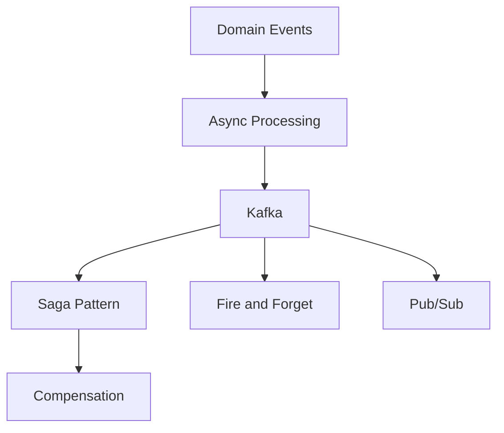

# Patrones de Mensajería

## Contexto

Este estándar consolida patrones de mensajería para sistemas distribuidos. Complementa el lineamiento [Comunicación Asíncrona y Eventos](../../lineamientos/arquitectura/08-comunicacion-asincrona-y-eventos.md). Ver [CQRS](./cqrs.md) para la separación de comandos y consultas en la capa de aplicación.

**Conceptos incluidos:**

- **Saga Pattern** → Transacciones distribuidas con coordinación por eventos
- **Async Processing** → Procesamiento asíncrono desacoplado con Kafka
- **Compensation Pattern** → Rollback lógico en sistemas distribuidos

---

## Stack Tecnológico

| Componente      | Tecnología          | Versión    | Uso                                            |
| --------------- | ------------------- | ---------- | ---------------------------------------------- |
| **Messaging**   | Apache Kafka        | 3.6+       | Event bus para sagas y procesamiento asíncrono |
| **Event Store** | PostgreSQL + Marten | 16+ / 7.0+ | Event sourcing (opcional)                      |

---

## Relación entre Conceptos



---

## Saga Pattern

### ¿Qué es Saga?

Patrón para transacciones distribuidas mediante secuencia de transacciones locales coordinadas por eventos o comandos.

**Tipos:**

- **Choreography**: Cada servicio reacciona a eventos (descentralizado)
- **Orchestration**: Coordinador central gestiona flujo

**Propósito:** Consistencia eventual en arquitecturas distribuidas.

**Beneficios:**
✅ Transacciones distribuidas sin 2PC
✅ Cada servicio mantiene autonomía
✅ Rollback lógico vía compensación

### Ejemplo - Saga Choreography

```csharp
// Saga: Order → Payment → Inventory → Shipping

// 1. Order Service crea orden
public class OrderService
{
    public async Task<Guid> CreateOrderAsync(CreateOrderDto dto)
    {
        var order = Order.Create(dto.CustomerId, dto.Lines);
        order.Status = OrderStatus.Pending;

        await _repository.SaveAsync(order);

        // Publicar evento para iniciar saga
        await _eventBus.PublishAsync(new OrderCreatedEvent(
            OrderId: order.Id,
            CustomerId: order.CustomerId,
            Total: order.Total));

        return order.Id;
    }

    // Manejar éxito de pago
    public async Task Handle(PaymentSucceededEvent @event)
    {
        var order = await _repository.GetByIdAsync(@event.OrderId);
        order.MarkAsPaid();
        await _repository.SaveAsync(order);

        // Continuar saga
        await _eventBus.PublishAsync(new OrderPaidEvent(@event.OrderId));
    }

    // Manejar fallo de pago (compensación)
    public async Task Handle(PaymentFailedEvent @event)
    {
        var order = await _repository.GetByIdAsync(@event.OrderId);
        order.Cancel("Payment failed");
        await _repository.SaveAsync(order);

        await _eventBus.PublishAsync(new OrderCancelledEvent(@event.OrderId));
    }
}

// 2. Payment Service procesa pago
public class PaymentService
{
    public async Task Handle(OrderCreatedEvent @event)
    {
        try
        {
            var payment = await _paymentGateway.ChargeAsync(
                @event.CustomerId,
                @event.Total);

            await _eventBus.PublishAsync(new PaymentSucceededEvent(
                @event.OrderId,
                payment.TransactionId));
        }
        catch (PaymentException ex)
        {
            await _eventBus.PublishAsync(new PaymentFailedEvent(
                @event.OrderId,
                ex.Reason));
        }
    }
}

// 3. Inventory Service reserva stock
public class InventoryService
{
    public async Task Handle(OrderPaidEvent @event)
    {
        var order = await _orderClient.GetOrderAsync(@event.OrderId);

        try
        {
            foreach (var line in order.Lines)
            {
                await _inventory.ReserveStockAsync(line.ProductId, line.Quantity);
            }

            await _eventBus.PublishAsync(new InventoryReservedEvent(@event.OrderId));
        }
        catch (InsufficientStockException)
        {
            // Compensación: refund del pago
            await _eventBus.PublishAsync(new InventoryReservationFailedEvent(@event.OrderId));
        }
    }

    // Compensación: liberar stock
    public async Task Handle(OrderCancelledEvent @event)
    {
        var reservations = await _inventory.GetReservationsAsync(@event.OrderId);
        foreach (var reservation in reservations)
        {
            await _inventory.ReleaseStockAsync(reservation.ProductId, reservation.Quantity);
        }
    }
}
```

---

---

## Async Processing

### ¿Qué es Async Processing?

Procesamiento desacoplado mediante message brokers donde el productor no espera respuesta inmediata.

**Propósito:** Desacoplamiento temporal, escalabilidad, resiliencia.

**Patrones:**

- **Fire and Forget**: Sin respuesta
- **Request-Reply**: Respuesta asíncrona
- **Pub/Sub**: Múltiples consumers

**Beneficios:**
✅ Desacoplamiento servicios
✅ Peak handling
✅ Retry automático

### Ejemplo

```csharp
// Producer: Publicar evento sin esperar
public class OrderService
{
    private readonly IEventProducer _eventProducer;

    public async Task ConfirmOrderAsync(Guid orderId)
    {
        var order = await _repository.GetByIdAsync(orderId);
        order.Confirm();

        await _repository.SaveAsync(order);

        // Fire and forget - no esperamos respuesta
        await _eventProducer.PublishAsync(
            topic: "order.confirmed",
            key: orderId.ToString(),
            value: new OrderConfirmedEvent
            {
                OrderId = orderId,
                CustomerId = order.CustomerId,
                Total = order.Total,
                ConfirmedAt = DateTime.UtcNow
            });
    }
}

// Consumer: Procesar async
public class OrderConfirmedConsumer : BackgroundService
{
    private readonly IEventConsumer _consumer;
    private readonly IEmailService _emailService;

    protected override async Task ExecuteAsync(CancellationToken stoppingToken)
    {
        await foreach (var message in _consumer.ConsumeAsync("order.confirmed", stoppingToken))
        {
            try
            {
                var @event = message.Value.Deserialize<OrderConfirmedEvent>();

                // Procesamiento asíncrono
                await _emailService.SendOrderConfirmationAsync(
                    @event.CustomerId,
                    @event.OrderId);

                await message.CommitAsync();
            }
            catch (Exception ex)
            {
                _logger.LogError(ex, "Error processing order confirmation");
                // Mensaje va a DLQ después de N retries
            }
        }
    }
}

// Configuración Kafka para async processing
public static class KafkaConfiguration
{
    public static IServiceCollection AddKafkaProducer(this IServiceCollection services)
    {
        services.AddSingleton<IEventProducer>(sp =>
        {
            var config = new ProducerConfig
            {
                BootstrapServers = "kafka:9092",
                Acks = Acks.Leader, // Async: solo líder confirma
                EnableIdempotence = true,
                MaxInFlight = 5,
                CompressionType = CompressionType.Snappy
            };

            return new EventProducer(config);
        });

        return services;
    }
}
```

---

---

## Compensation Pattern

### ¿Qué es Compensation?

Patrón de "rollback lógico" en sistemas distribuidos donde no hay transacciones ACID globales.

**Propósito:** Deshacer cambios en caso de fallo de saga.

**Estrategias:**

- **Backward Recovery**: Compensar transacciones completadas
- **Forward Recovery**: Completar saga alternativamente
- **Semantic Lock**: Marcar recursos como "pendientes"

**Beneficios:**
✅ Consistencia eventual
✅ Sin 2PC
✅ Autonomía de servicios

### Ejemplo

```csharp
// Saga con compensación explícita
public class BookingCompensation
{
    public record ReservationStep(
        string Service,
        Func<Task> Execute,
        Func<Task> Compensate);

    public async Task<Result> ExecuteSagaAsync(List<ReservationStep> steps)
    {
        var completedSteps = new Stack<ReservationStep>();

        try
        {
            // Ejecutar pasos secuencialmente
            foreach (var step in steps)
            {
                _logger.LogInformation("Executing step: {Service}", step.Service);
                await step.Execute();
                completedSteps.Push(step);
            }

            return Result.Success();
        }
        catch (Exception ex)
        {
            _logger.LogError(ex, "Saga failed, compensating {Count} steps", completedSteps.Count);

            // Compensar en orden inverso
            while (completedSteps.Count > 0)
            {
                var step = completedSteps.Pop();

                try
                {
                    _logger.LogInformation("Compensating step: {Service}", step.Service);
                    await step.Compensate();
                }
                catch (Exception compensationEx)
                {
                    _logger.LogError(compensationEx,
                        "Compensation failed for {Service}", step.Service);
                    // Enviar a dead letter para intervención manual
                }
            }

            return Result.Failure("Saga failed and compensated");
        }
    }
}

// Uso: Booking de viaje
public class TravelBookingSaga
{
    public async Task<Result> BookTripAsync(TripBookingDto dto)
    {
        var flightReservationId = Guid.Empty;
        var hotelReservationId = Guid.Empty;
        var carReservationId = Guid.Empty;

        var steps = new List<ReservationStep>
        {
            new ReservationStep(
                Service: "Flight",
                Execute: async () =>
                {
                    flightReservationId = await _flightService.ReserveFlightAsync(dto.Flight);
                },
                Compensate: async () =>
                {
                    if (flightReservationId != Guid.Empty)
                        await _flightService.CancelReservationAsync(flightReservationId);
                }),

            new ReservationStep(
                Service: "Hotel",
                Execute: async () =>
                {
                    hotelReservationId = await _hotelService.ReserveRoomAsync(dto.Hotel);
                },
                Compensate: async () =>
                {
                    if (hotelReservationId != Guid.Empty)
                        await _hotelService.CancelReservationAsync(hotelReservationId);
                }),

            new ReservationStep(
                Service: "Car Rental",
                Execute: async () =>
                {
                    carReservationId = await _carService.ReserveCarAsync(dto.Car);
                },
                Compensate: async () =>
                {
                    if (carReservationId != Guid.Empty)
                        await _carService.CancelReservationAsync(carReservationId);
                })
        };

        var compensation = new BookingCompensation();
        return await compensation.ExecuteSagaAsync(steps);
    }
}
```

---

---

## Matriz de Decisión

| Escenario                   | Saga   | Async Processing | Compensation |
| --------------------------- | ------ | ---------------- | ------------ |
| **Transacción distribuida** | ✅✅✅ | ✅✅             | ✅✅✅       |
| **Integración servicios**   | ✅✅   | ✅✅✅           | ✅✅         |
| **Event Sourcing**          | ✅     | ✅✅             | -            |

---

## Beneficios en Práctica

```yaml
# ✅ Comparativa de impacto

Antes (sin Saga Pattern):
  Problema: Pago y reserva de stock en llamadas síncronas encadenadas
    — si inventory falla después de cobrar, el pago queda sin revertir
  Consecuencia: Inconsistencia de datos, cliente cobrado sin stock reservado

Después (con Saga + Compensation):
  Estado: Cada servicio publica y consume eventos Kafka;
    fallo en inventory dispara compensación que revierte el pago automáticamente
  Resultado: Consistencia eventual garantizada, sin 2PC,
    servicios autónomos con rollback lógico auditado
```

---

## Requisitos Técnicos

### MUST (Obligatorio)

**Saga:**

- **MUST** implementar compensación para cada paso de saga
- **MUST** hacer sagas idempotentes

**Async Processing:**

- **MUST** usar at-least-once delivery con idempotencia
- **MUST** configurar dead letter queue

**Compensation:**

- **MUST** loggear compensaciones para auditoría

### SHOULD (Fuertemente recomendado)

- **SHOULD** usar choreography saga para `< 5` servicios
- **SHOULD** usar orchestration saga para `>= 5` servicios

### MUST NOT (Prohibido)

- **MUST NOT** usar 2PC en microservicios
- **MUST NOT** hacer sagas sin timeout

---

## Referencias

- [Lineamiento Comunicación Asíncrona y Eventos](../../lineamientos/arquitectura/08-comunicacion-asincrona-y-eventos.md) — lineamiento que origina este estándar
- [Saga Pattern (Chris Richardson)](https://microservices.io/patterns/data/saga.html)
- [Kafka Documentation](https://kafka.apache.org/documentation/)
- [CQRS](./cqrs.md) — separación de commands y queries que produce los eventos de dominio
