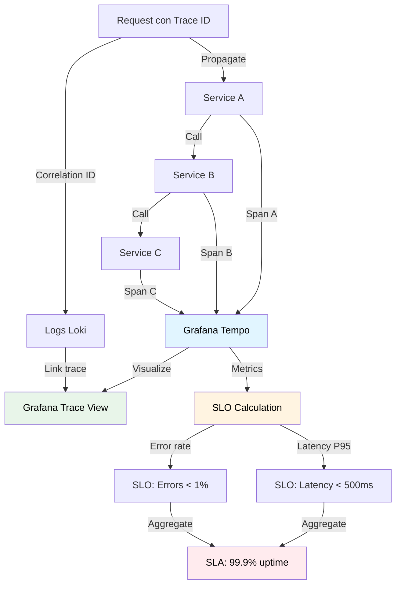

# Distributed Tracing

## Contexto

Este estándar define prácticas para implementar tracing distribuido y propagación de correlation IDs usando OpenTelemetry y Grafana Tempo. Complementa el lineamiento [Observabilidad](../../lineamientos/arquitectura/06-observabilidad.md) permitiendo rastrear requests a través de múltiples servicios y correlacionar logs con trazas para diagnóstico eficiente.

**Conceptos incluidos:**

- **Distributed Tracing** → Rastreo de requests cross-service con spans
- **Correlation IDs** → Identificadores únicos para correlacionar logs/traces

:::note
La definición de SLOs y SLAs se documenta en [SLO y SLA](./slo-sla.md).
:::

---

## Stack Tecnológico

| Componente          | Tecnología    | Versión | Uso                                |
| ------------------- | ------------- | ------- | ---------------------------------- |
| **Tracing Library** | OpenTelemetry | 1.7+    | Instrumentación de traces          |
| **Trace Storage**   | Grafana Tempo | 2.3+    | Almacenamiento de traces           |
| **Agent**           | Grafana Alloy | 1.0+    | Recolección y forwarding de traces |
| **Trace Protocol**  | OTLP          | 1.0+    | Protocolo de exportación           |
| **Visualization**   | Grafana       | 10.2+   | Visualización de traces            |

---

## Relación entre Tracing y Correlation IDs



**Principios clave:**

1. **End-to-end visibility**: Ver request completo a través de todos los servicios
2. **Context propagation**: Pasar trace/correlation ID automáticamente
3. **Causality tracking**: Entender qué causó qué
4. **Objective measurement**: SLOs basados en métricas reales, no percepciones

---

## Distributed Tracing

### ¿Qué es Distributed Tracing?

Técnica para rastrear el flujo de un request a través de múltiples servicios, capturando timing, errores y contexto de cada operación (span) en el camino.

**Propósito:** Diagnosticar latencia, identificar cuellos de botella, entender flujo de requests en arquitecturas distribuidas.

**Componentes clave:**

- **Trace**: Request completo end-to-end (ID único)
- **Span**: Operación individual dentro del trace (ej. HTTP call, DB query)
- **Context propagation**: Pasar trace ID entre servicios (headers HTTP, Kafka headers)
- **Sampling**: Capturar % de traces para reducir overhead

**Beneficios:**
✅ Diagnosticar latencia cross-service
✅ Identificar servicios lentos o cayendo
✅ Entender dependencias entre servicios
✅ Debugging distribuido

### Trace Anatomy

```
Trace ID: abc123def456 (único para todo el request)
│
├─ Span 1: HTTP POST /orders (Service: API Gateway)
│  ├─ Duration: 450ms
│  ├─ Status: OK
│  └─ Attributes: http.method=POST, http.route=/orders
│     │
│     ├─ Span 2: HTTP POST /api/orders (Service: Order Service)
│     │  ├─ Duration: 420ms
│     │  ├─ Parent: Span 1
│     │  └─ Attributes: http.method=POST, http.target=/api/orders
│     │     │
│     │     ├─ Span 3: SELECT FROM customers (DB: PostgreSQL)
│     │     │  ├─ Duration: 15ms
│     │     │  ├─ Parent: Span 2
│     │     │  └─ Attributes: db.system=postgresql, db.statement=SELECT...
│     │     │
│     │     ├─ Span 4: INSERT INTO orders (DB: PostgreSQL)
│     │     │  ├─ Duration: 25ms
│     │     │  ├─ Parent: Span 2
│     │     │  └─ Attributes: db.system=postgresql, db.statement=INSERT...
│     │     │
│     │     └─ Span 5: HTTP POST /api/payments (Service: Payment Service)
│     │        ├─ Duration: 350ms  ← BOTTLENECK
│     │        ├─ Parent: Span 2
│     │        └─ Attributes: http.method=POST, http.status_code=200
│     │           │
│     │           ├─ Span 6: HTTP POST /charge (External: Stripe API)
│     │           │  ├─ Duration: 320ms
│     │           │  ├─ Parent: Span 5
│     │           │  └─ Attributes: http.url=https://api.stripe.com/charge
│     │           │
│     │           └─ Span 7: INSERT INTO payments (DB: PostgreSQL)
│     │              ├─ Duration: 10ms
│     │              ├─ Parent: Span 5
│     │              └─ Attributes: db.system=postgresql
```

**Análisis:** El bottleneck es Span 5 (Payment Service) debido a latencia de Stripe API (Span 6: 320ms).

### Implementación OpenTelemetry

```csharp
// Program.cs: Configurar OpenTelemetry Tracing
using OpenTelemetry.Resources;
using OpenTelemetry.Trace;

var builder = WebApplication.CreateBuilder(args);

builder.Services.AddOpenTelemetry()
    .ConfigureResource(resource => resource
        .AddService("customer-service", serviceVersion: "1.2.3")
        .AddAttributes(new Dictionary<string, object>
        {
            ["deployment.environment"] = builder.Environment.EnvironmentName,
            ["service.namespace"] = "ecommerce"
        }))
    .WithTracing(tracing => tracing
        // Auto-instrumentation
        .AddAspNetCoreInstrumentation(options =>
        {
            options.RecordException = true;
            options.EnrichWithHttpRequest = (activity, request) =>
            {
                activity.SetTag("http.client_ip", request.HttpContext.Connection.RemoteIpAddress);
                activity.SetTag("http.user_agent", request.Headers["User-Agent"].ToString());
            };
        })
        .AddHttpClientInstrumentation(options =>
        {
            options.RecordException = true;
            options.EnrichWithHttpRequestMessage = (activity, request) =>
            {
                activity.SetTag("http.request.header.correlation-id",
                    request.Headers.GetValues("X-Correlation-ID").FirstOrDefault());
            };
        })
        .AddNpgsql()  // PostgreSQL instrumentation

        // Custom sources
        .AddSource("CustomerService.Activities")

        // Exportar a Grafana Tempo via OTLP
        .AddOtlpExporter(options =>
        {
            options.Endpoint = new Uri("http://grafana-alloy:4317");
            options.Protocol = OtlpExportProtocol.Grpc;
        })

        // Sampling: 10% en producción, 100% en dev
        .SetSampler(builder.Environment.IsProduction()
            ? new TraceIdRatioBasedSampler(0.1)
            : new AlwaysOnSampler()));

var app = builder.Build();
```

### Custom Spans

```csharp
using System.Diagnostics;

public class OrderService
{
    private static readonly ActivitySource ActivitySource = new("CustomerService.Activities");
    private readonly ILogger<OrderService> _logger;

    public async Task<Order> CreateOrderAsync(CreateOrderCommand command)
    {
        // Crear custom activity (span)
        using var activity = ActivitySource.StartActivity("CreateOrder", ActivityKind.Internal);

        // Agregar tags (attributes)
        activity?.SetTag("order.customer_id", command.CustomerId);
        activity?.SetTag("order.total_amount", command.TotalAmount);
        activity?.SetTag("order.item_count", command.Items.Count);

        try
        {
            // Validación (sub-span automático si usa DB)
            var customer = await _customerRepository.GetByIdAsync(command.CustomerId);
            if (customer == null)
            {
                activity?.SetStatus(ActivityStatusCode.Error, "Customer not found");
                activity?.SetTag("error", true);
                throw new NotFoundException($"Customer {command.CustomerId} not found");
            }

            // Crear orden
            var order = new Order
            {
                CustomerId = command.CustomerId,
                Items = command.Items,
                TotalAmount = command.TotalAmount,
                Status = OrderStatus.Pending
            };

            await _orderRepository.CreateAsync(order);

            // Procesar pago (custom span)
            using (var paymentActivity = ActivitySource.StartActivity("ProcessPayment", ActivityKind.Client))
            {
                paymentActivity?.SetTag("payment.method", command.PaymentMethod);
                paymentActivity?.SetTag("payment.amount", command.TotalAmount);

                var payment = await _paymentService.ProcessAsync(order);

                paymentActivity?.SetTag("payment.id", payment.Id);
                paymentActivity?.SetTag("payment.status", payment.Status);
            }

            // Success
            activity?.SetStatus(ActivityStatusCode.Ok);
            activity?.SetTag("order.id", order.Id);

            _logger.LogInformation(
                "Order created: {OrderId} for customer {CustomerId}",
                order.Id,
                command.CustomerId);

            return order;
        }
        catch (Exception ex)
        {
            // Registrar error en span
            activity?.SetStatus(ActivityStatusCode.Error, ex.Message);
            activity?.RecordException(ex);

            _logger.LogError(ex, "Error creating order");
            throw;
        }
    }
}
```

### Context Propagation (HTTP)

```csharp
// Context propagation es AUTOMÁTICA con OpenTelemetry HttpClient instrumentation

public class PaymentServiceClient
{
    private readonly HttpClient _httpClient;

    public PaymentServiceClient(HttpClient httpClient)
    {
        _httpClient = httpClient;
    }

    public async Task<Payment> ProcessPaymentAsync(Order order)
    {
        // OpenTelemetry automáticamente inyecta headers:
        // - traceparent: 00-abc123def456-span789-01
        // - tracestate: (vendor-specific state)

        var request = new HttpRequestMessage(HttpMethod.Post, "/api/payments")
        {
            Content = JsonContent.Create(new
            {
                order.Id,
                order.TotalAmount
            })
        };

        var response = await _httpClient.SendAsync(request);
        response.EnsureSuccessStatusCode();

        return await response.Content.ReadFromJsonAsync<Payment>();
    }
}

// En Payment Service, OpenTelemetry automáticamente EXTRAE trace context
// y crea span hijo del span de Order Service
```

### Context Propagation (Kafka)

```csharp
// Para Kafka, necesitamos propagar manualmente (OpenTelemetry no lo hace automático)

public class KafkaEventProducer
{
    private readonly IProducer<string, string> _producer;

    public async Task PublishOrderCreatedAsync(Order order)
    {
        var @event = new OrderCreatedEvent
        {
            EventId = Guid.NewGuid(),
            OrderId = order.Id,
            CustomerId = order.CustomerId
        };

        var message = new Message<string, string>
        {
            Key = order.CustomerId.ToString(),
            Value = JsonSerializer.Serialize(@event),
            Headers = new Headers()
        };

        // Inyectar trace context en headers Kafka
        var propagator = Propagators.DefaultTextMapPropagator;
        propagator.Inject(new PropagationContext(Activity.Current?.Context ?? default, Baggage.Current),
            message.Headers,
            (headers, key, value) =>
            {
                headers.Add(key, Encoding.UTF8.GetBytes(value));
            });

        await _producer.ProduceAsync("order.created", message);
    }
}

// Consumer: Extraer trace context
public class OrderCreatedConsumer
{
    protected override async Task ExecuteAsync(CancellationToken stoppingToken)
    {
        while (!stoppingToken.IsCancellationRequested)
        {
            var result = _consumer.Consume(stoppingToken);

            // Extraer trace context desde headers
            var propagator = Propagators.DefaultTextMapPropagator;
            var parentContext = propagator.Extract(default, result.Message.Headers,
                (headers, key) =>
                {
                    var header = headers.FirstOrDefault(h => h.Key == key);
                    return header != null ? new[] { Encoding.UTF8.GetString(header.GetValueBytes()) } : Enumerable.Empty<string>();
                });

            Baggage.Current = parentContext.Baggage;

            // Crear span hijo
            using var activity = ActivitySource.StartActivity(
                "ProcessOrderCreated",
                ActivityKind.Consumer,
                parentContext.ActivityContext);

            activity?.SetTag("messaging.system", "kafka");
            activity?.SetTag("messaging.destination", "order.created");

            await HandleEventAsync(result.Message.Value);

            _consumer.Commit(result);
        }
    }
}
```

### Sampling Strategies

```csharp
// 1. Always On (Development)
.SetSampler(new AlwaysOnSampler())

// 2. Ratio-based (10% en producción)
.SetSampler(new TraceIdRatioBasedSampler(0.1))

// 3. Parent-based (si parent fue sampled, child también)
.SetSampler(new ParentBasedSampler(new TraceIdRatioBasedSampler(0.1)))

// 4. Custom sampler (sample 100% de errores, 10% de success)
public class ErrorAwareSampler : Sampler
{
    private readonly Sampler _baseSampler = new TraceIdRatioBasedSampler(0.1);

    public override SamplingResult ShouldSample(in SamplingParameters samplingParameters)
    {
        // Siempre sample si hay error
        var tags = samplingParameters.Tags;
        if (tags?.Any(t => t.Key == "error" && t.Value?.ToString() == "true") == true)
        {
            return new SamplingResult(SamplingDecision.RecordAndSample);
        }

        // Si no hay error, usar ratio-based
        return _baseSampler.ShouldSample(samplingParameters);
    }
}
```

---

## Correlation IDs

### ¿Qué son Correlation IDs?

Identificadores únicos que se propagan a través de todos los componentes de un request (logs, traces, metrics) permitiendo correlacionar eventos relacionados.

**Propósito:** Rastrear un request específico a través de logs, traces y métricas para debugging holístico.

**Tipos:**

- **Trace ID**: Generado por OpenTelemetry (hexadecimal 32 chars)
- **Correlation ID**: Application-level ID (puede ser trace ID o custom)
- **Request ID**: ID del request HTTP individual

**Beneficios:**
✅ Correlacionar logs de múltiples servicios
✅ Link traces a logs específicos
✅ Debugging end-to-end de problemas
✅ Customer support (buscar por correlation ID)

### Implementación

```csharp
// Middleware para correlation ID
public class CorrelationIdMiddleware
{
    private readonly RequestDelegate _next;
    private const string CorrelationIdHeader = "X-Correlation-ID";

    public async Task InvokeAsync(HttpContext context)
    {
        // 1. Obtener correlation ID desde header (si existe)
        var correlationId = context.Request.Headers[CorrelationIdHeader].FirstOrDefault();

        // 2. Si no existe, crear uno nuevo (usar trace ID de OpenTelemetry)
        if (string.IsNullOrEmpty(correlationId))
        {
            correlationId = Activity.Current?.TraceId.ToString() ?? Guid.NewGuid().ToString();
        }

        // 3. Guardar en HttpContext para acceso posterior
        context.Items["CorrelationId"] = correlationId;

        // 4. Agregar a logs via LogContext
        using (LogContext.PushProperty("CorrelationId", correlationId))
        {
            // 5. Agregar a response headers (para cliente)
            context.Response.OnStarting(() =>
            {
                context.Response.Headers.Add(CorrelationIdHeader, correlationId);
                return Task.CompletedTask;
            });

            await _next(context);
        }
    }
}

// Registrar middleware (PRIMERO en pipeline)
app.UseMiddleware<CorrelationIdMiddleware>();
```

### Propagación a servicios downstream

```csharp
// HttpClient: Propagar correlation ID automáticamente
public class CorrelationIdDelegatingHandler : DelegatingHandler
{
    private readonly IHttpContextAccessor _httpContextAccessor;

    protected override async Task<HttpResponseMessage> SendAsync(
        HttpRequestMessage request,
        CancellationToken cancellationToken)
    {
        // Obtener correlation ID del request actual
        var correlationId = _httpContextAccessor.HttpContext?.Items["CorrelationId"]?.ToString();

        if (!string.IsNullOrEmpty(correlationId))
        {
            // Agregar header a request downstream
            request.Headers.Add("X-Correlation-ID", correlationId);
        }

        return await base.SendAsync(request, cancellationToken);
    }
}

// Registrar handler
builder.Services.AddHttpContextAccessor();
builder.Services.AddHttpClient("payment-service")
    .AddHttpMessageHandler<CorrelationIdDelegatingHandler>();
```

### Uso en logs

```csharp
// Logs automáticamente incluyen CorrelationId (gracias a LogContext)
_logger.LogInformation("Processing order {OrderId}", order.Id);

// Output JSON:
// {
//   "timestamp": "2026-02-19T15:30:00Z",
//   "level": "Information",
//   "message": "Processing order abc-123",
//   "properties": {
//     "OrderId": "abc-123",
//     "CorrelationId": "trace-xyz-789",  ← Automático
//     "TraceId": "abc123def456",
//     "SpanId": "span789"
//   }
// }
```

### Query logs por Correlation ID (Loki)

```logql
# Buscar todos los logs de un request específico
{service="customer-service"} | json | CorrelationId="trace-xyz-789"

# Buscar logs de TODOS los servicios para un correlation ID
{service=~".*"} | json | CorrelationId="trace-xyz-789" | line_format "{{.service}} [{{.level}}] {{.message}}"

# Output:
# customer-service [Information] Received order request
# customer-service [Information] Validating customer abc-123
# payment-service [Information] Processing payment for order order-456
# payment-service [Error] Payment gateway timeout
# customer-service [Error] Order creation failed
```

### Link traces a logs en Grafana

```csharp
// Serilog: Agregar trace ID a logs
Log.Logger = new LoggerConfiguration()
    .Enrich.WithSpan()  // Agrega TraceId y SpanId automáticamente
    .WriteTo.Console(new CompactJsonFormatter())
    .CreateLogger();

// Configurar Grafana para link logs ↔ traces:
// 1. En Loki data source, configurar "Derived fields":
//    - Name: TraceID
//    - Regex: "TraceId":"(\w+)"
//    - URL: ${__value.raw}
//    - Internal link: Tempo data source
//
// 2. Ahora en logs panel, aparece botón "Tempo" para abrir trace
```

---

## Requisitos Técnicos

### MUST (Obligatorio)

**Distributed Tracing:**

- **MUST** instrumentar aplicación con OpenTelemetry Tracing
- **MUST** exportar traces vía OTLP a Grafana Tempo
- **MUST** habilitar auto-instrumentation (ASP.NET Core, HttpClient, Database)
- **MUST** propagar trace context entre servicios (HTTP headers automático)
- **MUST** usar sampling apropiado (10% en producción, 100% dev)
- **MUST** registrar excepciones en spans (`activity.RecordException(ex)`)

**Correlation IDs:**

- **MUST** implementar middleware de correlation ID (primero en pipeline)
- **MUST** usar trace ID de OpenTelemetry como correlation ID
- **MUST** propagar correlation ID en headers HTTP (`X-Correlation-ID`)
- **MUST** incluir correlation ID en logs (via LogContext)
- **MUST** retornar correlation ID en response headers

### SHOULD (Fuertemente recomendado)

- **SHOULD** crear custom spans para operaciones críticas de negocio
- **SHOULD** agregar tags relevantes a spans (customer_id, order_id, etc.)
- **SHOULD** propagar context en Kafka (manual injection/extraction)
- **SHOULD** configurar link entre Loki logs y Tempo traces (derived fields)
- **SHOULD** usar parent-based sampler para mantener coherencia de traces

### MAY (Opcional)

- **MAY** implementar custom sampler (ej. 100% traces con errores)
- **MAY** usar baggage para propagar metadata adicional

### MUST NOT (Prohibido)

- **MUST NOT** deshabilitar tracing en producción (usar sampling)
- **MUST NOT** loguear trace IDs manualmente (Serilog.Enrich.WithSpan lo hace automático)

---

## Referencias

- [Lineamiento de Observabilidad](../../lineamientos/arquitectura/06-observabilidad.md) — lineamiento que origina este estándar
- [SLO y SLA](./slo-sla.md) — objetivos de nivel de servicio basados en las métricas de traces
- [Structured Logging](./structured-logging.md) — correlación de logs con trazas distribuidas
- [Métricas con OpenTelemetry](./metrics-standards.md) — fuente de métricas complementaria
- [Alertas con Grafana](./alerting.md) — alertas sobre latencia y errores capturados con traces
- [Resilience Patterns](../arquitectura/resilience-patterns.md) — patrones complementarios de resiliencia
- [API Error Handling](../apis/api-error-handling.md) — manejo de errores correlacionado con trazas
- [OpenTelemetry Tracing](https://opentelemetry.io/docs/specs/otel/trace/) — especificación oficial
- [.NET OpenTelemetry Tracing](https://github.com/open-telemetry/opentelemetry-dotnet) — SDK para .NET
- [W3C Trace Context](https://www.w3.org/TR/trace-context/) — estándar de propagación de contexto
- [Grafana Tempo Documentation](https://grafana.com/docs/tempo/latest/) — almacenamiento de traces
- [Trace to Logs](https://grafana.com/docs/grafana/latest/datasources/tempo/#trace-to-logs) — correlación traces-logs en Grafana
