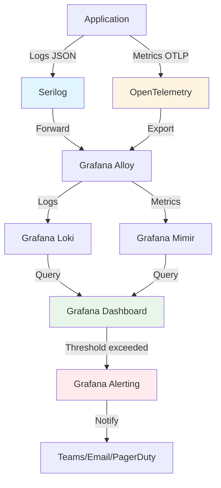

# Logging & Monitoring

## Contexto

Este estándar define prácticas para observabilidad mediante logging estructurado, métricas, dashboards y alertas usando Grafana Stack (Loki + Mimir + Grafana + Alloy) y Serilog. Complementa el lineamiento [Observability](../../lineamientos/observabilidad/observability.md) asegurando visibilidad completa del comportamiento de aplicaciones en producción para debugging rápido, análisis de performance y detección proactiva de problemas.

**Conceptos incluidos:**

- **Structured Logging** → Logs en formato JSON con contexto rico para análisis
- **Metrics Standards** → Métricas OpenTelemetry (counters, gauges, histograms)
- **Dashboards** → Visualización en Grafana de métricas y logs
- **Alerting** → Alertas proactivas basadas en umbrales y anomalías

---

## Stack Tecnológico

| Componente             | Tecnología       | Versión | Uso                                    |
| ---------------------- | ---------------- | ------- | -------------------------------------- |
| **Logging Library**    | Serilog          | 3.1+    | Logging estructurado en .NET           |
| **Log Aggregation**    | Grafana Loki     | 2.9+    | Almacenamiento y query de logs         |
| **Metrics Collection** | OpenTelemetry    | 1.7+    | Exportación de métricas                |
| **Metrics Storage**    | Grafana Mimir    | 2.10+   | Time-series database para métricas     |
| **Visualization**      | Grafana          | 10.2+   | Dashboards y visualizaciones           |
| **Agent**              | Grafana Alloy    | 1.0+    | Recolección y forwarding de telemetría |
| **Alerting**           | Grafana Alerting | -       | Gestión de alertas                     |

---

## Conceptos Fundamentales

Este estándar cubre 4 prácticas relacionadas con observabilidad:

### Índice de Conceptos

1. **Structured Logging**: Logs JSON con contexto rico y correlación
2. **Metrics Standards**: Métricas OpenTelemetry para performance e infra
3. **Dashboards**: Visualización de métricas/logs en Grafana
4. **Alerting**: Notificaciones proactivas de problemas

### Relación entre Conceptos



**Principios clave:**

1. **Structured over unstructured**: JSON logs > plain text
2. **Context enrichment**: Agregar correlation IDs, user, tenant, etc.
3. **Metrics as first-class citizens**: No solo logs, métricas para performance
4. **Actionable alerts**: Alertas deben requerir acción humana (no ruido)

---

## 1. Structured Logging

### ¿Qué es Structured Logging?

Práctica de escribir logs en formato estructurado (JSON) con campos bien definidos en lugar de strings no estructurados, facilitando búsqueda, filtrado y análisis.

**Propósito:** Hacer logs machine-readable para queries complejas, correlación y agregación.

**Componentes clave:**

- **Structured format**: JSON con propiedades tipadas
- **Log levels**: Trace, Debug, Information, Warning, Error, Critical
- **Context enrichment**: Correlation ID, user ID, tenant ID, request path
- **Semantic logging**: Usar templates con parámetros, no concatenación

**Beneficios:**
✅ Búsqueda rápida por campos específicos
✅ Correlación de logs cross-service
✅ Agregaciones y estadísticas
✅ Mejor debugging en producción

### Comparación: Unstructured vs Structured

```csharp
// ❌ UNSTRUCTURED: Concatenación de strings
public class OrderService
{
    private readonly ILogger<OrderService> _logger;

    public async Task<Order> CreateOrderAsync(CreateOrderCommand command)
    {
        _logger.LogInformation("Creating order for customer " + command.CustomerId +
            " with total " + command.Total);

        var order = await _repository.CreateAsync(command);

        _logger.LogInformation("Order created: " + order.Id);

        return order;
    }
}

// Problemas:
// 1. No se puede buscar por CustomerId fácilmente
// 2. No hay contexto adicional (correlation ID, tenant, etc.)
// 3. Difícil parsear y analizar
// 4. No hay tipos (todo es string)

// Output:
// 2026-02-19 15:30:00 [INF] Creating order for customer 123 with total 99.99
// 2026-02-19 15:30:01 [INF] Order created: 456
```

```csharp
// ✅ STRUCTURED: Templates con parámetros
public class OrderService
{
    private readonly ILogger<OrderService> _logger;

    public async Task<Order> CreateOrderAsync(CreateOrderCommand command)
    {
        using (_logger.BeginScope(new Dictionary<string, object>
        {
            ["CustomerId"] = command.CustomerId,
            ["CorrelationId"] = Activity.Current?.Id ?? Guid.NewGuid().ToString()
        }))
        {
            _logger.LogInformation(
                "Creating order: {TotalAmount} {Currency}",
                command.Total,
                command.Currency);

            var order = await _repository.CreateAsync(command);

            _logger.LogInformation(
                "Order created: {OrderId} {Status}",
                order.Id,
                order.Status);

            return order;
        }
    }
}

// Ventajas:
// 1. Campos tipados (TotalAmount, Currency, OrderId, Status)
// 2. Contexto automático (CustomerId, CorrelationId en scope)
// 3. Fácil query: CustomerId="123" AND TotalAmount>50
// 4. JSON estructurado para machine processing

// Output (JSON):
// {
//   "timestamp": "2026-02-19T15:30:00Z",
//   "level": "Information",
//   "message": "Creating order: 99.99 USD",
//   "properties": {
//     "TotalAmount": 99.99,
//     "Currency": "USD",
//     "CustomerId": "123",
//     "CorrelationId": "trace-abc-123"
//   }
// }
```

### Configuración Serilog

```csharp
// Program.cs
using Serilog;
using Serilog.Enrichers.Span;
using Serilog.Formatting.Compact;

var builder = WebApplication.CreateBuilder(args);

// Configurar Serilog
Log.Logger = new LoggerConfiguration()
    // Nivel mínimo
    .MinimumLevel.Information()
    .MinimumLevel.Override("Microsoft.AspNetCore", LogEventLevel.Warning)
    .MinimumLevel.Override("Microsoft.EntityFrameworkCore", LogEventLevel.Warning)

    // Enrichers (agregar contexto automático)
    .Enrich.FromLogContext()
    .Enrich.WithMachineName()
    .Enrich.WithEnvironmentName()
    .Enrich.WithProperty("Application", "customer-service")
    .Enrich.WithProperty("Version", "1.2.3")
    .Enrich.WithSpan()  // OpenTelemetry trace/span IDs

    // Sinks
    .WriteTo.Console(
        outputTemplate: "[{Timestamp:HH:mm:ss} {Level:u3}] {Message:lj}{NewLine}{Exception}")
    .WriteTo.File(
        formatter: new CompactJsonFormatter(),  // JSON estructurado
        path: "logs/customer-service-.json",
        rollingInterval: RollingInterval.Day,
        retainedFileCountLimit: 7)

    .CreateLogger();

builder.Host.UseSerilog();

var app = builder.Build();

// Middleware para enriquecer logs con request context
app.UseSerilogRequestLogging(options =>
{
    options.MessageTemplate = "HTTP {RequestMethod} {RequestPath} responded {StatusCode} in {Elapsed:0.0000} ms";
    options.EnrichDiagnosticContext = (diagnosticContext, httpContext) =>
    {
        diagnosticContext.Set("RequestHost", httpContext.Request.Host.Value);
        diagnosticContext.Set("RequestScheme", httpContext.Request.Scheme);
        diagnosticContext.Set("UserAgent", httpContext.Request.Headers["User-Agent"].ToString());

        // Extraer user/tenant desde claims
        if (httpContext.User.Identity?.IsAuthenticated == true)
        {
            diagnosticContext.Set("UserId", httpContext.User.FindFirst("sub")?.Value);
            diagnosticContext.Set("TenantId", httpContext.User.FindFirst("tenant_id")?.Value);
        }
    };
});

app.Run();
```

### Log Levels Guideline

| Level           | Cuándo usar                              | Ejemplos                                | En producción    |
| --------------- | ---------------------------------------- | --------------------------------------- | ---------------- |
| **Trace**       | Información muy detallada (debugging)    | "Entering method X with params Y"       | ❌ Deshabilitado |
| **Debug**       | Información útil para debugging local    | "SQL query: SELECT \* FROM Orders"      | ❌ Deshabilitado |
| **Information** | Eventos significativos del flujo normal  | "Order created", "Payment processed"    | ✅ Habilitado    |
| **Warning**     | Situación inusual pero manejada          | "Retry attempt 2/3", "Cache miss"       | ✅ Habilitado    |
| **Error**       | Error que requiere atención              | "Payment failed", "DB connection lost"  | ✅ Habilitado    |
| **Critical**    | Error catastrófico (app crash inminente) | "Out of memory", "All DB replicas down" | ✅ Habilitado    |

**Regla de oro producción:** Information/Warning/Error/Critical solamente (Debug/Trace generan demasiado volumen).

### Context Enrichment

```csharp
// Enriquecer logs con contexto del request
public class ContextEnrichmentMiddleware
{
    private readonly RequestDelegate _next;

    public async Task InvokeAsync(HttpContext context)
    {
        using (LogContext.PushProperty("CorrelationId", GetOrCreateCorrelationId(context)))
        using (LogContext.PushProperty("RequestId", context.TraceIdentifier))
        using (LogContext.PushProperty("ClientIp", context.Connection.RemoteIpAddress?.ToString()))
        {
            await _next(context);
        }
    }

    private string GetOrCreateCorrelationId(HttpContext context)
    {
        // Propagar correlation ID desde header
        if (context.Request.Headers.TryGetValue("X-Correlation-ID", out var correlationId))
            return correlationId.ToString();

        // O usar OpenTelemetry trace ID
        return Activity.Current?.TraceId.ToString() ?? Guid.NewGuid().ToString();
    }
}

// Registrar middleware
app.UseMiddleware<ContextEnrichmentMiddleware>();
```

### Best Practices

```csharp
// ✅ BUENO: Template con parámetros
_logger.LogInformation(
    "Order {OrderId} created for customer {CustomerId} with total {Total}",
    order.Id,
    customer.Id,
    order.Total);

// ❌ MALO: Concatenación (no estructurado)
_logger.LogInformation($"Order {order.Id} created for customer {customer.Id}");

// ✅ BUENO: Scope para contexto compartido
using (_logger.BeginScope("Processing batch {BatchId}", batchId))
{
    foreach (var item in batch)
    {
        _logger.LogInformation("Processing item {ItemId}", item.Id);
        // Todos los logs en este scope incluirán BatchId automáticamente
    }
}

// ✅ BUENO: Excepciones con contexto
try
{
    await ProcessPaymentAsync(payment);
}
catch (PaymentGatewayException ex)
{
    _logger.LogError(
        ex,
        "Payment failed for order {OrderId}: {Reason}",
        payment.OrderId,
        ex.Reason);
    throw;
}

// ❌ MALO: Log exception sin contexto
catch (Exception ex)
{
    _logger.LogError(ex.Message);  // Pierde stacktrace y contexto
}
```

---

## 2. Metrics Standards

### ¿Qué son Metrics?

Mediciones numéricas time-series sobre el comportamiento y performance de la aplicación (ej. request count, latency, error rate, CPU usage).

**Propósito:** Monitorear salud, performance y capacidad del sistema en tiempo real.

**Tipos de métricas OpenTelemetry:**

1. **Counter**: Valor acumulativo incrementable (ej. total requests, total errors)
2. **Gauge**: Valor instantáneo que sube/baja (ej. active connections, memory usage)
3. **Histogram**: Distribución de valores (ej. request duration, response size)

**Beneficios:**
✅ Monitoreo en tiempo real
✅ Alertas proactivas
✅ Análisis de tendencias
✅ Capacity planning

### Implementación OpenTelemetry Metrics

```csharp
// Program.cs: Configurar OpenTelemetry
using OpenTelemetry.Metrics;
using OpenTelemetry.Resources;

var builder = WebApplication.CreateBuilder(args);

builder.Services.AddOpenTelemetry()
    .ConfigureResource(resource => resource
        .AddService("customer-service", serviceVersion: "1.2.3"))
    .WithMetrics(metrics => metrics
        .AddAspNetCoreInstrumentation()  // HTTP metrics automáticas
        .AddRuntimeInstrumentation()     // .NET runtime metrics
        .AddHttpClientInstrumentation()  // HttpClient metrics
        .AddMeter("CustomerService.Metrics")  // Custom meter
        .AddOtlpExporter(options =>
        {
            options.Endpoint = new Uri(builder.Configuration["OpenTelemetry:Endpoint"]);
            options.Protocol = OtlpExportProtocol.Grpc;
        }));

var app = builder.Build();
```

### Custom Metrics

```csharp
// Metrics/ApplicationMetrics.cs
using System.Diagnostics.Metrics;

public class ApplicationMetrics
{
    private readonly Meter _meter;

    // Counters
    private readonly Counter<long> _ordersCreated;
    private readonly Counter<long> _ordersFailed;
    private readonly Counter<long> _paymentProcessed;

    // Gauges
    private readonly ObservableGauge<int> _activeOrders;

    // Histograms
    private readonly Histogram<double> _orderProcessingDuration;
    private readonly Histogram<long> _orderTotalAmount;

    public ApplicationMetrics(IMeterFactory meterFactory)
    {
        _meter = meterFactory.Create("CustomerService.Metrics", "1.0.0");

        // Inicializar counters
        _ordersCreated = _meter.CreateCounter<long>(
            "orders.created",
            unit: "{order}",
            description: "Total number of orders created");

        _ordersFailed = _meter.CreateCounter<long>(
            "orders.failed",
            unit: "{order}",
            description: "Total number of failed order creations");

        _paymentProcessed = _meter.CreateCounter<long>(
            "payments.processed",
            unit: "{payment}",
            description: "Total number of payments processed");

        // Inicializar gauges (async)
        _activeOrders = _meter.CreateObservableGauge<int>(
            "orders.active",
            observeValue: () => GetActiveOrdersCount(),
            unit: "{order}",
            description: "Current number of active orders");

        // Inicializar histograms
        _orderProcessingDuration = _meter.CreateHistogram<double>(
            "orders.processing.duration",
            unit: "ms",
            description: "Order processing duration in milliseconds");

        _orderTotalAmount = _meter.CreateHistogram<long>(
            "orders.total_amount",
            unit: "USD",
            description: "Order total amount distribution");
    }

    public void RecordOrderCreated(string status, decimal totalAmount)
    {
        _ordersCreated.Add(1, new KeyValuePair<string, object>("status", status));
        _orderTotalAmount.Record((long)totalAmount);
    }

    public void RecordOrderFailed(string reason)
    {
        _ordersFailed.Add(1, new KeyValuePair<string, object>("reason", reason));
    }

    public void RecordOrderProcessingDuration(double durationMs, bool success)
    {
        _orderProcessingDuration.Record(
            durationMs,
            new KeyValuePair<string, object>("success", success));
    }

    public void RecordPaymentProcessed(string method, decimal amount)
    {
        _paymentProcessed.Add(
            1,
            new KeyValuePair<string, object>("method", method),
            new KeyValuePair<string, object>("amount_bucket", GetAmountBucket(amount)));
    }

    private int GetActiveOrdersCount()
    {
        // Implementación real consultaría DB o cache
        return 42;
    }

    private string GetAmountBucket(decimal amount) =>
        amount switch
        {
            < 50 => "0-50",
            < 100 => "50-100",
            < 500 => "100-500",
            _ => "500+"
        };
}

// Registrar como singleton
builder.Services.AddSingleton<ApplicationMetrics>();
```

### Uso en Controllers/Services

```csharp
public class OrderController : ControllerBase
{
    private readonly IOrderService _orderService;
    private readonly ApplicationMetrics _metrics;
    private readonly ILogger<OrderController> _logger;

    [HttpPost]
    public async Task<IActionResult> CreateOrder([FromBody] CreateOrderRequest request)
    {
        var stopwatch = Stopwatch.StartNew();

        try
        {
            var order = await _orderService.CreateOrderAsync(request);

            stopwatch.Stop();

            // Registrar métricas de éxito
            _metrics.RecordOrderCreated(order.Status, order.TotalAmount);
            _metrics.RecordOrderProcessingDuration(stopwatch.Elapsed.TotalMilliseconds, success: true);

            _logger.LogInformation(
                "Order created: {OrderId} {TotalAmount} {Duration}ms",
                order.Id,
                order.TotalAmount,
                stopwatch.ElapsedMilliseconds);

            return CreatedAtAction(nameof(GetOrder), new { id = order.Id }, order);
        }
        catch (ValidationException ex)
        {
            stopwatch.Stop();

            // Registrar métricas de fallo
            _metrics.RecordOrderFailed(ex.Message);
            _metrics.RecordOrderProcessingDuration(stopwatch.Elapsed.TotalMilliseconds, success: false);

            _logger.LogWarning(ex, "Order validation failed");

            return BadRequest(ex.Message);
        }
        catch (Exception ex)
        {
            stopwatch.Stop();

            _metrics.RecordOrderFailed("Internal error");
            _metrics.RecordOrderProcessingDuration(stopwatch.Elapsed.TotalMilliseconds, success: false);

            _logger.LogError(ex, "Order creation failed");

            return StatusCode(500);
        }
    }
}
```

### Standard Metrics Catalog

**HTTP Metrics (auto-instrumentadas por ASP.NET Core):**

- `http.server.request.duration` - Histogram de latencia
- `http.server.active_requests` - Gauge de requests activos
- `http.server.request.body.size` - Histogram de request size
- `http.server.response.body.size` - Histogram de response size

**Runtime Metrics (.NET):**

- `process.runtime.dotnet.gc.collections.count` - GC collections
- `process.runtime.dotnet.gc.heap.size` - Heap size
- `process.runtime.dotnet.thread_pool.threads.count` - ThreadPool threads
- `process.runtime.dotnet.exceptions.count` - Exception count

**Custom Business Metrics (definir en cada servicio):**

- `orders.created` - Counter de órdenes creadas
- `payments.processed` - Counter de pagos procesados
- `inventory.reserved` - Counter de reservas de inventario
- `orders.active` - Gauge de órdenes activas
- `orders.processing.duration` - Histogram de duración de procesamiento

---

## 3. Dashboards

### ¿Qué son Dashboards?

Visualizaciones en Grafana que combinan múltiples paneles (gráficas, tablas, stats) para mostrar el estado de una aplicación o sistema.

**Propósito:** Proveer visibilidad en tiempo real del comportamiento del sistema para operación, debugging y análisis.

**Componentes clave:**

- **Panels**: Gráficas individuales (time series, gauge, stat, table, logs)
- **Variables**: Filtros dinámicos (environment, service, tenant)
- **Queries**: LogQL (Loki) y PromQL (Mimir)
- **Layout**: Organización de paneles en rows

**Beneficios:**
✅ Visibilidad centralizada
✅ Diagnóstico rápido de problemas
✅ Análisis de tendencias
✅ Comunicación con stakeholders

### Dashboard Structure

```
📊 Customer Service - Overview
├── Row: Key Metrics (colapsable)
│   ├── Panel: Request Rate (time series)
│   ├── Panel: Error Rate (time series)
│   ├── Panel: P95 Latency (stat + gauge)
│   └── Panel: Active Orders (gauge)
│
├── Row: HTTP Metrics
│   ├── Panel: Requests by Status Code (time series)
│   ├── Panel: Latency Distribution (heatmap)
│   └── Panel: Top 10 Slowest Endpoints (table)
│
├── Row: Business Metrics
│   ├── Panel: Orders Created (counter)
│   ├── Panel: Order Total Amount Distribution (histogram)
│   └── Panel: Payment Methods (pie chart)
│
├── Row: Infrastructure
│   ├── Panel: CPU Usage (time series)
│   ├── Panel: Memory Usage (time series)
│   ├── Panel: GC Collections (time series)
│   └── Panel: ThreadPool Threads (time series)
│
└── Row: Logs
    └── Panel: Recent Errors (logs panel)
```

### Grafana Dashboard JSON (excerpt)

```json
{
  "dashboard": {
    "title": "Customer Service - Overview",
    "tags": ["customer-service", "dotnet", "production"],
    "timezone": "browser",
    "refresh": "30s",

    "templating": {
      "list": [
        {
          "name": "environment",
          "type": "custom",
          "options": ["production", "staging", "development"],
          "current": { "value": "production" }
        },
        {
          "name": "instance",
          "type": "query",
          "datasource": "Mimir",
          "query": "label_values(http_server_request_duration_seconds_count{service=\"customer-service\"}, instance)"
        }
      ]
    },

    "panels": [
      {
        "id": 1,
        "title": "Request Rate",
        "type": "timeseries",
        "datasource": "Mimir",
        "targets": [
          {
            "expr": "rate(http_server_request_duration_seconds_count{service=\"customer-service\",environment=\"$environment\"}[5m])",
            "legendFormat": "{{method}} {{route}}"
          }
        ],
        "fieldConfig": {
          "defaults": {
            "unit": "reqps",
            "color": { "mode": "palette-classic" }
          }
        }
      },
      {
        "id": 2,
        "title": "Error Rate",
        "type": "timeseries",
        "datasource": "Mimir",
        "targets": [
          {
            "expr": "rate(http_server_request_duration_seconds_count{service=\"customer-service\",status_code=~\"5..\"}[5m])",
            "legendFormat": "Errors"
          }
        ],
        "fieldConfig": {
          "defaults": {
            "unit": "reqps",
            "color": { "fixedColor": "red" }
          }
        },
        "alert": {
          "conditions": [
            {
              "evaluator": { "type": "gt", "params": [10] },
              "operator": { "type": "and" },
              "query": { "params": ["A", "5m", "now"] },
              "type": "query"
            }
          ]
        }
      }
    ]
  }
}
```

### PromQL Queries Examples

```promql
# Request rate por endpoint
rate(http_server_request_duration_seconds_count{service="customer-service"}[5m])

# Error rate (status 5xx)
sum(rate(http_server_request_duration_seconds_count{service="customer-service",status_code=~"5.."}[5m]))

# P95 latency
histogram_quantile(0.95,
  rate(http_server_request_duration_seconds_bucket{service="customer-service"}[5m]))

# Orders created por minuto
rate(orders_created_total{service="customer-service"}[1m]) * 60

# Memory usage
process_runtime_dotnet_gc_heap_size_bytes{service="customer-service"}

# CPU usage (si expuesto por runtime)
rate(process_cpu_seconds_total{service="customer-service"}[5m]) * 100
```

### LogQL Queries Examples

```logql
# Logs de errores en última hora
{service="customer-service"} |= "level=Error" | json

# Logs filtrados por correlation ID
{service="customer-service"} | json | CorrelationId="trace-abc-123"

# Count de errores por minuto
sum by (level) (count_over_time({service="customer-service"} | json | level="Error" [1m]))

# Logs de pagos fallidos
{service="customer-service"} |= "Payment failed" | json | line_format "{{.timestamp}} [{{.CustomerId}}] {{.message}}"

# Latencia promedio desde logs (si está en mensaje)
avg_over_time({service="customer-service"} |= "HTTP" | json | unwrap Duration [5m])
```

### Dashboard as Code (Terraform)

```hcl
# terraform/modules/grafana/dashboards.tf

resource "grafana_dashboard" "customer_service" {
  config_json = file("${path.module}/dashboards/customer-service.json")

  folder = grafana_folder.services.id

  message = "Managed by Terraform"
}

resource "grafana_folder" "services" {
  title = "Services"
}

# Data sources
resource "grafana_data_source" "mimir" {
  name = "Mimir"
  type = "prometheus"
  url  = var.mimir_endpoint

  json_data_encoded = jsonencode({
    httpMethod = "POST"
  })
}

resource "grafana_data_source" "loki" {
  name = "Loki"
  type = "loki"
  url  = var.loki_endpoint

  json_data_encoded = jsonencode({
    maxLines = 1000
  })
}
```

---

## 4. Alerting

### ¿Qué es Alerting?

Sistema de notificaciones automáticas cuando métricas o logs indican problemas que requieren atención humana.

**Propósito:** Detectar problemas proactivamente antes que impacten usuarios, reducir tiempo de respuesta.

**Componentes clave:**

- **Alert rules**: Condiciones que disparan alertas (PromQL/LogQL)
- **Evaluation interval**: Frecuencia de evaluación de reglas
- **Notification channels**: Destinos (Email, Teams, PagerDuty)
- **Grouping & deduplication**: Evitar alerta fatigue

**Beneficios:**
✅ Detección proactiva de problemas
✅ Reducción de MTTR (Mean Time To Recovery)
✅ Visibilidad de degradación gradual
✅ Documentación automática de incidentes

### Alert Rule Structure

```yaml
# grafana/alerts/customer-service.yaml

apiVersion: 1
groups:
  - name: customer-service-alerts
    interval: 1m
    rules:
      # High error rate
      - uid: high-error-rate
        title: High Error Rate
        condition: A
        data:
          - refId: A
            queryType: query
            relativeTimeRange:
              from: 300  # 5m
              to: 0
            datasourceUid: mimir
            model:
              expr: |
                (sum(rate(http_server_request_duration_seconds_count{
                  service="customer-service",
                  status_code=~"5.."
                }[5m])) / sum(rate(http_server_request_duration_seconds_count{
                  service="customer-service"
                }[5m]))) * 100 > 5
        noDataState: NoData
        execErrState: Alerting
        for: 5m
        annotations:
          summary: Customer Service has high error rate
          description: Error rate is {{ $value }}% (threshold: 5%)
          runbook_url: https://wiki.example.com/runbooks/customer-service/high-error-rate
        labels:
          severity: warning
          team: platform
          service: customer-service

      # High latency
      - uid: high-latency
        title: High P95 Latency
        condition: A
        data:
          - refId: A
            queryType: query
            datasourceUid: mimir
            model:
              expr: |
                histogram_quantile(0.95,
                  rate(http_server_request_duration_seconds_bucket{
                    service="customer-service"
                  }[5m])
                ) > 1
        for: 10m
        annotations:
          summary: Customer Service P95 latency is high
          description: P95 latency is {{ $value }}s (threshold: 1s)
        labels:
          severity: warning
          team: platform

      # Service down
      - uid: service-down
        title: Service Down
        condition: A
        data:
          - refId: A
            queryType: query
            datasourceUid: mimir
            model:
              expr: |
                up{service="customer-service"} == 0
        for: 1m
        annotations:
          summary: Customer Service is DOWN
          description: Service has been unreachable for 1 minute
        labels:
          severity: critical
          team: platform
          oncall: true

      # Memory usage high
      - uid: high-memory
        title: High Memory Usage
        condition: A
        data:
          - refId: A
            queryType: query
            datasourceUid: mimir
            model:
              expr: |
                (process_runtime_dotnet_gc_heap_size_bytes{
                  service="customer-service"
                } / 1024 / 1024 / 1024) > 2
        for: 15m
        annotations:
          summary: Customer Service memory usage is high
          description: Memory usage is {{ $value }}GB (threshold: 2GB)
        labels:
          severity: warning
          team: platform
```

### Notification Channels

```yaml
# grafana/notification-policies.yaml

apiVersion: 1
contactPoints:
  - name: platform-team-email
    type: email
    settings:
      addresses: platform-team@example.com
      singleEmail: true

  - name: platform-team-teams
    type: teams
    settings:
      url: https://outlook.office.com/webhook/xxx

  - name: oncall-pagerduty
    type: pagerduty
    settings:
      integrationKey: ${PAGERDUTY_INTEGRATION_KEY}
      severity: critical

policies:
  - receiver: platform-team-email
    group_by: [alertname, service]
    group_wait: 30s
    group_interval: 5m
    repeat_interval: 4h
    matchers:
      - severity = warning

  - receiver: oncall-pagerduty
    group_by: [alertname]
    group_wait: 10s
    group_interval: 1m
    repeat_interval: 30m
    matchers:
      - severity = critical
      - oncall = true
```

### Alert Severity Levels

| Severity     | Descripción                               | Ejemplo                        | Acción                    | Notification      |
| ------------ | ----------------------------------------- | ------------------------------ | ------------------------- | ----------------- |
| **Info**     | Informativo, no requiere acción           | Deployment completado          | None                      | Slack/Teams       |
| **Warning**  | Situación anormal, monitorear             | Error rate > 5%, Latency > 1s  | Investigar en horas       | Email/Teams       |
| **Critical** | Problema serio, requiere acción inmediata | Service down, Error rate > 20% | Investigar inmediatamente | PagerDuty + Email |

### Runbook Template

Cada alerta debe tener un runbook documentando cómo responder:

````markdown
# Runbook: High Error Rate

## Alerta

- **Severity**: Warning
- **Threshold**: Error rate > 5% por 5 minutos

## Causa Probable

1. Servicio downstream caído (Payment Gateway)
2. DB connection pool exhausted
3. Bug reciente desplegado
4. Spike de tráfico inusual

## Diagnóstico

1. **Verificar dashboards**:
   - Customer Service Overview → Error Rate panel
   - Ver qué endpoints tienen errores (filtrar por route)

2. **Revisar logs**:
   ```logql
   {service="customer-service"} |= "level=Error" | json
   ```
````

3. **Verificar servicios downstream**:
   - Payment Service dashboard
   - DB connection pool metrics

4. **Verificar despliegues recientes**:
   - GitHub Actions → últimos 30 minutos

## Resolución

- **Si Payment Gateway down**: Escalar a equipo Payment
- **Si DB connection pool exhausted**: Reiniciar pods (scaling horizontal)
- **Si bug reciente**: Rollback deployment
- **Si spike tráfico**: Validar si es legítimo, escalar horizontalmente

## Escalación

- Si no se resuelve en 30 min → Escalar a Tech Lead
- Si critical (error rate > 20%) → Página oncall inmediatamente

````

### Alert Fatigue Prevention

```yaml
# Estrategias para prevenir alert fatigue

# 1. Grouping: Agrupar alertas similares
policies:
  - group_by: [alertname, service, severity]
    group_wait: 30s  # Esperar 30s antes de enviar (agregar más alertas)

# 2. Repeat interval: No repetir muy frecuentemente
policies:
  - repeat_interval: 4h  # No enviar misma alerta más de 1 vez cada 4h

# 3. Inhibition: Suprimir alertas de menor severity si hay critical
inhibit_rules:
  - source_matchers:
      - severity = critical
    target_matchers:
      - severity = warning
    equal: [service]

# 4. Silences: Silenciar temporalmente durante maintenance
# (configurado en Grafana UI o API)
````

---

## Implementación Integrada

### Ejemplo Completo: Customer Service Observability

```csharp
// Program.cs: Setup completo
using Serilog;
using OpenTelemetry.Metrics;

var builder = WebApplication.CreateBuilder(args);

// 1. Logging (Serilog)
Log.Logger = new LoggerConfiguration()
    .MinimumLevel.Information()
    .Enrich.FromLogContext()
    .Enrich.WithProperty("Application", "customer-service")
    .Enrich.WithProperty("Environment", builder.Environment.EnvironmentName)
    .WriteTo.Console(new CompactJsonFormatter())
    .CreateLogger();

builder.Host.UseSerilog();

// 2. Metrics (OpenTelemetry)
builder.Services.AddOpenTelemetry()
    .WithMetrics(metrics => metrics
        .AddAspNetCoreInstrumentation()
        .AddRuntimeInstrumentation()
        .AddMeter("CustomerService.Metrics")
        .AddOtlpExporter(options =>
        {
            options.Endpoint = new Uri("http://grafana-alloy:4317");
        }));

builder.Services.AddSingleton<ApplicationMetrics>();

// 3. Health checks
builder.Services.AddHealthChecks()
    .AddNpgSql(builder.Configuration.GetConnectionString("CustomerDb"))
    .AddRedis(builder.Configuration.GetConnectionString("Redis"));

var app = builder.Build();

// 4. Request logging middleware
app.UseSerilogRequestLogging();

// 5. Health check endpoint
app.MapHealthChecks("/health");

app.Run();
```

### Grafana Alloy Configuration

```yaml
# config/alloy/config.alloy

# Logs: Collect from files and forward to Loki
loki.source.file "customer_service_logs" {
  targets = [
    {__path__ = "/var/log/customer-service/*.json"},
  ]
  forward_to = [loki.write.default.receiver]
}

loki.write "default" {
  endpoint {
    url = "http://loki:3100/loki/api/v1/push"
  }
}

# Metrics: Receive OTLP and forward to Mimir
otelcol.receiver.otlp "default" {
  grpc {
    endpoint = "0.0.0.0:4317"
  }

  output {
    metrics = [otelcol.processor.batch.default.input]
  }
}

otelcol.processor.batch "default" {
  output {
    metrics = [otelcol.exporter.prometheus.default.input]
  }
}

otelcol.exporter.prometheus "default" {
  forward_to = [prometheus.remote_write.mimir.receiver]
}

prometheus.remote_write "mimir" {
  endpoint {
    url = "http://mimir:9009/api/v1/push"
  }
}
```

---

## Requisitos Técnicos

### MUST (Obligatorio)

**Structured Logging:**

- **MUST** usar Serilog para logging estructurado en formato JSON
- **MUST** incluir correlation ID en todos los logs
- **MUST** usar log templates con parámetros (no concatenación)
- **MUST** configurar nivel mínimo Information en producción
- **MUST** agregar enrichers: FromLogContext, MachineName, EnvironmentName
- **MUST** usar `UseSerilogRequestLogging()` middleware

**Metrics Standards:**

- **MUST** instrumentar aplicación con OpenTelemetry Metrics
- **MUST** exportar métricas vía OTLP a Grafana Alloy
- **MUST** incluir métricas HTTP automáticas (ASP.NET Core instrumentation)
- **MUST** definir custom meters para business metrics relevantes
- **MUST** usar naming convention OpenTelemetry (snake_case, unidades explícitas)

**Dashboards:**

- **MUST** crear dashboard Grafana para cada servicio
- **MUST** incluir paneles: Request Rate, Error Rate, Latency (P95), Resource Usage
- **MUST** usar variables para filtrado (environment, instance)
- **MUST** versionar dashboards en Git (dashboard as code)

**Alerting:**

- **MUST** definir alertas para: Service Down, High Error Rate, High Latency
- **MUST** incluir annotations con summary, description y runbook_url
- **MUST** configurar notification channels apropiados por severity
- **MUST** documentar runbooks para cada alerta crítica

### SHOULD (Fuertemente recomendado)

- **SHOULD** usar LogContext.PushProperty para enriquecer logs con contexto
- **SHOULD** incluir stacktrace completo en logs de errores (pasa exception object)
- **SHOULD** implementar histograms para distribuciones (latency, size)
- **SHOULD** crear dashboards separados para business metrics vs infra metrics
- **SHOULD** configurar alert grouping y repeat interval para prevenir fatigue
- **SHOULD** usar inhibition rules (suprimir warnings si hay critical)
- **SHOULD** configurar Grafana data sources vía Terraform

### MAY (Opcional)

- **MAY** usar Serilog.Sinks.Async para performance en alta carga
- **MAY** implementar custom enrichers (tenant, user, feature flags)
- **MAY** crear dashboards con Grafana API automation
- **MAY** integrar alertas con incident management (PagerDuty, Opsgenie)

### MUST NOT (Prohibido)

- **MUST NOT** logear información sensible (passwords, tokens, PII sin enmascarar)
- **MUST NOT** usar string concatenation para logs (usar templates)
- **MUST NOT** habilitar Debug/Trace logs en producción (volumen excesivo)
- **MUST NOT** crear alertas sin documentation (runbook requerido)
- **MUST NOT** configurar alertas con repeat interval < 15 minutos (excepto critical)

---

## Referencias

**Serilog:**

- [Serilog Documentation](https://serilog.net/)
- [Structured Logging Best Practices](https://github.com/serilog/serilog/wiki/Structured-Data)

**OpenTelemetry:**

- [OpenTelemetry Metrics](https://opentelemetry.io/docs/specs/otel/metrics/)
- [.NET OpenTelemetry](https://github.com/open-telemetry/opentelemetry-dotnet)

**Grafana Stack:**

- [Grafana Loki](https://grafana.com/docs/loki/latest/)
- [Grafana Mimir](https://grafana.com/docs/mimir/latest/)
- [Grafana Alerting](https://grafana.com/docs/grafana/latest/alerting/)
- [Grafana Alloy](https://grafana.com/docs/alloy/latest/)

**Relacionados:**

- [Distributed Tracing](./distributed-tracing.md)
- [Resilience Patterns](../arquitectura/resilience-patterns.md)

---

**Última actualización**: 19 de febrero de 2026
**Responsable**: Equipo de Arquitectura
