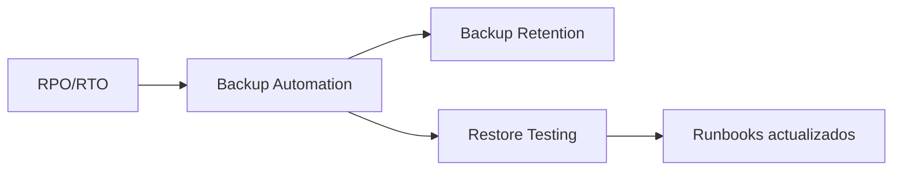

# Backup y Restore

## Contexto

Este estándar consolida **3 conceptos** de protección de datos. Forma la base sobre la que se construyen los [Procedimientos de DR](./dr-procedures.md) y asegura que cada backup sea íntegro, almacenado conforme a política y recuperable cuando se necesite.

**Conceptos incluidos:**

- **Backup Automation** → Respaldos automatizados y consistentes de datos críticos
- **Backup Retention** → Políticas de retención y lifecycle management de backups
- **Restore Testing** → Validación periódica de la capacidad de recuperación

---

## Stack Tecnológico

| Componente           | Tecnología         | Versión | Uso                                     |
| -------------------- | ------------------ | ------- | --------------------------------------- |
| **Object Storage**   | AWS S3             | Latest  | Almacenamiento de backups               |
| **Database**         | PostgreSQL         | 15+     | Base de datos principal                 |
| **Managed Database** | AWS RDS PostgreSQL | 15+     | Snapshots automatizados                 |
| **IaC**              | Terraform          | 1.7+    | Provisionamiento de recursos de backup  |
| **Automation**       | GitHub Actions     | Latest  | Orquestación de backups y restore tests |
| **Monitoring**       | Grafana Stack      | Latest  | Alertas de fallo en backups             |

---

## Relación entre Conceptos



**Flujo:**

1. **RPO/RTO** → Define frecuencia y objetivos de backup (ver [Procedimientos de DR](./dr-procedures.md))
2. **Automation** → Ejecuta backups según schedule, cifra y sube a S3
3. **Retention** → Lifecycle policies mueven y eliminan backups según antigüedad
4. **Restore Testing** → Valida mensualmente que los backups son restaurables

---

## Backup Automation

### ¿Qué es Backup Automation?

Proceso automatizado de creación de copias de seguridad de datos críticos (bases de datos, configuraciones, archivos) sin intervención manual, ejecutado en schedule definido.

**Propósito:** Garantizar disponibilidad de backups recientes para recovery, eliminando riesgo de olvido humano.

**Componentes clave:**

- **Scheduled Backups**: Ejecución automática diaria/horaria/continua
- **Consistent Snapshots**: Backups transaccionalmente consistentes
- **Encryption**: Cifrado at-rest y in-transit de backups
- **Verification**: Validación automática de integridad del backup

**Beneficios:**
✅ Backups consistentes y confiables
✅ Eliminación de errores humanos
✅ Cumplimiento de RPO definido
✅ Evidencia para auditorías

### Script PostgreSQL Backup

```bash
#!/bin/bash
# scripts/backup-postgres.sh

set -euo pipefail

BACKUP_DIR="/backups"
S3_BUCKET="s3://talma-backups-prod"
TIMESTAMP=$(date +%Y%m%d_%H%M%S)
DB_NAME="orders_db"
RETENTION_DAYS=30

# 1. Crear backup con pg_dump
echo "📦 Starting backup of ${DB_NAME}..."

BACKUP_FILE="${BACKUP_DIR}/${DB_NAME}_${TIMESTAMP}.sql.gz"

PGPASSWORD="${DB_PASSWORD}" pg_dump \
  --host="${DB_HOST}" \
  --port="${DB_PORT}" \
  --username="${DB_USER}" \
  --dbname="${DB_NAME}" \
  --format=custom \
  --compress=9 \
  --verbose \
  --file="${BACKUP_FILE}"

# 2. Calcular checksum
echo "🔐 Calculating checksum..."
sha256sum "${BACKUP_FILE}" > "${BACKUP_FILE}.sha256"

# 3. Subir a S3
echo "☁️ Uploading to S3..."
aws s3 cp "${BACKUP_FILE}" "${S3_BUCKET}/postgres/${DB_NAME}/" \
  --storage-class STANDARD_IA \
  --server-side-encryption AES256 \
  --metadata "db_name=${DB_NAME},backup_date=${TIMESTAMP},retention_days=${RETENTION_DAYS}"

aws s3 cp "${BACKUP_FILE}.sha256" "${S3_BUCKET}/postgres/${DB_NAME}/"

# 4. Limpiar backups locales antiguos
find "${BACKUP_DIR}" -name "${DB_NAME}_*.sql.gz" -mtime +${RETENTION_DAYS} -delete

# 5. Notificar éxito en CloudWatch
aws cloudwatch put-metric-data \
  --namespace "Talma/Backups" \
  --metric-name "BackupSuccess" \
  --value 1 \
  --dimensions Database="${DB_NAME}"

echo "✅ Backup completed successfully: ${BACKUP_FILE}"
```

### GitHub Action para Backup Diario

```yaml
# .github/workflows/backup-databases.yml
name: Automated Database Backup

on:
  schedule:
    - cron: "0 2 * * *" # Diario a las 2 AM UTC
  workflow_dispatch:

jobs:
  backup-production:
    runs-on: ubuntu-latest
    environment: production

    steps:
      - name: Checkout scripts
        uses: actions/checkout@v4

      - name: Configure AWS credentials
        uses: aws-actions/configure-aws-credentials@v4
        with:
          aws-access-key-id: ${{ secrets.AWS_ACCESS_KEY_ID }}
          aws-secret-access-key: ${{ secrets.AWS_SECRET_ACCESS_KEY }}
          aws-region: us-east-1

      - name: Install PostgreSQL client
        run: |
          sudo apt-get update
          sudo apt-get install -y postgresql-client-15

      - name: Execute backup script
        env:
          DB_HOST: ${{ secrets.DB_HOST }}
          DB_PORT: ${{ secrets.DB_PORT }}
          DB_USER: ${{ secrets.DB_USER }}
          DB_PASSWORD: ${{ secrets.DB_PASSWORD }}
        run: |
          chmod +x scripts/backup-postgres.sh
          ./scripts/backup-postgres.sh

      - name: Verify backup in S3
        run: |
          LATEST_BACKUP=$(aws s3 ls s3://talma-backups-prod/postgres/orders_db/ \
            --recursive | sort | tail -n 1 | awk '{print $4}')

          if [ -z "$LATEST_BACKUP" ]; then
            echo "❌ Backup verification failed - no backup found"
            exit 1
          fi

          echo "✅ Verified backup exists: ${LATEST_BACKUP}"

      - name: Notify on failure
        if: failure()
        uses: slackapi/slack-github-action@v1
        with:
          webhook-url: ${{ secrets.SLACK_WEBHOOK }}
          payload: |
            {
              "text": "🚨 Database backup FAILED",
              "blocks": [
                {
                  "type": "section",
                  "text": {
                    "type": "mrkdwn",
                    "text": "*Database Backup Failed*\n*Database:* orders_db\n*Workflow:* ${{ github.server_url }}/${{ github.repository }}/actions/runs/${{ github.run_id }}"
                  }
                }
              ]
            }
```

### AWS RDS Automatic Snapshots (Terraform)

```hcl
# terraform/modules/rds/main.tf
resource "aws_db_instance" "postgres" {
  identifier = "orders-db-prod"

  engine         = "postgres"
  engine_version = "15.4"
  instance_class = "db.t4g.large"

  allocated_storage     = 100
  max_allocated_storage = 500
  storage_encrypted     = true

  # Automated Backups
  backup_retention_period = 30  # Retener 30 días
  backup_window           = "02:00-03:00"  # UTC

  # Multi-AZ para alta disponibilidad
  multi_az = true

  final_snapshot_identifier = "orders-db-prod-final-${formatdate("YYYYMMDD-HHmmss", timestamp())}"

  copy_tags_to_snapshot = true

  maintenance_window = "sun:03:00-sun:04:00"

  tags = {
    Environment = "production"
    Backup      = "automated"
    RPO         = "1-hour"
  }
}

# Copiar snapshots a región secundaria (DR)
resource "aws_db_snapshot_copy" "dr_region" {
  provider = aws.us-west-2

  source_db_snapshot_identifier = aws_db_instance.postgres.latest_restorable_time
  target_db_snapshot_identifier = "orders-db-prod-dr-${formatdate("YYYYMMDD", timestamp())}"

  copy_tags = true
  kms_key_id = aws_kms_key.dr_region.arn
}
```

---

## Backup Retention

### ¿Qué es Backup Retention?

Políticas que definen cuánto tiempo mantener backups antes de eliminarlos, balanceando costo de almacenamiento con requisitos de recovery y compliance.

**Propósito:** Optimizar costos mientras se mantiene capacidad de recovery según necesidades de negocio y regulatorias.

**Componentes clave:**

- **Retention Tiers**: Diferentes periodos según antigüedad (hot/warm/cold)
- **Lifecycle Policies**: Transición automática entre storage classes
- **Legal Hold**: Retención indefinida para requisitos legales
- **Compliance Lock**: Inmutabilidad de backups críticos

**Beneficios:**
✅ Optimización de costos de almacenamiento
✅ Cumplimiento de regulaciones (GDPR, SOX, etc.)
✅ Balance entre recovery capability y costo
✅ Protección contra ransomware (immutable backups)

### Estrategia de Retención GFS (Grandfather-Father-Son)

```yaml
# Estrategia típica de retención:
Daily: 7 días   → S3 Standard
Weekly: 4 semanas → S3 Standard-IA
Monthly: 12 meses  → S3 Glacier Instant Retrieval
Yearly: 7 años    → S3 Glacier Deep Archive
```

### S3 Lifecycle Policy (Terraform)

```hcl
# terraform/modules/backup-bucket/main.tf

resource "aws_s3_bucket" "backups" {
  bucket = "talma-backups-prod"

  tags = {
    Purpose = "Database and application backups"
  }
}

# Habilitar versionado (protección contra eliminación accidental)
resource "aws_s3_bucket_versioning" "backups" {
  bucket = aws_s3_bucket.backups.id

  versioning_configuration {
    status = "Enabled"
  }
}

# Cifrado por defecto
resource "aws_s3_bucket_server_side_encryption_configuration" "backups" {
  bucket = aws_s3_bucket.backups.id

  rule {
    apply_server_side_encryption_by_default {
      sse_algorithm = "AES256"
    }
  }
}

# Object Lock para inmutabilidad (protección contra ransomware)
resource "aws_s3_bucket_object_lock_configuration" "backups" {
  bucket = aws_s3_bucket.backups.id

  rule {
    default_retention {
      mode = "GOVERNANCE"
      days = 30
    }
  }
}

# Lifecycle Policy - GFS Retention
resource "aws_s3_bucket_lifecycle_configuration" "backups" {
  bucket = aws_s3_bucket.backups.id

  rule {
    id     = "daily-backups-7days"
    status = "Enabled"

    filter {
      prefix = "postgres/"
    }

    expiration {
      days = 7
    }

    noncurrent_version_expiration {
      noncurrent_days = 7
    }
  }

  rule {
    id     = "weekly-backups-4weeks"
    status = "Enabled"

    filter {
      and {
        prefix = "postgres/"
        tags = {
          BackupType = "weekly"
        }
      }
    }

    transition {
      days          = 7
      storage_class = "STANDARD_IA"
    }

    expiration {
      days = 30
    }
  }

  rule {
    id     = "monthly-backups-12months"
    status = "Enabled"

    filter {
      and {
        prefix = "postgres/"
        tags = {
          BackupType = "monthly"
        }
      }
    }

    transition {
      days          = 30
      storage_class = "GLACIER_IR"
    }

    expiration {
      days = 365
    }
  }

  rule {
    id     = "yearly-backups-7years"
    status = "Enabled"

    filter {
      and {
        prefix = "postgres/"
        tags = {
          BackupType = "yearly"
        }
      }
    }

    transition {
      days          = 365
      storage_class = "DEEP_ARCHIVE"
    }

    expiration {
      days = 2555
    }
  }
}
```

### Script de Tagging GFS

```bash
#!/bin/bash
# scripts/tag-backup-gfs.sh

S3_BUCKET="s3://talma-backups-prod"
BACKUP_FILE=$1
DAY_OF_WEEK=$(date +%u)
DAY_OF_MONTH=$(date +%d)
DAY_OF_YEAR=$(date +%j)

if [ "$DAY_OF_YEAR" -eq "1" ]; then
  BACKUP_TYPE="yearly"
elif [ "$DAY_OF_MONTH" -eq "1" ]; then
  BACKUP_TYPE="monthly"
elif [ "$DAY_OF_WEEK" -eq "7" ]; then
  BACKUP_TYPE="weekly"
else
  BACKUP_TYPE="daily"
fi

echo "📋 Tagging backup as: ${BACKUP_TYPE}"

aws s3api put-object-tagging \
  --bucket "talma-backups-prod" \
  --key "postgres/${BACKUP_FILE}" \
  --tagging "TagSet=[{Key=BackupType,Value=${BACKUP_TYPE}}]"
```

---

## Restore Testing

### ¿Qué es Restore Testing?

Validación periódica de la capacidad de restaurar datos desde backups, asegurando que los backups son utilizables y los procedimientos funcionan.

**Propósito:** Detectar fallos en backups ANTES de un desastre real. "Un backup no testeado es un backup inexistente".

**Componentes clave:**

- **Automated Restore**: Restore automatizado mensual en ambiente aislado
- **Data Validation**: Verificación de integridad y completitud de datos
- **Performance Testing**: Validar que restore cumple RTO
- **Documentation**: Actualizar runbooks con learnings

**Beneficios:**
✅ Confianza en capacidad de recovery
✅ Detección temprana de backups corruptos
✅ Validación de RTO estimado
✅ Entrenamiento del equipo en procedimientos

### GitHub Action — Restore Test Mensual

```yaml
# .github/workflows/restore-test.yml
name: Monthly Backup Restore Test

on:
  schedule:
    - cron: "0 10 1 * *" # Primer día de cada mes a las 10 AM UTC
  workflow_dispatch:

jobs:
  restore-test:
    runs-on: ubuntu-latest
    environment: dr-test

    steps:
      - uses: actions/checkout@v4

      - name: Configure AWS credentials
        uses: aws-actions/configure-aws-credentials@v4
        with:
          aws-access-key-id: ${{ secrets.AWS_ACCESS_KEY_ID }}
          aws-secret-access-key: ${{ secrets.AWS_SECRET_ACCESS_KEY }}
          aws-region: us-east-1

      - name: Get latest backup from S3
        id: latest-backup
        run: |
          LATEST_BACKUP=$(aws s3 ls s3://talma-backups-prod/postgres/orders_db/ \
            --recursive | sort | tail -n 1 | awk '{print $4}')

          echo "backup_key=${LATEST_BACKUP}" >> $GITHUB_OUTPUT
          echo "📦 Latest backup: ${LATEST_BACKUP}"

      - name: Download and verify checksum
        run: |
          aws s3 cp "s3://talma-backups-prod/${{ steps.latest-backup.outputs.backup_key }}" \
            ./backup.sql.gz

          aws s3 cp "s3://talma-backups-prod/${{ steps.latest-backup.outputs.backup_key }}.sha256" \
            ./backup.sql.gz.sha256

          sha256sum -c backup.sql.gz.sha256 || exit 1

      - name: Start test RDS instance
        id: test-db
        run: |
          aws rds restore-db-instance-from-db-snapshot \
            --db-instance-identifier "restore-test-orders" \
            --db-snapshot-identifier "orders-db-prod-latest" \
            --db-instance-class "db.t4g.medium" \
            --publicly-accessible \
            --no-multi-az

          echo "⏳ Waiting for test database to be available..."
          aws rds wait db-instance-available \
            --db-instance-identifier "restore-test-orders"

          DB_ENDPOINT=$(aws rds describe-db-instances \
            --db-instance-identifier "restore-test-orders" \
            --query 'DBInstances[0].Endpoint.Address' \
            --output text)

          echo "db_endpoint=${DB_ENDPOINT}" >> $GITHUB_OUTPUT

      - name: Verify data integrity
        env:
          DB_HOST: ${{ steps.test-db.outputs.db_endpoint }}
          DB_PASSWORD: ${{ secrets.TEST_DB_PASSWORD }}
        run: |
          sudo apt-get install -y postgresql-client-15

          ORDER_COUNT=$(PGPASSWORD="${DB_PASSWORD}" psql \
            -h "${DB_HOST}" -U postgres -d orders_db \
            -t -c "SELECT COUNT(*) FROM orders;")

          echo "Orders count: ${ORDER_COUNT}"

          if [ "$ORDER_COUNT" -lt 1000 ]; then
            echo "❌ Data validation failed - insufficient data"
            exit 1
          fi

          echo "✅ Data integrity verified: ${ORDER_COUNT} orders"

      - name: Performance test
        env:
          DB_HOST: ${{ steps.test-db.outputs.db_endpoint }}
          DB_PASSWORD: ${{ secrets.TEST_DB_PASSWORD }}
        run: |
          START_TIME=$(date +%s)

          PGPASSWORD="${DB_PASSWORD}" psql \
            -h "${DB_HOST}" -U postgres -d orders_db \
            -c "SELECT o.*, c.name FROM orders o JOIN customers c ON o.customer_id = c.id WHERE o.created_at > NOW() - INTERVAL '30 days' LIMIT 1000;"

          DURATION=$(($(date +%s) - START_TIME))
          echo "Query duration: ${DURATION}s"

          aws cloudwatch put-metric-data \
            --namespace "Talma/DR" \
            --metric-name "RestoreTimeSeconds" \
            --value "${DURATION}" \
            --dimensions Service="orders-db"

      - name: Cleanup test instance
        if: always()
        run: |
          aws rds delete-db-instance \
            --db-instance-identifier "restore-test-orders" \
            --skip-final-snapshot || true

      - name: Report results
        if: always()
        run: |
          STATUS="${{ job.status == 'success' && '✅ PASSED' || '❌ FAILED' }}"

          gh issue create \
            --title "Restore Test Report - $(date +%Y-%m-%d)" \
            --body "**Status**: ${STATUS}\n**Backup**: ${{ steps.latest-backup.outputs.backup_key }}" \
            --label "restore-test" \
            --assignee "${{ github.actor }}"
        env:
          GH_TOKEN: ${{ secrets.GITHUB_TOKEN }}
```

---

## Monitoreo y Observabilidad

### Métricas de Backup

```promql
# Backup Success Rate (últimos 7 días)
sum(increase(backup_success_total[7d]))
/
sum(increase(backup_attempts_total[7d]))

# Time Since Last Successful Backup
time() - max(backup_last_success_timestamp_seconds)

# Backup Size Growth Rate
rate(backup_size_bytes[30d])

# Restore Test Success Rate
sum(increase(restore_test_success_total[90d]))
/
sum(increase(restore_test_attempts_total[90d]))
```

### CloudWatch Alarm — Backup Fallido

```hcl
resource "aws_cloudwatch_metric_alarm" "backup_failed" {
  alarm_name          = "backup-failed-orders-db"
  comparison_operator = "LessThanThreshold"
  evaluation_periods  = "1"
  metric_name         = "BackupSuccess"
  namespace           = "Talma/Backups"
  period              = "86400"  # 24 hours
  statistic           = "Sum"
  threshold           = "1"
  alarm_description   = "No successful backup in last 24 hours"
  treat_missing_data  = "breaching"

  alarm_actions = [var.sns_topic_critical_arn]

  dimensions = {
    Database = "orders_db"
  }
}
```

---

## Requisitos Técnicos

### MUST (Obligatorio)

**Backups:**

- **MUST** implementar backups automatizados para todas las bases de datos
- **MUST** cifrar todos los backups at-rest (AES-256)
- **MUST** almacenar backups en región diferente a producción
- **MUST** validar integridad de backups (checksums)

**Retención:**

- **MUST** retener backups mínimo 30 días para producción
- **MUST** implementar lifecycle policies para transición a storage classes económicas
- **MUST** habilitar versionado en S3 buckets de backups
- **MUST** proteger backups críticos con Object Lock (inmutabilidad)

**Testing:**

- **MUST** ejecutar restore test **al menos mensualmente**
- **MUST** medir y registrar RTO/RPO reales en cada test
- **MUST** actualizar runbooks post cada test con learnings

### SHOULD (Fuertemente recomendado)

- **SHOULD** implementar continuous backup (WAL archiving) para RPO < 1 hora
- **SHOULD** usar AWS RDS automated snapshots además de backups manuales
- **SHOULD** configurar multi-AZ RDS para alta disponibilidad
- **SHOULD** automatizar restore tests con GitHub Actions

### MAY (Opcional)

- **MAY** usar AWS Backup service para gestión centralizada
- **MAY** generar reportes automáticos de compliance de backups

### MUST NOT (Prohibido)

- **MUST NOT** depender de backups sin haberlos testeado en últimos 90 días
- **MUST NOT** almacenar backups exclusivamente en misma región que producción
- **MUST NOT** omitir cifrado de backups
- **MUST NOT** eliminar backups manualmente sin aprobación de arquitectura

---

## Referencias

- [AWS RDS Backup and Restore](https://docs.aws.amazon.com/AmazonRDS/latest/UserGuide/CHAP_CommonTasks.BackupRestore.html) — documentación oficial de backups en RDS
- [AWS S3 Lifecycle Policies](https://docs.aws.amazon.com/AmazonS3/latest/userguide/object-lifecycle-mgmt.html) — gestión de ciclo de vida de objetos S3
- [PostgreSQL Backup & Recovery](https://www.postgresql.org/docs/15/backup.html) — documentación oficial de backups PostgreSQL
- [3-2-1 Backup Rule](https://www.vmware.com/topics/glossary/content/3-2-1-backup-rule.html) — regla de backup 3-2-1
- [AWS S3 Object Lock](https://docs.aws.amazon.com/AmazonS3/latest/userguide/object-lock.html) — inmutabilidad de objetos S3
- [Procedimientos de DR](./dr-procedures.md) — drills, runbooks, RPO/RTO y failover multi-región
- [Alertas con Grafana](../observabilidad/alerting.md) — alertas de fallo en backups
