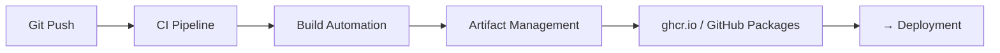

# CI/CD Pipelines y Build

## Contexto

Este estándar consolida **3 conceptos** del flujo de integración continua: desde el pipeline de CI hasta el empaquetado y almacenamiento de artefactos. Complementa [Deployment](./deployment.md) y asegura que todo artefacto sea reproducible, trazable y seguro antes de ser desplegado.

**Conceptos incluidos:**

- **CI/CD Pipelines** → Automatización del flujo desde commit hasta artefacto listo para deploy
- **Build Automation** → Compilación, empaquetado y generación de artefactos deterministas
- **Artifact Management** → Almacenamiento, versionado y distribución de artefactos desplegables

:::note Implementación gestionada por Plataforma
Este estándar define los **requisitos que los pipelines de los servicios deben cumplir**. Los templates base de CI/CD, la gestión del registry de artefactos (GitHub Packages/ECR) y la infraestructura de pipelines son responsabilidad del equipo de **Plataforma**. Consultar en **#platform-support**.
:::

---

## Stack Tecnológico

| Componente             | Tecnología                          | Versión | Uso                               |
| ---------------------- | ----------------------------------- | ------- | --------------------------------- |
| **CI/CD**              | GitHub Actions                      | Latest  | Orquestación de pipelines         |
| **Container Registry** | GitHub Container Registry (ghcr.io) | Latest  | Almacenamiento de imágenes Docker |
| **Package Registry**   | GitHub Packages                     | Latest  | Almacenamiento de paquetes NuGet  |
| **Container Platform** | Docker                              | 24.0+   | Construcción y empaquetado        |
| **Runtime**            | .NET                                | 8.0+    | Framework de aplicación           |

---

## Flujo de Integración Continua



**Etapas:**

1. **Push** → Trigger del pipeline CI
2. **CI** → Compilación, tests, security scanning
3. **Build** → Dockerfile multi-stage, versionado semántico
4. **Publish** → Imagen firmada a ghcr.io / paquete NuGet a GitHub Packages

---

## CI/CD Pipelines

### ¿Qué son los CI/CD Pipelines?

Automatización del flujo completo desde código fuente hasta artefacto desplegable, incluyendo compilación, testing y análisis de seguridad.

**Propósito:** Reducir time-to-market, eliminar errores manuales, asegurar calidad consistente.

**Componentes clave:**

- **Continuous Integration (CI)**: Build, test, análisis al pushear código
- **Continuous Deployment (CD)**: Preparación y publicación de artefactos tras pasar CI
- **Gates**: Validaciones obligatorias antes de avanzar (tests, coverage, security scans)
- **Environments**: Dev → Staging → Production con validaciones progresivas

**Beneficios:**
✅ Feedback rápido sobre calidad del código
✅ Artefactos reproducibles y consistentes
✅ Reducción de riesgo mediante validaciones automatizadas
✅ Trazabilidad completa del flujo

### Pipeline GitHub Actions

```yaml
# .github/workflows/deploy.yml
name: CI/CD Pipeline

on:
  push:
    branches: [main, develop]
  pull_request:
    branches: [main]

env:
  DOTNET_VERSION: "8.0"
  REGISTRY: ghcr.io
  IMAGE_NAME: ${{ github.repository }}

jobs:
  # Job 1: Build y Test
  build:
    runs-on: ubuntu-latest
    steps:
      - name: Checkout
        uses: actions/checkout@v4

      - name: Setup .NET
        uses: actions/setup-dotnet@v4
        with:
          dotnet-version: ${{ env.DOTNET_VERSION }}

      - name: Restore dependencies
        run: dotnet restore

      - name: Build
        run: dotnet build --no-restore --configuration Release

      - name: Test
        run: dotnet test --no-build --verbosity normal --collect:"XPlat Code Coverage"

      - name: Upload coverage
        uses: codecov/codecov-action@v3
        with:
          files: "**/coverage.cobertura.xml"

  # Job 2: Security Scanning
  security:
    runs-on: ubuntu-latest
    needs: build
    steps:
      - name: Checkout
        uses: actions/checkout@v4

      - name: Run Trivy vulnerability scanner
        uses: aquasecurity/trivy-action@master
        with:
          scan-type: "fs"
          scan-ref: "."
          format: "sarif"
          output: "trivy-results.sarif"

      - name: Upload Trivy results to GitHub Security
        uses: github/codeql-action/upload-sarif@v2
        with:
          sarif_file: "trivy-results.sarif"

  # Job 3: Build y Push Docker Image
  publish:
    runs-on: ubuntu-latest
    needs: [build, security]
    if: github.event_name == 'push' && (github.ref == 'refs/heads/main' || github.ref == 'refs/heads/develop')
    permissions:
      contents: read
      packages: write
    outputs:
      image-tag: ${{ steps.meta.outputs.tags }}
      image-digest: ${{ steps.build.outputs.digest }}
    steps:
      - name: Checkout
        uses: actions/checkout@v4

      - name: Log in to Container Registry
        uses: docker/login-action@v3
        with:
          registry: ${{ env.REGISTRY }}
          username: ${{ github.actor }}
          password: ${{ secrets.GITHUB_TOKEN }}

      - name: Extract metadata
        id: meta
        uses: docker/metadata-action@v5
        with:
          images: ${{ env.REGISTRY }}/${{ env.IMAGE_NAME }}
          tags: |
            type=ref,event=branch
            type=sha,prefix={{branch}}-
            type=semver,pattern={{version}}

      - name: Build and push
        id: build
        uses: docker/build-push-action@v5
        with:
          context: .
          push: true
          tags: ${{ steps.meta.outputs.tags }}
          labels: ${{ steps.meta.outputs.labels }}
          build-args: |
            BUILD_VERSION=${{ github.sha }}
            BUILD_DATE=${{ github.event.head_commit.timestamp }}
```

:::note Pasos de deploy
Los jobs de `deploy-staging` y `deploy-production` (blue-green con Terraform + ECS) están documentados en [Deployment](./deployment.md#implementación-integrada).
:::

---

## Build Automation

### ¿Qué es Build Automation?

Proceso automatizado de compilación, empaquetado y preparación de artefactos desplegables con resultados reproducibles y consistentes.

**Propósito:** Garantizar que cualquier commit produzca el mismo artefacto sin importar dónde o cuándo se compile.

**Componentes clave:**

- **Compilación determinista**: Mismos inputs → mismo output
- **Dependency resolution**: Restauración de dependencias versionadas
- **Asset compilation**: CSS, JS, imágenes optimizadas
- **Artifact packaging**: Docker images, NuGet packages, binaries

**Beneficios:**
✅ Builds reproducibles
✅ Eliminación de "works on my machine"
✅ Cache de dependencias para rapidez
✅ Versionado automático

### Dockerfile Multi-Stage

```dockerfile
# Dockerfile
# Stage 1: Build
FROM mcr.microsoft.com/dotnet/sdk:8.0 AS build
WORKDIR /src

# Copy csproj and restore dependencies (cached layer)
COPY ["src/OrderService.Api/OrderService.Api.csproj", "src/OrderService.Api/"]
COPY ["src/OrderService.Application/OrderService.Application.csproj", "src/OrderService.Application/"]
COPY ["src/OrderService.Domain/OrderService.Domain.csproj", "src/OrderService.Domain/"]
COPY ["src/OrderService.Infrastructure/OrderService.Infrastructure.csproj", "src/OrderService.Infrastructure/"]

RUN dotnet restore "src/OrderService.Api/OrderService.Api.csproj"

# Copy source code and build
COPY . .
WORKDIR "/src/src/OrderService.Api"

ARG BUILD_VERSION=1.0.0
ARG BUILD_DATE
RUN dotnet build "OrderService.Api.csproj" \
    -c Release \
    -o /app/build \
    /p:Version=${BUILD_VERSION} \
    /p:InformationalVersion=${BUILD_VERSION}+${BUILD_DATE}

# Stage 2: Publish
FROM build AS publish
RUN dotnet publish "OrderService.Api.csproj" \
    -c Release \
    -o /app/publish \
    /p:UseAppHost=false \
    --no-restore

# Stage 3: Runtime
FROM mcr.microsoft.com/dotnet/aspnet:8.0 AS final
WORKDIR /app

# Non-root user
RUN adduser --disabled-password --gecos '' appuser
USER appuser

COPY --from=publish /app/publish .

# Health check
HEALTHCHECK --interval=30s --timeout=3s --start-period=5s --retries=3 \
  CMD curl -f http://localhost:8080/health || exit 1

EXPOSE 8080
ENTRYPOINT ["dotnet", "OrderService.Api.dll"]
```

### Build Script con Cache NuGet

```yaml
# .github/workflows/build.yml - Job específico
build-and-package:
  runs-on: ubuntu-latest
  steps:
    - uses: actions/checkout@v4

    - name: Setup .NET
      uses: actions/setup-dotnet@v4
      with:
        dotnet-version: "8.0"

    - name: Cache NuGet packages
      uses: actions/cache@v3
      with:
        path: ~/.nuget/packages
        key: ${{ runner.os }}-nuget-${{ hashFiles('**/*.csproj') }}
        restore-keys: |
          ${{ runner.os }}-nuget-

    - name: Restore
      run: dotnet restore

    - name: Build
      run: |
        dotnet build \
          --no-restore \
          --configuration Release \
          /p:Version=1.0.${{ github.run_number }} \
          /p:ContinuousIntegrationBuild=true

    - name: Publish NuGet Package (si es librería)
      if: startsWith(github.ref, 'refs/tags/v')
      run: |
        dotnet pack \
          --configuration Release \
          --output ./artifacts \
          /p:PackageVersion=${GITHUB_REF#refs/tags/v}

        dotnet nuget push ./artifacts/*.nupkg \
          --source https://nuget.pkg.github.com/${{ github.repository_owner }}/index.json \
          --api-key ${{ secrets.GITHUB_TOKEN }}
```

---

## Artifact Management

### ¿Qué es Artifact Management?

Gestión centralizada, versionada y segura de artefactos desplegables (imágenes Docker, paquetes NuGet, binarios) con trazabilidad completa.

**Propósito:** Almacenar, versionar y distribuir artefactos de forma confiable y auditable.

**Componentes clave:**

- **Container Registry**: Almacén de imágenes Docker (ghcr.io)
- **Package Registry**: Almacén de paquetes NuGet (GitHub Packages)
- **Versioning Strategy**: Semantic versioning + Git SHA
- **Retention Policies**: Limpieza automática de artefactos antiguos
- **Vulnerability Scanning**: Análisis de seguridad de artefactos

**Beneficios:**
✅ Registro completo de qué se desplegó
✅ Capacidad de rollback a cualquier versión
✅ Auditoría de artefactos
✅ Distribución eficiente

### Push a GitHub Container Registry

```yaml
# .github/workflows/publish-image.yml
name: Publish Container Image

on:
  push:
    branches: [main]
    tags: ["v*"]

env:
  REGISTRY: ghcr.io
  IMAGE_NAME: ${{ github.repository }}

jobs:
  build-and-push:
    runs-on: ubuntu-latest
    permissions:
      contents: read
      packages: write
      id-token: write # Para signing con cosign

    steps:
      - uses: actions/checkout@v4

      - name: Log in to GitHub Container Registry
        uses: docker/login-action@v3
        with:
          registry: ${{ env.REGISTRY }}
          username: ${{ github.actor }}
          password: ${{ secrets.GITHUB_TOKEN }}

      - name: Extract metadata (tags, labels)
        id: meta
        uses: docker/metadata-action@v5
        with:
          images: ${{ env.REGISTRY }}/${{ env.IMAGE_NAME }}
          tags: |
            # Branch name
            type=ref,event=branch
            # Git SHA (short)
            type=sha,prefix={{branch}}-
            # Semantic version from Git tag
            type=semver,pattern={{version}}
            type=semver,pattern={{major}}.{{minor}}
            # Latest tag for main branch
            type=raw,value=latest,enable={{is_default_branch}}

      - name: Build and push
        id: build
        uses: docker/build-push-action@v5
        with:
          context: .
          push: true
          tags: ${{ steps.meta.outputs.tags }}
          labels: ${{ steps.meta.outputs.labels }}
          build-args: |
            BUILD_VERSION=${{ steps.meta.outputs.version }}
            GIT_SHA=${{ github.sha }}
            BUILD_NUMBER=${{ github.run_number }}
            BUILD_DATE=${{ github.event.head_commit.timestamp }}

      - name: Sign image with Cosign
        run: |
          cosign sign --yes \
            ${{ env.REGISTRY }}/${{ env.IMAGE_NAME }}@${{ steps.build.outputs.digest }}

      - name: Generate SBOM
        uses: anchore/sbom-action@v0
        with:
          image: ${{ env.REGISTRY }}/${{ env.IMAGE_NAME }}@${{ steps.build.outputs.digest }}
          format: spdx-json
          output-file: sbom.spdx.json

      - name: Attach SBOM to image
        run: |
          cosign attach sbom --sbom sbom.spdx.json \
            ${{ env.REGISTRY }}/${{ env.IMAGE_NAME }}@${{ steps.build.outputs.digest }}
```

### Publish NuGet Package

```yaml
# .github/workflows/publish-package.yml (para librerías)
name: Publish NuGet Package

on:
  push:
    tags: ["v*"]

jobs:
  publish:
    runs-on: ubuntu-latest
    permissions:
      packages: write
      contents: read

    steps:
      - uses: actions/checkout@v4

      - uses: actions/setup-dotnet@v4
        with:
          dotnet-version: "8.0"

      - name: Extract version from tag
        id: version
        run: echo "VERSION=${GITHUB_REF#refs/tags/v}" >> $GITHUB_OUTPUT

      - name: Restore dependencies
        run: dotnet restore

      - name: Build
        run: dotnet build --configuration Release --no-restore

      - name: Pack
        run: |
          dotnet pack \
            --configuration Release \
            --no-build \
            --output ./artifacts \
            -p:PackageVersion=${{ steps.version.outputs.VERSION }} \
            -p:RepositoryUrl=${{ github.server_url }}/${{ github.repository }} \
            -p:RepositoryCommit=${{ github.sha }}

      - name: Push to GitHub Packages
        run: |
          dotnet nuget push "./artifacts/*.nupkg" \
            --source "https://nuget.pkg.github.com/${{ github.repository_owner }}/index.json" \
            --api-key ${{ secrets.GITHUB_TOKEN }} \
            --skip-duplicate
```

### Cleanup de Artefactos Antiguos

```yaml
# .github/workflows/cleanup-artifacts.yml
name: Cleanup Old Artifacts

on:
  schedule:
    - cron: "0 2 * * 0" # Weekly on Sunday at 2 AM
  workflow_dispatch:

jobs:
  cleanup-packages:
    runs-on: ubuntu-latest
    steps:
      - name: Delete old container images
        uses: actions/delete-package-versions@v5
        with:
          package-name: "order-service"
          package-type: "container"
          min-versions-to-keep: 10
          delete-only-pre-release-versions: true

      - name: Delete old NuGet packages
        uses: actions/delete-package-versions@v5
        with:
          package-name: "OrderService.Contracts"
          package-type: "nuget"
          min-versions-to-keep: 5
          ignore-versions: '^(0|[1-9]\\d*)\\.(0|[1-9]\\d*)\\.(0|[1-9]\\d*)$' # Keep stable releases
```

---

## Requisitos Técnicos

### MUST (Obligatorio)

**Pipeline:**

- **MUST** implementar pipeline CI/CD automatizado para todos los servicios
- **MUST** requerir éxito de todos los tests antes de publicar artefacto
- **MUST** versionar todos los artefactos con semantic versioning + Git SHA
- **MUST** almacenar artefactos en registry privado autenticado

**Seguridad en Build:**

- **MUST** ejecutar security scanning (Trivy, Checkov) en cada build
- **MUST** bloquear publicación si se detectan vulnerabilidades HIGH o CRITICAL
- **MUST** firmar imágenes Docker con Cosign

### SHOULD (Fuertemente recomendado)

**Build:**

- **SHOULD** usar multi-stage Dockerfiles para optimizar tamaño de imágenes
- **SHOULD** cachear dependencias de .NET entre builds
- **SHOULD** generar y adjuntar SBOM (Software Bill of Materials) a imágenes

**Artifact Management:**

- **SHOULD** implementar retention policy para artefactos antiguos (> 30 días)
- **SHOULD** etiquetar imágenes con múltiples tags (branch, SHA, semantic version)
- **SHOULD** escanear artefactos almacenados periódicamente (weekly)

### MAY (Opcional)

- **MAY** generar release notes automáticamente desde commits/PRs
- **MAY** usar matriz de ambientes para testing (dev, qa, staging, prod)

### MUST NOT (Prohibido)

- **MUST NOT** almacenar credenciales en código o Dockerfiles
- **MUST NOT** omitir security scanning en pipeline
- **MUST NOT** usar `latest` tag en producción (siempre SHA específico)

---

## Referencias

- [GitHub Actions](https://docs.github.com/en/actions) — documentación oficial de pipelines CI/CD
- [Docker Multi-Stage Builds](https://docs.docker.com/build/building/multi-stage/) — builds optimizados multi-stage
- [GitHub Container Registry](https://docs.github.com/en/packages/working-with-a-github-packages-registry/working-with-the-container-registry) — registro de imágenes Docker
- [Semantic Versioning](https://semver.org/) — especificación de versionado semántico
- [Cosign Image Signing](https://docs.sigstore.dev/cosign/overview/) — firma de imágenes con Sigstore
- [Deployment](./deployment.md) — estrategias de deployment y trazabilidad
- [Structured Logging](../observabilidad/structured-logging.md) — logs estructurados en builds
- [Infrastructure as Code — Implementación](../infraestructura/iac-implementation.md) — provisionamiento de infraestructura
