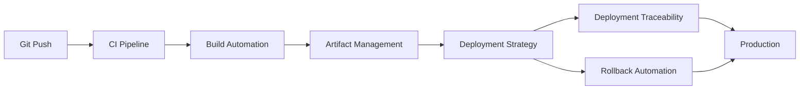

# CI/CD y Deployment

## Contexto

Este estándar consolida **6 conceptos relacionados** con la entrega continua y deployment automatizado de aplicaciones. Complementa el lineamiento de operabilidad asegurando deployments confiables, trazables y reversibles.

**Conceptos incluidos:**

- **CI/CD Pipelines** → Automatización del flujo completo desde commit hasta producción
- **Build Automation** → Compilación, empaquetado y generación de artefactos automatizada
- **Deployment Strategies** → Patrones para minimizar riesgo y downtime (blue-green, canary, rolling)
- **Deployment Traceability** → Vínculo entre deployments, commits, PRs y issues
- **Rollback Automation** → Capacidad de revertir deployments fallidos automáticamente
- **Artifact Management** → Gestión, versionado y almacenamiento de artefactos desplegables

---

## Stack Tecnológico

| Componente             | Tecnología                          | Versión | Uso                                    |
| ---------------------- | ----------------------------------- | ------- | -------------------------------------- |
| **CI/CD**              | GitHub Actions                      | Latest  | Orquestación de pipelines              |
| **Container Registry** | GitHub Container Registry (ghcr.io) | Latest  | Almacenamiento de imágenes Docker      |
| **Package Registry**   | GitHub Packages                     | Latest  | Almacenamiento de paquetes NuGet       |
| **Container Platform** | Docker                              | 24.0+   | Construcción y empaquetado             |
| **Orchestration**      | AWS ECS Fargate                     | Latest  | Deployment y ejecución de contenedores |
| **IaC**                | Terraform                           | 1.7+    | Provisionamiento de infraestructura    |
| **Runtime**            | .NET                                | 8.0+    | Framework de aplicación                |

---

## Conceptos Fundamentales

Este estándar cubre **6 prácticas fundamentales** para operabilizar aplicaciones en producción:

### Índice de Conceptos

1. **CI/CD Pipelines**: Automatización del flujo completo desde commit hasta producción
2. **Build Automation**: Compilación, testing y empaquetado reproducible
3. **Deployment Strategies**: Patrones para deployments sin downtime
4. **Deployment Traceability**: Auditoría completa de qué se desplegó, cuándo y por quién
5. **Rollback Automation**: Reversión rápida ante fallos
6. **Artifact Management**: Registro centralizado de artefactos versionados

### Relación entre Conceptos



**Flujo típico:**

1. **Push** → Trigger de pipeline CI/CD
2. **Build** → Compilación, test, empaquetado
3. **Publish** → Artefactos a registry (ghcr.io, GitHub Packages)
4. **Deploy** → Estrategia elegida (blue-green, canary, rolling)
5. **Trace** → Registro de deployment (commit SHA, PR, issue)
6. **Monitor** → Health checks, métricas, logs
7. **Rollback** → Si falla, reversión automática

---

## 1. CI/CD Pipelines

### ¿Qué son los CI/CD Pipelines?

Automatización del flujo completo desde código fuente hasta ambiente productivo, incluyendo compilación, testing, análisis de seguridad, y deployment.

**Propósito:** Reducir time-to-market, eliminar errores manuales, asegurar calidad consistente.

**Componentes clave:**

- **Continuous Integration (CI)**: Build, test, análisis al pushear código
- **Continuous Deployment (CD)**: Deployment automático a ambientes tras pasar CI
- **Gates**: Validaciones obligatorias antes de avanzar (tests, coverage, security scans)
- **Environments**: Dev → Staging → Production con validaciones progresivas

**Beneficios:**
✅ Feedback rápido sobre calidad del código
✅ Deployment consistente y reproducible
✅ Reducción de riesgo mediante validaciones automatizadas
✅ Trazabilidad completa del flujo

### Ejemplo: Pipeline GitHub Actions

```yaml
# .github/workflows/deploy.yml
name: CI/CD Pipeline

on:
  push:
    branches: [main, develop]
  pull_request:
    branches: [main]

env:
  DOTNET_VERSION: "8.0"
  REGISTRY: ghcr.io
  IMAGE_NAME: ${{ github.repository }}

jobs:
  # Job 1: Build y Test
  build:
    runs-on: ubuntu-latest
    steps:
      - name: Checkout
        uses: actions/checkout@v4

      - name: Setup .NET
        uses: actions/setup-dotnet@v4
        with:
          dotnet-version: ${{ env.DOTNET_VERSION }}

      - name: Restore dependencies
        run: dotnet restore

      - name: Build
        run: dotnet build --no-restore --configuration Release

      - name: Test
        run: dotnet test --no-build --verbosity normal --collect:"XPlat Code Coverage"

      - name: Upload coverage
        uses: codecov/codecov-action@v3
        with:
          files: "**/coverage.cobertura.xml"

  # Job 2: Security Scanning
  security:
    runs-on: ubuntu-latest
    needs: build
    steps:
      - name: Checkout
        uses: actions/checkout@v4

      - name: Run Trivy vulnerability scanner
        uses: aquasecurity/trivy-action@master
        with:
          scan-type: "fs"
          scan-ref: "."
          format: "sarif"
          output: "trivy-results.sarif"

      - name: Upload Trivy results to GitHub Security
        uses: github/codeql-action/upload-sarif@v2
        with:
          sarif_file: "trivy-results.sarif"

  # Job 3: Build y Push Docker Image
  publish:
    runs-on: ubuntu-latest
    needs: [build, security]
    if: github.event_name == 'push' && (github.ref == 'refs/heads/main' || github.ref == 'refs/heads/develop')
    permissions:
      contents: read
      packages: write
    outputs:
      image-tag: ${{ steps.meta.outputs.tags }}
      image-digest: ${{ steps.build.outputs.digest }}
    steps:
      - name: Checkout
        uses: actions/checkout@v4

      - name: Log in to Container Registry
        uses: docker/login-action@v3
        with:
          registry: ${{ env.REGISTRY }}
          username: ${{ github.actor }}
          password: ${{ secrets.GITHUB_TOKEN }}

      - name: Extract metadata
        id: meta
        uses: docker/metadata-action@v5
        with:
          images: ${{ env.REGISTRY }}/${{ env.IMAGE_NAME }}
          tags: |
            type=ref,event=branch
            type=sha,prefix={{branch}}-
            type=semver,pattern={{version}}

      - name: Build and push
        id: build
        uses: docker/build-push-action@v5
        with:
          context: .
          push: true
          tags: ${{ steps.meta.outputs.tags }}
          labels: ${{ steps.meta.outputs.labels }}
          build-args: |
            BUILD_VERSION=${{ github.sha }}
            BUILD_DATE=${{ github.event.head_commit.timestamp }}

  # Job 4: Deploy to Staging
  deploy-staging:
    runs-on: ubuntu-latest
    needs: publish
    if: github.ref == 'refs/heads/develop'
    environment:
      name: staging
      url: https://staging.example.com
    steps:
      - name: Checkout IaC
        uses: actions/checkout@v4

      - name: Setup Terraform
        uses: hashicorp/setup-terraform@v3
        with:
          terraform_version: 1.7.0

      - name: Configure AWS credentials
        uses: aws-actions/configure-aws-credentials@v4
        with:
          aws-access-key-id: ${{ secrets.AWS_ACCESS_KEY_ID }}
          aws-secret-access-key: ${{ secrets.AWS_SECRET_ACCESS_KEY }}
          aws-region: us-east-1

      - name: Deploy to ECS
        run: |
          cd terraform/environments/staging
          terraform init
          terraform apply -auto-approve \
            -var="image_tag=${{ needs.publish.outputs.image-tag }}" \
            -var="image_digest=${{ needs.publish.outputs.image-digest }}"

  # Job 5: Deploy to Production (manual approval)
  deploy-production:
    runs-on: ubuntu-latest
    needs: publish
    if: github.ref == 'refs/heads/main'
    environment:
      name: production
      url: https://api.example.com
    steps:
      - name: Checkout IaC
        uses: actions/checkout@v4

      - name: Setup Terraform
        uses: hashicorp/setup-terraform@v3

      - name: Configure AWS credentials
        uses: aws-actions/configure-aws-credentials@v4
        with:
          aws-access-key-id: ${{ secrets.AWS_ACCESS_KEY_ID_PROD }}
          aws-secret-access-key: ${{ secrets.AWS_SECRET_ACCESS_KEY_PROD }}
          aws-region: us-east-1

      - name: Deploy to ECS with Blue-Green
        run: |
          cd terraform/environments/production
          terraform init
          terraform apply -auto-approve \
            -var="image_tag=${{ needs.publish.outputs.image-tag }}" \
            -var="deployment_strategy=blue-green"
```

---

## 2. Build Automation

### ¿Qué es Build Automation?

Proceso automatizado de compilación, empaquetado y preparación de artefactos desplegables con resultados reproducibles y consistentes.

**Propósito:** Garantizar que cualquier commit produzca el mismo artefacto sin importar dónde o cuándo se compile.

**Componentes clave:**

- **Compilación determinista**: Mismos inputs → mismo output
- **Dependency resolution**: Restauración de dependencias versionadas
- **Asset compilation**: CSS, JS, imágenes optimizadas
- **Artifact packaging**: Docker images, NuGet packages, binaries

**Beneficios:**
✅ Builds reproducibles
✅ Eliminación de "works on my machine"
✅ Cache de dependencias para rapidez
✅ Versionado automático

### Dockerfile Multi-Stage

```dockerfile
# Dockerfile
# Stage 1: Build
FROM mcr.microsoft.com/dotnet/sdk:8.0 AS build
WORKDIR /src

# Copy csproj and restore dependencies (cached layer)
COPY ["src/OrderService.Api/OrderService.Api.csproj", "src/OrderService.Api/"]
COPY ["src/OrderService.Application/OrderService.Application.csproj", "src/OrderService.Application/"]
COPY ["src/OrderService.Domain/OrderService.Domain.csproj", "src/OrderService.Domain/"]
COPY ["src/OrderService.Infrastructure/OrderService.Infrastructure.csproj", "src/OrderService.Infrastructure/"]

RUN dotnet restore "src/OrderService.Api/OrderService.Api.csproj"

# Copy source code and build
COPY . .
WORKDIR "/src/src/OrderService.Api"

ARG BUILD_VERSION=1.0.0
ARG BUILD_DATE
RUN dotnet build "OrderService.Api.csproj" \
    -c Release \
    -o /app/build \
    /p:Version=${BUILD_VERSION} \
    /p:InformationalVersion=${BUILD_VERSION}+${BUILD_DATE}

# Stage 2: Publish
FROM build AS publish
RUN dotnet publish "OrderService.Api.csproj" \
    -c Release \
    -o /app/publish \
    /p:UseAppHost=false \
    --no-restore

# Stage 3: Runtime
FROM mcr.microsoft.com/dotnet/aspnet:8.0 AS final
WORKDIR /app

# Non-root user
RUN adduser --disabled-password --gecos '' appuser
USER appuser

COPY --from=publish /app/publish .

# Health check
HEALTHCHECK --interval=30s --timeout=3s --start-period=5s --retries=3 \
  CMD curl -f http://localhost:8080/health || exit 1

EXPOSE 8080
ENTRYPOINT ["dotnet", "OrderService.Api.dll"]
```

### Build Script

```yaml
# .github/workflows/build.yml - Job específico
build-and-package:
  runs-on: ubuntu-latest
  steps:
    - uses: actions/checkout@v4

    - name: Setup .NET
      uses: actions/setup-dotnet@v4
      with:
        dotnet-version: "8.0"

    - name: Cache NuGet packages
      uses: actions/cache@v3
      with:
        path: ~/.nuget/packages
        key: ${{ runner.os }}-nuget-${{ hashFiles('**/*.csproj') }}
        restore-keys: |
          ${{ runner.os }}-nuget-

    - name: Restore
      run: dotnet restore

    - name: Build
      run: |
        dotnet build \
          --no-restore \
          --configuration Release \
          /p:Version=1.0.${{ github.run_number }} \
          /p:ContinuousIntegrationBuild=true

    - name: Publish NuGet Package (si es librería)
      if: startsWith(github.ref, 'refs/tags/v')
      run: |
        dotnet pack \
          --configuration Release \
          --output ./artifacts \
          /p:PackageVersion=${GITHUB_REF#refs/tags/v}

        dotnet nuget push ./artifacts/*.nupkg \
          --source https://nuget.pkg.github.com/${{ github.repository_owner }}/index.json \
          --api-key ${{ secrets.GITHUB_TOKEN }}
```

---

## 3. Deployment Strategies

### ¿Qué son las Deployment Strategies?

Patrones para desplegar nuevas versiones minimizando downtime y riesgo mediante técnicas como blue-green, canary, o rolling updates.

**Propósito:** Permitir deployments seguros con capacidad de validación antes de afectar todo el tráfico.

**Componentes clave:**

- **Blue-Green**: Dos ambientes completos (blue activo, green nuevo), switch instantáneo
- **Canary**: Deployment gradual empezando con % pequeño de tráfico
- **Rolling**: Reemplazo progresivo de instancias una por una
- **Traffic Splitting**: Control fino del % de tráfico a cada versión

**Cuándo usar cada una:**

- **Blue-Green**: Cambios grandes, necesidad de rollback instantáneo, suficientes recursos
- **Canary**: Validación progresiva, cambios críticos necesitan monitoreo
- **Rolling**: Recursos limitados, cambios menores, tolera instancias mixtas

### Blue-Green con Terraform + ECS

```hcl
# terraform/modules/ecs-service-blue-green/main.tf

resource "aws_ecs_service" "app" {
  name            = "${var.service_name}"
  cluster         = var.cluster_id
  task_definition = aws_ecs_task_definition.app.arn
  desired_count   = var.desired_count

  deployment_controller {
    type = "CODE_DEPLOY"  # Habilita blue-green via CodeDeploy
  }

  load_balancer {
    target_group_arn = aws_lb_target_group.blue.arn
    container_name   = var.container_name
    container_port   = var.container_port
  }

  network_configuration {
    subnets          = var.private_subnet_ids
    security_groups  = [aws_security_group.app.id]
    assign_public_ip = false
  }

  lifecycle {
    ignore_changes = [
      task_definition,  # CodeDeploy maneja task definitions
      load_balancer,    # CodeDeploy maneja target groups
    ]
  }
}

# Target Group BLUE (producción actual)
resource "aws_lb_target_group" "blue" {
  name                 = "${var.service_name}-blue"
  port                 = var.container_port
  protocol             = "HTTP"
  vpc_id               = var.vpc_id
  target_type          = "ip"
  deregistration_delay = 30

  health_check {
    enabled             = true
    path                = "/health"
    interval            = 30
    timeout             = 5
    healthy_threshold   = 2
    unhealthy_threshold = 3
    matcher             = "200"
  }
}

# Target Group GREEN (nueva versión)
resource "aws_lb_target_group" "green" {
  name                 = "${var.service_name}-green"
  port                 = var.container_port
  protocol             = "HTTP"
  vpc_id               = var.vpc_id
  target_type          = "ip"
  deregistration_delay = 30

  health_check {
    enabled             = true
    path                = "/health"
    interval            = 30
    timeout             = 5
    healthy_threshold   = 2
    unhealthy_threshold = 3
    matcher             = "200"
  }
}

# Listener Rule - Production Traffic
resource "aws_lb_listener_rule" "production" {
  listener_arn = var.listener_arn
  priority     = var.priority

  action {
    type             = "forward"
    target_group_arn = aws_lb_target_group.blue.arn
  }

  condition {
    path_pattern {
      values = ["/api/orders/*"]
    }
  }
}

# CodeDeploy Application
resource "aws_codedeploy_app" "app" {
  compute_platform = "ECS"
  name             = var.service_name
}

# CodeDeploy Deployment Group
resource "aws_codedeploy_deployment_group" "app" {
  app_name               = aws_codedeploy_app.app.name
  deployment_group_name  = "${var.service_name}-dg"
  service_role_arn       = var.codedeploy_role_arn
  deployment_config_name = "CodeDeployDefault.ECSAllAtOnce"

  blue_green_deployment_config {
    terminate_blue_instances_on_deployment_success {
      action                           = "TERMINATE"
      termination_wait_time_in_minutes = 5
    }

    deployment_ready_option {
      action_on_timeout = "CONTINUE_DEPLOYMENT"
      wait_time_in_minutes = 0  # Cambiar a > 0 para aprobación manual
    }
  }

  ecs_service {
    cluster_name = var.cluster_name
    service_name = aws_ecs_service.app.name
  }

  load_balancer_info {
    target_group_pair_info {
      prod_traffic_route {
        listener_arns = [var.listener_arn]
      }

      target_group {
        name = aws_lb_target_group.blue.name
      }

      target_group {
        name = aws_lb_target_group.green.name
      }
    }
  }

  auto_rollback_configuration {
    enabled = true
    events  = ["DEPLOYMENT_FAILURE", "DEPLOYMENT_STOP_ON_ALARM"]
  }

  alarm_configuration {
    enabled = true
    alarms  = var.cloudwatch_alarm_names  # Ej: ["high-error-rate", "high-latency"]
  }
}
```

### Canary Deployment con Traffic Splitting

```hcl
# appspec.yml para CodeDeploy Canary
version: 0.0
Resources:
  - TargetService:
      Type: AWS::ECS::Service
      Properties:
        TaskDefinition: "arn:aws:ecs:region:account:task-definition/my-service:123"
        LoadBalancerInfo:
          ContainerName: "my-container"
          ContainerPort: 8080
        PlatformVersion: "LATEST"

Hooks:
  - BeforeInstall: "LambdaFunctionToValidateBeforeInstall"
  - AfterInstall: "LambdaFunctionToValidateAfterInstall"
  - AfterAllowTestTraffic: "LambdaFunctionToValidateTestTraffic"
  - BeforeAllowTraffic: "LambdaFunctionToValidateBeforeAllowTraffic"
  - AfterAllowTraffic: "LambdaFunctionToValidateAfterAllowTraffic"
```

```hcl
# Usar configuración Canary10Percent5Minutes
resource "aws_codedeploy_deployment_group" "canary" {
  # ... config anterior ...
  deployment_config_name = "CodeDeployDefault.ECSCanary10Percent5Minutes"
  # Despliega 10% del tráfico, espera 5 min, si OK despliega el 90% restante
}
```

---

## 4. Deployment Traceability

### ¿Qué es Deployment Traceability?

Capacidad de rastrear exactamente qué código, configuración y artefactos se desplegaron en cada ambiente, vinculando deployments con commits, PRs, issues y responsables.

**Propósito:** Auditoría completa, troubleshooting rápido, compliance.

**Componentes clave:**

- **Git SHA**: Commit exacto desplegado
- **Build Number**: Identificador único del build
- **PR Number**: Pull request que introdujo los cambios
- **Issue Tracking**: Issues/features incluidos en el deployment
- **Deployment Manifest**: Registro persistente del deployment

**Beneficios:**
✅ Respuesta rápida ante incidentes ("¿qué cambió?")
✅ Auditoría para compliance
✅ Métricas de delivery (lead time, deployment frequency)
✅ Rollback informado

### Metadata en Imagen Docker

```dockerfile
# Dockerfile con labels para trazabilidad
FROM mcr.microsoft.com/dotnet/aspnet:8.0
WORKDIR /app

# Metadata labels (OCI standard)
LABEL org.opencontainers.image.created="${BUILD_DATE}"
LABEL org.opencontainers.image.authors="platform-team@example.com"
LABEL org.opencontainers.image.url="https://github.com/org/repo"
LABEL org.opencontainers.image.source="https://github.com/org/repo"
LABEL org.opencontainers.image.version="${BUILD_VERSION}"
LABEL org.opencontainers.image.revision="${GIT_SHA}"
LABEL org.opencontainers.image.title="Order Service"
LABEL com.example.build-number="${BUILD_NUMBER}"
LABEL com.example.pr-number="${PR_NUMBER}"
LABEL com.example.branch="${GIT_BRANCH}"

COPY --from=publish /app/publish .
ENTRYPOINT ["dotnet", "OrderService.Api.dll"]
```

### Registro de Deployment

```csharp
// src/OrderService.Api/Models/DeploymentInfo.cs
public record DeploymentInfo
{
    public string Version { get; init; } = Assembly.GetExecutingAssembly()
        .GetCustomAttribute<AssemblyInformationalVersionAttribute>()?.InformationalVersion ?? "unknown";

    public string GitSha { get; init; } = Environment.GetEnvironmentVariable("GIT_SHA") ?? "unknown";

    public string BuildNumber { get; init; } = Environment.GetEnvironmentVariable("BUILD_NUMBER") ?? "unknown";

    public string BuildDate { get; init; } = Environment.GetEnvironmentVariable("BUILD_DATE") ?? "unknown";

    public string Environment { get; init; } = Environment.GetEnvironmentVariable("ENVIRONMENT") ?? "unknown";

    public DateTime StartupTime { get; init; } = DateTime.UtcNow;
}

// src/OrderService.Api/Endpoints/InfoEndpoint.cs
app.MapGet("/api/info", (IConfiguration config) =>
{
    return Results.Ok(new DeploymentInfo());
})
.WithName("GetDeploymentInfo")
.WithTags("Info")
.WithOpenApi();
```

### GitHub Deployment API

```yaml
# .github/workflows/deploy.yml - registrar deployment
- name: Create GitHub Deployment
  uses: chrnorm/deployment-action@v2
  id: deployment
  with:
    token: ${{ secrets.GITHUB_TOKEN }}
    environment: production
    ref: ${{ github.sha }}

- name: Deploy to ECS
  run: |
    # ... deployment commands ...

- name: Update deployment status (success)
  if: success()
  uses: chrnorm/deployment-status@v2
  with:
    token: ${{ secrets.GITHUB_TOKEN }}
    deployment-id: ${{ steps.deployment.outputs.deployment_id }}
    state: success
    environment-url: https://api.example.com

- name: Update deployment status (failure)
  if: failure()
  uses: chrnorm/deployment-status@v2
  with:
    token: ${{ secrets.GITHUB_TOKEN }}
    deployment-id: ${{ steps.deployment.outputs.deployment_id }}
    state: failure
```

### Anotaciones en Grafana

```yaml
# Script para anotar deployments en Grafana
- name: Annotate Deployment in Grafana
  run: |
    curl -X POST "https://grafana.example.com/api/annotations" \
      -H "Authorization: Bearer ${{ secrets.GRAFANA_API_TOKEN }}" \
      -H "Content-Type: application/json" \
      -d '{
        "dashboardUID": "order-service",
        "time": '"$(date +%s)000"',
        "tags": ["deployment", "production"],
        "text": "Deployed version ${{ github.sha }} to production\nPR: #${{ github.event.pull_request.number }}\nBy: ${{ github.actor }}"
      }'
```

---

## 5. Rollback Automation

### ¿Qué es Rollback Automation?

Capacidad de revertir rápida y automáticamente a una versión anterior estable ante fallos detectados en el deployment.

**Propósito:** Minimizar impacto de deployments fallidos, mantener disponibilidad del servicio.

**Componentes clave:**

- **Health Checks**: Validación continua de salud del servicio
- **Alarmas CloudWatch**: Detección automática de anomalías (error rate, latency)
- **Automatic Rollback**: Reversión sin intervención manual
- **Task Definition Versioning**: Mantener versiones previas disponibles

**Beneficios:**
✅ Recuperación rápida ante fallos
✅ Reducción de MTTR (Mean Time To Recovery)
✅ Confianza en deployments automatizados
✅ Minimización de impacto al usuario

### Terraform Rollback Configuration

```hcl
# terraform/modules/ecs-service/main.tf
resource "aws_ecs_service" "app" {
  name            = var.service_name
  cluster         = var.cluster_id
  task_definition = aws_ecs_task_definition.app.arn
  desired_count   = var.desired_count

  deployment_configuration {
    maximum_percent         = 200  # Permite 2x instancias durante deploy
    minimum_healthy_percent = 100  # Mantiene 100% capacity durante deploy

    deployment_circuit_breaker {
      enable   = true
      rollback = true  # Auto-rollback si falla health check
    }
  }

  # Health check para auto-rollback
  load_balancer {
    target_group_arn = aws_lb_target_group.app.arn
    container_name   = var.container_name
    container_port   = var.container_port
  }
}

# CloudWatch Alarm para Error Rate
resource "aws_cloudwatch_metric_alarm" "high_error_rate" {
  alarm_name          = "${var.service_name}-high-error-rate"
  comparison_operator = "GreaterThanThreshold"
  evaluation_periods  = "2"
  metric_name         = "HTTPCode_Target_5XX_Count"
  namespace           = "AWS/ApplicationELB"
  period              = "60"
  statistic           = "Sum"
  threshold           = "10"
  alarm_description   = "Triggers rollback if error rate exceeds threshold"
  treat_missing_data  = "notBreaching"

  dimensions = {
    LoadBalancer = var.load_balancer_name
    TargetGroup  = aws_lb_target_group.app.arn_suffix
  }

  alarm_actions = [var.sns_topic_arn]
}
```

### GitHub Action Rollback Workflow

```yaml
# .github/workflows/rollback.yml
name: Rollback Deployment

on:
  workflow_dispatch:
    inputs:
      environment:
        description: "Environment to rollback"
        required: true
        type: choice
        options:
          - staging
          - production
      target_version:
        description: "Target version (Git SHA or tag)"
        required: true
        type: string

jobs:
  rollback:
    runs-on: ubuntu-latest
    environment: ${{ inputs.environment }}

    steps:
      - name: Checkout at target version
        uses: actions/checkout@v4
        with:
          ref: ${{ inputs.target_version }}

      - name: Get previous task definition
        id: previous-task
        run: |
          PREVIOUS_REVISION=$(aws ecs describe-services \
            --cluster ${{ vars.ECS_CLUSTER }} \
            --services ${{ vars.SERVICE_NAME }} \
            --query 'services[0].deployments[?status==`PRIMARY`].taskDefinition' \
            --output text)

          # Obtener revisión anterior (PREVIOUS - 1)
          CURRENT_REV=$(echo $PREVIOUS_REVISION | grep -oP '\d+$')
          ROLLBACK_REV=$((CURRENT_REV - 1))
          ROLLBACK_TASK_DEF="${PREVIOUS_REVISION%:*}:${ROLLBACK_REV}"

          echo "rollback_task_def=$ROLLBACK_TASK_DEF" >> $GITHUB_OUTPUT

      - name: Update ECS Service
        run: |
          aws ecs update-service \
            --cluster ${{ vars.ECS_CLUSTER }} \
            --service ${{ vars.SERVICE_NAME }} \
            --task-definition ${{ steps.previous-task.outputs.rollback_task_def }} \
            --force-new-deployment

      - name: Wait for deployment
        run: |
          aws ecs wait services-stable \
            --cluster ${{ vars.ECS_CLUSTER }} \
            --services ${{ vars.SERVICE_NAME }}

      - name: Verify rollback
        run: |
          # Verificar health checks
          HEALTH_URL="https://${{ vars.SERVICE_URL }}/health"
          for i in {1..10}; do
            STATUS=$(curl -s -o /dev/null -w "%{http_code}" $HEALTH_URL)
            if [ "$STATUS" -eq 200 ]; then
              echo "✅ Rollback successful - service healthy"
              exit 0
            fi
            echo "⏳ Waiting for service to be healthy (attempt $i/10)..."
            sleep 10
          done
          echo "❌ Rollback verification failed"
          exit 1

      - name: Notify team
        if: always()
        uses: slackapi/slack-github-action@v1
        with:
          webhook-url: ${{ secrets.SLACK_WEBHOOK }}
          payload: |
            {
              "text": "🔄 Rollback ${{ job.status }} in ${{ inputs.environment }}",
              "blocks": [
                {
                  "type": "section",
                  "text": {
                    "type": "mrkdwn",
                    "text": "*Rollback ${{ job.status }}*\n*Environment:* ${{ inputs.environment }}\n*Target Version:* ${{ inputs.target_version }}\n*Triggered by:* ${{ github.actor }}"
                  }
                }
              ]
            }
```

---

## 6. Artifact Management

### ¿Qué es Artifact Management?

Gestión centralizada, versionada y segura de artefactos desplegables (imágenes Docker, paquetes NuGet, binarios) con trazabilidad completa.

**Propósito:** Almacenar, versionar y distribuir artefactos de forma confiable y auditable.

**Componentes clave:**

- **Container Registry**: Almacén de imágenes Docker (ghcr.io)
- **Package Registry**: Almacén de paquetes NuGet (GitHub Packages)
- **Versioning Strategy**: Semantic versioning + Git SHA
- **Retention Policies**: Limpieza automática de artefactos antiguos
- **Vulnerability Scanning**: Análisis de seguridad de artefactos

**Beneficios:**
✅ Registro completo de qué se desplegó
✅ Capacidad de rollback a cualquier versión
✅ Auditoría de artefactos
✅ Distribución eficiente

### Push a GitHub Container Registry

```yaml
# .github/workflows/publish-image.yml
name: Publish Container Image

on:
  push:
    branches: [main]
    tags: ["v*"]

env:
  REGISTRY: ghcr.io
  IMAGE_NAME: ${{ github.repository }}

jobs:
  build-and-push:
    runs-on: ubuntu-latest
    permissions:
      contents: read
      packages: write
      id-token: write # Para signing con cosign

    steps:
      - uses: actions/checkout@v4

      - name: Log in to GitHub Container Registry
        uses: docker/login-action@v3
        with:
          registry: ${{ env.REGISTRY }}
          username: ${{ github.actor }}
          password: ${{ secrets.GITHUB_TOKEN }}

      - name: Extract metadata (tags, labels)
        id: meta
        uses: docker/metadata-action@v5
        with:
          images: ${{ env.REGISTRY }}/${{ env.IMAGE_NAME }}
          tags: |
            # Branch name
            type=ref,event=branch
            # Git SHA (short)
            type=sha,prefix={{branch}}-
            # Semantic version from Git tag
            type=semver,pattern={{version}}
            type=semver,pattern={{major}}.{{minor}}
            # Latest tag for main branch
            type=raw,value=latest,enable={{is_default_branch}}

      - name: Build and push
        id: build
        uses: docker/build-push-action@v5
        with:
          context: .
          push: true
          tags: ${{ steps.meta.outputs.tags }}
          labels: ${{ steps.meta.outputs.labels }}
          build-args: |
            BUILD_VERSION=${{ steps.meta.outputs.version }}
            GIT_SHA=${{ github.sha }}
            BUILD_NUMBER=${{ github.run_number }}
            BUILD_DATE=${{ github.event.head_commit.timestamp }}

      - name: Sign image with Cosign
        run: |
          cosign sign --yes \
            ${{ env.REGISTRY }}/${{ env.IMAGE_NAME }}@${{ steps.build.outputs.digest }}

      - name: Generate SBOM
        uses: anchore/sbom-action@v0
        with:
          image: ${{ env.REGISTRY }}/${{ env.IMAGE_NAME }}@${{ steps.build.outputs.digest }}
          format: spdx-json
          output-file: sbom.spdx.json

      - name: Attach SBOM to image
        run: |
          cosign attach sbom --sbom sbom.spdx.json \
            ${{ env.REGISTRY }}/${{ env.IMAGE_NAME }}@${{ steps.build.outputs.digest }}
```

### Publish NuGet Package

```yaml
# .github/workflows/publish-package.yml (para librerías)
name: Publish NuGet Package

on:
  push:
    tags: ["v*"]

jobs:
  publish:
    runs-on: ubuntu-latest
    permissions:
      packages: write
      contents: read

    steps:
      - uses: actions/checkout@v4

      - uses: actions/setup-dotnet@v4
        with:
          dotnet-version: "8.0"

      - name: Extract version from tag
        id: version
        run: echo "VERSION=${GITHUB_REF#refs/tags/v}" >> $GITHUB_OUTPUT

      - name: Restore dependencies
        run: dotnet restore

      - name: Build
        run: dotnet build --configuration Release --no-restore

      - name: Pack
        run: |
          dotnet pack \
            --configuration Release \
            --no-build \
            --output ./artifacts \
            -p:PackageVersion=${{ steps.version.outputs.VERSION }} \
            -p:RepositoryUrl=${{ github.server_url }}/${{ github.repository }} \
            -p:RepositoryCommit=${{ github.sha }}

      - name: Push to GitHub Packages
        run: |
          dotnet nuget push "./artifacts/*.nupkg" \
            --source "https://nuget.pkg.github.com/${{ github.repository_owner }}/index.json" \
            --api-key ${{ secrets.GITHUB_TOKEN }} \
            --skip-duplicate
```

### Retention Policy

```yaml
# .github/workflows/cleanup-artifacts.yml
name: Cleanup Old Artifacts

on:
  schedule:
    - cron: "0 2 * * 0" # Weekly on Sunday at 2 AM
  workflow_dispatch:

jobs:
  cleanup-packages:
    runs-on: ubuntu-latest
    steps:
      - name: Delete old container images
        uses: actions/delete-package-versions@v5
        with:
          package-name: "order-service"
          package-type: "container"
          min-versions-to-keep: 10
          delete-only-pre-release-versions: true

      - name: Delete old NuGet packages
        uses: actions/delete-package-versions@v5
        with:
          package-name: "OrderService.Contracts"
          package-type: "nuget"
          min-versions-to-keep: 5
          ignore-versions: '^(0|[1-9]\\d*)\\.(0|[1-9]\\d*)\\.(0|[1-9]\\d*)$' # Keep stable releases
```

---

## Implementación Integrada

### Pipeline Completo End-to-End

```yaml
# .github/workflows/complete-pipeline.yml
name: Complete CI/CD Pipeline

on:
  push:
    branches: [main, develop]

env:
  DOTNET_VERSION: "8.0"
  REGISTRY: ghcr.io
  IMAGE_NAME: ${{ github.repository }}
  AWS_REGION: us-east-1

jobs:
  # 1. CI: Build + Test + Security
  ci:
    runs-on: ubuntu-latest
    outputs:
      version: ${{ steps.version.outputs.version }}
    steps:
      - uses: actions/checkout@v4
        with:
          fetch-depth: 0 # For GitVersion

      - name: Calculate version
        id: version
        run: |
          VERSION="1.0.${{ github.run_number }}"
          echo "version=$VERSION" >> $GITHUB_OUTPUT

      - uses: actions/setup-dotnet@v4
        with:
          dotnet-version: ${{ env.DOTNET_VERSION }}

      - name: Restore + Build + Test
        run: |
          dotnet restore
          dotnet build --no-restore --configuration Release
          dotnet test --no-build --verbosity normal --collect:"XPlat Code Coverage"

      - name: Security Scan
        uses: aquasecurity/trivy-action@master
        with:
          scan-type: "fs"
          format: "sarif"
          output: "trivy-results.sarif"

  # 2. Build & Publish Docker Image
  publish:
    needs: ci
    runs-on: ubuntu-latest
    outputs:
      image-tag: ${{ steps.meta.outputs.tags }}
      image-digest: ${{ steps.build.outputs.digest }}
    permissions:
      contents: read
      packages: write
    steps:
      - uses: actions/checkout@v4

      - name: Log in to Registry
        uses: docker/login-action@v3
        with:
          registry: ${{ env.REGISTRY }}
          username: ${{ github.actor }}
          password: ${{ secrets.GITHUB_TOKEN }}

      - name: Extract metadata
        id: meta
        uses: docker/metadata-action@v5
        with:
          images: ${{ env.REGISTRY }}/${{ env.IMAGE_NAME }}
          tags: |
            type=ref,event=branch
            type=sha,prefix={{branch}}-

      - name: Build and push
        id: build
        uses: docker/build-push-action@v5
        with:
          context: .
          push: true
          tags: ${{ steps.meta.outputs.tags }}
          build-args: |
            BUILD_VERSION=${{ needs.ci.outputs.version }}
            GIT_SHA=${{ github.sha }}
            BUILD_NUMBER=${{ github.run_number }}

  # 3. Deploy to Staging (automatic)
  deploy-staging:
    needs: [ci, publish]
    if: github.ref == 'refs/heads/develop'
    runs-on: ubuntu-latest
    environment:
      name: staging
      url: https://staging-api.example.com
    steps:
      - uses: actions/checkout@v4

      - name: Configure AWS Credentials
        uses: aws-actions/configure-aws-credentials@v4
        with:
          aws-access-key-id: ${{ secrets.AWS_ACCESS_KEY_ID }}
          aws-secret-access-key: ${{ secrets.AWS_SECRET_ACCESS_KEY }}
          aws-region: ${{ env.AWS_REGION }}

      - uses: hashicorp/setup-terraform@v3

      - name: Deploy with Terraform
        working-directory: terraform/environments/staging
        run: |
          terraform init
          terraform apply -auto-approve \
            -var="image_tag=${{ needs.publish.outputs.image-tag }}" \
            -var="version=${{ needs.ci.outputs.version }}"

      - name: Wait for ECS Deployment
        run: |
          aws ecs wait services-stable \
            --cluster staging-cluster \
            --services order-service

      - name: Smoke Test
        run: |
          curl -f https://staging-api.example.com/health || exit 1

  # 4. Deploy to Production (manual approval + blue-green)
  deploy-production:
    needs: [ci, publish]
    if: github.ref == 'refs/heads/main'
    runs-on: ubuntu-latest
    environment:
      name: production
      url: https://api.example.com
    steps:
      - uses: actions/checkout@v4

      - name: Create GitHub Deployment
        uses: chrnorm/deployment-action@v2
        id: deployment
        with:
          token: ${{ secrets.GITHUB_TOKEN }}
          environment: production
          ref: ${{ github.sha }}

      - name: Configure AWS Credentials
        uses: aws-actions/configure-aws-credentials@v4
        with:
          aws-access-key-id: ${{ secrets.AWS_ACCESS_KEY_ID_PROD }}
          aws-secret-access-key: ${{ secrets.AWS_SECRET_ACCESS_KEY_PROD }}
          aws-region: ${{ env.AWS_REGION }}

      - uses: hashicorp/setup-terraform@v3

      - name: Deploy with Blue-Green Strategy
        working-directory: terraform/environments/production
        run: |
          terraform init
          terraform apply -auto-approve \
            -var="image_tag=${{ needs.publish.outputs.image-tag }}" \
            -var="version=${{ needs.ci.outputs.version }}" \
            -var="deployment_strategy=blue-green"

      - name: Annotate Deployment in Grafana
        run: |
          curl -X POST "https://grafana.example.com/api/annotations" \
            -H "Authorization: Bearer ${{ secrets.GRAFANA_API_TOKEN }}" \
            -H "Content-Type: application/json" \
            -d '{
              "dashboardUID": "order-service",
              "time": '"$(date +%s)000"',
              "tags": ["deployment", "production"],
              "text": "Deployed v${{ needs.ci.outputs.version }} (SHA: ${{ github.sha }})"
            }'

      - name: Update Deployment Status
        if: always()
        uses: chrnorm/deployment-status@v2
        with:
          token: ${{ secrets.GITHUB_TOKEN }}
          deployment-id: ${{ steps.deployment.outputs.deployment_id }}
          state: ${{ job.status }}
          environment-url: https://api.example.com
```

---

## Requisitos Técnicos

### MUST (Obligatorio)

**General:**

- **MUST** implementar pipeline CI/CD automatizado para todos los servicios
- **MUST** requerir éxito de todos los tests antes de deployment
- **MUST** versionar todos los artefactos con semantic versioning + Git SHA
- **MUST** registrar metadata de deployment (SHA, fecha, responsable, PR)

**Seguridad:**

- **MUST** ejecutar security scanning (Trivy, Checkov) en cada build
- **MUST** bloquear deployment si se detectan vulnerabilidades HIGH o CRITICAL
- **MUST** almacenar artefactos en registry privado autenticado
- **MUST** firmar imágenes Docker con Cosign

**Deployment:**

- **MUST** usar blue-green o canary para deployments a producción
- **MUST** implementar health checks en aplicaciones
- **MUST** habilitar auto-rollback basado en health checks
- **MUST** requerir aprobación manual para deployment a producción

**Trazabilidad:**

- **MUST** incluir Git SHA, build number y version en imagen Docker (labels OCI)
- **MUST** exponer endpoint `/api/info` con metadata de deployment
- **MUST** anotar deployments en Grafana con SHA y responsable
- **MUST** usar GitHub Deployments API para rastrear deployments

### SHOULD (Fuertemente recomendado)

**Build:**

- **SHOULD** usar multi-stage Dockerfiles para optimizar tamaño de imágenes
- **SHOULD** cachear dependencias de .NET entre builds
- **SHOULD** generar y adjuntar SBOM (Software Bill of Materials) a imágenes

**Deployment:**

- **SHOULD** configurar alarmas CloudWatch para triggear auto-rollback
- **SHOULD** implementar smoke tests post-deployment
- **SHOULD** usar traffic splitting (canary) para cambios críticos
- **SHOULD** mantener al menos últimas 5 versiones de task definitions

**Artifact Management:**

- **SHOULD** implementar retention policy para artefactos antiguos (> 30 días)
- **SHOULD** etiquetar imágenes con múltiples tags (branch, SHA, semantic version)
- **SHOULD** escanear artefactos almacenados periódicamente (weekly)

### MAY (Opcional)

- **MAY** implementar deployment progressivo con feature flags
- **MAY** generar release notes automáticamente desde commits/PRs
- **MAY** usar matriz de ambientes para testing (dev, qa, staging, prod)

### MUST NOT (Prohibido)

- **MUST NOT** hacer deployment manual a producción
- **MUST NOT** almacenar credenciales en código o Dockerfiles
- **MUST NOT** omitir security scanning en pipeline
- **MUST NOT** deployment a producción sin pasar por staging
- **MUST NOT** usar `latest` tag en producción (siempre SHA específico)

---

## Monitoreo y Observabilidad

### Métricas de Deployment

```csharp
// src/Shared/Telemetry/DeploymentMetrics.cs
using System.Diagnostics.Metrics;

public class DeploymentMetrics
{
    private readonly Counter<long> _deploymentsTotal;
    private readonly Counter<long> _deploymentsFailedTotal;
    private readonly Counter<long> _rollbacksTotal;
    private readonly Histogram<double> _deploymentDuration;

    public DeploymentMetrics(IMeterFactory meterFactory)
    {
        var meter = meterFactory.Create("Talma.Deployments");

        _deploymentsTotal = meter.CreateCounter<long>(
            "deployments.total",
            description: "Total number of deployments");

        _deploymentsFailedTotal = meter.CreateCounter<long>(
            "deployments.failed.total",
            description: "Total number of failed deployments");

        _rollbacksTotal = meter.CreateCounter<long>(
            "rollbacks.total",
            description: "Total number of rollbacks");

        _deploymentDuration = meter.CreateHistogram<double>(
            "deployment.duration_seconds",
            unit: "s",
            description: "Deployment duration in seconds");
    }

    public void RecordDeployment(string environment, string version, bool success, double durationSeconds)
    {
        var tags = new TagList
        {
            { "environment", environment },
            { "version", version },
            { "status", success ? "success" : "failure" }
        };

        _deploymentsTotal.Add(1, tags);

        if (!success)
            _deploymentsFailedTotal.Add(1, tags);

        _deploymentDuration.Record(durationSeconds, tags);
    }

    public void RecordRollback(string environment, string fromVersion, string toVersion)
    {
        _rollbacksTotal.Add(1, new TagList
        {
            { "environment", environment },
            { "from_version", fromVersion },
            { "to_version", toVersion }
        });
    }
}
```

### Dashboard Grafana para Deployments

```promql
# Deployment Frequency (DORA metric)
sum(increase(deployments_total{environment="production"}[7d]))

# Deployment Failure Rate
sum(rate(deployments_failed_total{environment="production"}[7d]))
/
sum(rate(deployments_total{environment="production"}[7d]))

# Mean Time to Recovery (MTTR) - desde deployment fallido hasta rollback exitoso
avg(deployment_duration_seconds{status="rollback",environment="production"})

# Lead Time for Changes - desde commit hasta deployment
histogram_quantile(0.95, sum(rate(deployment_duration_seconds_bucket[7d])) by (le, environment))
```

---

## Referencias

**Documentación oficial:**

- [GitHub Actions](https://docs.github.com/en/actions)
- [AWS ECS Deployment Types](https://docs.aws.amazon.com/AmazonECS/latest/developerguide/deployment-types.html)
- [AWS CodeDeploy Blue/Green](https://docs.aws.amazon.com/codedeploy/latest/userguide/deployments-bluegreen.html)
- [Terraform AWS ECS Module](https://registry.terraform.io/providers/hashicorp/aws/latest/docs/resources/ecs_service)
- [Docker Multi-Stage Builds](https://docs.docker.com/build/building/multi-stage/)
- [GitHub Container Registry](https://docs.github.com/en/packages/working-with-a-github-packages-registry/working-with-the-container-registry)

**Patrones y prácticas:**

- [DORA Metrics](https://www.devops-research.com/research.html) - Deployment frequency, lead time, MTTR, change failure rate
- [Blue-Green Deployments](https://martinfowler.com/bliki/BlueGreenDeployment.html)
- [Canary Releases](https://martinfowler.com/bliki/CanaryRelease.html)
- [Semantic Versioning](https://semver.org/)

**Relacionados:**

- [Infrastructure as Code](./infrastructure-as-code.md)
- [Logging & Monitoring](../observabilidad/logging-monitoring.md)
- [Distributed Tracing](../observabilidad/distributed-tracing.md)

---

**Última actualización**: 2026-02-19
**Responsable**: Equipo de Arquitectura
