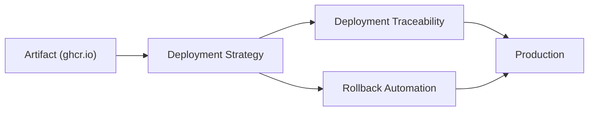

# Despliegue

## Contexto

Este estándar consolida **3 conceptos** del flujo de despliegue a producción. Complementa [CI/CD Pipelines y Build](./ci-pipeline.md) y asegura que cada deployment sea seguro, reversible y completamente trazable.

**Conceptos incluidos:**

- **Deployment Strategies** → Patrones para minimizar riesgo y downtime (blue-green, canary, rolling)
- **Deployment Traceability** → Vínculo entre deployments, commits, PRs y responsables
- **Rollback Automation** → Capacidad de revertir deployments fallidos automáticamente

---

## Stack Tecnológico

| Componente         | Tecnología      | Versión | Uso                                   |
| ------------------ | --------------- | ------- | ------------------------------------- |
| **CI/CD**          | GitHub Actions  | Latest  | Orquestación de deployments           |
| **Orchestration**  | AWS ECS Fargate | Latest  | Ejecución de contenedores             |
| **Deployment**     | AWS CodeDeploy  | Latest  | Blue-green y canary en ECS            |
| **IaC**            | Terraform       | 1.7+    | Provisionamiento de infraestructura   |
| **Runtime**        | .NET            | 8.0+    | Framework de aplicación               |
| **Observabilidad** | Grafana Stack   | Latest  | Anotaciones y métricas de deployments |

---

## Flujo de Despliegue



**Flujo típico:**

1. **Artefacto** → Imagen firmada disponible en registry
2. **Estrategia** → Elección de blue-green, canary o rolling
3. **Deploy** → ECS CodeDeploy gestiona el cambio
4. **Trace** → Git SHA, PR, responsable registrados en GitHub Deployments API + Grafana
5. **Monitor** → Health checks, alarmas CloudWatch
6. **Rollback** → Automático si fallan health checks o alarmas

---

## Estrategias de Despliegue

### ¿Qué son las Estrategias de Despliegue?

Patrones para desplegar nuevas versiones minimizando downtime y riesgo mediante técnicas como blue-green, canary o rolling updates.

**Propósito:** Permitir deployments seguros con capacidad de validación antes de afectar todo el tráfico.

**Componentes clave:**

- **Blue-Green**: Dos ambientes completos (blue activo, green nuevo), switch instantáneo
- **Canary**: Deployment gradual empezando con % pequeño de tráfico
- **Rolling**: Reemplazo progresivo de instancias una por una
- **Traffic Splitting**: Control fino del % de tráfico a cada versión

**Cuándo usar cada una:**

- **Blue-Green**: Cambios grandes, necesidad de rollback instantáneo, suficientes recursos
- **Canary**: Validación progresiva, cambios críticos necesitan monitoreo
- **Rolling**: Recursos limitados, cambios menores, tolera instancias mixtas

### Blue-Green con Terraform + ECS

```hcl
# terraform/modules/ecs-service-blue-green/main.tf

resource "aws_ecs_service" "app" {
  name            = "${var.service_name}"
  cluster         = var.cluster_id
  task_definition = aws_ecs_task_definition.app.arn
  desired_count   = var.desired_count

  deployment_controller {
    type = "CODE_DEPLOY"  # Habilita blue-green via CodeDeploy
  }

  load_balancer {
    target_group_arn = aws_lb_target_group.blue.arn
    container_name   = var.container_name
    container_port   = var.container_port
  }

  network_configuration {
    subnets          = var.private_subnet_ids
    security_groups  = [aws_security_group.app.id]
    assign_public_ip = false
  }

  lifecycle {
    ignore_changes = [
      task_definition,  # CodeDeploy maneja task definitions
      load_balancer,    # CodeDeploy maneja target groups
    ]
  }
}

# Target Group BLUE (producción actual)
resource "aws_lb_target_group" "blue" {
  name                 = "${var.service_name}-blue"
  port                 = var.container_port
  protocol             = "HTTP"
  vpc_id               = var.vpc_id
  target_type          = "ip"
  deregistration_delay = 30

  health_check {
    enabled             = true
    path                = "/health"
    interval            = 30
    timeout             = 5
    healthy_threshold   = 2
    unhealthy_threshold = 3
    matcher             = "200"
  }
}

# Target Group GREEN (nueva versión)
resource "aws_lb_target_group" "green" {
  name                 = "${var.service_name}-green"
  port                 = var.container_port
  protocol             = "HTTP"
  vpc_id               = var.vpc_id
  target_type          = "ip"
  deregistration_delay = 30

  health_check {
    enabled             = true
    path                = "/health"
    interval            = 30
    timeout             = 5
    healthy_threshold   = 2
    unhealthy_threshold = 3
    matcher             = "200"
  }
}

# CodeDeploy Deployment Group
resource "aws_codedeploy_deployment_group" "app" {
  app_name               = aws_codedeploy_app.app.name
  deployment_group_name  = "${var.service_name}-dg"
  service_role_arn       = var.codedeploy_role_arn
  deployment_config_name = "CodeDeployDefault.ECSAllAtOnce"

  blue_green_deployment_config {
    terminate_blue_instances_on_deployment_success {
      action                           = "TERMINATE"
      termination_wait_time_in_minutes = 5
    }

    deployment_ready_option {
      action_on_timeout    = "CONTINUE_DEPLOYMENT"
      wait_time_in_minutes = 0
    }
  }

  ecs_service {
    cluster_name = var.cluster_name
    service_name = aws_ecs_service.app.name
  }

  load_balancer_info {
    target_group_pair_info {
      prod_traffic_route {
        listener_arns = [var.listener_arn]
      }

      target_group {
        name = aws_lb_target_group.blue.name
      }

      target_group {
        name = aws_lb_target_group.green.name
      }
    }
  }

  auto_rollback_configuration {
    enabled = true
    events  = ["DEPLOYMENT_FAILURE", "DEPLOYMENT_STOP_ON_ALARM"]
  }

  alarm_configuration {
    enabled = true
    alarms  = var.cloudwatch_alarm_names
  }
}
```

### Canary Deployment con Traffic Splitting

```hcl
# Usar configuración Canary10Percent5Minutes
resource "aws_codedeploy_deployment_group" "canary" {
  # ... config anterior ...
  deployment_config_name = "CodeDeployDefault.ECSCanary10Percent5Minutes"
  # Despliega 10% del tráfico, espera 5 min, si OK despliega el 90% restante
}
```

```yaml
# appspec.yml para CodeDeploy Canary
version: 0.0
Resources:
  - TargetService:
      Type: AWS::ECS::Service
      Properties:
        TaskDefinition: "arn:aws:ecs:region:account:task-definition/my-service:123"
        LoadBalancerInfo:
          ContainerName: "my-container"
          ContainerPort: 8080
        PlatformVersion: "LATEST"

Hooks:
  - BeforeInstall: "LambdaFunctionToValidateBeforeInstall"
  - AfterInstall: "LambdaFunctionToValidateAfterInstall"
  - AfterAllowTestTraffic: "LambdaFunctionToValidateTestTraffic"
  - BeforeAllowTraffic: "LambdaFunctionToValidateBeforeAllowTraffic"
  - AfterAllowTraffic: "LambdaFunctionToValidateAfterAllowTraffic"
```

---

## Trazabilidad de Despliegue

### ¿Qué es la Trazabilidad de Despliegue?

Capacidad de rastrear exactamente qué código, configuración y artefactos se desplegaron en cada ambiente, vinculando deployments con commits, PRs, issues y responsables.

**Propósito:** Auditoría completa, troubleshooting rápido, compliance.

**Componentes clave:**

- **Git SHA**: Commit exacto desplegado
- **Build Number**: Identificador único del build
- **PR Number**: Pull request que introdujo los cambios
- **Deployment Manifest**: Registro persistente del deployment en GitHub Deployments API

**Beneficios:**
✅ Respuesta rápida ante incidentes ("¿qué cambió?")
✅ Auditoría para compliance
✅ Métricas de delivery (lead time, deployment frequency)
✅ Rollback informado

### Metadata en Imagen Docker

```dockerfile
# Dockerfile con labels para trazabilidad
FROM mcr.microsoft.com/dotnet/aspnet:8.0
WORKDIR /app

# Metadata labels (OCI standard)
LABEL org.opencontainers.image.created="${BUILD_DATE}"
LABEL org.opencontainers.image.authors="platform-team@example.com"
LABEL org.opencontainers.image.url="https://github.com/org/repo"
LABEL org.opencontainers.image.source="https://github.com/org/repo"
LABEL org.opencontainers.image.version="${BUILD_VERSION}"
LABEL org.opencontainers.image.revision="${GIT_SHA}"
LABEL org.opencontainers.image.title="Order Service"
LABEL com.example.build-number="${BUILD_NUMBER}"
LABEL com.example.pr-number="${PR_NUMBER}"
LABEL com.example.branch="${GIT_BRANCH}"

COPY --from=publish /app/publish .
ENTRYPOINT ["dotnet", "OrderService.Api.dll"]
```

### Endpoint de Información de Despliegue

```csharp
// src/OrderService.Api/Models/DeploymentInfo.cs
public record DeploymentInfo
{
    public string Version { get; init; } = Assembly.GetExecutingAssembly()
        .GetCustomAttribute<AssemblyInformationalVersionAttribute>()?.InformationalVersion ?? "unknown";

    public string GitSha { get; init; } = Environment.GetEnvironmentVariable("GIT_SHA") ?? "unknown";

    public string BuildNumber { get; init; } = Environment.GetEnvironmentVariable("BUILD_NUMBER") ?? "unknown";

    public string BuildDate { get; init; } = Environment.GetEnvironmentVariable("BUILD_DATE") ?? "unknown";

    public string Environment { get; init; } = Environment.GetEnvironmentVariable("ENVIRONMENT") ?? "unknown";

    public DateTime StartupTime { get; init; } = DateTime.UtcNow;
}

// src/OrderService.Api/Endpoints/InfoEndpoint.cs
app.MapGet("/api/info", (IConfiguration config) =>
{
    return Results.Ok(new DeploymentInfo());
})
.WithName("GetDeploymentInfo")
.WithTags("Info")
.WithOpenApi();
```

### GitHub Deployment API + Anotaciones Grafana

```yaml
# .github/workflows/deploy.yml - registrar deployment
- name: Create GitHub Deployment
  uses: chrnorm/deployment-action@v2
  id: deployment
  with:
    token: ${{ secrets.GITHUB_TOKEN }}
    environment: production
    ref: ${{ github.sha }}

- name: Deploy to ECS
  run: |
    # ... deployment commands ...

- name: Annotate Deployment in Grafana
  run: |
    curl -X POST "https://grafana.example.com/api/annotations" \
      -H "Authorization: Bearer ${{ secrets.GRAFANA_API_TOKEN }}" \
      -H "Content-Type: application/json" \
      -d '{
        "dashboardUID": "order-service",
        "time": '"$(date +%s)000"',
        "tags": ["deployment", "production"],
        "text": "Deployed version ${{ github.sha }} to production\nPR: #${{ github.event.pull_request.number }}\nBy: ${{ github.actor }}"
      }'

- name: Update deployment status (success)
  if: success()
  uses: chrnorm/deployment-status@v2
  with:
    token: ${{ secrets.GITHUB_TOKEN }}
    deployment-id: ${{ steps.deployment.outputs.deployment_id }}
    state: success
    environment-url: https://api.example.com

- name: Update deployment status (failure)
  if: failure()
  uses: chrnorm/deployment-status@v2
  with:
    token: ${{ secrets.GITHUB_TOKEN }}
    deployment-id: ${{ steps.deployment.outputs.deployment_id }}
    state: failure
    environment-url: https://api.example.com
```

---

## Automatización de Rollback

### ¿Qué es la Automatización de Rollback?

Capacidad de revertir rápida y automáticamente a una versión anterior estable ante fallos detectados en el deployment.

**Propósito:** Minimizar impacto de deployments fallidos, mantener disponibilidad del servicio.

**Componentes clave:**

- **Health Checks**: Validación continua de salud del servicio
- **Alarmas CloudWatch**: Detección automática de anomalías (error rate, latency)
- **Automatic Rollback**: Reversión sin intervención manual
- **Task Definition Versioning**: Mantener versiones previas disponibles

**Beneficios:**
✅ Recuperación rápida ante fallos
✅ Reducción de MTTR (Mean Time To Recovery)
✅ Confianza en deployments automatizados
✅ Minimización de impacto al usuario

### Terraform Rollback Configuration

```hcl
# terraform/modules/ecs-service/main.tf
resource "aws_ecs_service" "app" {
  name            = var.service_name
  cluster         = var.cluster_id
  task_definition = aws_ecs_task_definition.app.arn
  desired_count   = var.desired_count

  deployment_configuration {
    maximum_percent         = 200  # Permite 2x instancias durante deploy
    minimum_healthy_percent = 100  # Mantiene 100% capacity durante deploy

    deployment_circuit_breaker {
      enable   = true
      rollback = true  # Auto-rollback si falla health check
    }
  }

  load_balancer {
    target_group_arn = aws_lb_target_group.app.arn
    container_name   = var.container_name
    container_port   = var.container_port
  }
}

# CloudWatch Alarm para Error Rate
resource "aws_cloudwatch_metric_alarm" "high_error_rate" {
  alarm_name          = "${var.service_name}-high-error-rate"
  comparison_operator = "GreaterThanThreshold"
  evaluation_periods  = "2"
  metric_name         = "HTTPCode_Target_5XX_Count"
  namespace           = "AWS/ApplicationELB"
  period              = "60"
  statistic           = "Sum"
  threshold           = "10"
  alarm_description   = "Triggers rollback if error rate exceeds threshold"
  treat_missing_data  = "notBreaching"

  dimensions = {
    LoadBalancer = var.load_balancer_name
    TargetGroup  = aws_lb_target_group.app.arn_suffix
  }

  alarm_actions = [var.sns_topic_arn]
}
```

### Rollback Workflow Manual

```yaml
# .github/workflows/rollback.yml
name: Rollback Deployment

on:
  workflow_dispatch:
    inputs:
      environment:
        description: "Environment to rollback"
        required: true
        type: choice
        options:
          - staging
          - production
      target_version:
        description: "Target version (Git SHA or tag)"
        required: true
        type: string

jobs:
  rollback:
    runs-on: ubuntu-latest
    environment: ${{ inputs.environment }}

    steps:
      - name: Checkout at target version
        uses: actions/checkout@v4
        with:
          ref: ${{ inputs.target_version }}

      - name: Get previous task definition
        id: previous-task
        run: |
          PREVIOUS_REVISION=$(aws ecs describe-services \
            --cluster ${{ vars.ECS_CLUSTER }} \
            --services ${{ vars.SERVICE_NAME }} \
            --query 'services[0].deployments[?status==`PRIMARY`].taskDefinition' \
            --output text)

          CURRENT_REV=$(echo $PREVIOUS_REVISION | grep -oP '\d+$')
          ROLLBACK_REV=$((CURRENT_REV - 1))
          ROLLBACK_TASK_DEF="${PREVIOUS_REVISION%:*}:${ROLLBACK_REV}"

          echo "rollback_task_def=$ROLLBACK_TASK_DEF" >> $GITHUB_OUTPUT

      - name: Update ECS Service
        run: |
          aws ecs update-service \
            --cluster ${{ vars.ECS_CLUSTER }} \
            --service ${{ vars.SERVICE_NAME }} \
            --task-definition ${{ steps.previous-task.outputs.rollback_task_def }} \
            --force-new-deployment

      - name: Wait for deployment
        run: |
          aws ecs wait services-stable \
            --cluster ${{ vars.ECS_CLUSTER }} \
            --services ${{ vars.SERVICE_NAME }}

      - name: Verify rollback
        run: |
          HEALTH_URL="https://${{ vars.SERVICE_URL }}/health"
          for i in {1..10}; do
            STATUS=$(curl -s -o /dev/null -w "%{http_code}" $HEALTH_URL)
            if [ "$STATUS" -eq 200 ]; then
              echo "✅ Rollback successful - service healthy"
              exit 0
            fi
            echo "⏳ Waiting for service to be healthy (attempt $i/10)..."
            sleep 10
          done
          echo "❌ Rollback verification failed"
          exit 1

      - name: Notify team
        if: always()
        uses: slackapi/slack-github-action@v1
        with:
          webhook-url: ${{ secrets.SLACK_WEBHOOK }}
          payload: |
            {
              "text": "🔄 Rollback ${{ job.status }} in ${{ inputs.environment }}",
              "blocks": [
                {
                  "type": "section",
                  "text": {
                    "type": "mrkdwn",
                    "text": "*Rollback ${{ job.status }}*\n*Environment:* ${{ inputs.environment }}\n*Target Version:* ${{ inputs.target_version }}\n*Triggered by:* ${{ github.actor }}"
                  }
                }
              ]
            }
```

---

## Implementación Integrada

### Deploy a Staging (automático)

```yaml
# .github/workflows/deploy.yml — job deploy-staging
deploy-staging:
  needs: publish # depende del job de build+push en ci-pipeline
  if: github.ref == 'refs/heads/develop'
  runs-on: ubuntu-latest
  environment:
    name: staging
    url: https://staging-api.example.com
  steps:
    - uses: actions/checkout@v4

    - name: Configure AWS Credentials
      uses: aws-actions/configure-aws-credentials@v4
      with:
        aws-access-key-id: ${{ secrets.AWS_ACCESS_KEY_ID }}
        aws-secret-access-key: ${{ secrets.AWS_SECRET_ACCESS_KEY }}
        aws-region: us-east-1

    - uses: hashicorp/setup-terraform@v3

    - name: Deploy con Terraform
      working-directory: terraform/environments/staging
      run: |
        terraform init
        terraform apply -auto-approve \
          -var="image_tag=${{ needs.publish.outputs.image-tag }}"

    - name: Smoke Test
      run: curl -f https://staging-api.example.com/health || exit 1
```

### Deploy a Producción (blue-green + aprobación manual)

```yaml
# .github/workflows/deploy.yml — job deploy-production
deploy-production:
  needs: publish
  if: github.ref == 'refs/heads/main'
  runs-on: ubuntu-latest
  environment:
    name: production # requiere aprobación manual configurada en el entorno
    url: https://api.example.com
  steps:
    - uses: actions/checkout@v4

    - name: Create GitHub Deployment
      uses: chrnorm/deployment-action@v2
      id: deployment
      with:
        token: ${{ secrets.GITHUB_TOKEN }}
        environment: production
        ref: ${{ github.sha }}

    - name: Configure AWS Credentials
      uses: aws-actions/configure-aws-credentials@v4
      with:
        aws-access-key-id: ${{ secrets.AWS_ACCESS_KEY_ID_PROD }}
        aws-secret-access-key: ${{ secrets.AWS_SECRET_ACCESS_KEY_PROD }}
        aws-region: us-east-1

    - uses: hashicorp/setup-terraform@v3

    - name: Deploy Blue-Green con Terraform
      working-directory: terraform/environments/production
      run: |
        terraform init
        terraform apply -auto-approve \
          -var="image_tag=${{ needs.publish.outputs.image-tag }}" \
          -var="deployment_strategy=blue-green"

    - name: Anotar deployment en Grafana
      run: |
        curl -X POST "https://grafana.example.com/api/annotations" \
          -H "Authorization: Bearer ${{ secrets.GRAFANA_API_TOKEN }}" \
          -H "Content-Type: application/json" \
          -d '{"tags":["deployment","production"],"text":"Deployed ${{ github.sha }}"}'

    - name: Actualizar estado del deployment
      if: always()
      uses: chrnorm/deployment-status@v2
      with:
        token: ${{ secrets.GITHUB_TOKEN }}
        deployment-id: ${{ steps.deployment.outputs.deployment_id }}
        state: ${{ job.status }}
        environment-url: https://api.example.com
```

:::note Build + empaquetado
Los jobs `build`, `security` y `publish` (CI, Trivy scanning, Docker build + push a ghcr.io) están documentados en [CI/CD Pipelines y Build](./ci-pipeline.md).
:::

---

## Monitoreo y Observabilidad

### Dashboard Grafana — Métricas DORA

```promql
# Deployment Frequency (DORA metric)
sum(increase(deployments_total{environment="production"}[7d]))

# Deployment Failure Rate
sum(rate(deployments_failed_total{environment="production"}[7d]))
/
sum(rate(deployments_total{environment="production"}[7d]))

# Mean Time to Recovery (MTTR)
avg(deployment_duration_seconds{status="rollback",environment="production"})

# Lead Time for Changes - desde commit hasta deployment
histogram_quantile(0.95, sum(rate(deployment_duration_seconds_bucket[7d])) by (le, environment))
```

---

## Requisitos Técnicos

### MUST (Obligatorio)

**Deployment:**

- **MUST** usar blue-green o canary para deployments a producción
- **MUST** implementar health checks en aplicaciones
- **MUST** habilitar auto-rollback basado en health checks
- **MUST** requerir aprobación manual para deployment a producción

**Trazabilidad:**

- **MUST** incluir Git SHA, build number y version en imagen Docker (labels OCI)
- **MUST** exponer endpoint `/api/info` con metadata de deployment
- **MUST** registrar metadata de deployment (SHA, fecha, responsable, PR)
- **MUST** anotar deployments en Grafana con SHA y responsable
- **MUST** usar GitHub Deployments API para rastrear deployments

### SHOULD (Fuertemente recomendado)

- **SHOULD** configurar alarmas CloudWatch para triggear auto-rollback
- **SHOULD** implementar smoke tests post-deployment
- **SHOULD** usar traffic splitting (canary) para cambios críticos
- **SHOULD** mantener al menos últimas 5 versiones de task definitions

### MAY (Opcional)

- **MAY** implementar deployment progressivo con feature flags

### MUST NOT (Prohibido)

- **MUST NOT** hacer deployment manual a producción
- **MUST NOT** deployment a producción sin pasar por staging
- **MUST NOT** usar `latest` tag en producción (siempre SHA específico)

---

## Referencias

- [AWS ECS Deployment Types](https://docs.aws.amazon.com/AmazonECS/latest/developerguide/deployment-types.html) — tipos de deployment en ECS Fargate
- [AWS CodeDeploy Blue/Green](https://docs.aws.amazon.com/codedeploy/latest/userguide/deployments-bluegreen.html) — blue-green deployments en AWS
- [Terraform AWS ECS Module](https://registry.terraform.io/providers/hashicorp/aws/latest/docs/resources/ecs_service) — módulo Terraform para ECS
- [DORA Metrics](https://www.devops-research.com/research.html) — deployment frequency, lead time, MTTR, change failure rate
- [Blue-Green Deployments](https://martinfowler.com/bliki/BlueGreenDeployment.html) — patrón blue-green
- [Canary Releases](https://martinfowler.com/bliki/CanaryRelease.html) — patrón canary
- [CI/CD Pipelines y Build](./ci-pipeline.md) — pipeline de integración continua y empaquetado
- [Infrastructure as Code — Implementación](../infraestructura/iac-standards.md) — provisionamiento de infraestructura
- [Distributed Tracing](../observabilidad/distributed-tracing.md) — trazabilidad de deployments
- [Structured Logging](../observabilidad/structured-logging.md) — logs de deployments
