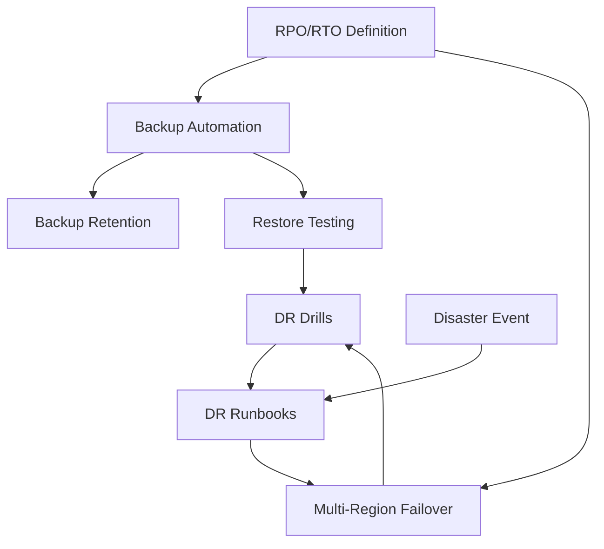

# Disaster Recovery

## Contexto

Este estándar consolida **7 conceptos relacionados** con la capacidad de recuperación ante desastres y continuidad de negocio. Complementa el lineamiento de operabilidad asegurando que los sistemas puedan recuperarse rápidamente ante fallos catastróficos.

**Conceptos incluidos:**

- **Backup Automation** → Respaldos automatizados y consistentes de datos críticos
- **Backup Retention** → Políticas de retención y lifecycle management de backups
- **Restore Testing** → Validación periódica de capacidad de recuperación
- **DR Drills** → Simulacros de disaster recovery para validar procedimientos
- **DR Runbooks** → Documentación detallada de procedimientos de recuperación
- **RPO/RTO Definition** → Definición de objetivos Recovery Point/Time por servicio
- **Multi-Region Failover** → Capacidad de failover a región secundaria ante desastre regional

---

## Stack Tecnológico

| Componente             | Tecnología         | Versión | Uso                                     |
| ---------------------- | ------------------ | ------- | --------------------------------------- |
| **Object Storage**     | AWS S3             | Latest  | Almacenamiento de backups               |
| **Database**           | PostgreSQL         | 15+     | Base de datos principal                 |
| **Managed Database**   | AWS RDS PostgreSQL | 15+     | Snapshots automatizados                 |
| **IaC**                | Terraform          | 1.7+    | Provisionamiento de recursos DR         |
| **Automation**         | GitHub Actions     | Latest  | Orquestación de backups y restore tests |
| **DNS Failover**       | AWS Route53        | Latest  | Traffic routing en failover             |
| **Container Platform** | AWS ECS Fargate    | Latest  | Multi-region deployment                 |
| **Monitoring**         | Grafana Stack      | Latest  | Alertas de fallo en backups             |

---

## Conceptos Fundamentales

Este estándar cubre **7 prácticas fundamentales** para disaster recovery:

### Índice de Conceptos

1. **Backup Automation**: Respaldos automatizados diarios/continuos sin intervención manual
2. **Backup Retention**: Políticas de cuánto tiempo mantener backups y lifecycle
3. **Restore Testing**: Validación mensual/trimestral de capacidad de restore
4. **DR Drills**: Simulacros de disaster recovery end-to-end
5. **DR Runbooks**: Playbooks paso a paso para ejecutar recuperación
6. **RPO/RTO Definition**: Objetivos de pérdida de datos y tiempo de recuperación
7. **Multi-Region Failover**: Capacidad de failover automático a región secundaria

### Relación entre Conceptos



**Flujo de preparación DR:**

1. **Define RPO/RTO** → Establece objetivos de recuperación
2. **Automate Backups** → Implementa respaldos según RPO
3. **Configure Retention** → Aplica lifecycle policies
4. **Test Restore** → Valida capacidad de recuperación mensualmente
5. **Execute Drills** → Simulacros trimestrales end-to-end
6. **Maintain Runbooks** → Actualiza procedimientos
7. **Setup Multi-Region** → Prepara failover a región secundaria

**Flujo durante desastre:**

1. **Detect** → Monitoreo detecta fallo crítico/regional
2. **Assess** → Evaluar magnitud y decidir recover vs failover
3. **Execute Runbook** → Seguir procedimientos documentados
4. **Restore/Failover** → Recuperar datos o cambiar a región secundaria
5. **Validate** → Verificar integridad de datos y funcionalidad
6. **Communicate** → Notificar stakeholders

---

## 1. Backup Automation

### ¿Qué es Backup Automation?

Proceso automatizado de creación de copias de seguridad de datos críticos (bases de datos, configuraciones, archivos) sin intervención manual, ejecutado en schedule definido.

**Propósito:** Garantizar disponibilidad de backups recientes para recovery, eliminando riesgo de olvido humano.

**Componentes clave:**

- **Scheduled Backups**: Ejecución automática diaria/horaria/continua
- **Consistent Snapshots**: Backups transaccionalmente consistentes
- **Encryption**: Cifrado at-rest y in-transit de backups
- **Verification**: Validación automática de integridad del backup

**Beneficios:**
✅ Backups consistentes y confiables
✅ Eliminación de errores humanos
✅ Cumplimiento de RPO definido
✅ Evidencia para auditorías

### PostgreSQL Backup con pg_dump

```bash
#!/bin/bash
# scripts/backup-postgres.sh

set -euo pipefail

BACKUP_DIR="/backups"
S3_BUCKET="s3://talma-backups-prod"
TIMESTAMP=$(date +%Y%m%d_%H%M%S)
DB_NAME="orders_db"
RETENTION_DAYS=30

# 1. Crear backup con pg_dump
echo "📦 Starting backup of ${DB_NAME}..."

BACKUP_FILE="${BACKUP_DIR}/${DB_NAME}_${TIMESTAMP}.sql.gz"

PGPASSWORD="${DB_PASSWORD}" pg_dump \
  --host="${DB_HOST}" \
  --port="${DB_PORT}" \
  --username="${DB_USER}" \
  --dbname="${DB_NAME}" \
  --format=custom \
  --compress=9 \
  --verbose \
  --file="${BACKUP_FILE}"

# 2. Calcular checksum
echo "🔐 Calculating checksum..."
sha256sum "${BACKUP_FILE}" > "${BACKUP_FILE}.sha256"

# 3. Subir a S3
echo "☁️ Uploading to S3..."
aws s3 cp "${BACKUP_FILE}" "${S3_BUCKET}/postgres/${DB_NAME}/" \
  --storage-class STANDARD_IA \
  --server-side-encryption AES256 \
  --metadata "db_name=${DB_NAME},backup_date=${TIMESTAMP},retention_days=${RETENTION_DAYS}"

aws s3 cp "${BACKUP_FILE}.sha256" "${S3_BUCKET}/postgres/${DB_NAME}/"

# 4. Limpiar backups locales antiguos
echo "🧹 Cleaning local backups older than ${RETENTION_DAYS} days..."
find "${BACKUP_DIR}" -name "${DB_NAME}_*.sql.gz" -mtime +${RETENTION_DAYS} -delete

# 5. Notificar éxito
echo "✅ Backup completed successfully: ${BACKUP_FILE}"

# Enviar métrica a CloudWatch
aws cloudwatch put-metric-data \
  --namespace "Talma/Backups" \
  --metric-name "BackupSuccess" \
  --value 1 \
  --dimensions Database="${DB_NAME}"
```

### GitHub Action para Backup Automatizado

```yaml
# .github/workflows/backup-databases.yml
name: Automated Database Backup

on:
  schedule:
    - cron: "0 2 * * *" # Diario a las 2 AM UTC
  workflow_dispatch: # Manual trigger

jobs:
  backup-production:
    runs-on: ubuntu-latest
    environment: production

    steps:
      - name: Checkout scripts
        uses: actions/checkout@v4

      - name: Configure AWS credentials
        uses: aws-actions/configure-aws-credentials@v4
        with:
          aws-access-key-id: ${{ secrets.AWS_ACCESS_KEY_ID }}
          aws-secret-access-key: ${{ secrets.AWS_SECRET_ACCESS_KEY }}
          aws-region: us-east-1

      - name: Install PostgreSQL client
        run: |
          sudo apt-get update
          sudo apt-get install -y postgresql-client-15

      - name: Execute backup script
        env:
          DB_HOST: ${{ secrets.DB_HOST }}
          DB_PORT: ${{ secrets.DB_PORT }}
          DB_USER: ${{ secrets.DB_USER }}
          DB_PASSWORD: ${{ secrets.DB_PASSWORD }}
        run: |
          chmod +x scripts/backup-postgres.sh
          ./scripts/backup-postgres.sh

      - name: Verify backup in S3
        run: |
          LATEST_BACKUP=$(aws s3 ls s3://talma-backups-prod/postgres/orders_db/ \
            --recursive | sort | tail -n 1 | awk '{print $4}')

          if [ -z "$LATEST_BACKUP" ]; then
            echo "❌ Backup verification failed - no backup found"
            exit 1
          fi

          echo "✅ Verified backup exists: ${LATEST_BACKUP}"

      - name: Notify on failure
        if: failure()
        uses: slackapi/slack-github-action@v1
        with:
          webhook-url: ${{ secrets.SLACK_WEBHOOK }}
          payload: |
            {
              "text": "🚨 Database backup FAILED",
              "blocks": [
                {
                  "type": "section",
                  "text": {
                    "type": "mrkdwn",
                    "text": "*Database Backup Failed*\n*Database:* orders_db\n*Time:* $(date -u)\n*Workflow:* ${{ github.server_url }}/${{ github.repository }}/actions/runs/${{ github.run_id }}"
                  }
                }
              ]
            }
```

### AWS RDS Automatic Snapshots (Terraform)

```hcl
# terraform/modules/rds/main.tf
resource "aws_db_instance" "postgres" {
  identifier = "orders-db-prod"

  engine         = "postgres"
  engine_version = "15.4"
  instance_class = "db.t4g.large"

  allocated_storage     = 100
  max_allocated_storage = 500
  storage_encrypted     = true

  # Automated Backups
  backup_retention_period = 30  # Retener 30 días
  backup_window          = "02:00-03:00"  # UTC

  # Multi-AZ para alta disponibilidad
  multi_az = true

  # Snapshots automáticos antes de cambios
  skip_final_snapshot       = false
  final_snapshot_identifier = "orders-db-prod-final-${formatdate("YYYYMMDD-HHmmss", timestamp())}"

  # Copy snapshots a otra región
  copy_tags_to_snapshot = true

  # Maintenance window
  maintenance_window = "sun:03:00-sun:04:00"

  tags = {
    Environment = "production"
    Backup      = "automated"
    RPO         = "1-hour"
  }
}

# Copiar snapshots a región secundaria (DR)
resource "aws_db_snapshot_copy" "dr_region" {
  provider = aws.us-west-2  # Región secundaria

  source_db_snapshot_identifier = aws_db_instance.postgres.latest_restorable_time
  target_db_snapshot_identifier = "orders-db-prod-dr-${formatdate("YYYYMMDD", timestamp())}"

  copy_tags = true
  kms_key_id = aws_kms_key.dr_region.arn
}
```

---

## 2. Backup Retention

### ¿Qué es Backup Retention?

Políticas que definen cuánto tiempo mantener backups antes de eliminarlos, balanceando costo de almacenamiento con requisitos de recovery y compliance.

**Propósito:** Optimizar costos mientras se mantiene capacidad de recovery según necesidades de negocio y regulatorias.

**Componentes clave:**

- **Retention Tiers**: Diferentes periodos según antigüedad (hot/warm/cold)
- **Lifecycle Policies**: Transición automática entre storage classes
- **Legal Hold**: Retención indefinida para requisitos legales
- **Compliance Lock**: Inmutabilidad de backups críticos

**Beneficios:**
✅ Optimización de costos de almacenamiento
✅ Cumplimiento de regulaciones (GDPR, SOX, etc.)
✅ Balance entre recovery capability y costo
✅ Protección contra ransomware (immutable backups)

### Estrategia de Retención GFS (Grandfather-Father-Son)

```yaml
# Estrategia típica de retención:
Daily: 7 días   → S3 Standard
Weekly: 4 semanas → S3 Standard-IA
Monthly: 12 meses  → S3 Glacier Instant Retrieval
Yearly: 7 años    → S3 Glacier Deep Archive
```

### S3 Lifecycle Policy (Terraform)

```hcl
# terraform/modules/backup-bucket/main.tf

resource "aws_s3_bucket" "backups" {
  bucket = "talma-backups-prod"

  tags = {
    Purpose = "Database and application backups"
  }
}

# Habilitar versionado (protección contra eliminación accidental)
resource "aws_s3_bucket_versioning" "backups" {
  bucket = aws_s3_bucket.backups.id

  versioning_configuration {
    status = "Enabled"
  }
}

# Cifrado por defecto
resource "aws_s3_bucket_server_side_encryption_configuration" "backups" {
  bucket = aws_s3_bucket.backups.id

  rule {
    apply_server_side_encryption_by_default {
      sse_algorithm = "AES256"
    }
  }
}

# Object Lock para inmutabilidad (protección contra ransomware)
resource "aws_s3_bucket_object_lock_configuration" "backups" {
  bucket = aws_s3_bucket.backups.id

  rule {
    default_retention {
      mode = "GOVERNANCE"  # Permite eliminación con permisos especiales
      days = 30
    }
  }
}

# Lifecycle Policy - GFS Retention
resource "aws_s3_bucket_lifecycle_configuration" "backups" {
  bucket = aws_s3_bucket.backups.id

  rule {
    id     = "daily-backups-7days"
    status = "Enabled"

    filter {
      prefix = "postgres/"
    }

    # Mantener 7 días en S3 Standard
    expiration {
      days = 7
    }

    noncurrent_version_expiration {
      noncurrent_days = 7
    }
  }

  rule {
    id     = "weekly-backups-4weeks"
    status = "Enabled"

    filter {
      and {
        prefix = "postgres/"
        tags = {
          BackupType = "weekly"
        }
      }
    }

    # Transición a Standard-IA después de 7 días
    transition {
      days          = 7
      storage_class = "STANDARD_IA"
    }

    # Eliminar después de 30 días
    expiration {
      days = 30
    }
  }

  rule {
    id     = "monthly-backups-12months"
    status = "Enabled"

    filter {
      and {
        prefix = "postgres/"
        tags = {
          BackupType = "monthly"
        }
      }
    }

    # Transición a Glacier Instant Retrieval después de 30 días
    transition {
      days          = 30
      storage_class = "GLACIER_IR"
    }

    # Eliminar después de 365 días
    expiration {
      days = 365
    }
  }

  rule {
    id     = "yearly-backups-7years"
    status = "Enabled"

    filter {
      and {
        prefix = "postgres/"
        tags = {
          BackupType = "yearly"
        }
      }
    }

    # Transición a Glacier Deep Archive después de 365 días
    transition {
      days          = 365
      storage_class = "DEEP_ARCHIVE"
    }

    # Eliminar después de 2555 días (7 años)
    expiration {
      days = 2555
    }
  }
}
```

### Script de Tagging para GFS

```bash
#!/bin/bash
# scripts/tag-backup-gfs.sh

S3_BUCKET="s3://talma-backups-prod"
BACKUP_FILE=$1
DAY_OF_WEEK=$(date +%u)     # 1-7 (Monday-Sunday)
DAY_OF_MONTH=$(date +%d)    # 1-31
DAY_OF_YEAR=$(date +%j)     # 1-365

# Determinar tipo de backup según calendario
if [ "$DAY_OF_YEAR" -eq "1" ]; then
  BACKUP_TYPE="yearly"
elif [ "$DAY_OF_MONTH" -eq "1" ]; then
  BACKUP_TYPE="monthly"
elif [ "$DAY_OF_WEEK" -eq "7" ]; then  # Sunday
  BACKUP_TYPE="weekly"
else
  BACKUP_TYPE="daily"
fi

echo "📋 Tagging backup as: ${BACKUP_TYPE}"

# Aplicar tag en S3
aws s3api put-object-tagging \
  --bucket "talma-backups-prod" \
  --key "postgres/${BACKUP_FILE}" \
  --tagging "TagSet=[{Key=BackupType,Value=${BACKUP_TYPE}}]"
```

---

## 3. Restore Testing

### ¿Qué es Restore Testing?

Validación periódica de la capacidad de restaurar datos desde backups, asegurando que los backups son utilizables y los procedimientos funcionan.

**Propósito:** Detectar fallos en backups ANTES de un desastre real. "Un backup no testeado es un backup inexistente".

**Componentes clave:**

- **Automated Restore**: Restore automatizado mensual en ambiente aislado
- **Data Validation**: Verificación de integridad y completitud de datos
- **Performance Testing**: Validar que restore cumple RTO
- **Documentation**: Actualizar runbooks con learnings

**Beneficios:**
✅ Confianza en capacidad de recovery
✅ Detección temprana de backups corruptos
✅ Validación de RTO estimado
✅ Entrenamiento del equipo en procedimientos

### GitHub Action para Restore Testing

```yaml
# .github/workflows/restore-test.yml
name: Monthly Backup Restore Test

on:
  schedule:
    - cron: "0 10 1 * *" # Primer día de cada mes a las 10 AM UTC
  workflow_dispatch:

jobs:
  restore-test:
    runs-on: ubuntu-latest
    environment: dr-test

    steps:
      - uses: actions/checkout@v4

      - name: Configure AWS credentials
        uses: aws-actions/configure-aws-credentials@v4
        with:
          aws-access-key-id: ${{ secrets.AWS_ACCESS_KEY_ID }}
          aws-secret-access-key: ${{ secrets.AWS_SECRET_ACCESS_KEY }}
          aws-region: us-east-1

      - name: Get latest backup from S3
        id: latest-backup
        run: |
          LATEST_BACKUP=$(aws s3 ls s3://talma-backups-prod/postgres/orders_db/ \
            --recursive | sort | tail -n 1 | awk '{print $4}')

          echo "backup_key=${LATEST_BACKUP}" >> $GITHUB_OUTPUT
          echo "📦 Latest backup: ${LATEST_BACKUP}"

      - name: Download backup
        run: |
          aws s3 cp "s3://talma-backups-prod/${{ steps.latest-backup.outputs.backup_key }}" \
            ./backup.sql.gz

          # Verificar checksum
          aws s3 cp "s3://talma-backups-prod/${{ steps.latest-backup.outputs.backup_key }}.sha256" \
            ./backup.sql.gz.sha256

          sha256sum -c backup.sql.gz.sha256 || exit 1

      - name: Start test RDS instance
        id: test-db
        run: |
          # Crear RDS temporal desde snapshot
          SNAPSHOT_ID="restore-test-$(date +%Y%m%d-%H%M%S)"

          aws rds restore-db-instance-from-db-snapshot \
            --db-instance-identifier "restore-test-orders" \
            --db-snapshot-identifier "orders-db-prod-latest" \
            --db-instance-class "db.t4g.medium" \
            --publicly-accessible \
            --no-multi-az

          # Esperar a que esté disponible
          echo "⏳ Waiting for test database to be available..."
          aws rds wait db-instance-available \
            --db-instance-identifier "restore-test-orders"

          # Obtener endpoint
          DB_ENDPOINT=$(aws rds describe-db-instances \
            --db-instance-identifier "restore-test-orders" \
            --query 'DBInstances[0].Endpoint.Address' \
            --output text)

          echo "db_endpoint=${DB_ENDPOINT}" >> $GITHUB_OUTPUT

      - name: Verify data integrity
        env:
          DB_HOST: ${{ steps.test-db.outputs.db_endpoint }}
          DB_PASSWORD: ${{ secrets.TEST_DB_PASSWORD }}
        run: |
          # Instalar PostgreSQL client
          sudo apt-get install -y postgresql-client-15

          # Conectar y validar integridad
          echo "🔍 Verifying data integrity..."

          # Test 1: Contar registros en tablas críticas
          ORDER_COUNT=$(PGPASSWORD="${DB_PASSWORD}" psql \
            -h "${DB_HOST}" \
            -U postgres \
            -d orders_db \
            -t -c "SELECT COUNT(*) FROM orders;")

          echo "Orders count: ${ORDER_COUNT}"

          if [ "$ORDER_COUNT" -lt 1000 ]; then
            echo "❌ Data validation failed - insufficient data"
            exit 1
          fi

          # Test 2: Verificar foreign key constraints
          CONSTRAINT_ERRORS=$(PGPASSWORD="${DB_PASSWORD}" psql \
            -h "${DB_HOST}" \
            -U postgres \
            -d orders_db \
            -t -c "SELECT COUNT(*) FROM information_schema.table_constraints WHERE constraint_type = 'FOREIGN KEY';")

          echo "✅ Data integrity verified: ${ORDER_COUNT} orders, ${CONSTRAINT_ERRORS} FK constraints"

      - name: Performance test - query execution
        env:
          DB_HOST: ${{ steps.test-db.outputs.db_endpoint }}
          DB_PASSWORD: ${{ secrets.TEST_DB_PASSWORD }}
        run: |
          echo "⚡ Testing query performance..."

          # Medir tiempo de query típica
          START_TIME=$(date +%s)

          PGPASSWORD="${DB_PASSWORD}" psql \
            -h "${DB_HOST}" \
            -U postgres \
            -d orders_db \
            -c "SELECT o.*, c.name FROM orders o JOIN customers c ON o.customer_id = c.id WHERE o.created_at > NOW() - INTERVAL '30 days' LIMIT 1000;"

          END_TIME=$(date +%s)
          DURATION=$((END_TIME - START_TIME))

          echo "Query duration: ${DURATION}s"

          if [ "$DURATION" -gt 30 ]; then
            echo "⚠️ Query performance degraded (> 30s)"
          else
            echo "✅ Query performance acceptable"
          fi

      - name: Cleanup test instance
        if: always()
        run: |
          echo "🧹 Deleting test database..."
          aws rds delete-db-instance \
            --db-instance-identifier "restore-test-orders" \
            --skip-final-snapshot || true

      - name: Report results
        if: always()
        run: |
          if [ "${{ job.status }}" == "success" ]; then
            STATUS="✅ PASSED"
          else
            STATUS="❌ FAILED"
          fi

          # Publicar resultado como GitHub Issue
          gh issue create \
            --title "Restore Test Report - $(date +%Y-%m-%d)" \
            --body "**Status**: ${STATUS}\n**Backup**: ${{ steps.latest-backup.outputs.backup_key }}\n**Order Count**: ${ORDER_COUNT}\n**Duration**: ${DURATION}s" \
            --label "restore-test" \
            --assignee "${{ github.actor }}"
        env:
          GH_TOKEN: ${{ secrets.GITHUB_TOKEN }}

      - name: Update RTO metric
        run: |
          # Registrar tiempo de restore en CloudWatch
          aws cloudwatch put-metric-data \
            --namespace "Talma/DR" \
            --metric-name "RestoreTimeSeconds" \
            --value "${DURATION}" \
            --dimensions Service="orders-db"
```

---

## 4. DR Drills

### ¿Qué son los DR Drills?

Simulacros planificados y ejecutados de disaster recovery end-to-end, validando que TODO el equipo puede ejecutar procedimientos de recuperación bajo presión.

**Propósito:** Validar procedimientos, entrenar al equipo, identificar gaps, medir RTO/RPO reales.

**Componentes clave:**

- **Quarterly Drills**: Simulacros trimestrales programados
- **Tabletop Exercises**: Discusión teórica de escenarios (bajo riesgo)
- **Failover Tests**: Ejecución real de failover a DR (alto riesgo)
- **Chaos Engineering**: Inyección controlada de fallos

**Tipos de drills:**

- **Tabletop**: Reunión donde se discute "qué haríamos si..." (bajo impacto)
- **Parallel Test**: Levantar DR en paralelo sin afectar producción
- **Full Failover**: Switchear tráfico real a DR (máximo realismo)

### DR Drill Checklist

```markdown
# DR Drill Checklist - Q1 2026

**Fecha:** 2026-03-15
**Tipo:** Parallel Test (no impacta producción)
**Escenario:** Fallo completo de región us-east-1
**Participantes:** Platform Team, SRE, Architecture Lead
**Duración estimada:** 4 horas

## Pre-Drill (1 semana antes)

- [ ] Notificar stakeholders del drill
- [ ] Verificar backups actualizados en S3
- [ ] Validar configuración de región secundaria (us-west-2)
- [ ] Preparar runbooks impresos (sin asumir acceso a digital)
- [ ] Configurar war room (Slack channel, Zoom)
- [ ] Preparar métricas de baseline (RTO/RPO targets)

## Durante Drill

### T+0: Declaración de desastre simulado (10:00 AM)

- [ ] Anunciar inicio del drill en #incidents
- [ ] Iniciar cronómetro para medir RTO
- [ ] Asignar roles: Incident Commander, Scribe, Technical Lead

### T+15min: Assessment y decisión

- [ ] Evaluar magnitud del "desastre"
- [ ] Decidir: restore en us-east-1 vs failover a us-west-2
- [ ] Comunicar decisión a stakeholders

### T+30min: Inicio de recovery

- [ ] Seguir runbook específico (ver DR-RUNBOOK-001)
- [ ] Restaurar última snapshot de RDS en us-west-2
- [ ] Desplegar task definitions ECS en us-west-2
- [ ] Actualizar DNS Route53 para apuntar a us-west-2

### T+60min: Validación

- [ ] Health checks pasan en us-west-2
- [ ] Smoke tests ejecutados exitosamente
- [ ] Validar data integrity (comparar checksums)
- [ ] Medir data loss (comparar timestamps último backup)

### T+90min: Cutover (solo en Full Failover)

- [ ] Cambiar Route53 weighted routing: us-east-1 0%, us-west-2 100%
- [ ] Monitorear error rate, latency
- [ ] Validar user traffic flowing to us-west-2

### T+120min: Estabilización

- [ ] Monitorear por 30min sin incidentes
- [ ] Declarar recovery exitoso
- [ ] Detener cronómetro (RTO real medido)

## Post-Drill

- [ ] Revertir cambios (si fue Parallel Test)
- [ ] Calcular RPO real (data loss en minutos)
- [ ] Calcular RTO real (tiempo hasta servicio restaurado)
- [ ] Documentar issues encontrados
- [ ] Crear tickets para remediación
- [ ] Actualizar runbooks con learnings
- [ ] Agendar retrospectiva (dentro de 48h)
- [ ] Publicar report ejecutivo
- [ ] Actualizar próxima fecha de drill

## Métricas Objetivo vs Real

| Métrica   | Objetivo           | Real | Status |
| --------- | ------------------ | ---- | ------ |
| RTO       | 2 horas            | -    | -      |
| RPO       | 1 hora             | -    | -      |
| Data Loss | < 100 transactions | -    | -      |
```

### Terraform para Ambiente DR

```hcl
# terraform/environments/dr-us-west-2/main.tf

provider "aws" {
  region = "us-west-2"
  alias  = "dr"
}

# Cluster ECS en región DR (standby)
resource "aws_ecs_cluster" "dr" {
  provider = aws.dr
  name     = "talma-cluster-dr"

  setting {
    name  = "containerInsights"
    value = "enabled"
  }

  tags = {
    Environment = "disaster-recovery"
    Purpose     = "secondary-region-failover"
  }
}

# Task definition replicada
resource "aws_ecs_task_definition" "app_dr" {
  provider = aws.dr

  family = "order-service-dr"
  # ... misma configuración que producción ...

  container_definitions = jsonencode([{
    name  = "order-service"
    image = "${var.image_repository}:${var.image_tag}"

    environment = [
      {
        name  = "REGION"
        value = "us-west-2"
      },
      {
        name  = "DB_HOST"
        value = aws_db_instance.dr.endpoint
      }
    ]
  }])
}

# RDS Read Replica en región DR (promovida a primary en failover)
resource "aws_db_instance" "dr" {
  provider = aws.dr

  identifier     = "orders-db-dr"
  replicate_source_db = data.aws_db_instance.primary.arn  # Réplica de us-east-1

  instance_class = "db.t4g.large"

  # Promover a standalone durante failover
  skip_final_snapshot = false

  tags = {
    Purpose = "dr-replica"
  }
}

# Route53 Health Check
resource "aws_route53_health_check" "primary" {
  fqdn              = "api.example.com"
  port              = 443
  type              = "HTTPS"
  resource_path     = "/health"
  failure_threshold = 3
  request_interval  = 30

  tags = {
    Name = "primary-region-health"
  }
}

# Route53 Failover Policy
resource "aws_route53_record" "api_failover_primary" {
  zone_id = var.hosted_zone_id
  name    = "api.example.com"
  type    = "A"

  set_identifier = "primary"
  failover_routing_policy {
    type = "PRIMARY"
  }

  alias {
    name                   = aws_lb.primary.dns_name
    zone_id                = aws_lb.primary.zone_id
    evaluate_target_health = true
  }

  health_check_id = aws_route53_health_check.primary.id
}

resource "aws_route53_record" "api_failover_secondary" {
  zone_id = var.hosted_zone_id
  name    = "api.example.com"
  type    = "A"

  set_identifier = "secondary"
  failover_routing_policy {
    type = "SECONDARY"
  }

  alias {
    name                   = aws_lb.dr.dns_name
    zone_id                = aws_lb.dr.zone_id
    evaluate_target_health = true
  }
}
```

---

## 5. DR Runbooks

### ¿Qué son los DR Runbooks?

Documentación detallada paso a paso de cómo ejecutar recovery ante diferentes escenarios de desastre, escrita para ser ejecutable bajo presión y por cualquier miembro del equipo.

**Propósito:** Guía clara y precisa para recovery, reducir tiempo de decisión, evitar errores bajo estrés.

**Componentes clave:**

- **Scenario-Based**: Un runbook por tipo de desastre
- **Step-by-Step**: Instrucciones precisas numeradas
- **Commands Ready**: Copy-paste de comandos reales
- **Decision Trees**: Guía para elegir entre opciones
- **Contact Info**: Quién llamar y cuándo

### DR Runbook Template

```markdown
# DR-RUNBOOK-001: Database Failure Recovery

**Severity:** P1 - Critical
**RTO Target:** 2 hours
**RPO Target:** 1 hour
**Last Updated:** 2026-02-19
**Owner:** Platform Team

---

## Scenario

Complete failure of primary RDS PostgreSQL instance in us-east-1.

**Symptoms:**

- Applications cannot connect to database
- RDS Console shows instance status: "failed"
- CloudWatch alarm "DatabaseDown" triggered
- Customer impact: 100% of orders API down

---

## Pre-requisites

✅ AWS Console access with AdministratorAccess role
✅ AWS CLI configured (`aws configure list`)
✅ PostgreSQL client installed (`psql --version`)
✅ Access to S3 backup bucket: s3://talma-backups-prod
✅ Slack #incidents channel open
✅ This runbook printed (don't rely on digital access)

---

## Decision Tree
```

┌─────────────────────────┐
│ Is RDS repairable? │
└────┬─────────────┬──────┘
│ YES │ NO
v v
┌────────────┐ ┌──────────────────┐
│ Restore │ │ Failover to DR │
│ from │ │ region OR │
│ snapshot │ │ restore from │
│ (faster) │ │ S3 backup (slower)│
└────────────┘ └──────────────────┘
│ │
└─────────┬─────────┘
v
┌──────────────┐
│ Validate & │
│ Monitor │
└──────────────┘

````

---

## Step-by-Step Recovery

### Phase 1: Assessment (Target: 15 minutes)

**⏱️ START TIMER NOW**

1. **Confirm the outage**
   ```bash
   # Test database connectivity
   psql -h orders-db-prod.xxx.us-east-1.rds.amazonaws.com \
        -U postgres -d orders_db -c "SELECT 1;"

   # Expected: Connection timeout or error
````

2. **Check RDS status**

   ```bash
   aws rds describe-db-instances \
     --db-instance-identifier orders-db-prod \
     --region us-east-1 \
     --query 'DBInstances[0].DBInstanceStatus'

   # If status != "available", proceed to recovery
   ```

3. **Declare incident**
   - Post in #incidents: "P1: Database failure declared. DR-RUNBOOK-001 activated."
   - Assign roles: Incident Commander, Technical Lead (DB), Scribe
   - Start incident timeline document

4. **Assess recovery options**
   - Check latest automated snapshot:
     ```bash
     aws rds describe-db-snapshots \
       --db-instance-identifier orders-db-prod \
       --query 'DBSnapshots | sort_by(@, &SnapshotCreateTime) | [-1]' \
       --region us-east-1
     ```
   - Check DR replica status in us-west-2:
     ```bash
     aws rds describe-db-instances \
       --db-instance-identifier orders-db-dr \
       --region us-west-2 \
       --query 'DBInstances[0].DBInstanceStatus'
     ```

**Decision:**

- If snapshot < 1 hour old → **Option A: Restore from snapshot**
- If DR replica healthy → **Option B: Promote DR replica**
- Else → **Option C: Restore from S3 backup**

---

### Phase 2A: Restore from RDS Snapshot (Target: 30 minutes)

5. **Restore database from latest snapshot**

   ```bash
   SNAPSHOT_ID=$(aws rds describe-db-snapshots \
     --db-instance-identifier orders-db-prod \
     --query 'DBSnapshots | sort_by(@, &SnapshotCreateTime) | [-1].DBSnapshotIdentifier' \
     --output text \
     --region us-east-1)

   echo "Restoring from snapshot: ${SNAPSHOT_ID}"

   aws rds restore-db-instance-from-db-snapshot \
     --db-instance-identifier orders-db-prod-restored \
     --db-snapshot-identifier "${SNAPSHOT_ID}" \
     --db-instance-class db.t4g.large \
     --multi-az \
     --region us-east-1
   ```

6. **Wait for instance to be available**

   ```bash
   echo "⏳ Waiting for database to be ready (this takes 5-15 minutes)..."

   aws rds wait db-instance-available \
     --db-instance-identifier orders-db-prod-restored \
     --region us-east-1

   echo "✅ Database is available"
   ```

7. **Update application configuration**

   ```bash
   # Get new endpoint
   NEW_ENDPOINT=$(aws rds describe-db-instances \
     --db-instance-identifier orders-db-prod-restored \
     --query 'DBInstances[0].Endpoint.Address' \
     --output text \
     --region us-east-1)

   echo "New database endpoint: ${NEW_ENDPOINT}"

   # Update Parameter Store
   aws ssm put-parameter \
     --name "/prod/database/host" \
     --value "${NEW_ENDPOINT}" \
     --overwrite \
     --region us-east-1

   # Restart ECS tasks to pick up new config
   aws ecs update-service \
     --cluster talma-cluster-prod \
     --service order-service \
     --force-new-deployment \
     --region us-east-1
   ```

**→ Go to Phase 3: Validation**

---

### Phase 2B: Promote DR Replica (Target: 15 minutes)

8. **Promote read replica to standalone**

   ```bash
   aws rds promote-read-replica \
     --db-instance-identifier orders-db-dr \
     --region us-west-2

   echo "⏳ Waiting for promotion to complete..."

   aws rds wait db-instance-available \
     --db-instance-identifier orders-db-dr \
     --region us-west-2
   ```

9. **Update Route53 to point to DR region**

   ```bash
   # Switch DNS from us-east-1 LB to us-west-2 LB
   aws route53 change-resource-record-sets \
     --hosted-zone-id Z1234567890ABC \
     --change-batch file://failover-to-dr.json
   ```

   ```json
   // failover-to-dr.json
   {
     "Changes": [
       {
         "Action": "UPSERT",
         "ResourceRecordSet": {
           "Name": "api.example.com",
           "Type": "CNAME",
           "TTL": 60,
           "ResourceRecords": [{ "Value": "dr-lb.us-west-2.elb.amazonaws.com" }]
         }
       }
     ]
   }
   ```

10. **Restart applications in DR region**
    ```bash
    aws ecs update-service \
      --cluster talma-cluster-dr \
      --service order-service \
      --desired-count 3 \
      --region us-west-2
    ```

**→ Go to Phase 3: Validation**

---

### Phase 3: Validation (Target: 15 minutes)

11. **Verify database connectivity**

    ```bash
    psql -h ${NEW_ENDPOINT} -U postgres -d orders_db \
      -c "SELECT COUNT(*) FROM orders;"

    # Expected: Returns order count without errors
    ```

12. **Check data integrity**

    ```bash
    # Compare record counts with last known good backup
    psql -h ${NEW_ENDPOINT} -U postgres -d orders_db \
      -c "SELECT
            (SELECT COUNT(*) FROM orders) as orders,
            (SELECT COUNT(*) FROM customers) as customers,
            (SELECT MAX(created_at) FROM orders) as latest_order;"
    ```

13. **Smoke test API**

    ```bash
    # Test order creation
    curl -X POST https://api.example.com/api/orders \
      -H "Content-Type: application/json" \
      -d '{"customerId": 123, "items": [{"sku": "ABC", "quantity": 1}]}'

    # Expected: 201 Created
    ```

14. **Monitor metrics**
    - Open Grafana: https://grafana.example.com/d/order-service
    - Check dashboard for:
      - ✅ Request rate returning to normal
      - ✅ Error rate < 1%
      - ✅ P95 latency < 500ms
      - ✅ Database connection pool healthy

---

### Phase 4: Communication & Cleanup

15. **Calculate RPO/RTO**

    ```
    RPO (data loss) = Time between last backup and failure
    RTO (downtime)  = Time from failure detection to service restored
    ```

16. **Communicate resolution**
    - Post in #incidents: "✅ RESOLVED: Database restored. Service operational."
    - Update status page: https://status.example.com
    - Email stakeholders with incident summary

17. **Schedule post-mortem**
    - Create Incident Review document
    - Schedule meeting within 48 hours
    - Invite: Platform Team, SRE, Architecture

18. **Cleanup (if applicable)**

    ```bash
    # If restored to new instance, delete old failed instance
    aws rds delete-db-instance \
      --db-instance-identifier orders-db-prod \
      --skip-final-snapshot \
      --region us-east-1

    # Rename restored instance to original name (requires downtime)
    aws rds modify-db-instance \
      --db-instance-identifier orders-db-prod-restored \
      --new-db-instance-identifier orders-db-prod \
      --apply-immediately \
      --region us-east-1
    ```

---

## Rollback Plan

If recovery fails:

1. Attempt Option B or C (whichever wasn't tried)
2. If all options exhausted, restore manual backup from S3:

   ```bash
   # Download latest manual backup
   aws s3 cp s3://talma-backups-prod/postgres/orders_db/latest.sql.gz ./

   # Create new empty RDS instance
   # ... (see DR-RUNBOOK-003) ...

   # Restore from dump
   gunzip < latest.sql.gz | psql -h ${NEW_ENDPOINT} -U postgres -d orders_db
   ```

---

## Contact Information

**Escalation:**

- L1: Platform Team Slack: #platform-team
- L2: SRE On-Call: oncall-sre@example.com
- L3: VP Engineering: +1-555-1234

**Vendor Support:**

- AWS Support: Case Priority = Critical
- PostgreSQL DBA: dba-consultant@example.com

---

## Post-Incident Actions

- [ ] Update this runbook with learnings
- [ ] Create Jira tickets for improvements identified
- [ ] Test restore from backup created during incident
- [ ] Review backup retention policy
- [ ] Update RTO/RPO targets if missed

---

**⏱️ STOP TIMER - Record actual RTO**

````

---

## 6. RPO/RTO Definition

### ¿Qué son RPO y RTO?

**RPO (Recovery Point Objective):** Máximo tiempo de datos que puedes perder.
**RTO (Recovery Time Objective):** Máximo tiempo que el sistema puede estar caído.

**Propósito:** Establecer expectativas claras, dimensionar backups y DR apropiadamente, justificar inversión.

**Ejemplo:**
- RPO = 1 hora → Necesitas backups cada hora (continuous backup o snapshots horarios)
- RTO = 2 horas → Tienes 2 horas para restore + validación + cutover

### Matriz RPO/RTO por Servicio

```markdown
| Servicio          | RPO       | RTO       | Backup Frequency | DR Strategy          | Costo Mensual |
|-------------------|-----------|-----------|------------------|----------------------|---------------|
| Orders DB         | 1 hora    | 2 horas   | Continuo (WAL)   | Multi-AZ + DR replica| $500          |
| Customers DB      | 4 horas   | 4 horas   | Cada 4 horas     | Snapshot restore     | $200          |
| Catalog DB (read) | 24 horas  | 8 horas   | Diario           | S3 backup restore    | $50           |
| Logs (Loki)       | 7 días    | 24 horas  | Diario           | S3 lifecycle         | $100          |
| Config (Git)      | 0 (inmediato) | 1 hora | Git push        | Multi-region Git     | $0            |
````

**Fórmula de costo:**

- RPO más agresivo = backups más frecuentes = mayor costo
- RTO más agresivo = DR activo (hot standby) = mayor costo
- Balance: Criticidad del servicio vs costo

### Terraform Variables para RPO/RTO

```hcl
# terraform/variables.tf

variable "service_rpo_rto" {
  description = "RPO and RTO targets per service"
  type = map(object({
    rpo_hours           = number
    rto_hours           = number
    backup_frequency    = string  # "continuous", "hourly", "daily"
    dr_strategy         = string  # "multi-az", "cross-region", "backup-only"
    criticality         = string  # "critical", "high", "medium", "low"
  }))

  default = {
    "orders" = {
      rpo_hours        = 1
      rto_hours        = 2
      backup_frequency = "continuous"
      dr_strategy      = "cross-region"
      criticality      = "critical"
    }

    "customers" = {
      rpo_hours        = 4
      rto_hours        = 4
      backup_frequency = "hourly"
      dr_strategy      = "multi-az"
      criticality      = "high"
    }

    "catalog" = {
      rpo_hours        = 24
      rto_hours        = 8
      backup_frequency = "daily"
      dr_strategy      = "backup-only"
      criticality      = "medium"
    }
  }
}

# Usar para configurar backup retention
resource "aws_db_instance" "main" {
  identifier = "orders-db"

  # RPO determina backup window
  backup_retention_period = var.service_rpo_rto["orders"].rpo_hours * 24 / 24  # En días
  backup_window          = "02:00-03:00"

  # RTO determina Multi-AZ
  multi_az = var.service_rpo_rto["orders"].dr_strategy == "multi-az" ||
             var.service_rpo_rto["orders"].dr_strategy == "cross-region"

  tags = {
    RPO = "${var.service_rpo_rto["orders"].rpo_hours}h"
    RTO = "${var.service_rpo_rto["orders"].rto_hours}h"
    Criticality = var.service_rpo_rto["orders"].criticality
  }
}
```

---

## 7. Multi-Region Failover

### ¿Qué es Multi-Region Failover?

Capacidad de cambiar automáticamente el tráfico de aplicaciones a una región secundaria de AWS cuando la región primaria falla o degrada.

**Propósito:** Protección contra desastres regionales (fallo de datacenter, desastres naturales, cortes de red).

**Componentes clave:**

- **Active-Passive**: Región primaria activa, secundaria standby (costo medio)
- **Active-Active**: Ambas regiones sirven tráfico (costo alto, máxima disponibilidad)
- **Route53 Health Checks**: Detección automática de fallo
- **Database Replication**: Cross-region RDS read replicas
- **Stateless Apps**: Contenedores desplegados en ambas regiones

**Arquitectura recomendada para Talma:**

- **Primaria**: us-east-1 (N. Virginia) - 100% tráfico normal
- **DR**: us-west-2 (Oregon) - Standby, 0% tráfico normal

### Route53 Failover Configuration (Terraform)

Ya incluido en sección DR Drills (ver código Terraform arriba).

---

## Requisitos Técnicos

### MUST (Obligatorio)

**Backups:**

- **MUST** implementar backups automatizados para todas las bases de datos
- **MUST** cifrar todos los backups at-rest (AES-256)
- **MUST** almacenar backups en región diferente a producción
- **MUST** validar integridad de backups (checksums)

**Retention:**

- **MUST** retener backups mínimo 30 días para producción
- **MUST** implementar lifecycle policies para transición a storage classes económicas
- **MUST** habilitar versionado en S3 buckets de backups
- **MUST** proteger backups críticos con Object Lock (inmutabilidad)

**Testing:**

- **MUST** ejecutar restore test **al menos mensualmente**
- **MUST** medir y registrar RTO/RPO reales en cada test
- **MUST** actualizar runbooks post cada test con learnings

**DR Drills:**

- **MUST** ejecutar DR drill **al menos trimestralmente**
- **MUST** documentar resultados y crear tickets de remediación
- **MUST** mantener runbooks actualizados (review cada 90 días)

**RPO/RTO:**

- **MUST** definir RPO/RTO para cada servicio crítico
- **MUST** alinear frecuencia de backups con RPO definido
- **MUST** validar RTO en restore tests (no superar 150% del target)

### SHOULD (Fuertemente recomendado)

- **SHOULD** implementar continuous backup (WAL archiving) para RPO < 1 hora
- **SHOULD** usar AWS RDS automated snapshots además de backups manuales
- **SHOULD** configurar multi-AZ RDS para alta disponibilidad
- **SHOULD** implementar cross-region read replica para servicios críticos
- **SHOULD** automatizar restore tests con GitHub Actions
- **SHOULD** usar chaos engineering para validar resiliencia

### MAY (Opcional)

- **MAY** implementar multi-region active-active para máxima disponibilidad
- **MAY** usar AWS Backup service para gestión centralizada
- **MAY** generar reportes automáticos de compliance de backups

### MUST NOT (Prohibido)

- **MUST NOT** depender de backups sin haberlos testeado en últimos 90 días
- **MUST NOT** almacenar backups exclusivamente en misma región que producción
- **MUST NOT** omitir cifrado de backups
- **MUST NOT** eliminar backups manualmente sin aprobación de arquitectura

---

## Monitoreo y Observabilidad

### Métricas de Backup y DR

```promql
# Backup Success Rate (últimos 7 días)
sum(increase(backup_success_total[7d]))
/
sum(increase(backup_attempts_total[7d]))

# Time Since Last Successful Backup
time() - max(backup_last_success_timestamp_seconds)

# Backup Size Growth Rate
rate(backup_size_bytes[30d])

# Restore Test Success Rate
sum(increase(restore_test_success_total[90d]))
/
sum(increase(restore_test_attempts_total[90d]))
```

### CloudWatch Alarms

```hcl
# Alarm: Backup failed
resource "aws_cloudwatch_metric_alarm" "backup_failed" {
  alarm_name          = "backup-failed-orders-db"
  comparison_operator = "LessThanThreshold"
  evaluation_periods  = "1"
  metric_name         = "BackupSuccess"
  namespace           = "Talma/Backups"
  period              = "86400"  # 24 hours
  statistic           = "Sum"
  threshold           = "1"
  alarm_description   = "No successful backup in last 24 hours"
  treat_missing_data  = "breaching"

  alarm_actions = [var.sns_topic_critical_arn]

  dimensions = {
    Database = "orders_db"
  }
}

# Alarm: RTO exceeded in restore test
resource "aws_cloudwatch_metric_alarm" "rto_exceeded" {
  alarm_name          = "restore-test-rto-exceeded"
  comparison_operator = "GreaterThanThreshold"
  evaluation_periods  = "1"
  metric_name         = "RestoreTimeSeconds"
  namespace           = "Talma/DR"
  period              = "300"
  statistic           = "Maximum"
  threshold           = "7200"  # 2 hours
  alarm_description   = "Restore test exceeded RTO target"

  alarm_actions = [var.sns_topic_warning_arn]
}
```

---

## Referencias

**Documentación oficial:**

- [AWS RDS Backup and Restore](https://docs.aws.amazon.com/AmazonRDS/latest/UserGuide/CHAP_CommonTasks.BackupRestore.html)
- [AWS S3 Lifecycle Policies](https://docs.aws.amazon.com/AmazonS3/latest/userguide/object-lifecycle-mgmt.html)
- [AWS Route53 Health Checks](https://docs.aws.amazon.com/Route53/latest/DeveloperGuide/dns-failover.html)
- [PostgreSQL Backup & Recovery](https://www.postgresql.org/docs/15/backup.html)

**Patrones y prácticas:**

- [AWS Well-Architected - Reliability Pillar](https://docs.aws.amazon.com/wellarchitected/latest/reliability-pillar/welcome.html)
- [Disaster Recovery Strategies](https://aws.amazon.com/blogs/architecture/disaster-recovery-dr-architecture-on-aws-part-i-strategies-for-recovery-in-the-cloud/)
- [3-2-1 Backup Rule](https://www.vmware.com/topics/glossary/content/3-2-1-backup-rule.html)

**Relacionados:**

- [CI/CD Deployment](./cicd-deployment.md)
- [Infrastructure as Code](../infraestructura/infrastructure-as-code.md)
- [Alertas con Grafana](../observabilidad/alerting.md)

---

**Última actualización**: 2026-02-19
**Responsable**: Equipo de Arquitectura
