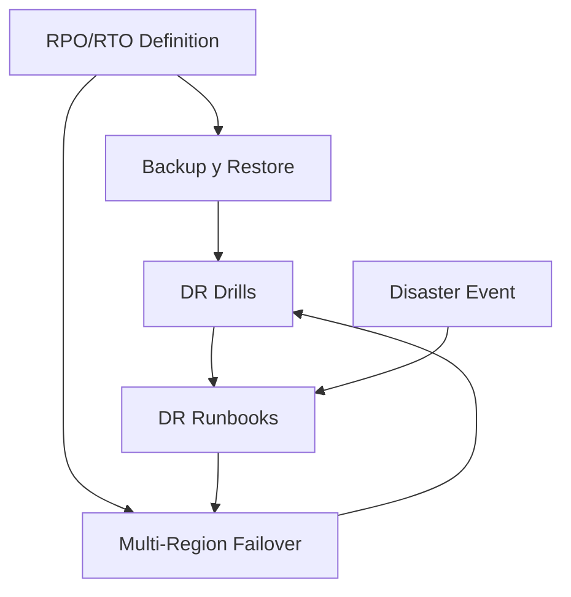

# Procedimientos de DR

## Contexto

Este estándar consolida **4 conceptos** del ciclo de respuesta a desastres. Complementa [Backup y Restore](./backup-restore.md) y cubre todo lo necesario para ejecutar un recovery efectivo: desde la definición de objetivos hasta el failover automático.

**Conceptos incluidos:**

- **DR Drills** → Simulacros planificados para validar procedimientos bajo presión
- **DR Runbooks** → Documentación paso a paso ejecutable ante diferentes escenarios
- **RPO/RTO Definition** → Objetivos de Recovery Point/Time por servicio
- **Multi-Region Failover** → Capacidad de conmutar tráfico a región secundaria

---

## Stack Tecnológico

| Componente             | Tecnología         | Versión | Uso                                  |
| ---------------------- | ------------------ | ------- | ------------------------------------ |
| **IaC**                | Terraform          | 1.7+    | Provisionamiento de recursos DR      |
| **Automation**         | GitHub Actions     | Latest  | Orquestación de drills automatizados |
| **DNS Failover**       | AWS Route53        | Latest  | Traffic routing en failover          |
| **Container Platform** | AWS ECS Fargate    | Latest  | Multi-region deployment              |
| **Managed Database**   | AWS RDS PostgreSQL | 15+     | DR replica y promote-on-failover     |
| **Monitoring**         | Grafana Stack      | Latest  | Alertas y métricas de DR             |

---

## Relación entre Conceptos de DR



**Flujo de preparación:**

1. **Define RPO/RTO** → Establece objetivos de recuperación por servicio
2. **Setup Multi-Region** → Prepara ECS + RDS DR replica en us-west-2
3. **Execute Drills** → Simulacros trimestrales end-to-end
4. **Maintain Runbooks** → Actualiza procedimientos con learnings de cada drill

**Flujo durante desastre:**

1. **Detect** → Monitoreo detecta fallo crítico/regional
2. **Assess** → Evaluar magnitud y decidir recover vs failover
3. **Execute Runbook** → Seguir procedimientos documentados
4. **Restore/Failover** → Recuperar datos o cambiar a región secundaria
5. **Validate** → Verificar integridad y funcionalidad
6. **Communicate** → Notificar stakeholders

---

## DR Drills

### ¿Qué son los DR Drills?

Simulacros planificados y ejecutados de disaster recovery end-to-end, validando que TODO el equipo puede ejecutar procedimientos de recuperación bajo presión.

**Propósito:** Validar procedimientos, entrenar al equipo, identificar gaps, medir RTO/RPO reales.

**Componentes clave:**

- **Quarterly Drills**: Simulacros trimestrales programados
- **Tabletop Exercises**: Discusión teórica de escenarios (bajo riesgo)
- **Failover Tests**: Ejecución real de failover a DR (alto riesgo)
- **Chaos Engineering**: Inyección controlada de fallos

**Tipos de drills:**

- **Tabletop**: Reunión donde se discute "qué haríamos si..." (bajo impacto)
- **Parallel Test**: Levantar DR en paralelo sin afectar producción
- **Full Failover**: Switchear tráfico real a DR (máximo realismo)

### DR Drill Checklist

```markdown
# DR Drill Checklist - Q1 2026

**Fecha:** 2026-03-15
**Tipo:** Parallel Test (no impacta producción)
**Escenario:** Fallo completo de región us-east-1
**Participantes:** Platform Team, SRE, Architecture Lead
**Duración estimada:** 4 horas

## Pre-Drill (1 semana antes)

- [ ] Notificar stakeholders del drill
- [ ] Verificar backups actualizados en S3
- [ ] Validar configuración de región secundaria (us-west-2)
- [ ] Preparar runbooks impresos (sin asumir acceso a digital)
- [ ] Configurar war room (Slack channel, Zoom)
- [ ] Preparar métricas de baseline (RTO/RPO targets)

## Durante Drill

### T+0: Declaración de desastre simulado (10:00 AM)

- [ ] Anunciar inicio del drill en #incidents
- [ ] Iniciar cronómetro para medir RTO
- [ ] Asignar roles: Incident Commander, Scribe, Technical Lead

### T+15min: Assessment y decisión

- [ ] Evaluar magnitud del "desastre"
- [ ] Decidir: restore en us-east-1 vs failover a us-west-2
- [ ] Comunicar decisión a stakeholders

### T+30min: Inicio de recovery

- [ ] Seguir runbook específico (ver DR-RUNBOOK-001)
- [ ] Restaurar última snapshot de RDS en us-west-2
- [ ] Desplegar task definitions ECS en us-west-2
- [ ] Actualizar DNS Route53 para apuntar a us-west-2

### T+60min: Validación

- [ ] Health checks pasan en us-west-2
- [ ] Smoke tests ejecutados exitosamente
- [ ] Validar data integrity (comparar checksums)
- [ ] Medir data loss (comparar timestamps último backup)

### T+90min: Cutover (solo en Full Failover)

- [ ] Cambiar Route53 weighted routing: us-east-1 0%, us-west-2 100%
- [ ] Monitorear error rate, latency
- [ ] Validar user traffic flowing to us-west-2

### T+120min: Estabilización

- [ ] Monitorear por 30min sin incidentes
- [ ] Declarar recovery exitoso
- [ ] Detener cronómetro (RTO real medido)

## Post-Drill

- [ ] Revertir cambios (si fue Parallel Test)
- [ ] Calcular RPO real (data loss en minutos)
- [ ] Calcular RTO real (tiempo hasta servicio restaurado)
- [ ] Documentar issues encontrados
- [ ] Crear tickets para remediación
- [ ] Actualizar runbooks con learnings
- [ ] Agendar retrospectiva (dentro de 48h)
- [ ] Publicar report ejecutivo
- [ ] Actualizar próxima fecha de drill

## Métricas Objetivo vs Real

| Métrica   | Objetivo           | Real | Status |
| --------- | ------------------ | ---- | ------ |
| RTO       | 2 horas            | -    | -      |
| RPO       | 1 hora             | -    | -      |
| Data Loss | < 100 transactions | -    | -      |
```

### Terraform para Ambiente DR

```hcl
# terraform/environments/dr-us-west-2/main.tf

provider "aws" {
  region = "us-west-2"
  alias  = "dr"
}

# Cluster ECS en región DR (standby)
resource "aws_ecs_cluster" "dr" {
  provider = aws.dr
  name     = "talma-cluster-dr"

  setting {
    name  = "containerInsights"
    value = "enabled"
  }

  tags = {
    Environment = "disaster-recovery"
    Purpose     = "secondary-region-failover"
  }
}

# Task definition replicada
resource "aws_ecs_task_definition" "app_dr" {
  provider = aws.dr
  family   = "order-service-dr"

  container_definitions = jsonencode([{
    name  = "order-service"
    image = "${var.image_repository}:${var.image_tag}"

    environment = [
      { name = "REGION", value = "us-west-2" },
      { name = "DB_HOST", value = aws_db_instance.dr.endpoint }
    ]
  }])
}

# RDS Read Replica en región DR
resource "aws_db_instance" "dr" {
  provider = aws.dr

  identifier          = "orders-db-dr"
  replicate_source_db = data.aws_db_instance.primary.arn

  instance_class      = "db.t4g.large"
  skip_final_snapshot = false

  tags = {
    Purpose = "dr-replica"
  }
}

# Route53 Failover Policy
resource "aws_route53_record" "api_failover_primary" {
  zone_id        = var.hosted_zone_id
  name           = "api.example.com"
  type           = "A"
  set_identifier = "primary"

  failover_routing_policy {
    type = "PRIMARY"
  }

  alias {
    name                   = aws_lb.primary.dns_name
    zone_id                = aws_lb.primary.zone_id
    evaluate_target_health = true
  }

  health_check_id = aws_route53_health_check.primary.id
}

resource "aws_route53_record" "api_failover_secondary" {
  zone_id        = var.hosted_zone_id
  name           = "api.example.com"
  type           = "A"
  set_identifier = "secondary"

  failover_routing_policy {
    type = "SECONDARY"
  }

  alias {
    name                   = aws_lb.dr.dns_name
    zone_id                = aws_lb.dr.zone_id
    evaluate_target_health = true
  }
}

resource "aws_route53_health_check" "primary" {
  fqdn              = "api.example.com"
  port              = 443
  type              = "HTTPS"
  resource_path     = "/health"
  failure_threshold = 3
  request_interval  = 30

  tags = {
    Name = "primary-region-health"
  }
}
```

---

## DR Runbooks

### ¿Qué son los DR Runbooks?

Documentación detallada paso a paso de cómo ejecutar recovery ante diferentes escenarios de desastre, escrita para ser ejecutable bajo presión y por cualquier miembro del equipo.

**Propósito:** Guía clara y precisa para recovery, reducir tiempo de decisión, evitar errores bajo estrés.

**Componentes clave:**

- **Scenario-Based**: Un runbook por tipo de desastre
- **Step-by-Step**: Instrucciones precisas numeradas
- **Commands Ready**: Copy-paste de comandos reales
- **Decision Trees**: Guía para elegir entre opciones
- **Contact Info**: Quién llamar y cuándo

### DR Runbook Template

```markdown
# DR-RUNBOOK-001: Database Failure Recovery

**Severity:** P1 - Critical
**RTO Target:** 2 hours
**RPO Target:** 1 hour
**Last Updated:** 2026-02-19
**Owner:** Platform Team

---

## Scenario

Complete failure of primary RDS PostgreSQL instance in us-east-1.

**Symptoms:**

- Applications cannot connect to database
- RDS Console shows instance status: "failed"
- CloudWatch alarm "DatabaseDown" triggered
- Customer impact: 100% of orders API down

---

## Pre-requisites

✅ AWS Console access with AdministratorAccess role
✅ AWS CLI configured (`aws configure list`)
✅ PostgreSQL client installed (`psql --version`)
✅ Access to S3 backup bucket: s3://talma-backups-prod
✅ Slack #incidents channel open
✅ This runbook printed (don't rely on digital access)

---

## Decision Tree
```

┌─────────────────────────┐
│ Is RDS repairable? │
└────┬─────────────┬──────┘
│ YES │ NO
v v
┌──────────┐ ┌──────────────────┐
│ Restore │ │ Failover to DR │
│ from │ │ region OR │
│ snapshot │ │ restore from │
│ (faster) │ │ S3 backup │
└──────────┘ └──────────────────┘
│ │
└──────┬────────┘
v
┌──────────────┐
│ Validate & │
│ Monitor │
└──────────────┘

````

---

## Phase 1: Assessment (Target: 15 minutes)
1

**⏱️ START TIMER NOW**

1. **Confirm the outage**
   ```bash
   psql -h orders-db-prod.xxx.us-east-1.rds.amazonaws.com \
        -U postgres -d orders_db -c "SELECT 1;"
````

2 2. **Check RDS status**

```bash
3  aws rds describe-db-instances \

  --db-instance-identifier orders-db-prod \
  --region us-east-1 \
  --query 'DBInstances[0].DBInstanceStatus'
```

1

1. **Declare incident**
   - Post en #incidents: "P1: Database failure. DR-RUNBOOK-001 activated."
   - Asignar roles: Incident Commander, Technical Lead (DB), Scribe
     2
2. **Assess recovery options**

   ```bash
   # Última snapshot disponible
   aws rds describe-db-snapshots \
     --db-instance-identifier orders-db-prod \

     --query 'DBSnapshots | sort_by(@, &SnapshotCreateTime) | [-1]' \
     --region us-east-1

   # Estado de la DR replica
   aws rds describe-db-instances \
     --db-instance-identifier orders-db-dr \
     --region us-west-2 \
     --query 'DBInstances[0].DBInstanceStatus'
   ```

**Decision:**

- Snapshot < 1 hora → **Option A: Restore from snapshot**
- DR replica healthy → **Option B: Promote DR replica**
- Else → **Option C: Restore from S3 backup**

---

## Phase 2A: Restore from RDS Snapshot (Target: 30 minutes)

```bash
SNAPSHOT_ID=$(aws rds describe-db-snapshots \
  --db-instance-identifier orders-db-prod \
  --query 'DBSnapshots | sort_by(@, &SnapshotCreateTime) | [-1].DBSnapshotIdentifier' \
  --output text --region us-east-1)

aws rds restore-db-instance-from-db-snapshot \
  --db-instance-identifier orders-db-prod-restored \
  --db-snapshot-identifier "${SNAPSHOT_ID}" \
  --db-instance-class db.t4g.large \
  --multi-az --region us-east-1

aws rds wait db-instance-available \
  --db-instance-identifier orders-db-prod-restored \
  --region us-east-1

NEW_ENDPOINT=$(aws rds describe-db-instances \
  --db-instance-identifier orders-db-prod-restored \
  --query 'DBInstances[0].Endpoint.Address' \
  --output text --region us-east-1)

aws ssm put-parameter \
  --name "/prod/database/host" \
  --value "${NEW_ENDPOINT}" \
  --overwrite --region us-east-1

aws ecs update-service \
  --cluster talma-cluster-prod \
  --service order-service \
  --force-new-deployment \
  --region us-east-1
```

## Phase 2B: Promote DR Replica (Target: 15 minutes)

```bash
aws rds promote-read-replica \
  --db-instance-identifier orders-db-dr \
  --region us-west-2

aws rds wait db-instance-available \
  --db-instance-identifier orders-db-dr \
  --region us-west-2

aws route53 change-resource-record-sets \
  --hosted-zone-id Z1234567890ABC \
  --change-batch file://failover-to-dr.json

aws ecs update-service \
  --cluster talma-cluster-dr \
  --service order-service \
  --desired-count 3 \
  --region us-west-2
```

## Phase 3: Validation (Target: 15 minutes)

```bash
# Verificar conectividad y data
psql -h ${NEW_ENDPOINT} -U postgres -d orders_db \
  -c "SELECT COUNT(*) FROM orders;"

# Smoke test API
curl -X POST https://api.example.com/api/orders \
  -H "Content-Type: application/json" \
  -d '{"customerId": 123, "items": [{"sku": "ABC", "quantity": 1}]}'
```

Verificar en Grafana: error rate < 1% · latency P95 < 500ms · DB pool healthy.

## Phase 4: Communication & Cleanup

```bash

# RPO/RTO
# RPO = Tiempo entre último backup y fallo
# RTO = Tiempo desde detección hasta servicio restaurado

# Si se restauró a nueva instancia, renombrar
aws rds modify-db-instance \

  --db-instance-identifier orders-db-prod-restored \
  --new-db-instance-identifier orders-db-prod \
  --apply-immediately --region us-east-1
```

**Acciones post-resolución:**

- [ ] Actualizar este runbook con learnings
- [ ] Crear tickets para mejoras identificadas
- [ ] Testear backup creado durante el incidente
- [ ] Programar post-mortem dentro de 48h

**⏱️ STOP TIMER — Record actual RTO**

````

---

## RPO/RTO Definition

### ¿Qué son RPO y RTO?

**RPO (Recovery Point Objective):** Máximo tiempo de datos que se puede perder ante un fallo.
**RTO (Recovery Time Objective):** Máximo tiempo que el sistema puede permanecer inoperativo.

**Propósito:** Establecer expectativas claras, dimensionar backups y DR apropiadamente, justificar inversión.

**Ejemplo:**
- RPO = 1 hora → Necesitas backups cada hora (continuous backup o snapshots horarios)
- RTO = 2 horas → Tienes 2 horas para restore + validación + cutover

### Matriz RPO/RTO por Servicio

| Servicio          | RPO           | RTO      | Backup Frequency | DR Strategy           |
|-------------------|---------------|----------|------------------|-----------------------|
| Orders DB         | 1 hora        | 2 horas  | Continuo (WAL)   | Multi-AZ + DR replica |
| Customers DB      | 4 horas       | 4 horas  | Cada 4 horas     | Snapshot restore      |
| Catalog DB (read) | 24 horas      | 8 horas  | Diario           | S3 backup restore     |
| Logs (Loki)       | 7 días        | 24 horas | Diario           | S3 lifecycle          |
| Config (Git)      | 0 (inmediato) | 1 hora   | Git push         | Multi-region Git      |

**Fórmula de costo:**
- RPO más agresivo = backups más frecuentes = mayor costo
- RTO más agresivo = DR activo (hot standby) = mayor costo
- Balance: Criticidad del servicio vs costo de disponibilidad

### Terraform Variables para RPO/RTO

```hcl
# terraform/variables.tf

variable "service_rpo_rto" {
  description = "RPO and RTO targets per service"
  type = map(object({
    rpo_hours        = number
    rto_hours        = number
    backup_frequency = string  # "continuous", "hourly", "daily"
    dr_strategy      = string  # "multi-az", "cross-region", "backup-only"
    criticality      = string  # "critical", "high", "medium", "low"
  }))

  default = {
    "orders" = {
      rpo_hours        = 1
      rto_hours        = 2
      backup_frequency = "continuous"
      dr_strategy      = "cross-region"
      criticality      = "critical"
    }

    "customers" = {
      rpo_hours        = 4
      rto_hours        = 4
      backup_frequency = "hourly"
      dr_strategy      = "multi-az"
      criticality      = "high"
    }

    "catalog" = {
      rpo_hours        = 24
      rto_hours        = 8
      backup_frequency = "daily"
      dr_strategy      = "backup-only"
      criticality      = "medium"
    }
  }
}

resource "aws_db_instance" "main" {
  identifier = "orders-db"

  backup_retention_period = 30
  backup_window           = "02:00-03:00"

  multi_az = var.service_rpo_rto["orders"].dr_strategy == "multi-az" ||
             var.service_rpo_rto["orders"].dr_strategy == "cross-region"

  tags = {
    RPO         = "${var.service_rpo_rto["orders"].rpo_hours}h"
    RTO         = "${var.service_rpo_rto["orders"].rto_hours}h"
    Criticality = var.service_rpo_rto["orders"].criticality
  }
}
````

---

## Multi-Region Failover

### ¿Qué es Multi-Region Failover?

Capacidad de cambiar automáticamente el tráfico de aplicaciones a una región secundaria de AWS cuando la región primaria falla o degrada.

**Propósito:** Protección contra desastres regionales (fallo de datacenter, cortes de red, desastres naturales).

**Componentes clave:**

- **Active-Passive**: Región primaria activa, secundaria standby (costo medio)
- **Active-Active**: Ambas regiones sirven tráfico (costo alto, máxima disponibilidad)
- **Route53 Health Checks**: Detección automática de fallo
- **Database Replication**: Cross-region RDS read replicas
- **Stateless Apps**: Contenedores desplegados en ambas regiones

**Arquitectura recomendada para Talma:**

- **Primaria**: us-east-1 (N. Virginia) — 100% tráfico normal
- **DR**: us-west-2 (Oregon) — Standby, 0% tráfico normal

:::note
La configuración de Terraform para Route53 Failover y ECS DR está en la sección [DR Drills](#dr-drills) arriba (módulo `dr-us-west-2`).
:::

---

## Monitoreo y Observabilidad

### CloudWatch Alarms para DR

```hcl
# Alarm: RTO exceeded in restore test
resource "aws_cloudwatch_metric_alarm" "rto_exceeded" {
  alarm_name          = "restore-test-rto-exceeded"
  comparison_operator = "GreaterThanThreshold"
  evaluation_periods  = "1"
  metric_name         = "RestoreTimeSeconds"
  namespace           = "Talma/DR"
  period              = "300"
  statistic           = "Maximum"
  threshold           = "7200"  # 2 hours
  alarm_description   = "Restore test exceeded RTO target"

  alarm_actions = [var.sns_topic_warning_arn]
}
```

---

## Requisitos Técnicos

### MUST (Obligatorio)

**DR Drills:**

- **MUST** ejecutar DR drill **al menos trimestralmente**
- **MUST** documentar resultados y crear tickets de remediación
- **MUST** mantener runbooks actualizados (review cada 90 días)

**RPO/RTO:**

- **MUST** definir RPO/RTO para cada servicio crítico
- **MUST** alinear frecuencia de backups con RPO definido
- **MUST** validar RTO en restore tests (no superar 150% del target)

### SHOULD (Fuertemente recomendado)

- **SHOULD** implementar cross-region read replica para servicios críticos
- **SHOULD** usar chaos engineering para validar resiliencia
- **SHOULD** automatizar DR drills con GitHub Actions

### MAY (Opcional)

- **MAY** implementar multi-region active-active para máxima disponibilidad

### MUST NOT (Prohibido)

- **MUST NOT** ejecutar un DR drill sin runbooks actualizados y equipo notificado
- **MUST NOT** definir RTO sin haberlo validado en al menos un restore test

---

## Referencias

- [AWS Route53 Health Checks](https://docs.aws.amazon.com/Route53/latest/DeveloperGuide/dns-failover.html) — failover DNS con Route53
- [AWS Well-Architected — Reliability Pillar](https://docs.aws.amazon.com/wellarchitected/latest/reliability-pillar/welcome.html) — principios de confiabilidad en AWS
- [Disaster Recovery Strategies](https://aws.amazon.com/blogs/architecture/disaster-recovery-dr-architecture-on-aws-part-i-strategies-for-recovery-in-the-cloud/) — estrategias de DR en AWS
- [Chaos Engineering Principles](https://principlesofchaos.org/) — principios de ingeniería del caos
- [AWS Multi-Region Architecture](https://docs.aws.amazon.com/whitepapers/latest/aws-multi-region-fundamentals/welcome.html) — fundamentos de arquitectura multi-región
- [Backup y Restore](./backup-restore.md) — automatización de backups, retención y restore testing
- [Infrastructure as Code — Implementación](../infraestructura/iac-standards.md) — provisionamiento de infraestructura DR
- [Alertas con Grafana](../observabilidad/alerting.md) — alertas de DR
