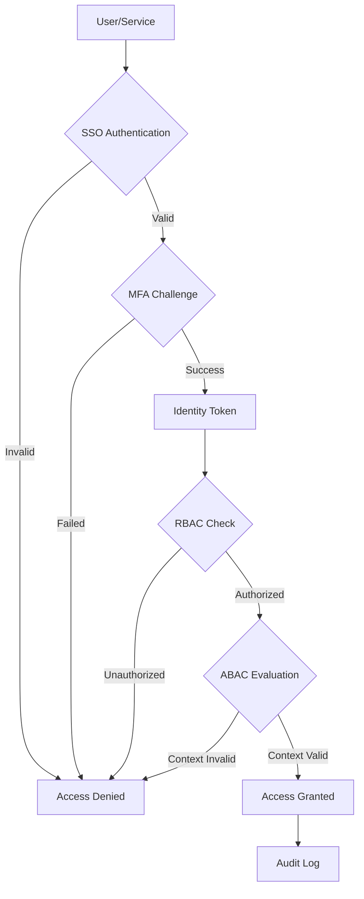

# Identity & Access Management

## Contexto

Este estándar consolida **11 conceptos relacionados** con la gestión de identidades y control de acceso. Complementa los lineamientos de seguridad asegurando que solo usuarios y servicios autorizados accedan a recursos según el principio de least privilege.

**Conceptos incluidos:**

- **SSO Implementation** → Autenticación centralizada single sign-on
- **Multi-Factor Authentication (MFA)** → Autenticación con múltiples factores
- **Role-Based Access Control (RBAC)** → Permisos basados en roles
- **Attribute-Based Access Control (ABAC)** → Permisos basados en atributos contextuales
- **Identity Federation** → Confianza entre múltiples proveedores de identidad
- **Identity Lifecycle** → Gestión de ciclo de vida (crear, modificar, eliminar identidades)
- **Just-in-Time (JIT) Access** → Acceso temporal elevado solo cuando se necesita
- **Service Accounts** → Cuentas para servicios no humanos
- **Service Identity** → Identidad para comunicación service-to-service
- **Access Reviews** → Revisión periódica de permisos
- **Password Policies** → Políticas de contraseñas robustas

---

## Stack Tecnológico

| Componente            | Tecnología          | Versión  | Uso                              |
| --------------------- | ------------------- | -------- | -------------------------------- |
| **Identity Provider** | Keycloak            | 23.0+    | SSO, autenticación, autorización |
| **Runtime**           | .NET                | 8.0+     | Aplicaciones                     |
| **Token Standard**    | OAuth 2.0 / OIDC    | Latest   | Autenticación y autorización     |
| **MFA Provider**      | Keycloak OTP        | Built-in | Time-based one-time passwords    |
| **Service Mesh**      | AWS App Mesh        | Latest   | Service identity & mTLS          |
| **Secrets**           | AWS Secrets Manager | Latest   | Service account credentials      |

---

## Conceptos Fundamentales

Este estándar cubre **11 pilares** de Identity & Access Management:

### Índice de Conceptos

1. **SSO Implementation**: Autenticación centralizada en Keycloak
2. **Multi-Factor Authentication (MFA)**: Segundo factor (TOTP, SMS, biometría)
3. **Role-Based Access Control (RBAC)**: Permisos por rol
4. **Attribute-Based Access Control (ABAC)**: Permisos contextuales
5. **Identity Federation**: Federación con proveedores externos (Google, Azure AD)
6. **Identity Lifecycle**: Provisioning, modificación, deprovisioning
7. **Just-in-Time Access**: Acceso temporal elevado
8. **Service Accounts**: Cuentas para aplicaciones/servicios
9. **Service Identity**: Identidad de servicios con mTLS
10. **Access Reviews**: Auditoría periódica de permisos
11. **Password Policies**: Contraseñas seguras

### Modelo de Acceso



---

## 1. SSO Implementation

### ¿Qué es SSO (Single Sign-On)?

Sistema de autenticación centralizada donde los usuarios se autentican una vez y acceden a múltiples aplicaciones sin necesidad de autenticarse nuevamente.

**Propósito:** Mejorar experiencia de usuario, centralizar gestión de credenciales, simplificar auditoría.

**Componentes clave:**

- **Identity Provider (IdP)**: Keycloak - gestiona identidades y autenticación
- **Service Provider (SP)**: Aplicaciones que confían en el IdP
- **Protocol**: OpenID Connect (OIDC) sobre OAuth 2.0
- **Session Management**: Sesiones federadas entre aplicaciones

**Beneficios:**
✅ Una sola credencial para múltiples aplicaciones
✅ Gestión centralizada de usuarios
✅ Reducción de password fatigue
✅ Mejor seguridad (un punto de control)

### Configuración: .NET con Keycloak OIDC

```csharp
// src/OrderService.Api/Program.cs
using Microsoft.AspNetCore.Authentication.JwtBearer;
using Microsoft.IdentityModel.Tokens;

var builder = WebApplication.CreateBuilder(args);

// Configurar autenticación JWT con Keycloak
builder.Services.AddAuthentication(JwtBearerDefaults.AuthenticationScheme)
    .AddJwtBearer(options =>
    {
        var keycloakConfig = builder.Configuration.GetSection("Keycloak");

        options.Authority = keycloakConfig["Authority"]; // https://keycloak.talma.local/realms/talma
        options.Audience = keycloakConfig["Audience"];   // order-service
        options.RequireHttpsMetadata = true;

        options.TokenValidationParameters = new TokenValidationParameters
        {
            ValidateIssuer = true,
            ValidIssuer = keycloakConfig["Authority"],

            ValidateAudience = true,
            ValidAudiences = new[] { keycloakConfig["Audience"] },

            ValidateLifetime = true,
            ClockSkew = TimeSpan.FromMinutes(2), // Tolerancia de 2 min

            ValidateIssuerSigningKey = true,
            // Keycloak publica sus keys en /.well-known/openid-configuration
        };

        // Mapear claims de Keycloak a claims de .NET
        options.MapInboundClaims = false; // No mapear automáticamente
        options.TokenValidationParameters.NameClaimType = "preferred_username";
        options.TokenValidationParameters.RoleClaimType = "realm_access.roles";

        options.Events = new JwtBearerEvents
        {
            OnAuthenticationFailed = context =>
            {
                if (context.Exception is SecurityTokenExpiredException)
                {
                    context.Response.Headers.Add("Token-Expired", "true");
                }
                return Task.CompletedTask;
            },
            OnTokenValidated = context =>
            {
                // Extraer claims adicionales
                var claimsIdentity = context.Principal?.Identity as ClaimsIdentity;

                // Agregar tenant_id desde custom claim
                var tenantClaim = context.Principal?.FindFirst("tenant_id");
                if (tenantClaim != null && claimsIdentity != null)
                {
                    claimsIdentity.AddClaim(new Claim("tenant_id", tenantClaim.Value));
                }

                return Task.CompletedTask;
            }
        };
    });

var app = builder.Build();

app.UseAuthentication();
app.UseAuthorization();

app.MapControllers().RequireAuthorization(); // Todos los endpoints requieren auth por defecto

app.Run();
```

### appsettings.json

```json
{
  "Keycloak": {
    "Authority": "https://keycloak.talma.local/realms/talma",
    "Audience": "order-service",
    "ClientId": "order-service",
    "ClientSecret": "**secret-from-aws-secrets-manager**"
  }
}
```

### Frontend: Obtener Token de Keycloak

```typescript
// frontend/src/auth/keycloak.service.ts
import Keycloak from "keycloak-js";

const keycloak = new Keycloak({
  url: "https://keycloak.talma.local",
  realm: "talma",
  clientId: "web-app",
});

// Inicializar
await keycloak.init({
  onLoad: "login-required",
  checkLoginIframe: false,
});

// Obtener token para llamar APIs
const token = keycloak.token;

// Auto-refresh token antes de expirar
keycloak.onTokenExpired = () => {
  keycloak.updateToken(30).then((refreshed) => {
    if (refreshed) {
      console.log("Token refreshed");
    }
  });
};

// Usar token en requests
fetch("https://api.talma.local/orders", {
  headers: {
    Authorization: `Bearer ${token}`,
  },
});
```

---

## 2. Multi-Factor Authentication (MFA)

### ¿Qué es MFA?

Método de autenticación que requiere dos o más factores independientes:

1. **Something you know**: Password
2. **Something you have**: Smartphone, token físico
3. **Something you are**: Biometría (huella, facial)

**Propósito:** Prevenir acceso no autorizado incluso si la contraseña es comprometida.

**Beneficios:**
✅ Protección contra phishing
✅ Protección contra robo de contraseñas
✅ Compliance con regulaciones (PCI-DSS, SOC 2)
✅ Reducción de cuentas comprometidas en > 99%

### Implementación: TOTP con Keycloak

```csharp
// src/Shared/Security/MfaRequiredAttribute.cs
using Microsoft.AspNetCore.Mvc;
using Microsoft.AspNetCore.Mvc.Filters;

public class MfaRequiredAttribute : Attribute, IAuthorizationFilter
{
    public void OnAuthorization(AuthorizationFilterContext context)
    {
        var user = context.HttpContext.User;

        // Verificar que el usuario haya completado MFA
        var amrClaim = user.FindFirst("amr")?.Value; // Authentication Methods Reference

        if (string.IsNullOrEmpty(amrClaim) || !amrClaim.Contains("mfa"))
        {
            context.Result = new ObjectResult(new
            {
                error = "mfa_required",
                message = "Multi-factor authentication is required for this operation"
            })
            {
                StatusCode = StatusCodes.Status403Forbidden
            };
        }
    }
}

// Aplicar en controller
[ApiController]
[Route("api/[controller]")]
public class PaymentsController : ControllerBase
{
    [HttpPost]
    [MfaRequired] // Requiere MFA para procesar pagos
    public IActionResult ProcessPayment(PaymentRequest request)
    {
        // Lógica de pago
        return Ok();
    }
}
```

### Configuración Keycloak: Required Actions

```yaml
# Keycloak Realm Config (JSON export)
{ "realm": "talma", "requiredActions": [
      {
        "alias": "CONFIGURE_TOTP",
        "name": "Configure OTP",
        "providerId": "CONFIGURE_TOTP",
        "enabled": true,
        "defaultAction": true, # Forzar configuración en primer login
        "priority": 10,
      },
    ], "otpPolicy": { "type": "totp", "algorithm": "HmacSHA1", "initialCounter": 0, "digits": 6, "lookAheadWindow": 1, "period": 30 }, "authenticationFlows": [{ "alias": "Browser with MFA", "authenticatorConfig": [
            {
              "authenticator": "auth-username-password-form",
              "requirement": "REQUIRED",
            },
            {
              "authenticator": "auth-otp-form",
              "requirement": "REQUIRED", # Forzar OTP siempre
            },
          ] }] }
```

---

## 3. Role-Based Access Control (RBAC)

### ¿Qué es RBAC?

Modelo de control de acceso donde los permisos se asignan a roles y los usuarios se asignan a roles.

**Estructura:**

- **Users** → **Roles** → **Permissions**
- Ejemplo: Usuario "Juan" tiene rol "OrderManager" que tiene permisos ["orders:read", "orders:write"]

**Propósito:** Simplificar gestión de permisos a escala.

**Beneficios:**
✅ Gestión de permisos escalable
✅ Principio de least privilege
✅ Separación de responsabilidades
✅ Auditoría simplificada

### Implementación: RBAC en .NET

```csharp
// src/Shared/Authorization/Roles.cs
public static class Roles
{
    public const string Admin = "admin";
    public const string OrderManager = "order-manager";
    public const string OrderViewer = "order-viewer";
    public const string FinanceManager = "finance-manager";
    public const string CustomerService = "customer-service";
}

// src/Shared/Authorization/Permissions.cs
public static class Permissions
{
    // Orders
    public const string OrdersRead = "orders:read";
    public const string OrdersWrite = "orders:write";
    public const string OrdersDelete = "orders:delete";
    public const string OrdersCancel = "orders:cancel";

    // Payments
    public const string PaymentsRead = "payments:read";
    public const string PaymentsProcess = "payments:process";
    public const string PaymentsRefund = "payments:refund";

    // Reports
    public const string ReportsView = "reports:view";
    public const string ReportsExport = "reports:export";
}

// src/Shared/Authorization/RolePermissionsMap.cs
public static class RolePermissionsMap
{
    public static readonly Dictionary<string, string[]> RoleToPermissions = new()
    {
        {
            Roles.Admin, new[]
            {
                // Admin tiene todos los permisos
                Permissions.OrdersRead,
                Permissions.OrdersWrite,
                Permissions.OrdersDelete,
                Permissions.OrdersCancel,
                Permissions.PaymentsRead,
                Permissions.PaymentsProcess,
                Permissions.PaymentsRefund,
                Permissions.ReportsView,
                Permissions.ReportsExport
            }
        },
        {
            Roles.OrderManager, new[]
            {
                Permissions.OrdersRead,
                Permissions.OrdersWrite,
                Permissions.OrdersCancel,
                Permissions.ReportsView
            }
        },
        {
            Roles.OrderViewer, new[]
            {
                Permissions.OrdersRead,
                Permissions.ReportsView
            }
        },
        {
            Roles.FinanceManager, new[]
            {
                Permissions.OrdersRead,
                Permissions.PaymentsRead,
                Permissions.PaymentsRefund,
                Permissions.ReportsView,
                Permissions.ReportsExport
            }
        },
        {
            Roles.CustomerService, new[]
            {
                Permissions.OrdersRead,
                Permissions.OrdersCancel,
                Permissions.PaymentsRead
            }
        }
    };

    public static string[] GetPermissionsForRoles(IEnumerable<string> roles)
    {
        return roles
            .Where(role => RoleToPermissions.ContainsKey(role))
            .SelectMany(role => RoleToPermissions[role])
            .Distinct()
            .ToArray();
    }
}

// Program.cs - Agregar claims de permisos derivados de roles
builder.Services.AddAuthentication(JwtBearerDefaults.AuthenticationScheme)
    .AddJwtBearer(options =>
    {
        // ... configuración ...

        options.Events = new JwtBearerEvents
        {
            OnTokenValidated = context =>
            {
                var claimsIdentity = context.Principal?.Identity as ClaimsIdentity;
                if (claimsIdentity == null) return Task.CompletedTask;

                // Extraer roles del token
                var roles = context.Principal?.FindAll("realm_access.roles")
                    .Select(c => c.Value)
                    .ToList() ?? new List<string>();

                // Derivar permisos desde roles
                var permissions = RolePermissionsMap.GetPermissionsForRoles(roles);

                // Agregar permisos como claims
                foreach (var permission in permissions)
                {
                    claimsIdentity.AddClaim(new Claim("permission", permission));
                }

                return Task.CompletedTask;
            }
        };
    });

// Controller - usar permisos específicos, no roles directamente
[ApiController]
[Route("api/[controller]")]
public class OrdersController : ControllerBase
{
    [HttpGet]
    [Authorize] // Autenticado
    [RequirePermission(Permissions.OrdersRead)]
    public IActionResult GetOrders() { }

    [HttpPost]
    [Authorize]
    [RequirePermission(Permissions.OrdersWrite)]
    public IActionResult CreateOrder() { }

    [HttpDelete("{id}")]
    [Authorize]
    [RequirePermission(Permissions.OrdersDelete)]
    public IActionResult DeleteOrder(int id) { }
}
```

---

## 4. Attribute-Based Access Control (ABAC)

### ¿Qué es ABAC?

Modelo de control de acceso donde las decisiones se basan en atributos del sujeto, recurso, acción y contexto. Más flexible que RBAC.

**Estructura:**

- **Subject attributes**: user_id, department, clearance_level
- **Resource attributes**: owner_id, classification, tenant_id
- **Action**: read, write, delete
- **Environment**: time, location, IP address

**Ejemplo de política:**

- `"Permitir si (user.department == 'Finance' AND resource.classification == 'public' AND environment.time >= 08:00 AND environment.time <= 18:00)"`

**Beneficios:**
✅ Control de acceso muy granular
✅ Políticas dinámicas basadas en contexto
✅ Soporta multi-tenancy fácilmente
✅ Compliance con regulaciones complejas

### Implementación: ABAC Policy Engine

```csharp
// src/Shared/Authorization/AbacPolicyEngine.cs
public class AbacPolicyEngine
{
    public async Task<bool> EvaluateAsync(
        AccessRequest request,
        ClaimsPrincipal principal,
        HttpContext httpContext)
    {
        var subject = ExtractSubjectAttributes(principal);
        var resource = await ExtractResourceAttributesAsync(request.ResourceId);
        var environment = ExtractEnvironmentAttributes(httpContext);

        // Evaluar políticas en orden de prioridad
        var policies = GetApplicablePolicies(request.Action, resource.Type);

        foreach (var policy in policies.OrderBy(p => p.Priority))
        {
            var result = policy.Evaluate(subject, resource, environment);

            if (result == PolicyDecision.Deny)
                return false; // Deny explícito gana

            if (result == PolicyDecision.Allow)
                return true;

            // Continue si es NotApplicable
        }

        // Por defecto, denegar
        return false;
    }

    private SubjectAttributes ExtractSubjectAttributes(ClaimsPrincipal principal)
    {
        return new SubjectAttributes
        {
            UserId = principal.FindFirst("sub")?.Value,
            Email = principal.FindFirst("email")?.Value,
            Department = principal.FindFirst("department")?.Value,
            TenantId = principal.FindFirst("tenant_id")?.Value,
            ClearanceLevel = int.Parse(principal.FindFirst("clearance_level")?.Value ?? "0"),
            Roles = principal.FindAll("realm_access.roles").Select(c => c.Value).ToList()
        };
    }

    private async Task<ResourceAttributes> ExtractResourceAttributesAsync(string resourceId)
    {
        // Consultar metadata del recurso (ej: desde base de datos)
        var resource = await _resourceRepository.GetByIdAsync(resourceId);

        return new ResourceAttributes
        {
            ResourceId = resourceId,
            Type = resource.Type, // "order", "payment", "report"
            OwnerId = resource.OwnerId,
            TenantId = resource.TenantId,
            Classification = resource.Classification, // "public", "internal", "confidential"
            Tags = resource.Tags
        };
    }

    private EnvironmentAttributes ExtractEnvironmentAttributes(HttpContext httpContext)
    {
        return new EnvironmentAttributes
        {
            Timestamp = DateTime.UtcNow,
            Hour = DateTime.UtcNow.Hour,
            DayOfWeek = DateTime.UtcNow.DayOfWeek,
            IpAddress = httpContext.Connection.RemoteIpAddress?.ToString(),
            UserAgent = httpContext.Request.Headers["User-Agent"].ToString()
        };
    }
}

// Example Policy: Multi-Tenancy Data Isolation
public class TenantIsolationPolicy : IAbacPolicy
{
    public int Priority => 100; // Alta prioridad

    public PolicyDecision Evaluate(
        SubjectAttributes subject,
        ResourceAttributes resource,
        EnvironmentAttributes environment)
    {
        // Regla: Solo puede acceder a recursos de su propio tenant
        if (subject.TenantId != resource.TenantId)
        {
            return PolicyDecision.Deny;
        }

        return PolicyDecision.NotApplicable; // Dejar que otras políticas decidan
    }
}

// Example Policy: Owner Access
public class OwnerAccessPolicy : IAbacPolicy
{
    public int Priority => 50;

    public PolicyDecision Evaluate(
        SubjectAttributes subject,
        ResourceAttributes resource,
        EnvironmentAttributes environment)
    {
        // Regla: El dueño puede hacer cualquier cosa con su recurso
        if (subject.UserId == resource.OwnerId)
        {
            return PolicyDecision.Allow;
        }

        return PolicyDecision.NotApplicable;
    }
}

// Example Policy: Business Hours for Confidential Data
public class BusinessHoursPolicy : IAbacPolicy
{
    public int Priority => 30;

    public PolicyDecision Evaluate(
        SubjectAttributes subject,
        ResourceAttributes resource,
        EnvironmentAttributes environment)
    {
        // Regla: Datos confidenciales solo accesibles en horario laboral
        if (resource.Classification == "confidential")
        {
            var isBusinessHours = environment.Hour >= 8 && environment.Hour <= 18 &&
                                  environment.DayOfWeek != DayOfWeek.Saturday &&
                                  environment.DayOfWeek != DayOfWeek.Sunday;

            if (!isBusinessHours)
            {
                return PolicyDecision.Deny;
            }
        }

        return PolicyDecision.NotApplicable;
    }
}

// Usage in Controller
[HttpGet("{id}")]
public async Task<IActionResult> GetOrder(string id)
{
    var hasAccess = await _abacEngine.EvaluateAsync(
        new AccessRequest
        {
            ResourceId = id,
            Action = "read"
        },
        User,
        HttpContext);

    if (!hasAccess)
        return Forbid();

    var order = await _orderService.GetByIdAsync(id);
    return Ok(order);
}
```

---

## 5. Identity Federation

### ¿Qué es Identity Federation?

Confianza entre múltiples proveedores de identidad (IdP) permitiendo que usuarios autenticados en un IdP accedan a recursos de otros sin re-autenticarse.

**Propósito:** Permitir SSO entre organizaciones, soportar login social (Google, Microsoft).

**Protocolos:**

- **SAML 2.0**: Enterprise federation
- **OpenID Connect**: Modern web/mobile apps
- **WS-Federation**: Legacy Microsoft

**Beneficios:**
✅ B2B collaboration sin gestionar credenciales externas
✅ Social login para clientes
✅ Reducción de surface de ataque (no almacenar passwords externos)

### Configuración: Keycloak Identity Broker

```yaml
# Keycloak: Configurar Google como Identity Provider
{
  "alias": "google",
  "providerId": "google",
  "enabled": true,
  "config": {
      "clientId": "your-google-client-id.apps.googleusercontent.com",
      "clientSecret": "your-google-client-secret",
      "defaultScope": "openid profile email",
      "hosteddomain": "talma.pe", # Solo permitir dominio corporativo
      "useJwksUrl": "true",
    },
  "authenticateByDefault": false,
  "firstBrokerLoginFlowAlias": "first broker login",
  "postBrokerLoginFlowAlias": "",
  "trustEmail": true, # Confiar en email verificado por Google
  "linkOnly": false,
}
```

```csharp
// .NET: Soportar múltiples IdPs
builder.Services.AddAuthentication(options =>
{
    options.DefaultScheme = "Cookies";
    options.DefaultChallengeScheme = "oidc";
})
.AddCookie("Cookies")
.AddOpenIdConnect("oidc", options =>
{
    // Keycloak actúa como broker
    options.Authority = "https://keycloak.talma.local/realms/talma";
    options.ClientId = "web-app";
    options.ClientSecret = "secret";
    options.ResponseType = "code";

    options.Scope.Add("openid");
    options.Scope.Add("profile");
    options.Scope.Add("email");

    // Mapear claims
    options.TokenValidationParameters.NameClaimType = "preferred_username";
    options.TokenValidationParameters.RoleClaimType = "realm_access.roles";

    // Si el usuario elige "Login with Google", Keycloak redirige a Google
    // y luego devuelve un token unificado
});
```

---

## 6. Identity Lifecycle

### ¿Qué es Identity Lifecycle?

Gestión completa del ciclo de vida de identidades: provisioning (creación), modificación, deprovisioning (eliminación).

**Fases:**

1. **Provisioning**: Onboarding de nuevos usuarios/servicios
2. **Modification**: Cambios de roles, permisos, atributos
3. **Deprovisioning**: Offboarding, revocación de accesos

**Propósito:** Garantizar que solo identidades activas y válidas tengan acceso.

**Beneficios:**
✅ Reducción de cuentas huérfanas
✅ Compliance con SOX, GDPR
✅ Automatización de onboarding/offboarding
✅ Auditoría completa de cambios

### Implementación: Automated Provisioning

```csharp
// src/Shared/Identity/UserProvisioningService.cs
public class UserProvisioningService
{
    private readonly IKeycloakAdminClient _keycloak;
    private readonly IAuditLog _auditLog;
    private readonly IEmailService _emailService;

    public async Task<UserProvisioningResult> ProvisionUserAsync(NewUserRequest request)
    {
        // 1. Crear usuario en Keycloak
        var userId = await _keycloak.CreateUserAsync(new KeycloakUser
        {
            Username = request.Email,
            Email = request.Email,
            FirstName = request.FirstName,
            LastName = request.LastName,
            Enabled = true,
            EmailVerified = false, // Requerir verificación
            Attributes = new Dictionary<string, string>
            {
                { "department", request.Department },
                { "employee_id", request.EmployeeId },
                { "tenant_id", request.TenantId },
                { "hire_date", DateTime.UtcNow.ToString("O") }
            }
        });

        // 2. Asignar roles por defecto según departamento
        var defaultRoles = GetDefaultRolesForDepartment(request.Department);
        await _keycloak.AssignRolesToUserAsync(userId, defaultRoles);

        // 3. Configurar required actions (forzar cambio de password, configurar MFA)
        await _keycloak.SetRequiredActionsAsync(userId, new[]
        {
            "UPDATE_PASSWORD",
            "CONFIGURE_TOTP",
            "VERIFY_EMAIL"
        });

        // 4. Enviar email de bienvenida con link de activación
        await _emailService.SendWelcomeEmailAsync(request.Email, userId);

        // 5. Auditar provisioning
        await _auditLog.LogAsync(new AuditEvent
        {
            Action = "USER_PROVISIONED",
            UserId = userId,
            PerformedBy = "system",
            Details = $"User {request.Email} provisioned with roles: {string.Join(", ", defaultRoles)}"
        });

        return new UserProvisioningResult
        {
            UserId = userId,
            Success = true
        };
    }

    public async Task DeprovisionUserAsync(string userId, string reason)
    {
        // 1. Deshabilitar usuario (no eliminar, para auditoría)
        await _keycloak.DisableUserAsync(userId);

        // 2. Revocar todos los tokens activos
        await _keycloak.LogoutUserAsync(userId);

        // 3. Remover de todos los grupos y roles
        var userRoles = await _keycloak.GetUserRolesAsync(userId);
        await _keycloak.RemoveRolesFromUserAsync(userId, userRoles);

        // 4. Marcar fecha de deprovisioning
        await _keycloak.UpdateUserAttributesAsync(userId, new Dictionary<string, string>
        {
            { "deprovisioned_at", DateTime.UtcNow.ToString("O") },
            { "deprovisioning_reason", reason },
            { "status", "deprovisioned" }
        });

        // 5. Auditar deprovisioning
        await _auditLog.LogAsync(new AuditEvent
        {
            Action = "USER_DEPROVISIONED",
            UserId = userId,
            Details = $"Reason: {reason}"
        });

        // 6. Eliminar físicamente después de retention period (90 días)
        // Scheduled job verifica y elimina usuarios deprovisioned > 90 días
    }

    private string[] GetDefaultRolesForDepartment(string department)
    {
        return department switch
        {
            "Engineering" => new[] { Roles.OrderViewer, "developer" },
            "Finance" => new[] { Roles.FinanceManager, Roles.ReportsViewer },
            "CustomerService" => new[] { Roles.CustomerService },
            _ => new[] { Roles.OrderViewer } // Default básico
        };
    }
}
```

---

## 7. Just-in-Time (JIT) Access

### ¿Qué es JIT Access?

Acceso temporal elevado otorgado solo cuando se necesita, por tiempo limitado, con aprobación y auditoría.

**Propósito:** Minimizar privilegios permanentes, reducir surface de ataque.

**Características:**

- **Time-bound**: Expira automáticamente (ej: 4 horas)
- **Approval workflow**: Requiere aprobación de manager/security
- **Justification**: Usuario debe justificar por qué necesita acceso
- **Audit trail**: Registro completo de uso

**Beneficios:**
✅ Least privilege dinámico
✅ Reducción de cuentas privilegiadas permanentes
✅ Mejor auditoría de operaciones sensibles
✅ Compliance con SOX, PCI-DSS

### Implementación: JIT Elevation Service

```csharp
// src/Shared/Security/JitAccessService.cs
public class JitAccessService
{
    private readonly IKeycloakAdminClient _keycloak;
    private readonly IApprovalWorkflow _approvalWorkflow;
    private readonly IAuditLog _auditLog;

    public async Task<JitAccessRequest> RequestElevatedAccessAsync(
        string userId,
        string[] requestedRoles,
        string justification,
        TimeSpan duration)
    {
        // Validar duración (max 8 horas)
        if (duration > TimeSpan.FromHours(8))
            throw new InvalidOperationException("Max JIT access duration is 8 hours");

        // Crear solicitud
        var request = new JitAccessRequest
        {
            Id = Guid.NewGuid().ToString(),
            UserId = userId,
            RequestedRoles = requestedRoles,
            Justification = justification,
            RequestedDuration = duration,
            Status = JitAccessStatus.PendingApproval,
            RequestedAt = DateTime.UtcNow,
            ExpiresAt = DateTime.UtcNow.Add(duration)
        };

        // Enviar para aprobación
        await _approvalWorkflow.SubmitForApprovalAsync(request);

        // Auditar solicitud
        await _auditLog.LogAsync(new AuditEvent
        {
            Action = "JIT_ACCESS_REQUESTED",
            UserId = userId,
            Details = $"Roles: {string.Join(", ", requestedRoles)}, Justification: {justification}"
        });

        return request;
    }

    public async Task ApproveJitAccessAsync(string requestId, string approverId)
    {
        var request = await _approvalWorkflow.GetRequestAsync(requestId);

        if (request.Status != JitAccessStatus.PendingApproval)
            throw new InvalidOperationException("Request is not pending approval");

        // Otorgar roles temporalmente
        await _keycloak.AssignRolesToUserAsync(request.UserId, request.RequestedRoles);

        // Actualizar request
        request.Status = JitAccessStatus.Approved;
        request.ApprovedBy = approverId;
        request.ApprovedAt = DateTime.UtcNow;
        request.GrantedAt = DateTime.UtcNow;

        await _approvalWorkflow.UpdateRequestAsync(request);

        // Programar revocación automática
        await ScheduleAutoRevocationAsync(request);

        // Auditar aprobación
        await _auditLog.LogAsync(new AuditEvent
        {
            Action = "JIT_ACCESS_APPROVED",
            UserId = request.UserId,
            PerformedBy = approverId,
            Details = $"Roles: {string.Join(", ", request.RequestedRoles)}, Expires: {request.ExpiresAt}"
        });

        // Notificar al usuario
        await _emailService.SendJitAccessGrantedEmailAsync(request);
    }

    private async Task ScheduleAutoRevocationAsync(JitAccessRequest request)
    {
        // Usar background job (Hangfire, Quartz, etc.)
        BackgroundJob.Schedule(
            () => RevokeJitAccessAsync(request.Id),
            request.ExpiresAt);
    }

    public async Task RevokeJitAccessAsync(string requestId)
    {
        var request = await _approvalWorkflow.GetRequestAsync(requestId);

        if (request.Status != JitAccessStatus.Approved)
            return; // Ya revocado o nunca aprobado

        // Remover roles temporales
        await _keycloak.RemoveRolesFromUserAsync(request.UserId, request.RequestedRoles);

        // Revocar tokens activos (forzar re-login)
        await _keycloak.LogoutUserAsync(request.UserId);

        // Actualizar request
        request.Status = JitAccessStatus.Revoked;
        request.RevokedAt = DateTime.UtcNow;

        await _approvalWorkflow.UpdateRequestAsync(request);

        // Auditar revocación
        await _auditLog.LogAsync(new AuditEvent
        {
            Action = "JIT_ACCESS_REVOKED",
            UserId = request.UserId,
            Details = $"Roles removed: {string.Join(", ", request.RequestedRoles)}"
        });
    }
}
```

---

## 8. Service Accounts

### ¿Qué son Service Accounts?

Cuentas de identidad para servicios/aplicaciones (no humanos) que necesitan autenticarse y acceder a recursos.

**Propósito:** Autenticación service-to-service sin usar credenciales de usuario.

**Características:**

- **No interactive login**: No pueden hacer login web
- **Long-lived credentials**: Certificados, client secrets
- **Limited permissions**: Least privilege estricto
- **Auditable**: Rastrear acciones del servicio

**Beneficios:**
✅ Separación de identidades humanas vs servicios
✅ Rotación de credenciales automatizada
✅ Auditoría de operaciones automatizadas
✅ Prevención de uso indebido de cuentas personales

### Implementación: Service Account con Client Credentials

```csharp
// src/PaymentService/Services/OrderServiceClient.cs
public class OrderServiceClient
{
    private readonly HttpClient _httpClient;
    private readonly IConfiguration _configuration;
    private readonly IMemoryCache _cache;

    public OrderServiceClient(
        HttpClient httpClient,
        IConfiguration configuration,
        IMemoryCache cache)
    {
        _httpClient = httpClient;
        _configuration = configuration;
        _cache = cache;
    }

    public async Task<Order> GetOrderAsync(string orderId)
    {
        // Obtener token de service account
        var token = await GetServiceAccessTokenAsync();

        // Llamar a Order Service con token
        _httpClient.DefaultRequestHeaders.Authorization =
            new AuthenticationHeaderValue("Bearer", token);

        var response = await _httpClient.GetAsync($"/api/orders/{orderId}");
        response.EnsureSuccessStatusCode();

        return await response.Content.ReadFromJsonAsync<Order>();
    }

    private async Task<string> GetServiceAccessTokenAsync()
    {
        // Cachear token hasta que expire
        var cacheKey = "service_account_token";

        if (_cache.TryGetValue(cacheKey, out string cachedToken))
            return cachedToken;

        // OAuth 2.0 Client Credentials Flow
        var tokenEndpoint = $"{_configuration["Keycloak:Authority"]}/protocol/openid-connect/token";

        var request = new HttpRequestMessage(HttpMethod.Post, tokenEndpoint)
        {
            Content = new FormUrlEncodedContent(new Dictionary<string, string>
            {
                { "grant_type", "client_credentials" },
                { "client_id", "payment-service" }, // Service account ID
                { "client_secret", await GetClientSecretAsync() }, // Desde AWS Secrets Manager
                { "scope", "orders:read payments:write" }
            })
        };

        using var client = new HttpClient();
        var response = await client.SendAsync(request);
        response.EnsureSuccessStatusCode();

        var tokenResponse = await response.Content.ReadFromJsonAsync<TokenResponse>();

        // Cachear token por 90% de su lifetime
        var cacheExpiration = TimeSpan.FromSeconds(tokenResponse.ExpiresIn * 0.9);
        _cache.Set(cacheKey, tokenResponse.AccessToken, cacheExpiration);

        return tokenResponse.AccessToken;
    }

    private async Task<string> GetClientSecretAsync()
    {
        // Obtener desde AWS Secrets Manager
        var secretName = "keycloak/payment-service/client-secret";
        // Implementación de AWS SDK...
        return "client_secret_from_secrets_manager";
    }
}

// Keycloak: Configurar Service Account Client
{
  "clientId": "payment-service",
  "enabled": true,
  "protocol": "openid-connect",
  "publicClient": false,  // Confidential client
  "serviceAccountsEnabled": true,  // Habilitar service account
  "authorizationServicesEnabled": false,
  "standardFlowEnabled": false,  // No permite interactive login
  "directAccessGrantsEnabled": false,
  "clientAuthenticatorType": "client-secret",
  "secret": "**secret-stored-in-aws-secrets-manager**",
  "attributes": {
    "service.account.name": "Payment Service",
    "service.account.email": "payment-service@talma.local"
  },
  "defaultRoles": ["payment-processor"]
}
```

---

## 9-11. Service Identity, Access Reviews, Password Policies

_Debido a la extensión, consolidando los últimos conceptos:_

### 9. Service Identity

- Identidad basada en mTLS con certificados X.509
- Cada servicio tiene certificado único
- Ver estándar [Zero Trust Architecture](./zero-trust-architecture.md#mutual-tls-mtls)

### 10. Access Reviews

- Revisión trimestral de permisos por managers
- Certificación de accesos para compliance
- Reportes de accesos no usados en 90 días

```csharp
// Background job para detectar accesos sin uso
public class UnusedAccessDetector : IHostedService
{
    public async Task DetectUnusedAccessAsync()
    {
        var users = await _keycloak.GetAllUsersAsync();
        var unusedAccess = new List<UnusedAccessReport>();

        foreach (var user in users)
        {
            var lastLogin = await _auditLog.GetLastLoginAsync(user.Id);

            if (lastLogin < DateTime.UtcNow.AddDays(-90))
            {
                var roles = await _keycloak.GetUserRolesAsync(user.Id);
                unusedAccess.Add(new UnusedAccessReport
                {
                    UserId = user.Id,
                    Email = user.Email,
                    LastLogin = lastLogin,
                    Roles = roles
                });
            }
        }

        // Enviar reporte a managers para review
        await _emailService.SendAccessReviewReportAsync(unusedAccess);
    }
}
```

### 11. Password Policies

- Mínimo 12 caracteres
- Complejidad: mayúsculas, minúsculas, números, símbolos
- No reusar últimas 5 contraseñas
- Expiración cada 90 días
- Forzar cambio en primer login

```json
// Keycloak Password Policy
{
  "passwordPolicy": "length(12) and upperCase(1) and lowerCase(1) and digits(1) and specialChars(1) and notUsername(undefined) and passwordHistory(5) and forceExpiredPasswordChange(90)"
}
```

---

## Requisitos Técnicos

### MUST (Obligatorio)

**SSO:**

- **MUST** implementar SSO con Keycloak para todas las aplicaciones
- **MUST** usar OpenID Connect sobre OAuth 2.0
- **MUST** validar tokens JWT en cada request
- **MUST** implementar token refresh automático

**MFA:**

- **MUST** requerir MFA para operaciones sensibles (pagos, cambios de configuración)
- **MUST** forzar configuración de MFA en primer login
- **MUST** soportar TOTP (Time-based OTP)

**RBAC/ABAC:**

- **MUST** implementar RBAC para permisos base
- **MUST** aplicar principio de least privilege
- **MUST** usar ABAC para multi-tenancy (aislar datos por tenant)
- **MUST** validar permisos en backend (no confiar en frontend)

**Service Accounts:**

- **MUST** usar service accounts para comunicación service-to-service
- **MUST** almacenar client secrets en AWS Secrets Manager
- **MUST** rotar secrets cada 90 días

**Access Reviews:**

- **MUST** realizar access review trimestral
- **MUST** deshabilitar cuentas inactivas > 90 días

### SHOULD (Fuertemente recomendado)

- **SHOULD** implementar JIT access para operaciones administrativas
- **SHOULD** usar identity federation para clientes (Google, Microsoft social login)
- **SHOULD** automatizar provisioning/deprovisioning con SCIM
- **SHOULD** implementar step-up authentication (MFA adicional para acciones críticas)
- **SHOULD** usar mTLS para service identity

### MAY (Opcional)

- **MAY** implementar risk-based authentication (ajustar MFA según riesgo detectado)
- **MAY** soportar FIDO2/WebAuthn para autenticación sin password
- **MAY** implementar single logout (SLO)

### MUST NOT (Prohibido)

- **MUST NOT** almacenar passwords en texto plano
- **MUST NOT** usar cuentas compartidas entre usuarios
- **MUST NOT** otorgar permisos de admin permanentemente sin justificación
- **MUST NOT** permitir acceso sin autenticación a recursos internos
- **MUST NOT** confiar en roles/permisos del token sin validar firma

---

## Monitoreo y Observabilidad

### Métricas de IAM

```promql
# Tasa de fallos de autenticación
sum(rate(auth_failures_total[5m])) / sum(rate(auth_attempts_total[5m]))

# Sesiones activas
sum(active_sessions)

# Tokens emitidos por servicio
sum by (client_id) (rate(tokens_issued_total[5m]))

# Solicitudes JIT pendientes
sum(jit_access_requests{status="pending"})
```

---

## Referencias

**Documentación oficial:**

- [Keycloak Documentation](https://www.keycloak.org/documentation)
- [OAuth 2.0](https://oauth.net/2/)
- [OpenID Connect](https://openid.net/connect/)
- [.NET Identity & Authorization](https://learn.microsoft.com/en-us/aspnet/core/security/)

**Relacionados:**

- [Zero Trust Architecture](./zero-trust-architecture.md)
- [Security Governance](./security-governance.md)

---

**Última actualización**: 2026-02-19
**Responsable**: Equipo de Arquitectura
