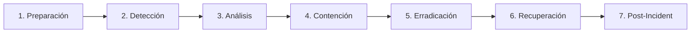

# Estándar Técnico — Programa de Respuesta a Incidentes

---

## 1. Propósito

Establecer programa integral de **Incident Response** según **NIST Cybersecurity Framework (CSF)** y **Google SRE Book**, garantizando detección temprana, respuesta coordinada, comunicación efectiva y aprendizaje continuo mediante postmortems.

---

## 2. Alcance

**Aplica a:**

- Incidentes de seguridad (breaches, vulnerabilidades explotadas)
- Incidentes de disponibilidad (outages, degradación de servicio)
- Incidentes de integridad de datos (corrupción, pérdida)
- Todos los servicios críticos y producción

**No aplica a:**

- Bugs menores sin impacto en usuarios
- Mantenimientos planificados
- Cambios de configuración rutinarios

---

## 3. Fases del Programa (NIST CSF)



| Fase              | Descripción                             | Herramientas                |
| ----------------- | --------------------------------------- | --------------------------- |
| **Preparación**   | Roles, playbooks, simulacros            | PagerDuty, Runbooks         |
| **Detección**     | Monitoreo, alertas, threat detection    | CloudWatch, GuardDuty, SIEM |
| **Análisis**      | Clasificación, impacto, causa raíz      | Logs, X-Ray, CloudTrail     |
| **Contención**    | Aislar afectación, prevenir propagación | WAF, Security Groups, IAM   |
| **Erradicación**  | Eliminar causa raíz (patch, revert)     | Deployments, IAM revoke     |
| **Recuperación**  | Restaurar servicio normal               | Rollback, DB restore        |
| **Post-Incident** | Postmortem, acciones correctivas        | Confluence, Jira            |

---

## 4. Requisitos Obligatorios 🔴

### 4.1 Roles y Responsabilidades

- [ ] **Incident Commander (IC)**: lidera respuesta, toma decisiones críticas
- [ ] **Technical Lead**: diagnóstico técnico, ejecución de remediación
- [ ] **Communications Lead**: actualiza stakeholders, status page
- [ ] **Roles documentados** en wiki con contactos 24/7 (PagerDuty)

### 4.2 Clasificación de Incidentes

| Severidad | Criterio                                          | SLA Respuesta | SLA Resolución | Notificación   |
| --------- | ------------------------------------------------- | ------------- | -------------- | -------------- |
| **SEV-1** | Servicio crítico caído, data breach               | <15 min       | <4 horas       | CTO, CEO       |
| **SEV-2** | Degradación significativa, vulnerabilidad crítica | <30 min       | <8 horas       | VP Engineering |
| **SEV-3** | Impacto menor, funcionalidad no crítica           | <2 horas      | <24 horas      | Tech Lead      |
| **SEV-4** | Sin impacto en usuarios                           | <1 día        | <1 semana      | Equipo         |

### 4.3 Playbooks Obligatorios

Documentar en wiki con pasos específicos para:

- [ ] **Data Breach**: aislamiento, notificación compliance, forensics
- [ ] **DDoS Attack**: activación AWS Shield, rate limiting, WAF rules
- [ ] **Database Outage**: failover a replica, point-in-time recovery
- [ ] **API Gateway Failure**: rollback deployment, cache activation
- [ ] **Leaked Credentials**: rotación secretos, revocación IAM, audit trail

**Formato de Playbook:**

````markdown
## Playbook: Database Outage (RDS)

### Síntomas

- Health checks fallan
- Timeout en queries
- CloudWatch alarm: HighCPU / LowConnections

### Respuesta Inmediata (< 5 min)

1. Activar PagerDuty incident SEV-1
2. Verificar RDS status en AWS Console
3. Si RDS down: iniciar failover a replica (us-east-1b)
   ```bash
   aws rds failover-db-cluster --db-cluster-identifier prod-db
   ```
````

1. Actualizar status page: "Investigating database connectivity issues"

### Diagnóstico (5-15 min)

- Revisar CloudWatch metrics: CPU, IOPS, connections
- Verificar slow query log (RDS Enhanced Monitoring)
- Comprobar security groups / network ACLs

### Contención (15-30 min)

- Si causa: queries lentas → activar read replicas, kill queries
- Si causa: infraestructura → escalar RDS instance, añadir IOPS

### Recuperación

- Validar health checks OK
- Smoke tests: API calls a endpoints críticos
- Monitorear 2 horas post-recovery

### Post-Incident

- Postmortem obligatorio (template en Confluence)
- Acciones correctivas: indexar tablas, optimizar queries, etc.

````

### 4.4 Threat Detection

- [ ] **AWS GuardDuty** activo en todas las cuentas
- [ ] **CloudTrail** habilitado con alertas para acciones críticas:
  - Root account usage
  - IAM policy changes
  - Security group modifications
- [ ] **WAF rules** para OWASP Top 10
- [ ] **Alertas CloudWatch** para métricas anómalas (CPU >80%, 5XX >10%)

### 4.5 Simulacros (Drills)

- [ ] **Quarterly drills** (cada 3 meses) para escenarios SEV-1/SEV-2
- [ ] Participación obligatoria: IC, Tech Leads, Communications
- [ ] Métricas capturadas: tiempo detección → contención → resolución
- [ ] Mejoras al programa basadas en lecciones aprendidas

### 4.6 Postmortems

**Obligatorio para SEV-1 y SEV-2**, dentro de 48 horas:

```markdown
## Postmortem: [Título del Incidente]

**Fecha:** YYYY-MM-DD
**Duración:** HH:MM (desde detección a resolución completa)
**Severidad:** SEV-X
**Servicios Afectados:** API Orders, Checkout
**Impacto:** 15K usuarios, 30 min downtime

### Timeline

| Hora | Evento |
|------|--------|
| 14:23 | PagerDuty alert: API 5XX >50% |
| 14:25 | IC declarado, equipo movilizado |
| 14:30 | Causa identificada: deployment v1.2.3 |
| 14:35 | Rollback iniciado |
| 14:42 | Servicio restaurado |
| 15:30 | Postmortem call |

### Causa Raíz

Deployment v1.2.3 incluyó cambio en query SQL sin índice, generando timeout en 80% de requests.

### Qué Funcionó

- Detección rápida (<2 min desde síntomas)
- Rollback automatizado exitoso
- Comunicación clara en Slack #incidents

### Qué Falló

- Pipeline CI/CD no detectó query sin índice
- Sin smoke tests post-deployment en staging

### Acciones Correctivas

- [ ] Agregar índice en `orders.customer_id` (responsable: DB team, ETA: 2024-01-20)
- [ ] Implementar query analyzer en CI (responsable: DevOps, ETA: 2024-02-01)
- [ ] Smoke tests obligatorios post-deploy staging (responsable: QA, ETA: 2024-01-25)
````

**Cultura Blameless:**

- Postmortems NO buscan culpables, sino mejoras sistémicas
- Foco en procesos/herramientas, no personas

---

## 5. Herramientas Aprobadas

| Componente              | Tecnología             | Observaciones                          |
| ----------------------- | ---------------------- | -------------------------------------- |
| **Incident Management** | PagerDuty              | Alerting, escalation, on-call rotation |
| **Logging**             | CloudWatch Logs + Loki | Centralizado para análisis             |
| **Threat Detection**    | AWS GuardDuty          | Machine learning para anomalías        |
| **Audit Trail**         | AWS CloudTrail         | Todas las API calls AWS                |
| **WAF**                 | AWS WAF                | Protección OWASP Top 10                |
| **Status Page**         | Statuspage.io          | Comunicación con usuarios              |
| **Postmortems**         | Confluence             | Documentación estructurada             |

---

## 6. Prohibiciones

- ❌ Respuesta ad-hoc sin playbook (para escenarios conocidos)
- ❌ Incidentes SEV-1/SEV-2 sin postmortem
- ❌ Cambios en producción durante incidente activo (salvo rollback)
- ❌ Comunicación fragmentada (usar único canal: Slack #incidents)
- ❌ Postmortems con búsqueda de culpables (cultura blameless)
- ❌ Simulacros sin métricas de tiempo de respuesta

---

## 7. Validación

**Checklist de cumplimiento:**

- [ ] Roles (IC, Tech Lead, Comms Lead) documentados y asignados
- [ ] PagerDuty configurado con rotación 24/7
- [ ] Playbooks para top 5 escenarios de riesgo
- [ ] GuardDuty activo, alertas configuradas
- [ ] CloudTrail habilitado con alertas para acciones críticas
- [ ] Quarterly drills ejecutados y documentados
- [ ] Postmortems 100% para SEV-1/SEV-2 con acciones correctivas trackeadas en Jira

**Métricas de cumplimiento:**

| Métrica                       | Target          | Verificación      |
| ----------------------------- | --------------- | ----------------- |
| Tiempo detección SEV-1        | <15 min         | PagerDuty logs    |
| Tiempo resolución SEV-1       | <4 horas        | Incident reports  |
| Postmortems completados       | 100% (SEV-1/2)  | Confluence audit  |
| Simulacros por año            | ≥4              | Calendario drills |
| Acciones correctivas cerradas | >80% en 30 días | Jira reports      |

Incumplimientos en SLA SEV-1 escalan a VP Engineering.

---

## 8. Referencias

- [NIST Cybersecurity Framework (CSF)](https://www.nist.gov/cyberframework)
- [Google SRE Book — Incident Response](https://sre.google/sre-book/managing-incidents/)
- [AWS Incident Response Guide](https://docs.aws.amazon.com/whitepapers/latest/aws-security-incident-response-guide/)
- [Estándar: Logging Estructurado](../observabilidad/01-logging.md)
- [ADR-021: Observabilidad](../../../decisiones-de-arquitectura/adr-021-observabilidad.md)
