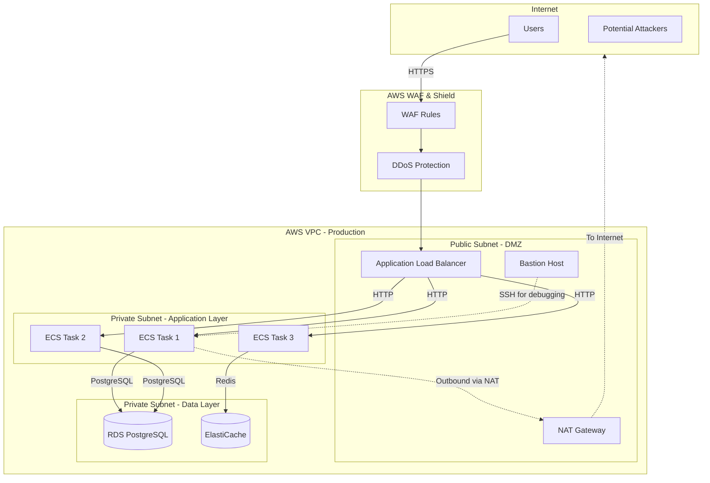

# Network Security

## Contexto

Este estándar consolida **9 conceptos relacionados** con seguridad de red y aislamiento. Complementa Zero Trust implementando defensa en profundidad con múltiples capas de seguridad de red.

**Conceptos incluidos:**

- **Network Segmentation** → Dividir red en segmentos aislados (VPC, subnets)
- **Network Access Controls** → Controlar tráfico entre segmentos (Security Groups, NACLs)
- **Environment Isolation** → Separar ambientes (dev/staging/prod)
- **Tenant Isolation** → Aislar tenants en multi-tenancy
- **Perimeter Security** → Proteger perímetro (bastion hosts, VPN)
- **WAF & DDoS Protection** → Web Application Firewall y protección DDoS
- **Orchestration Network Policies** → Políticas de red en ECS/Kubernetes
- **Attack Surface Reduction** → Minimizar superficie de ataque

---

## Stack Tecnológico

| Componente                  | Tecnología      | Versión  | Uso                           |
| --------------------------- | --------------- | -------- | ----------------------------- |
| **Cloud Platform**          | AWS             | Latest   | Infraestructura de red        |
| **Network**                 | AWS VPC         | Latest   | Virtual Private Cloud         |
| **Firewall**                | Security Groups | Latest   | Stateful firewall             |
| **Network ACL**             | AWS NACL        | Latest   | Stateless firewall            |
| **Load Balancer**           | AWS ALB         | Latest   | Application Load Balancer     |
| **WAF**                     | AWS WAF         | Latest   | Web Application Firewall      |
| **DDoS Protection**         | AWS Shield      | Standard | Protección DDoS               |
| **DNS**                     | AWS Route 53    | Latest   | DNS con health checks         |
| **Container Orchestration** | AWS ECS Fargate | Latest   | Orquestación de contenedores  |
| **Service Mesh**            | AWS App Mesh    | Latest   | Service-to-service networking |
| **IaC**                     | Terraform       | 1.7+     | Infraestructura como código   |

---

## Conceptos Fundamentales

Este estándar cubre **9 pilares** de seguridad de red:

### Índice de Conceptos

1. **Network Segmentation**: Dividir en subnets por función (DMZ, app, data)
2. **Network Access Controls**: Security Groups y NACLs
3. **Environment Isolation**: VPCs separadas por ambiente
4. **Tenant Isolation**: Aislamiento en multi-tenancy
5. **Perimeter Security**: Bastion hosts, VPN, endpoints privados
6. **WAF & DDoS**: Firewall aplicativo y protección volumétrica
7. **Orchestration Network Policies**: ECS task networking, service mesh
8. **Attack Surface Reduction**: Minimizar exposure
9. **Private Connectivity**: VPC Peering, PrivateLink

### Arquitectura de Red



---

## 1. Network Segmentation

### ¿Qué es Network Segmentation?

Dividir la red en segmentos lógicos aislados (subnets) basados en función, sensibilidad de datos o nivel de confianza. Implementa microsegmentación para limitar blast radius.

**Propósito:** Contener brechas de seguridad y limitar movimiento lateral.

**Tipos de subnets:**

- **Public Subnet (DMZ)**: Accesible desde Internet (ALB, NAT Gateway)
- **Private Subnet - App**: Sin acceso directo a Internet (aplicaciones)
- **Private Subnet - Data**: Totalmente aislada (bases de datos)

**Beneficios:**
✅ Limita blast radius de compromiso
✅ Facilita compliance (aislar datos sensibles)
✅ Previene movimiento lateral
✅ Mejor performance (tráfico local en subnet)

### Terraform: VPC con 3 Capas

```hcl
# terraform/modules/vpc/main.tf

# VPC principal
resource "aws_vpc" "main" {
  cidr_block           = var.vpc_cidr
  enable_dns_hostnames = true
  enable_dns_support   = true

  tags = {
    Name        = "${var.environment}-vpc"
    Environment = var.environment
  }
}

# Internet Gateway (para public subnet)
resource "aws_internet_gateway" "main" {
  vpc_id = aws_vpc.main.id

  tags = {
    Name = "${var.environment}-igw"
  }
}

# --- PUBLIC SUBNETS (DMZ Layer) ---
resource "aws_subnet" "public" {
  count = length(var.availability_zones)

  vpc_id                  = aws_vpc.main.id
  cidr_block              = cidrsubnet(var.vpc_cidr, 8, count.index)
  availability_zone       = var.availability_zones[count.index]
  map_public_ip_on_launch = true

  tags = {
    Name        = "${var.environment}-public-${var.availability_zones[count.index]}"
    Tier        = "public"
    TrustBoundary = "dmz"
  }
}

# Route table para public subnets
resource "aws_route_table" "public" {
  vpc_id = aws_vpc.main.id

  route {
    cidr_block = "0.0.0.0/0"
    gateway_id = aws_internet_gateway.main.id
  }

  tags = {
    Name = "${var.environment}-public-rt"
  }
}

resource "aws_route_table_association" "public" {
  count = length(aws_subnet.public)

  subnet_id      = aws_subnet.public[count.index].id
  route_table_id = aws_route_table.public.id
}

# --- PRIVATE SUBNETS - APPLICATION LAYER ---
resource "aws_subnet" "private_app" {
  count = length(var.availability_zones)

  vpc_id            = aws_vpc.main.id
  cidr_block        = cidrsubnet(var.vpc_cidr, 8, count.index + 10)
  availability_zone = var.availability_zones[count.index]

  tags = {
    Name          = "${var.environment}-private-app-${var.availability_zones[count.index]}"
    Tier          = "private"
    TrustBoundary = "application"
  }
}

# NAT Gateway (para outbound de private subnets)
resource "aws_eip" "nat" {
  count  = length(var.availability_zones)
  domain = "vpc"

  tags = {
    Name = "${var.environment}-nat-eip-${count.index}"
  }
}

resource "aws_nat_gateway" "main" {
  count = length(var.availability_zones)

  allocation_id = aws_eip.nat[count.index].id
  subnet_id     = aws_subnet.public[count.index].id

  tags = {
    Name = "${var.environment}-nat-${count.index}"
  }

  depends_on = [aws_internet_gateway.main]
}

# Route table para private app subnets
resource "aws_route_table" "private_app" {
  count = length(var.availability_zones)

  vpc_id = aws_vpc.main.id

  route {
    cidr_block     = "0.0.0.0/0"
    nat_gateway_id = aws_nat_gateway.main[count.index].id
  }

  tags = {
    Name = "${var.environment}-private-app-rt-${count.index}"
  }
}

resource "aws_route_table_association" "private_app" {
  count = length(aws_subnet.private_app)

  subnet_id      = aws_subnet.private_app[count.index].id
  route_table_id = aws_route_table.private_app[count.index].id
}

# --- PRIVATE SUBNETS - DATA LAYER ---
resource "aws_subnet" "private_data" {
  count = length(var.availability_zones)

  vpc_id            = aws_vpc.main.id
  cidr_block        = cidrsubnet(var.vpc_cidr, 8, count.index + 20)
  availability_zone = var.availability_zones[count.index]

  tags = {
    Name          = "${var.environment}-private-data-${var.availability_zones[count.index]}"
    Tier          = "private"
    TrustBoundary = "data"
  }
}

# Route table para data layer (SIN acceso a Internet)
resource "aws_route_table" "private_data" {
  vpc_id = aws_vpc.main.id

  # NO hay route a Internet Gateway ni NAT Gateway

  tags = {
    Name = "${var.environment}-private-data-rt"
  }
}

resource "aws_route_table_association" "private_data" {
  count = length(aws_subnet.private_data)

  subnet_id      = aws_subnet.private_data[count.index].id
  route_table_id = aws_route_table.private_data.id
}
```

---

## 2. Network Access Controls

### ¿Qué son Network Access Controls?

Reglas de firewall que permiten/deniegan tráfico entre segmentos de red. AWS ofrece dos tipos: Security Groups (stateful) y NACLs (stateless).

**Componentes:**

- **Security Groups**: Firewall a nivel de instancia (stateful, retorno automático)
- **Network ACLs**: Firewall a nivel de subnet (stateless, reglas explícitas)
- **Principle of Least Privilege**: Solo permitir tráfico estrictamente necesario

**Beneficios:**
✅ Control granular de tráfico
✅ Defensa en profundidad (múltiples capas)
✅ Prevención de acceso no autorizado
✅ Compliance PCI-DSS, HIPAA

### Terraform: Security Groups por Capa

```hcl
# terraform/modules/security-groups/main.tf

# --- ALB Security Group (Public Layer) ---
resource "aws_security_group" "alb" {
  name_description = "${var.environment}-alb-sg"
  description      = "Security group for Application Load Balancer"
  vpc_id           = var.vpc_id

  # Ingress: HTTPS desde Internet
  ingress {
    description = "HTTPS from Internet"
    from_port   = 443
    to_port     = 443
    protocol    = "tcp"
    cidr_blocks = ["0.0.0.0/0"]
  }

  # Ingress: HTTP redirect (redirigir a HTTPS)
  ingress {
    description = "HTTP redirect"
    from_port   = 80
    to_port     = 80
    protocol    = "tcp"
    cidr_blocks = ["0.0.0.0/0"]
  }

  # Egress: Solo a app layer en puerto 8080
  egress {
    description     = "To application layer"
    from_port       = 8080
    to_port         = 8080
    protocol        = "tcp"
    security_groups = [aws_security_group.app.id]
  }

  tags = {
    Name        = "${var.environment}-alb-sg"
    Layer       = "dmz"
    ManagedBy   = "terraform"
  }
}

# --- Application Security Group (Private App Layer) ---
resource "aws_security_group" "app" {
  name        = "${var.environment}-app-sg"
  description = "Security group for application containers"
  vpc_id      = var.vpc_id

  # Ingress: Solo desde ALB en puerto 8080
  ingress {
    description     = "From ALB"
    from_port       = 8080
    to_port         = 8080
    protocol        = "tcp"
    security_groups = [aws_security_group.alb.id]
  }

  # Ingress: Service-to-service communication
  ingress {
    description = "Service mesh communication"
    from_port   = 8080
    to_port     = 8080
    protocol    = "tcp"
    self        = true  # Permite comunicación entre instancias del mismo SG
  }

  # Egress: A base de datos en puerto 5432
  egress {
    description     = "To PostgreSQL"
    from_port       = 5432
    to_port         = 5432
    protocol        = "tcp"
    security_groups = [aws_security_group.database.id]
  }

  # Egress: A Redis en puerto 6379
  egress {
    description     = "To Redis"
    from_port       = 6379
    to_port         = 6379
    protocol        = "tcp"
    security_groups = [aws_security_group.cache.id]
  }

  # Egress: A Kafka en puerto 9092
  egress {
    description     = "To Kafka"
    from_port       = 9092
    to_port         = 9092
    protocol        = "tcp"
    security_groups = [aws_security_group.kafka.id]
  }

  # Egress: HTTPS para llamadas externas (APIs, AWS services)
  egress {
    description = "HTTPS outbound"
    from_port   = 443
    to_port     = 443
    protocol    = "tcp"
    cidr_blocks = ["0.0.0.0/0"]
  }

  tags = {
    Name      = "${var.environment}-app-sg"
    Layer     = "application"
    ManagedBy = "terraform"
  }
}

# --- Database Security Group (Private Data Layer) ---
resource "aws_security_group" "database" {
  name        = "${var.environment}-database-sg"
  description = "Security group for RDS PostgreSQL"
  vpc_id      = var.vpc_id

  # Ingress: Solo desde app layer en Puerto 5432
  ingress {
    description     = "PostgreSQL from app layer"
    from_port       = 5432
    to_port         = 5432
    protocol        = "tcp"
    security_groups = [aws_security_group.app.id]
  }

  # Ingress: Desde bastion para debugging
  ingress {
    description     = "PostgreSQL from bastion"
    from_port       = 5432
    to_port         = 5432
    protocol        = "tcp"
    security_groups = [aws_security_group.bastion.id]
  }

  # NO egress rules → no puede iniciar conexiones salientes

  tags = {
    Name      = "${var.environment}-database-sg"
    Layer     = "data"
    ManagedBy = "terraform"
  }
}

# --- Bastion Security Group ---
resource "aws_security_group" "bastion" {
  name        = "${var.environment}-bastion-sg"
  description = "Security group for bastion host"
  vpc_id      = var.vpc_id

  # Ingress: SSH desde IPs corporativas específicas (NO 0.0.0.0/0)
  ingress {
    description = "SSH from corporate IPs"
    from_port   = 22
    to_port     = 22
    protocol    = "tcp"
    cidr_blocks = var.corporate_ip_ranges  # ["203.0.113.0/24"]
  }

  # Egress: SSH a private subnets
  egress {
    description = "SSH to private subnets"
    from_port   = 22
    to_port     = 22
    protocol    = "tcp"
    cidr_blocks = [var.private_app_cidr, var.private_data_cidr]
  }

  tags = {
    Name      = "${var.environment}-bastion-sg"
    ManagedBy = "terraform"
  }
}
```

### Network ACLs (Stateless Firewall)

```hcl
# NACL para private data subnet (defensa adicional)
resource "aws_network_acl" "private_data" {
  vpc_id     = aws_vpc.main.id
  subnet_ids = aws_subnet.private_data[*].id

  # Inbound: PostgreSQL desde app subnet
  ingress {
    rule_no    = 100
    protocol   = "tcp"
    from_port  = 5432
    to_port    = 5432
    cidr_block = var.private_app_cidr
    action     = "allow"
  }

  # Inbound: Ephemeral ports para respuestas
  ingress {
    rule_no    = 200
    protocol   = "tcp"
    from_port  = 1024
    to_port    = 65535
    cidr_block = var.private_app_cidr
    action     = "allow"
  }

  # Denegar todo lo demás (implícito)

  # Outbound: Respuestas a app subnet
  egress {
    rule_no    = 100
    protocol   = "tcp"
    from_port  = 1024
    to_port    = 65535
    cidr_block = var.private_app_cidr
    action     = "allow"
  }

  tags = {
    Name = "${var.environment}-private-data-nacl"
  }
}
```

---

## 3. Environment Isolation

### ¿Qué es Environment Isolation?

Separación completa de ambientes (dev, staging, prod) en VPCs dedicadas para prevenir contaminación y acceso no autorizado entre ambientes.

**Propósito:** Reducir riesgo de cambios en dev/staging afectando producción.

**Estrategias:**

- **Separate VPCs**: VPC dedicada por ambiente
- **Separate AWS Accounts**: Cuenta AWS separada por ambiente (mejor)
- **No Cross-Environment Access**: Sin conectividad directa entre ambientes

**Beneficios:**
✅ Blast radius limitado a un ambiente
✅ Facilita compliance audits
✅ Previene accidentes (deploy en prod por error)
✅ Permite pruebas destructivas en dev sin riesgo

### Terraform: VPCs Separadas por Ambiente

```hcl
# terraform/environments/dev/main.tf
module "vpc_dev" {
  source = "../../modules/vpc"

  environment = "dev"
  vpc_cidr    = "10.0.0.0/16"

  availability_zones = ["us-east-1a", "us-east-1b"]

  tags = {
    Environment = "dev"
    CostCenter  = "engineering"
  }
}

# terraform/environments/staging/main.tf
module "vpc_staging" {
  source = "../../modules/vpc"

  environment = "staging"
  vpc_cidr    = "10.1.0.0/16"  # CIDR diferente

  availability_zones = ["us-east-1a", "us-east-1b"]

  tags = {
    Environment = "staging"
    CostCenter  = "engineering"
  }
}

# terraform/environments/prod/main.tf
module "vpc_prod" {
  source = "../../modules/vpc"

  environment = "prod"
  vpc_cidr    = "10.2.0.0/16"  # CIDR diferente

  availability_zones = ["us-east-1a", "us-east-1b", "us-east-1c"]  # Más AZs para HA

  tags = {
    Environment = "prod"
    CostCenter  = "operations"
    Compliance  = "pci-dss"
  }
}
```

### AWS Organizations: Cuentas Separadas

```hcl
# Best practice: Cuenta AWS separada por ambiente

# terraform/organization/main.tf
resource "aws_organizations_organization" "main" {
  feature_set = "ALL"
}

resource "aws_organizations_account" "dev" {
  name      = "Talma - Development"
  email     = "aws-dev@talma.pe"
  role_name = "OrganizationAccountAccessRole"

  tags = {
    Environment = "dev"
  }
}

resource "aws_organizations_account" "staging" {
  name      = "Talma - Staging"
  email     = "aws-staging@talma.pe"
  role_name = "OrganizationAccountAccessRole"

  tags = {
    Environment = "staging"
  }
}

resource "aws_organizations_account" "prod" {
  name      = "Talma - Production"
  email     = "aws-prod@talma.pe"
  role_name = "OrganizationAccountAccessRole"

  tags = {
    Environment = "prod"
    Compliance  = "pci-dss"
  }
}

# Service Control Policy: Dev no puede acceder a prod
resource "aws_organizations_policy" "deny_prod_access_from_dev" {
  name        = "DenyProdAccessFromDev"
  description = "Prevents dev account from accessing prod resources"

  content = jsonencode({
    Version = "2012-10-17"
    Statement = [
      {
        Effect   = "Deny"
        Action   = "*"
        Resource = "arn:aws:*:*:${aws_organizations_account.prod.id}:*"
        Condition = {
          StringEquals = {
            "aws:PrincipalAccount" = aws_organizations_account.dev.id
          }
        }
      }
    ]
  })
}
```

---

## 4. Tenant Isolation

### ¿Qué es Tenant Isolation?

En sistemas multi-tenant, asegurar que datos y recursos de un tenant no sean accesibles por otros tenants.

**Estrategias:**

- **Physical Isolation**: Infraestructura dedicada por tenant (costoso)
- **Logical Isolation**: Shared infrastructure con controles de acceso
- **Hybrid**: Infraestructura compartida, datos dedicados

**Implementación:**

- **Database-level**: Row-Level Security por tenant_id
- **Application-level**: Filtros automáticos por tenant_id
- **Network-level**: Security groups o VPCs por tenant (tier enterprise)

**Beneficios:**
✅ Compliance con regulaciones (GDPR: aislamiento de datos)
✅ Prevención de data leaks entre tenants
✅ Soporte para SLAs diferenciados

### .NET: Tenant Isolation Middleware

```csharp
// src/Shared/MultiTenancy/TenantResolutionMiddleware.cs
public class TenantResolutionMiddleware
{
    private readonly RequestDelegate _next;

    public TenantResolutionMiddleware(RequestDelegate next)
    {
        _next = next;
    }

    public async Task InvokeAsync(HttpContext context, ITenantService tenantService)
    {
        // Extraer tenant_id de JWT claim
        var tenantIdClaim = context.User.FindFirst("tenant_id")?.Value;

        if (string.IsNullOrEmpty(tenantIdClaim))
        {
            context.Response.StatusCode = 400;
            await context.Response.WriteAsJsonAsync(new
            {
                error = "tenant_id_missing",
                message = "JWT token must contain tenant_id claim"
            });
            return;
        }

        if (!Guid.TryParse(tenantIdClaim, out var tenantId))
        {
            context.Response.StatusCode = 400;
            await context.Response.WriteAsJsonAsync(new
            {
                error = "invalid_tenant_id",
                message = "tenant_id must be a valid GUID"
            });
            return;
        }

        // Validar que tenant existe y está activo
        var tenant = await tenantService.GetTenantByIdAsync(tenantId);
        if (tenant == null || !tenant.IsActive)
        {
            context.Response.StatusCode = 403;
            await context.Response.WriteAsJsonAsync(new
            {
                error = "tenant_inactive",
                message = "Tenant not found or inactive"
            });
            return;
        }

        // Setear en HttpContext para uso posterior
        context.Items["TenantId"] = tenantId;
        context.Items["Tenant"] = tenant;

        await _next(context);
    }
}

// EF Core: Query Filter automático
public class AppDbContext : DbContext
{
    private readonly IHttpContextAccessor _httpContextAccessor;

    public AppDbContext(
        DbContextOptions<AppDbContext> options,
        IHttpContextAccessor httpContextAccessor) : base(options)
    {
        _httpContextAccessor = httpContextAccessor;
    }

    private Guid GetCurrentTenantId()
    {
        var tenantId = _httpContextAccessor.HttpContext?.Items["TenantId"];
        if (tenantId == null)
            throw new InvalidOperationException("TenantId not found in HttpContext");

        return (Guid)tenantId;
    }

    protected override void OnModelCreating(ModelBuilder modelBuilder)
    {
        // Aplicar filtro global por tenant_id automáticamente
        modelBuilder.Entity<Order>()
            .HasQueryFilter(o => o.TenantId == GetCurrentTenantId());

        modelBuilder.Entity<Customer>()
            .HasQueryFilter(c => c.TenantId == GetCurrentTenantId());

        modelBuilder.Entity<Payment>()
            .HasQueryFilter(p => p.TenantId == GetCurrentTenantId());

        // Más entidades...
    }
}

// Service: Automáticamente filtra por tenant
public class OrderService
{
    private readonly AppDbContext _context;

    public async Task<List<Order>> GetOrdersAsync()
    {
        // Query filter automáticamente agrega WHERE tenant_id = {current_tenant_id}
        return await _context.Orders.ToListAsync();
    }

    public async Task<Order> CreateOrderAsync(CreateOrderRequest request)
    {
        var tenantId = (Guid)_httpContext.Items["TenantId"];

        var order = new Order
        {
            TenantId = tenantId,  // MUST: Siempre setear tenant_id
            CustomerId = request.CustomerId,
            // ...
        };

        _context.Orders.Add(order);
        await _context.SaveChangesAsync();

        return order;
    }
}
```

---

## 5. PerimeterSecurity

### ¿Qué es Perimeter Security?

Protección del perímetro de la red limitando puntos de entrada y requiriendo autenticación/autorización para acceso interno.

**Componentes:**

- **Bastion Hosts**: Jump servers para acceso SSH/RDP
- **VPN**: Acceso seguro a recursos privados
- **VPC Endpoints**: Acceso privado a servicios AWS sin Internet
- **Private Subnets**: Sin IPs públicas

**Beneficios:**
✅ Reduce superficie de ataque
✅ Auditoría centralizada de accesos
✅ Defensa contra port scanning
✅ Prevención de exposición accidental

### Bastion Host con Session Manager

```hcl
# Bastion host sin SSH público (usa AWS Systems Manager Session Manager)
resource "aws_instance" "bastion" {
  ami           = data.aws_ami.amazon_linux_2.id
  instance_type = "t3.micro"

  subnet_id              = aws_subnet.public[0].id
  vpc_security_group_ids = [aws_security_group.bastion.id]

  iam_instance_profile = aws_iam_instance_profile.bastion.name

  # NO asignar IP pública (acceso via Session Manager)
  associate_public_ip_address = false

  user_data = <<-EOF
    #!/bin/bash
    # Instalar SSM Agent
    yum install -y amazon-ssm-agent
    systemctl enable amazon-ssm-agent
    systemctl start amazon-ssm-agent
  EOF

  tags = {
    Name = "${var.environment}-bastion"
  }
}

# IAM role para Session Manager
resource "aws_iam_role" "bastion" {
  name = "${var.environment}-bastion-role"

  assume_role_policy = jsonencode({
    Version = "2012-10-17"
    Statement = [
      {
        Action = "sts:AssumeRole"
        Principal = {
          Service = "ec2.amazonaws.com"
        }
        Effect = "Allow"
      }
    ]
  })
}

resource "aws_iam_role_policy_attachment" "bastion_ssm" {
  role       = aws_iam_role.bastion.name
  policy_arn = "arn:aws:iam::aws:policy/AmazonSSMManagedInstanceCore"
}

# Acceso: aws ssm start-session --target i-1234567890abcdef0
# NO requiere SSH keys ni IPs públicas
```

### VPC Endpoints (PrivateLink)

```hcl
# VPC Endpoint para S3 (evitar tráfico por Internet)
resource "aws_vpc_endpoint" "s3" {
  vpc_id       = aws_vpc.main.id
  service_name = "com.amazonaws.${var.region}.s3"

  route_table_ids = concat(
    aws_route_table.private_app[*].id,
    aws_route_table.private_data[*].id
  )

  tags = {
    Name = "${var.environment}-s3-endpoint"
  }
}

# VPC Endpoint para Secrets Manager
resource "aws_vpc_endpoint" "secrets_manager" {
  vpc_id              = aws_vpc.main.id
  service_name        = "com.amazonaws.${var.region}.secretsmanager"
  vpc_endpoint_type   = "Interface"

  subnet_ids          = aws_subnet.private_app[*].id
  security_group_ids  = [aws_security_group.vpc_endpoints.id]

  private_dns_enabled = true  # Acceso via DNS normal

  tags = {
    Name = "${var.environment}-secrets-manager-endpoint"
  }
}

# Ahora las apps pueden acceder a Secrets Manager sin salir a Internet
```

---

## Requisitos Técnicos

### MUST (Obligatorio)

**Segmentation:**

- **MUST** usar al menos 3 capas de subnets (public, private-app, private-data)
- **MUST** usar Security Groups con principio de least privilege
- **MUST** no permitir 0.0.0.0/0 en Security Groups de app/data layers

**Isolation:**

- **MUST** separar ambientes en VPCs dedicadas (o cuentas AWS separadas)
- **MUST** filtrar queries por tenant_id en aplicaciones multi-tenant
- **MUST** usar Row-Level Security en PostgreSQL para tenant isolation

**Perimeter:**

- **MUST** usar bastion hosts o Session Manager para acceso a private resources
- **MUST** no asignar IPs públicas a instancias de app/data layers
- **MUST** usar VPC Endpoints para servicios AWS

**WAF/DDoS:**

- **MUST** habilitar AWS WAF en ALBs públicos
- **MUST** usar AWS Shield Standard (gratis, automático)

### SHOULD (Fuertemente recomendado)

- **SHOULD** usar Network ACLs para defensa adicional
- **SHOULD** habilitar VPC Flow Logs para auditoría
- **SHOULD** usar AWS Shield Advanced para protección DDoS en producción
- **SHOULD** implementar rate limiting en API Gateway

### MUST NOT (Prohibido)

- **MUST NOT** exponer bases de datos directamente a Internet
- **MUST NOT** usar Security Groups con 0.0.0.0/0 en inbound (excepto ALB en 443/80)
- **MUST NOT** compartir Security Groups entre ambientes
- **MUST NOT** permitir SSH (puerto 22) desde 0.0.0.0/0

---

## Referencias

- [AWS VPC Security Best Practices](https://docs.aws.amazon.com/vpc/latest/userguide/vpc-security-best-practices.html)
- [AWS WAF](https://docs.aws.amazon.com/waf/latest/developerguide/)
- [Multi-Tenant Architecture](https://docs.aws.amazon.com/whitepapers/latest/saas-architecture-fundamentals/)

**Relacionados:**

- [Zero Trust Architecture](./zero-trust-architecture.md)
- [Data Protection](./data-protection.md)

---

**Última actualización**: 2026-02-19
**Responsable**: Equipo de Arquitectura
