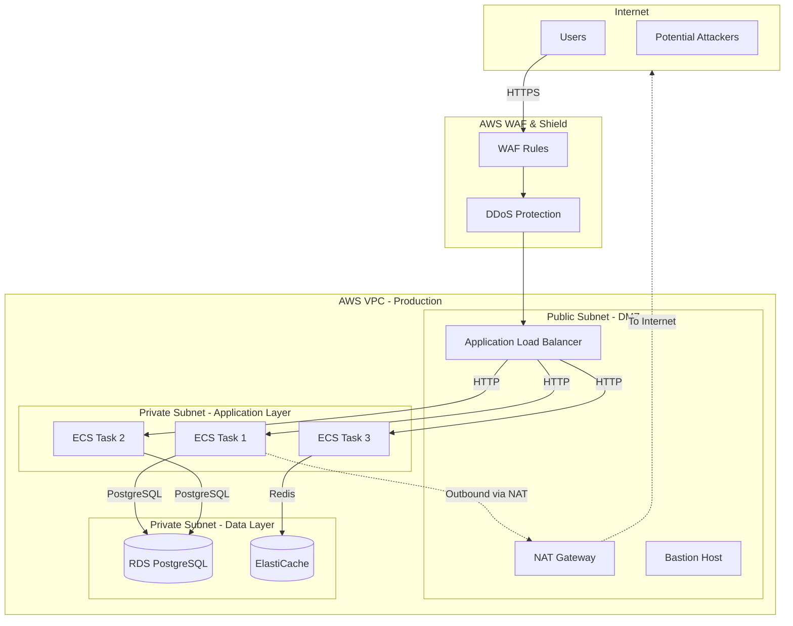

# Segmentación y Controles de Acceso de Red

## Contexto

Este estándar consolida **2 conceptos relacionados** con la organización y control del tráfico de red. Define la arquitectura de red en capas y las reglas de firewall que protegen cada segmento.

**Conceptos incluidos:**

- **Network Segmentation** → Dividir la red en segmentos aislados por función (DMZ, app, data)
- **Network Access Controls** → Controlar tráfico entre segmentos (Security Groups, NACLs, WAF)

---

## Stack Tecnológico

| Componente          | Tecnología      | Versión  | Uso                           |
| ------------------- | --------------- | -------- | ----------------------------- |
| **Cloud Platform**  | AWS             | Latest   | Infraestructura de red        |
| **Network**         | AWS VPC         | Latest   | Virtual Private Cloud         |
| **Firewall**        | Security Groups | Latest   | Stateful firewall por capa    |
| **Network ACL**     | AWS NACL        | Latest   | Stateless firewall por subnet |
| **Load Balancer**   | AWS ALB         | Latest   | Application Load Balancer     |
| **WAF**             | AWS WAF         | Latest   | Web Application Firewall      |
| **DDoS Protection** | AWS Shield      | Standard | Protección DDoS               |
| **IaC**             | Terraform       | 1.7+     | Infraestructura como código   |

---

## Segmentación de Red

### ¿Qué es Network Segmentation?

Dividir la red en segmentos lógicos aislados (subnets) basados en función, sensibilidad de datos o nivel de confianza. Implementa microsegmentación para limitar blast radius.

**Propósito:** Contener brechas de seguridad y limitar movimiento lateral.

**Tipos de subnets:**

- **Public Subnet (DMZ)**: Accesible desde Internet (ALB, NAT Gateway)
- **Private Subnet - App**: Sin acceso directo a Internet (aplicaciones)
- **Private Subnet - Data**: Totalmente aislada (bases de datos)

**Beneficios:**
✅ Limita blast radius de compromiso
✅ Facilita compliance (aislar datos sensibles)
✅ Previene movimiento lateral
✅ Mejor performance (tráfico local en subnet)

### Arquitectura de Red



### Terraform: VPC con 3 Capas

```hcl
# terraform/modules/vpc/main.tf

resource "aws_vpc" "main" {
  cidr_block           = var.vpc_cidr
  enable_dns_hostnames = true
  enable_dns_support   = true

  tags = {
    Name        = "${var.environment}-vpc"
    Environment = var.environment
  }
}

resource "aws_internet_gateway" "main" {
  vpc_id = aws_vpc.main.id
  tags   = { Name = "${var.environment}-igw" }
}

# --- PUBLIC SUBNETS (DMZ) ---
resource "aws_subnet" "public" {
  count = length(var.availability_zones)

  vpc_id                  = aws_vpc.main.id
  cidr_block              = cidrsubnet(var.vpc_cidr, 8, count.index)
  availability_zone       = var.availability_zones[count.index]
  map_public_ip_on_launch = true

  tags = {
    Name          = "${var.environment}-public-${var.availability_zones[count.index]}"
    Tier          = "public"
    TrustBoundary = "dmz"
  }
}

resource "aws_route_table" "public" {
  vpc_id = aws_vpc.main.id
  route {
    cidr_block = "0.0.0.0/0"
    gateway_id = aws_internet_gateway.main.id
  }
  tags = { Name = "${var.environment}-public-rt" }
}

resource "aws_route_table_association" "public" {
  count          = length(aws_subnet.public)
  subnet_id      = aws_subnet.public[count.index].id
  route_table_id = aws_route_table.public.id
}

# --- PRIVATE SUBNETS - APPLICATION LAYER ---
resource "aws_subnet" "private_app" {
  count = length(var.availability_zones)

  vpc_id            = aws_vpc.main.id
  cidr_block        = cidrsubnet(var.vpc_cidr, 8, count.index + 10)
  availability_zone = var.availability_zones[count.index]

  tags = {
    Name          = "${var.environment}-private-app-${var.availability_zones[count.index]}"
    Tier          = "private"
    TrustBoundary = "application"
  }
}

resource "aws_eip" "nat" {
  count  = length(var.availability_zones)
  domain = "vpc"
}

resource "aws_nat_gateway" "main" {
  count         = length(var.availability_zones)
  allocation_id = aws_eip.nat[count.index].id
  subnet_id     = aws_subnet.public[count.index].id
  depends_on    = [aws_internet_gateway.main]
  tags          = { Name = "${var.environment}-nat-${count.index}" }
}

resource "aws_route_table" "private_app" {
  count  = length(var.availability_zones)
  vpc_id = aws_vpc.main.id
  route {
    cidr_block     = "0.0.0.0/0"
    nat_gateway_id = aws_nat_gateway.main[count.index].id
  }
  tags = { Name = "${var.environment}-private-app-rt-${count.index}" }
}

resource "aws_route_table_association" "private_app" {
  count          = length(aws_subnet.private_app)
  subnet_id      = aws_subnet.private_app[count.index].id
  route_table_id = aws_route_table.private_app[count.index].id
}

# --- PRIVATE SUBNETS - DATA LAYER (sin acceso a Internet) ---
resource "aws_subnet" "private_data" {
  count = length(var.availability_zones)

  vpc_id            = aws_vpc.main.id
  cidr_block        = cidrsubnet(var.vpc_cidr, 8, count.index + 20)
  availability_zone = var.availability_zones[count.index]

  tags = {
    Name          = "${var.environment}-private-data-${var.availability_zones[count.index]}"
    Tier          = "private"
    TrustBoundary = "data"
  }
}

resource "aws_route_table" "private_data" {
  vpc_id = aws_vpc.main.id
  # Sin routes a Internet
  tags = { Name = "${var.environment}-private-data-rt" }
}

resource "aws_route_table_association" "private_data" {
  count          = length(aws_subnet.private_data)
  subnet_id      = aws_subnet.private_data[count.index].id
  route_table_id = aws_route_table.private_data.id
}
```

---

## Controles de Acceso de Red

### ¿Qué son Network Access Controls?

Reglas de firewall que permiten/deniegan tráfico entre segmentos de red. AWS ofrece Security Groups (stateful) y NACLs (stateless).

**Componentes:**

- **Security Groups**: Firewall a nivel de instancia — stateful, retorno automático
- **Network ACLs**: Firewall a nivel de subnet — stateless, reglas explícitas en ambas direcciones
- **Principle of Least Privilege**: Solo permitir tráfico estrictamente necesario

**Beneficios:**
✅ Control granular de tráfico
✅ Defensa en profundidad (múltiples capas)
✅ Prevención de acceso no autorizado
✅ Compliance PCI-DSS, HIPAA

### Terraform: Security Groups por Capa

```hcl
# terraform/modules/security-groups/main.tf

# ALB Security Group (DMZ)
resource "aws_security_group" "alb" {
  name        = "${var.environment}-alb-sg"
  description = "Security group for Application Load Balancer"
  vpc_id      = var.vpc_id

  ingress {
    description = "HTTPS from Internet"
    from_port   = 443
    to_port     = 443
    protocol    = "tcp"
    cidr_blocks = ["0.0.0.0/0"]
  }

  ingress {
    description = "HTTP redirect"
    from_port   = 80
    to_port     = 80
    protocol    = "tcp"
    cidr_blocks = ["0.0.0.0/0"]
  }

  egress {
    description     = "To application layer"
    from_port       = 8080
    to_port         = 8080
    protocol        = "tcp"
    security_groups = [aws_security_group.app.id]
  }

  tags = { Name = "${var.environment}-alb-sg", Layer = "dmz" }
}

# Application Security Group (Private App Layer)
resource "aws_security_group" "app" {
  name        = "${var.environment}-app-sg"
  description = "Security group for application containers"
  vpc_id      = var.vpc_id

  ingress {
    description     = "From ALB"
    from_port       = 8080
    to_port         = 8080
    protocol        = "tcp"
    security_groups = [aws_security_group.alb.id]
  }

  ingress {
    description = "Service mesh communication"
    from_port   = 8080
    to_port     = 8080
    protocol    = "tcp"
    self        = true
  }

  egress {
    description     = "To PostgreSQL"
    from_port       = 5432
    to_port         = 5432
    protocol        = "tcp"
    security_groups = [aws_security_group.database.id]
  }

  egress {
    description     = "To Redis"
    from_port       = 6379
    to_port         = 6379
    protocol        = "tcp"
    security_groups = [aws_security_group.cache.id]
  }

  egress {
    description = "HTTPS outbound (AWS services, APIs)"
    from_port   = 443
    to_port     = 443
    protocol    = "tcp"
    cidr_blocks = ["0.0.0.0/0"]
  }

  tags = { Name = "${var.environment}-app-sg", Layer = "application" }
}

# Database Security Group (Private Data Layer)
resource "aws_security_group" "database" {
  name        = "${var.environment}-database-sg"
  description = "Security group for RDS PostgreSQL"
  vpc_id      = var.vpc_id

  ingress {
    description     = "PostgreSQL from app layer"
    from_port       = 5432
    to_port         = 5432
    protocol        = "tcp"
    security_groups = [aws_security_group.app.id]
  }

  ingress {
    description     = "PostgreSQL from bastion (debugging)"
    from_port       = 5432
    to_port         = 5432
    protocol        = "tcp"
    security_groups = [aws_security_group.bastion.id]
  }

  # Sin egress rules → no puede iniciar conexiones salientes

  tags = { Name = "${var.environment}-database-sg", Layer = "data" }
}

# Bastion Security Group
resource "aws_security_group" "bastion" {
  name        = "${var.environment}-bastion-sg"
  description = "Security group for bastion host"
  vpc_id      = var.vpc_id

  ingress {
    description = "SSH from corporate IPs only"
    from_port   = 22
    to_port     = 22
    protocol    = "tcp"
    cidr_blocks = var.corporate_ip_ranges  # ["203.0.113.0/24"]
  }

  egress {
    description = "SSH to private subnets"
    from_port   = 22
    to_port     = 22
    protocol    = "tcp"
    cidr_blocks = [var.private_app_cidr, var.private_data_cidr]
  }

  tags = { Name = "${var.environment}-bastion-sg" }
}
```

### Network ACLs (Stateless Firewall)

```hcl
# NACL para private data subnet (capa adicional de defensa)
resource "aws_network_acl" "private_data" {
  vpc_id     = aws_vpc.main.id
  subnet_ids = aws_subnet.private_data[*].id

  ingress {
    rule_no    = 100
    protocol   = "tcp"
    from_port  = 5432
    to_port    = 5432
    cidr_block = var.private_app_cidr
    action     = "allow"
  }

  ingress {
    rule_no    = 200
    protocol   = "tcp"
    from_port  = 1024
    to_port    = 65535
    cidr_block = var.private_app_cidr
    action     = "allow"
  }

  egress {
    rule_no    = 100
    protocol   = "tcp"
    from_port  = 1024
    to_port    = 65535
    cidr_block = var.private_app_cidr
    action     = "allow"
  }

  tags = { Name = "${var.environment}-private-data-nacl" }
}
```

---

## Monitoreo y Observabilidad

```promql
# Tráfico bloqueado por Security Groups
aws_vpc_flow_logs_blocked_total{direction="ingress"}

# Requests bloqueadas por WAF
aws_waf_blocked_requests_total{rule="AWSManagedRulesCommonRuleSet"}

# DDoS events detectados por Shield
aws_shield_ddos_events_total
```

---

## Requisitos Técnicos

### MUST (Obligatorio)

- **MUST** usar al menos 3 capas de subnets (public, private-app, private-data)
- **MUST** usar Security Groups con principio de least privilege
- **MUST** no permitir `0.0.0.0/0` en Security Groups de app/data layers
- **MUST** habilitar AWS WAF en ALBs públicos
- **MUST** usar AWS Shield Standard (activado por defecto en ALB)
- **MUST** habilitar VPC Flow Logs para auditoría

### SHOULD (Fuertemente recomendado)

- **SHOULD** usar Network ACLs como capa adicional de defensa
- **SHOULD** habilitar AWS Shield Advanced para producción con tráfico alto
- **SHOULD** implementar rate limiting en API Gateway

### MUST NOT (Prohibido)

- **MUST NOT** exponer bases de datos directamente a Internet
- **MUST NOT** usar `0.0.0.0/0` en inbound de Security Groups (excepto ALB en 443/80)
- **MUST NOT** compartir Security Groups entre ambientes
- **MUST NOT** permitir SSH (puerto 22) desde `0.0.0.0/0`

---

## Referencias

- [AWS VPC Security Best Practices](https://docs.aws.amazon.com/vpc/latest/userguide/vpc-security-best-practices.html)
- [AWS Security Groups](https://docs.aws.amazon.com/vpc/latest/userguide/vpc-security-groups.html)
- [AWS WAF](https://docs.aws.amazon.com/waf/latest/developerguide/)
- [Aislamiento de Ambientes y Tenants](./environment-isolation.md)
- [Zero Trust Networking](./zero-trust-networking.md)
- [Data Protection](./data-protection.md)
