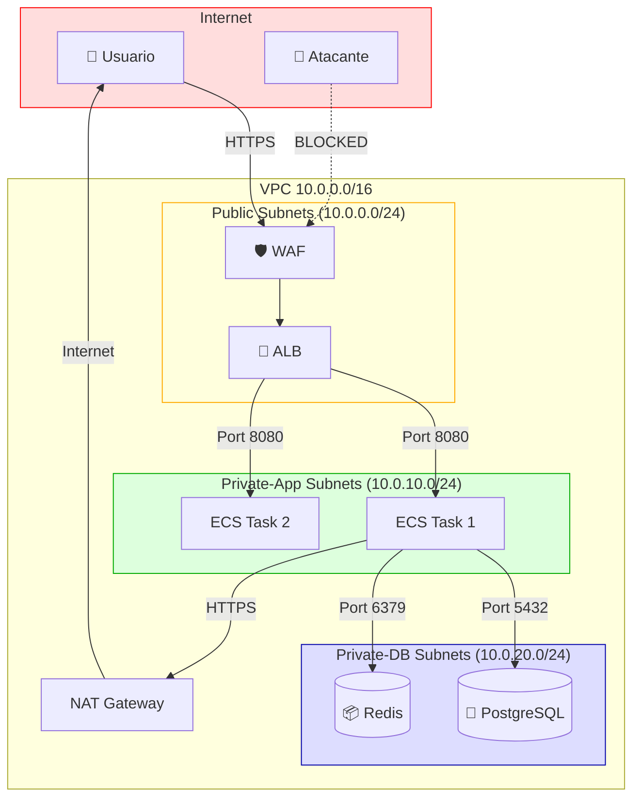

# Estándar Técnico — Segmentación de Redes

---

## 1. Propósito

Segmentar infraestructura de red en VPC AWS con subnets públicas (WAF, ALB), privadas de aplicación (ECS) y privadas de datos (RDS, Redis), aplicando Security Groups deny-by-default y NACLs como defensa en profundidad.

---

## 2. Alcance

**Aplica a:**

- VPC de producción, staging, desarrollo
- Subnets por tier (public, private-app, private-db)
- Security Groups por servicio
- NACLs por subnet
- Peering entre VPCs

**No aplica a:**

- VPN client-to-site (fuera de alcance)
- Direct Connect (Enterprise only)

---

## 3. Tecnologías Aprobadas

| Componente          | Tecnología              | Versión mínima | Observaciones      |
| ------------------- | ----------------------- | -------------- | ------------------ |
| **VPC**             | AWS VPC                 | -              | 1 VPC por ambiente |
| **Security Groups** | AWS EC2 Security Groups | -              | Stateful firewall  |
| **NACLs**           | AWS Network ACLs        | -              | Stateless firewall |
| **Subnets**         | AWS VPC Subnets         | -              | Multi-AZ           |
| **NAT Gateway**     | AWS NAT Gateway         | -              | High availability  |
| **IaC**             | Terraform               | 1.6+           | Automatizado       |

> El uso de tecnologías no listadas requiere aprobación de Arquitectura.

---

## 4. Requisitos Obligatorios 🔴

### VPC Architecture

- [ ] **1 VPC por ambiente**: Dev, Staging, Production en VPCs separadas
- [ ] **CIDR no solapados**: 10.0.0.0/16 (prod), 10.1.0.0/16 (staging), 10.2.0.0/16 (dev)
- [ ] **Multi-AZ**: Mínimo 2 AZs para alta disponibilidad
- [ ] **3 tiers de subnets**:
  - Public: WAF, ALB (acceso Internet)
  - Private-App: ECS tasks (sin Internet directo)
  - Private-DB: RDS, Redis (sin Internet)

### Security Groups

- [ ] **Deny-by-default**: Sin reglas por defecto
- [ ] **1 SG por servicio**: ecs-tasks, rds, redis, alb, bastion
- [ ] **Ingress específico**: Solo de SGs necesarios (NO 0.0.0.0/0)
- [ ] **Egress restrictivo**: Solo destinos necesarios
- [ ] **Naming**: `{env}-{service}-sg` (e.g., `prod-ecs-payment-sg`)

### NACLs

- [ ] **Defensa en profundidad**: NACLs + Security Groups
- [ ] **1 NACL por subnet tier**: public, private-app, private-db
- [ ] **Deny rules**: Bloquear rangos maliciosos conocidos
- [ ] **Allow ephemeral ports**: 1024-65535 para responses

---

## 5. Terraform - VPC con 3 Tiers

### VPC Base

```hcl
# terraform/vpc.tf

resource "aws_vpc" "main" {
  cidr_block           = "10.0.0.0/16"  # 65,536 IPs
  enable_dns_hostnames = true
  enable_dns_support   = true

  tags = {
    Name        = "vpc-production"
    Environment = "production"
    ManagedBy   = "terraform"
  }
}

# Internet Gateway (para subnets públicas)
resource "aws_internet_gateway" "main" {
  vpc_id = aws_vpc.main.id

  tags = {
    Name = "igw-production"
  }
}

# NAT Gateway (para subnets privadas con Internet saliente)
resource "aws_eip" "nat" {
  count  = 2  # 1 por AZ
  domain = "vpc"

  tags = {
    Name = "eip-nat-${count.index + 1}"
  }
}

resource "aws_nat_gateway" "main" {
  count         = 2
  allocation_id = aws_eip.nat[count.index].id
  subnet_id     = aws_subnet.public[count.index].id

  tags = {
    Name = "nat-gw-${count.index + 1}"
  }
}
```

### Subnets - 3 Tiers x 2 AZs

```hcl
# Public subnets (WAF, ALB)
resource "aws_subnet" "public" {
  count                   = 2
  vpc_id                  = aws_vpc.main.id
  cidr_block              = "10.0.${count.index}.0/24"  # 10.0.0.0/24, 10.0.1.0/24
  availability_zone       = data.aws_availability_zones.available.names[count.index]
  map_public_ip_on_launch = true

  tags = {
    Name = "subnet-public-${count.index + 1}"
    Tier = "public"
  }
}

# Private-App subnets (ECS tasks)
resource "aws_subnet" "private_app" {
  count             = 2
  vpc_id            = aws_vpc.main.id
  cidr_block        = "10.0.${10 + count.index}.0/24"  # 10.0.10.0/24, 10.0.11.0/24
  availability_zone = data.aws_availability_zones.available.names[count.index]

  tags = {
    Name = "subnet-private-app-${count.index + 1}"
    Tier = "private-app"
  }
}

# Private-DB subnets (RDS, Redis)
resource "aws_subnet" "private_db" {
  count             = 2
  vpc_id            = aws_vpc.main.id
  cidr_block        = "10.0.${20 + count.index}.0/24"  # 10.0.20.0/24, 10.0.21.0/24
  availability_zone = data.aws_availability_zones.available.names[count.index]

  tags = {
    Name = "subnet-private-db-${count.index + 1}"
    Tier = "private-db"
  }
}
```

### Route Tables

```hcl
# Public route table (Internet Gateway)
resource "aws_route_table" "public" {
  vpc_id = aws_vpc.main.id

  route {
    cidr_block = "0.0.0.0/0"
    gateway_id = aws_internet_gateway.main.id
  }

  tags = {
    Name = "rt-public"
  }
}

resource "aws_route_table_association" "public" {
  count          = 2
  subnet_id      = aws_subnet.public[count.index].id
  route_table_id = aws_route_table.public.id
}

# Private-App route table (NAT Gateway)
resource "aws_route_table" "private_app" {
  count  = 2
  vpc_id = aws_vpc.main.id

  route {
    cidr_block     = "0.0.0.0/0"
    nat_gateway_id = aws_nat_gateway.main[count.index].id
  }

  tags = {
    Name = "rt-private-app-${count.index + 1}"
  }
}

resource "aws_route_table_association" "private_app" {
  count          = 2
  subnet_id      = aws_subnet.private_app[count.index].id
  route_table_id = aws_route_table.private_app[count.index].id
}

# Private-DB route table (NO Internet)
resource "aws_route_table" "private_db" {
  vpc_id = aws_vpc.main.id
  # Sin ruta a Internet

  tags = {
    Name = "rt-private-db"
  }
}

resource "aws_route_table_association" "private_db" {
  count          = 2
  subnet_id      = aws_subnet.private_db[count.index].id
  route_table_id = aws_route_table.private_db.id
}
```

---

## 6. Security Groups

### ALB Security Group

```hcl
resource "aws_security_group" "alb" {
  name        = "prod-alb-sg"
  description = "Security group for Application Load Balancer"
  vpc_id      = aws_vpc.main.id

  # Ingress: HTTPS from Internet
  ingress {
    description = "HTTPS from anywhere"
    from_port   = 443
    to_port     = 443
    protocol    = "tcp"
    cidr_blocks = ["0.0.0.0/0"]  # Público
  }

  # Egress: To ECS tasks
  egress {
    description     = "HTTP to ECS tasks"
    from_port       = 8080
    to_port         = 8080
    protocol        = "tcp"
    security_groups = [aws_security_group.ecs_tasks.id]
  }

  tags = {
    Name = "prod-alb-sg"
  }
}
```

### ECS Tasks Security Group

```hcl
resource "aws_security_group" "ecs_tasks" {
  name        = "prod-ecs-payment-sg"
  description = "Security group for ECS Payment Service tasks"
  vpc_id      = aws_vpc.main.id

  # Ingress: Solo desde ALB
  ingress {
    description     = "HTTP from ALB"
    from_port       = 8080
    to_port         = 8080
    protocol        = "tcp"
    security_groups = [aws_security_group.alb.id]  # NO 0.0.0.0/0
  }

  # Egress: PostgreSQL
  egress {
    description     = "PostgreSQL to RDS"
    from_port       = 5432
    to_port         = 5432
    protocol        = "tcp"
    security_groups = [aws_security_group.rds.id]
  }

  # Egress: Redis
  egress {
    description     = "Redis"
    from_port       = 6379
    to_port         = 6379
    protocol        = "tcp"
    security_groups = [aws_security_group.redis.id]
  }

  # Egress: HTTPS for external APIs
  egress {
    description = "HTTPS to Internet"
    from_port   = 443
    to_port     = 443
    protocol    = "tcp"
    cidr_blocks = ["0.0.0.0/0"]
  }

  tags = {
    Name = "prod-ecs-payment-sg"
  }
}
```

### RDS Security Group

```hcl
resource "aws_security_group" "rds" {
  name        = "prod-rds-sg"
  description = "Security group for RDS PostgreSQL"
  vpc_id      = aws_vpc.main.id

  # Ingress: Solo desde ECS tasks
  ingress {
    description     = "PostgreSQL from ECS"
    from_port       = 5432
    to_port         = 5432
    protocol        = "tcp"
    security_groups = [aws_security_group.ecs_tasks.id]
  }

  # NO egress rules (database no inicia conexiones)

  tags = {
    Name = "prod-rds-sg"
  }
}
```

---

## 7. NACLs - Defensa en Profundidad

### Public Subnet NACL

```hcl
resource "aws_network_acl" "public" {
  vpc_id     = aws_vpc.main.id
  subnet_ids = aws_subnet.public[*].id

  # Allow HTTPS inbound
  ingress {
    rule_no    = 100
    protocol   = "tcp"
    action     = "allow"
    cidr_block = "0.0.0.0/0"
    from_port  = 443
    to_port    = 443
  }

  # Allow ephemeral ports (responses)
  ingress {
    rule_no    = 110
    protocol   = "tcp"
    action     = "allow"
    cidr_block = "0.0.0.0/0"
    from_port  = 1024
    to_port    = 65535
  }

  # Deny known malicious IPs (ejemplo)
  ingress {
    rule_no    = 50
    protocol   = "-1"  # All
    action     = "deny"
    cidr_block = "1.2.3.4/32"  # IP maliciosa conocida
    from_port  = 0
    to_port    = 0
  }

  # Allow all outbound (será filtrado por SGs)
  egress {
    rule_no    = 100
    protocol   = "-1"
    action     = "allow"
    cidr_block = "0.0.0.0/0"
    from_port  = 0
    to_port    = 0
  }

  tags = {
    Name = "nacl-public"
  }
}
```

---

## 8. Diagrama de Arquitectura



---

## 9. Validación de Cumplimiento

```bash
# Verificar VPC existe
aws ec2 describe-vpcs --filters "Name=tag:Name,Values=vpc-production" --query 'Vpcs[0].{VpcId:VpcId,CidrBlock:CidrBlock}'

# Listar subnets por tier
aws ec2 describe-subnets --filters "Name=tag:Tier,Values=public" --query 'Subnets[*].{SubnetId:SubnetId,CidrBlock:CidrBlock,AZ:AvailabilityZone}'

# Verificar Security Groups deny-by-default
aws ec2 describe-security-groups --filters "Name=group-name,Values=prod-ecs-payment-sg" --query 'SecurityGroups[0].IpPermissions'

# Verificar NO hay 0.0.0.0/0 en ingress (excepto ALB)
aws ec2 describe-security-groups --query 'SecurityGroups[?IpPermissions[?IpRanges[?CidrIp==`0.0.0.0/0`]]].{GroupName:GroupName,GroupId:GroupId}'

# Verificar NACLs activos
aws ec2 describe-network-acls --filters "Name=vpc-id,Values=$(aws ec2 describe-vpcs --filters Name=tag:Name,Values=vpc-production --query 'Vpcs[0].VpcId' --output text)"
```

---

## 10. Referencias

**NIST:**

- [NIST 800-41 - Firewall Guidelines](https://csrc.nist.gov/publications/detail/sp/800-41/rev-1/final)

**AWS:**

- [VPC Security Best Practices](https://docs.aws.amazon.com/vpc/latest/userguide/vpc-security-best-practices.html)
- [Security Groups vs NACLs](https://docs.aws.amazon.com/vpc/latest/userguide/vpc-network-acls.html)
