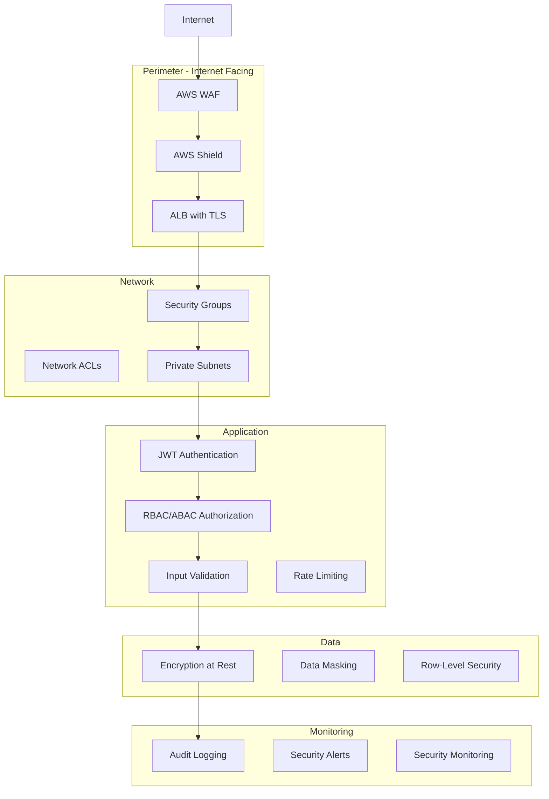

# Gobernanza de Seguridad

## Contexto

Este estándar consolida **10 conceptos relacionados** con gobernanza, políticas, procesos y controles de seguridad. Define cómo integrar seguridad en el ciclo de vida de desarrollo.

**Conceptos incluidos:**

- **Security by Design** → Integrar seguridad desde diseño
- **Security Architecture Review** → Revisiones obligatorias de arquitectura
- **Application Security** → OWASP Top 10, input validation, secure coding
- **Defense in Depth** → Múltiples capas de seguridad
- **Patch Management** → Gestión de parches y actualizaciones
- **Segregation of Duties** → Separación de roles (dev/deploy/audit)
- **Secure Defaults** → Configuraciones seguras por defecto
- **Authentication Protocols** → Estándares de autenticación
- **Continuous Audit** → Auditoría continua de seguridad
- **Compliance Automation** → Automatización de compliance

---

## Stack Tecnológico

| Componente           | Tecnología             | Versión | Uso                              |
| -------------------- | ---------------------- | ------- | -------------------------------- |
| **Runtime**          | .NET                   | 8.0+    | Aplicaciones                     |
| **SAST**             | SonarQube              | 9.9+    | Static analysis                  |
| **Dependency Scan**  | OWASP Dependency-Check | Latest  | Vulnerabilidades en dependencias |
| **IaC Security**     | Checkov                | Latest  | Terraform security scanning      |
| **Patch Management** | Dependabot             | Latest  | Automated dependency updates     |
| **Compliance**       | AWS Config             | Latest  | Compliance monitoring            |

---

## Seguridad por Diseño

### ¿Qué es?

Incorporar seguridad en cada fase del SDLC, no como afterthought sino como requisito fundamental.

**Principios:**

- **Threat Model Early**: Identificar amenazas en diseño
- **Least Privilege**: Mínimos permisos necesarios
- **Fail Secure**: Fallar de forma segura (deny by default)
- **Defense in Depth**: Múltiples capas de control

### Security Requirements Checklist

```markdown
# Security Requirements - New Service Checklist

## Autenticación y Autorización

- [ ] JWT authentication con Keycloak
- [ ] RBAC/ABAC para permisos granulares
- [ ] MFA requirement para operaciones sensibles
- [ ] No usar Basic Auth ni API keys en headers

## Datos

- [ ] Cifrar PII at-rest (AES-256)
- [ ] TLS 1.3 para comunicaciones
- [ ] Data masking en logs
- [ ] Clasificar datos (Public/Internal/Confidential/Secret)

## Network

- [ ] Deploy en private subnet
- [ ] Security Groups con least privilege
- [ ] mTLS entre servicios
- [ ] No exponer directamente a Internet

## Input Validation

- [ ] Validar todos los inputs (FluentValidation)
- [ ] Sanitizar inputs (prevenir XSS/SQLi)
- [ ] Rate limiting (100 req/min por usuario)
- [ ] Max request size 10MB

## Logging y Auditoría

- [ ] Log todas las operaciones sensibles
- [ ] Audit trail inmutable (Grafana Loki)
- [ ] Alertas para eventos críticos (failed logins, privilege escalation)
- [ ] Retención logs 1 año

## Secrets

- [ ] Usar AWS Secrets Manager (no hardcodear)
- [ ] Rotar secrets cada 90 días
- [ ] No commitear secrets a Git

## Dependencies

- [ ] Scan dependencias (OWASP Dependency-Check)
- [ ] Actualizar librerías con vulnerabilidades High/Critical
- [ ] Pin dependency versions

## Testing

- [ ] Unit tests con cobertura > 80%
- [ ] Integration tests
- [ ] SAST en CI/CD (SonarQube)
- [ ] DAST antes de producción (OWASP ZAP)

## Deployment

- [ ] Immutable infrastructure (Docker containers)
- [ ] Blue/green deployment para rollback rápido
- [ ] Canary deployment para features críticas
- [ ] Health checks (/health, /ready)

## Compliance

- [ ] GDPR: Right to erasure
- [ ] Data retention policies
- [ ] Privacy by design
```

---

## Revisión de Arquitectura de Seguridad

### ¿Qué es?

Revisión obligatoria de arquitectura por equipo de seguridad antes de implementar nuevos servicios o cambios mayores.

**Cuándo se requiere:**

- Nuevo servicio/aplicación
- Cambios en autenticación/autorización
- Manejo de nuevos tipos de datos sensibles
- Integraciones con sistemas externos
- Cambios en trust boundaries

### Architecture Review Document (ARD)

```markdown
# Architecture Review Document

**Service**: Payment Processing Service
**Date**: 2026-02-15
**Reviewers**: Security Team, Lead Architect
**Status**: ✅ Approved with conditions

## Overview

Servicio para procesar pagos con Stripe. Maneja tarjetas de crédito (PCI-DSS scope).

## Architecture Diagram

[Incluir diagrama]

## Security Controls

### Autenticación

- ✅ JWT con Keycloak
- ✅ MFA obligatorio para /api/payments/\*
- ⚠️ **Action Required**: Implementar step-up auth para refunds

### Autorización

- ✅ RBAC: Solo roles PaymentProcessor puede procesar pagos
- ✅ ABAC: Validar tenant_id
- ✅ Permiso granular: payments:process

### Data Protection

- ✅ TLS 1.3 in-transit
- ✅ No almacenar números de tarjeta (tokenización con Stripe)
- ✅ PII logging masking
- ⚠️ **Action Required**: Cifrar payment_tokens en DB con KMS

### Network Security

- ✅ Deploy en private subnet
- ✅ Security Group: Solo de ALB + egress a Stripe API
- ✅ mTLS con order-service

### Secrets

- ✅ Stripe API key en AWS Secrets Manager
- ✅ Rotación manual cada 90 días
- ⚠️ **Action Required**: Configurar rotación automática

### Compliance

- ⚠️ **Critical**: PCI-DSS SAQ-A required (usar Stripe compliance)
- ✅ GDPR: No almacenar datos de tarjeta
- ✅ Audit logging todas las operaciones

## Risk Assessment

| Risk                            | Likelihood | Impact | Severity | Mitigation                 |
| ------------------------------- | ---------- | ------ | -------- | -------------------------- |
| Stripe API key leak             | Low        | High   | Medium   | Secrets Manager + rotation |
| Unauthorized payment processing | Low        | High   | Medium   | MFA + ABAC + audit logs    |
| DDoS on payment endpoint        | Medium     | Medium | Medium   | Rate limiting + AWS Shield |
| Payment data exfiltration       | Low        | High   | Medium   | No storage + tokenization  |

## Approval

- [x] Security Team: Approved with 3 action items
- [x] Lead Architect: Approved
- [ ] Compliance Team: Pending PCI-DSS attestation

**Go-Live Allowed**: ✅ Yes, after completing 3 action items marked as ⚠️
```

---

## Seguridad de Aplicaciones (OWASP Top 10)

### Prevención de OWASP Top 10

#### A01: Broken Access Control

```csharp
// ❌ VULNERABLE: No validar ownership
[HttpGet("{id}")]
public async Task<Order> GetOrder(int id)
{
    return await _context.Orders.FindAsync(id);
}

// ✅ FIXED: Validar tenant_id y ownership
[HttpGet("{id}")]
[RequirePermission("orders:read")]
public async Task<ActionResult<Order>> GetOrder(int id)
{
    var tenantId = (Guid)HttpContext.Items["TenantId"];

    var order = await _context.Orders
        .Where(o => o.Id == id && o.TenantId == tenantId)
        .FirstOrDefaultAsync();

    if (order == null)
        return NotFound();

    // Validar ownership si no es admin
    if (!User.HasClaim("permission", "orders:read_all"))
    {
        var userId = User.FindFirst("sub")?.Value;
        if (order.CustomerId != userId)
            return Forbid();
    }

    return order;
}
```

#### A03: Injection

```csharp
// ❌ VULNERABLE: SQL Injection
var query = $"SELECT * FROM Users WHERE Username = '{username}'";

// ✅ FIXED: Parameterized queries
var user = await _context.Users
    .Where(u => u.Username == username)
    .FirstOrDefaultAsync();

// ✅ FIXED: Input validation
public class CreateOrderRequest
{
    [Required]
    [StringLength(100, MinimumLength = 1)]
    [RegularExpression(@"^[a-zA-Z0-9\s\-]+$")]
    public string CustomerName { get; set; }

    [Required]
    [EmailAddress]
    public string Email { get; set; }

    [Url]
    public string WebsiteUrl { get; set; }
}
```

#### A05: Security Misconfiguration

```csharp
// ❌ VULNERABLE: Error details expuestos
app.UseDeveloperExceptionPage();

// ✅ FIXED: Error handling seguro
if (app.Environment.IsDevelopment())
{
    app.UseDeveloperExceptionPage();
}
else
{
    app.UseExceptionHandler("/error");
    app.UseHsts();
}

// Middleware para sanitizar error responses
app.Use(async (context, next) =>
{
    try
    {
        await next();
    }
    catch (Exception ex)
    {
        _logger.LogError(ex, "Unhandled exception");

        context.Response.StatusCode = 500;
        await context.Response.WriteAsJsonAsync(new
        {
            error = "internal_server_error",
            message = "An unexpected error occurred" // No detalles internos
        });
    }
});
```

#### A07:Identification and Authentication Failures

```csharp
// ✅ Password policy enforcement
public class PasswordValidator
{
    public ValidationResult Validate(string password)
    {
        if (password.Length < 12)
            return ValidationResult.Failure("Password must be at least 12 characters");

        if (!Regex.IsMatch(password, @"[A-Z]"))
            return ValidationResult.Failure("Password must contain uppercase letter");

        if (!Regex.IsMatch(password, @"[a-z]"))
            return ValidationResult.Failure("Password must contain lowercase letter");

        if (!Regex.IsMatch(password, @"\d"))
            return ValidationResult.Failure("Password must contain digit");

        if (!Regex.IsMatch(password, @"[@$!%*?&#]"))
            return ValidationResult.Failure("Password must contain special character");

        // Check against common passwords list
        if (IsCommonPassword(password))
            return ValidationResult.Failure("Password is too common");

        return ValidationResult.Success();
    }
}

// ✅ Rate limiting para login
[RateLimiting(MaxRequests = 5, WindowMinutes = 15)]
[HttpPost("login")]
public async Task<ActionResult> Login(LoginRequest request)
{
    // ...
}
```

---

## Defensa en Profundidad

### Capas de Seguridad



**Principio:** Si una capa es comprometida, otras capas proveen defensa adicional.

---

## Gestión de Parches

### Proceso de Actualización

```yaml
# Patch Management Process

OS Patches:
  Frequency: Weekly
  Tool: AWS Systems Manager Patch Manager
  Maintenance Window: Sundays 2-4 AM
  Approval: Auto-approve security patches
  Rollback: Automated if health checks fail

Dependency Updates (.NET NuGet):
  Frequency: Weekly scan with Dependabot
  Process:
    1. Dependabot creates PR with update
    2. CI/CD runs tests automatically
    3. SonarQube security scan
    4. If all green: Auto-merge
    5. Deploy to dev → staging → prod

Base Images (Docker):
  Frequency: Monthly rebuild
  Process:
    1. Rebuild with latest dotnet:8.0-alpine
    2. Trivy scan for vulnerabilities
    3. Block if HIGH/CRITICAL found
    4. Push to ECR with new tag

Critical Security Patches:
  SLA: 7 days for Critical, 30 days for High
  Process:
    1. Security alert received
    2. Create JIRA ticket
    3. Emergency patch deployment
    4. Communicate to stakeholders
```

### Dependabot Configuration

```yaml
# .github/dependabot.yml
version: 2
updates:
  # NuGet dependencies
  - package-ecosystem: "nuget"
    directory: "/src"
    schedule:
      interval: "weekly"
      day: "monday"
    open-pull-requests-limit: 10
    reviewers:
      - "backend-team"
    labels:
      - "dependencies"
      - "automerge"

    # Auto-merge patch versions
    auto-merge:
      enabled: true
      merge-method: "squash"

    # Versioning strategy
    versioning-strategy: "increase"

    # Security updates get priority
    priority: "security"

  # Docker base images
  - package-ecosystem: "docker"
    directory: "/"
    schedule:
      interval: "weekly"
    labels:
      - "docker"
      - "dependencies"
```

---

## Segregación de Funciones

### Separación de Roles

```yaml
# Roles y Responsabilidades

Developer:
  Permissions:
    - Read code
    - Write code
    - Create PRs
    - Deploy to dev environment
  Restrictions:
    - ❌ Cannot approve own PRs
    - ❌ Cannot deploy to prod directly
    - ❌ Cannot access prod databases
    - ❌ Cannot modify IAM roles

Reviewer/Lead:
  Permissions:
    - Approve PRs (after 2 developer approvals)
    - Merge to main branch
    - Deploy to staging
  Restrictions:
    - ❌ Cannot deploy to prod alone
    - ❌ Cannot access prod secrets

DevOps/SRE:
  Permissions:
    - Deploy to production (after approvals)
    - Access prod infrastructure (read-only via bastion)
    - Manage AWS resources (via Terraform)
  Restrictions:
    - ❌ Cannot modify code directly
    - ❌ Cannot skip deployment approvals

Security Team:
  Permissions:
    - Audit all systems
    - Read all logs
    - Emergency prod access (break-glass)
  Restrictions:
    - ❌ Not involved in day-to-day development

Compliance/Auditor:
  Permissions:
    - Read-only access to all systems
    - Access to audit logs
    - Generate compliance reports
  Restrictions:
    - ❌ No write access to any system
```

### GitHub Actions: Approval Gates

```yaml
# .github/workflows/deploy-prod.yml
name: Deploy to Production

on:
  workflow_dispatch:
    inputs:
      version:
        description: "Version to deploy"
        required: true

jobs:
  deploy:
    runs-on: ubuntu-latest
    environment:
      name: production
      # Requiere approval de 2 reviewers del team "production-approvers"

    steps:
      - name: Checkout
        uses: actions/checkout@v3
        with:
          ref: ${{ github.event.inputs.version }}

      - name: Validate approvals
        run: |
          # Validar que hay al menos 2 approvals
          # y que no son del mismo autor del PR

      - name: Deploy to ECS
        run: |
          aws ecs update-service \
            --cluster prod-cluster \
            --service order-service \
            --force-new-deployment \
            --task-definition order-service:${{ github.event.inputs.version }}

      - name: Verify deployment
        run: |
          # Health checks
          # Smoke tests
          # Rollback if failures

      - name: Notify
        run: |
          # Slack notification
          # Email to stakeholders
```

---

## Configuraciones Seguras por Defecto

### Configuraciones Seguras

```csharp
// Program.cs - Secure defaults
var builder = WebApplication.CreateBuilder(args);

// 1. HTTPS obligatorio
builder.Services.AddHttpsRedirection(options =>
{
    options.RedirectStatusCode = StatusCodes.Status308PermanentRedirect;
    options.HttpsPort = 443;
});

// 2. HSTS
builder.Services.AddHsts(options =>
{
    options.MaxAge = TimeSpan.FromDays(365);
    options.IncludeSubDomains = true;
    options.Preload = true;
});

// 3. Security headers
app.Use(async (context, next) =>
{
    context.Response.Headers.Add("X-Content-Type-Options", "nosniff");
    context.Response.Headers.Add("X-Frame-Options", "DENY");
    context.Response.Headers.Add("X-XSS-Protection", "1; mode=block");
    context.Response.Headers.Add("Referrer-Policy", "no-referrer");
    context.Response.Headers.Add(
        "Content-Security-Policy",
        "default-src 'self'; script-src 'self'; style-src 'self' 'unsafe-inline'");
    context.Response.Headers.Add(
        "Permissions-Policy",
        "geolocation=(), microphone=(), camera=()");

    await next();
});

// 4. Deny by default en Authorization
builder.Services.AddAuthorization(options =>
{
    // Fallback policy: require authentication por defecto
    options.FallbackPolicy = new AuthorizationPolicyBuilder()
        .RequireAuthenticatedUser()
        .Build();
});

// 5. CORS restrictivo
builder.Services.AddCors(options =>
{
    options.AddDefaultPolicy(policy =>
    {
        policy.WithOrigins("https://app.talma.com") // Solo orígenes específicos
            .AllowAnyMethod()
            .AllowAnyHeader()
            .AllowCredentials();
    });
});

// 6. Rate limiting
builder.Services.AddRateLimiter(options =>
{
    options.GlobalLimiter = PartitionedRateLimiter.Create<HttpContext, string>(context =>
    {
        var userId = context.User.FindFirst("sub")?.Value ?? "anonymous";

        return RateLimitPartition.GetFixedWindowLimiter(userId, _ =>
            new FixedWindowRateLimiterOptions
            {
                Window = TimeSpan.FromMinutes(1),
                PermitLimit = 100,
                QueueLimit = 0
            });
    });
});
```

---

## Auditoría Continua, Protocolos y Compliance

### Protocolos de Autenticación

**MUST:**

- OAuth 2.0 / OpenID Connect
- No Basic Auth
- JWT con RS256 (no HS256)

### Auditoría Continua

**MUST:**

- AWS CloudTrail habilitado
- VPC Flow Logs
- Application audit logs
- Alertas en Grafana

### Automatización de Compliance

**MUST:**

- AWS Config rules
- Terraform Checkov scans
- Automated compliance reports

---

## Requisitos Técnicos

### MUST

- **MUST** security-by-design checklist para nuevos servicios
- **MUST** architecture review antes de prod
- **MUST** prevenir OWASP Top 10
- **MUST** parches críticos en 7 días
- **MUST** separación dev/prod
- **MUST** secure defaults (HTTPS, HSTS, security headers)
- **MUST** 2+ approvals para deploy prod

### MUST NOT

- **MUST NOT** deploy sin security review
- **MUST NOT** mismo usuario code + approve + deploy
- **MUST NOT** hardcodear secrets
- **MUST NOT** exponer stack traces en prod

---

## Referencias

- [OWASP Top 10](https://owasp.org/www-project-top-ten/)
- [NIST Cybersecurity Framework](https://www.nist.gov/cyberframework)
- [CIS Controls](https://www.cisecurity.org/controls)
