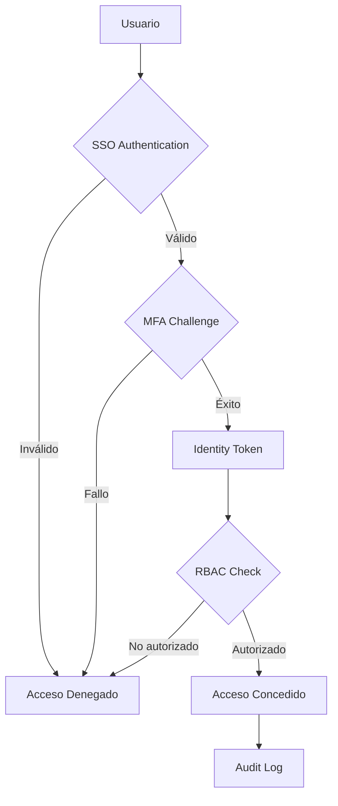

# SSO, MFA y RBAC

## Contexto

Este estándar consolida **3 conceptos relacionados** con autenticación centralizada y control de acceso base. Define cómo los usuarios se autentican y qué permisos tienen en la plataforma Talma.

**Conceptos incluidos:**

- **SSO Implementation** → Autenticación centralizada single sign-on con Keycloak
- **Multi-Factor Authentication (MFA)** → Autenticación con múltiples factores (TOTP)
- **Role-Based Access Control (RBAC)** → Permisos basados en roles asignados a usuarios

---

## Stack Tecnológico

| Componente            | Tecnología       | Versión  | Uso                              |
| --------------------- | ---------------- | -------- | -------------------------------- |
| **Identity Provider** | Keycloak         | 23.0+    | SSO, autenticación, autorización |
| **Runtime**           | .NET             | 8.0+     | Aplicaciones                     |
| **Token Standard**    | OAuth 2.0 / OIDC | Latest   | Autenticación y autorización     |
| **MFA Provider**      | Keycloak OTP     | Built-in | Time-based one-time passwords    |

---

## Autenticación Centralizada (SSO)

### ¿Qué es SSO (Single Sign-On)?

Sistema de autenticación centralizada donde los usuarios se autentican una vez y acceden a múltiples aplicaciones sin necesidad de autenticarse nuevamente.

**Propósito:** Mejorar experiencia de usuario, centralizar gestión de credenciales, simplificar auditoría.

**Componentes clave:**

- **Identity Provider (IdP)**: Keycloak - gestiona identidades y autenticación
- **Service Provider (SP)**: Aplicaciones que confían en el IdP
- **Protocol**: OpenID Connect (OIDC) sobre OAuth 2.0
- **Session Management**: Sesiones federadas entre aplicaciones

**Beneficios:**
✅ Una sola credencial para múltiples aplicaciones
✅ Gestión centralizada de usuarios
✅ Reducción de password fatigue
✅ Mejor seguridad (un punto de control)

### Flujo de Autenticación



### Configuración: .NET con Keycloak OIDC

```csharp
// src/OrderService.Api/Program.cs
using Microsoft.AspNetCore.Authentication.JwtBearer;
using Microsoft.IdentityModel.Tokens;

var builder = WebApplication.CreateBuilder(args);

// Configurar autenticación JWT con Keycloak
builder.Services.AddAuthentication(JwtBearerDefaults.AuthenticationScheme)
    .AddJwtBearer(options =>
    {
        var keycloakConfig = builder.Configuration.GetSection("Keycloak");

        options.Authority = keycloakConfig["Authority"]; // https://keycloak.talma.local/realms/talma
        options.Audience = keycloakConfig["Audience"];   // order-service
        options.RequireHttpsMetadata = true;

        options.TokenValidationParameters = new TokenValidationParameters
        {
            ValidateIssuer = true,
            ValidIssuer = keycloakConfig["Authority"],

            ValidateAudience = true,
            ValidAudiences = new[] { keycloakConfig["Audience"] },

            ValidateLifetime = true,
            ClockSkew = TimeSpan.FromMinutes(2),

            ValidateIssuerSigningKey = true,
        };

        options.MapInboundClaims = false;
        options.TokenValidationParameters.NameClaimType = "preferred_username";
        options.TokenValidationParameters.RoleClaimType = "realm_access.roles";

        options.Events = new JwtBearerEvents
        {
            OnAuthenticationFailed = context =>
            {
                if (context.Exception is SecurityTokenExpiredException)
                {
                    context.Response.Headers.Add("Token-Expired", "true");
                }
                return Task.CompletedTask;
            },
            OnTokenValidated = context =>
            {
                var claimsIdentity = context.Principal?.Identity as ClaimsIdentity;

                var tenantClaim = context.Principal?.FindFirst("tenant_id");
                if (tenantClaim != null && claimsIdentity != null)
                {
                    claimsIdentity.AddClaim(new Claim("tenant_id", tenantClaim.Value));
                }

                return Task.CompletedTask;
            }
        };
    });

var app = builder.Build();

app.UseAuthentication();
app.UseAuthorization();

app.MapControllers().RequireAuthorization();

app.Run();
```

### appsettings.json

```json
{
  "Keycloak": {
    "Authority": "https://keycloak.talma.local/realms/talma",
    "Audience": "order-service",
    "ClientId": "order-service",
    "ClientSecret": "**secret-from-aws-secrets-manager**"
  }
}
```

### Frontend: Obtener Token de Keycloak

```typescript
// frontend/src/auth/keycloak.service.ts
import Keycloak from "keycloak-js";

const keycloak = new Keycloak({
  url: "https://keycloak.talma.local",
  realm: "talma",
  clientId: "web-app",
});

await keycloak.init({
  onLoad: "login-required",
  checkLoginIframe: false,
});

const token = keycloak.token;

keycloak.onTokenExpired = () => {
  keycloak.updateToken(30).then((refreshed) => {
    if (refreshed) {
      console.log("Token refreshed");
    }
  });
};

fetch("https://api.talma.local/orders", {
  headers: {
    Authorization: `Bearer ${token}`,
  },
});
```

---

## Autenticación Multi-Factor (MFA)

### ¿Qué es MFA?

Método de autenticación que requiere dos o más factores independientes:

1. **Something you know**: Password
2. **Something you have**: Smartphone, token físico
3. **Something you are**: Biometría (huella, facial)

**Propósito:** Prevenir acceso no autorizado incluso si la contraseña es comprometida.

**Beneficios:**
✅ Protección contra phishing
✅ Protección contra robo de contraseñas
✅ Compliance con regulaciones (PCI-DSS, SOC 2)
✅ Reducción de cuentas comprometidas en > 99%

### Implementación: TOTP con Keycloak

```csharp
// src/Shared/Security/MfaRequiredAttribute.cs
using Microsoft.AspNetCore.Mvc;
using Microsoft.AspNetCore.Mvc.Filters;

public class MfaRequiredAttribute : Attribute, IAuthorizationFilter
{
    public void OnAuthorization(AuthorizationFilterContext context)
    {
        var user = context.HttpContext.User;

        var amrClaim = user.FindFirst("amr")?.Value;

        if (string.IsNullOrEmpty(amrClaim) || !amrClaim.Contains("mfa"))
        {
            context.Result = new ObjectResult(new
            {
                error = "mfa_required",
                message = "Multi-factor authentication is required for this operation"
            })
            {
                StatusCode = StatusCodes.Status403Forbidden
            };
        }
    }
}

[ApiController]
[Route("api/[controller]")]
public class PaymentsController : ControllerBase
{
    [HttpPost]
    [MfaRequired]
    public IActionResult ProcessPayment(PaymentRequest request)
    {
        return Ok();
    }
}
```

### Configuración Keycloak: Required Actions

```yaml
# Keycloak Realm Config (JSON export)
{
  "realm": "talma",
  "requiredActions":
    [
      {
        "alias": "CONFIGURE_TOTP",
        "name": "Configure OTP",
        "enabled": true,
        "defaultAction": true,
        "priority": 10,
      },
    ],
  "otpPolicy":
    { "type": "totp", "algorithm": "HmacSHA1", "digits": 6, "period": 30 },
  "authenticationFlows":
    [
      {
        "alias": "Browser with MFA",
        "authenticatorConfig":
          [
            {
              "authenticator": "auth-username-password-form",
              "requirement": "REQUIRED",
            },
            { "authenticator": "auth-otp-form", "requirement": "REQUIRED" },
          ],
      },
    ],
}
```

---

## Control de Acceso Basado en Roles (RBAC)

### ¿Qué es RBAC?

Modelo de control de acceso donde los permisos se asignan a roles y los usuarios se asignan a roles.

**Estructura:**

- **Users** → **Roles** → **Permissions**
- Ejemplo: Usuario "Juan" tiene rol "OrderManager" que tiene permisos `["orders:read", "orders:write"]`

**Propósito:** Simplificar gestión de permisos a escala.

**Beneficios:**
✅ Gestión de permisos escalable
✅ Principio de least privilege
✅ Separación de responsabilidades
✅ Auditoría simplificada

### Implementación: RBAC en .NET

```csharp
// src/Shared/Authorization/Roles.cs
public static class Roles
{
    public const string Admin = "admin";
    public const string OrderManager = "order-manager";
    public const string OrderViewer = "order-viewer";
    public const string FinanceManager = "finance-manager";
    public const string CustomerService = "customer-service";
}

// src/Shared/Authorization/Permissions.cs
public static class Permissions
{
    public const string OrdersRead = "orders:read";
    public const string OrdersWrite = "orders:write";
    public const string OrdersDelete = "orders:delete";
    public const string OrdersCancel = "orders:cancel";
    public const string PaymentsRead = "payments:read";
    public const string PaymentsProcess = "payments:process";
    public const string PaymentsRefund = "payments:refund";
    public const string ReportsView = "reports:view";
    public const string ReportsExport = "reports:export";
}

// src/Shared/Authorization/RolePermissionsMap.cs
public static class RolePermissionsMap
{
    public static readonly Dictionary<string, string[]> RoleToPermissions = new()
    {
        {
            Roles.Admin, new[]
            {
                Permissions.OrdersRead, Permissions.OrdersWrite,
                Permissions.OrdersDelete, Permissions.OrdersCancel,
                Permissions.PaymentsRead, Permissions.PaymentsProcess,
                Permissions.PaymentsRefund, Permissions.ReportsView,
                Permissions.ReportsExport
            }
        },
        {
            Roles.OrderManager, new[]
            {
                Permissions.OrdersRead, Permissions.OrdersWrite,
                Permissions.OrdersCancel, Permissions.ReportsView
            }
        },
        {
            Roles.OrderViewer, new[]
            {
                Permissions.OrdersRead, Permissions.ReportsView
            }
        },
        {
            Roles.FinanceManager, new[]
            {
                Permissions.OrdersRead, Permissions.PaymentsRead,
                Permissions.PaymentsRefund, Permissions.ReportsView,
                Permissions.ReportsExport
            }
        },
        {
            Roles.CustomerService, new[]
            {
                Permissions.OrdersRead, Permissions.OrdersCancel,
                Permissions.PaymentsRead
            }
        }
    };

    public static string[] GetPermissionsForRoles(IEnumerable<string> roles)
    {
        return roles
            .Where(role => RoleToPermissions.ContainsKey(role))
            .SelectMany(role => RoleToPermissions[role])
            .Distinct()
            .ToArray();
    }
}

// Program.cs - Agregar claims de permisos derivados de roles
builder.Services.AddAuthentication(JwtBearerDefaults.AuthenticationScheme)
    .AddJwtBearer(options =>
    {
        options.Events = new JwtBearerEvents
        {
            OnTokenValidated = context =>
            {
                var claimsIdentity = context.Principal?.Identity as ClaimsIdentity;
                if (claimsIdentity == null) return Task.CompletedTask;

                var roles = context.Principal?.FindAll("realm_access.roles")
                    .Select(c => c.Value)
                    .ToList() ?? new List<string>();

                var permissions = RolePermissionsMap.GetPermissionsForRoles(roles);

                foreach (var permission in permissions)
                {
                    claimsIdentity.AddClaim(new Claim("permission", permission));
                }

                return Task.CompletedTask;
            }
        };
    });

[ApiController]
[Route("api/[controller]")]
public class OrdersController : ControllerBase
{
    [HttpGet]
    [Authorize]
    [RequirePermission(Permissions.OrdersRead)]
    public IActionResult GetOrders() { }

    [HttpPost]
    [Authorize]
    [RequirePermission(Permissions.OrdersWrite)]
    public IActionResult CreateOrder() { }

    [HttpDelete("{id}")]
    [Authorize]
    [RequirePermission(Permissions.OrdersDelete)]
    public IActionResult DeleteOrder(int id) { }
}
```

---

## Monitoreo y Observabilidad

```promql
# Tasa de fallos de autenticación
sum(rate(auth_failures_total[5m])) / sum(rate(auth_attempts_total[5m]))

# Sesiones activas
sum(active_sessions)

# Tokens emitidos por servicio
sum by (client_id) (rate(tokens_issued_total[5m]))
```

---

## Requisitos Técnicos

### MUST (Obligatorio)

- **MUST** implementar SSO con Keycloak para todas las aplicaciones
- **MUST** usar OpenID Connect sobre OAuth 2.0
- **MUST** validar tokens JWT en cada request
- **MUST** implementar token refresh automático
- **MUST** requerir MFA para operaciones sensibles (pagos, cambios de configuración)
- **MUST** forzar configuración de MFA en primer login
- **MUST** soportar TOTP (Time-based OTP)
- **MUST** implementar RBAC para permisos base
- **MUST** aplicar principio de least privilege
- **MUST** validar permisos en backend (no confiar en frontend)

### SHOULD (Fuertemente recomendado)

- **SHOULD** implementar step-up authentication (MFA adicional para acciones críticas)
- **SHOULD** usar risk-based authentication (ajustar MFA según riesgo detectado)
- **SHOULD** implementar single logout (SLO)

### MUST NOT (Prohibido)

- **MUST NOT** almacenar passwords en texto plano
- **MUST NOT** usar cuentas compartidas entre usuarios
- **MUST NOT** permitir acceso sin autenticación a recursos internos
- **MUST NOT** confiar en roles/permisos del token sin validar firma

---

## Referencias

- [Keycloak Documentation](https://www.keycloak.org/documentation)
- [OAuth 2.0](https://oauth.net/2/)
- [OpenID Connect](https://openid.net/connect/)
- [.NET Identity & Authorization](https://learn.microsoft.com/en-us/aspnet/core/security/)
- [Gestión Avanzada de Identidades y Accesos](./iam-advanced.md)
- [Zero Trust Architecture](./zero-trust-networking.md)
- [Security Governance](./security-governance.md)
