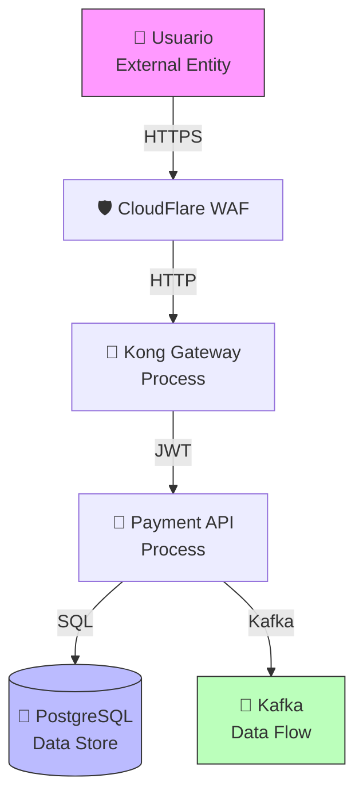
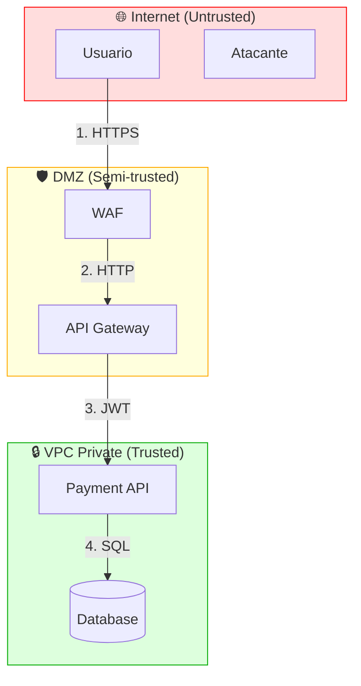

# Estándar Técnico — Threat Modeling

---

## 1. Propósito

Identificar amenazas de seguridad en fase de diseño mediante STRIDE (Spoofing, Tampering, Repudiation, Information Disclosure, DoS, Elevation of Privilege), generando controles antes de implementación y reduciendo costo de remediation.

---

## 2. Alcance

**Aplica a:**

**No aplica a:**

- Refactors sin cambio de funcionalidad
- Cambios cosméticos de UI

---

## 3. Tecnologías Aprobadas

| **Modeling Tool** | OWASP Threat Dragon  | 2.0+           | Visual threat modeling |
| **Methodology**   | STRIDE               | -              | Microsoft threat model |
| **Documentation** | Markdown + Mermaid   | -              | Diagramas en Git       |
| **Collaboration** | Miro / FigJam        | -              | Workshops remotos      |
| **Review**        | ADR Security Section | -              | Documentar en ADRs     |

> El uso de tecnologías no listadas requiere aprobación de Arquitectura.

---

## 4. Requisitos Obligatorios 🔴

### Cuándo Hacer Threat Modeling

- [ ] **Nuevas aplicaciones**: Obligatorio antes de implementación
- [ ] **Cambios arquitectónicos**: ADRs con sección de seguridad
- [ ] **Integraciones externas**: APIs de terceros, webhooks
- [ ] **Superficie de ataque aumenta**: Nuevos endpoints públicos
- [ ] **Datos sensibles**: PII, financieros, PCI DSS

### Proceso

- [ ] **Diagramar sistema**: DFD (Data Flow Diagrams) con trust boundaries
- [ ] **Identificar assets**: Datos, servicios, credenciales
- [ ] **Aplicar STRIDE**: Por cada componente
- [ ] **Clasificar amenazas**: Por riesgo (Likelihood x Impact)
- [ ] **Definir controles**: Mitigación, transferencia, aceptación
- [ ] **Documentar**: En ADR o documento dedicado
- [ ] **Revisar**: Con Security Architect

---

## 5. Metodología STRIDE

### Categorías de Amenazas

| STRIDE | Amenaza                | Descripción                | Ejemplo                    | Control                                 |
| ------ | ---------------------- | -------------------------- | -------------------------- | --------------------------------------- |
| **S**  | Spoofing               | Suplantación de identidad  | JWT token theft            | MFA, token expiration                   |
| **T**  | Tampering              | Modificación no autorizada | SQL injection              | Input validation, parameterized queries |
| **R**  | Repudiation            | Negación de acciones       | Usuario niega transacción  | Audit logging, digital signatures       |
| **I**  | Information Disclosure | Exposición de datos        | Logs con PII               | Data masking, encryption                |
| **D**  | Denial of Service      | Denegación de servicio     | API flooding               | Rate limiting, auto-scaling             |
| **E**  | Elevation of Privilege | Escalada de privilegios    | Acceso admin no autorizado | RBAC, least privilege                   |

---

## 6. Data Flow Diagram (DFD)

### Elementos de DFD



### Trust Boundaries



---

## 7. Aplicar STRIDE por Componente

### Ejemplo: Payment API

```markdown
## Threat Model - Payment API

### Assets

- Datos de tarjetas de crédito (PCI DSS)
- Información financiera de transacciones
- Credenciales de acceso a Stripe
- JWT tokens

### Trust Boundaries

1. Internet → WAF (untrusted → semi-trusted)
2. Kong Gateway → Payment API (semi-trusted → trusted)
3. Payment API → PostgreSQL (trusted → highly trusted)

### STRIDE Analysis

#### 1. Spoofing (Suplantación)

| ID   | Amenaza            | Descripción                            | Likelihood | Impact   | Risk     | Control                                    |
| ---- | ------------------ | -------------------------------------- | ---------- | -------- | -------- | ------------------------------------------ |
| S-01 | JWT token theft    | Atacante roba token y suplanta usuario | MEDIUM     | HIGH     | **HIGH** | TLS 1.3, short TTL (15min), refresh tokens |
| S-02 | API key compromise | Stripe API key expuesta en logs        | LOW        | CRITICAL | **HIGH** | AWS Secrets Manager, rotation, no logs     |

#### 2. Tampering (Manipulación)

| ID   | Amenaza           | Descripción                 | Likelihood | Impact   | Risk         | Control                                  |
| ---- | ----------------- | --------------------------- | ---------- | -------- | ------------ | ---------------------------------------- |
| T-01 | SQL Injection     | Inyección SQL en parámetros | MEDIUM     | CRITICAL | **CRITICAL** | EF Core parametrizado, NO raw SQL        |
| T-02 | Request tampering | Modificar amount en request | HIGH       | HIGH     | **CRITICAL** | Input validation, HMAC signatures        |
| T-03 | MITM attack       | Interceptar tráfico HTTP    | LOW        | HIGH     | **MEDIUM**   | TLS 1.3 obligatorio, certificate pinning |

#### 3. Repudiation (Repudio)

| ID   | Amenaza                   | Descripción                         | Likelihood | Impact | Risk       | Control                                   |
| ---- | ------------------------- | ----------------------------------- | ---------- | ------ | ---------- | ----------------------------------------- |
| R-01 | Usuario niega transacción | No hay evidencia de aprobación      | MEDIUM     | HIGH   | **HIGH**   | Audit logs inmutables, digital signatures |
| R-02 | Falta de trazabilidad     | No se registra quién modificó datos | LOW        | MEDIUM | **MEDIUM** | CloudTrail, application logs con user_id  |

#### 4. Information Disclosure (Divulgación)

| ID   | Amenaza         | Descripción                       | Likelihood | Impact   | Risk         | Control                                |
| ---- | --------------- | --------------------------------- | ---------- | -------- | ------------ | -------------------------------------- |
| I-01 | PII en logs     | Tarjetas en logs de aplicación    | MEDIUM     | CRITICAL | **CRITICAL** | Log masking, structured logging        |
| I-02 | Error messages  | Stack traces expuestos            | HIGH       | MEDIUM   | **HIGH**     | Generic error messages, log internally |
| I-03 | Database breach | Acceso no autorizado a PostgreSQL | LOW        | CRITICAL | **HIGH**     | Encryption at-rest, Security Groups    |

#### 5. Denial of Service (DoS)

| ID   | Amenaza                  | Descripción                | Likelihood | Impact | Risk       | Control                          |
| ---- | ------------------------ | -------------------------- | ---------- | ------ | ---------- | -------------------------------- |
| D-01 | API flooding             | 10,000 req/sec             | MEDIUM     | HIGH   | **HIGH**   | Rate limiting (Kong 100 req/min) |
| D-02 | DB connection exhaustion | Muchas conexiones abiertas | MEDIUM     | HIGH   | **HIGH**   | Connection pooling, timeouts     |
| D-03 | Resource exhaustion      | CPU/memoria al 100%        | LOW        | HIGH   | **MEDIUM** | Auto-scaling, resource limits    |

#### 6. Elevation of Privilege (Escalada)


| ID   | Amenaza                       | Descripción                     | Likelihood | Impact   | Risk         | Control                          |

| ---- | ----------------------------- | ------------------------------- | ---------- | -------- | ------------ | -------------------------------- |
| E-01 | Bypass authorization          | Acceder sin permisos adecuados  | MEDIUM     | CRITICAL | **CRITICAL** | RBAC granular, claims validation |

| E-02 | Admin panel exposed           | /admin sin autenticación        | LOW        | CRITICAL | **HIGH**     | IP whitelisting, strong auth     |
| E-03 | IAM role privilege escalation | ECS task con permisos excesivos | MEDIUM     | HIGH     | **HIGH**     | Least privilege IAM policies     |


### Risk Matrix
```

         Impact →
    LOW    MEDIUM    HIGH    CRITICAL

L ┌──────┬────────┬────────┬──────────┐
i │ LOW │ LOW │ MEDIUM │ HIGH │
k ├──────┼────────┼────────┼──────────┤
e │ LOW │ MEDIUM │ HIGH │ CRITICAL │
l ├──────┼────────┼────────┼──────────┤
i │MEDIUM│ HIGH │ HIGH │ CRITICAL │
h ├──────┼────────┼────────┼──────────┤
o │ HIGH │ HIGH │CRITICAL│ CRITICAL │
o └──────┴────────┴────────┴──────────┘
↓

```
### Residual Risks Accepted

| ID | Risk | Justification | Acceptance |
|----|------|---------------|------------|
| D-03 | Resource exhaustion (MEDIUM) | Auto-scaling mitiga mayoría de casos | CTO approval |
| I-03 | Database breach (HIGH) | Encryption + Security Groups + auditoría | CISO approval |
```

---

## 8. Controles por Amenaza

### Preventivos

- **Input Validation**: FluentValidation para todos los inputs
- **Parameterized Queries**: EF Core (NO raw SQL)
- **Authentication**: Keycloak SSO + JWT RS256
- **Authorization**: RBAC con claims granulares
- **Encryption**: TLS 1.3 in-transit, KMS at-rest
- **Rate Limiting**: Kong 100 req/min

### Detectivos

- **SAST**: SonarQube en CI/CD
- **DAST**: OWASP ZAP en staging
- **IDS**: AWS GuardDuty
- **Logging**: Grafana Loki + CloudTrail
- **Monitoring**: Alertas CloudWatch

### Correctivos

- **Incident Response**: Playbooks documentados
- **Backups**: Automáticos cada 24h, retención 30 días
- **Disaster Recovery**: RTO 4h, RPO 1h

---

## 9. OWASP Threat Dragon

### Instalación

```bash
# Desktop app
npm install -g @owasp/threat-dragon-desktop
threat-dragon

# O usar web version
docker run -p 3000:3000 owasp/threat-dragon:latest
```

### Crear Modelo Visual

1. **New Threat Model** → Payment API
2. **Add Diagram** → System Architecture
3. **Add Elements**:
   - External Entity: Usuario
   - Process: API Gateway, Payment API
   - Data Store: PostgreSQL
   - Data Flow: HTTPS, SQL
4. **Mark Trust Boundaries**
5. **Generate Threats** (automático STRIDE)
6. **Add Mitigations**
7. **Export JSON** → Guardar en Git

---

## 10. Documentación en ADR

### Template ADR con Threat Model

```markdown
# ADR-025: Implementar Payment Gateway con Stripe

## Contexto

Necesitamos procesar pagos con tarjetas de crédito.

## Decisión

Integrar Stripe como payment gateway.

## Threat Model 🔒

### Assets

- Datos PCI DSS (tarjetas)
- API keys de Stripe

### Amenazas Críticas

| ID   | STRIDE                 | Amenaza          | Control               |
| ---- | ---------------------- | ---------------- | --------------------- |
| T-01 | Tampering              | SQL Injection    | EF Core parametrizado |
| I-01 | Information Disclosure | Tarjetas en logs | Masking obligatorio   |
| S-01 | Spoofing               | Token theft      | TLS 1.3 + short TTL   |

### Controles Implementados

- ✅ Stripe Elements (NO almacenar CVV)
- ✅ PCI DSS SAQ-A compliance
- ✅ Secrets Manager para API keys
- ✅ Webhook signature validation

### Security Sign-off

- [x] Security Architect: @security-team

- [x] Date: 2024-12-15
```

---

## 11. Validación de Cumplimiento

```bash


# Verificar threat models en repositorio
find . -name "*threat-model*.json" -o -name "*threat-model*.md"


# Listar amenazas CRITICAL sin mitigación

grep -A 5 "CRITICAL" threat-models/*.md | grep -v "Control:"

```

## 12. Referencias

**STRIDE:**

- [STRIDE Threat Modeling (Microsoft)](https://learn.microsoft.com/en-us/azure/security/develop/threat-modeling-tool-threats)
- [The STRIDE Threat Model](https://shostack.org/files/microsoft/The-Threats-To-Our-Products.docx)

**OWASP:**

- [OWASP Threat Dragon](https://owasp.org/www-project-threat-dragon/)
- [OWASP Threat Modeling](https://owasp.org/www-community/Threat_Modeling)
**Books:**

- [Threat Modeling: Designing for Security (Adam Shostack)](https://www.wiley.com/en-us/Threat+Modeling%3A+Designing+for+Security-p-9781118809990)
