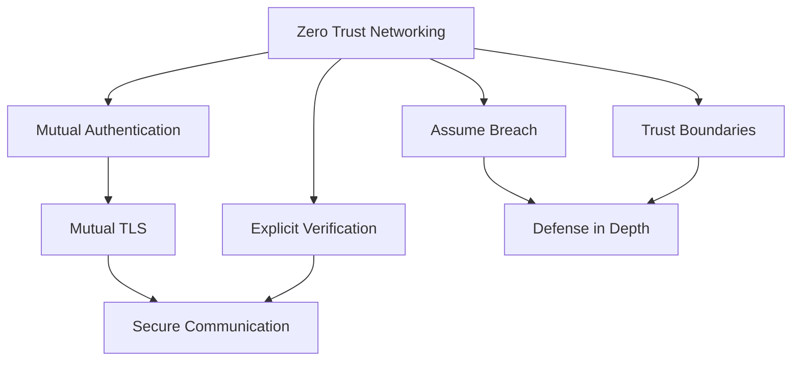

# Zero Trust Architecture

## Contexto

Este estándar consolida **6 conceptos relacionados** con la implementación de arquitectura Zero Trust, siguiendo el principio de "nunca confiar, siempre verificar". Complementa los lineamientos de seguridad asegurando que todos los accesos sean autenticados, autorizados y cifrados.

**Conceptos incluidos:**

- **Zero Trust Networking** → Red sin confianza implícita, segmentación estricta
- **Mutual Authentication** → Autenticación bidireccional cliente-servidor
- **Mutual TLS (mTLS)** → Cifrado TLS con autenticación de certificados en ambas direcciones
- **Explicit Verification** → Verificación continua de identidad, contexto y estado
- **Assume Breach** → Diseño asumiendo que la red ya está comprometida
- **Trust Boundaries** → Definición clara de límites de confianza entre componentes

---

## Stack Tecnológico

| Componente                 | Tecnología          | Versión | Uso                                   |
| -------------------------- | ------------------- | ------- | ------------------------------------- |
| **Runtime**                | .NET                | 8.0+    | Aplicaciones                          |
| **Identity Provider**      | Keycloak            | 23.0+   | Autenticación centralizada            |
| **API Gateway**            | Kong                | 3.5+    | mTLS termination, mutual auth         |
| **Certificate Management** | AWS ACM             | Latest  | Gestión de certificados TLS           |
| **Container Platform**     | AWS ECS Fargate     | Latest  | Aislamiento de contenedores           |
| **Network**                | AWS VPC             | Latest  | Segmentación de red                   |
| **Secrets**                | AWS Secrets Manager | Latest  | Almacenamiento seguro de certificados |

---

## Conceptos Fundamentales

Este estándar cubre **6 principios fundamentales** de Zero Trust Security:

### Índice de Conceptos

1. **Zero Trust Networking**: Eliminar confianza implícita basada en ubicación de red
2. **Mutual Authentication**: Ambas partes validan identidad antes de comunicarse
3. **Mutual TLS (mTLS)**: Cifrado con autenticación bidireccional mediante certificados
4. **Explicit Verification**: Verificar identidad, dispositivo, ubicación y estado en cada request
5. **Assume Breach**: Diseñar asumiendo que atacantes ya están dentro del perímetro
6. **Trust Boundaries**: Definir y proteger límites entre dominios de confianza

### Relación entre Conceptos



**Principios core:**

- **Never trust, always verify**: No confianza implícita
- **Least privilege access**: Mínimo acceso necesario
- **Microsegmentation**: Aislar recursos en segmentos pequeños
- **Continuous validation**: Verificación continua, no solo en autenticación inicial

---

## 1. Zero Trust Networking

### ¿Qué es Zero Trust Networking?

Modelo de seguridad que elimina la confianza implícita basada en ubicación de red. Todo acceso requiere autenticación y autorización explícita, sin importar si viene de "dentro" o "fuera" del perímetro.

**Propósito:** Eliminar el concepto de "red confiable" vs "red no confiable". Tratar toda red como hostil.

**Principios clave:**

- **No hay red interna confiable**: Every network is hostile
- **Verify everything**: Autenticar y autorizar cada acceso
- **Microsegmentation**: Segmentar en unidades pequeñas aisladas
- **Context-aware access**: Decisiones basadas en contexto (usuario, dispositivo, ubicación, hora)

**Beneficios:**
✅ Reduce la superficie de ataque
✅ Limita movimiento lateral de atacantes
✅ Protege contra amenazas internas
✅ Mejora visibilidad de accesos

### Ejemplo Comparativo

```csharp
// ❌ MALO: Confiar en red interna
public class OrdersController : ControllerBase
{
    [HttpGet]
    public IActionResult GetOrders()
    {
        // Si la request viene de IP interna, asumir que es confiable
        var clientIp = HttpContext.Connection.RemoteIpAddress;
        if (IsInternalNetwork(clientIp))
        {
            // Sin validación adicional - PELIGROSO
            return Ok(_orderService.GetAll());
        }

        // Solo validar si viene de red externa
        return Unauthorized();
    }
}

// ✅ BUENO: Zero Trust - siempre verificar
public class OrdersController : ControllerBase
{
    [HttpGet]
    [Authorize] // Requerir autenticación siempre
    [RequirePermission("orders:read")] // Verificar autorización
    public IActionResult GetOrders()
    {
        // Validar claims del token JWT
        var userId = User.FindFirst("sub")?.Value;
        var tenantId = User.FindFirst("tenant_id")?.Value;

        if (string.IsNullOrEmpty(userId) || string.IsNullOrEmpty(tenantId))
            return Unauthorized();

        // Context-aware: registrar acceso para auditoría
        _auditLog.LogAccess(userId, tenantId, "orders:read", HttpContext);

        // Aplicar filtros según contexto del usuario
        return Ok(_orderService.GetForUser(userId, tenantId));
    }
}
```

### Implementación: Middleware de Context-Aware Access

```csharp
// src/Shared/Security/ZeroTrustMiddleware.cs
using System.Security.Claims;
using Microsoft.AspNetCore.Http;

public class ZeroTrustMiddleware
{
    private readonly RequestDelegate _next;
    private readonly ILogger<ZeroTrustMiddleware> _logger;
    private readonly IAuditLog _auditLog;

    public ZeroTrustMiddleware(
        RequestDelegate next,
        ILogger<ZeroTrustMiddleware> logger,
        IAuditLog auditLog)
    {
        _next = next;
        _logger = logger;
        _auditLog = auditLog;
    }

    public async Task InvokeAsync(HttpContext context)
    {
        // 1. Extract identity & context
        var principal = context.User;
        var accessContext = BuildAccessContext(context);

        // 2. Evaluate access policy (never trust, always verify)
        if (!await EvaluateAccessPolicy(principal, accessContext))
        {
            _logger.LogWarning(
                "Access denied: {User} from {IP} to {Path}",
                principal?.Identity?.Name ?? "anonymous",
                context.Connection.RemoteIpAddress,
                context.Request.Path);

            context.Response.StatusCode = StatusCodes.Status403Forbidden;
            return;
        }

        // 3. Log access for audit trail
        await _auditLog.LogAccessAsync(new AccessEvent
        {
            UserId = principal?.FindFirst("sub")?.Value,
            TenantId = principal?.FindFirst("tenant_id")?.Value,
            IpAddress = context.Connection.RemoteIpAddress?.ToString(),
            UserAgent = context.Request.Headers["User-Agent"],
            Path = context.Request.Path,
            Method = context.Request.Method,
            Timestamp = DateTime.UtcNow
        });

        // 4. Continue pipeline
        await _next(context);
    }

    private AccessContext BuildAccessContext(HttpContext context)
    {
        return new AccessContext
        {
            IpAddress = context.Connection.RemoteIpAddress,
            UserAgent = context.Request.Headers["User-Agent"].ToString(),
            RequestPath = context.Request.Path,
            RequestMethod = context.Request.Method,
            Timestamp = DateTime.UtcNow,
            GeoLocation = GetGeoLocation(context.Connection.RemoteIpAddress) // IP geolocation
        };
    }

    private async Task<bool> EvaluateAccessPolicy(
        ClaimsPrincipal principal,
        AccessContext context)
    {
        // Policy example: Block access from suspicious countries
        var allowedCountries = new[] { "US", "PE", "CL", "CO" };
        if (!allowedCountries.Contains(context.GeoLocation?.CountryCode))
        {
            return false;
        }

        // Policy: Block access outside business hours for sensitive operations
        if (context.RequestPath.StartsWithSegments("/api/admin"))
        {
            var hour = context.Timestamp.Hour;
            if (hour < 8 || hour > 18) // Outside 8 AM - 6 PM
                return false;
        }

        // Policy: Require MFA for sensitive operations
        var isMfaVerified = principal?.FindFirst("amr")?.Value?.Contains("mfa") ?? false;
        if (context.RequestPath.StartsWithSegments("/api/payments") && !isMfaVerified)
        {
            return false;
        }

        return true;
    }

    private GeoLocation GetGeoLocation(IPAddress ipAddress)
    {
        // Integrate with IP geolocation service (e.g., MaxMind GeoIP)
        // Simplified for demo
        return new GeoLocation { CountryCode = "PE" };
    }
}

// Registration in Program.cs
app.UseMiddleware<ZeroTrustMiddleware>();
```

---

## 2. Mutual Authentication

### ¿Qué es Mutual Authentication?

Proceso donde ambas partes (cliente y servidor) validan la identidad de la otra antes de establecer comunicación. A diferencia de autenticación unilateral (solo servidor valida cliente), en mutual auth el cliente también valida al servidor.

**Propósito:** Prevenir ataques man-in-the-middle y garantizar que ambas partes son quienes dicen ser.

**Métodos:**

- **Mutual TLS**: Usando certificados X.509
- **Kerberos**: Tickets cruzados
- **OAuth 2.0 Mutual TLS**: Token binding con certificados

**Beneficios:**
✅ Previene suplantación de servidor (phishing)
✅ Protege contra man-in-the-middle
✅ Autenticación fuerte sin passwords
✅ Ideal para comunicación service-to-service

### Implementación: Validación de Certificado Cliente

```csharp
// src/OrderService.Api/Program.cs
using Microsoft.AspNetCore.Server.Kestrel.Https;

var builder = WebApplication.CreateBuilder(args);

// Configurar Kestrel para requerir certificado cliente
builder.WebHost.ConfigureKestrel(options =>
{
    options.ConfigureHttpsDefaults(httpsOptions =>
    {
        httpsOptions.ClientCertificateMode = ClientCertificateMode.RequireCertificate;
        httpsOptions.CheckCertificateRevocation = true;

        // Validación personalizada del certificado cliente
        httpsOptions.ClientCertificateValidation = (certificate, chain, errors) =>
        {
            // 1. Verificar que el certificado sea emitido por CA confiable
            if (errors != SslPolicyErrors.None)
            {
                return false;
            }

            // 2. Verificar que el Subject CN esté en whitelist
            var allowedServices = new[]
            {
                "payment-service.talma.local",
                "inventory-service.talma.local",
                "notification-service.talma.local"
            };

            var subjectName = certificate.Subject;
            var cn = subjectName.Split(',')
                .FirstOrDefault(x => x.Trim().StartsWith("CN="))
                ?.Replace("CN=", "").Trim();

            if (!allowedServices.Contains(cn))
            {
                return false;
            }

            // 3. Verificar que no esté expirado
            if (certificate.NotAfter < DateTime.UtcNow)
            {
                return false;
            }

            return true;
        };
    });
});

// Agregar autenticación basada en certificado
builder.Services.AddAuthentication(CertificateAuthenticationDefaults.AuthenticationScheme)
    .AddCertificate(options =>
    {
        options.AllowedCertificateTypes = CertificateTypes.All;
        options.RevocationMode = X509RevocationMode.Online;

        options.Events = new CertificateAuthenticationEvents
        {
            OnCertificateValidated = context =>
            {
                var claims = new[]
                {
                    new Claim(ClaimTypes.NameIdentifier,
                        context.ClientCertificate.Subject,
                        ClaimValueTypes.String),
                    new Claim("certificate-thumbprint",
                        context.ClientCertificate.Thumbprint,
                        ClaimValueTypes.String)
                };

                context.Principal = new ClaimsPrincipal(
                    new ClaimsIdentity(claims, context.Scheme.Name));
                context.Success();

                return Task.CompletedTask;
            },
            OnAuthenticationFailed = context =>
            {
                context.Fail($"Certificate validation failed: {context.Exception.Message}");
                return Task.CompletedTask;
            }
        };
    });

var app = builder.Build();

app.UseAuthentication();
app.UseAuthorization();

app.MapControllers();
app.Run();
```

---

## 3. Mutual TLS (mTLS)

### ¿Qué es Mutual TLS?

Extensión de TLS donde tanto el cliente como el servidor presentan certificados digitales para autenticarse mutuamente. El servidor valida el certificado del cliente y viceversa.

**Propósito:** Autenticación fuerte y cifrado de comunicaciones service-to-service sin passwords.

**Componentes clave:**

- **Client Certificate**: Certificado X.509 del cliente
- **Server Certificate**: Certificado X.509 del servidor
- **CA Trust Chain**: Cadena de confianza de la Autoridad Certificadora
- **Certificate Validation**: Validación de revocación (OCSP/CRL)

**Flujo mTLS:**

1. Cliente inicia handshake TLS
2. Servidor envía su certificado
3. Cliente valida certificado del servidor
4. Servidor solicita certificado del cliente
5. Cliente envía su certificado
6. Servidor valida certificado del cliente
7. Si ambos válidos → establece conexión cifrada

### Configuración: HttpClient con mTLS

```csharp
// src/Shared/Http/MutualTlsHttpClientFactory.cs
using System.Net.Http;
using System.Security.Cryptography.X509Certificates;

public class MutualTlsHttpClientFactory
{
    private readonly IConfiguration _configuration;
    private readonly ILogger<MutualTlsHttpClientFactory> _logger;

    public MutualTlsHttpClientFactory(
        IConfiguration configuration,
        ILogger<MutualTlsHttpClientFactory> logger)
    {
        _configuration = configuration;
        _logger = logger;
    }

    public HttpClient CreateClient(string serviceName)
    {
        // Cargar certificado cliente desde AWS Secrets Manager
        var clientCertificate = LoadClientCertificate(serviceName);

        var handler = new HttpClientHandler
        {
            // Agregar certificado cliente para mTLS
            ClientCertificates = { clientCertificate },

            // Validar certificado del servidor
            ServerCertificateCustomValidationCallback = (message, cert, chain, errors) =>
            {
                if (errors == SslPolicyErrors.None)
                    return true;

                _logger.LogWarning(
                    "Server certificate validation failed for {Service}: {Errors}",
                    serviceName, errors);

                // En producción: rechazar si hay errores
                // En desarrollo: permitir certificados self-signed
                return _configuration.GetValue<bool>("AllowInvalidCertificates");
            }
        };

        return new HttpClient(handler)
        {
            BaseAddress = new Uri(_configuration[$"Services:{serviceName}:BaseUrl"]),
            Timeout = TimeSpan.FromSeconds(30)
        };
    }

    private X509Certificate2 LoadClientCertificate(string serviceName)
    {
        // Opción 1: Desde archivo PFX
        var certPath = _configuration[$"Certificates:{serviceName}:Path"];
        var certPassword = _configuration[$"Certificates:{serviceName}:Password"];

        if (!string.IsNullOrEmpty(certPath))
        {
            return new X509Certificate2(certPath, certPassword);
        }

        // Opción 2: Desde AWS Secrets Manager
        var secretName = $"mtls/{serviceName}/client-certificate";
        var secretValue = GetSecretFromAwsSecretsManager(secretName);

        var certBytes = Convert.FromBase64String(secretValue);
        return new X509Certificate2(certBytes, certPassword);
    }

    private string GetSecretFromAwsSecretsManager(string secretName)
    {
        // Implementar integración con AWS Secrets Manager SDK
        // Simplificado para demo
        return "base64_encoded_certificate_here";
    }
}

// Registro en Program.cs
builder.Services.AddSingleton<MutualTlsHttpClientFactory>();

builder.Services.AddHttpClient("payment-service")
    .ConfigurePrimaryHttpMessageHandler(sp =>
    {
        var factory = sp.GetRequiredService<MutualTlsHttpClientFactory>();
        return factory.CreateClient("payment-service").GetType()
            .GetProperty("Handler")!
            .GetValue(factory.CreateClient("payment-service")) as HttpMessageHandler;
    });
```

### Kong API Gateway: mTLS Termination

```yaml
# kong/services/payment-service.yaml
_format_version: "3.0"

services:
  - name: payment-service
    url: https://payment-service.internal:8443
    protocol: https

    # mTLS para upstream (Kong → Payment Service)
    client_certificate:
      id: kong-client-cert

    # Verificar certificado del upstream
    tls_verify: true
    tls_verify_depth: 2
    ca_certificates:
      - internal-ca

routes:
  - name: payment-routes
    paths:
      - /api/payments
    strip_path: false

    # mTLS para downstream (Client → Kong)
    protocols:
      - https

plugins:
  # Plugin para verificar certificado del cliente
  - name: mtls-auth
    config:
      ca_certificates:
        - client-ca

      # Whitelist de CNs permitidos
      authenticated_group_by: CN

      # Rechazar si no presenta certificado válido
      anonymous: false

      # Headers a agregar con info del certificado
      consumer_by: CN

  # Rate limiting por certificado (no por IP)
  - name: rate-limiting
    config:
      policy: local
      limit_by: certificate
      second: 100
      minute: 1000
```

---

## 4. Explicit Verification

### ¿Qué es Explicit Verification?

Validación continua y explícita de identidad, contexto y estado de seguridad en cada acceso, no solo en la autenticación inicial. Considera múltiples factores: usuario, dispositivo, ubicación, hora, estado de seguridad del endpoint.

**Propósito:** Tomar decisiones de acceso basadas en contexto completo, no solo en "¿quién eres?" sino también "¿desde dónde?", "¿cuándo?", "¿en qué estado está tu dispositivo?".

**Factores de verificación:**

- **Identity**: JWT claims, SAML assertions, certificados
- **Device**: Device ID, OS version, security posture
- **Location**: IP geolocation, GPS coordinates
- **Time**: Hora del día, día de la semana
- **Risk Score**: Detección de anomalías, threat intelligence

**Beneficios:**
✅ Detección de accesos anómalos
✅ Prevención de robo de credenciales
✅ Adaptación dinámica de controles
✅ Cumplimiento de políticas condicionales

### Implementación: Policy Engine

```csharp
// src/Shared/Security/AccessPolicyEngine.cs
public class AccessPolicyEngine
{
    private readonly ILogger<AccessPolicyEngine> _logger;
    private readonly IGeoLocationService _geoLocation;
    private readonly IThreatIntelligence _threatIntel;

    public async Task<AccessDecision> EvaluateAsync(
        ClaimsPrincipal principal,
        HttpContext httpContext,
        string resource,
        string action)
    {
        var context = await BuildVerificationContextAsync(principal, httpContext);
        var policies = GetApplicablePolicies(resource, action);

        var decision = new AccessDecision
        {
            Allowed = true,
            RequiresMfa = false,
            RequiresAdditionalVerification = false,
            RiskScore = 0
        };

        foreach (var policy in policies)
        {
            var policyResult = await policy.EvaluateAsync(context);

            decision.Allowed &= policyResult.Allowed;
            decision.RequiresMfa |= policyResult.RequiresMfa;
            decision.RequiresAdditionalVerification |= policyResult.RequiresAdditionalVerification;
            decision.RiskScore = Math.Max(decision.RiskScore, policyResult.RiskScore);
            decision.Reasons.AddRange(policyResult.Reasons);
        }

        _logger.LogInformation(
            "Access decision for {User} to {Resource}.{Action}: {Decision} (Risk: {Risk})",
            principal.Identity?.Name,
            resource,
            action,
            decision.Allowed ? "Allowed" : "Denied",
            decision.RiskScore);

        return decision;
    }

    private async Task<VerificationContext> BuildVerificationContextAsync(
        ClaimsPrincipal principal,
        HttpContext httpContext)
    {
        var ipAddress = httpContext.Connection.RemoteIpAddress;
        var geoLocation = await _geoLocation.LookupAsync(ipAddress);
        var isThreat = await _threatIntel.IsThreatAsync(ipAddress);

        return new VerificationContext
        {
            UserId = principal.FindFirst("sub")?.Value,
            TenantId = principal.FindFirst("tenant_id")?.Value,
            Email = principal.FindFirst("email")?.Value,
            Roles = principal.FindAll("role").Select(c => c.Value).ToList(),

            // Device context
            UserAgent = httpContext.Request.Headers["User-Agent"].ToString(),
            DeviceId = httpContext.Request.Headers["X-Device-Id"].ToString(),

            // Location context
            IpAddress = ipAddress?.ToString(),
            Country = geoLocation?.Country,
            City = geoLocation?.City,

            // Time context
            Timestamp = DateTime.UtcNow,
            DayOfWeek = DateTime.UtcNow.DayOfWeek,
            Hour = DateTime.UtcNow.Hour,

            // Security state
            IsMfaVerified = principal.FindFirst("amr")?.Value?.Contains("mfa") ?? false,
            IsThreatIp = isThreat,
            SessionAge = GetSessionAge(principal)
        };
    }

    private TimeSpan GetSessionAge(ClaimsPrincipal principal)
    {
        var authTimeClaim = principal.FindFirst("auth_time")?.Value;
        if (long.TryParse(authTimeClaim, out var authTime))
        {
            var authDateTime = DateTimeOffset.FromUnixTimeSeconds(authTime).UtcDateTime;
            return DateTime.UtcNow - authDateTime;
        }
        return TimeSpan.MaxValue;
    }
}

// Example Policy: Location-based access
public class LocationPolicy : IAccessPolicy
{
    public async Task<PolicyResult> EvaluateAsync(VerificationContext context)
    {
        // Policy: Only allow access from Peru, Chile, Colombia
        var allowedCountries = new[] { "PE", "CL", "CO" };

        if (!allowedCountries.Contains(context.Country))
        {
            return new PolicyResult
            {
                Allowed = false,
                RiskScore = 80,
                Reasons = { $"Access from unauthorized country: {context.Country}" }
            };
        }

        // Policy: Suspicious if accessing from new country
        var userPreviousCountries = await GetUserHistoricalCountriesAsync(context.UserId);
        if (!userPreviousCountries.Contains(context.Country))
        {
            return new PolicyResult
            {
                Allowed = true,
                RequiresMfa = true, // Require additional MFA
                RiskScore = 50,
                Reasons = { "First access from new country - MFA required" }
            };
        }

        return PolicyResult.Allowed;
    }
}

// Example Policy: Time-based access
public class TimePolicy : IAccessPolicy
{
    public Task<PolicyResult> EvaluateAsync(VerificationContext context)
    {
        // Policy: Admin operations only during business hours
        if (context.Roles.Contains("admin"))
        {
            var isBusinessHours = context.Hour >= 8 && context.Hour <= 18 &&
                                  context.DayOfWeek != DayOfWeek.Saturday &&
                                  context.DayOfWeek != DayOfWeek.Sunday;

            if (!isBusinessHours)
            {
                return Task.FromResult(new PolicyResult
                {
                    Allowed = false,
                    RiskScore = 60,
                    Reasons = { "Admin access outside business hours not allowed" }
                });
            }
        }

        return Task.FromResult(PolicyResult.Allowed);
    }
}
```

---

## 5. Assume Breach

### ¿Qué es Assume Breach?

Mentalidad de diseño que asume que el perímetro ya ha sido comprometido y que atacantes ya tienen presencia en la red. Diseñar controles para limitar el impacto incluso cuando el atacante está "dentro".

**Propósito:** Minimizar el radio de explosión (blast radius) de un compromiso exitoso.

**Estrategias:**

- **Least privilege**: Mínimo acceso necesario
- **Microsegmentation**: Aislar recursos en segmentos pequeños
- **Lateral movement prevention**: Dificultar movimiento entre servicios
- **Continuous monitoring**: Detectar comportamiento anómalo
- **Immutable infrastructure**: Infraestructura que no puede modificarse

**Beneficios:**
✅ Limita impacto de compromiso
✅ Detecta amenazas internas
✅ Reduce dwell time (tiempo que atacante permanece sin ser detectado)
✅ Mejor postura de seguridad general

### Implementación: Least Privilege con Claims-based Authorization

```csharp
// src/Shared/Security/PermissionRequirement.cs
using Microsoft.AspNetCore.Authorization;

public class PermissionRequirement : IAuthorizationRequirement
{
    public string Permission { get; }

    public PermissionRequirement(string permission)
    {
        Permission = permission;
    }
}

public class PermissionHandler : AuthorizationHandler<PermissionRequirement>
{
    protected override Task HandleRequirementAsync(
        AuthorizationHandlerContext context,
        PermissionRequirement requirement)
    {
        // Verificar que el usuario tiene el permiso específico en sus claims
        if (context.User.HasClaim("permission", requirement.Permission))
        {
            context.Succeed(requirement);
        }
        else
        {
            // Log acceso denegado para detección de anomalías
            LogUnauthorizedAccess(context.User, requirement.Permission);
        }

        return Task.CompletedTask;
    }

    private void LogUnauthorizedAccess(ClaimsPrincipal user, string permission)
    {
        // Implementar logging para SIEM/detección de amenazas
        // Múltiples intentos de acceso no autorizado → alerta de seguridad
    }
}

// Attribute para aplicar fácilmente
public class RequirePermissionAttribute : AuthorizeAttribute
{
    public RequirePermissionAttribute(string permission)
    {
        Policy = $"Require{permission}";
    }
}

// Program.cs - Registrar políticas granulares
builder.Services.AddAuthorization(options =>
{
    // Crear política por cada permiso granular
    options.AddPolicy("Requireorders:read", policy =>
        policy.Requirements.Add(new PermissionRequirement("orders:read")));

    options.AddPolicy("Requireorders:write", policy =>
        policy.Requirements.Add(new PermissionRequirement("orders:write")));

    options.AddPolicy("Requireorders:delete", policy =>
        policy.Requirements.Add(new PermissionRequirement("orders:delete")));

    options.AddPolicy("Requirepayments:process", policy =>
        policy.Requirements.Add(new PermissionRequirement("payments:process")));
});

builder.Services.AddSingleton<IAuthorizationHandler, PermissionHandler>();

// Controller - aplicar least privilege
[ApiController]
[Route("api/[controller]")]
public class OrdersController : ControllerBase
{
    // Leer - permiso mínimo
    [HttpGet]
    [RequirePermission("orders:read")]
    public IActionResult GetOrders() { }

    // Crear - requiere permiso específico de escritura
    [HttpPost]
    [RequirePermission("orders:write")]
    public IActionResult CreateOrder() { }

    // Eliminar - permiso más privilegiado
    [HttpDelete("{id}")]
    [RequirePermission("orders:delete")]
    public IActionResult DeleteOrder(int id) { }
}
```

### Monitoreo: Detección de Lateral Movement

```csharp
// src/Shared/Security/LateralMovementDetector.cs
public class LateralMovementDetector : IHostedService
{
    private readonly ILogger<LateralMovementDetector> _logger;
    private readonly IAuditLogRepository _auditLog;
    private Timer _timer;

    public Task StartAsync(CancellationToken cancellationToken)
    {
        // Analizar logs cada 5 minutos buscando patrones sospechosos
        _timer = new Timer(AnalyzeAccessPatterns, null, TimeSpan.Zero, TimeSpan.FromMinutes(5));
        return Task.CompletedTask;
    }

    private async void AnalyzeAccessPatterns(object state)
    {
        var recentAccess = await _auditLog.GetAccessEventsLastHourAsync();

        // Patrón 1: Usuario accediendo a múltiples servicios en corto tiempo
        var suspiciousUsers = recentAccess
            .GroupBy(e => e.UserId)
            .Where(g => g.Select(e => e.ServiceName).Distinct().Count() > 5)
            .Select(g => g.Key);

        foreach (var userId in suspiciousUsers)
        {
            _logger.LogWarning(
                "Potential lateral movement detected: User {UserId} accessed {Count} different services in last hour",
                userId,
                recentAccess.Count(e => e.UserId == userId));

            // Trigger security alert
            await RaiseSecurityAlertAsync(userId, "Lateral Movement");
        }

        // Patrón 2: Múltiples fallos de autorización seguidos de éxito
        var authFailurePatterns = recentAccess
            .Where(e => !e.Success)
            .GroupBy(e => e.UserId)
            .Where(g => g.Count() > 10); // 10+ fallos en 1 hora

        foreach (var pattern in authFailurePatterns)
        {
            // Verificar si después hubo éxito (posible escalación de privilegios)
            var hasSuccessAfter = recentAccess
                .Any(e => e.UserId == pattern.Key && e.Success && e.Timestamp > pattern.Max(p => p.Timestamp));

            if (hasSuccessAfter)
            {
                _logger.LogCritical(
                    "Potential privilege escalation: User {UserId} had {FailCount} authorization failures followed by successful access",
                    pattern.Key,
                    pattern.Count());

                await RaiseSecurityAlertAsync(pattern.Key, "Privilege Escalation Attempt");
            }
        }
    }
}
```

---

## 6. Trust Boundaries

### ¿Qué son los Trust Boundaries?

Líneas conceptuales que separan componentes con diferentes niveles de confianza. Cada vez que se cruza un trust boundary, se debe validar, sanitizar y verificar todos los inputs.

**Propósito:** Identificar dónde aplicar controles de seguridad más estrictos.

**Ejemplos de trust boundaries:**

- **Internet ↔ DMZ**: Público no confiable → semi-confiable
- **DMZ ↔ Internal Network**: Semi-confiable → confiable
- **Service A ↔ Service B**: Diferentes dominios de negocio
- **User Input ↔ Application**: Input no confiable → lógica de negocio
- **Application ↔ Database**: Lógica → almacenamiento persistente

**Controles en trust boundaries:**

- Input validation
- Output encoding
- Authentication & Authorization
- Encryption
- Audit logging

### Implementación: Input Validation en Trust Boundary

```csharp
// src/Shared/Validation/TrustBoundaryValidator.cs
using FluentValidation;

// Trust Boundary: HTTP Request → Application Logic
public class CreateOrderValidator : AbstractValidator<CreateOrderRequest>
{
    public CreateOrderValidator()
    {
        // Validar cada input que cruza el trust boundary

        RuleFor(x => x.CustomerId)
            .NotEmpty()
            .WithMessage("CustomerId is required")
            .Must(BeValidGuid)
            .WithMessage("CustomerId must be a valid GUID");

        RuleFor(x => x.Items)
            .NotEmpty()
            .WithMessage("Order must have at least one item")
            .Must(items => items.Count <= 100)
            .WithMessage("Order cannot have more than 100 items");

        RuleForEach(x => x.Items).ChildRules(item =>
        {
            item.RuleFor(x => x.Sku)
                .NotEmpty()
                .MaximumLength(50)
                .Matches("^[A-Z0-9-]+$") // Solo alfanuméricos y guiones
                .WithMessage("SKU contains invalid characters");

            item.RuleFor(x => x.Quantity)
                .GreaterThan(0)
                .LessThanOrEqualTo(1000)
                .WithMessage("Quantity must be between 1 and 1000");
        });

        RuleFor(x => x.ShippingAddress)
            .NotNull()
            .SetValidator(new AddressValidator());
    }

    private bool BeValidGuid(string value)
    {
        return Guid.TryParse(value, out _);
    }
}

// Middleware para validar automáticamente en trust boundary
public class ValidationMiddleware
{
    private readonly RequestDelegate _next;

    public async Task InvokeAsync(HttpContext context)
    {
        // Solo validar requests con body (POST, PUT, PATCH)
        if (context.Request.Method != "GET" && context.Request.Method != "DELETE")
        {
            context.Request.EnableBuffering();

            // Leer body
            using var reader = new StreamReader(context.Request.Body, leaveOpen: true);
            var body = await reader.ReadToEndAsync();
            context.Request.Body.Position = 0;

            // Sanitizar: remover caracteres peligrosos
            body = SanitizeInput(body);

            // Validar JSON schema
            if (!IsValidJson(body))
            {
                context.Response.StatusCode = 400;
                await context.Response.WriteAsJsonAsync(new
                {
                    error = "Invalid JSON format"
                });
                return;
            }
        }

        await _next(context);
    }

    private string SanitizeInput(string input)
    {
        // Remover caracteres de control peligrosos
        input = Regex.Replace(input, @"[\x00-\x08\x0B\x0C\x0E-\x1F]", "");

        // Limitar longitud para prevenir DoS
        if (input.Length > 1_000_000) // 1 MB
        {
            throw new InvalidOperationException("Request body too large");
        }

        return input;
    }
}
```

### Terraform: Network Trust Boundaries

```hcl
# terraform/modules/network/main.tf

# Trust Boundary 1: Internet → Public Subnet (DMZ)
resource "aws_subnet" "public" {
  vpc_id                  = aws_vpc.main.id
  cidr_block              = "10.0.1.0/24"
  availability_zone       = "us-east-1a"
  map_public_ip_on_launch = true

  tags = {
    Name = "public-subnet"
    TrustBoundary = "dmz"
  }
}

# Trust Boundary 2: DMZ → Private Subnet (Application Layer)
resource "aws_subnet" "private_app" {
  vpc_id            = aws_vpc.main.id
  cidr_block        = "10.0.10.0/24"
  availability_zone = "us-east-1a"

  tags = {
    Name = "private-app-subnet"
    TrustBoundary = "application"
  }
}

# Trust Boundary 3: Application → Database Subnet
resource "aws_subnet" "private_data" {
  vpc_id            = aws_vpc.main.id
  cidr_block        = "10.0.20.0/24"
  availability_zone = "us-east-1a"

  tags = {
    Name = "private-data-subnet"
    TrustBoundary = "data"
  }
}

# Security Group: Public ALB (permite tráfico de Internet)
resource "aws_security_group" "alb_public" {
  name_prefix = "alb-public-"
  vpc_id      = aws_vpc.main.id

  ingress {
    description = "HTTPS from Internet"
    from_port   = 443
    to_port     = 443
    protocol    = "tcp"
    cidr_blocks = ["0.0.0.0/0"]
  }

  egress {
    description     = "To application layer only"
    from_port       = 8080
    to_port         = 8080
    protocol        = "tcp"
    security_groups = [aws_security_group.app.id]
  }

  tags = {
    TrustBoundary = "dmz-ingress"
  }
}

# Security Group: Application Layer (solo acepta tráfico del ALB)
resource "aws_security_group" "app" {
  name_prefix = "app-"
  vpc_id      = aws_vpc.main.id

  ingress {
    description     = "From ALB only"
    from_port       = 8080
    to_port         = 8080
    protocol        = "tcp"
    security_groups = [aws_security_group.alb_public.id]
  }

  egress {
    description     = "To database only"
    from_port       = 5432
    to_port         = 5432
    protocol        = "tcp"
    security_groups = [aws_security_group.database.id]
  }

  tags = {
    TrustBoundary = "application-layer"
  }
}

# Security Group: Database (solo acepta tráfico de Application Layer)
resource "aws_security_group" "database" {
  name_prefix = "database-"
  vpc_id      = aws_vpc.main.id

  ingress {
    description     = "From application layer only"
    from_port       = 5432
    to_port         = 5432
    protocol        = "tcp"
    security_groups = [aws_security_group.app.id]
  }

  # Sin egress (no necesita conectarse a nada)
  egress {
    description = "No outbound traffic"
    from_port   = 0
    to_port     = 0
    protocol    = "-1"
    cidr_blocks = []
  }

  tags = {
    TrustBoundary = "data-layer"
  }
}
```

---

## Requisitos Técnicos

### MUST (Obligatorio)

**Zero Trust Networking:**

- **MUST** autenticar y autorizar cada request, sin excepción
- **MUST** aplicar principio de least privilege en todos los accesos
- **MUST** implementar microsegmentación de red
- **MUST** registrar todos los accesos para auditoría

**Mutual Authentication:**

- **MUST** implementar mutual TLS para comunicación service-to-service
- **MUST** validar certificados contra CA confiable
- **MUST** verificar revocación de certificados (OCSP/CRL)
- **MUST** rotar certificados antes de expiración

**Explicit Verification:**

- **MUST** validar identidad en cada request (no asumir sesión válida)
- **MUST** evaluar contexto (IP, ubicación, dispositivo) en decisiones de acceso
- **MUST** requerir MFA para operaciones sensibles
- **MUST** limitar duración de sesiones (max 8 horas)

**Assume Breach:**

- **MUST** diseñar asumiendo que el perímetro está comprometido
- **MUST** implementar monitoreo continuo de comportamiento anómalo
- **MUST** limitar blast radius con segmentación
- **MUST** detectar y alertar sobre lateral movement

**Trust Boundaries:**

- **MUST** identificar y documentar todos los trust boundaries
- **MUST** validar y sanitizar inputs en cada boundary
- **MUST** aplicar cifrado al cruzar boundaries externos
- **MUST** implementar logging en cada boundary crossing

### SHOULD (Fuertemente recomendado)

- **SHOULD** implementar device posture validation
- **SHOULD** usar risk-based authentication (aumentar controles según riesgo)
- **SHOULD** implementar detección automatizada de anomalías
- **SHOULD** realizar threat modeling de trust boundaries
- **SHOULD** usar immutable infrastructure cuando sea posible

### MAY (Opcional)

- **MAY** implementar hardware security modules (HSM) para certificados críticos
- **MAY** usar biometría para autenticación adicional
- **MAY** implementar geofencing para acceso geográfico

### MUST NOT (Prohibido)

- **MUST NOT** confiar implícitamente en red "interna"
- **MUST NOT** permitir comunicación service-to-service sin mutual auth
- **MUST NOT** omitir validación de inputs en trust boundaries
- **MUST NOT** asumir que un usuario autenticado tiene todos los permisos
- **MUST NOT** usar autenticación unilateral para comunicaciones críticas

---

## Monitoreo y Observabilidad

### Métricas de Zero Trust

```csharp
// src/Shared/Telemetry/ZeroTrustMetrics.cs
public class ZeroTrustMetrics
{
    private readonly Counter<long> _authAttemptsTotal;
    private readonly Counter<long> _authFailuresTotal;
    private readonly Counter<long> _mfaChallengesTotal;
    private readonly Counter<long> _certificateValidationFailures;
    private readonly Histogram<double> _accessDecisionDuration;

    public ZeroTrustMetrics(IMeterFactory meterFactory)
    {
        var meter = meterFactory.Create("Talma.Security.ZeroTrust");

        _authAttemptsTotal = meter.CreateCounter<long>(
            "auth.attempts.total",
            description: "Total authentication attempts");

        _authFailuresTotal = meter.CreateCounter<long>(
            "auth.failures.total",
            description: "Failed authentication attempts");

        _mfaChallengesTotal = meter.CreateCounter<long>(
            "mfa.challenges.total",
            description: "MFA challenges issued");

        _certificateValidationFailures = meter.CreateCounter<long>(
            "certificate.validation.failures.total",
            description: "Certificate validation failures");

        _accessDecisionDuration = meter.CreateHistogram<double>(
            "access.decision.duration_ms",
            unit: "ms",
            description: "Time to make access decision");
    }

    public void RecordAuthAttempt(string method, bool success, string reason = null)
    {
        var tags = new TagList
        {
            { "method", method },
            { "success", success }
        };

        if (!string.IsNullOrEmpty(reason))
            tags.Add("reason", reason);

        _authAttemptsTotal.Add(1, tags);

        if (!success)
            _authFailuresTotal.Add(1, tags);
    }
}
```

### Alertas de Seguridad

```promql
# Tasa de fallos de autenticación (> 10% es sospechoso)
sum(rate(auth_failures_total[5m]))
/
sum(rate(auth_attempts_total[5m]))
> 0.1

# Múltiples fallos de un mismo usuario (posible ataque de fuerza bruta)
sum by (user_id) (increase(auth_failures_total[5m])) > 5

# Accesos desde países no habituales
sum by (country) (rate(auth_attempts_total{country!~"PE|CL|CO"}[5m])) > 0

# Validaciones fallidas de certificados mTLS
sum(rate(certificate_validation_failures_total[5m])) > 1
```

---

## Referencias

**Documentación oficial:**

- [NIST Zero Trust Architecture (SP 800-207)](https://csrc.nist.gov/publications/detail/sp/800-207/final)
- [AWS Zero Trust on AWS](https://docs.aws.amazon.com/whitepapers/latest/zero-trust-architectures/zero-trust-architectures.html)
- [Microsoft Zero Trust Guide](https://learn.microsoft.com/en-us/security/zero-trust/)
- [.NET Certificate Authentication](https://learn.microsoft.com/en-us/aspnet/core/security/authentication/certauth)

**Patrones y prácticas:**

- [BeyondCorp: A New Approach to Enterprise Security](https://cloud.google.com/beyondcorp)
- [Mutual TLS Best Practices](https://smallstep.com/hello-mtls/)

**Relacionados:**

- [Identity & Access Management](./identity-access-management.md)
- [Network Security](./network-security.md)
- [Security Governance](./security-governance.md)

---

**Última actualización**: 2026-02-19
**Responsable**: Equipo de Arquitectura
