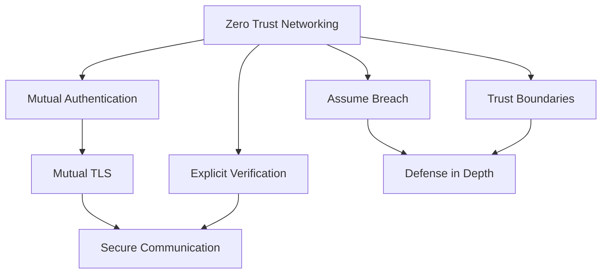

# Zero Trust Networking y mTLS

## Contexto

Este estándar consolida **3 conceptos relacionados** con los fundamentos de red Zero Trust. Define cómo eliminar la confianza implícita en la red y asegurar comunicaciones con autenticación bidireccional mediante certificados.

**Conceptos incluidos:**

- **Zero Trust Networking** → Red sin confianza implícita; todo acceso requiere autenticación y autorización explícita
- **Mutual Authentication** → Ambas partes (cliente y servidor) validan la identidad de la otra antes de comunicarse
- **Mutual TLS (mTLS)** → Cifrado TLS con autenticación de certificados X.509 en ambas direcciones

---

## Stack Tecnológico

| Componente                 | Tecnología          | Versión | Uso                                   |
| -------------------------- | ------------------- | ------- | ------------------------------------- |
| **Runtime**                | .NET                | 8.0+    | Aplicaciones                          |
| **Identity Provider**      | Keycloak            | 23.0+   | Autenticación centralizada            |
| **API Gateway**            | Kong                | 3.5+    | mTLS termination, mutual auth         |
| **Certificate Management** | AWS ACM             | Latest  | Gestión de certificados TLS           |
| **Container Platform**     | AWS ECS Fargate     | Latest  | Aislamiento de contenedores           |
| **Secrets**                | AWS Secrets Manager | Latest  | Almacenamiento seguro de certificados |

---

## Zero Trust Networking

### ¿Qué es Zero Trust Networking?

Modelo de seguridad que elimina la confianza implícita basada en ubicación de red. Todo acceso requiere autenticación y autorización explícita, sin importar si viene de "dentro" o "fuera" del perímetro.

**Propósito:** Eliminar el concepto de "red confiable" vs "red no confiable". Tratar toda red como hostil.

**Principios clave:**

- **No hay red interna confiable**: Every network is hostile
- **Verify everything**: Autenticar y autorizar cada acceso
- **Microsegmentation**: Segmentar en unidades pequeñas aisladas
- **Context-aware access**: Decisiones basadas en contexto (usuario, dispositivo, ubicación, hora)

**Beneficios:**
✅ Reduce la superficie de ataque
✅ Limita movimiento lateral de atacantes
✅ Protege contra amenazas internas
✅ Mejora visibilidad de accesos

### Relación entre Conceptos



### Ejemplo Comparativo

```csharp
// ❌ MALO: Confiar en red interna
public class OrdersController : ControllerBase
{
    [HttpGet]
    public IActionResult GetOrders()
    {
        var clientIp = HttpContext.Connection.RemoteIpAddress;
        if (IsInternalNetwork(clientIp))
        {
            // Sin validación adicional — PELIGROSO
            return Ok(_orderService.GetAll());
        }
        return Unauthorized();
    }
}

// ✅ BUENO: Zero Trust — siempre verificar
[Authorize]
[RequirePermission("orders:read")]
public IActionResult GetOrders()
{
    var userId = User.FindFirst("sub")?.Value;
    var tenantId = User.FindFirst("tenant_id")?.Value;

    if (string.IsNullOrEmpty(userId) || string.IsNullOrEmpty(tenantId))
        return Unauthorized();

    _auditLog.LogAccess(userId, tenantId, "orders:read", HttpContext);

    return Ok(_orderService.GetForUser(userId, tenantId));
}
```

### Implementación: Middleware de Context-Aware Access

```csharp
// src/Shared/Security/ZeroTrustMiddleware.cs
public class ZeroTrustMiddleware
{
    private readonly RequestDelegate _next;
    private readonly IAuditLog _auditLog;

    public async Task InvokeAsync(HttpContext context)
    {
        var principal = context.User;
        var accessContext = BuildAccessContext(context);

        if (!await EvaluateAccessPolicy(principal, accessContext))
        {
            context.Response.StatusCode = StatusCodes.Status403Forbidden;
            return;
        }

        await _auditLog.LogAccessAsync(new AccessEvent
        {
            UserId = principal?.FindFirst("sub")?.Value,
            TenantId = principal?.FindFirst("tenant_id")?.Value,
            IpAddress = context.Connection.RemoteIpAddress?.ToString(),
            Path = context.Request.Path,
            Method = context.Request.Method,
            Timestamp = DateTime.UtcNow
        });

        await _next(context);
    }

    private async Task<bool> EvaluateAccessPolicy(
        ClaimsPrincipal principal,
        AccessContext context)
    {
        // Bloquear países no permitidos
        var allowedCountries = new[] { "US", "PE", "CL", "CO" };
        if (!allowedCountries.Contains(context.GeoLocation?.CountryCode))
            return false;

        // Bloquear acceso admin fuera de horario
        if (context.RequestPath.StartsWithSegments("/api/admin"))
        {
            var hour = context.Timestamp.Hour;
            if (hour < 8 || hour > 18)
                return false;
        }

        // Requerir MFA para pagos
        var isMfaVerified = principal?.FindFirst("amr")?.Value?.Contains("mfa") ?? false;
        if (context.RequestPath.StartsWithSegments("/api/payments") && !isMfaVerified)
            return false;

        return true;
    }
}

app.UseMiddleware<ZeroTrustMiddleware>();
```

---

## Autenticación Mutua

### ¿Qué es Mutual Authentication?

Proceso donde ambas partes (cliente y servidor) validan la identidad de la otra antes de establecer comunicación. A diferencia de la autenticación unilateral, en mutual auth el cliente también valida al servidor.

**Propósito:** Prevenir ataques man-in-the-middle y garantizar que ambas partes son quienes dicen ser.

**Métodos:**

- **Mutual TLS**: Usando certificados X.509
- **Kerberos**: Tickets cruzados
- **OAuth 2.0 Mutual TLS**: Token binding con certificados

**Beneficios:**
✅ Previene suplantación de servidor (phishing)
✅ Protege contra man-in-the-middle
✅ Autenticación fuerte sin passwords
✅ Ideal para comunicación service-to-service

### Implementación: Validación de Certificado Cliente en .NET

```csharp
// src/OrderService.Api/Program.cs
using Microsoft.AspNetCore.Server.Kestrel.Https;

builder.WebHost.ConfigureKestrel(options =>
{
    options.ConfigureHttpsDefaults(httpsOptions =>
    {
        httpsOptions.ClientCertificateMode = ClientCertificateMode.RequireCertificate;
        httpsOptions.CheckCertificateRevocation = true;

        httpsOptions.ClientCertificateValidation = (certificate, chain, errors) =>
        {
            if (errors != SslPolicyErrors.None)
                return false;

            var allowedServices = new[]
            {
                "payment-service.talma.local",
                "inventory-service.talma.local",
                "notification-service.talma.local"
            };

            var cn = certificate.Subject
                .Split(',')
                .FirstOrDefault(x => x.Trim().StartsWith("CN="))
                ?.Replace("CN=", "").Trim();

            if (!allowedServices.Contains(cn))
                return false;

            if (certificate.NotAfter < DateTime.UtcNow)
                return false;

            return true;
        };
    });
});

builder.Services.AddAuthentication(CertificateAuthenticationDefaults.AuthenticationScheme)
    .AddCertificate(options =>
    {
        options.AllowedCertificateTypes = CertificateTypes.All;
        options.RevocationMode = X509RevocationMode.Online;

        options.Events = new CertificateAuthenticationEvents
        {
            OnCertificateValidated = context =>
            {
                var claims = new[]
                {
                    new Claim(ClaimTypes.NameIdentifier, context.ClientCertificate.Subject),
                    new Claim("certificate-thumbprint", context.ClientCertificate.Thumbprint)
                };

                context.Principal = new ClaimsPrincipal(
                    new ClaimsIdentity(claims, context.Scheme.Name));
                context.Success();
                return Task.CompletedTask;
            },
            OnAuthenticationFailed = context =>
            {
                context.Fail($"Certificate validation failed: {context.Exception.Message}");
                return Task.CompletedTask;
            }
        };
    });
```

---

## Mutual TLS (mTLS)

### ¿Qué es Mutual TLS?

Extensión de TLS donde tanto el cliente como el servidor presentan certificados digitales para autenticarse mutuamente.

**Propósito:** Autenticación fuerte y cifrado de comunicaciones service-to-service sin passwords.

**Componentes clave:**

- **Client Certificate**: Certificado X.509 del cliente
- **Server Certificate**: Certificado X.509 del servidor
- **CA Trust Chain**: Cadena de confianza de la Autoridad Certificadora
- **Certificate Validation**: Validación de revocación (OCSP/CRL)

**Flujo mTLS:**

1. Cliente inicia handshake TLS
2. Servidor envía su certificado
3. Cliente valida certificado del servidor
4. Servidor solicita certificado del cliente
5. Cliente envía su certificado
6. Servidor valida certificado del cliente
7. Si ambos válidos → establece conexión cifrada

### Configuración: HttpClient con mTLS

```csharp
// src/Shared/Http/MutualTlsHttpClientFactory.cs
public class MutualTlsHttpClientFactory
{
    public HttpClient CreateClient(string serviceName)
    {
        var clientCertificate = LoadClientCertificate(serviceName);

        var handler = new HttpClientHandler
        {
            ClientCertificates = { clientCertificate },

            ServerCertificateCustomValidationCallback = (message, cert, chain, errors) =>
            {
                if (errors == SslPolicyErrors.None)
                    return true;

                // En producción: rechazar si hay errores
                return _configuration.GetValue<bool>("AllowInvalidCertificates");
            }
        };

        return new HttpClient(handler)
        {
            BaseAddress = new Uri(_configuration[$"Services:{serviceName}:BaseUrl"]),
            Timeout = TimeSpan.FromSeconds(30)
        };
    }

    private X509Certificate2 LoadClientCertificate(string serviceName)
    {
        // Desde AWS Secrets Manager
        var secretName = $"mtls/{serviceName}/client-certificate";
        var secretValue = GetSecretFromAwsSecretsManager(secretName);
        var certBytes = Convert.FromBase64String(secretValue);
        return new X509Certificate2(certBytes, _configuration[$"Certificates:{serviceName}:Password"]);
    }
}

// Registro en Program.cs
builder.Services.AddSingleton<MutualTlsHttpClientFactory>();
```

### Kong API Gateway: mTLS Termination

```yaml
# kong/services/payment-service.yaml
_format_version: "3.0"

services:
  - name: payment-service
    url: https://payment-service.internal:8443
    protocol: https
    client_certificate:
      id: kong-client-cert
    tls_verify: true
    tls_verify_depth: 2
    ca_certificates:
      - internal-ca

routes:
  - name: payment-routes
    paths:
      - /api/payments
    protocols:
      - https

plugins:
  - name: mtls-auth
    config:
      ca_certificates:
        - client-ca
      authenticated_group_by: CN
      anonymous: false

  - name: rate-limiting
    config:
      policy: local
      limit_by: certificate
      second: 100
      minute: 1000
```

---

## Monitoreo y Observabilidad

```promql
# Tasa de fallos de autenticación (> 10% es sospechoso)
sum(rate(auth_failures_total[5m]))
/
sum(rate(auth_attempts_total[5m]))
> 0.1

# Múltiples fallos de un mismo usuario (posible fuerza bruta)
sum by (user_id) (increase(auth_failures_total[5m])) > 5

# Accesos desde países no habituales
sum by (country) (rate(auth_attempts_total{country!~"PE|CL|CO"}[5m])) > 0

# Validaciones fallidas de certificados mTLS
sum(rate(certificate_validation_failures_total[5m])) > 1
```

---

## Requisitos Técnicos

### MUST (Obligatorio)

- **MUST** autenticar y autorizar cada request sin excepción (no confiar en red interna)
- **MUST** aplicar principio de least privilege en todos los accesos
- **MUST** implementar microsegmentación de red
- **MUST** registrar todos los accesos para auditoría
- **MUST** implementar mutual TLS para comunicación service-to-service
- **MUST** validar certificados contra CA confiable
- **MUST** verificar revocación de certificados (OCSP/CRL)
- **MUST** rotar certificados antes de expiración

### SHOULD (Fuertemente recomendado)

- **SHOULD** usar risk-based authentication
- **SHOULD** implementar geofencing para acceso geográfico
- **SHOULD** habilitar certificate pinning en clientes móviles

### MUST NOT (Prohibido)

- **MUST NOT** confiar implícitamente en red "interna"
- **MUST NOT** permitir comunicación service-to-service sin mutual auth
- **MUST NOT** usar autenticación unilateral para comunicaciones críticas
- **MUST NOT** asumir que un usuario autenticado tiene todos los permisos

---

## Referencias

- [NIST Zero Trust Architecture (SP 800-207)](https://csrc.nist.gov/publications/detail/sp/800-207/final)
- [AWS Zero Trust on AWS](https://docs.aws.amazon.com/whitepapers/latest/zero-trust-architectures/zero-trust-architectures.html)
- [Mutual TLS Best Practices](https://smallstep.com/hello-mtls/)
- [.NET Certificate Authentication](https://learn.microsoft.com/en-us/aspnet/core/security/authentication/certauth)
- [Zero Trust: Verificación y Trust Boundaries](./zero-trust-verification.md)
- [SSO, MFA y RBAC](./sso-mfa-rbac.md)
- [Segmentación y Controles de Acceso de Red](./network-segmentation.md)
