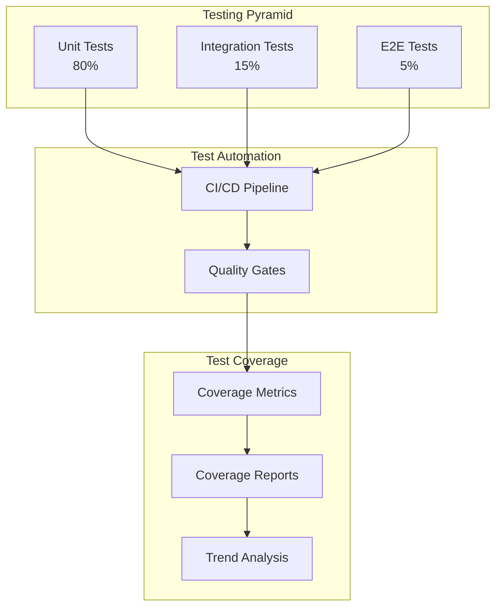

# Testing Strategy

## Contexto

Este estándar consolida **3 conceptos relacionados** con la estrategia general de testing. Define proporciones, automatización y objetivos de cobertura para garantizar calidad sostenible.

**Conceptos incluidos:**

- **Testing Pyramid** → Proporciones entre tipos de tests (unit > integration > e2e)
- **Test Automation** → Automatización en CI/CD
- **Test Coverage** → Objetivos de cobertura y tracking

---

## Stack Tecnológico

| Componente       | Tecnología       | Versión | Uso                            |
| ---------------- | ---------------- | ------- | ------------------------------ |
| **Unit Testing** | xUnit            | 2.6+    | Framework de testing principal |
| **Assertions**   | FluentAssertions | 6.12+   | Assertions expresivas          |
| **Mocking**      | Moq              | 4.20+   | Mocking de dependencias        |
| **Coverage**     | Coverlet         | 6.0+    | Code coverage collection       |
| **Analysis**     | SonarQube        | 9.9+    | Análisis de coverage y quality |
| **CI/CD**        | GitHub Actions   | Latest  | Ejecución automática de tests  |
| **Reporting**    | ReportGenerator  | 5.2+    | Reportes HTML de coverage      |

---

## Conceptos Fundamentales

Este estándar cubre **3 pilares** de estrategia de testing:

### Índice de Conceptos

1. **Testing Pyramid**: Proporciones óptimas entre unit/integration/e2e tests
2. **Test Automation**: Integración en CI/CD y gates de calidad
3. **Test Coverage**: Objetivos por tipo y tracking continuo

### Relación entre Conceptos



---

## 1. Testing Pyramid

### ¿Qué es la Testing Pyramid?

Estrategia que define proporciones óptimas entre tipos de tests para balance entre velocidad, costo y confianza. Tests unitarios en la base (rápidos, baratos, abundantes), E2E en la cima (lentos, caros, selectivos).

**Propósito:** Optimizar ROI de testing maximizando cobertura con mínimo tiempo de ejecución.

**Proporciones recomendadas:**

- **Unit Tests**: 70-80% del total (milisegundos por test)
- **Integration Tests**: 15-20% del total (segundos por test)
- **E2E Tests**: 5-10% del total (minutos por test)

**Beneficios:**
✅ Fast feedback loops (suite completa < 10 minutos)
✅ Menor costo de mantenimiento
✅ Alta confianza con cobertura estratificada
✅ Facilita TDD/BDD

### Ejemplo: Distribución en Order Service

```plaintext
Order Service Testing Distribution
=====================================
Total tests: 450

📊 Unit Tests (360 tests - 80%)
  ├─ Domain Models: 120 tests
  ├─ Business Logic: 150 tests
  ├─ Validators: 40 tests
  ├─ Mappers: 30 tests
  └─ Utilities: 20 tests
  Execution time: ~2 minutes

📊 Integration Tests (70 tests - 15.5%)
  ├─ API Endpoints: 30 tests
  ├─ Database Operations: 20 tests
  ├─ Message Publishing: 10 tests
  ├─ External API Calls: 10 tests
  Execution time: ~5 minutes

📊 E2E Tests (20 tests - 4.5%)
  ├─ Critical User Journeys: 15 tests
  ├─ Smoke Tests: 5 tests
  Execution time: ~8 minutes

Total execution time: ~15 minutes
```

### Anti-Pattern: Inverted Pyramid (Ice Cream Cone)

```csharp
// ❌ MALO: Demasiados E2E tests, pocos unit tests
public class AntiPatternTestSuite
{
    // 10 unit tests
    [Fact]
    public void Order_ShouldCalculateTotal() { }

    // 50 E2E tests (LENTO, FRÁGIL)
    [Fact]
    public async Task E2E_CreateOrder_PayWithCreditCard_SendEmail()
    {
        // Setup browser
        // Navigate to login
        // Fill form
        // Submit payment
        // Check email
        // Cleanup
        // Takes 2-3 minutes per test
    }
}

// Problemas:
// - Suite toma 2+ horas en ejecutar
// - Flaky tests (timeouts, race conditions)
// - Difícil debugging (muchas capas involucradas)
// - Costoso mantener (cambios en UI rompen muchos tests)
```

### Patrón Correcto: Pirámide Balanceada

```csharp
// ✅ BUENO: Mayoría unit tests, selectivos E2E
public class BalancedTestSuite
{
    // 100 unit tests (RÁPIDOS, CONFIABLES)
    [Theory]
    [InlineData(100, 0.18, 18)]
    [InlineData(1000, 0.18, 180)]
    public void CalculateOrderTax_ShouldApplyCorrectRate(
        decimal subtotal, decimal taxRate, decimal expectedTax)
    {
        // Arrange
        var order = new Order { Subtotal = subtotal };

        // Act
        var tax = order.CalculateTax(taxRate);

        // Assert
        tax.Should().Be(expectedTax);
    }

    // 15 integration tests (VERIFICAN INTEGRACIÓN)
    [Fact]
    public async Task CreateOrder_ShouldPersistToDatabase()
    {
        // Arrange
        using var factory = new WebApplicationFactory<Program>();
        var client = factory.CreateClient();

        // Act
        var response = await client.PostAsJsonAsync("/api/orders", new
        {
            customerId = "123",
            items = new[] { new { sku = "ABC", quantity = 2 } }
        });

        // Assert
        response.StatusCode.Should().Be(HttpStatusCode.Created);
    }

    // 5 E2E tests (SOLO FLUJOS CRÍTICOS)
    [Fact]
    public async Task E2E_CompleteOrderFlow_HappyPath()
    {
        // Solo testing journey crítico: login → order → payment → confirmation
    }
}
```

### Matriz de Decisión: ¿Qué tipo de test usar?

| Escenario                            | Unit | Integration | E2E | Justificación                           |
| ------------------------------------ | ---- | ----------- | --- | --------------------------------------- |
| Validar lógica de negocio (cálculos) | ✅   | -           | -   | Rápido, aislado, deterministico         |
| Validar esquema de BD                | -    | ✅          | -   | Requiere DB real                        |
| Validar serialización JSON           | ✅   | -           | -   | No requiere infraestructura             |
| Validar API contract                 | -    | ✅          | -   | Requiere HTTP pero no UI                |
| Validar integración con Kafka        | -    | ✅          | -   | Requiere message broker                 |
| Validar journey usuario crítico      | -    | -           | ✅  | Requiere todos los sistemas             |
| Validar formato error 400            | ✅   | ✅          | -   | Unit primero, integration para detalles |
| Validar autenticación JWT            | -    | ✅          | -   | Requiere token real pero no UI          |

---

## 2. Test Automation

### ¿Qué es Test Automation?

Ejecución automática de tests en CI/CD con gates de calidad que bloquean merges/deployments si tests fallan o coverage baja.

**Propósito:** Prevenir regresiones y garantizar calidad consistente sin intervención manual.

**Componentes:**

- **CI Pipeline**: Ejecutar tests en cada PR
- **Quality Gates**: Bloquear si tests fallan o coverage < threshold
- **Fast Feedback**: Resultados en < 15 minutos
- **Parallel Execution**: Tests en paralelo por velocidad

**Beneficios:**
✅ Detección temprana de bugs (shift-left)
✅ Prevención de regresiones
✅ Confidence para refactoring
✅ Deployment seguro

### GitHub Actions: Test Pipeline

```yaml
# .github/workflows/test.yml
name: Test Suite

on:
  push:
    branches: [main, develop]
  pull_request:
    branches: [main]

jobs:
  unit-tests:
    name: Unit Tests
    runs-on: ubuntu-latest

    steps:
      - name: Checkout code
        uses: actions/checkout@v3

      - name: Setup .NET
        uses: actions/setup-dotnet@v3
        with:
          dotnet-version: "8.0.x"

      - name: Restore dependencies
        run: dotnet restore

      - name: Run unit tests
        run: |
          dotnet test \
            --filter "Category=Unit" \
            --no-restore \
            --logger "trx;LogFileName=unit-test-results.trx" \
            --collect:"XPlat Code Coverage" \
            --results-directory ./TestResults \
            -- DataCollectionRunSettings.DataCollectors.DataCollector.Configuration.Format=opencover

      - name: Upload test results
        if: always()
        uses: actions/upload-artifact@v3
        with:
          name: unit-test-results
          path: TestResults/unit-test-results.trx

      - name: Upload coverage to Codecov
        uses: codecov/codecov-action@v3
        with:
          files: ./TestResults/**/coverage.opencover.xml
          flags: unit
          fail_ci_if_error: true

  integration-tests:
    name: Integration Tests
    runs-on: ubuntu-latest

    services:
      postgres:
        image: postgres:15
        env:
          POSTGRES_PASSWORD: postgres
          POSTGRES_DB: orders_test
        options: >-
          --health-cmd pg_isready
          --health-interval 10s
          --health-timeout 5s
          --health-retries 5
        ports:
          - 5432:5432

    steps:
      - name: Checkout code
        uses: actions/checkout@v3

      - name: Setup .NET
        uses: actions/setup-dotnet@v3
        with:
          dotnet-version: "8.0.x"

      - name: Run integration tests
        env:
          ConnectionStrings__OrdersDb: "Host=localhost;Port=5432;Database=orders_test;Username=postgres;Password=postgres"
        run: |
          dotnet test \
            --filter "Category=Integration" \
            --no-restore \
            --logger "trx;LogFileName=integration-test-results.trx" \
            --results-directory ./TestResults

      - name: Upload test results
        if: always()
        uses: actions/upload-artifact@v3
        with:
          name: integration-test-results
          path: TestResults/integration-test-results.trx

  quality-gate:
    name: Quality Gate
    runs-on: ubuntu-latest
    needs: [unit-tests, integration-tests]

    steps:
      - name: Download coverage reports
        uses: actions/download-artifact@v3

      - name: SonarQube Scan
        uses: sonarsource/sonarqube-scan-action@master
        env:
          SONAR_TOKEN: ${{ secrets.SONAR_TOKEN }}
          SONAR_HOST_URL: ${{ secrets.SONAR_HOST_URL }}
        with:
          args: >
            -Dsonar.projectKey=order-service
            -Dsonar.coverage.exclusions=**/*.generated.cs,**/Program.cs
            -Dsonar.cs.opencover.reportsPaths=TestResults/**/coverage.opencover.xml
            -Dsonar.qualitygate.wait=true

      - name: Check Quality Gate
        run: |
          # SonarQube Quality Gate automáticamente falla el workflow si:
          # - Coverage < 80%
          # - Nuevos bugs/vulnerabilities/code smells
          # - Duplicación > 3%
          # - Maintainability rating < A
          echo "Quality Gate passed ✅"
```

### Quality Gate Configuration (SonarQube)

```json
{
  "qualityGate": {
    "name": "Talma Quality Gate",
    "conditions": [
      {
        "metric": "coverage",
        "operator": "LESS_THAN",
        "threshold": "80",
        "status": "ERROR"
      },
      {
        "metric": "new_coverage",
        "operator": "LESS_THAN",
        "threshold": "80",
        "status": "ERROR"
      },
      {
        "metric": "duplicated_lines_density",
        "operator": "GREATER_THAN",
        "threshold": "3",
        "status": "WARNING"
      },
      {
        "metric": "new_bugs",
        "operator": "GREATER_THAN",
        "threshold": "0",
        "status": "ERROR"
      },
      {
        "metric": "new_vulnerabilities",
        "operator": "GREATER_THAN",
        "threshold": "0",
        "status": "ERROR"
      },
      {
        "metric": "sqale_rating",
        "operator": "GREATER_THAN",
        "threshold": "1",
        "status": "WARNING"
      }
    ]
  }
}
```

### Parallel Test Execution

```xml
<!-- Directory.Build.props -->
<Project>
  <PropertyGroup>
    <!-- Ejecutar tests en paralelo -->
    <ParallelizeAssembly>true</ParallelizeAssembly>
    <ParallelizeTestCollections>true</ParallelizeTestCollections>
    <MaxParallelThreads>8</MaxParallelThreads>
  </PropertyGroup>
</Project>
```

```csharp
// Tests configurados para paralelización
[Collection("OrderTests")] // Tests en misma collection NO se ejecutan en paralelo
public class OrderServiceTests
{
    // Tests con estado compartido (ej: misma DB)
}

public class CalculatorTests // Sin Collection → se ejecutan en paralelo
{
    [Fact]
    public void Add_ShouldReturnSum()
    {
        // Test aislado, puede ejecutarse en paralelo
    }
}
```

---

## 3. Test Coverage

### ¿Qué es Test Coverage?

Métrica que mide porcentaje de código ejecutado por tests. Incluye line coverage, branch coverage y method coverage.

**Propósito:** Asegurar que código crítico está testeado, identificar gaps de testing.

**Métricas:**

- **Line Coverage**: % de líneas ejecutadas
- **Branch Coverage**: % de branches (if/else) ejecutadas
- **Method Coverage**: % de métodos ejecutados
- **Mutation Coverage**: % de mutaciones detectadas (avanzado)

**Objetivos por tipo:**

- **Unit Tests**: 90% line coverage
- **Integration Tests**: 80% line coverage de capas de integración
- **Overall**: 85% line coverage mínimo

**Beneficios:**
✅ Identificar código no testeado
✅ Prevenir regresiones
✅ Guiar esfuerzos de testing
✅ Compliance con estándares de calidad

### Configuración: Coverlet + ReportGenerator

```xml
<!-- OrderService.Tests.csproj -->
<Project Sdk="Microsoft.NET.Sdk">
  <PropertyGroup>
    <TargetFramework>net8.0</TargetFramework>
    <IsPackable>false</IsPackable>
  </PropertyGroup>

  <ItemGroup>
    <PackageReference Include="xunit" Version="2.6.6" />
    <PackageReference Include="xunit.runner.visualstudio" Version="2.5.6" />

    <!-- Coverage collection -->
    <PackageReference Include="coverlet.collector" Version="6.0.0" />
    <PackageReference Include="coverlet.msbuild" Version="6.0.0" />
  </ItemGroup>

  <ItemGroup>
    <ProjectReference Include="..\OrderService.Api\OrderService.Api.csproj" />
  </ItemGroup>
</Project>
```

```bash
# Generar coverage report localmente
dotnet test \
  --collect:"XPlat Code Coverage" \
  --results-directory ./TestResults \
  -- DataCollectionRunSettings.DataCollectors.DataCollector.Configuration.Format=opencover

# Generar HTML report
dotnet tool install -g dotnet-reportgenerator-globaltool

reportgenerator \
  -reports:"TestResults/**/coverage.opencover.xml" \
  -targetdir:"CoverageReport" \
  -reporttypes:"Html;Badges"

# Abrir en browser
open CoverageReport/index.html
```

### Coverage Thresholds

```xml
<!-- coverlet.runsettings -->
<?xml version="1.0" encoding="utf-8"?>
<RunSettings>
  <DataCollectionRunSettings>
    <DataCollectors>
      <DataCollector friendlyName="XPlat code coverage">
        <Configuration>
          <Format>opencover</Format>
          <Exclude>[*.Tests]*,[*]*.Migrations.*</Exclude>
          <Include>[OrderService.*]*</Include>

          <!-- Thresholds: fail build si coverage < 80% -->
          <Threshold>80</Threshold>
          <ThresholdType>line,branch,method</ThresholdType>
          <ThresholdStat>total</ThresholdStat>
        </Configuration>
      </DataCollector>
    </DataCollectors>
  </DataCollectionRunSettings>
</RunSettings>
```

### Excluir código de coverage

```csharp
// Excluir generated code
[ExcludeFromCodeCoverage]
public partial class OrderEntityTypeConfiguration
{
    // EF Core configuration generada
}

// Excluir Program.cs (bootstrap)
[ExcludeFromCodeCoverage]
public class Program
{
    public static void Main(string[] args)
    {
        CreateHostBuilder(args).Build().Run();
    }
}

// Excluir DTOs simples (solo properties)
[ExcludeFromCodeCoverage]
public record OrderDto
{
    public int Id { get; init; }
    public string CustomerName { get; init; }
}
```

### Coverage Report Example

```plaintext
Coverage Report - Order Service
=====================================

Summary:
  Line Coverage:    92.5% (850/920 lines)
  Branch Coverage:  87.3% (245/281 branches)
  Method Coverage:  94.1% (160/170 methods)

By Assembly:
  OrderService.Domain:          95.2% ✅
  OrderService.Application:     91.8% ✅
  OrderService.Infrastructure:  89.5% ✅
  OrderService.Api:             88.7% ✅

Uncovered Areas:
  ⚠️ OrderService.Application.Services.NotificationService
     Lines: 15-23 (9 lines not covered)
     Reason: External API call not mocked

  ⚠️ OrderService.Domain.Aggregates.Order.Cancel()
     Branches: 1/2 covered
     Missing: Exception handling path

Action Items:
  1. Add tests for NotificationService error scenarios
  2. Add test for Order.Cancel() when already cancelled
```

---

## Implementación Integrada

### Proyecto de Tests Completo

```csharp
// tests/OrderService.Tests/OrderService.Tests.csproj
<Project Sdk="Microsoft.NET.Sdk">
  <PropertyGroup>
    <TargetFramework>net8.0</TargetFramework>
    <IsPackable>false</IsPackable>
    <RootNamespace>OrderService.Tests</RootNamespace>
  </PropertyGroup>

  <ItemGroup>
    <!-- Testing frameworks -->
    <PackageReference Include="xUnit" Version="2.6.6" />
    <PackageReference Include="xunit.runner.visualstudio" Version="2.5.6" />

    <!-- Assertions & Mocking -->
    <PackageReference Include="FluentAssertions" Version="6.12.0" />
    <PackageReference Include="Moq" Version="4.20.70" />

    <!-- Coverage -->
    <PackageReference Include="coverlet.collector" Version="6.0.0" />

    <!-- Integration testing -->
    <PackageReference Include="Microsoft.AspNetCore.Mvc.Testing" Version="8.0.0" />
    <PackageReference Include="Testcontainers.PostgreSql" Version="3.7.0" />
  </ItemGroup>

  <ItemGroup>
    <ProjectReference Include="..\..\src\OrderService.Api\OrderService.Api.csproj" />
    <ProjectReference Include="..\..\src\OrderService.Domain\OrderService.Domain.csproj" />
  </ItemGroup>
</Project>
```

### Base Test Class para Tests Categorizados

```csharp
// tests/OrderService.Tests/Common/TestBase.cs
public abstract class UnitTestBase
{
    protected UnitTestBase()
    {
        // Setup común para unit tests
    }
}

[Trait("Category", "Unit")]
public abstract class UnitTest : UnitTestBase { }

[Trait("Category", "Integration")]
public abstract class IntegrationTest : IAsyncLifetime
{
    protected WebApplicationFactory<Program> Factory { get; private set; }
    protected HttpClient Client { get; private set; }

    public async Task InitializeAsync()
    {
        Factory = new WebApplicationFactory<Program>();
        Client = Factory.CreateClient();
        await Task.CompletedTask;
    }

    public async Task DisposeAsync()
    {
        Client?.Dispose();
        await Factory.DisposeAsync();
    }
}

[Trait("Category", "E2E")]
public abstract class E2ETest { }
```

---

## Requisitos Técnicos

### MUST (Obligatorio)

**Testing Pyramid:**

- **MUST** mantener 70-80% unit tests, 15-20% integration, 5-10% E2E
- **MUST** ejecutar suite completa en < 15 minutos
- **MUST** unit tests ejecutarse en < 5 minutos

**Automation:**

- **MUST** ejecutar tests en CI/CD en cada PR
- **MUST** bloquear merge si tests fallan
- **MUST** ejecutar tests antes de deploy a producción
- **MUST** tests aislados (sin dependencias entre ellos)

**Coverage:**

- **MUST** 90% line coverage en unit tests
- **MUST** 80% line coverage en integration tests
- **MUST** 85% line coverage overall mínimo
- **MUST** excluir generated code de coverage
- **MUST** reportar coverage en SonarQube

### SHOULD (Fuertemente recomendado)

- **SHOULD** ejecutar tests en paralelo
- **SHOULD** usar Testcontainers para integration tests
- **SHOULD** generar HTML coverage reports
- **SHOULD** tracking de coverage trends en el tiempo
- **SHOULD** mutation testing para código crítico

### MAY (Opcional)

- **MAY** tests de performance en CI/CD
- **MAY** tests de seguridad automatizados (DAST)
- **MAY** visual regression testing para UI

### MUST NOT (Prohibido)

- **MUST NOT** ejecutar E2E tests en cada commit (solo en main/release)
- **MUST NOT** tests con sleep/delays fijos (usar polling)
- **MUST NOT** tests que dependen de datos hard-coded en BD
- **MUST NOT** commitear código sin tests

---

## Métricas y Monitoring

### Dashboards en SonarQube

```plaintext
Order Service - Test Metrics Dashboard
=======================================

Test Execution:
  Total Tests:          450
  Passing:              448 ✅
  Failing:              2 ❌
  Skipped:              0

  Execution Time:       12m 34s
  Success Rate:         99.6%

Coverage Metrics:
  Overall Coverage:     87.2% ✅
  New Code Coverage:    92.1% ✅

  By Type:
    Unit:               92.5%
    Integration:        81.3%
    E2E:                N/A

Quality Gate:           PASSED ✅

Trends (last 30 days):
  Coverage:             📈 +2.3%
  Test Count:           📈 +15 tests
  Execution Time:       📉 -45s
  Flaky Tests:          📉 -3
```

### Prometheus Metrics

```csharp
// Instrumentación de tests
public class TestMetricsCollector
{
    private readonly Counter _testsExecuted = Metrics.CreateCounter(
        "tests_executed_total",
        "Total number of tests executed",
        new CounterConfiguration
        {
            LabelNames = new[] { "type", "result" }
        });

    private readonly Histogram _testDuration = Metrics.CreateHistogram(
        "test_duration_seconds",
        "Test execution duration",
        new HistogramConfiguration
        {
            LabelNames = new[] { "type", "name" }
        });

    public void RecordTestExecution(string type, string name, bool passed, TimeSpan duration)
    {
        _testsExecuted.WithLabels(type, passed ? "pass" : "fail").Inc();
        _testDuration.WithLabels(type, name).Observe(duration.TotalSeconds);
    }
}
```

---

## Referencias

**Documentación oficial:**

- [xUnit Documentation](https://xunit.net/)
- [Coverlet Documentation](https://github.com/coverlet-coverage/coverlet)
- [SonarQube .NET](https://docs.sonarqube.org/latest/analysis/languages/csharp/)

**Testing Patterns:**

- [Test Pyramid - Martin Fowler](https://martinfowler.com/articles/practical-test-pyramid.html)
- [Testing Best Practices - Microsoft](https://learn.microsoft.com/en-us/dotnet/core/testing/unit-testing-best-practices)

**Relacionados:**

- [Unit & Integration Testing](./unit-integration-testing.md)
- [Contract & E2E Testing](./contract-e2e-testing.md)
- [Performance Testing](./performance-testing.md)
- [CI/CD Deployment](../operabilidad/cicd-deployment.md)

---

**Última actualización**: 2026-02-19
**Responsable**: Equipo de Arquitectura
