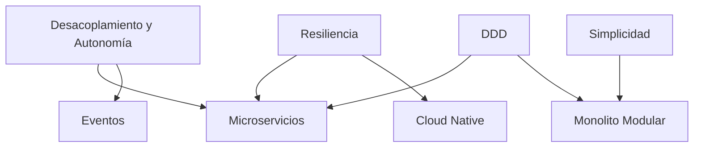

# Estilos Arquitectónicos

## ¿Qué son los Estilos Arquitectónicos?

Los estilos arquitectónicos son **patrones organizacionales** que definen cómo estructurar sistemas de software para satisfacer requisitos específicos. A diferencia de los principios (valores universales), los estilos son **contextuales** y se seleccionan según las necesidades del proyecto.

---

## Diferencia entre Principios y Estilos

| Aspecto           | Principios                    | Estilos                       |
| ----------------- | ----------------------------- | ----------------------------- |
| **Naturaleza**    | Valores fundamentales         | Patrones organizacionales     |
| **Aplicabilidad** | Universal (siempre deseables) | Contextual (según necesidad)  |
| **Ejemplos**      | Desacoplamiento, Resiliencia  | Microservicios, Eventos       |
| **Decisión**      | Siempre se aplican            | Se seleccionan según contexto |

---

## Relación con Principios

Cada estilo arquitectónico **materializa** uno o más principios corporativos:



---

## Estilos Disponibles

### 1. [Arquitectura de Microservicios](microservicios.md)

**Cuándo usar:**

- Dominios independientes claramente identificables
- Necesidad de escalabilidad independiente por capacidad
- Múltiples equipos autónomos
- Evolución continua y frecuente

**Principios que materializa:**

- Desacoplamiento y Autonomía
- Ownership de Datos por Dominio
- Arquitectura Evolutiva
- Resiliencia y Tolerancia a Fallos

---

### 2. [Arquitectura Orientada a Eventos](eventos.md)

**Cuándo usar:**

- Desacoplamiento temporal entre componentes
- Múltiples consumidores de la misma información
- Tolerancia a consistencia eventual
- Sistemas distribuidos con alta escalabilidad

**Principios que materializa:**

- Desacoplamiento y Autonomía
- Resiliencia y Tolerancia a Fallos
- Arquitectura Evolutiva

---

### 3. [Arquitectura Cloud Native](cloud-native.md)

**Cuándo usar:**

- Sistemas desplegados en plataformas cloud
- Necesidad de elasticidad y escalado automático
- Tolerancia a fallos de infraestructura
- Despliegues frecuentes y automatizados

**Principios que materializa:**

- Resiliencia y Tolerancia a Fallos
- Automatización como Principio
- Observabilidad desde el Diseño
- Consistencia entre Entornos

---

### 4. [Monolito Modular](monolito-modular.md)

**Cuándo usar:**

- Dominios acotados y cohesivos
- Equipos pequeños o únicos
- Cambios poco frecuentes
- Simplicidad operativa preferida

**Principios que materializa:**

- Arquitectura Limpia
- Diseño Orientado al Dominio
- Simplicidad Intencional

---

## Criterios de Selección

### Matriz de Decisión

| Criterio                                     | Monolito Modular | Microservicios | Eventos | Cloud Native |
| -------------------------------------------- | ---------------- | -------------- | ------- | ------------ |
| **Complejidad del dominio**                  | Baja-Media       | Alta           | Alta    | Variable     |
| **Tamaño del equipo**                        | 1-10             | 10+            | 10+     | Variable     |
| **Frecuencia de cambios**                    | Baja             | Alta           | Alta    | Alta         |
| **Necesidad de escalabilidad independiente** | No               | Sí             | Sí      | Sí           |
| **Tolerancia a consistencia eventual**       | No               | Parcial        | Sí      | Parcial      |
| **Madurez DevOps/SRE**                       | Baja             | Alta           | Alta    | Muy Alta     |

---

## Combinación de Estilos

Los estilos **no son mutuamente excluyentes**. Pueden combinarse:

- **Microservicios + Eventos:** Servicios que se comunican mediante eventos
- **Cloud Native + Microservicios:** Microservicios desplegados en cloud con auto-scaling
- **Monolito Modular + Eventos:** Módulos internos comunicándose mediante eventos de dominio

---

## Evolución entre Estilos

Los sistemas pueden evolucionar de un estilo a otro:

```
Monolito → Monolito Modular → Microservicios
                ↓
          Eventos Internos → Eventos Distribuidos
```

**Estrategias de evolución:**

- **Strangler Fig Pattern:** Reemplazar gradualmente
- **Branch by Abstraction:** Aislar antes de extraer
- **Extract Service:** Mover módulos a servicios

---

## Referencias

- [Principios Corporativos](../principios/)
- [Lineamientos de Arquitectura](../lineamientos/arquitectura/)
- ADR-018: Arquitectura de Microservicios
- ADR-013: Event Sourcing
