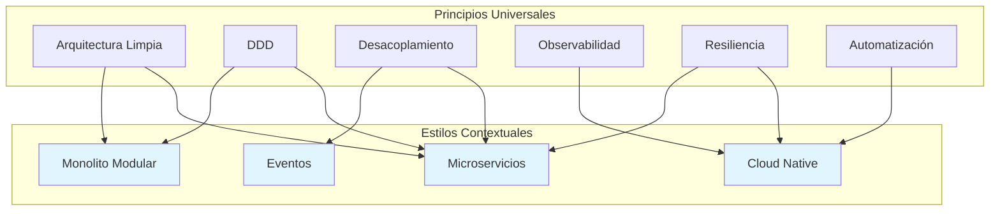

# Mapa Visual: Principios y Estilos Corporativos

## Estructura Jerárquica

```
fundamentos-corporativos/
│
├── 📘 principios/ (19 principios)
│   │
│   ├── 🏗️  arquitectura/ (8)
│   │   ├── 01-arquitectura-limpia.md
│   │   ├── 02-diseno-orientado-al-dominio.md
│   │   ├── 03-desacoplamiento-y-autonomia.md
│   │   ├── 04-arquitectura-evolutiva.md
│   │   ├── 05-observabilidad-desde-el-diseno.md
│   │   ├── 06-contratos-de-comunicacion.md
│   │   ├── 07-simplicidad-intencional.md
│   │   └── 08-resiliencia-y-tolerancia-a-fallos.md
│   │
│   ├── 📊 datos/ (3)
│   │   ├── 01-ownership-de-datos.md
│   │   ├── 02-esquemas-de-dominio.md
│   │   └── 03-consistencia-contextual.md
│   │
│   ├── 🔒 seguridad/ (6)
│   │   ├── 01-seguridad-desde-el-diseno.md
│   │   ├── 02-zero-trust.md
│   │   ├── 03-defensa-en-profundidad.md
│   │   ├── 04-identidad-y-acceso.md
│   │   ├── 05-proteccion-de-datos-sensibles.md
│   │   └── 06-minimo-privilegio.md
│   │
│   └── ⚙️  operabilidad/ (3)
│       ├── 01-automatizacion-como-principio.md
│       ├── 02-consistencia-entre-entornos.md
│       └── 03-calidad-desde-el-diseno.md
│
└── 🎨 estilos-arquitectonicos/ (4 estilos)
    ├── README.md
    ├── microservicios.md
    ├── eventos.md
    ├── cloud-native.md
    └── monolito-modular.md
```

## Relación Principios → Estilos



## Matriz de Aplicabilidad

| Categoría       | Principios | Universalidad | Ámbito                 |
| --------------- | ---------- | ------------- | ---------------------- |
| 🏗️ Arquitectura | 8          | 100%          | Todos los sistemas     |
| 📊 Datos        | 3          | 100%          | Sistemas con datos     |
| 🔒 Seguridad    | 6          | 100%          | Todos los sistemas     |
| ⚙️ Operabilidad | 3          | 100%          | Sistemas en producción |
| 🎨 Estilos      | 4          | Contextual    | Según necesidades      |

## Diferencias Clave

### Principios (19)

- ✅ **Universales**: Aplican a todos los proyectos
- ✅ **Obligatorios**: Deben considerarse siempre
- ✅ **Por qué**: Definen valores fundamentales
- ✅ **Permanentes**: Rara vez cambian

### Estilos (4)

- 🔄 **Contextuales**: Aplican según necesidades
- 🔄 **Opcionales**: Se eligen según caso
- 🔄 **Cómo**: Materializan principios
- 🔄 **Evolutivos**: Pueden cambiar con proyecto

## Formato de Archivo

Todos los archivos `.md` tienen:

```yaml
---
sidebar_position: N
---

# Título del Principio/Estilo

## Declaración del Principio

[Texto conciso de 1-2 oraciones]

## Propósito

[Para qué existe este principio]

## Justificación

[Por qué es necesario]

## Alcance Conceptual

[Qué abarca y qué no]

## Implicaciones Arquitectónicas

[Cómo impacta las decisiones]

## Contradicciones y Trade-offs

[Tensiones con otros principios]

## Relación con Otros Principios

[Enlaces a principios relacionados]
```

## Navegación Docusaurus

Cada carpeta tiene `_category_.json`:

```json
{
    "label": "Nombre Categoría",
    "position": N,
    "link": {
        "type": "generated-index",
        "title": "Título",
        "slug": "/ruta",
        "description": "Descripción"
    }
}
```

## Estadísticas

- **Total archivos markdown**: 23 (19 principios + 4 estilos)
- **Total `_category_.json`**: 6
- **Categorías de principios**: 4
- **Archivos por categoría**:
  - Arquitectura: 8 (más grande)
  - Seguridad: 6
  - Datos: 3
  - Operabilidad: 3 (más compacta)
- **Promedio por categoría**: 4.75 principios
- **Tamaño promedio**: ~2.0 KB por archivo
- **Numeración**: 100% secuencial (01-0N en cada categoría)
- **Frontmatter**: 100% de archivos

## Validaciones Completadas

✅ Numeración secuencial sin saltos
✅ Frontmatter en todos los archivos
✅ `_category_.json` en todas las carpetas
✅ Sin duplicaciones (IaC consolidado)
✅ Separación conceptual principios/estilos
✅ Enlaces internos funcionando
✅ Nombres descriptivos y claros
✅ Cobertura completa de áreas fundamentales
