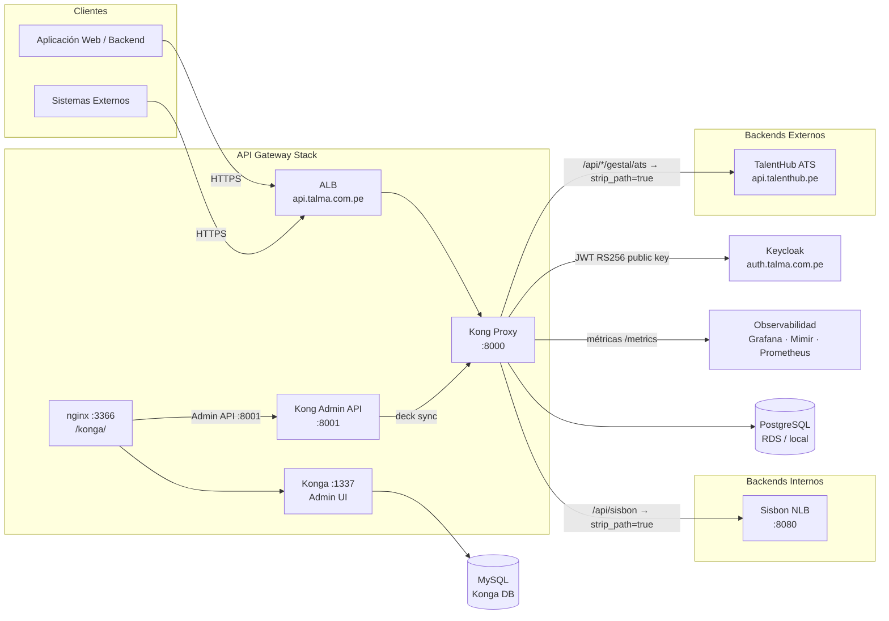

# 3. Contexto y Alcance

## Contexto del Sistema

Kong actúa como proxy inverso y API Gateway entre los clientes externos y los sistemas de negocio backend.
No contiene lógica de negocio; gestiona autenticación (JWT RS256), enrutamiento por path, throttling y observabilidad de forma declarativa.

El tráfico de administración de Konga pasa a través de un **nginx reverse proxy** que expone Konga en el path `/konga/`, protegiendo el acceso directo al puerto 1337.

## Contexto de Negocio

| Actor externo         | Interfaz                                        | Descripción                                                                                       |
| --------------------- | ----------------------------------------------- | ------------------------------------------------------------------------------------------------- |
| Aplicaciones/backends | HTTPS :443 → ALB → Kong :8000                   | Consumo de APIs de sistemas de negocio (Sisbon, Gestal, etc.)                                     |
| TalentHub ATS         | Kong → `api.talenthub.pe` (HTTPS)               | Integración externa; Kong inyecta `x-api-key` y reescribe la URI                                  |
| Equipo de Plataforma  | nginx :3366/konga/ → Kong Admin API :8001 (VPC) | Gestión visual; cambios exploratorios en Konga, definitivos en `config/kong/*.yaml` + `make sync` |

## Contexto Técnico

| Interfaz                     | Protocolo      | Dirección         | Descripción                                                                        |
| ---------------------------- | -------------- | ----------------- | ---------------------------------------------------------------------------------- |
| ALB → Kong Proxy             | HTTP           | Entrada           | Tráfico tras terminación TLS en ALB                                                |
| Kong → Sisbon (NLB)          | HTTP :8080     | Salida            | Enrutamiento a Sisbon; `strip_path=true` elimina el prefijo `/api/sisbon`          |
| Kong → TalentHub ATS         | HTTPS          | Salida            | Integración externa; `request-transformer` inyecta `x-api-key` y reescribe la URI  |
| Kong → Keycloak (public key) | RSA public key | Configuración     | Clave pública embebida en `_consumers.yaml`; no hay llamada en tiempo de ejecución |
| Kong → PostgreSQL            | TCP :5432      | Salida            | Estado de configuración Kong (RDS en nonprod/prod; contenedor en local)            |
| nginx → Kong Admin API       | HTTP :8001     | Interna           | nginx en :3366 hace proxy a Konga :1337, que accede al Admin API                   |
| Konga → Kong Admin API       | HTTP :8001     | Interna           | Interfaz visual; acceso restringido a VPC                                          |
| Konga → MySQL                | TCP :3306      | Salida            | Persistencia de configuración de Konga                                             |
| Kong → Prometheus `/metrics` | HTTP           | Salida (scraping) | Métricas del plugin `prometheus`; scrapeadas por Grafana/Mimir                     |

## Convención de Dominios

| Tipo    | Patrón                              | Ejemplos                                  |
| ------- | ----------------------------------- | ----------------------------------------- |
| Público | `api[-env].talma.com.pe`            | `api.talma.com.pe`, `api-qa.talma.com.pe` |
| Auth    | `auth[-env].talma.com.pe`           | `auth.talma.com.pe`                       |
| Interno | `{svc}[-env].internal.talma.com.pe` | `sisbon.internal.talma.com.pe`            |
| Admin   | `konga[-env].internal.talma.com.pe` | `konga.internal.talma.com.pe`             |

## Fuera de Alcance

- Lógica de negocio de los sistemas backend.
- Gestión de identidades y emisión de tokens (responsabilidad de Keycloak).
- Autorización fine-grained (responsabilidad del backend; Kong solo hace ACL coarse-grained).
- Cifrado de datos en tránsito dentro de la VPC (responsabilidad del equipo de Plataforma).
