# 3. Contexto y Alcance

## Contexto del Sistema

Kong actúa como proxy inverso y API Gateway entre los clientes externos y los microservicios backend.
No contiene lógica de negocio; gestiona autenticación, enrutamiento, throttling y observabilidad de manera declarativa.

```mermaid
graph LR
    subgraph Clientes
        WEB[Aplicación Web]
        MOB[App Móvil]
        EXT[Sistemas Externos]
    end

    subgraph Kong API Gateway
        KP[Kong Proxy
0.0.0.0:8000]
        KA[Kong Admin API
127.0.0.1:8001]
    end

    subgraph Servicios Backend
        ID[Identity Service]
        NT[Notifications Service]
        TT[Track & Trace Service]
        SI[SITA Service]
    end

    subgraph Infraestructura
        KC[Keycloak
Identity Provider]
        RD[Redis
Rate Limit Counters]
        PG[PostgreSQL
Kong DB]
        PR[Prometheus
Métricas]
    end

    WEB -->|HTTPS| KP
    MOB -->|HTTPS| KP
    EXT -->|HTTPS| KP
    KP -->|HTTP interno| ID
    KP -->|HTTP interno| NT
    KP -->|HTTP interno| TT
    KP -->|HTTP interno| SI
    KP -->|JWKS| KC
    KP -->|Contadores| RD
    KA -->|Config| PG
    KP -->|Métricas| PR
```

## Contexto de Negocio

| Actor externo | Interfaz | Descripción |
|---|---|---|
| Aplicaciones web/móvil | HTTPS :443 → ALB → Kong :8000 | Consumo de APIs corporativas |
| Sistemas externos / socios | HTTPS :443 → ALB → Kong :8000 | Integraciones B2B autenticadas |
| Equipo de Plataforma | Kong Admin API :8001 (VPC interno) | Gestión de configuración vía `deck` |

## Contexto Técnico

| Interfaz | Protocolo | Dirección | Descripción |
|---|---|---|---|
| ALB → Kong Proxy | HTTP/2 | Entrada | Tráfico de clientes tras terminación TLS en ALB |
| Kong → Servicios backend | HTTP/1.1 o HTTP/2 | Salida | Enrutamiento a microservicios por `Upstream` |
| Kong → Keycloak JWKS | HTTPS | Salida | Validación de claves públicas para verificación JWT |
| Kong → Redis | TCP :6379 | Salida | Contadores de rate limiting distribuidos |
| Kong → PostgreSQL | TCP :5432 | Salida | Estado de configuración y clustering Kong |
| Kong → Prometheus | HTTP `/metrics` | Salida (scraping) | Exposición de métricas del plugin `prometheus` |

## Fuera de Alcance

- Lógica de negocio de los servicios backend.
- Gestión de identidades y emisión de tokens (responsabilidad de Keycloak).
- Cifrado de datos en tránsito dentro de la VPC (responsabilidad del equipo de Plataforma).
