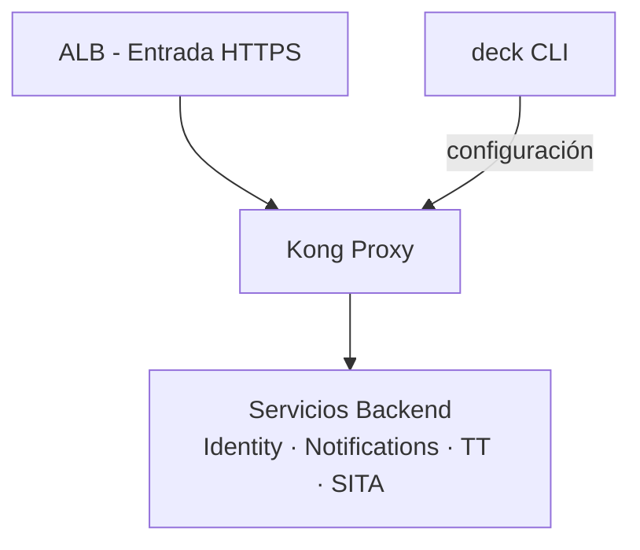
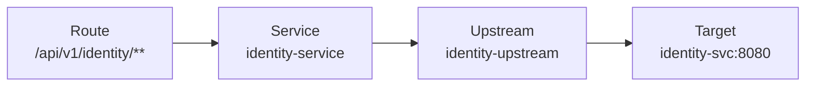

# 5. Vista de Bloques de Construcción

## Nivel 1: Sistema en Contexto

## Nivel 2: Componentes Internos de Kong

| Componente         | Tecnología/Ref                     | Responsabilidad                                                    |
| ------------------ | ---------------------------------- | ------------------------------------------------------------------ |
| **Kong Proxy**     | `kong:3.6-ubuntu` (imagen oficial) | Recibe tráfico, aplica plugins, enruta a backends                  |
| **Kong Admin API** | Expuesto en `:8001` (VPC interno)  | Gestión de configuración vía `deck sync`                           |
| **Plugin Engine**  | Lua + PDK                          | Ejecuta plugins en orden de prioridad por fase de request/response |
| **Cluster DB**     | PostgreSQL (RDS)                   | Estado compartido entre instancias en modo DB                      |
| **Upstreams**      | Configurados en `kong.yml`         | Balanceo de carga y health checks por servicio backend             |

## Services, Routes y Upstreams

> Cada servicio backend tiene su propio `Service` + `Route` + `Upstream`. Ver definiciones en el [Glosario](./12-glosario.md).

## Plugins Habilitados

| Plugin                 | Alcance          | Función                                                  |
| ---------------------- | ---------------- | -------------------------------------------------------- |
| `jwt`                  | Global / Route   | Validación de JWT emitidos por Keycloak                  |
| `rate-limiting`        | Route / Consumer | Throttling por IP, consumer o header con backend Redis   |
| `cors`                 | Route            | Cabeceras CORS para acceso desde navegadores             |
| `request-transformer`  | Route            | Inyección de headers (`X-Tenant-ID`, `X-Correlation-ID`) |
| `response-transformer` | Route            | Limpieza de cabeceras internas en respuestas al cliente  |
| `prometheus`           | Global           | Exposición de métricas en `/metrics`                     |
| `zipkin`               | Global           | Propagación de contexto de traza distribuida             |
| `ip-restriction`       | Route            | Whitelist/blacklist de IPs para rutas administrativas    |
