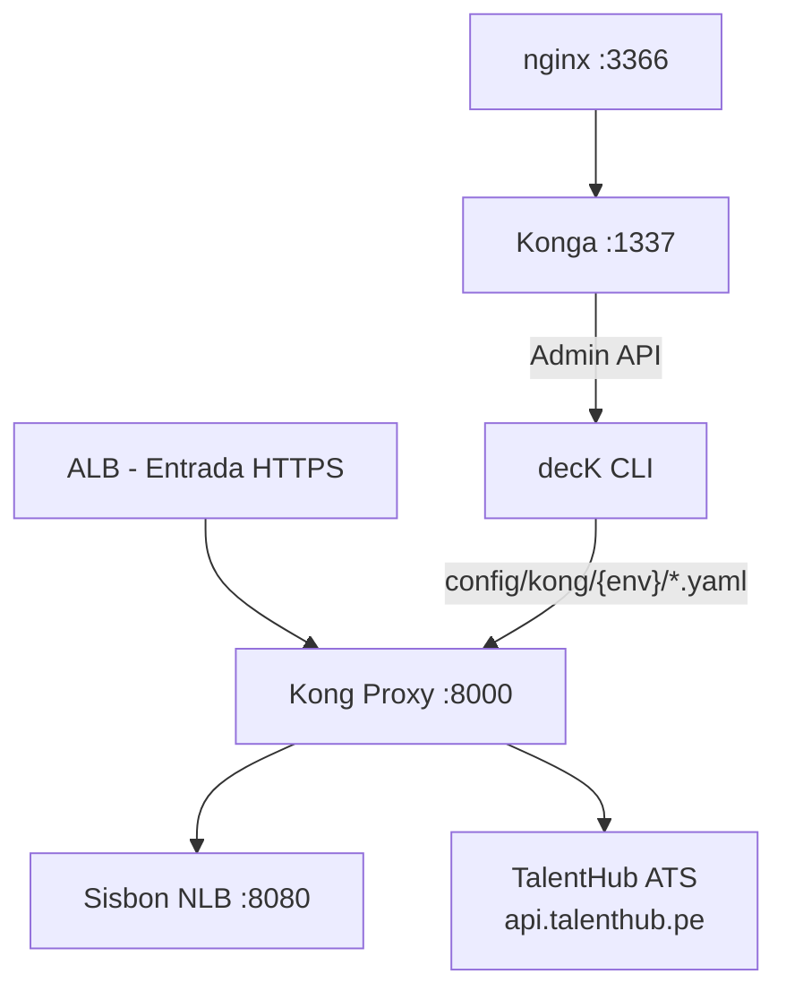
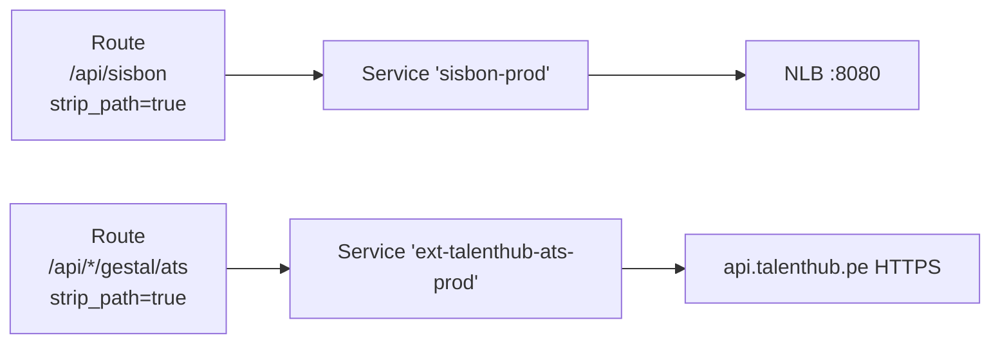

# 5. Vista de Bloques de Construcción

## Nivel 1: Sistema en Contexto

## Nivel 2: Componentes del Stack

| Componente              | Imagen / Tecnología                               | Responsabilidad                                                     |
| ----------------------- | ------------------------------------------------- | ------------------------------------------------------------------- |
| **Kong Proxy**          | `kong:3.9.1`                                      | Recibe tráfico, aplica plugins, enruta a backends                   |
| **Kong Admin API**      | Expuesto en `:8001` (interno)                     | Gestión de configuración vía `deck sync`                            |
| **Konga**               | `pantsel/konga:0.14.9`                            | Admin UI visual; conectada al Admin API `:8001`                     |
| **nginx**               | `nginx:1.29.3`                                    | Reverse proxy que expone Konga en `/konga/` con path rewriting      |
| **kong-deck-bootstrap** | `kong/deck:latest`                                | Contenedor de arranque: espera a Kong y ejecuta `deck sync` inicial |
| **kong-migrations**     | `kong:3.9.1`                                      | Ejecuta `kong migrations up` al iniciar; `restart: "no"`            |
| **PostgreSQL**          | `postgres:15-alpine` (local) / RDS (nonprod/prod) | Estado compartido de configuración Kong                             |
| **MySQL**               | `mysql:5.7`                                       | Base de datos de Konga                                              |

## Services, Routes y Plugins por Sistema

> Cada sistema de negocio tiene su propio `Service` + `Route` + conjunto de plugins. No se usan `Upstream` con health checks en la implementación actual; el NLB de AWS gestiona la disponibilidad de Sisbon.

## Plugins Habilitados

### Plugins Globales (todos los servicios)

| Plugin           | Config destacada                                                       | Función                                  |
| ---------------- | ---------------------------------------------------------------------- | ---------------------------------------- |
| `correlation-id` | `header: X-Correlation-ID`, `generator: uuid`, `echo_downstream: true` | Correlación de requests en logs y trazas |
| `prometheus`     | `status_code_metrics`, `latency_metrics`, `upstream_health_metrics`    | Exposición de métricas en `/metrics`     |

### Plugins por Servicio (Sisbon y Gestal/ATS)

| Plugin                  | Config clave                                                                                                | Función                                        |
| ----------------------- | ----------------------------------------------------------------------------------------------------------- | ---------------------------------------------- |
| `jwt`                   | `claims_to_verify: [exp]`, `key_claim_name: iss`                                                            | Valida JWT RS256 contra clave pública embebida |
| `acl`                   | `allow: [sisbon-users]` / `[talenthub-users]`                                                               | Autorización coarse-grained por sistema        |
| `request-transformer`   | Sisbon: `add X-Forwarded-Authorization`; ATS: `add x-api-key`, `remove Authorization`, `replace uri`        | Adapta headers al backend                      |
| `rate-limiting`         | DEV/QA: `200/min`, `2000/hr`; PROD Sisbon: `1000/min`, `10000/hr`; ATS: `50/min`, `500/hr`; `policy: local` | Throttling por consumer (tenant)               |
| `request-size-limiting` | `allowed_payload_size: 1` MB                                                                                | Protege contra payloads excesivos              |

## Consumers y ACL Groups

| Consumer       | Tenant            | ACL Groups                        | Sistemas con acceso |
| -------------- | ----------------- | --------------------------------- | ------------------- |
| `tlm-mx-realm` | `tlm-mx` (México) | `sisbon-users`                    | Sisbon              |
| `tlm-pe-realm` | `tlm-pe` (Perú)   | `sisbon-users`, `talenthub-users` | Sisbon, Gestal/ATS  |

> El aislamiento entre sistemas se logra mediante ACL groups: un token válido de `tlm-mx` no puede acceder a endpoints de `talenthub-users` porque `tlm-mx-realm` no tiene ese grupo.
