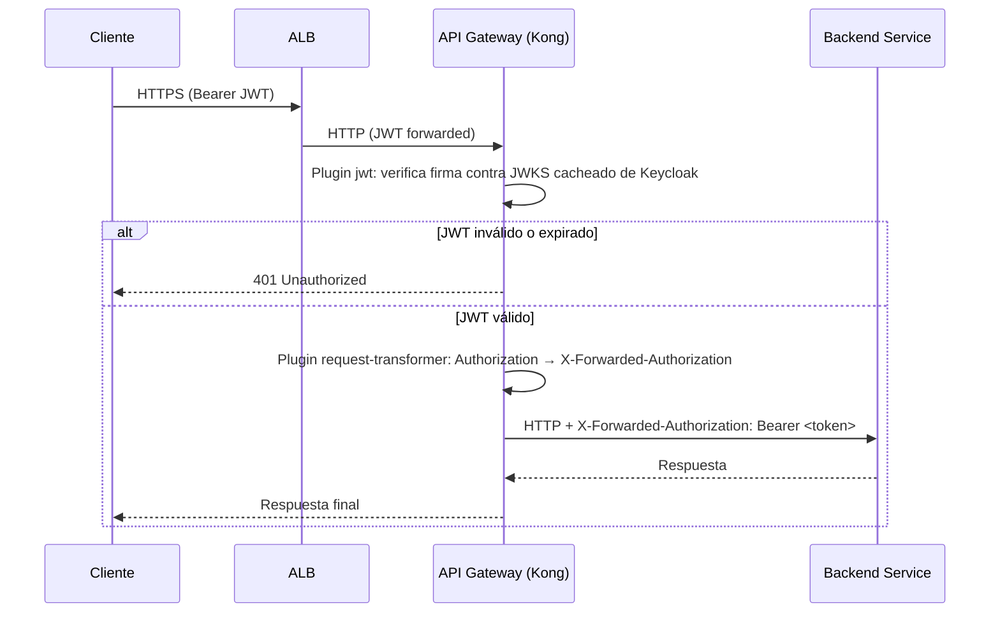
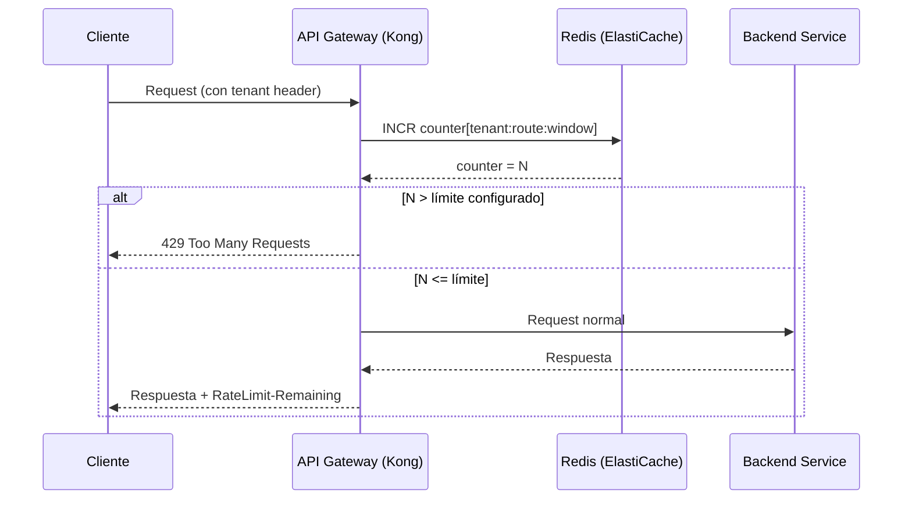
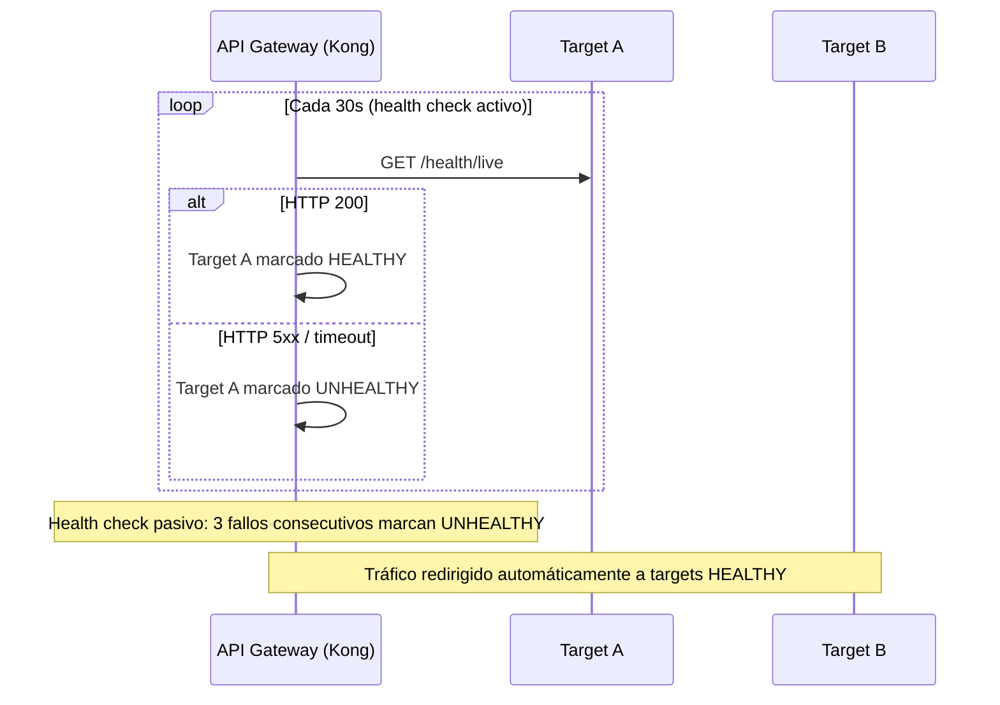

# 6. Vista de Tiempo de Ejecución

## Flujo 1: Request Autenticado

> Kong cachea las claves JWKS de Keycloak. La rotación de claves se propaga automáticamente al expirar el cache TTL.

## Flujo 2: Rate Limiting

> Redis (ElastiCache) está pendiente de implementación (DT-06). Actualmente el plugin usa `policy: local` (contador por instancia). El flujo siguiente describe el comportamiento objetivo con Redis.

## Flujo 3: Resiliencia de Upstream (Health Checks)

