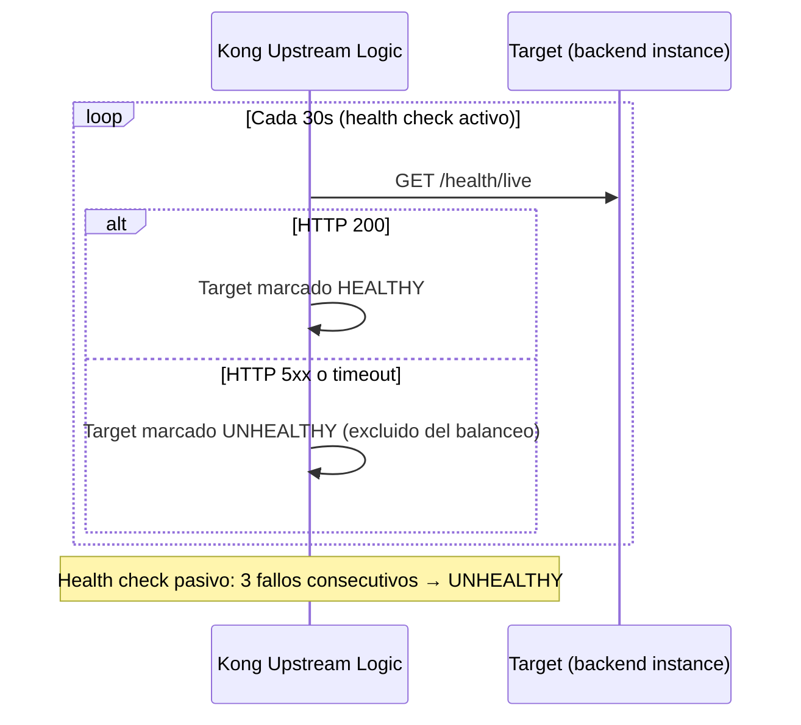
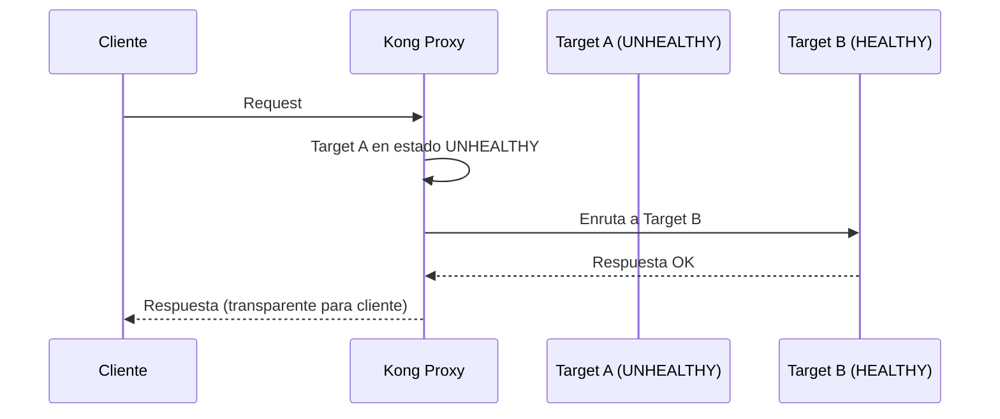
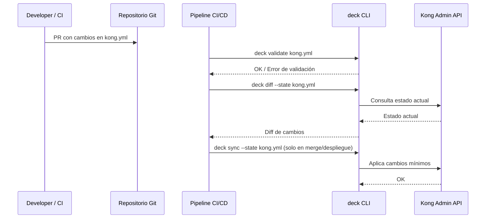

# 6. Vista de Tiempo de Ejecución

## Flujo 1: Request Autenticado

```mermaid
sequenceDiagram
    participant C as Cliente
    participant ALB as ALB (TLS Off)
    participant K as Kong Proxy
    participant KC as Keycloak (JWKS)
    participant B as Backend Service

    C->>ALB: HTTPS POST /api/v1/...  (Bearer JWT)
    ALB->>K: HTTP (JWT forwarded)
    K->>K: Plugin jwt: verifica firma JWT
contra JWKS cacheado de Keycloak
    alt JWT inválido o expirado
        K-->>C: 401 Unauthorized
    else JWT válido
        K->>K: Plugin request-transformer:
añade X-Consumer-ID, X-Tenant-ID
        K->>B: HTTP + headers enriquecidos
        B-->>K: Respuesta del backend
        K->>K: Plugin response-transformer:
elimina cabeceras internas
        K-->>C: Respuesta final
    end
```

> Kong cachea las claves JWKS de Keycloak. La rotación de claves se propaga automáticamente al expirar el cache TTL.

## Flujo 2: Rate Limiting

```mermaid
sequenceDiagram
    participant C as Cliente
    participant K as Kong Proxy
    participant R as Redis (ElastiCache)
    participant B as Backend Service

    C->>K: Request (con tenant header)
    K->>R: INCR counter[tenant:route:window]
    R-->>K: counter = N
    alt N > límite configurado
        K-->>C: 429 Too Many Requests
RateLimit-Remaining: 0
    else N <= límite
        K->>B: Request normal
        B-->>K: Respuesta
        K-->>C: Respuesta (RateLimit-Remaining: N_restante)
    end
```

## Flujo 3: Health Check de Upstream



## Flujo 4: Circuit Breaker (Health Check Pasivo)



Kong no implementa circuit breaker como estado de máquina explícito; usa exclusión de targets por health checks pasivos.
Para resiliencia adicional, el backend debe implementar patrones de resiliencia internos.

## Flujo 5: Sync de Configuración (deck)


