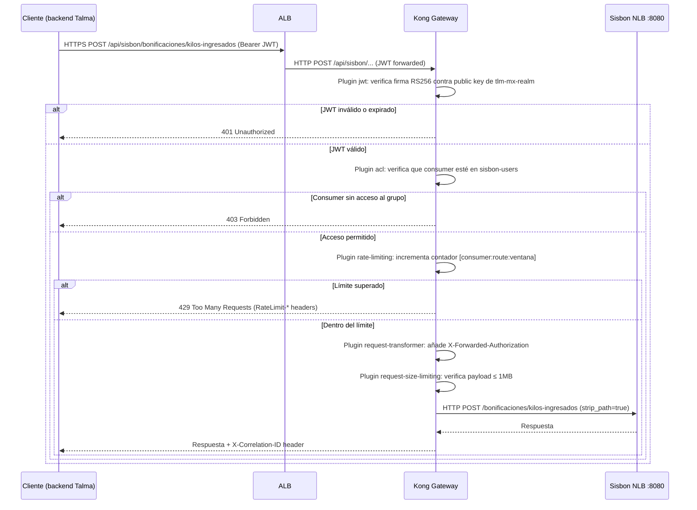
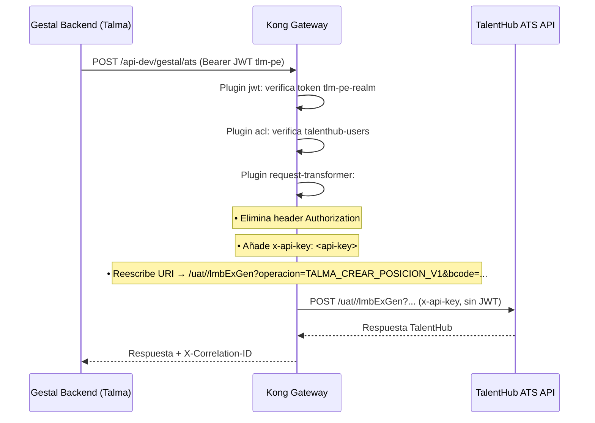
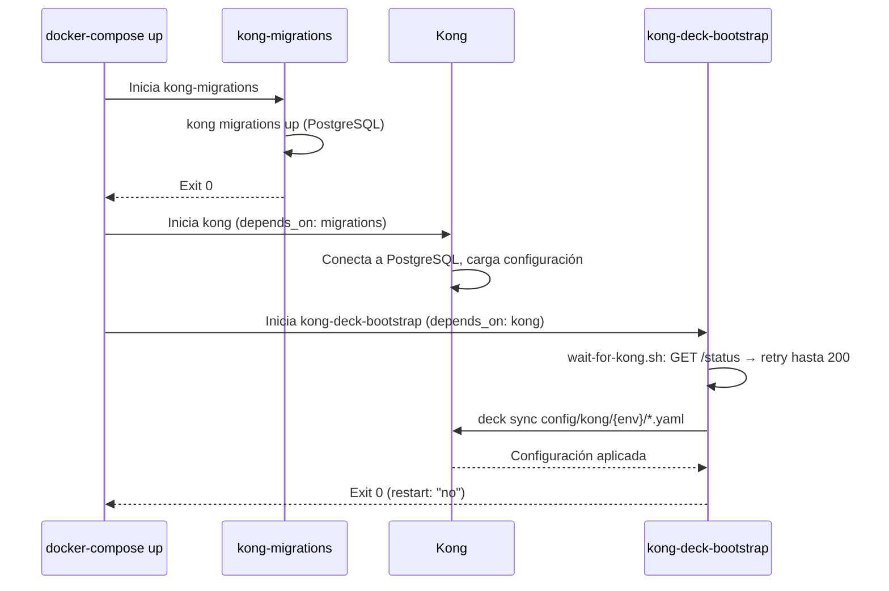

# 6. Vista de Tiempo de Ejecución

## Flujo 1: Request Autenticado (Sisbon)

> Kong valida JWT localmente usando la clave pública RSA embebida en `_consumers.yaml`. **No hay llamada a Keycloak en tiempo de ejecución.** La clave se actualiza manualmente al rotar en Keycloak.

## Flujo 2: Integración Externa (TalentHub ATS)

> Kong actúa como adaptador: el backend de Talma usa JWT corporativo y Kong lo traduce a la autenticación por API key que requiere TalentHub. La API key **no debe estar en el repositorio**; debe migrarse a AWS Secrets Manager (DT-01).

## Flujo 3: Arranque con deck Bootstrap

