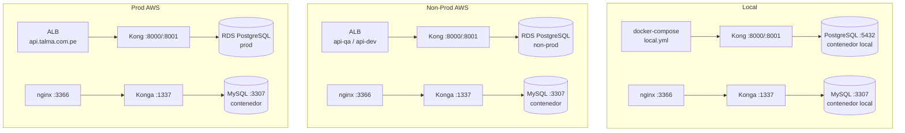

# 7. Vista de Despliegue

## Topología por Entorno



## Docker Compose — Servicios

| Servicio              | Imagen                 | Compose file               | Nota                                             |
| --------------------- | ---------------------- | -------------------------- | ------------------------------------------------ |
| `kong-migrations`     | `kong:3.9.1`           | Base                       | Ejecuta migrations; `restart: "no"`              |
| `kong`                | `kong:3.9.1`           | Base                       | Proxy `:8000`, Admin `:8001`                     |
| `kong-deck-bootstrap` | `kong/deck:latest`     | Base                       | Ejecuta `deck sync` al arrancar; `restart: "no"` |
| `konga`               | `pantsel/konga:0.14.9` | Base                       | Admin UI `:1337`                                 |
| `konga-proxy`         | `nginx:1.29.3`         | Base                       | Reverse proxy para Konga en `:3366/konga/`       |
| `konga-db`            | `mysql:5.7`            | Base                       | BD de Konga (`/opt/konga/mysql`)                 |
| `kong-db`             | `postgres:15-alpine`   | `docker-compose.local.yml` | Solo local; nonprod/prod usa RDS                 |

## Variables de Entorno (Kong)

| Variable                | Local                        | Non-Prod / Prod              | Descripción                         |
| ----------------------- | ---------------------------- | ---------------------------- | ----------------------------------- |
| `KONG_DATABASE`         | `postgres`                   | `postgres`                   | Modo DB                             |
| `KONG_PG_HOST`          | `kong-db` (contenedor)       | RDS host (`.env`)            | Host de PostgreSQL                  |
| `KONG_PG_USER`          | `kong`                       | Desde `.env`                 | Usuario de BD                       |
| `KONG_PG_PASSWORD`      | `kong_local_password`        | Desde `.env`                 | Contraseña de BD                    |
| `KONG_PG_SSL`           | `off`                        | `on`                         | SSL requerido en AWS                |
| `KONG_PG_SSL_VERIFY`    | `off`                        | `off`                        | Sin verificación de certificado RDS |
| `KONG_ADMIN_LISTEN`     | `0.0.0.0:${KONG_ADMIN_PORT}` | `0.0.0.0:${KONG_ADMIN_PORT}` | Admin API accesible en red interna  |
| `KONG_PROXY_ACCESS_LOG` | `/dev/stdout`                | `/dev/stdout`                | Logs hacia stdout → recolector      |
| `KONG_ADMIN_ACCESS_LOG` | `/dev/stdout`                | `/dev/stdout`                | Logs de Admin API hacia stdout      |

## Estructura de Configuración decK

```
config/kong/
├── local/
│   ├── _plugins.yaml       # correlation-id, prometheus (globales)
│   ├── _consumers.yaml     # tlm-mx-realm, tlm-pe-realm (JWT RS256 + ACL)
│   ├── sisbon.yaml         # Servicios sisbon-dev + sisbon-qa
│   └── gestal.yaml         # ext-talenthub-ats-dev + ext-talenthub-ats-qa
├── nonprod/
│   └── (misma estructura)
└── prod/
    ├── _plugins.yaml
    ├── _consumers.yaml
    ├── sisbon.yaml         # Solo sisbon-prod
    └── gestal.yaml         # Solo ext-talenthub-ats-prod
```

## Comandos de Operación (Makefile)

| Comando              | Acción                                                |
| -------------------- | ----------------------------------------------------- |
| `make start-local`   | Levanta stack completo con `docker-compose.local.yml` |
| `make sync-local`    | Ejecuta `deck sync` con `config/kong/local/`          |
| `make sync-nonprod`  | Ejecuta `deck sync` con `config/kong/nonprod/`        |
| `make sync-prod`     | Ejecuta `deck sync` con `config/kong/prod/`           |
| `make start-nonprod` | Levanta con `docker-compose.nonprod.yml`              |
| `make start-prod`    | Levanta con `docker-compose.prod.yml`                 |

## Volúmenes Persistentes

| Componente | Path en host        | Contenido               |
| ---------- | ------------------- | ----------------------- |
| Kong       | `/opt/kong/logs`    | Logs de error de Kong   |
| Kong       | `/opt/kong/pids`    | PID files de Kong       |
| Kong       | `/opt/kong/sockets` | Unix sockets de Kong    |
| Konga-DB   | `/opt/konga/mysql`  | Datos de MySQL de Konga |

> Los directorios de Kong deben pertenecer al `uid 1000` (usuario `kong`): `sudo chown -R 1000:1000 /opt/kong`
