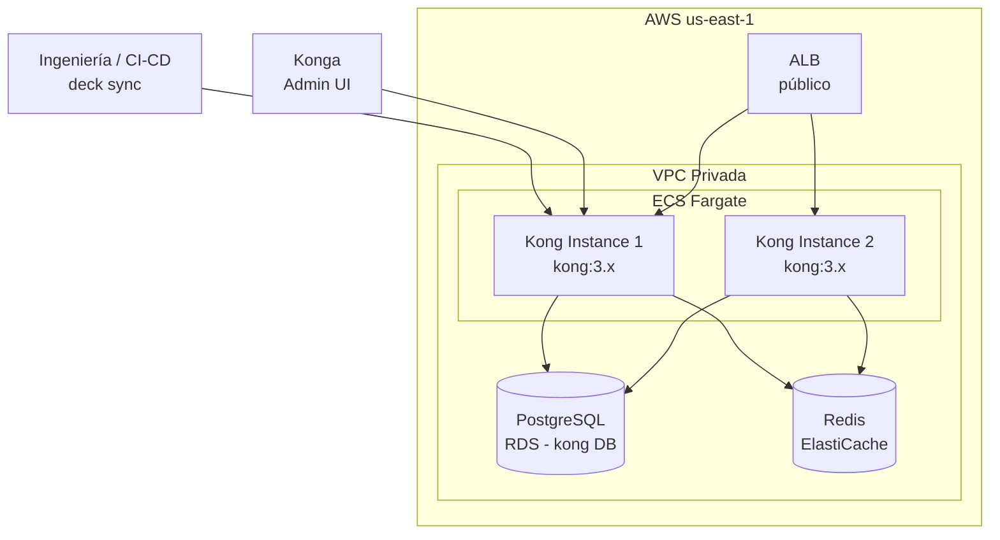

# 7. Vista de Implementación

## Topología de Despliegue



## Dockerfile (Kong)

```dockerfile
FROM kong:3.6-ubuntu
USER kong
EXPOSE 8000 8443 8001 8444
```

> Imagen oficial LTS. Kong no publica variante Alpine. No hay código custom; toda la lógica se configura mediante plugins declarativos vía `deck`.

## Configuración de Entorno (ECS Task)

| Variable de Entorno             | Valor / Fuente   | Descripción                                    |
| ------------------------------- | ---------------- | ---------------------------------------------- |
| `KONG_DATABASE`                 | `postgres`       | Modo DB para clustering                        |
| `KONG_PG_HOST`                  | Secrets Manager  | Host de PostgreSQL RDS                         |
| `KONG_PG_USER`                  | Secrets Manager  | Usuario de BD                                  |
| `KONG_PG_PASSWORD`              | Secrets Manager  | Contraseña de BD                               |
| `KONG_PROXY_LISTEN`             | `0.0.0.0:8000`   | Puerto de proxy HTTP                           |
| `KONG_PROXY_LISTEN_SSL`         | `off`            | TLS termina en ALB                             |
| `KONG_ADMIN_LISTEN`             | `127.0.0.1:8001` | Admin API solo interno                         |
| `KONG_NGINX_WORKER_PROCESSES`   | `auto`           | Workers según vCPU                             |
| `KONG_LOG_LEVEL`                | `info`           | Nivel de log (stdout → Fluent Bit → Loki)      |
| `KONG_PLUGINS`                  | `bundled`        | Todos los plugins incluidos                    |
| `KONG_TRACING_INSTRUMENTATIONS` | `all`            | Activa trazas OpenTelemetry nativas (Kong 3.x) |

## Configuración Declarativa (deck YAML)

Estructura del repositorio de configuración:

```
infra/kong/
├── kong.yml           # Config principal (deck)
├── plugins/
│   ├── jwt.yml
│   ├── rate-limiting.yml
│   └── prometheus.yml
└── workspaces/
    ├── pe.yml         # Perú
    ├── ec.yml         # Ecuador
    ├── co.yml         # Colombia
    └── mx.yml         # México
```

Ejemplo de `kong.yml` (fragmento):

```yaml
_format_version: "3.0"
_transform: true

services:
  - name: identity-service
    url: http://identity-upstream # apunta al Upstream
    plugins:
      - name: jwt
        config:
          secret_is_base64: false
          key_claim_name: iss
    routes:
      - name: identity-route
        paths:
          - /api/v1/identity
        strip_path: false

  - name: notifications-service
    url: http://notifications-upstream
    routes:
      - name: notifications-route
        paths:
          - /api/v1/notifications

upstreams:
  - name: identity-upstream
    healthchecks:
      active:
        http_path: /health/live
        healthy:
          interval: 30
          successes: 2
        unhealthy:
          interval: 10
          http_failures: 3
    targets:
      - target: identity-svc:8080
        weight: 100
```

## ECS Fargate — Parámetros Clave

| Parámetro       | Valor                             | Nota                                               |
| --------------- | --------------------------------- | -------------------------------------------------- |
| CPU / Memoria   | `1024` / `2048`                   | Ajustable según carga                              |
| Imagen          | `kong:3.6-ubuntu`                 | Imagen oficial LTS (no existe variante Alpine)     |
| Puerto expuesto | `8000` (proxy)                    | Admin `:8001` solo accesible desde VPC             |
| Log driver      | `awsfirelens` (Fluent Bit → Loki) | Logs estructurados al stack de observabilidad      |
| Secrets         | AWS Secrets Manager               | `KONG_PG_HOST`, `KONG_PG_USER`, `KONG_PG_PASSWORD` |

> La definición completa de la task definition Terraform está en el repositorio de infraestructura (`infra/terraform/kong/`).
