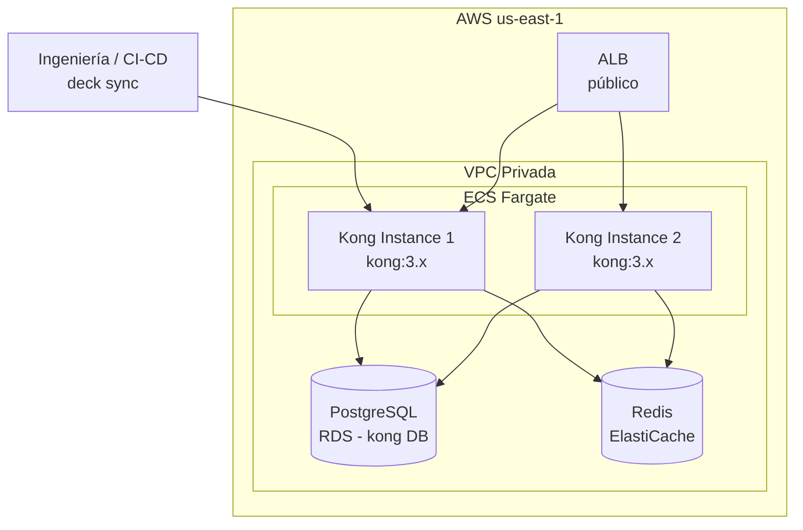

# 7. Vista de Implementación

## Topología de Despliegue



## Dockerfile (Kong)

```dockerfile
FROM kong:3.6-ubuntu

# Kong usa la imagen oficial; no se requiere código custom
# Los plugins se config vía deck YAML o variables de entorno

USER kong
EXPOSE 8000 8443 8001 8444
```

> Se usa la imagen oficial `kong:3.x`. No hay código de aplicación custom; toda la lógica se configura mediante plugins declarativos.

## Configuración de Entorno (ECS Task)

| Variable de Entorno | Valor / Fuente | Descripción |
|---|---|---|
| `KONG_DATABASE` | `postgres` | Modo DB para clustering |
| `KONG_PG_HOST` | Secrets Manager | Host de PostgreSQL RDS |
| `KONG_PG_USER` | Secrets Manager | Usuario de BD |
| `KONG_PG_PASSWORD` | Secrets Manager | Contraseña de BD |
| `KONG_PROXY_LISTEN` | `0.0.0.0:8000` | Puerto de proxy HTTP |
| `KONG_PROXY_LISTEN_SSL` | `off` | TLS termina en ALB |
| `KONG_ADMIN_LISTEN` | `127.0.0.1:8001` | Admin API solo interno |
| `KONG_NGINX_WORKER_PROCESSES` | `auto` | Workers según vCPU |
| `KONG_LOG_LEVEL` | `info` | Nivel de log |
| `KONG_PLUGINS` | `bundled` | Todos los plugins incluidos |

## Configuración Declarativa (deck YAML)

Estructura del repositorio de configuración:

```
infra/kong/
├── kong.yml           # Config principal (deck)
├── plugins/
│   ├── jwt.yml
│   ├── rate-limiting.yml
│   └── prometheus.yml
└── workspaces/
    ├── pe.yml         # Perú
    ├── ec.yml         # Ecuador
    ├── co.yml         # Colombia
    └── mx.yml         # México
```

Ejemplo de `kong.yml` (fragmento):

```yaml
_format_version: "3.0"
_transform: true

services:
  - name: identity-service
    url: http://identity-svc:8080
    plugins:
      - name: jwt
        config:
          secret_is_base64: false
          key_claim_name: iss
    routes:
      - name: identity-route
        paths:
          - /api/v1/identity
        strip_path: false

  - name: notifications-service
    url: http://notifications-svc:8080
    routes:
      - name: notifications-route
        paths:
          - /api/v1/notifications

upstreams:
  - name: identity-upstream
    healthchecks:
      active:
        http_path: /health/live
        healthy:
          interval: 30
          successes: 2
        unhealthy:
          interval: 10
          http_failures: 3
    targets:
      - target: identity-svc:8080
        weight: 100
```

## Terraform (ECS Fargate)

```hcl
resource "aws_ecs_task_definition" "kong" {
  family                   = "kong-api-gateway"
  requires_compatibilities = ["FARGATE"]
  network_mode             = "awsvpc"
  cpu                      = "1024"
  memory                   = "2048"
  execution_role_arn       = aws_iam_role.ecs_execution.arn

  container_definitions = jsonencode([{
    name      = "kong"
    image     = "kong:3.6-ubuntu"
    essential = true
    portMappings = [
      { containerPort = 8000, protocol = "tcp" }
    ]
    secrets = [
      { name = "KONG_PG_HOST",     valueFrom = aws_secretsmanager_secret.kong_pg_host.arn },
      { name = "KONG_PG_USER",     valueFrom = aws_secretsmanager_secret.kong_pg_user.arn },
      { name = "KONG_PG_PASSWORD", valueFrom = aws_secretsmanager_secret.kong_pg_password.arn }
    ]
    environment = [
      { name = "KONG_DATABASE",           value = "postgres" },
      { name = "KONG_PROXY_LISTEN",       value = "0.0.0.0:8000" },
      { name = "KONG_ADMIN_LISTEN",       value = "127.0.0.1:8001" },
      { name = "KONG_NGINX_WORKER_PROCESSES", value = "auto" }
    ]
    logConfiguration = {
      logDriver = "awslogs"
      options = {
        "awslogs-group"  = "/ecs/kong-api-gateway"
        "awslogs-region" = "us-east-1"
      }
    }
  }])
}
```
