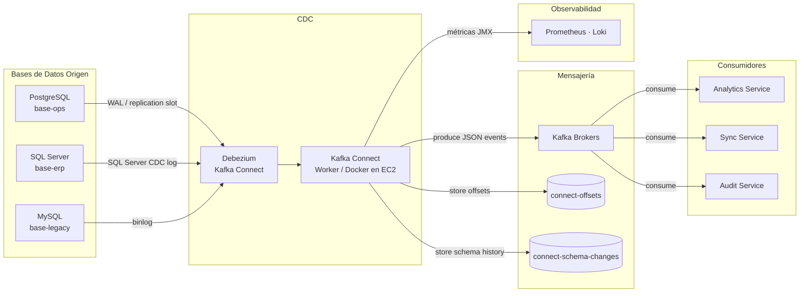

# 3. Contexto y Alcance

## Contexto del Sistema

Debezium actúa como puente entre las bases de datos corporativas y la plataforma de mensajería Kafka. Lee cambios directamente de los transaction logs de las BDs origen y los publica como eventos JSON en topics Kafka, sin modificar ni impactar la base de datos fuente.

## Contexto de Negocio

| Actor externo          | Interfaz                                           | Descripción                                                                    |
| ---------------------- | -------------------------------------------------- | ------------------------------------------------------------------------------ |
| Bases de datos origen  | Replication slot / WAL / binlog                    | Fuente de cambios; Debezium lee sin impacto en el tráfico transaccional        |
| Servicios consumidores | Kafka Consumer API (topic `<bd>.<schema>.<tabla>`) | Consumen eventos de cambio para sincronización, analítica o reacción a eventos |
| Equipo de Plataforma   | Kafka Connect REST API (`:8083`)                   | Registro, monitoreo y gestión del ciclo de vida de conectores                  |
| Equipo de Datos        | Kafka Consumer API                                 | Ingesta de eventos CDC en data lake o DWH                                      |

## Contexto Técnico

| Interfaz                            | Protocolo                      | Dirección | Descripción                                                |
| ----------------------------------- | ------------------------------ | --------- | ---------------------------------------------------------- |
| BD origen → Debezium                | Replication protocol (TCP)     | Entrada   | PostgreSQL WAL, SQL Server CDC log, MySQL binlog           |
| Debezium → Kafka Brokers            | TCP `:9092` (SASL)             | Salida    | Publicación de eventos JSON en topics CDC                  |
| Debezium → `connect-offsets`        | TCP `:9092`                    | Salida    | Persistencia de offsets de lectura por conector            |
| Debezium → `connect-schema-changes` | TCP `:9092`                    | Salida    | Historial de cambios de esquema de las tablas monitoreadas |
| Admin → Kafka Connect REST API      | HTTP `:8083` (VPC interno)     | Entrada   | Registro y gestión de conectores via IaC                   |
| Debezium → Prometheus               | HTTP `/metrics` (JMX Exporter) | Salida    | Métricas del worker y de cada conector                     |
| Debezium → Loki                     | stdout → Fluent Bit (FireLens) | Salida    | Logs estructurados del worker Kafka Connect                |

## Fuera de Alcance

- Transformación compleja de datos (responsabilidad de Kafka Streams o servicios downstream).
- Consultas a las bases de datos origen (CDC es exclusivamente lectura de logs, no consultas SQL).
- Gestión del ciclo de vida de las bases de datos origen (responsabilidad de los equipos de base de datos).
- Schema Registry (no implementado — DT-03 de mensajería; el formato actual es JSON sin validación de schema).
- Sincronización bidireccional (CDC es unidireccional: BD origen → Kafka).
