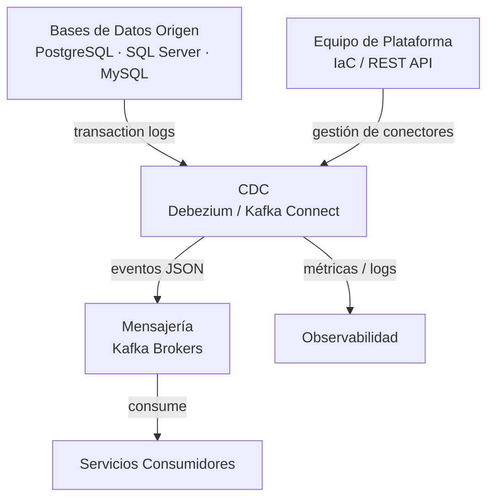
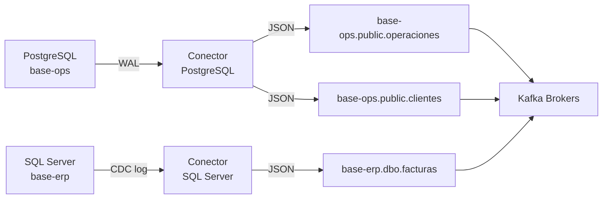

# 5. Vista de Bloques de Construcción

## Nivel 1: Sistema en Contexto

## Nivel 2: Componentes Internos

| Componente                 | Tecnología / Imagen                          | Responsabilidad                                                                               |
| -------------------------- | -------------------------------------------- | --------------------------------------------------------------------------------------------- |
| **Kafka Connect Worker**   | `debezium/connect:2.5` (Docker en EC2)       | Runtime de conectores; expone la REST API en `:8083`; gestiona el ciclo de vida de conectores |
| **Conector PostgreSQL**    | `debezium-connector-postgresql`              | Lee el WAL de PostgreSQL vía replication slot; publica cambios en Kafka                       |
| **Conector SQL Server**    | `debezium-connector-sqlserver`               | Lee el CDC log de SQL Server; publica cambios en Kafka                                        |
| **Conector MySQL**         | `debezium-connector-mysql`                   | Lee el binlog de MySQL; publica cambios en Kafka                                              |
| **SMT Pipeline**           | Single Message Transforms (plugins Debezium) | Aplica transformaciones: filtrado de columnas, enmascaramiento PII, routing                   |
| **connect-offsets**        | Kafka topic interno                          | Almacena la posición de lectura de cada conector (replication slot offset, LSN, GTID)         |
| **connect-schema-changes** | Kafka topic interno                          | Historial de cambios de esquema de las tablas monitoreadas                                    |
| **connect-status**         | Kafka topic interno                          | Estado de conectores y tareas (RUNNING, PAUSED, FAILED)                                       |
| **JMX Exporter**           | Agente Java en el contenedor Docker          | Exporta métricas JMX del worker en formato Prometheus                                         |

## Relación Conector → Topic

> Cada conector gestiona una base de datos origen. Un conector puede monitorear múltiples tablas, generando un topic independiente por tabla.

## SMT Habilitados

| SMT                     | Propósito                                                                    |
| ----------------------- | ---------------------------------------------------------------------------- |
| `ExtractNewRecordState` | Aplana el mensaje extrayendo solo el campo `after` para operaciones simples  |
| `MaskField`             | Enmascara columnas con PII (DNI, email, teléfono) antes de publicar en Kafka |
| `Filter`                | Excluye tablas o filas específicas según condición configurable              |
| `TimestampConverter`    | Convierte timestamps de BD a formato ISO 8601 en el mensaje JSON             |
| `ReplaceField`          | Renombra o elimina campos del mensaje antes de publicar                      |
