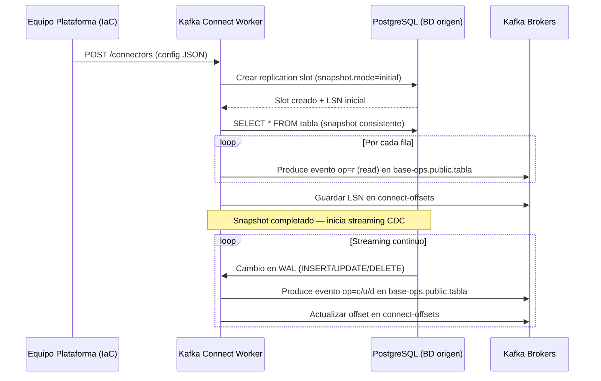
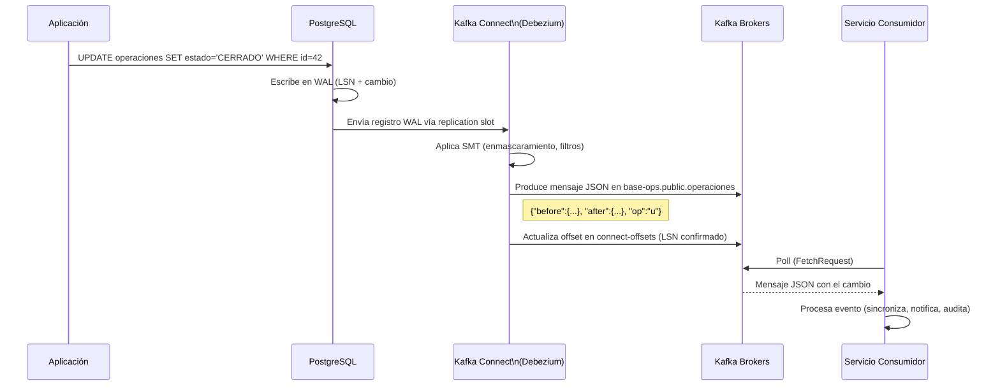
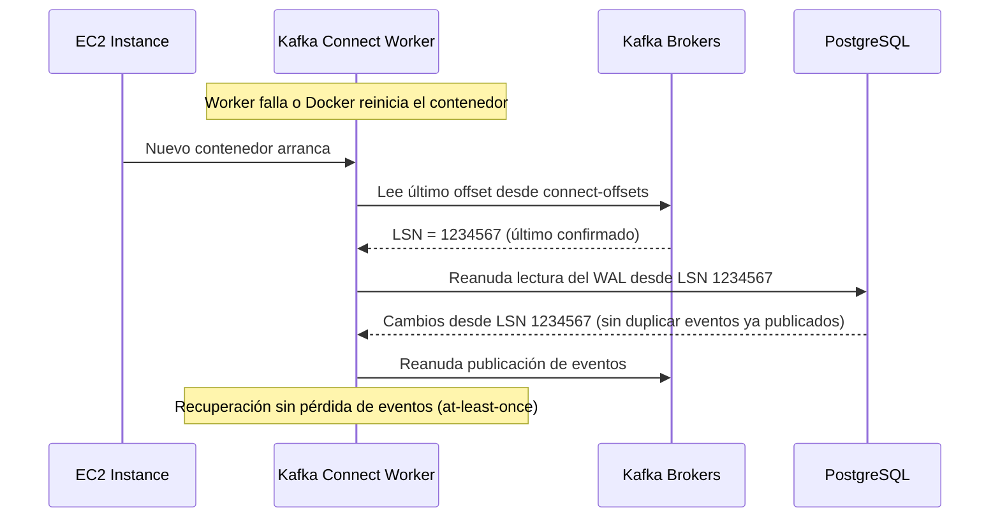

# 6. Vista de Tiempo de Ejecución

## Flujo 1: Snapshot Inicial y Arranque del Conector

> El snapshot inicial puede omitirse con `snapshot.mode=never` si la tabla ya fue cargada previamente.

## Flujo 2: Captura de Cambio (Streaming CDC)

## Flujo 3: Recuperación tras Fallo del Worker

> La garantía es **at-least-once**: en caso de fallo entre publicación y confirmación de offset, un evento puede publicarse dos veces. Los consumidores deben ser idempotentes.

## Manejo de Errores

| Escenario                                | Respuesta del Sistema                                                                      |
| ---------------------------------------- | ------------------------------------------------------------------------------------------ |
| BD origen no disponible                  | Conector reintenta con backoff exponencial; alerta si supera `max.retries`                 |
| Replication slot caído / invalidado      | Conector falla con `FAILED`; requiere intervención manual (recrear slot y snapshot)        |
| Kafka no disponible                      | Worker bufferiza cambios en memoria hasta `producer.max.block.ms`; luego falla y reintenta |
| Cambio de esquema en tabla origen        | Debezium detecta el cambio, registra en `connect-schema-changes` y continúa el streaming   |
| Contenedor reiniciado (OOM u otro fallo) | Worker reanuda desde el último offset confirmado en Kafka (`connect-offsets`)              |
| Columna PII publicada sin enmascarar     | Alerta de auditoría; revisión de configuración SMT del conector afectado                   |
