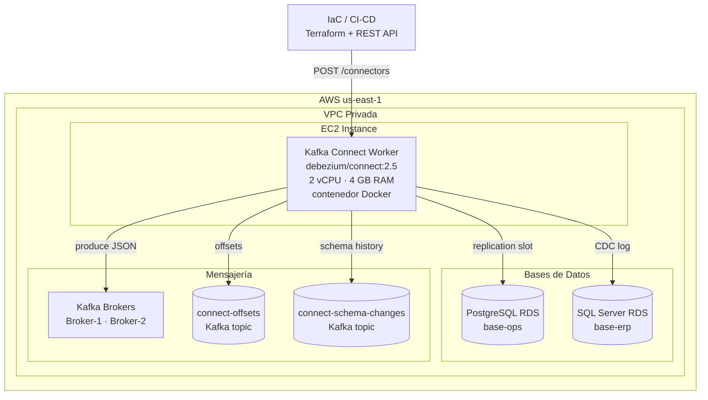

# 7. Vista de Despliegue

## Topología de Despliegue



## Dockerfile

```dockerfile
FROM debezium/connect:2.5
# Imagen oficial de Debezium que incluye Kafka Connect
# y los conectores para PostgreSQL, MySQL y SQL Server.
# No se agrega código custom; la lógica se configura
# mediante el API REST de Kafka Connect.
EXPOSE 8083
```

> La imagen `debezium/connect:2.5` incluye los conectores más comunes. No se usa la imagen base `confluentinc/cp-kafka-connect` para evitar dependencia de Confluent Platform.

## Configuración del Contenedor Docker

| Variable de Entorno              | Valor / Fuente                                | Descripción                                           |
| -------------------------------- | --------------------------------------------- | ----------------------------------------------------- |
| `BOOTSTRAP_SERVERS`              | `broker-1:9092,broker-2:9092`                 | Kafka brokers del clúster corporativo                 |
| `GROUP_ID`                       | `debezium-cdc-group`                          | ID del grupo de workers Kafka Connect                 |
| `CONFIG_STORAGE_TOPIC`           | `connect-configs`                             | Topic para almacenar configuración de conectores      |
| `OFFSET_STORAGE_TOPIC`           | `connect-offsets`                             | Topic para almacenar offsets de lectura               |
| `STATUS_STORAGE_TOPIC`           | `connect-status`                              | Topic para almacenar estado de conectores y tareas    |
| `KEY_CONVERTER`                  | `org.apache.kafka.connect.json.JsonConverter` | Conversor de clave JSON                               |
| `VALUE_CONVERTER`                | `org.apache.kafka.connect.json.JsonConverter` | Conversor de valor JSON                               |
| `KEY_CONVERTER_SCHEMAS_ENABLE`   | `false`                                       | Deshabilita el schema embebido en el JSON de la clave |
| `VALUE_CONVERTER_SCHEMAS_ENABLE` | `false`                                       | Deshabilita el schema embebido en el JSON del valor   |
| `CONNECT_SASL_MECHANISM`         | `SCRAM-SHA-512`                               | Autenticación SASL hacia Kafka                        |
| `CONNECT_SASL_JAAS_CONFIG`       | Secrets Manager                               | Credenciales SASL hacia Kafka                         |
| `KAFKA_DEBUG`                    | `false`                                       | Logs de debug desactivados en producción              |

## Ejemplo de Configuración de Conector (PostgreSQL)

```json
{
  "name": "base-ops-postgres-connector",
  "config": {
    "connector.class": "io.debezium.connector.postgresql.PostgresConnector",
    "database.hostname": "base-ops.cluster.rds.amazonaws.com",
    "database.port": "5432",
    "database.user": "debezium_user",
    "database.password": "${secretsmanager:debezium/postgres/base-ops}",
    "database.dbname": "base-ops",
    "database.server.name": "base-ops",
    "topic.prefix": "base-ops",
    "table.include.list": "public.operaciones,public.clientes",
    "plugin.name": "pgoutput",
    "snapshot.mode": "initial",
    "key.converter": "org.apache.kafka.connect.json.JsonConverter",
    "value.converter": "org.apache.kafka.connect.json.JsonConverter",
    "key.converter.schemas.enable": "false",
    "value.converter.schemas.enable": "false"
  }
}
```

## Estructura del Repositorio de Infraestructura

```
infra/cdc/
├── terraform/
│   ├── ec2-instance.tf          # EC2 instance para el worker Kafka Connect
│   ├── iam-roles.tf             # Roles IAM para acceso a Secrets Manager
│   └── security-groups.tf      # Reglas de red (:8083, acceso a BD, Kafka)
└── connectors/
    ├── base-ops-postgres.json   # Config del conector PostgreSQL base-ops
    ├── base-erp-sqlserver.json  # Config del conector SQL Server base-erp
    └── deploy-connectors.sh     # Script de registro vía REST API
```
