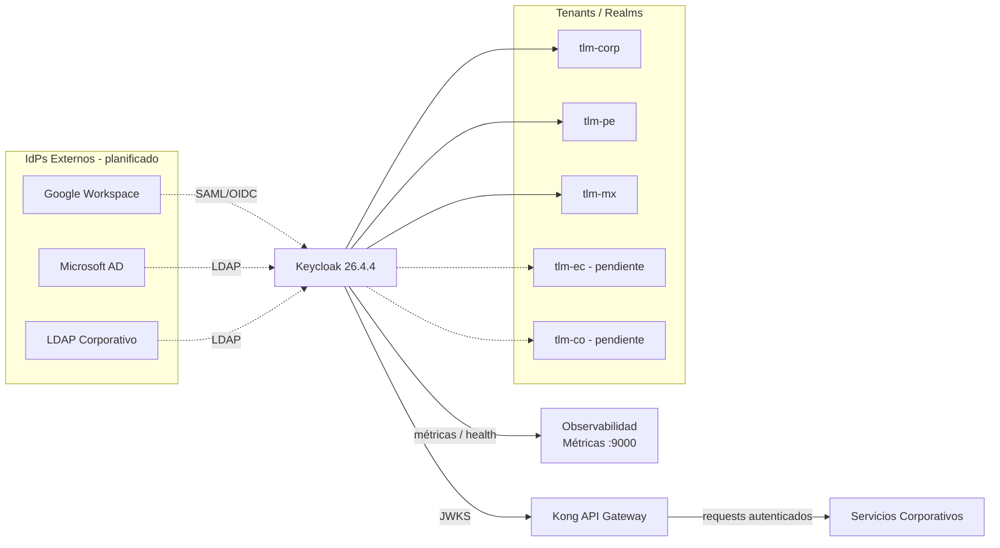

# 3. Contexto y Alcance

## Contexto del Sistema

Keycloak actúa como IdP central para todos los servicios corporativos multipaís.
No contiene lógica de negocio; gestiona identidades, sesiones y tokens para los servicios que lo consumen.

## Contexto Técnico

> Las líneas punteadas hacia IdPs externos indican integración planificada, aún no configurada.

## Dentro del Alcance

| Componente        | Responsabilidad                                                              |
| ----------------- | ---------------------------------------------------------------------------- |
| Keycloak          | IdP central multi-tenant; autenticación, autorización, gestión de usuarios   |
| Realm corporativo | `tlm-corp`: realm global para servicios internos (Grafana, herramientas)     |
| Realms por país   | `tlm-pe`, `tlm-mx`: configurados. `tlm-ec`, `tlm-co`: pendientes de creación |
| Tema corporativo  | `talma-theme`: branding personalizado para login, account y admin            |
| Gestión de tokens | Ciclo de vida de JWT: generación, validación, renovación (`accessToken: 300s`) |
| Auditoría         | Registro de eventos de seguridad _(pendiente de habilitación)_               |

## Contexto de Negocio

| Actor externo                     | Interfaz                          | Descripción                                      |
| --------------------------------- | --------------------------------- | ------------------------------------------------ |
| Administrador Global              | Consola Admin / Admin API         | Configuración de tenants (`realms`), políticas   |
| Administrador de Tenant (`realm`) | Consola Admin                     | Gestión de usuarios y roles específicos por país |
| Usuario Final                     | Login UI / Account Console        | Login, gestión de perfil, reset de contraseña    |
| API Gateway (Kong)                | JWKS                              | Validación de token JWT, contexto de usuario     |
| Servicios Corporativos            | OAuth2/OIDC                       | Autenticación y autorización                     |
| IdP Externo _(planificado)_       | SAML / OIDC / LDAP                | Federación de usuarios                           |
| Sistema de Monitoreo              | Métricas HTTP `:9000`             | Métricas, logs, health checks                    |

## Contexto Técnico

| Interfaz                     | Protocolo     | Dirección | Descripción                                      |
| ---------------------------- | ------------- | --------- | ------------------------------------------------ |
| `/auth/realms/{realm}/protocol/openid-connect/*` | OIDC (HTTPS)  | Entrada   | Autenticación, tokens, userinfo                  |
| `/auth/realms/{realm}/protocol/saml`             | SAML (HTTPS)  | Entrada   | Federación SAML _(planificado)_                  |
| `/auth/admin/realms/{realm}`                     | REST (HTTPS)  | Entrada   | Admin API para gestión programática              |
| `/auth/realms/{realm}/.well-known/openid-configuration` | HTTPS  | Entrada   | Discovery de endpoints OIDC                      |
| JWKS (`/auth/realms/{realm}/protocol/openid-connect/certs`) | HTTPS | Salida | Claves públicas para validación JWT en Kong      |
| JDBC (puerto `5432`)         | PostgreSQL    | Salida    | Persistencia de identidades y configuración      |
| Métricas (`:9000`)           | HTTP          | Salida    | Prometheus scrape de métricas y health           |

## Fuera de Alcance

- IdPs externos (Google, Microsoft AD, LDAP corporativo) — gestionados por terceros o TI.
- Lógica de negocio de los servicios que consumen tokens.
- Validación de tokens por request — responsabilidad de Kong (ADR-010).
