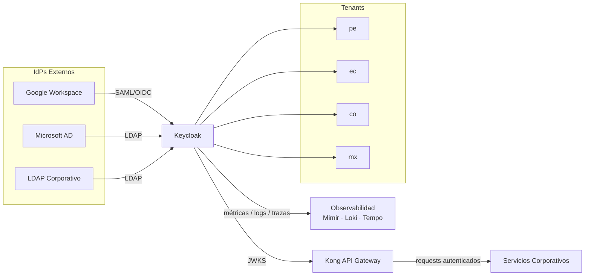

# 3. Contexto y Alcance

## Contexto del Sistema

Keycloak actúa como IdP central para todos los servicios corporativos multipaís.
No contiene lógica de negocio; gestiona identidades, sesiones y tokens para los servicios que lo consumen.

## Contexto Técnico

## Dentro del Alcance

| Componente        | Responsabilidad                                                            |
| ----------------- | -------------------------------------------------------------------------- |
| Keycloak          | IdP central multi-tenant; autenticación, autorización, gestión de usuarios |
| Realms por país   | Aislamiento de datos y configuración por tenant (`pe`, `ec`, `co`, `mx`)   |
| Federación        | Integración con LDAP, SAML, OIDC externos                                  |
| Gestión de tokens | Ciclo de vida de JWT: generación, validación, renovación                   |
| Auditoría         | Registro de eventos de seguridad                                           |

## Fuera de Alcance

- IdPs externos (Google, Microsoft AD, LDAP corporativo) — gestionados por terceros o TI.
- Lógica de negocio de los servicios que consumen tokens.
- Validación de tokens por request — responsabilidad de Kong (ADR-010).

## Interfaces Externas

| Actor                             | Tipo    | Descripción                                      |
| --------------------------------- | ------- | ------------------------------------------------ |
| Administrador Global              | Humano  | Configuración de tenants (`realms`), políticas   |
| Administrador de Tenant (`realm`) | Humano  | Gestión de usuarios y roles específicos por país |
| Usuario Final                     | Humano  | Login, gestión de perfil, reset de contraseña    |
| API Gateway (Kong)                | Sistema | Validación de token JWT, contexto de usuario     |
| Servicios Corporativos            | Sistema | Autenticación y autorización                     |
| IdP Externo                       | Sistema | Federación de usuarios (SAML, OIDC, LDAP)        |
| Sistema de Monitoreo              | Sistema | Métricas, logs, health checks                    |
