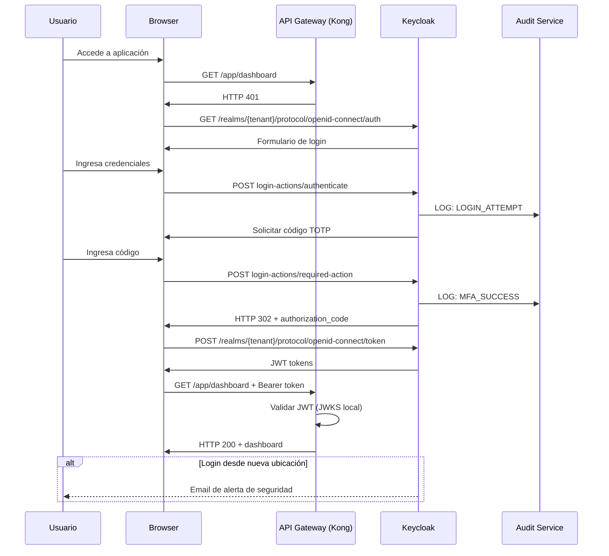
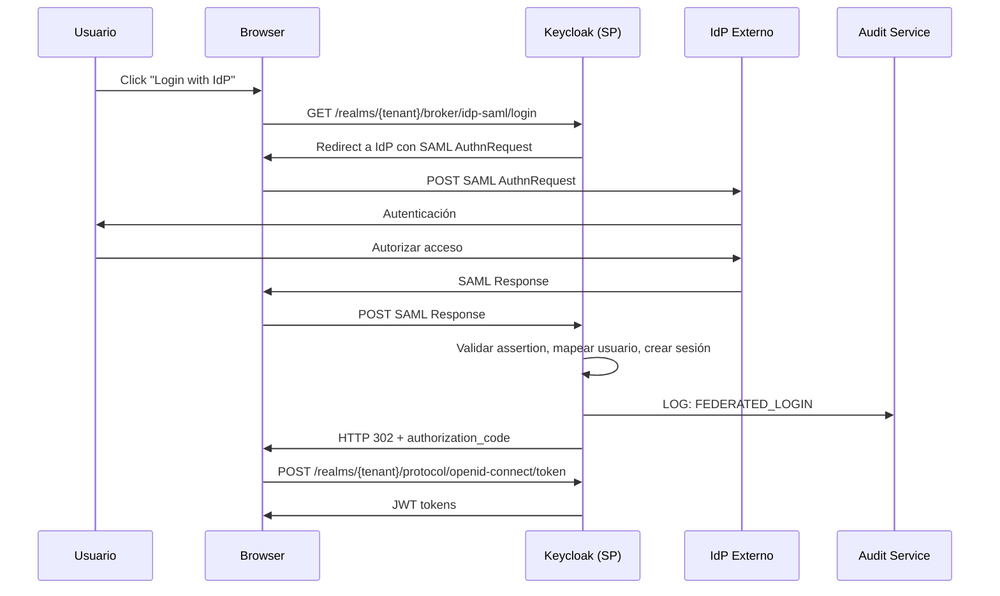

# 6. Vista de Tiempo de Ejecución

## Escenario: Autenticación con MFA

### Manejo de Errores

| Escenario             | Respuesta | Recuperación                            |
| --------------------- | --------- | --------------------------------------- |
| LDAP no disponible    | HTTP 503  | Fallback a usuarios locales             |
| MFA fallido (3 veces) | Lockout   | Email de desbloqueo                     |
| Audit Service caído   | Continuar | Almacenamiento local y replay posterior |

## Escenario: Federación SAML

